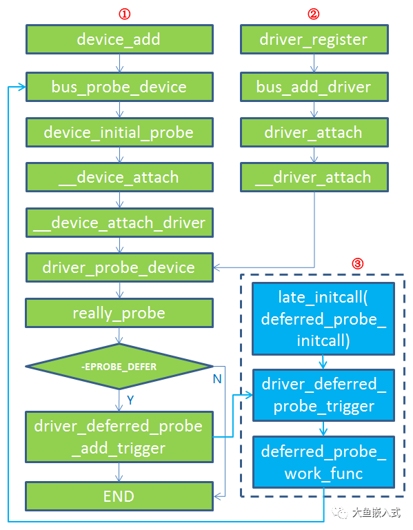

# 概述

probe defer延迟机制，让probe轮询起来。

# driver probe defer延迟机制

kernel 下有多个独立的驱动，每个驱动或多或少地会引用到其他驱动提供的资源，比如某个外设驱动需要使用 gpio 资源，就会通过 gpio 驱动提供的函数接口去申请 gpio；但是当A驱动引用B驱动提供的资源时，B驱动可能还没有工作起来，为了解决驱动之间的这种依赖关系，kernel 设计了 driver-deferred-probe 机制：某个驱动在 probe 过程中，如果遇到依赖的资源还没有准备好，那么就返回 -EPRBOE_DEFER，kernel 检测到该驱动返回的是  -EPRBOE_DEFER，就会在过一段时间后让该驱动再次 probe。


如上图代码，可以根据打印得知，probe跑了两次才获取到对应的typec设备，两次probe的间隔大概是3s。
```shell
[    2.663660] xxx_CHG: xxx_charger_probe: starts
[    2.668256] charger soc:charger: xxx_charger_probe (0.0.1) probe_cnt = 1
[    2.675194] charger soc:charger: xxx_charger_probe get tcpc dev fail

[    5.583672] xxx_CHG: xxx_charger_probe: starts
[    5.588213] charger soc:charger: xxx_charger_probe (0.0.1) probe_cnt = 2
[    5.595207] xxx_CHG: found Basic
[    5.598723] bms_notify_register_client
[    5.602512] charger soc:charger: xxx_charger_probe OK!!
```

# 参考

* [kernel driver probe defer机制](https://blog.csdn.net/u010443710/article/details/120023298)

# 流程

* driver-deferred-probe 流程如下图所示，有三条可能的路径：
  * 生成新的 device 时
  * 注册新的 driver 时
  * later_initcall 主动再次触发



* `drivers/i2c/i2c-core-base.c`:
```C++
* i2c_add_driver(driver)
  └── i2c_register_driver(THIS_MODULE, driver)
      └── driver_register(&driver->driver);
          └── ret = bus_add_driver(drv);
              └── driver_attach(drv);
                  └── bus_for_each_dev(drv->bus, NULL, drv, __driver_attach);//就是对已经添加到drv->bus上面的每个设备操作
                      └── while (!error && (dev = next_device(&i))) error = fn(dev, data); //形参fn表示__driver_attach，也就是对每个设备执行__driver_attach
                          ├── ret = driver_match_device(drv, dev);
                          ├── if (ret == 0) return 0; //未匹配
                          ├── else if (ret == -EPROBE_DEFER) 
                          │   └── driver_deferred_probe_add(dev);
                          │       └── list_add_tail(&dev->p->deferred_probe, &deferred_probe_pending_list); //用来记录哪些驱动被 deferred probe
                          └── if (!dev->p->dead && !dev->driver)
                              └── driver_probe_device(drv, dev);
                                  └── ret = really_probe(dev, drv); //drivers/base/dd.c
                                      ├── ret = device_links_check_suppliers(dev); //
                                      ├── if (ret == -EPROBE_DEFER)
                                      │   └── driver_deferred_probe_add_trigger(dev, local_trigger_count);
                                      │       └── driver_deferred_probe_trigger();
                                      │           └── schedule_work(&deferred_probe_work);// 用来调度相应的 work func 来执行 deferred probe 动作
                                      │               └── deferred_probe_work_func(struct work_struct *work)//Retry probing devices in the active list.
                                      │                   └── bus_probe_device(dev); //重新调度probe函数
                                      └── driver_bound(dev);
                                          └── driver_deferred_probe_trigger();
```

有了 driver-deferred-probe 机制后，编写驱动程序时，除了某些驱动有严格的执行次序，需要特意去定义 initcall 等级之外，一般的驱动则无需太过关心驱动间的依赖，从而在一定程度上简化了驱动开发。

以上就是对 EPRBOE_DEFER 的简要介绍。