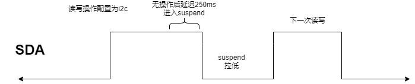

# 概述

高通平台i2c总线初始化和其他平台不同，休眠时会将pinctrl配置为gpio并且禁止上下拉，也就是SDA/SCL拉低了，看一下流程。

# 参考

* [Linux电源管理-Runtime PM](https://blog.csdn.net/eliot_shao/article/details/103116810)
* [Linux电源管理(11)_Runtime PM之功能描述](http://www.javashuo.com/article/p-flxcrhmg-ko.html)
* [Runtime PM 处理不当导致的 external abort on non-linefetch 案例分享](https://www.cnblogs.com/bigfish0506/p/14843328.html)

# Runtime PM详解

*  什么是Runtime PM
Runtime PM (Runtime Power Management)翻译过来就是运行时电源管理。每个设备（包括芯片内部件）各自处理好自身的电源管理工作，在不需要工作的时候尽量进入低功耗状态，在需要工作时又重新起来。这样即使整个系统没有进入睡眠的情况下，设备自身也可以根据实际工作情况决定是否要进入低功耗状态，达到尽量省电的目的。

* 为什么需要Runtime PM
system suspend需要很长时间完成，其中还可能出现失败。比如freeze task的时候。而suspend设备速度相对system suspend快很对，而且还不需要freeze task。当设备不忙的时候就进入自己的低功耗模式，这样一来每个device(包括CPU) 都做好自己的事，整个系统就达到最大节省能源。这时候突然想起了一句话"只要人人都献出一片爱，世界将变成美好的人间"。

# Runtime PM历程

落实到代码上，当需要设备工作时，通过调用 pm_runtime_get_sync 让设备 runtime resume；当工作完成后，通过调用 pm_runtime_put 让设备 runtime suspend，伪代码如下：

* 发送数据：
```c
senddata()
{
    pm_runtime_get_sync()
    do something ...
    pm_runtime_put()
}
```

* 接收数据：
```c
recvdata()
{
    pm_runtime_get_sync()
    do something ...
    pm_runtime_put()
}
```

pm_runtime_get_sync 和 pm_runtime_put 会维护一个引用计数，pm_runtime_get_sync 会增加引用计数，pm_runtime_put 会减少引用计数，当引用计数为0时，才会真正让设备进入低功耗。

Runtime PM 的概念是比较直观的，对于某个设备来说，就是谁需要我工作，就 get 我，否则就 put 我。但是提供的函数接口有点多，本文的重点不在这里，就不一一介绍了，常用的如下：

* pm_runtime_get_sync //请求
* pm_runtime_put //释放
* pm_runtime_use_autosuspend //启用auto-suspend
* pm_runtime_set_autosuspend_delay //设置多久之后auto-suspend
* pm_runtime_put_autosuspend //带auto-suspend的释放
* pm_runtime_mark_last_busy //重置auto-suspend时间计数
* pm_runtime_set_active/pm_runtime_set_suspended(设置设备的runtime运行状态)

Runtime PM 调用的时机，需要设备驱动仔细地处理，不然可能引发功耗问题或者系统异常。
* 如果控制的粒度太细，比如封装一个寄存器读写接口，每次去读写这个设备的寄存器时，都先 get 再 put，那未免代价太高了；
* 如果控制的粒度太粗，比如设备驱动起来后就一直 get，直到系统 suspend 才 put，那就和传统的电源管理差不多了，失去了 Runtime PM 的意义。
* 如果 get / put 接口没有成对调用，比如 get 的次数大于 put 的次数，那设备就进不了低功耗。
* 如果 put 的时机不太合适，导致设备下电后仍然有代码访问设备，那么就可能出现异常。

# dts

```log
scuba-qupv3.dtsi:
    qupv3_se0_i2c: i2c@4a80000 {
        compatible = "qcom,i2c-geni";
        reg = <0x4a80000 0x4000>;
        #address-cells = <1>;
        #size-cells = <0>;
        interrupts = <GIC_SPI 327 IRQ_TYPE_LEVEL_HIGH>;
        clock-names = "se-clk", "m-ahb", "s-ahb";
        clocks = <&gcc GCC_QUPV3_WRAP0_S0_CLK>,
            <&gcc GCC_QUPV3_WRAP_0_M_AHB_CLK>,
            <&gcc GCC_QUPV3_WRAP_0_S_AHB_CLK>;
        pinctrl-names = "default", "sleep";
        pinctrl-0 = <&qupv3_se0_i2c_active>;
        pinctrl-1 = <&qupv3_se0_i2c_sleep>;
        dmas = <&gpi_dma0 0 0 3 64 0>,
            <&gpi_dma0 1 0 3 64 0>;
        dma-names = "tx", "rx";
        qcom,wrapper-core = <&qupv3_0>;
        status = "disabled";
    };

scuba-pinctrl.dtsi:
        qupv3_se0_i2c_pins: qupv3_se0_i2c_pins {
            qupv3_se0_i2c_active: qupv3_se0_i2c_active {
                mux {
                    pins = "gpio0", "gpio1";
                    function = "qup0";
                };

                config {
                    pins = "gpio0", "gpio1";
                    drive-strength = <2>;
                    bias-pull-up;
                };
            };

            qupv3_se0_i2c_sleep: qupv3_se0_i2c_sleep {
                mux {
                    pins = "gpio0", "gpio1";
                    function = "qup0";
                };

                config {
                    pins = "gpio0", "gpio1";
                    drive-strength = <2>;
                    bias-pull-up;
                };
            };
        };
```

# 代码分析

* `bengal_defconfig`:
```
359:CONFIG_I2C_CHARDEV=y
360:CONFIG_I2C_QCOM_GENI=y
```

* `UM.9.15/kernel/msm-4.19/drivers/i2c/Makefile`i2c相关的代码：
```makefile
obj-$(CONFIG_I2C)       += i2c-core.o
i2c-core-objs           := i2c-core-base.o i2c-core-smbus.o
obj-$(CONFIG_I2C_CHARDEV)   += i2c-dev.o
obj-y               += algos/ busses/ muxes/

# busses/Makefile
obj-$(CONFIG_I2C_QCOM_GENI)  += i2c-qcom-geni.o
```

* `UM.9.15/kernel/msm-4.19/drivers/i2c/busses/i2c-qcom-geni.c`:
```c
#define I2C_AUTO_SUSPEND_DELAY  250

static const struct i2c_algorithm geni_i2c_algo = {
	.master_xfer	= geni_i2c_xfer,
	.functionality	= geni_i2c_func,
};

static int geni_i2c_probe(struct platform_device *pdev)
{
	gi2c->i2c_rsc.geni_pinctrl = devm_pinctrl_get(&pdev->dev);
	if (IS_ERR_OR_NULL(gi2c->i2c_rsc.geni_pinctrl)) {
		dev_err(&pdev->dev, "No pinctrl config specified\n");
		ret = PTR_ERR(gi2c->i2c_rsc.geni_pinctrl);
		return ret;
	}
	gi2c->i2c_rsc.geni_gpio_active =
		pinctrl_lookup_state(gi2c->i2c_rsc.geni_pinctrl,
							PINCTRL_DEFAULT);
	if (IS_ERR_OR_NULL(gi2c->i2c_rsc.geni_gpio_active)) {
		dev_err(&pdev->dev, "No default config specified\n");
		ret = PTR_ERR(gi2c->i2c_rsc.geni_gpio_active);
		return ret;
	}
	gi2c->i2c_rsc.geni_gpio_sleep =
		pinctrl_lookup_state(gi2c->i2c_rsc.geni_pinctrl,
							PINCTRL_SLEEP);
	if (IS_ERR_OR_NULL(gi2c->i2c_rsc.geni_gpio_sleep)) {
		dev_err(&pdev->dev, "No sleep config specified\n");
		ret = PTR_ERR(gi2c->i2c_rsc.geni_gpio_sleep);
		return ret;
	}

	if (of_property_read_bool(pdev->dev.of_node, "qcom,shared")) {
		gi2c->is_shared = true;
		dev_info(&pdev->dev, "Multi-EE usecase\n");
	}

	gi2c->adap.algo = &geni_i2c_algo;
	ret = devm_request_irq(gi2c->dev, gi2c->irq, geni_i2c_irq,
			       IRQF_TRIGGER_HIGH, "i2c_geni", gi2c);

	pm_runtime_set_suspended(gi2c->dev);
	pm_runtime_set_autosuspend_delay(gi2c->dev, I2C_AUTO_SUSPEND_DELAY); //250ms后自动休眠
	pm_runtime_use_autosuspend(gi2c->dev);
	pm_runtime_enable(gi2c->dev);
	ret = i2c_add_adapter(&gi2c->adap);
}
```

以上得知：
  * I2C适配器驱动的主要工作就是初始化i2c_adapter结构体变量。
  * 然后设置i2c_algorithm中的master_xfer函数。master_xfer就是I2C适配器的传输函数，可以通过此函数来完成与IIC设备之间的通信。
  * 完成以后通过i2c_add_numbered_adapter或i2c_add_adapter这两个函数向系统注册设置好的i2c_adapter。

# master_xfer pm流程

以下就是i2c读写时的runtime pm流程：
* pm_runtime_get_sync请求
* i2c读写操作省略
* pm_runtime_mark_last_busy 重置auto-suspend时间计数
* pm_runtime_put_autosuspend 带auto-suspend的释放，目前设置的是250ms后休眠

以下是rumtime pm流程图：




```c
static const struct i2c_algorithm geni_i2c_algo = {
	.master_xfer	= geni_i2c_xfer,
	.functionality	= geni_i2c_func,
};


static int geni_i2c_xfer(struct i2c_adapter *adap,
			 struct i2c_msg msgs[],
			 int num)
{
	struct geni_i2c_dev *gi2c = i2c_get_adapdata(adap);
	int i, ret = 0, timeout = 0;

	gi2c->err = 0;

	/* Client to respect system suspend */
	if (!pm_runtime_enabled(gi2c->dev)) {
		GENI_SE_ERR(gi2c->ipcl, false, gi2c->dev,
			"%s: System suspended\n", __func__);
		return -EACCES;
	}

	ret = pm_runtime_get_sync(gi2c->dev);
	if (ret < 0) {
		GENI_SE_ERR(gi2c->ipcl, true, gi2c->dev,
			    "error turning SE resources:%d\n", ret);
		pm_runtime_put_noidle(gi2c->dev);
		/* Set device in suspended since resume failed */
		pm_runtime_set_suspended(gi2c->dev);
		return ret;
	}

    //...省略...

	pm_runtime_mark_last_busy(gi2c->dev);
	pm_runtime_put_autosuspend(gi2c->dev);
	gi2c->cur = NULL;
	gi2c->err = 0;
	GENI_SE_DBG(gi2c->ipcl, false, gi2c->dev,
			"i2c txn ret:%d\n", ret);
	return ret;
}
```

# runtime PM

我们i2c注册了中断，所以不会跑noirq的pm函数：
以上当调用get时会调用geni_i2c_runtime_resume
释放后会调用geni_i2c_runtime_suspend，当配置打开dts中bool类型qcom,shared，只会调用关闭clk函数`se_geni_clks_off`，而se_geni_resources_off才会配置为gpio并拉低。
```c
static int geni_i2c_resume_noirq(struct device *device)
{
	struct geni_i2c_dev *gi2c = dev_get_drvdata(device);

	GENI_SE_DBG(gi2c->ipcl, false, gi2c->dev, "%s\n", __func__);
	return 0;
}

#ifdef CONFIG_PM
static int geni_i2c_runtime_suspend(struct device *dev)
{
	struct geni_i2c_dev *gi2c = dev_get_drvdata(dev);

	if (gi2c->se_mode == FIFO_SE_DMA)
		disable_irq(gi2c->irq);

	if (gi2c->is_shared) {
		/* Do not unconfigure GPIOs if shared se */
		se_geni_clks_off(&gi2c->i2c_rsc);
	} else {
		se_geni_resources_off(&gi2c->i2c_rsc);
	}
	GENI_SE_DBG(gi2c->ipcl, false, gi2c->dev, "%s\n", __func__);
	return 0;
}

static int geni_i2c_runtime_resume(struct device *dev)
{
	int ret;
	struct geni_i2c_dev *gi2c = dev_get_drvdata(dev);

	if (!gi2c->ipcl) {
		char ipc_name[I2C_NAME_SIZE];

		snprintf(ipc_name, I2C_NAME_SIZE, "%s", dev_name(gi2c->dev));
		gi2c->ipcl = ipc_log_context_create(2, ipc_name, 0);
	}

	ret = se_geni_resources_on(&gi2c->i2c_rsc);
	if (ret)
		return ret;

	if (gi2c->se_mode == UNINITIALIZED) {
		int proto = get_se_proto(gi2c->base);
		u32 se_mode;

		if (unlikely(proto != I2C)) {
			dev_err(gi2c->dev, "Invalid proto %d\n", proto);
			se_geni_resources_off(&gi2c->i2c_rsc);
			return -ENXIO;
		}

		se_mode = readl_relaxed(gi2c->base +
					GENI_IF_FIFO_DISABLE_RO);
		if (se_mode) {
			gi2c->se_mode = GSI_ONLY;
			geni_se_select_mode(gi2c->base, GSI_DMA);
			GENI_SE_DBG(gi2c->ipcl, false, gi2c->dev,
					"i2c GSI mode\n");
		} else {
			int gi2c_tx_depth = get_tx_fifo_depth(gi2c->base);

			gi2c->se_mode = FIFO_SE_DMA;
			gi2c->tx_wm = gi2c_tx_depth - 1;
			geni_se_init(gi2c->base, gi2c->tx_wm, gi2c_tx_depth);
			se_config_packing(gi2c->base, 8, 4, true);
			qcom_geni_i2c_conf(gi2c, 0);
			GENI_SE_DBG(gi2c->ipcl, false, gi2c->dev,
				    "i2c fifo/se-dma mode. fifo depth:%d\n",
				    gi2c_tx_depth);
		}
		GENI_SE_DBG(gi2c->ipcl, false, gi2c->dev, "i2c-%d: %s\n",
			gi2c->adap.nr, dev_name(gi2c->dev));
	}

	if (gi2c->se_mode == FIFO_SE_DMA)
		enable_irq(gi2c->irq);

	GENI_SE_DBG(gi2c->ipcl, false, gi2c->dev, "%s\n", __func__);
	return 0;
}

static int geni_i2c_suspend_noirq(struct device *device)
{
	struct geni_i2c_dev *gi2c = dev_get_drvdata(device);
	int ret;

	/* Make sure no transactions are pending */
	ret = i2c_trylock_bus(&gi2c->adap, I2C_LOCK_SEGMENT);
	if (!ret) {
		GENI_SE_ERR(gi2c->ipcl, true, gi2c->dev,
				"late I2C transaction request\n");
		return -EBUSY;
	}
	if (!pm_runtime_status_suspended(device)) {
		GENI_SE_DBG(gi2c->ipcl, false, gi2c->dev,
			"%s\n", __func__);
		geni_i2c_runtime_suspend(device);
		pm_runtime_disable(device);
		pm_runtime_set_suspended(device);
		pm_runtime_enable(device);
	}
	i2c_unlock_bus(&gi2c->adap, I2C_LOCK_SEGMENT);
	return 0;
}

static const struct dev_pm_ops geni_i2c_pm_ops = {
	.suspend_noirq		= geni_i2c_suspend_noirq,
	.resume_noirq		= geni_i2c_resume_noirq,
	.runtime_suspend	= geni_i2c_runtime_suspend,
	.runtime_resume		= geni_i2c_runtime_resume,
};

static const struct of_device_id geni_i2c_dt_match[] = {
	{ .compatible = "qcom,i2c-geni" },
	{}
};
MODULE_DEVICE_TABLE(of, geni_i2c_dt_match);

static struct platform_driver geni_i2c_driver = {
	.probe  = geni_i2c_probe,
	.remove = geni_i2c_remove,
	.driver = {
		.name = "i2c_geni",
		.pm = &geni_i2c_pm_ops,
		.of_match_table = geni_i2c_dt_match,
	},
};
```

* 关闭资源函数：
```c
/**
 * se_geni_clks_off() - Turn off clocks associated with the serial
 *                      engine
 * @rsc:	Handle to resources associated with the serial engine.
 *
 * Return:	0 on success, standard Linux error codes on failure/error.
 */
int se_geni_clks_off(struct se_geni_rsc *rsc)
{
	int ret = 0;
	struct geni_se_device *geni_se_dev;

	if (unlikely(!rsc || !rsc->wrapper_dev))
		return -EINVAL;

	geni_se_dev = dev_get_drvdata(rsc->wrapper_dev);
	if (unlikely(!geni_se_dev))
		return -ENODEV;

	clk_disable_unprepare(rsc->se_clk);
	clk_disable_unprepare(rsc->s_ahb_clk);
	clk_disable_unprepare(rsc->m_ahb_clk);

	ret = geni_se_rmv_ab_ib(geni_se_dev, rsc);
	if (ret)
		GENI_SE_ERR(geni_se_dev->log_ctx, false, NULL,
			"%s: Error %d during bus_bw_update\n", __func__, ret);

	return ret;
}
EXPORT_SYMBOL(se_geni_clks_off);

/**
 * se_geni_resources_off() - Turn off resources associated with the serial
 *                           engine
 * @rsc:	Handle to resources associated with the serial engine.
 *
 * Return:	0 on success, standard Linux error codes on failure/error.
 */
int se_geni_resources_off(struct se_geni_rsc *rsc)
{
	int ret = 0;
	struct geni_se_device *geni_se_dev;

	if (unlikely(!rsc || !rsc->wrapper_dev))
		return -EINVAL;

	geni_se_dev = dev_get_drvdata(rsc->wrapper_dev);
	if (unlikely(!geni_se_dev))
		return -ENODEV;

	ret = se_geni_clks_off(rsc);
	if (ret)
		GENI_SE_ERR(geni_se_dev->log_ctx, false, NULL,
			"%s: Error %d turning off clocks\n", __func__, ret);
	ret = pinctrl_select_state(rsc->geni_pinctrl, rsc->geni_gpio_sleep); //配置gpio
	if (ret)
		GENI_SE_ERR(geni_se_dev->log_ctx, false, NULL,
			"%s: Error %d pinctrl_select_state\n", __func__, ret);
	return ret;
}
EXPORT_SYMBOL(se_geni_resources_off);
```