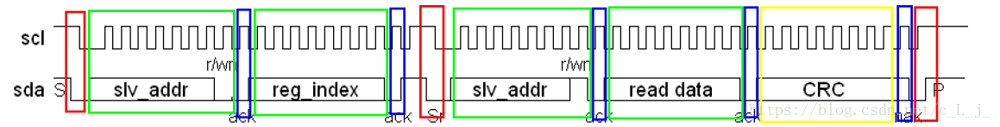
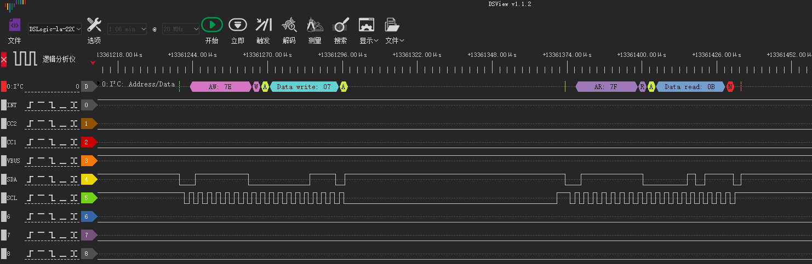
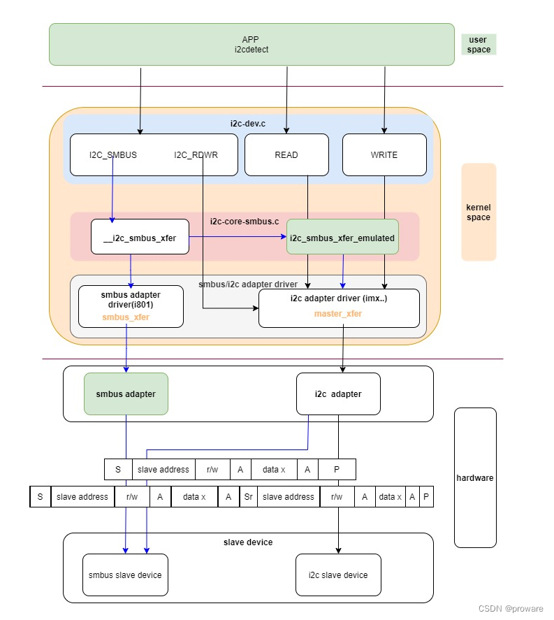

# linux i2c偶发读取错误数据问题分析

发现charger i2c老是读取的数据由问题，分析一下

# 参考

* [关于I2C的那点事：i2c_master_send 和 i2c_master_recv i2c_transfer](https://blog.csdn.net/c_L_j_/article/details/80845083)
* [linux i2c smbus驱动](https://blog.csdn.net/proware/article/details/124938779)

# 现象

```log
行 102041: 04-03 02:32:00.831 E/PAX_CHG (    0): sgm41528_info Reg[0x01] = 0x0a
行 102090: 04-03 02:32:05.830 E/PAX_CHG (    0): sgm41528_info Reg[0x01] = 0x0a
行 102139: 04-03 02:32:10.835 E/PAX_CHG (    0): sgm41528_info Reg[0x01] = 0x0a
行 102185: 04-03 02:32:15.833 E/PAX_CHG (    0): sgm41528_info Reg[0x01] = 0x0a
行 102233: 04-03 02:32:20.834 E/PAX_CHG (    0): sgm41528_info Reg[0x01] = 0x0a
行 102279: 04-03 02:32:25.842 E/PAX_CHG (    0): sgm41528_info Reg[0x01] = 0xd0 //错误数据
行 102327: 04-03 02:32:30.836 E/PAX_CHG (    0): sgm41528_info Reg[0x01] = 0x0a
行 102375: 04-03 02:32:35.845 E/PAX_CHG (    0): sgm41528_info Reg[0x01] = 0x0a
行 102420: 04-03 02:32:40.837 E/PAX_CHG (    0): sgm41528_info Reg[0x01] = 0x0a
行 102468: 04-03 02:32:45.839 E/PAX_CHG (    0): sgm41528_info Reg[0x01] = 0x0a
行 102516: 04-03 02:32:50.842 E/PAX_CHG (    0): sgm41528_info Reg[0x01] = 0x0a
行 102562: 04-03 02:32:55.843 E/PAX_CHG (    0): sgm41528_info Reg[0x01] = 0x0a
```

# i2c读取接口

* `drivers/misc/pax/power/sgm41528_charger.c`:
```c
static int sgm41528_read_byte(u8 *data, u8 reg)
{
	unsigned char buf[2] = {0};
	struct i2c_client *client = g_sgm41528_info->client;
	s32 ret;

	buf[0] = reg;

	*data = (u8) ret;

	if (1 != i2c_master_send(client, buf, 1)) {//第一次寻址，将reg写入
		sgm41528_set_i2c_fault_status();
		chr_err("%s, send reg[%x] fail\n", __func__, reg);
		return -1;
	}

	sgm41528_reset_i2c_fault_cnt();

	if (1 != i2c_master_recv(client, buf, 1)) {//第二次寻址，接收reg值
		sgm41528_set_i2c_fault_status();
		chr_err("%s, recv reg[%x] fail\n", __func__, reg);
		return -1;
	}

	sgm41528_reset_i2c_fault_cnt();

	//chr_debug(" recv reg[%x]: %02x\n", reg, buf[0]);
	*data = buf[0];

	return 0;
}
```

可以看到是通过i2c_master_send 和 i2c_master_recv接口进行读取，该过程进行了2次寻址操作，如下：



通过分解后的时序图，可以看到i2c的读数据由以下13个步骤组成。 
* 第一步，发送一个起始信号。 
* 第二步，发送7bit从机地址，即i2c的地址。此处需要注意，发送数据时，无法发送7bit数据，此处发送了7bit地址+1bit读写选择位，即发送7bit+r/w。最低位为1表示读,为0表示写。 
* 第三步，产生一个ACK应答信号，此应答信号为从机器件产生的应答。 
* 第四步，发送寄存器地址。 
* 第五步，产生一个ACK应答信号，此应答信号为从机器件产生的应答。 
* 第六步，再次发送一个起始信号。 
* 第七步，发送7bit从机地址，即i2c的地址。此处需要注意，发送数据时，无法发送7bit数据，此处发送了7bit地址+1bit读写选择位，即发送7bit+r/w。最低位为1表示读,为0表示写。 
* 第八步，产生一个ACK应答信号，此应答信号为从机器件产生的应答。 
* 第九步，读取一个字节(8bit)的数据。 
* 第十步，产生一个ACK应答信号，此应答信号为CPU产生。 
* 第十一步，读取一个CRC校验码。 
* 第十二步，产生一个NACK信号。此无应答信号由CPU产生。 
* 第十三步，产生一个停止信号。

实际逻辑图如下：



# 解决方案

采用SMBUS i2c接口替换i2c_master_send和i2c_master_recv接口，稳定性更高，具体原因未知
```diff
--- a/UM.9.15/kernel/msm-4.19/drivers/misc/pax/power/sgm41528_charger.c
+++ b/UM.9.15/kernel/msm-4.19/drivers/misc/pax/power/sgm41528_charger.c
@@ -63,11 +63,25 @@ static void sgm41528_reset_i2c_fault_cnt(void)

 static int sgm41528_read_byte(u8 *data, u8 reg)
 {
-       unsigned char buf[2] = {0};
+       //unsigned char buf[2] = {0};
        struct i2c_client *client = g_sgm41528_info->client;
+       s32 ret;

+
+       ret = i2c_smbus_read_byte_data(client, reg);
+       if (ret < 0) {
+               sgm41528_set_i2c_fault_status();
+               chr_err("%s, send reg[%x] fail\n", __func__, reg);
+        return ret;
+    }
+
+       sgm41528_reset_i2c_fault_cnt();
+       *data = (u8) ret;
+       /*
        buf[0] = reg;

+       *data = (u8) ret;
+
        if (1 != i2c_master_send(client, buf, 1)) {
                sgm41528_set_i2c_fault_status();
                chr_err("%s, send reg[%x] fail\n", __func__, reg);
@@ -86,15 +100,25 @@ static int sgm41528_read_byte(u8 *data, u8 reg)

        //chr_debug(" recv reg[%x]: %02x\n", reg, buf[0]);
        *data = buf[0];
+       */

        return 0;
 }
```

# 接口不同点分析

首先看一下i2c配置：
* `bengal_defconfig`:
```
359:CONFIG_I2C_CHARDEV=y
360:CONFIG_I2C_QCOM_GENI=y
```

* `UM.9.15/kernel/msm-4.19/drivers/i2c/Makefile`i2c相关的代码：
```makefile
obj-$(CONFIG_I2C)       += i2c-core.o
i2c-core-objs           := i2c-core-base.o i2c-core-smbus.o
obj-$(CONFIG_I2C_CHARDEV)   += i2c-dev.o
obj-y               += algos/ busses/ muxes/

# busses/Makefile
obj-$(CONFIG_I2C_QCOM_GENI)  += i2c-qcom-geni.o
```

* `busses/i2c-qcom-geni.c`:
```c
static const struct i2c_algorithm geni_i2c_algo = {
    .master_xfer    = geni_i2c_xfer,
    .functionality  = geni_i2c_func,
};
```

如果控制器支持smbus协议，则对应的驱动设置收发接口smbus_xfer，可以看到这里没有配置，所以我们分别来看一下`i2c_smbus_read_byte_data`和`i2c_master_recv`调用流程吧，可能是这里的区别导致：

```c
* i2c_master_recv
  └── i2c_transfer_buffer_flags(client, buf, count, I2C_M_RD);
      └── i2c_transfer(client->adapter, &msg, 1); //drivers/i2c/i2c-core-base.c
          └── __i2c_transfer(adap, msgs, num);
              └── adap->algo->master_xfer(adap, msgs, num);
                  └── geni_i2c_xfer //busses/i2c-qcom-geni.c 调用到adapter算法
```

* `drivers/i2c/i2c-core-smbus.c`我们不支持`smbus_xfer`接口，最终调用的是`i2c_smbus_xfer_emulated`:
```
* i2c_smbus_read_byte_data
  └── i2c_smbus_xfer(client->adapter, client->addr, client->flags,
      └── __i2c_smbus_xfer(adapter, addr, flags, read_write,
          ├── if (adapter->algo->smbus_xfer)
          │   ├── res = adapter->algo->smbus_xfer(adapter, addr, flags,
          │   └── goto trace;
          └── else i2c_smbus_xfer_emulated(adapter, addr, flags, read_write,
```

再详细看一下i2c_smbus_xfer_emulated函数，看注释是利用i2c接口`__i2c_transfer`来模拟smbus：
```c
/*
 * Simulate a SMBus command using the I2C protocol.
 * No checking of parameters is done!
 */
static s32 i2c_smbus_xfer_emulated(struct i2c_adapter *adapter, u16 addr,
                   unsigned short flags,
                   char read_write, u8 command, int size,
                   union i2c_smbus_data *data)
{
    /*
     * So we need to generate a series of msgs. In the case of writing, we
     * need to use only one message; when reading, we need two. We
     * initialize most things with sane defaults, to keep the code below
     * somewhat simpler.
     */
    unsigned char msgbuf0[I2C_SMBUS_BLOCK_MAX+3];
    unsigned char msgbuf1[I2C_SMBUS_BLOCK_MAX+2];
    int num = read_write == I2C_SMBUS_READ ? 2 : 1;
    int i;
    u8 partial_pec = 0;
    int status;
    struct i2c_msg msg[2] = {
        {
            .addr = addr,
            .flags = flags,
            .len = 1,
            .buf = msgbuf0,
        }, {
            .addr = addr,
            .flags = flags | I2C_M_RD,
            .len = 0,
            .buf = msgbuf1,
        },
    };

    msgbuf0[0] = command;
    switch (size) {
    case I2C_SMBUS_QUICK:
        msg[0].len = 0;
        /* Special case: The read/write field is used as data */
        msg[0].flags = flags | (read_write == I2C_SMBUS_READ ?
                    I2C_M_RD : 0);
        num = 1;
        break;
    case I2C_SMBUS_BYTE:
        if (read_write == I2C_SMBUS_READ) {
            /* Special case: only a read! */
            msg[0].flags = I2C_M_RD | flags;
            num = 1;
        }
        break;
    case I2C_SMBUS_BYTE_DATA:
        if (read_write == I2C_SMBUS_READ)
            msg[1].len = 1;
        else {
            msg[0].len = 2;
        }
        break;
    case I2C_SMBUS_WORD_DATA:
        if (read_write == I2C_SMBUS_READ)
            msg[1].len = 2;
        else {
            msg[0].len = 3;
            msgbuf0[1] = data->word & 0xff;
            msgbuf0[2] = data->word >> 8;
        }
        break;
    case I2C_SMBUS_PROC_CALL:
        num = 2; /* Special case */
        read_write = I2C_SMBUS_READ;
        msg[0].len = 3;
        msg[1].len = 2;
        msgbuf0[1] = data->word & 0xff;
        msgbuf0[2] = data->word >> 8;
        break;
    case I2C_SMBUS_BLOCK_DATA:
        if (read_write == I2C_SMBUS_READ) {
            msg[1].flags |= I2C_M_RECV_LEN;
            msg[1].len = 1; /* block length will be added by
                       the underlying bus driver */
            i2c_smbus_try_get_dmabuf(&msg[1], 0);
        } else {
            msg[0].len = data->block[0] + 2;
            if (msg[0].len > I2C_SMBUS_BLOCK_MAX + 2) {
                dev_err(&adapter->dev,
                    "Invalid block write size %d\n",
                    data->block[0]);
                return -EINVAL;
            }

            i2c_smbus_try_get_dmabuf(&msg[0], command);
            for (i = 1; i < msg[0].len; i++)
                msg[0].buf[i] = data->block[i - 1];
        }
        break;
    case I2C_SMBUS_BLOCK_PROC_CALL:
        num = 2; /* Another special case */
        read_write = I2C_SMBUS_READ;
        if (data->block[0] > I2C_SMBUS_BLOCK_MAX) {
            dev_err(&adapter->dev,
                "Invalid block write size %d\n",
                data->block[0]);
            return -EINVAL;
        }

        msg[0].len = data->block[0] + 2;
        i2c_smbus_try_get_dmabuf(&msg[0], command);
        for (i = 1; i < msg[0].len; i++)
            msg[0].buf[i] = data->block[i - 1];

        msg[1].flags |= I2C_M_RECV_LEN;
        msg[1].len = 1; /* block length will be added by
                   the underlying bus driver */
        i2c_smbus_try_get_dmabuf(&msg[1], 0);
        break;
    case I2C_SMBUS_I2C_BLOCK_DATA:
        if (data->block[0] > I2C_SMBUS_BLOCK_MAX) {
            dev_err(&adapter->dev, "Invalid block %s size %d\n",
                read_write == I2C_SMBUS_READ ? "read" : "write",
                data->block[0]);
            return -EINVAL;
        }

        if (read_write == I2C_SMBUS_READ) {
            msg[1].len = data->block[0];
            i2c_smbus_try_get_dmabuf(&msg[1], 0);
        } else {
            msg[0].len = data->block[0] + 1;

            i2c_smbus_try_get_dmabuf(&msg[0], command);
            for (i = 1; i <= data->block[0]; i++)
                msg[0].buf[i] = data->block[i];
        }
        break;
    default:
        dev_err(&adapter->dev, "Unsupported transaction %d\n", size);
        return -EOPNOTSUPP;
    }

    i = ((flags & I2C_CLIENT_PEC) && size != I2C_SMBUS_QUICK
                      && size != I2C_SMBUS_I2C_BLOCK_DATA);
    if (i) {
        /* Compute PEC if first message is a write */
        if (!(msg[0].flags & I2C_M_RD)) {
            if (num == 1) /* Write only */
                i2c_smbus_add_pec(&msg[0]);
            else /* Write followed by read */
                partial_pec = i2c_smbus_msg_pec(0, &msg[0]);
        }
        /* Ask for PEC if last message is a read */
        if (msg[num-1].flags & I2C_M_RD)
            msg[num-1].len++;
    }

    status = __i2c_transfer(adapter, msg, num);
    if (status < 0)
        goto cleanup;
    if (status != num) {
        status = -EIO;
        goto cleanup;
    }
    status = 0;

    /* Check PEC if last message is a read */
    if (i && (msg[num-1].flags & I2C_M_RD)) {
        status = i2c_smbus_check_pec(partial_pec, &msg[num-1]);
        if (status < 0)
            goto cleanup;
    }

    if (read_write == I2C_SMBUS_READ)
        switch (size) {
        case I2C_SMBUS_BYTE:
            data->byte = msgbuf0[0];
            break;
        case I2C_SMBUS_BYTE_DATA:
            data->byte = msgbuf1[0];
            break;
        case I2C_SMBUS_WORD_DATA:
        case I2C_SMBUS_PROC_CALL:
            data->word = msgbuf1[0] | (msgbuf1[1] << 8);
            break;
        case I2C_SMBUS_I2C_BLOCK_DATA:
            for (i = 0; i < data->block[0]; i++)
                data->block[i + 1] = msg[1].buf[i];
            break;
        case I2C_SMBUS_BLOCK_DATA:
        case I2C_SMBUS_BLOCK_PROC_CALL:
            if (msg[1].buf[0] > I2C_SMBUS_BLOCK_MAX) {
                dev_err(&adapter->dev,
                    "Invalid block size returned: %d\n",
                    msg[1].buf[0]);
                status = -EPROTO;
                goto cleanup;
            }
            for (i = 0; i < msg[1].buf[0] + 1; i++)
                data->block[i] = msg[1].buf[i];
            break;
        }

cleanup:
    if (msg[0].flags & I2C_M_DMA_SAFE)
        kfree(msg[0].buf);
    if (msg[1].flags & I2C_M_DMA_SAFE)
        kfree(msg[1].buf);

    return status;
}
```
具体如何模拟的不深入分析了，反正这个接口就是比直接调用`i2c_master_recv`稳定。。

# i2c/smbus数据传输调用流程图


