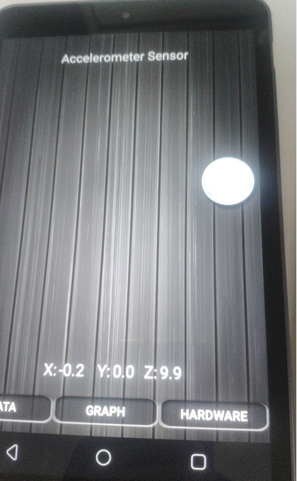
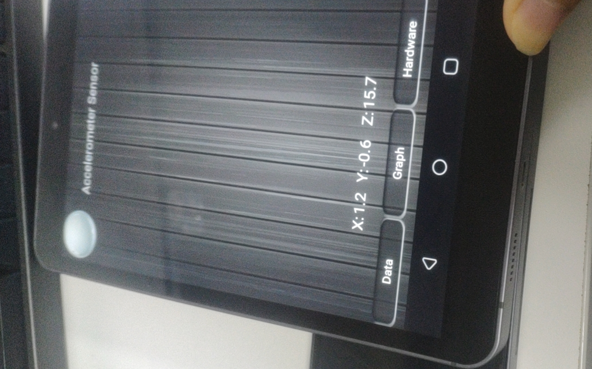
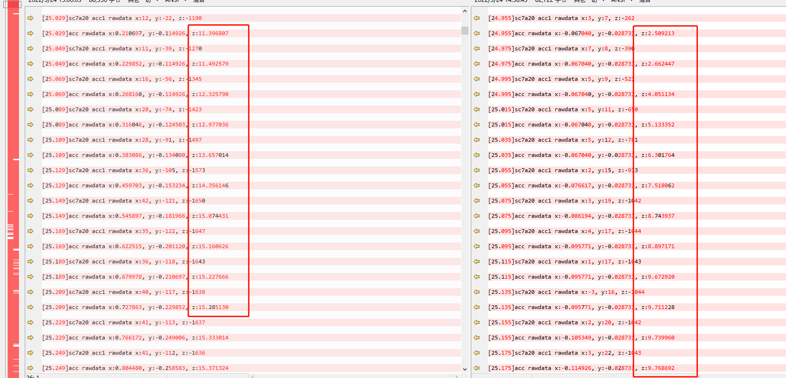

# Accel Sensor 分析

Accel Sensor 驱动分析


## 参考

* [sensor_all_in_one.pdf](refer/sensor_all_in_one.pdf)

* [CS6853-BD9D-PGD-V1.7EN_MT6853_SCP_Development_Guide.pdf](CS6853-BD9D-PGD-V1.7EN_MT6853_SCP_Development_Guide.pdf refer/CS6853-BD9D-PGD-V1.7EN_MT6853_SCP_Development_Guide.pdf)

## 代码分析

* dts：

```
accel sensor:
&cust_accel_sc7a20 {
		i2c_num					= <1>;
		i2c_addr				= <0x18 0 0 0>;
		direction				= <7>;
		power_id				= <0xffff>;
		power_vol				= <0>;
		firlen					= <0>;
		is_batch_supported			= <0>;
};

&i2c1 {
	gsensor_sc7a20@18 {
		compatible = "mediatek,gsensor_sc7a20";
		reg = <0x18>;
		status = "okay";
	};
}
```

## debug调试

* acc sensorhub调通后，scp打印如下：

```log
----- timezone:Asia/Shanghai
8 overlay remap fail

[0.017]contexthub_fw_start tid: 268

[0.017]accGyro: app start

[0.017]sc7a20ResetRead

[0.017]alsps: app start

[0.017]initSensors:   not ready!

[0.017]LIFT EVT_APP_START

[0.017]TILT EVT_APP_START

[0.017]STEP_RECOGNITION EVT_APP_START

[0.017]alsPs: init done

[0.017]read before sc7a20ResetWrite

[0.028]sc7a20DeviceId

[0.028]sc7a20 acc reso: 0, sensitivity: 1024

[0.028]sc7a20RegisterCore deviceId 0x11


[0.028]accGyro: init done

[0.518]initSensors: alloc blocks number:219

[0.520]get dram phy addr=0x8d000000,size=1048520, maxEventNumber:23830

[0.520]get dram phy rp=0,wp=0

[2.029]frequency request: 65535 MHz => 250 MHz

[2.829]sync time scp:2829537083, ap:4316042615, offset:1486968532

[8.765]hostintf: 8765761097, chreType:1, rate:0, latency:0, cmd:3!

[8.765]sensorCfgAcc:

[8.765]bias: 0.000000, 0.000000, 0.000000

[8.765]cali: 0, 0, 0

[8.765][MPEKlib]: MPE_CAL_A_VER_18082801

[8.765]sc7a20AccCfgCali: cfgData[0]:0, cfgData[1]:0, cfgData[2]:0

[8.765]acc: cfg done

```

## 初始化流程

* 首先看初始化流程：

```C++
int sc7a20Init(void)
{
    if (mTask.deviceId != SC7A20_WHO_AM_I_WIA_ID) {  匹配ID
        osLog(LOG_ERROR, "sc7a20: auto detect error wai 0x%x\n", mTask.deviceId);
        ret = -1;
        goto err_out;
    }

    osLog(LOG_INFO, "sc7a20: auto detect success wai 0x%x\n", mTask.deviceId);
    accSensorRegister();
	配置数据上传类型：
	ACC_GYRO_FIFO_UNINTERRUPTIBLE  FIFO型
	ACC_GYRO_FIFO_INTERRUPTIBLE   中断FIFO
	GYRO_ONLY_FIFO_INTERRUPTIBLE 只有陀螺仪FIFO中断
    registerAccGyroInterruptMode(ACC_GYRO_FIFO_UNINTERRUPTIBLE);  
	注册FSM函数
    * registerAccGyroDriverFsm(sc7a20Fsm, ARRAY_SIZE(sc7a20Fsm));
	  * osEnqueuePrivateEvt(EVT_APP_START, NULL, NULL, mTask.id);
	    * sensorFsmRunState(&dataInfo, &mTask.fsm, (const void *)CHIP_RESET, &i2cCallback, &spiCallback);
	    /* init state */
    	  * sensorFsmCmd(STATE_RESET_R, STATE_RESET_W, sc7a20ResetRead),
    	  * sensorFsmCmd(STATE_RESET_W, STATE_DEVID, sc7a20ResetWrite),
    	  * sensorFsmCmd(STATE_DEVID, STATE_CALC_RESO, sc7a20DeviceId),
    	  * sensorFsmCmd(STATE_CALC_RESO, STATE_CORE, sc7a20CalcReso),
    	  * sensorFsmCmd(STATE_CORE, STATE_INIT_DONE, sc7a20RegisterCore),
		    * handleSensorEvent(const void *state) //接下来跑STATE_INIT_DONE
			  * case CHIP_INIT_DONE: {
			    * processPendingEvt();
				  * mSensorOps[handle].sensorCalibrate((void *)handle);  //校准流程
				    * sensorCaliAcc(void *cookie) //校准acc
					  * sc7a20AccCali()  //sc7a20.c
					    * accFactoryCalibrateInit(&mTask.accFactoryCal);
					* sensorCaliGyro(void *cookie) //不支持校准gyro
				  * mSensorOps[handle].sensorCfgData(mTask.mSensorPerUnit[handle].pendCaliCfg,  //cfgdata流程
				    * sensorCfgAcc() 
					  * sc7a20AccCfgCali() //sc7a20.c
					    * mTask.staticCali[AXIS_X] = (float)caliCfgPacket.caliCfgData[0] / 1000;  //赋值一下cali数据，没实际操作
					* sensorCfgGyro()  //不支持Cfggyro
					  * setGyroHwCaliCfg(&values[3]);
					    * sensorFsmRunState(&dataInfo, &mTask.fsm, (const void *)CHIP_GYRO_CFG, &i2cCallback, &spiCallback) //没定义CHIP_GYRO_CFG，也就是说没有陀螺仪校准
				  * mSensorOps[handle].sensorSelfTest((void *)handle);  //自测
				    * sensorSelfTestAcc(void *data)
					  * sensorFsmRunState(&dataInfo, &mTask.fsm, (const void *)CHIP_ACC_SELFTEST, &i2cCallback, &spiCallback)  //没定义CHIP_ACC_SELFTEST,不做
	注册timer callback函数，无
    * registerAccGyroTimerCbk(sc7a20TimerCbkF);	
}

OVERLAY_DECLARE(sc7a20, OVERLAY_WORK_00, sc7a20Init);
```

## 数据上报流程

## 问题点分析

### 1.acc上报数据很卡顿

* 根据设置频率打印如下,使用AKM_sENSORmONITOR看，延时周期为62ms，频率计算为16HZ，太慢了，rate换算应该是除以1000：

```log
[10538.230]hostintf: 10538230206894, chreType:1, rate:15359,  latency:100000000, cmd:2! //设置15HZ
[10538.230]sensorFlushAcc

实际频率：
[11144.090]sc7a20 acc1 rawdata x:-62, y:30, z:-1130
[11144.153]sc7a20 acc1 rawdata x:-57, y:34, z:-1130  // 1/153-90 = 15.87 HZ也正常啊
[11144.215]sc7a20 acc1 rawdata x:-53, y:36, z:-1135

[11144.277]sc7a20 acc1 rawdata x:-49, y:35, z:-1134
[11144.340]sc7a20 acc1 rawdata x:-50, y:26, z:-1135
[11144.403]sc7a20 acc1 rawdata x:-51, y:25, z:-1138

```

* 进一次方向传感器后，正常了：

```log
hostintf: 283048948674, chreType:1, rate:51200, latency:0, cmd:2!
```

* 但是采用kernel驱动方式，延时周期为65ms~66ms，频率是15HZ，不卡顿，难道是频率不匹配导致？继续看看framwork如何定义频率，下面可以看到framework层定义了4中频率，分别是fastest、50HZ/15HZ/5HZ四种：

* `frameworks/native/libs/sensor/SensorEventQueue.cpp`传感器采样频率,是在android注册sensor的时候，会有一个delay的时间，这个时间就是采样的频率。上层注册 API registerListener（listener, sensor,rate）rate 即为时间:
```java

status_t SensorEventQueue::enableSensor(Sensor const* sensor) const {
    return enableSensor(sensor, SENSOR_DELAY_NORMAL);
}

class SensorEventQueue : public ASensorEventQueue, public RefBase
{
public:

    enum { MAX_RECEIVE_BUFFER_EVENT_COUNT = 256 };

    /**
     * Typical sensor delay (sample period) in microseconds.
     */
    // Fastest sampling, system will bound it to minDelay
    static constexpr int32_t SENSOR_DELAY_FASTEST = 0;
    // Typical sample period for game, 50Hz;
    static constexpr int32_t SENSOR_DELAY_GAME = 20000;
    // Typical sample period for UI, 15Hz
    static constexpr int32_t SENSOR_DELAY_UI = 66667;
    // Default sensor sample period
    static constexpr int32_t SENSOR_DELAY_NORMAL = 200000;
	...省略...
}
```

* sensorhub中定义如下：

```C++
static const uint32_t accSupportedRates[] = {
    SENSOR_HZ(5.0f),
    SENSOR_HZ(10.0f),
    SENSOR_HZ(16.0f),
    SENSOR_HZ(50.0f),
    SENSOR_HZ(100.0f),
    SENSOR_HZ(200.0f),
    SENSOR_HZ(400.0f),
    0
};
static const uint64_t rateTimerValsAcc[] = {
//should match "supported rates in length" and be the timer length for that rate in nanosecs
    1000000000ULL / 5,
    1000000000ULL / 10,
    1000000000ULL / 16,
    1000000000ULL / 50,
    1000000000ULL / 100,
    1000000000ULL / 200,
    1000000000ULL / 400,
};
```

* 也就是说framework中支持的频率与sensorhub中的不匹配，上层设置15HZ下来，本来周期是66ms。而底层上报的是16hz，62ms，这样一来，两边时序不对等，poll机制可能出现超时，也就是说上层实际rate更低，那解决办法就是让两边频率设置对等，并且加上频率-时间检测，可参考`0003_抬起亮屏功能开发.md`。

### 2.acc软重启后平放数据偏差较大有问题

* 正常数据如下：



* 软重启后异常数据：



* 正常和不正常启动log对比，发现开机后z轴都是慢慢加上去的：



* 最后解决方案：

> 控制寄存器 4(23h) BDU配置从输出数据寄存器不更新直到 MSB 和 LSB 被读取改为连续更新。


```C++
--- a/vendor/mediatek/proprietary/tinysys/freertos/source/middleware/contexthub/MEMS_Driver/accGyro/sc7a20.c
+++ b/vendor/mediatek/proprietary/tinysys/freertos/source/middleware/contexthub/MEMS_Driver/accGyro/sc7a20.c
@@ -269,10 +269,8 @@ static int sc7a20ResetWrite(I2cCallbackF i2cCallBack, SpiCbkF spiCallBack, void
 // end:SDO pull-up resistor close off

    //[BUGFIX]-Modify-BEGIN by (xxx@xxxxx.com), 2022/3/25, for Z axis data is inaccurate when soft reboot ,so sw reset
-   // mTask.txBuf[0] = SC7A20_CTRL_REG4;
-   // mTask.txBuf[1] = 0x88;    //BDU set 1; BLE set 0; HR set 1; scale = 2g
-    mTask.txBuf[0] = SC7A20_CTRL_REG1;
-    mTask.txBuf[1] = 0x00;    //close
+   mTask.txBuf[0] = SC7A20_CTRL_REG4;
+   mTask.txBuf[1] = 0x08;    //BDU set 1; BLE set 0; HR set 1; scale = 2g
```
原因未知，可以sensorhub就必须使用连续更新数据吧，且功耗并未增加。