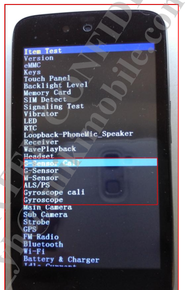
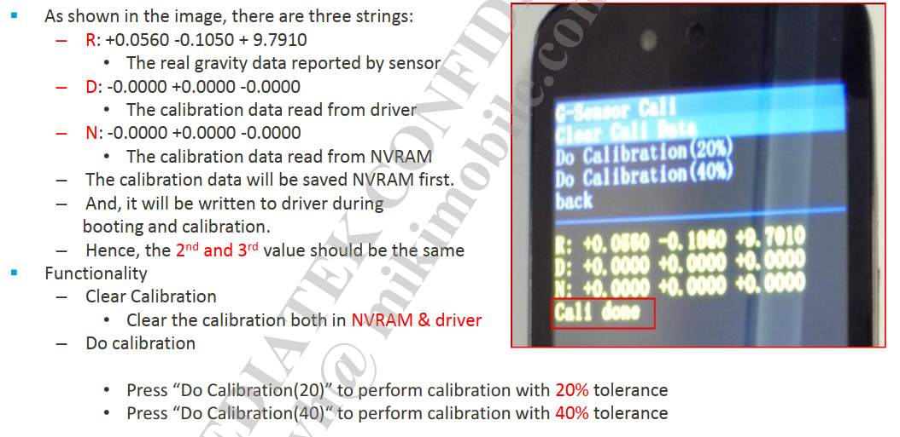
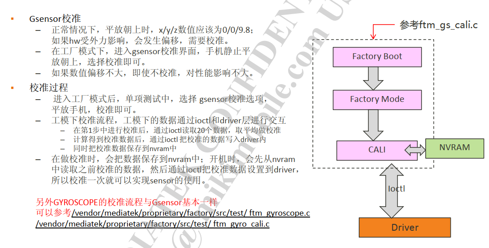
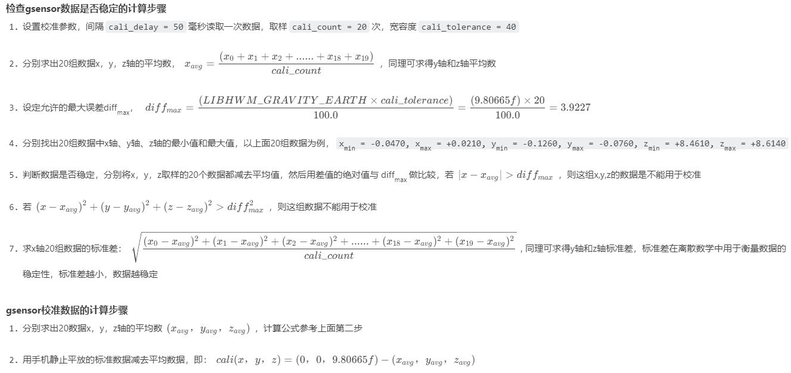
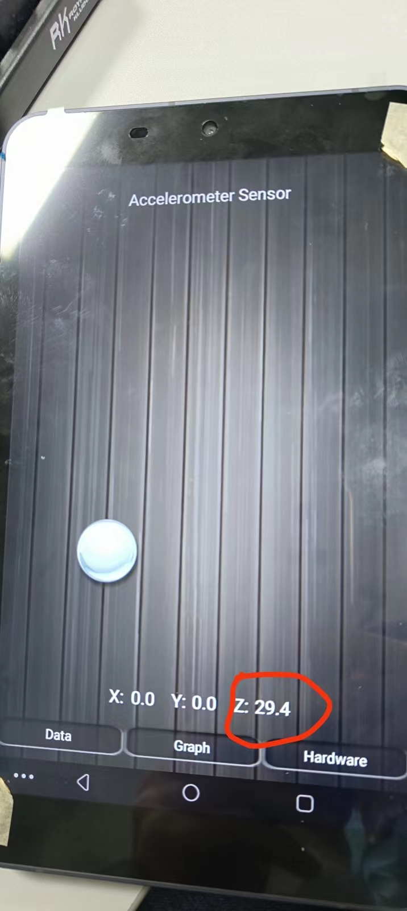

# 概述

SensorHub工厂模式下校准流程分析。

# 原理


* 重力传感器acc：

* 平放取20次平均，（{0,0,9.8}-平均值）=校准值 (float型)

  * 写入Driver：校准值×1000         //JNI再IOCTL  Driver中的GSENSOR_IOCTL_SET_CALI，只写nvram而不写入driver的话需要重启后才能生效。开机过程中的nvram_daemon会去读取nvram中的值写入driver，从而生效

  * 写入Nvram：校准值×65536/9.80665   （ 有做round处理，所以可能写进去的和读出来的稍微不一样，小数点被舍掉了）

  * 所以上层APK读取和写入Nvram的值时都需要处理

* 陀螺仪gyro:

  * 平放取20次平均，（{0,0,0}-平均值）=校准值  (float型)
  
  * 写入Driver：校准值       //JNI再IOCTL  Driver中的GYROSCOPE_IOCTL_SET_CALI，只写nvram而不写入driver的话需要重启后才能生效。开机过程中的nvram_daemon会去读取nvram中的值写入driver，从而生效
  
  * 写入Nvram：校准值×1000

  * 所以上层APK读取和写入Nvram的值时都需要处理
 
 
注：写入Nvram的校准值都是3个INT型的，重力传感器和陀螺仪都是

# 参考

```log
陀螺仪选型相关参数
陀螺仪选型需要主要两个主要的参数，一个是角度随机游走，另外一个是零偏不稳定性。
陀螺仪手册说明：
（1）Initial Zero Rate Output Tolerance: +/-40 °/s
当陀螺仪静止的时候，陀螺会给出在−40∘/s到+40∘/s之间的一个输出值，也就是初始的零漂值，值得注意的是每次启动的零漂值是不相同的。
（2）ZRO Variation Over Temperature
陀螺的零漂对于温度的敏感性
（3）Power-Supply Sensitivity
电磁的正弦信号的影响对于陀螺零偏的影响
（4）Linear Acceleration Sensitivity
线性加速度对于陀螺角速度的影响
（5）RMS噪声
多次采集的数据的均方根误差，相关的频率是低通滤波的频率，大小和采集的频率也有关系
（6）Rate Noise Spectral Density
速率噪声密度谱，感觉是角度随机游走相关的参数
```

# 校准流程

* 根据打印，因为只有acc校准，所以只做了acc的`sensorCaliAcc`函数，其他的都未执行，先了解一下acc校准方法：

1.点击Item Test进入如下界面， 按音量下键选择相应的sensor测试类型，即可对相应sensor进行校准测试：



2.例如选择G-sensor Cali，首先clear cali data，然后做20%或者40%测试，若显示Cali done则表示校准成功：



3.选择G-sensor 测试项测试，看校准后数据是否OK，若为pass则表示通过：


4.校准流程：



* 开机读取校准数据logcat 打印如下：

```log
02-17 13:03:49.250078   724   724 D Accelerometer: misc path =/sys/class/sensor/m_acc_misc/
02-17 13:03:49.250491   724   724 I Accelerometer: read div buf(/sys/class/sensor/m_acc_misc/accactive), mdiv 1000
02-17 13:03:49.268059   724   724 I Accelerometer: read bias: [0.000000, 0.000000, 0.000000]
02-17 13:03:49.268944   724   724 I Accelerometer: read cali: [240, -111, 199]
```

* 校准数据读取节点：
```log
130|PAYPHONEM50:/ # cat /mnt/vendor/nvcfg/sensor/gyro_temp.json
{
  "gyro_temp": [
      0,
      0,
      0,
      0,
      0,
      0
    ]
```

# 流程图

* 简易流程图如下：


# 程序流程图

* `factory/src/test/ftm_gyro_cali.c`以陀螺仪为例:
```C++
参数说明：
校准显示界面有20%和40%，以下是两种的参数配置：
       case ITEM_DO20:
            pthread_mutex_lock(&dat->gyroc.evtmutex);
            dat->gyroc.pending_op = GYRO_OP_CALI_PRE;
            dat->gyroc.cali_delay = 50;   //每次采样延时
            dat->gyroc.cali_num   = 20; //20次采样
            dat->gyroc.cali_tolerance = 20*10; //
            GSCLOGD("chosen DO20\n");
            pthread_mutex_unlock(&dat->gyroc.evtmutex);
            break;
        case ITEM_DO40:
            pthread_mutex_lock(&dat->gyroc.evtmutex);
            dat->gyroc.pending_op = GYRO_OP_CALI_PRE;
            dat->gyroc.cali_delay = 50;
            dat->gyroc.cali_num   = 20;
            dat->gyroc.cali_tolerance = 40*10;
            GSCLOGD("chosen DO40\n");
            pthread_mutex_unlock(&dat->gyroc.evtmutex);


pthread_create(&dat->update_thd, NULL, gyro_cali_update_iv_thread, priv);
```

```C++
* 程序流程
  ├── gyroscope_calibration(gyroc->fd, dat->gyroc.cali_delay, dat->gyroc.cali_num,dat->gyroc.cali_tolerance, &cali) //执行校准
  │   ├── external/sensor-tools/libhwm.c
  │   ├── gyroscope_read(fd, &dat); //手机放平，读取20次xyz数据平均值
  │   └── checkGyroscopeData(item, count, &avg, tolerance) //检测是否符合宽容度要求，应该是偏差不能太大
  ├── gyroscope_set_cali(gyroc->fd, &cali) //设置校准参数
  │   ├── kernel-4.19/drivers/misc/mediatek/sensors-1.0/gyroscope/gyro_factory.c
  │   └──  gyro_factory_unlocked_ioctl(struct file *file, unsigned int cmd, // /dev/gyroscope节点GYROSCOPE_IOCTL_SET_CALI指令
  │       └── gyro_factory.fops->set_cali(data_buf);
  │           ├── gyrohub.c //.set_cali = gyrohub_factory_set_cali, 
  │           ├── gyrohub_WriteCalibration(data);
  │           │   └── gyrohub_WriteCalibration_scp(dat);
  │           │       └── sensor_set_cmd_to_hub(ID_GYROSCOPE, CUST_ACTION_SET_CALI, dat);
  │           │           ├── req.set_cust_req.setCali.action = CUST_ACTION_SET_CALI; //IPI通信数据类型
  │           │           └── offsetof(struct SCP_SENSOR_HUB_SET_CUST_REQ,custData) + sizeof(req.set_cust_req.setCali); //将校准数据填充到SCP_SENSOR_HUB_SET_CUST_REQ数据结构custData[11]成员
  │           │               ├── scp_sensorHub_req_send(&req, &len, 1); //kernel IPI通信统一发送接口
  │           │               └── contextHubHandleIpiRxEvent(); //scp IPI统一接收处理接口
  │           │                   └── contextHubFindCmd(mTask.ipi_req.action);
  │           │                       └── CONTEXTHUB_CMD(SENSOR_HUB_SET_CUST,contextHubFwSetCust, contextHubFwSetCustAck), //此条是SENSOR_HUB_SET_CUST数据格式
  │           │                           └── contextHubDispatchCust(mtkTypeToChreType(mtkType), set_cust_req); //寻找SENSOR_HUB_SET_CUST action执行操作
  │           │                               ├── case CUST_ACTION_SET_CALI:
  │           │                               └── sensorCoreWriteCalibration(sensType, cust_req->setCali.int32_data);
  │           │                                   └── mCoreInfo->setCalibration(cali_sw, AXES_NUM); //调用具体实例驱动setCalibration函数
  │           │                                       └── mInfo.setCalibration = accSetCalibration; //qmi8656_i2c.c
  │           │                                           └── mQmi8658.accSwCali[AXIS_X] = cali[AXIS_X];
  │           ├── qmi8658gy.c //kernel驱动方式 .set_cali = qmi8658gy_factory_set_cali,
  │           └── qmi8658gy_factory_set_cali(int32_t data[3])  
  │               └── qmi8658gy_WriteCalibration(qmi8658gy_i2c_client, cali);
  │                   └── obj->cali_sw[QMI8658_AXIS_X] = obj->cvt.sign[QMI8658_AXIS_X]*(cali[obj->cvt.map[QMI8658_AXIS_X]]);  //赋值驱动cali数组
  ├── gyroscope_get_cali(gyroc->fd, &cali) //读回并显示
  ├── gyroscope_write_nvram(&cali) //写入NV
  └── dat->gyroc.pending_op = GYRO_OP_NONE;
```

* log打印：
```log
sensorhub acc:
[286.720][qmi8658]: accGetCalibration cali x:-6, y:-181, z:165
[286.720]read calibration (-6, -181, 165) (-5, -6, -5)
[286.720]sensitivity:4096.000000, gain:9807
[286.720]read calibration2 (-183, 4, 163) (-1, 1, 1)
[286.721]write calibration (-4, -183, 163)
[286.721][qmi8658]: accSetCalibration cali x:-4, y:-183, z:163
[286.721]scp_ipi_send failed, enable a oneshot timer
[286.724][qmi8658]: Qmi8658Sample status 0x1
[286.725][qmi8658]: Qmi8658Convert
[286.725][qmi8658]: accGetCalibration cali x:-4, y:-183, z:163
```


# 问题分析

## 1.sensorhub方式无法进行校准

* 工厂模式校准失败，根据错误打印`gsensor_get_cali: get_cali err: -1`，看看是什么问题：

```log
kernel打印：
<3>[   37.370284] .(1)[570:factory][GYRO] gyrohub_factory_get_cali fail!
<3>[   37.370320] .(1)[570:factory]<GYRO_FAC> GYROSCOPE_IOCTL_GET_CALI FAIL!

main log：
02-19 17:10:08.501   460   570 D HWMLIB  : ----------------------------------------------------------------
02-19 17:10:08.501   460   570 D HWMLIB  :                          Calibration Data
02-19 17:10:08.502   460   570 D HWMLIB  : ----------------------------------------------------------------
02-19 17:10:08.502   460   570 D HWMLIB  : maxdiff =   +3.9227
02-19 17:10:08.502   460   570 D HWMLIB  : average =   +0.4361,   +0.0192   +9.4192
02-19 17:10:08.502   460   570 D HWMLIB  : ----------------------------------------------------------------
02-19 17:10:08.502   460   570 D HWMLIB  : [  317275] (  +0.4330,   +0.0350,   +9.3640)
02-19 17:10:08.502   460   570 D HWMLIB  : [  317326] (  +0.4420,   +0.0070,   +9.3950)
02-19 17:10:08.502   460   570 D HWMLIB  : [  317378] (  +0.4380,   +0.0330,   +9.4330)
02-19 17:10:08.502   460   570 D HWMLIB  : [  317430] (  +0.4420,   -0.0070,   +9.4330)
02-19 17:10:08.502   460   570 D HWMLIB  : [  317481] (  +0.4020,   +0.0450,   +9.3800)
02-19 17:10:08.502   460   570 D HWMLIB  : [  317532] (  +0.4570,   +0.0040,   +9.4710)
02-19 17:10:08.503   460   570 D HWMLIB  : [  317584] (  +0.4140,   +0.0260,   +9.3880)
02-19 17:10:08.503   460   570 D HWMLIB  : [  317636] (  +0.4230,   +0.0380,   +9.3970)
02-19 17:10:08.503   460   570 D HWMLIB  : [  317687] (  +0.4350,   +0.0040,   +9.4260)
02-19 17:10:08.503   460   570 D HWMLIB  : [  317739] (  +0.4710,   +0.0070,   +9.3970)
02-19 17:10:08.503   460   570 D HWMLIB  : [  317789] (  +0.4540,   +0.0830,   +9.4520)
02-19 17:10:08.503   460   570 D HWMLIB  : [  317840] (  +0.4350,   +0.0000,   +9.4140)
02-19 17:10:08.503   460   570 D HWMLIB  : [  317891] (  +0.4330,   +0.0040,   +9.4500)
02-19 17:10:08.503   460   570 D HWMLIB  : [  317943] (  +0.4280,   +0.0280,   +9.4160)
02-19 17:10:08.503   460   570 D HWMLIB  : [  317994] (  +0.4230,   +0.0160,   +9.4570)
02-19 17:10:08.503   460   570 D HWMLIB  : [  318045] (  +0.4380,   -0.0310,   +9.3880)
02-19 17:10:08.503   460   570 D HWMLIB  : [  318095] (  +0.4620,   +0.0280,   +9.4090)
02-19 17:10:08.503   460   570 D HWMLIB  : [  318146] (  +0.4420,   +0.0040,   +9.4620)
02-19 17:10:08.503   460   570 D HWMLIB  : [  318198] (  +0.4380,   +0.0090,   +9.4500)
02-19 17:10:08.504   460   570 D HWMLIB  : [  318249] (  +0.4110,   +0.0500,   +9.4020)
02-19 17:10:08.505   460   570 D HWMLIB  : ----------------------------------------------------------------
02-19 17:10:08.505   460   570 D HWMLIB  : X-Axis: min/avg/max = (  +0.4020,   +0.4361,   +0.4710), diverse =   -0.0035 ~   +0.0036, std =    0.0165
02-19 17:10:08.505   460   570 D HWMLIB  : Y-Axis: min/avg/max = (  -0.0310,   +0.0192,   +0.0830), diverse =   -0.0051 ~   +0.0065, std =    0.0241
02-19 17:10:08.505   460   570 D HWMLIB  : Z-Axis: min/avg/max = (  +9.3640,   +9.4192,   +9.4710), diverse =   -0.0056 ~   +0.0053, std =    0.0299
02-19 17:10:08.505   460   570 D HWMLIB  : ----------------------------------------------------------------
02-19 17:10:08.506   460   570 D HWMLIB  : calculateStandardCalibration (  -0.4361,   -0.0192,    0.3875)
02-19 17:10:08.506   460   570 D HWMLIB  : [WD]   -0.4361   -0.0192    0.3875 =>  -436   -19   387
02-19 17:10:11.701   460   570 E HWMLIB  : gsensor_get_cali: get_cali err: -1
02-19 17:10:11.702   460   570 E FTM     : gs_cali_update_iv_thread [  296]: get calibration fail: (Invalid argument) -1
02-19 17:10:11.702   460   570 D NVRAM   : fail to open /sys/class/BOOT/BOOT/boot/boot_mode:
02-19 17:10:11.702   460   570 D NVRAM   : NVM_GetFileDesc: Open /mnt/vendor/nvdata/APCFG/APRDCL/HWMON_ACC,LID:12
02-19 17:10:11.702   460   570 D NVRAM   : NVM_CmpFileVerNo 12
02-19 17:10:11.702   460   570 D NVRAM   : Load File Version: 000, NvRam File Version: 000
02-19 17:10:11.702   460   570 D NVRAM   : NVM_ProtectDataFile : 12 ++
02-19 17:10:11.703   460   570 D NVRAM   : NVM_ProtectUserData:Check Success
02-19 17:10:11.703   460   570 D HWMLIB  : [RN]    0.0000    0.0000    0.0000 =>     0     0     0
02-19 17:10:11.705   460   570 D NVRAM   : NVM_CloseFileDesc: Open by Readonly, no need to check when close
02-19 17:10:14.773   460   570 E HWMLIB  : gsensor_get_cali: get_cali err: -1
02-19 17:10:14.773   460   570 E FTM     : gs_cali_update_info [  161]: get calibration: 22(Invalid argument)
02-19 17:10:14.913   460   570 E FTM     : MTK_LCM_PHYSICAL_ROTATION + 0
02-19 17:10:14.916   460   570 E FTM     : set_active_framebuffer +
02-19 17:10:14.933   460   570 E FTM     : gr_flip done
02-19 17:10:14.933   460   570 D FTM     : [GSC] op: 0
02-19 17:10:14.933   460   570 D NVRAM   : fail to open /sys/class/BOOT/BOOT/boot/boot_mode:
02-19 17:10:14.933   460   570 D NVRAM   : NVM_GetFileDesc: Open /mnt/vendor/nvdata/APCFG/APRDCL/HWMON_ACC,LID:12
02-19 17:10:14.933   460   570 D NVRAM   : NVM_CmpFileVerNo 12
02-19 17:10:14.934   460   570 D NVRAM   : Load File Version: 000, NvRam File Version: 000
02-19 17:10:14.934   460   570 D NVRAM   : NVM_ProtectDataFile : 12 ++
02-19 17:10:14.934   460   570 D NVRAM   : NVM_ProtectUserData:Check Success
02-19 17:10:14.934   460   570 D HWMLIB  : [RN]    0.0000    0.0000    0.0000 =>     0     0     0
02-19 17:10:14.934   460   570 D NVRAM   : NVM_CloseFileDesc: Open by Readonly, no need to check when close
```

* 结论

```diff
MTK_OLD_FACTORY_CALIBRATION宏未打开，gyrohub_WriteCalibration函数不生效。

static int gyrohub_factory_set_cali(int32_t data[3])
{
#ifdef MTK_OLD_FACTORY_CALIBRATION
	int err = 0;

	pr_err("%swugn test gyrohub\n", __func__);
	err = gyrohub_WriteCalibration(data);
	if (err) {
		pr_err("gyrohub_WriteCalibration failed!\n");
		return -1;
	}
#endif
	pr_err("%swugn test 11111gyrohub\n", __func__);

	return 0;
}

--- a/kernel-4.19/drivers/misc/mediatek/sensors-1.0/accelerometer/accelhub/accelhub.h
+++ b/kernel-4.19/drivers/misc/mediatek/sensors-1.0/accelerometer/accelhub/accelhub.h
@@ -10,5 +10,6 @@

 #define ACCELHUB_BUFSIZE 256
 #define ACCELHUB_AXES_NUM 3
+#define MTK_OLD_FACTORY_CALIBRATION
```

## 2.gyro校准数据都是0

* 打印如下：

```log
屏幕显示，这个屏幕打印是累加的，建议做之前clean以下数据：
526 -496 40

factory 打印：
02-25 03:37:15.165   458  2652 D FTM     : [GYRO] op: 3
02-25 03:37:16.190   458  2652 D HWMLIB  : ----------------------------------------------------------------
02-25 03:37:16.190   458  2652 D HWMLIB  :                          Calibration Data
02-25 03:37:16.190   458  2652 D HWMLIB  : ----------------------------------------------------------------
02-25 03:37:16.191   458  2652 D HWMLIB  : maxdiff = +200.0000
02-25 03:37:16.191   458  2652 D HWMLIB  : average = -525.5500, +495.8000  -39.6500
02-25 03:37:16.191   458  2652 D HWMLIB  : ----------------------------------------------------------------
02-25 03:37:16.191   458  2652 D HWMLIB  : [ 8912945] (-532.0000, +483.0000,  -36.0000)
02-25 03:37:16.191   458  2652 D HWMLIB  : [ 8912996] (-519.0000, +491.0000,  -32.0000)
02-25 03:37:16.191   458  2652 D HWMLIB  : [ 8913047] (-528.0000, +487.0000,  -28.0000)
02-25 03:37:16.191   458  2652 D HWMLIB  : [ 8913099] (-532.0000, +495.0000,  -40.0000)
02-25 03:37:16.191   458  2652 D HWMLIB  : [ 8913150] (-515.0000, +499.0000,  -49.0000)
02-25 03:37:16.191   458  2652 D HWMLIB  : [ 8913202] (-519.0000, +483.0000,  -40.0000)
02-25 03:37:16.191   458  2652 D HWMLIB  : [ 8913253] (-524.0000, +511.0000,  -36.0000)
02-25 03:37:16.191   458  2652 D HWMLIB  : [ 8913304] (-519.0000, +499.0000,  -32.0000)
02-25 03:37:16.191   458  2652 D HWMLIB  : [ 8913356] (-528.0000, +495.0000,  -36.0000)
02-25 03:37:16.191   458  2652 D HWMLIB  : [ 8913407] (-540.0000, +528.0000,  -53.0000)
02-25 03:37:16.191   458  2652 D HWMLIB  : [ 8913458] (-540.0000, +491.0000,  -36.0000)
02-25 03:37:16.191   458  2652 D HWMLIB  : [ 8913509] (-515.0000, +487.0000,  -45.0000)
02-25 03:37:16.191   458  2652 D HWMLIB  : [ 8913561] (-519.0000, +511.0000,  -40.0000)
02-25 03:37:16.191   458  2652 D HWMLIB  : [ 8913612] (-524.0000, +495.0000,  -57.0000)
02-25 03:37:16.191   458  2652 D HWMLIB  : [ 8913663] (-532.0000, +507.0000,  -40.0000)
02-25 03:37:16.191   458  2652 D HWMLIB  : [ 8913714] (-540.0000, +499.0000,  -45.0000)
02-25 03:37:16.191   458  2652 D HWMLIB  : [ 8913765] (-519.0000, +491.0000,  -40.0000)
02-25 03:37:16.191   458  2652 D HWMLIB  : [ 8913817] (-536.0000, +499.0000,  -36.0000)
02-25 03:37:16.191   458  2652 D HWMLIB  : [ 8913868] (-511.0000, +466.0000,  -36.0000)
02-25 03:37:16.191   458  2652 D HWMLIB  : [ 8913918] (-519.0000, +499.0000,  -36.0000)
02-25 03:37:16.191   458  2652 D HWMLIB  : ----------------------------------------------------------------
02-25 03:37:16.191   458  2652 D HWMLIB  : X-Axis: min/avg/max = (-540.0000, -525.5500, -511.0000), diverse =  -14.4500 ~  +14.5500, std
=    8.8571
02-25 03:37:16.191   458  2652 D HWMLIB  : Y-Axis: min/avg/max = (+466.0000, +495.8000, +528.0000), diverse =  -29.8000 ~  +32.2000, std
=   12.4844
02-25 03:37:16.191   458  2652 D HWMLIB  : Z-Axis: min/avg/max = ( -57.0000,  -39.6500,  -28.0000), diverse =  -17.3500 ~  +11.6500, std
=    6.9662
02-25 03:37:16.191   458  2652 D HWMLIB  : ----------------------------------------------------------------
02-25 03:37:16.191   458  2652 D HWMLIB  : [WD]  525.5500 -495.8000   39.6500 =>   526  -496    40
02-25 03:37:16.192   458  2652 D HWMLIB  : [RD]  526.0000 -496.0000   40.0000 =>   526  -496    40
02-25 03:37:16.193   458  2652 D NVRAM   : fail to open /sys/class/BOOT/BOOT/boot/boot_mode:
02-25 03:37:16.193   458  2652 D NVRAM   : NVM_GetFileDesc: Open /mnt/vendor/nvdata/APCFG/APRDCL/HWMON_GYRO,LID:13
02-25 03:37:16.193   458  2652 D NVRAM   : NVM_CmpFileVerNo 13
02-25 03:37:16.193   458  2652 D NVRAM   : Load File Version: 000, NvRam File Version: 000
02-25 03:37:16.193   458  2652 D NVRAM   : NVM_ProtectDataFile : 13 ++
02-25 03:37:16.193   458  2652 D NVRAM   : NVM_ProtectUserData:Check Success
02-25 03:37:16.193   458  2652 D HWMLIB  : [WN]  526.0000 -496.0000   40.0000 => 526000 -496000 40000


kernel 打印：
[Fri Feb 25 03:37:14 2022] .(7)[2652:factory]GYROSCOPE_IOCTL_SET_CALI: (526, -496, 40)!
[Fri Feb 25 03:37:14 2022] .(7)[2652:factory][GYRO] gyrohub_factory_set_caliwugn test gyrohub
[Fri Feb 25 03:37:15 2022] .(7)[2652:factory][GYRO] gyrohub_factory_set_caliwugn test 11111gyrohub
[Fri Feb 25 03:37:15 2022] .(7)[2652:factory][GYRO] gyrohub_factory_get_cali gyrohub
[Fri Feb 25 03:37:15 2022] .(7)[2652:factory]GYROSCOPE_IOCTL_GET_CALI: (526, -496, 40)!


scp打印：
[8912.544][qmi8658]: gyroGetCalibration cali x:0, y:0, z:0
[8912.545][qmi8658]: gyroGetCalibration cali x:0, y:0, z:0
[8912.545]read calibration (0, 0, 0) (526, -496, 40)
[8912.545]sensitivity:32.000000, gain:131000
[8912.545]read calibration2 (0, 0, 0) (-1, 1, 1)
[8912.545]write calibration (0, 0, 0)
[8912.545][qmi8658]: gyroSetCalibration cali x:0, y:0, z:0
[8912.549][qmi8658]: Qmi8658Sample status 0x3
[8912.549][qmi8658]: Qmi8658Convert
[8912.549][qmi8658]: accGetCalibration cali x:-4, y:-183, z:163
[8912.549][qmi8658]: gyroGetCalibration cali x:0, y:0, z:0
```

* 根据以下代码得知：

```C++
mCoreInfo->getCalibration(cali_sw, AXES_NUM);
cali_sw: 0 0 0 
data:(526, -600, 32)

#define GYROSCOPE_INCREASE_NUM_AP       131000
static void Qmi8658SensorCoreRegistration(void) 
{
  mInfo.gain = GYROSCOPE_INCREASE_NUM_AP;
	mInfo.sensitivity = mQmi8658.config.g_sensitivity;

}

static int Qmi8658SwReset(I2cCallbackF i2cCallBack, SpiCbkF spiCallBack, void *next_state,
				void *inBuf, uint8_t inSize, uint8_t elemInSize, void *outBuf, uint8_t *outSize, uint8_t *elemOutSize) 
{
  mQmi8658.config.g_sensitivity = (1 << 5);
}

mCoreInfo->sensitivity = (1 << 5)
mCoreInfo->gain = 131000

int sensorCoreWriteCalibration(uint8_t sensType, int32_t *data)
{
    int32_t cali[AXES_NUM], cali_sw[AXES_NUM];
    struct sensorCoreInfo *mCoreInfo;
    int8_t handle = mSensorCoreList[sensType];
    memset(cali, 0, sizeof(cali));
    memset(cali_sw, 0, sizeof(cali_sw));

    if (!atomicBitsetGetBit(mSensorCoreUsed, handle))
        return -1;
    mCoreInfo = &mInfoCoreList[handle];
    if (!mCoreInfo->getCalibration)
        return -1;
        mCoreInfo->getCalibration(cali_sw, AXES_NUM);
    osLog(LOG_INFO, "read calibration (%ld, %ld, %ld) (%ld, %ld, %ld)\n",
          cali_sw[AXIS_X], cali_sw[AXIS_Y], cali_sw[AXIS_Z], data[AXIS_X], data[AXIS_Y], data[AXIS_Z]);
    osLog(LOG_INFO, "sensitivity:%f, gain:%lu\n", (double)mCoreInfo->sensitivity, mCoreInfo->gain);
    data[AXIS_X] = data[AXIS_X] * mCoreInfo->sensitivity / mCoreInfo->gain;
    data[AXIS_Y] = data[AXIS_Y] * mCoreInfo->sensitivity / mCoreInfo->gain;
    data[AXIS_Z] = data[AXIS_Z] * mCoreInfo->sensitivity / mCoreInfo->gain;
    //这里由于gain值很大，导致data直接变为0，例如data[AXIS_X] = 526*32/131000 = 0.1284 整形直接四舍五入为0

    cali[mCoreInfo->cvt.map[AXIS_X]] = mCoreInfo->cvt.sign[AXIS_X] * cali_sw[AXIS_X];
    cali[mCoreInfo->cvt.map[AXIS_Y]] = mCoreInfo->cvt.sign[AXIS_Y] * cali_sw[AXIS_Y];
    cali[mCoreInfo->cvt.map[AXIS_Z]] = mCoreInfo->cvt.sign[AXIS_Z] * cali_sw[AXIS_Z];

    cali[AXIS_X] += data[AXIS_X];
    cali[AXIS_Y] += data[AXIS_Y];
    cali[AXIS_Z] += data[AXIS_Z];

	osLog(LOG_INFO, "read calibration2 (%ld, %ld, %ld) (%ld, %ld, %ld)\n",
			  cali[AXIS_X], cali[AXIS_Y], cali[AXIS_Z], mCoreInfo->cvt.sign[AXIS_X], mCoreInfo->cvt.sign[AXIS_Y], mCoreInfo->cvt.sign[AXIS_Z]);

    cali_sw[AXIS_X] = mCoreInfo->cvt.sign[AXIS_X] * cali[mCoreInfo->cvt.map[AXIS_X]];
    cali_sw[AXIS_Y] = mCoreInfo->cvt.sign[AXIS_Y] * cali[mCoreInfo->cvt.map[AXIS_Y]];
    cali_sw[AXIS_Z] = mCoreInfo->cvt.sign[AXIS_Z] * cali[mCoreInfo->cvt.map[AXIS_Z]];

    osLog(LOG_INFO, "write calibration (%ld, %ld, %ld)\n",
          cali_sw[AXIS_X], cali_sw[AXIS_Y], cali_sw[AXIS_Z]);
    if (!mCoreInfo->setCalibration)
        return -1;
        mCoreInfo->setCalibration(cali_sw, AXES_NUM);

    return 0;
}

kernel计算方式：
DEFREE_SCALE 1024
qmi8658gy->resolution = (1 << 5)

static int qmi8658gy_factory_set_cali(int32_t data[3])
{
	qmi8658gy_t *obj = qmi8658gy;
	int err = 0;
	int cali[QMI8658_AXIS_NUM] = { 0 };
	//[BUGFIX]-Modify-BEGIN by (huling@paxsz.com), 2022/1/20, number:0039353
	int32_t DEFAULT_CALI_DATA[3] = {3616, -5120, 488}; /*get 40 groups sensor data, take the average*/

	err = qmi8658gy_config_gyr(qmi8658gy->range, qmi8658gy->odr, Qmi8658Lpf_Disable, Qmi8658St_Disable);
	if (err < 0) {
		QMI8658GY_ERR("set gyroscope range failed.\n");
		return err;
	}
	if((data[0] == 0) && (data[1] == 0) && (data[2] == 0)) {
		QMI8658GY_LOG("not do factory cali, use default cali data");
		data[0] = DEFAULT_CALI_DATA[0];
		data[1] = DEFAULT_CALI_DATA[1];
		data[2] = DEFAULT_CALI_DATA[2];
	}
	//QMI8658GY_LOG("data[] = [%d,%d,%d]",data[0], data[1], data[2]);
	//[BUGFIX]-Modify-END by (huling@paxsz.com), 2022/1/20, number:0039353
	cali[QMI8658_AXIS_X] = data[0]*obj->resolution/DEFREE_SCALE;
	cali[QMI8658_AXIS_Y] = data[1]*obj->resolution/DEFREE_SCALE;
	cali[QMI8658_AXIS_Z] = data[2]*obj->resolution/DEFREE_SCALE;
	err = qmi8658gy_WriteCalibration(qmi8658gy_i2c_client, cali);
	if (err) {
		QMI8658GY_ERR("qmi8658gy_WriteCalibration failed!\n");
		return -1;
	}
	return 0;
}
```

* 从qmi5608 scp驱动这端获取参数如下：

```C++
static int Qmi8658SwReset(I2cCallbackF i2cCallBack, SpiCbkF spiCallBack, void *next_state,
				void *inBuf, uint8_t inSize, uint8_t elemInSize, void *outBuf, uint8_t *outSize, uint8_t *elemOutSize) 
{

	QMI8658_LOG( "Qmi8658SwReset\n");
	mQmi8658.acc_power = false;
	mQmi8658.gyr_power = false;
	mQmi8658.config.accRange = Qmi8658AccRange_8g;
	mQmi8658.config.accOdr = Qmi8658AccOdr_1000Hz;
	mQmi8658.config.a_sensitivity = (1 << 12);
	mQmi8658.config.gyrRange = Qmi8658GyrRange_1024dps;
	mQmi8658.config.gyrOdr = Qmi8658GyrOdr_1000Hz;
	mQmi8658.config.g_sensitivity = (1 << 5);
}

static void Qmi8658SensorCoreRegistration(void) 
{
	struct sensorCoreInfo mInfo;
	QMI8658_LOG( "Qmi8658SensorCoreRegistration\n");

	mInfo.sensType = SENS_TYPE_ACCEL;
  #define GRAVITY_EARTH_1000              9807
	mInfo.gain = GRAVITY_EARTH_1000;
	mInfo.sensitivity = mQmi8658.config.a_sensitivity;
	mInfo.cvt = mQmi8658.cvt;
	mInfo.getCalibration = accGetCalibration;
	mInfo.setCalibration = accSetCalibration;

	mInfo.sensType = SENS_TYPE_GYRO;
  #define GYROSCOPE_INCREASE_NUM_AP       131000
	mInfo.gain = GYROSCOPE_INCREASE_NUM_AP; 
	mInfo.sensitivity = mQmi8658.config.g_sensitivity;
	mInfo.cvt = mQmi8658.cvt;
}
```

* 对比kernel和scp计算公式不一样，采用kernel的公式发现陀螺仪都不动了，有问题，最后还是不采用这种校准方法了，直接使用静态值校准。

```
[178.452][qmi8658]: gyroGetCalibration cali x:15, y:16, z:1
[178.455][qmi8658]: gyroGetCalibration cali x:15, y:16, z:1
[178.455]read calibration (15, 16, 1) (3, -3, 0)
[178.455]sensitivity:32.000000, gain:1024
[178.455]read calibration2 (16, -15, 1) (-1, 1, 1)
[178.455]write calibration (15, 16, 1)
[178.455][qmi8658]: gyroSetCalibration cali x:15, y:16, z:1
[178.457][qmi8658]: Qmi8658Sample status 0x3
[178.457][qmi8658]: Qmi8658Convert
[178.457][qmi8658]: accGetCalibration cali x:-15, y:-157, z:181
[178.457][qmi8658]: gyroGetCalibration cali x:15, y:16, z:1

```

* 上个修改是直接改了`GYROSCOPE_INCREASE_NUM_AP`值，应该只需要修改sensor hub驱动配置就行了，调通后下面且添加了默认校准数据：

```diff
--- a/vendor/mediatek/proprietary/tinysys/freertos/source/middleware/contexthub/MEMS_Driver/accGyro/qmi8658_i2c.c
+++ b/vendor/mediatek/proprietary/tinysys/freertos/source/middleware/contexthub/MEMS_Driver/accGyro/qmi8658_i2c.c

 static void accSetCalibration(int32_t *cali, int32_t size)
 {
-       mQmi8658.accSwCali[AXIS_X] = cali[AXIS_X];
-       mQmi8658.accSwCali[AXIS_Y] = cali[AXIS_Y];
-       mQmi8658.accSwCali[AXIS_Z] = cali[AXIS_Z];
+       //[BUGFIX]-Modify-BEGIN by (huling@paxsz.com), 2022/3/22, number:0039353,0040255
+       int32_t DEFAULT_ACC_CALI_DATA[3] = {-70, -9, 525}; /*get 20 groups sensor data, take the average*/
+
+       if((cali[AXIS_X] == 0) && (cali[AXIS_Y] == 0) && (cali[AXIS_Z] == 0)) {
+               mQmi8658.accSwCali[AXIS_X] = DEFAULT_ACC_CALI_DATA[0];
+               mQmi8658.accSwCali[AXIS_Y] = DEFAULT_ACC_CALI_DATA[1];
+               mQmi8658.accSwCali[AXIS_Z] = DEFAULT_ACC_CALI_DATA[2];
+       } else {
+               mQmi8658.accSwCali[AXIS_X] = cali[AXIS_X];
+               mQmi8658.accSwCali[AXIS_Y] = cali[AXIS_Y];
+               mQmi8658.accSwCali[AXIS_Z] = cali[AXIS_Z];
+       }
+       //[BUGFIX]-Modify-END by (huling@paxsz.com), 2022/3/22, number:0039353,0040255
        QMI8658_LOG( "accSetCalibration cali x:%d, y:%d, z:%d\n", cali[AXIS_X], cali[AXIS_Y], cali[AXIS_Z]);
 }

@@ -675,9 +685,19 @@ static void gyroGetCalibration(int32_t *cali, int32_t size)

 static void gyroSetCalibration(int32_t *cali, int32_t size)
 {
-       mQmi8658.gyroSwCali[AXIS_X] = cali[AXIS_X];
-       mQmi8658.gyroSwCali[AXIS_Y] = cali[AXIS_Y];
-       mQmi8658.gyroSwCali[AXIS_Z] = cali[AXIS_Z];
+       //[BUGFIX]-Modify-BEGIN by (huling@paxsz.com), 2022/3/22, number:0039353,0040255
+       int32_t DEFAULT_GYRO_CALI_DATA[3] = {-141, 24, -8};/*get 20 groups sensor data, take the average*/
+
+       if((cali[AXIS_X] == 0) && (cali[AXIS_Y] == 0) && (cali[AXIS_Z] == 0)) {
+               mQmi8658.gyroSwCali[AXIS_X] = DEFAULT_GYRO_CALI_DATA[AXIS_X];
+               mQmi8658.gyroSwCali[AXIS_Y] = DEFAULT_GYRO_CALI_DATA[AXIS_Y];
+               mQmi8658.gyroSwCali[AXIS_Z] = DEFAULT_GYRO_CALI_DATA[AXIS_Z];
+       } else {
+               mQmi8658.gyroSwCali[AXIS_X] = cali[AXIS_X];
+               mQmi8658.gyroSwCali[AXIS_Y] = cali[AXIS_Y];
+               mQmi8658.gyroSwCali[AXIS_Z] = cali[AXIS_Z];
+       }
+       //[BUGFIX]-Modify-END by (huling@paxsz.com), 2022/3/22, number:0039353,0040255
        QMI8658_LOG( "gyroSetCalibration cali x:%d, y:%d, z:%d\n", cali[AXIS_X], cali[AXIS_Y], cali[AXIS_Z]);
 }

@@ -1461,7 +1469,7 @@ static void Qmi8658SensorCoreRegistration(void)

        memset(&mInfo, 0x00, sizeof(struct sensorCoreInfo));
        mInfo.sensType = SENS_TYPE_GYRO;
-       mInfo.gain = GYROSCOPE_INCREASE_NUM_AP;
+       mInfo.gain = 1024;//GYROSCOPE_INCREASE_NUM_AP;
        mInfo.sensitivity = mQmi8658.config.g_sensitivity;
```

## 3.静态校准参数误差大

目前发现这种写死的办法，局限性太大了，不同的设备差别比较大，写死的话在其他机器上可能不适用，供应商建议在工厂测试程序时加入校准流程，以下是修改：

```diff

    [Title]:gyro支持MTK ATA工厂测试工具进行gyroscope测试时自动校准

    [Summary]:
            1.gyro支持MTK ATA工厂测试工具进行gyroscope测试时自动校准
            2.工厂模式下Gyroscope测试项默认自动校准，且读出的数据是校准后的数据
            3.刚打开sensor去获取数据时，前面一部分异常数据需要过滤掉(qmi8658前几组数据全部为0)，否则会校准失败，默认过滤掉前面20组数据
            4.删除原来添加在qmi8658驱动默认的校准数据，以后统一产线校准
            5.工厂模式Gyroscope cali测试项读出的数据保持和Gyroscope测试项一致

    [Test Plan]:
            1.分别用ATA工具和进入工厂模式的Gyroscope测试项进行测试

    [Module]:sensor

    [Model]:M50

    [author]:huling@paxsz.com

    [date]:2022-4-12

diff --git a/vendor/mediatek/proprietary/factory/src/test/ftm_gyro_cali.c b/vendor/mediatek/proprietary/factory/src/test/ftm_gyro_cali.c
old mode 100644
new mode 100755
index 82dd77b6084..8f6c3f514a4
--- a/vendor/mediatek/proprietary/factory/src/test/ftm_gyro_cali.c
+++ b/vendor/mediatek/proprietary/factory/src/test/ftm_gyro_cali.c
@@ -356,9 +356,12 @@ static void *gyro_cali_update_iv_thread(void *priv)
                        break;
                }

-               data[0] =  gyroc->dat.x / MPU3000_FS_MAX_LSB;
+               /*data[0] =  gyroc->dat.x / MPU3000_FS_MAX_LSB;
                data[1] =  gyroc->dat.y / MPU3000_FS_MAX_LSB;
-               data[2] =  gyroc->dat.z / MPU3000_FS_MAX_LSB;
+               data[2] =  gyroc->dat.z / MPU3000_FS_MAX_LSB;*/
+               data[0] =  gyroc->dat.x / 1000;
+               data[1] =  gyroc->dat.y / 1000;
+               data[2] =  gyroc->dat.z / 1000;
                len = 0;
                len += snprintf(dat->info+len, sizeof(dat->info)-len, "R: %+7.4f %+7.4f %+7.4f\n", data[0], data[1], data[2]);
                len += snprintf(dat->info+len, sizeof(dat->info)-len, "D: %+7.4f %+7.4f %+7.4f\n", gyroc->cali_drv.x, gyroc->cali_drv.y, gyroc->cali_drv.z);
diff --git a/vendor/mediatek/proprietary/factory/src/test/ftm_gyroscope.c b/vendor/mediatek/proprietary/factory/src/test/ftm_gyroscope.c
old mode 100644
new mode 100755
index bd59b71e895..745d329fdfa
--- a/vendor/mediatek/proprietary/factory/src/test/ftm_gyroscope.c
+++ b/vendor/mediatek/proprietary/factory/src/test/ftm_gyroscope.c
@@ -71,7 +71,10 @@
 #define MPU3000_AXIS_Z          2
 #define MPU3000_AXES_NUM        3
 #define MPU3000_FIFOSIZE                               512
-
+#define CALI_DELAY                             50
+#define CALI_NUM                               20
+#define CALI_TOLERANCE                 40*10
+#define FILTER_COUNT                   20
 /******************************************************************************
  * grobal variable
  *****************************************************************************/
@@ -148,6 +151,53 @@ static int gyro_init_priv(struct gyro_priv *gyro)
     return 0;
 }
 /*---------------------------------------------------------------------------*/
+static int gyro_cali_before_read(int fd, int cali_delay, int cali_num, int cali_tolerance) {
+       int err = 0;
+       int num = 0;
+       HwmData cali, data;
+
+       FLPLOGD("gyro_cali_before_read\n");
+       if(fd < 0) {
+               FLPLOGE("Couldn't open gyro device!\n");
+               return -EINVAL;
+       }
+       FLPLOGD("----------------------------------------------------------------\n");
+       FLPLOGD("start clean unneed gyro data, FILTER_COUNT = %d\n", FILTER_COUNT);
+       FLPLOGD("----------------------------------------------------------------\n");
+       while(num < FILTER_COUNT) {
+               err = gyroscope_read(fd, &data);
+               if(err) {
+                       FLPLOGE("read data fail: %d\n", err);
+                       return err;
+               }
+               FLPLOGD("num = %d, (%+9.4f, %+9.4f, %+9.4f)\n", num, data.x, data.y, data.z);
+               num++;
+               usleep(50000);
+       }
+
+       if(!cali_delay || !cali_num || !cali_tolerance)
+       {
+               FLPLOGE("ignore calibration: %d %d %d\n", cali_delay, cali_num, cali_tolerance);
+       }
+       else if((err = gyroscope_calibration(fd, cali_delay, cali_num, cali_tolerance, &cali)) != 0)
+       {
+               FLPLOGE("calibrate gyro: %d\n", err);
+       }
+       else if((err = gyroscope_set_cali(fd, &cali)) != 0)
+       {
+               FLPLOGE("gyro set calibration fail: %d\n", err);
+       }
+       else if((err = gyroscope_get_cali(fd, &cali)) != 0)
+       {
+               FLPLOGE("gyro get calibration fail: %d\n", err);
+       }
+       else if((err = gyroscope_write_nvram(&cali)) != 0)
+       {
+               FLPLOGE("gyro write nvram fail: %d\n", err);
+       }
+       return err;
+}
+
 static int gyro_open(struct gyro_priv *gyro)
 {
     int err, max_retry = 3, retry_period = 100, retry;
@@ -194,7 +244,6 @@ static int gyro_update_info(struct gyro_priv *gyro)
     int err = -EINVAL;
        char buf[64];
        int x,y,z=0;
-
     if (gyro->fd == -1) {
         FLPLOGE("invalid fd\n");
         return err;
@@ -247,11 +296,14 @@ static void *gyro_update_iv_thread(void *priv)
         pthread_exit(NULL);
         return NULL;
     }
-
+
+    gyro_cali_before_read(gyro->fd, CALI_DELAY, CALI_NUM, CALI_TOLERANCE);
+
     while (1) {
-
-        if (dat->exit_thd)
+        /*if (dat->exit_thd) {
+                       FLPLOGD("dat->exit_thd = true\n");
             break;
+               }*/

         if ((err = gyro_update_info(gyro))){
           FLPLOGE("gyro_update_info() = (%s), %d\n", strerror(errno), err);
@@ -285,7 +337,10 @@ static void *gyro_update_iv_thread(void *priv)
         }
         pthread_mutex_unlock (&gyro_mutex);
         **/
-
+               if (dat->exit_thd) {
+                       FLPLOGD("dat->exit_thd = true\n");
+                       break;
+               }
     }
     gyro_close(gyro);
     FLPLOGD(TAG "%s: Exit\n", __FUNCTION__);
@@ -356,7 +411,7 @@ int gyro_entry(struct ftm_param *param, void *priv)
             } else if (chosen == ITEM_FAIL) {
                 dat->mod->test_result = FTM_TEST_FAIL;
             }
-            gyroscope_thread_exit = true;
+            gyroscope_thread_exit = true;
```

* factory校准原理：



# g-sensor Z轴数据全部为29

工厂发现生产的机器Z轴数据全部都为29，自动旋转和抬起亮屏功能失效，如下图：



经过试验，发现是单板测试时写了一个不正常的值下来，没有进行错误拦截：
```log
----- timezone:Asia/Shanghai
fore sc7a20ResetWrite

[0.030]sc7a20DeviceId

[0.030]sc7a20 acc reso: 0, sensitivity: 1024

[0.030]sc7a20RegisterCore deviceId 0x11


[0.030]accGyro: init done

[0.031]alsPs: init done

[0.520]initSensors: alloc blocks number:264

[0.522]Set Terminal_Type = 2 boardid = 16

[0.522]get dram phy addr=0x8d000000,size=1048520, maxEventNumber:23830

[0.522]get dram phy rp=0,wp=0

[2.024]frequency request: 65535 MHz => 250 MHz

[2.824]sync time scp:2824126160, ap:4316094384, offset:1492434531

[6.264]sc7a20 accGetCalibration cali x:0, y:0, z:0

[6.264]read calibration (0, 0, 0) (-34, 56, 19623)

[6.264]sensitivity:1024.000000, gain:9807

[6.264]write calibration (-5, 3, -2048)//Z轴错误写了个2048

[6.264]sc7a20 accSetCalibration cali x:-5, y:3, z:-2048 
```

经过试验发现，当板子正面对地进行校准时，Z轴会累加19.6，也就是双倍的9.8，因为正面是+9.8，反面是-9.8，如果需要支持正反都能校准，那需要对Z轴原始数据求绝对值，得知工厂校准流程如下：
* `vendor/mediatek/proprietary/factory/src/test/ftm_gsensor.c`:
```c
* ftm_gsensor_init
  └── ret = ftm_register(mod, gsensor_entry, (void*)dat);
      └── gsensor_entry(struct ftm_param *param, void *priv)
          └── pthread_create(&dat->update_thd, NULL, gsensor_update_iv_thread, priv);
              └── err = gsensor_cali_before_read(acc->fd, CALI_DELAY, CALI_NUM, CALI_TOLERANCE, dat);
                  ├── gsensor_calibration(fd, cali_delay, cali_num, cali_tolerance, &cali)) != 0)
                  │   ├── while(num < count) err = gsensor_read(fd, &dat); //libhwm.c
                  │   ├── avg.z += item[num].dat.z; 
                  │   ├── avg.z /= count; //可以在这里求绝对值
                  │   └── err = calculateStandardCalibration(&avg, cali)
                  ├── err = gsensor_set_cali(fd, &cali)) != 0
                  └── err = gsensor_write_nvram(&cali)) != 0
```

* 修改方案如下：
```diff
--- a/vendor/mediatek/proprietary/external/sensor-tools/libhwm.c
+++ b/vendor/mediatek/proprietary/external/sensor-tools/libhwm.c
@@ -851,6 +851,7 @@ int gsensor_calibration(int fd, int period, int count, int tolerance, HwmData *c
        avg.x /= count;
        avg.y /= count;
        avg.z /= count;
+       avg.z = abs(avg.z);
```

* 同时，我们也需要在接收端控制错误数据：
```diff
--- a/vendor/mediatek/proprietary/tinysys/freertos/source/middleware/contexthub/contexthub_core.c
+++ b/vendor/mediatek/proprietary/tinysys/freertos/source/middleware/contexthub/contexthub_core.c
@@ -29,6 +29,7 @@
 #include <sensors.h>
 #include <contexthub_core.h>
 #include <contexthub_fw.h>
+#include <math.h>

 struct sensorCoreInfo mInfoCoreList[MAX_REGISTERED_SENSORS];
 static uint8_t mSensorCoreList[SENS_TYPE_LAST_USER];
@@ -82,6 +83,21 @@ int sensorCoreWriteCalibration(uint8_t sensType, int32_t *data)
     cali_sw[AXIS_Y] = mCoreInfo->cvt.sign[AXIS_Y] * cali[mCoreInfo->cvt.map[AXIS_Y]];
     cali_sw[AXIS_Z] = mCoreInfo->cvt.sign[AXIS_Z] * cali[mCoreInfo->cvt.map[AXIS_Z]];

+       // [NEW FEATURE]-BEGIN by wugangnan@paxsz.com 2023-01-06, add g-sensor calibration data fault-tolerant processing mechanism
+       if (abs(cali_sw[AXIS_X]) > AXIS_TOLERANCE) {
+           osLog(LOG_INFO, "AXIS_X = %ld ,calibration data over tolerance range \n",cali_sw[AXIS_X]);
+               cali_sw[AXIS_X] = 0;
+       }
+       if (abs(cali_sw[AXIS_Y]) > AXIS_TOLERANCE) {
+           osLog(LOG_INFO, "AXIS_Y = %ld ,calibration data over tolerance range \n",cali_sw[AXIS_Y]);
+               cali_sw[AXIS_Y] = 0;
+       }
+       if (abs(cali_sw[AXIS_Z]) > AXIS_TOLERANCE) {
+           osLog(LOG_INFO, "AXIS_Z = %ld ,calibration data over tolerance range \n",cali_sw[AXIS_Z]);
+               cali_sw[AXIS_Z] = 0;
+       }
+       // [NEW FEATURE]-END by wugangnan@paxsz.com 2023-01-06, add g-sensor calibration data fault-tolerant processing mechanism
+
     osLog(LOG_INFO, "write calibration (%ld, %ld, %ld)\n",
           cali_sw[AXIS_X], cali_sw[AXIS_Y], cali_sw[AXIS_Z]);
     if (!mCoreInfo->setCalibration)
diff --git a/vendor/mediatek/proprietary/tinysys/freertos/source/middleware/contexthub/contexthub_core.h b/vendor/mediatek/proprietary/tinysys/freertos/source/middleware/contexthub/contexthub_core.h
old mode 100644
new mode 100755
index dd0b55b63cc..f787e58453e
--- a/vendor/mediatek/proprietary/tinysys/freertos/source/middleware/contexthub/contexthub_core.h
+++ b/vendor/mediatek/proprietary/tinysys/freertos/source/middleware/contexthub/contexthub_core.h
@@ -36,6 +36,7 @@
 #define AXIS_Y             1
 #define AXIS_Z             2
 #define AXES_NUM           3
+#define AXIS_TOLERANCE     300
```

* 错误数据过滤打印如下：
```log
----- timezone:Asia/Shanghai
1024.000000, gain:9807

[6.022]AXIS_X = 145 ,calibration data over range 

[6.022]AXIS_Z = -8108 ,calibration data over range 

[6.022]wugn test write calibration (0, 24, 0)

[6.022]sc7a20 accSetCalibration cali x:0, y:24, z:0

[6.939]hostintf: 6939317708, chreType:1, rate:0, latency:0, cmd:3!
```

* 当板子反面面对地进行校准时，错误数据过滤如下：
```log
[6.048]sc7a20 accGetCalibration cali x:0, y:0, z:0

[6.048]read calibration (0, 0, 0) (-59, 30, 19625)

[6.048]sensitivity:1024.000000, gain:9807

[6.048]AXIS_Z = -2049 ,calibration data over tolerance range 

[6.048]write calibration (-3, 6, 0)

[6.048]sc7a20 accSetCalibration cali x:-3, y:6, z:0
```