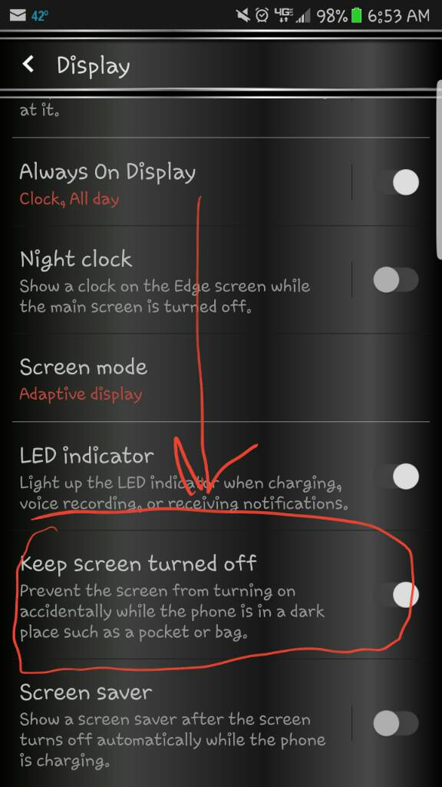

# 概述

Android平台虚拟传感器`(fusion/virtual sensor)`介绍。

Android中引入的传感器分为两种：原始传感器（物理传感器）和合成传感器（复合传感器）。 原始传感器给出从传感器获得的原始数据，而一台原始传感器对应的是一台Android设备中实际存在的物理传感器组件。 合成传感器结合多个原始传感器的原始数据，或修改原始传输传感器数据在应用代码和底层设备之间提供抽象层，为上层业务提供服务。

# 参考

* [Android传感器的使用](https://blog.csdn.net/json_zjs/article/details/83008658)

```java
TYPE_AMBIENT_TEMPERATURE
温度传感器，单位是 ℃，返回当前的温度。
TYPE_GAME_ROTATION_VECTOR
用来探测运动而不必受到电磁干扰的影响，因为它并不依赖于磁北极。
TYPE_GEOMAGNETIC_ROTATION_VECTOR
地磁旋转矢量传感器，提供手机的旋转矢量，当手机处于休眠状态时，仍可以记录设备的方位。
TYPE_GRAVITY
重力传感器简称 GV-sensor，单位是 $m/s^2%，测量应用于设备X、Y、Z轴上的重力。在地球上，重力数值为9.8，
TYPE_GYROSCOPE
陀螺仪传感器叫做Gyro-sensor，返回x、y、z三轴的角加速度数据。单位是 radians/second。
TYPE_GYROSCOPE_UNCALIBRATED
未校准陀螺仪传感器，提供原始的、未校准、补偿的陀螺仪数据，用于后期处理和融合定位数据。
TYPE_LIGHT
光线感应传感器检测实时的光线强度，光强单位是lux，其物理意义是照射到单位面积上的光通量。
TYPE_LINEAR_ACCELERATION
线性加速度传感器简称LA-sensor。线性加速度传感器是加速度传感器减去重力影响获取的数据。单位是 m/s2。
TYPE_MAGNETIC_FIELD
磁力传感器简称为M-sensor，返回 x、y、z 三轴的环境磁场数据。该数值的单位是微特斯拉（micro-Tesla），用uT表示。单位也可以是高斯（Gauss），1Tesla=10000Gauss。硬件上一般没有独立的磁力传感器，磁力数据由电子罗盘传感器提供（E-compass）。电子罗盘传感器同时提供方向传感器数据。
TYPE_MAGNETIC_FIELD_UNCALIBRATED
未校准磁力传感器，提供原始的、未校准的磁场数据。
TYPE_ORIENTATION
方向传感器简称为O-sensor，返回三轴的角度数据，方向数据的单位是角度。为了得到精确的角度数据，E-compass 需要获取 G-sensor 的数据，经过计算生产 O-sensor 数据，否则只能获取水平方向的角度。方向传感器提供三个数据，分别为azimuth、pitch和roll：
azimuth： 方位，返回水平时磁北极和 Y 轴的夹角，范围为0°至360°。0°为北，90°为东，180°为南，270°为西。
pitch： x 轴和水平面的夹角，范围为-180°至180°。当 z 轴向 y 轴转动时，角度为正值。
roll： y 轴和水平面的夹角，由于历史原因，范围为-90°至90°。当 x 轴向 z 轴移动时，角度为正值。
TYPE_PRESSURE
压力传感器，单位是hPa(百帕斯卡)，返回当前环境下的压强。
TYPE_PROXIMITY
接近传感器检测物体与手机的距离，单位是厘米。一些接近传感器只能返回远和近两个状态，因此，接近传感器将最大距离返回远状态，小于最大距离返回近状态。
TYPE_RELATIVE_HUMIDITY
湿度传感器，单位是 %，来测量周围环境的相对湿度。
TYPE_ROTATION_VECTOR
旋转矢量传感器简称RV-sensor。旋转矢量代表设备的方向，是一个将坐标轴和角度混合计算得到的数据。RV-sensor输出三个数据：
xsin(theta/2)
ysin(theta/2)
z*sin(theta/2)
sin(theta/2)是 RV 的数量级。RV 的方向与轴旋转的方向相同。RV 的三个数值，与cos(theta/2)组成一个四元组。
TYPE_SIGNIFICANT_MOTION
特殊动作触发传感器。
TYPE_STEP_COUNTER
计步传感器，用于记录激活后的步伐数。
TYPE_STEP_DETECTOR
步行检测传感器，用户每走一步就触发一次事件。
TYPE_TEMPERATURE
温度传感器，目前已被TYPE_AMBIENT_TEMPERATURE替代。
```

# 复合传感器简介

复合传感器通过处理和/或融合来自一个或多个物理传感器的数据来生成数据。（任何非基础传感器的传感器均称为复合传感器。）复合传感器的功能包括：

 1. 手势识别：感测人的手势，如：翻转手机，敲打手机，摇晃手机，拿起手机等手势。

　　可实现案例：翻转静音，拒接电话，摇晃切换背景图片以及拿起接听电话等功能。

 2. 设备状态识别：感测设备的状态，如：手机面朝上/朝下， 手机在桌子上，还是在口袋里，还是在人手里。

　　可实现案例：手机在口袋里时，自动将来电铃声放至最大；而在桌子上的时候，调至静音震动模式。

 3. 用户状态识别：感测用户的状态，如：跑步，走路，站立，坐下等。

　　实现功能： 在走路/跑步时，自动打开记步功能，而站立和坐下后，暂停相关功能

 4. 用户交通行为判断：感测用户乘坐交通时的状态，如：开车，坐火车，坐电梯等。

　　实现功能： 在开车状态，自动蓝牙连接；而在火车上接电话，开启消噪功能。

 5. 室内定位/室内导航：室外定位目前主要是GPS+AGPS。AGPS是通过手机附近的基站获取GPS辅助信息（包含GPS的星历和方位俯仰角等），从而帮助GPS快速，准确定位。在GPS信号不强的情况下，手机也可以通过多个手机基站进行定位。


下表列出了可用的复合传感器类型。每种复合传感器都依赖于来自一个或多个物理传感器的数据。请避免选择使用其他底层物理传感器来估算结果，因为这样带来的用户体验较差。

注意：当且仅当设备没有配备陀螺仪时，您才可以在不使用陀螺仪的情况下，实现旋转矢量传感器、线性加速度传感器和重力传感器。

| 传感器类型                                                   | 类别       | 底层物理传感器                                       | 报告模式       |
| ------------------------------------------------------------ | ---------- | ---------------------------------------------------- | -------------- |
| [游戏旋转矢量传感器](https://source.android.com/devices/sensors/sensor-types#game_rotation_vector) | 姿势类     | 加速度计、陀螺仪，不得使用磁力计                     | 连续模式       |
| [地磁旋转矢量传感器 ](https://source.android.com/devices/sensors/sensor-types#geomagnetic_rotation_vector) | 姿势类     | 加速度计、磁力计，不得使用陀螺仪                     | 连续模式       |
| [快览手势传感器 ](https://source.android.com/devices/sensors/sensor-types#glance_gesture) | 交互       | 未定义                                               | 单次模式       |
| [重力传感器](https://source.android.com/devices/sensors/sensor-types#gravity) | 姿势类     | 加速度计、陀螺仪                                     | 连续模式       |
| [未校准陀螺仪传感器](https://source.android.com/devices/sensors/sensor-types#gyroscope_uncalibrated) | 未校准类   | 陀螺仪                                               | 连续模式       |
| [线性加速器](https://source.android.com/devices/sensors/sensor-types#linear_acceleration) | 动作传感器 | 加速度计、陀螺仪（如有）或磁力计（如果陀螺仪不存在） | 连续模式       |
| [未校准磁场传感器](https://source.android.com/devices/sensors/sensor-types#magnetic_field_uncalibrated) | 未校准类   | 磁力计                                               | 连续模式       |
| [方向传感器（已弃用）](https://source.android.com/devices/sensors/sensor-types#orientation_deprecated) | 姿势类     | 加速度计、磁力计、陀螺仪（如有）                     | 连续模式       |
| [拿起手势传感器 ](https://source.android.com/devices/sensors/sensor-types#pick_up_gesture) | 交互       | 未定义                                               | 单次模式       |
| [旋转矢量传感器](https://source.android.com/devices/sensors/sensor-types#rotation_vector) | 姿势类     | 加速度计、磁力计、陀螺仪                             | 连续模式       |
| [大幅度动作传感器 ](https://source.android.com/devices/sensors/sensor-types#significant_motion) | 动作传感器 | 加速度计（或其他功耗极低的传感器）                   | 单次模式       |
| [计步器 ](https://source.android.com/devices/sensors/sensor-types#step_counter) | 动作传感器 | 加速度计                                             | 变化时触发模式 |
| [步测器 ](https://source.android.com/devices/sensors/sensor-types#step_detector) | 动作传感器 | 加速度计                                             | 特殊模式       |
| [倾斜检测器 ](https://source.android.com/devices/sensors/sensor-types#tilt_detector) | 动作传感器 | 加速度计                                             | 特殊模式       |
| [唤醒手势传感器 ](https://source.android.com/devices/sensors/sensor-types#wake_up_gesture) | 交互       | 未定义                                               | 单次模式       |

# 动作复合传感器

## 线性加速器

* 底层物理传感器：加速度计和（如有）陀螺仪（或如果陀螺仪不存在，则使用磁力计）

* 报告模式：连续模式

```
getDefaultSensor(SENSOR_TYPE_LINEAR_ACCELERATION) 返回非唤醒传感器
```

线性加速度传感器可报告传感器框架内设备的线性加速度（不包括重力加速度）。

从概念上看，输出结果为：加速度计的输出结果减去重力传感器的输出结果。结果在 `sensors_event_t.acceleration` 的 `x、y` 和` z` 字段中报告，单位为 `m/s^2`。

当设备不动时，所有轴上的读数应接近 0。

如果设备配备陀螺仪，则线性加速度传感器必须将陀螺仪和加速度计作为输入源。

如果设备未配备陀螺仪，则线性加速度传感器必须将加速度计和磁力计作为输入源。

## 大幅度动作传感器

* 底层物理传感器：加速度计（或其他低功耗的传感器）

* 报告模式：单次模式

* 低功耗
  * 仅实现该传感器的唤醒版本。

```
getDefaultSensor(SENSOR_TYPE_SIGNIFICANT_MOTION) 返回唤醒传感器
```

当检测到大幅度动作时，会触发大幅度动作传感器；大幅度动作是指可能导致用户位置发生变化的动作。

此类大幅度动作示例如下：

步行或骑自行车
乘坐在正在行驶的汽车、巴士或火车内
不会触发大幅度动作传感器的情况示例如下：

* 手机放在口袋里，人不动
* 手机放在桌子上，而桌子由于附近的交通情况或洗衣机运转而轻微振动
* 从更高层面来看，大幅度动作传感器可用于降低位置测定的功耗。当定位算法检测到设备静止时，可将设备切换到低功耗模式，在该模式下，这些算法依赖用户改变位置时发生的大幅度动作来唤醒设备。

* 该传感器必须具备低功耗特性。这样可以节省功耗，但可能会导致少量漏报情况。这样做是出于以下几个原因：
  * 该传感器的目标是节省电量。
  * 用户不动时触发事件（误报）会消耗大量电量，因此应尽量加以避免。
  * 在用户移动时不触发事件（漏报）是可以接受的，只要不频繁出现这种情况即可。如果用户已经行走 10 秒钟，但这 10 秒内一直未触发事件，则是不可接受的。

## 步测器

* 底层物理传感器：加速度计（可能还有其他低功耗计量器）

* 报告模式：特殊模式（一步触发一个事件）

* 低功耗

```
getDefaultSensor(SENSOR_TYPE_STEP_DETECTOR) 返回非唤醒传感器
```
* 触发方式：
用户每走一步，步测器就触发一个事件。
`sensors_event_t.timestamp` 事件的时间戳对应脚部触地的时刻，此时会产生较大的加速度变化。
与计步器相比，步测器的延迟较低（小于两秒）。步测器和计步器都可以在用户步行、奔跑和走楼梯时进行感测。当用户骑自行车、驾车或乘坐其他交通工具时，不应触发感测。

该传感器必须具备低功耗特性。也就是说，如果在硬件中无法完成步数感测，则不应定义此传感器。尤其是，当启用步测器但未启用加速度计时，只有步数（而非每次加速度计读取）会触发中断。
sampling_period_ns 对步测器没有影响。

## 计步器

* 底层物理传感器：加速度计（可能还有其他低功耗计量器）

* 报告模式：变化时触发模式

* 低功耗

```
getDefaultSensor(SENSOR_TYPE_STEP_COUNTER) 返回非唤醒传感器
```

* 触发方式：
计步器报告自激活后上一次重新启动以来用户行走的步数。

事件的时间戳设置为该事件最后一次迈步的时间。

请参阅步测器传感器类型，了解一步所对应的时间的意义。

* 使用场景：
与步测器相比，计步器可能具有更高的延迟（最多 10 秒）。也正因这种延迟，该传感器具备较高的准确性；完成一整天的测量后，步数应在实际步数的 10% 偏差范围内。步测器和计步器都可以在用户步行、奔跑和走楼梯时进行感测。当用户骑自行车、驾车或乘坐其他交通工具时，不应触发感测。

硬件必须确保内部步数始终不会溢出。硬件内部计数器的大小下限应为 16 位。在即将发生溢出时（最多约每 2^16 步一次），可以唤醒 SoC，以便驱动程序可进行计数器维护。

正如互动传感器中所述，当该传感器工作时，不得干扰任何其他传感器，特别是很可能正在使用中的加速度计。

如果特定设备不支持这些操作模式，则 HAL 不得报告该传感器类型。也就是说，不能在 HAL 中“模拟”该传感器。

该传感器必须具备低功耗特性。也就是说，如果在硬件中无法完成步数感测，则不应定义此传感器。尤其是，当启用计步器但未启用加速度计时，只有步数（而非加速度计数据）会触发中断。

## 倾斜检测器

* 底层物理传感器：加速度计（可能还有其他低功耗计量器）

* 报告模式：特殊模式

* 低功耗:
仅实现该传感器的唤醒版本。

```
getDefaultSensor(SENSOR_TYPE_TILT_DETECTOR) 返回唤醒传感器
```

* 触发方式：
每次检测到倾斜事件时，倾斜检测器会生成一个事件。

* 倾斜事件定义如下：自激活或自传感器生成的最后一次事件起，2 秒时隙内平均重力加速度方向变化至少 35 度。算法如下：
  * `reference_estimated_gravity` = 激活后的第一秒内加速度计的平均测量值或生成最后一次倾斜事件时的估算重力。
  * `current_estimated_gravity` = 过去 2 秒内加速度计的平均测量值。

* 触发条件为 `angle(reference_estimated_gravity, current_estimated_gravity) > 35 degrees`

当加速度较大而手机方向未发生改变时，不应触发倾斜事件。例如，驾驶汽车时急转弯或猛烈加速不应触发倾斜事件，即使平均加速度的角度变化可能超过 35 度亦如此。通常情况下，只需借助加速度计就能实现该传感器。也可以使用其他传感器（如果功耗增加不明显的话）。这是一个低功耗传感器，应允许 SoC 进入挂起模式。请勿在 HAL 中模拟此传感器。每个传感器事件在 sensors_event_t.data[0] 中报告 1。

* 使用场景：
  * 

# 姿势复合传感器

## 旋转矢量传感器

* 底层物理传感器：加速度计、磁力计和陀螺仪

* 报告模式：连续模式

```
getDefaultSensor(SENSOR_TYPE_ROTATION_VECTOR) 返回非唤醒传感器
```

* 原理：
* 旋转矢量传感器可报告设备相对于东北天坐标系的方向。通常通过集成加速度计、陀螺仪和磁力计的读数获得该值。东北天坐标系是指完全正交基，其中：
  * X 轴指向东，与地面相切。
  * Y 轴指向北，与地面相切。
  * Z 轴指向上，与地面垂直。

手机方向表示为东北天坐标系与手机坐标系对齐所需的旋转幅度。也就是说，对世界坐标系 `(X,Y,Z)` 应用这一幅度的旋转将使该坐标系与手机坐标系 `(x,y,z)` 对齐。

该旋转可看作围绕轴 `rot_axis `将手机旋转 θ 角度，从参照（与东北天对齐）设备方向转到当前设备方向。该旋转被编码为一个单位四元数的四个无量纲` x、y、z、w `分量：
```java
sensors_event_t.data[0] = rot_axis.x*sin(theta/2)
sensors_event_t.data[1] = rot_axis.y*sin(theta/2)
sensors_event_t.data[2] = rot_axis.z*sin(theta/2)
sensors_event_t.data[3] = cos(theta/2)
```
* 其中：
  * `rot_axis` 的 `x、y` 和 `z` 字段是表示旋转轴的单位长度向量的东北天坐标。
  * theta 是旋转角度。
  * 四元数是一个单位四元数：其范数必须为 1。 不满足此要求将导致客户端行为不稳定。

此外，该传感器会报告估算的首向精度：

`sensors_event_t.data[4] = estimated_accuracy`（以弧度为单位）

在 95% 的时间里，首向误差必须小于 `estimated_accuracy`。该传感器必须使用陀螺仪作为主要方向变化输入源。

该传感器还使用加速度计和磁力计输入源来弥补陀螺仪偏移，但不能仅使用加速度计和磁力计来实现该传感器。

* 使用场景：
  * 各类3D、AR游戏。

## 游戏旋转矢量传感器

* 底层物理传感器：加速度计和陀螺仪（无磁力计）

* 报告模式：连续模式

```
getDefaultSensor(SENSOR_TYPE_GAME_ROTATION_VECTOR) 返回非唤醒传感器
```

* 原理：
游戏旋转矢量传感器类似于旋转矢量传感器，但不使用地磁场。因此，Y 轴不指向北，而是指向其他参照坐标。该参考坐标可以偏移与陀螺仪沿 Z 轴偏移时的幅度相同数量级的幅度。

请参阅旋转矢量传感器，详细了解如何设置 `sensors_event_t.data[0-3]`。此传感器不报告估算的首向精度：保留 `sensors_event_t.data[4]`，并且应将其设置为 0。

理想情况下，经过旋转并返回到与现实世界方向同向的手机应该报告相同的游戏旋转矢量。

该传感器必须基于陀螺仪和加速度计。不能使用磁力计作为输入源，也不可通过估算陀螺仪偏差间接作为输入源。

* 使用场景：
  * 各类3D、AR游戏。
  * 游戏与3D应用程序：第一人称设计游戏和飞行类游戏。

## 重力传感器

* 底层物理传感器：加速度计和（如有）陀螺仪（或如果陀螺仪不存在，则使用磁力计）

* 报告模式：连续模式

```
getDefaultSensor(SENSOR_TYPE_GRAVITY) 返回非唤醒传感器
```

* 重力传感器可报告设备坐标系中重力的方向和大小。
* 重力矢量分量在 `sensors_event_t.acceleration、x、y` 和 `z` 字段中报告（以 `m/s^2` 为单位）。
* 当设备静止时，重力传感器的输出结果应与加速度计的输出结果相同。在地球上，重力加速度约为 `9.8 m/s^2`。
* 如果设备具有陀螺仪，则重力传感器必须使用陀螺仪和加速度计作为输入源。
* 如果设备不具有陀螺仪，则重力传感器必须使用加速度计和磁力计作为输入源。

* 使用场景：
  * 重力传感器在进入消费电子市场之前，已被广泛应用于汽车电子领域，主要集中在车身操控、安全系统和导航。典型的应用：比如汽车安全气囊(Airbag)、ABS防抱死刹车系统、电子稳定程序(ESP)、电控悬挂系统等。
  
## 地磁旋转矢量传感器

* 底层物理传感器：加速度计和磁力计（无陀螺仪）

* 报告模式：连续模式

* 低功耗

```
getDefaultSensor(SENSOR_TYPE_GEOMAGNETIC_ROTATION_VECTOR) 返回非唤醒传感器
```

* 地磁旋转矢量传感器与旋转矢量传感器类似，但它使用磁力计而不是陀螺仪。
* 该传感器必须基于磁力计。它不能使用陀螺仪来实现，并且不能使用陀螺仪输入。
* 请参阅旋转矢量传感器，详细了解如何设置 `sensors_event_t.data[0-4]`。
* 与旋转矢量传感器类似，在 95% 的时间里，首向误差必须小于估算精度 (`sensors_event_t.data[4]`)。
* 该传感器必须具备低功耗特性，因此必须在硬件中实现。

* 使用场景：
  * AR/3D类游戏。

# 未校准传感器

未校准传感器可提供更多的原始结果，可能包括一些偏差，还包含校准后更正结果中的少数“激增”值。一些应用可能更倾向于使用这些未校准结果，因为此类结果更流畅、可靠。例如，如果应用试图自己进行传感器融合，则引入校准可能会使结果失真。

* 使用场景：
用户自行融合传感器。

## 未校准加速度计

* 底层物理传感器：加速度计

* 报告模式：连续模式

```
getDefaultSensor(SENSOR_TYPE_ACCELEROMETER_UNCALIBRATED) 返回非唤醒传感器
```

未校准加速度计传感器可在没有偏差校正的情况下报告设备沿三个传感器坐标轴的加速度（出厂设置偏差和温度补偿应用于未校准的测量结果）以及偏差估值。所有值均采用国际单位制单位 `(m/s^2)`，并在 `sensors_event_t.uncalibrated_accelerometer` 的字段中报告：

* x_uncalib：沿 X 轴的加速度（无偏差补偿）
* y_uncalib：沿 Y 轴的加速度（无偏差补偿）
* z_uncalib：沿 Z 轴的加速度（无偏差补偿）
* x_bias：沿 X 轴的估算偏差
* y_bias：沿 Y 轴的估算偏差
* z_bias：沿 Z 轴的估算偏差

## 未校准陀螺仪传感器

* 底层物理传感器：陀螺仪

* 报告模式：连续模式

```
getDefaultSensor(SENSOR_TYPE_GYROSCOPE_UNCALIBRATED) 返回非唤醒传感器
```

未校准陀螺仪可报告围绕传感器坐标轴的旋转速率（未应用偏差补偿）以及偏差估值。所有值均以弧度/秒为单位，并在 sensors_event_t.uncalibrated_gyro 的字段中报告：

* x_uncalib：绕 X 轴的角速度（无偏移补偿）
* y_uncalib：绕 Y 轴的角速度（无偏移补偿）
* z_uncalib：绕 Z 轴的角速度（无偏移补偿）
* x_bias：绕 X 轴的偏移估值
* y_bias：绕 Y 轴的偏移估值
* z_bias：绕 Z 轴的偏移估值

在概念上看，未校准的测量结果是校准测量结果和估算偏差之和：_uncalibrated = _calibrated + _bias。

一旦估算偏差发生变化，x_bias、y_bias 和 z_bias 值就会激增，而在其余时间则应保持不变。

## 未校准磁场传感器

* 底层物理传感器：磁力计

* 报告模式：连续模式

```
getDefaultSensor(SENSOR_TYPE_MAGNETIC_FIELD_UNCALIBRATED) 返回非唤醒传感器
```

未校准磁场传感器可报告环境磁场以及硬铁校准估值。所有值均以微特斯拉 (uT) 为单位，并在 sensors_event_t.uncalibrated_magnetic 的字段中报告：

* x_uncalib：沿 X 轴的磁场（无硬铁补偿）
* y_uncalib：沿 Y 轴的磁场（无硬铁补偿）
* z_uncalib：沿 Z 轴的磁场（无硬铁补偿）
* x_bias：沿 X 轴的估算硬铁偏差
* y_bias：沿 Y 轴的估算硬铁偏差
* z_bias：沿 Z 轴的估算硬铁偏差

在概念上看，未校准的测量结果是校准测量结果和估算偏差之和：_uncalibrated = _calibrated + _bias。

对于未校准的磁力计，可使用更高级别的算法来处理不良的硬铁估算。一旦硬铁估值发生变化，x_bias、y_bias 和 z_bias 值就会激增，而在其余时间则应保持不变。

必须将软铁校准和温度补偿应用于测量结果。此外，必须实现硬铁估算，以便在 x_bias、y_bias 和 z_bias 中报告合理的估值。如果该实现无法估算偏差，则不得实现该传感器。

如果存在此传感器，则相应的磁场传感器也必须存在，并且这两个传感器必须共用相同的 sensor_t.name 和 sensor_t.vendor 值。

* 使用场景：
  * 利用车辆通过道路时对地球磁场的影响来完成车辆检测。
  * 交通工具识别（地铁/公交/飞机等）。
  * 实现功能： 在开车状态，自动蓝牙连接；而在火车上接电话，开启消噪功能。

# 互动复合传感器

一些传感器主要用于检测与用户的互动。我们没有定义这些传感器的实现方式，但它们必须具备低功耗特性，并且设备制造商有责任验证它们在用户体验方面的质量。

## 唤醒手势传感器

* 底层物理传感器：未定义（任何低功耗传感器）

* 报告模式：单次模式

* 低功耗
仅实现该传感器的唤醒版本。

```
getDefaultSensor(SENSOR_TYPE_WAKE_GESTURE) 返回唤醒传感器
```

* 使用场景：
  * 唤醒手势传感器可以使用特定设备动作来唤醒设备。当该传感器被触发时，设备会开启屏幕，就如同按下电源按钮一样。用户可在设备设置中禁用这种设备行为（当该传感器被触发时开启屏幕）。更改设置不会影响该传感器的行为：仅改变当该传感器被触发时，框架是否会开启屏幕。未指定待感测的实际手势，可由设备制造商进行选择。
  * 抬起亮屏/放下灭屏。

该传感器必须具备低功耗特性，因为它可能会全天候启用。

## 拿起手势传感器

* 底层物理传感器：未定义（任何低功耗传感器）

* 报告模式：单次模式

* 低功耗
仅实现该传感器的唤醒版本。

```
getDefaultSensor(SENSOR_TYPE_PICK_UP_GESTURE) 返回唤醒传感器
```

* 使用场景：
  * 拿起手势传感器仅在拿起设备时被触发，并且不考虑设备在拿起前的所在位置（桌面、口袋里或袋子里）。
  * 拿起接听电话等功能。

## 快览手势传感器

* 底层物理传感器：未定义（任何低功耗传感器）

* 报告模式：单次模式

* 低功耗
仅实现该传感器的唤醒版本。

```
getDefaultSensor(SENSOR_TYPE_GLANCE_GESTURE) 返回唤醒传感器
```

* 使用场景：
  * 快览手势传感器可短暂开启屏幕，方便用户使用特定动作浏览屏幕内容。当该传感器被触发时，设备将短暂开启屏幕，让用户可以在设备处于锁定且非互动状态（低电耗模式）时浏览通知或其他内容，然后屏幕将再次关闭。用户可在设备设置中禁用这种行为（当该传感器被触发时，短暂开启屏幕）。更改设置不会影响传感器的行为：仅改变当该传感器被触发时，Android 框架是否短暂开启屏幕。未指定待感测的实际手势，可由设备制造商进行选择。
  * 智能手环/手表翻腕看表。


  # MT6762平台

| 传感器类型                                                   | 类别       | 底层物理传感器                     | 报告模式       | 使用场景                               |
| ------------------------------------------------------------ | ---------- | ---------------------------------- | -------------- | -------------------------------------- |
| [手势识别（SHAKE）](https://source.android.com/devices/sensors/sensor-types#game_rotation_vector) | 互动       | 加速度计、陀螺仪                   | 单次模式       | 微信摇一摇                             |
| [手势识别（SNAPSHOT）快照](https://source.android.com/devices/sensors/sensor-types#geomagnetic_rotation_vector) | 互动       | 加速度计、陀螺仪                   | 单次模式       | 快速进入相机拍照                       |
| [手势识别（ANSWERCALL）](https://source.android.com/devices/sensors/sensor-types#glance_gesture) | 互动       | 加速度计                           | 单次模式       | 拿起手机接听电话                       |
| [手势识别（TITL）倾斜](https://source.android.com/devices/sensors/sensor-types#glance_gesture) | 互动       | 加速度计、陀螺仪                   | 单次模式       |                                        |
| [动作传感器(anyMotion/noMotion)](https://source.android.com/devices/sensors/sensor-types#gravity) | 互动       | 加速度计、陀螺仪                   | 单次模式       | 屏下指纹亮屏                           |
| [快览手势传感器(flat)](https://source.android.com/devices/sensors/sensor-types#gyroscope_uncalibrated) | 互动       | 未定义                             | 单次模式       | 拿起看时间                             |
| [口袋传感器（inPocket）](https://source.android.com/devices/sensors/sensor-types#linear_acceleration) | 动作传感器 | 近距、光感                         | 单次模式       | 手机在口袋里时，自动将来电铃声放至最大 |
| [自由落体识别传感器(freefallRecognition)](https://source.android.com/devices/sensors/sensor-types#magnetic_field_uncalibrated) | 动作传感器 | 加速度计                           | 连续模式       | 自由落体关机                           |
| [提升和放下传感器(Lift   and putdown)](https://source.android.com/devices/sensors/sensor-types#orientation_deprecated) | 动作传感器 | 加速度计、陀螺仪（如有）           | 单次模式       | 拿起看时间                             |
| [拿起手势传感器(pickup)](https://source.android.com/devices/sensors/sensor-types#pick_up_gesture) | 互动       | 未定义                             | 单次模式       | 拿起亮屏                               |
| [楼层传感器（floorCount）](https://source.android.com/devices/sensors/sensor-types#rotation_vector) | 动作传感器 | 气压计                             | 连续模式       | 统计楼层                               |
| [大幅度动作传感器(SIGNIFICANT_MOTION)](https://source.android.com/devices/sensors/sensor-types#significant_motion) | 动作传感器 | 加速度计（或其他功耗极低的传感器） | 单次模式       | 判断是运动还是静止状态                 |
| [计步器(STEP_COUNTER)](https://source.android.com/devices/sensors/sensor-types#step_counter) | 动作传感器 | 加速度计                           | 变化时触发模式 | 步数统计                               |
| [步测器(STEP_DETECTOR)](https://source.android.com/devices/sensors/sensor-types#step_detector) | 动作传感器 | 加速度计                           | 特殊模式       | 跑步步频统计                           |
| [倾斜检测器(TILT)](https://source.android.com/devices/sensors/sensor-types#tilt_detector) | 动作传感器 | 加速度计                           | 特殊模式       |                                        |
| [唤醒手势传感器(wakeup)](https://source.android.com/devices/sensors/sensor-types#wake_up_gesture) | 互动       | 未定义                             | 单次模式       |                                        |
| [手势识别（FLIP）](https://source.android.com/devices/sensors/sensor-types#glance_gesture) | 互动       | 加速度计                           | 单次模式       | 翻转静音，拒接电话                     |

# realme手机支持sensorlist

realme GT RMX3560手机使用MTK天玑8100平台，支持的sensorlist，`dumpsys sensorservice`：

```C++
Sensor List:
0x00000001) bmi2xy acc                | bosch           | ver: 1 | type: android.sensor.accelerometer(1) | perm: n/a | flags: 0x00000000
        continuous | minRate=12.50Hz | maxRate=400.00Hz | FIFO (max,reserved) = (4500, 3000) events | non-wakeUp |
0x00000002) mmc5603 mag               | memsic          | ver: 1 | type: android.sensor.magnetic_field(2) | perm: n/a | flags: 0x00000000
        continuous | minRate=5.00Hz | maxRate=50.00Hz | FIFO (max,reserved) = (4500, 600) events | non-wakeUp |
0x00000003) orientation               | mtk             | ver: 1 | type: android.sensor.orientation(3) | perm: n/a | flags: 0x00000000
        continuous | minRate=50.00Hz | maxRate=200.00Hz | no batching | non-wakeUp |
0x00000004) bmi2xy gyro               | bosch           | ver: 1 | type: android.sensor.gyroscope(4) | perm: n/a | flags: 0x00000000
        continuous | minRate=12.50Hz | maxRate=400.00Hz | FIFO (max,reserved) = (4500, 3000) events | non-wakeUp |
0x00000008) tcs3701 ps                | ams             | ver: 1 | type: android.sensor.proximity(8) | perm: n/a | flags: 0x00000003
        on-change | minRate=1.00Hz | minDelay=0us | FIFO (max,reserved) = (4500, 100) events | wakeUp |
0x00000009) gravity                 | mtk             | ver: 1 | type: android.sensor.gravity(9) | perm: n/a | flags: 0x00000000
        continuous | minRate=50.00Hz | maxRate=200.00Hz | no batching | non-wakeUp |
0x0000000a) linear_acc                | mtk             | ver: 1 | type: android.sensor.linear_acceleration(10) | perm: n/a | flags: 0x00000000 //线性加速度  
        continuous | minRate=50.00Hz | maxRate=200.00Hz | no batching | non-wakeUp |
0x0000000b) rot_vec                   | mtk             | ver: 1 | type: android.sensor.rotation_vector(11) | perm: n/a | flags: 0x00000000 //方向矢量
        continuous | minRate=50.00Hz | maxRate=200.00Hz | FIFO (max,reserved) = (4500, 300) events | non-wakeUp |
0x0000000e) uncali_mag                | mtk             | ver: 1 | type: android.sensor.magnetic_field_uncalibrated(14) | perm: n/a | flags: 0x00000000
        continuous | minRate=5.00Hz | maxRate=50.00Hz | FIFO (max,reserved) = (4500, 600) events | non-wakeUp |
0x0000000f) game_rotvec               | mtk             | ver: 1 | type: android.sensor.game_rotation_vector(15) | perm: n/a | flags: 0x00000000 //游戏方向矢量
        continuous | minRate=50.00Hz | maxRate=200.00Hz | FIFO (max,reserved) = (4500, 300) events | non-wakeUp |
0x00000010) uncali_gyro               | mtk             | ver: 1 | type: android.sensor.gyroscope_uncalibrated(16) | perm: n/a | flags: 0x00000000
        continuous | minRate=12.50Hz | maxRate=400.00Hz | FIFO (max,reserved) = (4500, 3000) events | non-wakeUp |
0x00000011) significant               | mtk             | ver: 1 | type: android.sensor.significant_motion(17) | perm: n/a | flags: 0x00000005 //重大动作
        one-shot | maxDelay=0us | minDelay=-1us | no batching | wakeUp |
0x00000012) step_detect               | mtk             | ver: 1 | type: android.sensor.step_detector(18) | perm: android.permission.ACTIVITY_RECOGNITION | flags: 0x00000006
        special-trigger | maxDelay=0us | minDelay=0us | FIFO (max,reserved) = (4500, 100) events | non-wakeUp | //走路察觉
0x00000013) step_count                | mtk             | ver: 1 | type: android.sensor.step_counter(19) | perm: android.permission.ACTIVITY_RECOGNITION | flags: 0x00000002
        on-change | minRate=1.00Hz | minDelay=0us | no batching | non-wakeUp | //步数统计
0x00000014) geo_rotvec                | mtk             | ver: 1 | type: android.sensor.geomagnetic_rotation_vector(20) | perm: n/a | flags: 0x00000000 //地磁旋转矢量
        continuous | minRate=50.00Hz | maxRate=200.00Hz | no batching | non-wakeUp |
0x00000017) wake                      | mtk             | ver: 1 | type: android.sensor.wake_gesture(23) | perm: n/a | flags: 0x00000005 //唤醒手势
        one-shot | maxDelay=0us | minDelay=-1us | no batching | wakeUp |
0x0000001b) dev_orient                | mtk             | ver: 1 | type: android.sensor.device_orientation(27) | perm: n/a | flags: 0x00000002 //设备方向
        on-change | minRate=1.00Hz | minDelay=0us | no batching | non-wakeUp |
0x00000023) uncali_acc                | mtk             | ver: 1 | type: android.sensor.accelerometer_uncalibrated(35) | perm: n/a | flags: 0x00000000
        continuous | minRate=12.50Hz | maxRate=400.00Hz | FIFO (max,reserved) = (4500, 3000) events | non-wakeUp |
0x0000004b) pickup                    | oplus           | ver: 1 | type: android.sensor.pickup_detect(65611) | perm: n/a | flags: 0x00000003 //抬起手势
        on-change | maxDelay=0us | minDelay=0us | no batching | wakeUp |
0x0000004c) fp_display                | oplus           | ver: 1 | type: android.sensor.fp_display(65612) | perm: n/a | flags: 0x00000003 //flip display
        on-change | minRate=1.00Hz | minDelay=0us | no batching | wakeUp |
0x0000004e) lux_aod                   | oplus           | ver: 1 | type: android.sensor.lux_aod(65614) | perm: n/a | flags: 0x00000003 //
        on-change | minRate=1.00Hz | minDelay=0us | no batching | wakeUp |
0x0000004f) pedo_minute               | oplus           | ver: 1 | type: qti.sensor.pedometer_minute(33171034) | perm: android.permission.ACTIVITY_RECOGNITION | flags: 0x00000003 //每分钟的计步
        on-change | minRate=1.00Hz | minDelay=0us | no batching | wakeUp |
0x00000051) elevator_detect           | oplus           | ver: 1 | type: android.sensor.elevator_detect(65617) | perm: n/a | flags: 0x00000003 //电梯检测
        on-change | minRate=1.00Hz | minDelay=0us | no batching | wakeUp |
0x00000052) oplus_act_recog           | oplus           | ver: 1 | type: android.sensor.oplus_activity_recognition(65618) | perm: n/a | flags: 0x00000003 //oplus 活动识别?
        on-change | minRate=1.00Hz | minDelay=0us | no batching | wakeUp |
0x00000053) stationary                | oplus           | ver: 1 | type: android.sensor.oplus_station_detect(65619) | perm: n/a | flags: 0x00000004 //车站识别？
        one-shot | maxDelay=0us | minDelay=-1us | no batching | non-wakeUp |
0x0000005b) tcs3701 rgbw              | ams             | ver: 1 | type: android.sensor.wise_light(65627) | perm: n/a | flags: 0x00000002 //智慧之光？？
        on-change | minRate=1.00Hz | minDelay=0us | no batching | non-wakeUp |
0x00000062) tcs3408 als               | ams             | ver: 1 | type: qti.sensor.light_rear(33171055) | perm: n/a | flags: 0x00000002
        on-change | minRate=1.00Hz | minDelay=0us | no batching | non-wakeUp |
0x00000063) tcs3408 cct               | ams             | ver: 1 | type:  qti.sensor.rgb_rear(33171052) | perm: n/a | flags: 0x00000002
        on-change | minRate=1.00Hz | minDelay=0us | no batching | non-wakeUp |
0x00000064) tcs3408 flicker           | ams             | ver: 1 | type: qti.sensor.flicker_rear(33171054) | perm: n/a | flags: 0x00000002
        on-change | minRate=1.00Hz | minDelay=0us | no batching | non-wakeUp |
0x00000077) step_detect_wakeup        | mtk             | ver: 1 | type: android.sensor.step_detector(18) | perm: android.permission.ACTIVITY_RECOGNITION | flags: 0x00000007
        special-trigger | maxDelay=0us | minDelay=0us | FIFO (max,reserved) = (4500, 100) events | wakeUp | //走路识别并唤醒
0x000003e9) OPLUS Fusion Light Sensor | OPLUS           | ver: 1 | type: android.sensor.light(5) | perm: n/a | flags: 0x00000002
        on-change | maxDelay=0us | minDelay=0us | no batching | non-wakeUp |
0x000003ee) OPLUS Side Panel Fusion Light Sensor | OPLUS           | ver: 1 | type: oplus.sensor.side_panel_fusion_light(33171103) | perm: n/a | flags: 0x00000002 //侧面板融合光传感器
        on-change | maxDelay=0us | minDelay=0us | no batching | non-wakeUp |
0x5f636779) Corrected Gyroscope Sensor | AOSP            | ver: 1 | type: android.sensor.gyroscope(4) | perm: n/a | flags: 0x00000000
        continuous | maxDelay=0us | maxRate=400.00Hz | no batching | non-wakeUp |
0x5f676172) Game Rotation Vector Sensor | AOSP            | ver: 3 | type: android.sensor.game_rotation_vector(15) | perm: n/a | flags: 0x00000000 //游戏旋转矢量传感器
        continuous | maxDelay=0us | maxRate=400.00Hz | no batching | non-wakeUp |
0x5f676273) Gyroscope Bias (debug)    | AOSP            | ver: 1 | type: android.sensor.accelerometer(1) | perm: n/a | flags: 0x00000000 //陀螺仪偏置
        continuous | maxDelay=0us | maxRate=400.00Hz | no batching | non-wakeUp |
0x5f67656f) GeoMag Rotation Vector Sensor | AOSP            | ver: 3 | type: android.sensor.geomagnetic_rotation_vector(20) | perm: n/a | flags: 0x00000000 //地磁旋转矢量传感器
        continuous | maxDelay=0us | maxRate=400.00Hz | no batching | non-wakeUp |
0x5f677276) Gravity Sensor            | AOSP            | ver: 3 | type: android.sensor.gravity(9) | perm: n/a | flags: 0x00000000 //重力传感器
        continuous | maxDelay=0us | maxRate=400.00Hz | no batching | non-wakeUp |
0x5f6c696e) Linear Acceleration Sensor | AOSP            | ver: 3 | type: android.sensor.linear_acceleration(10) | perm: n/a | flags: 0x00000000 //线性加速度
        continuous | maxDelay=0us | maxRate=400.00Hz | no batching | non-wakeUp |
0x5f726f76) Rotation Vector Sensor    | AOSP            | ver: 3 | type: android.sensor.rotation_vector(11) | perm: n/a | flags: 0x00000000 //旋转矢量传感器
        continuous | maxDelay=0us | maxRate=400.00Hz | no batching | non-wakeUp |
0x5f797072) Orientation Sensor        | AOSP            | ver: 1 | type: android.sensor.orientation(3) | perm: n/a | flags: 0x00000000
        continuous | maxDelay=0us | maxRate=400.00Hz | no batching | non-wakeUp |
```

其中lux_aod传感器解释如下：

* AOD: always on display
* 依赖传感器：als/ps

