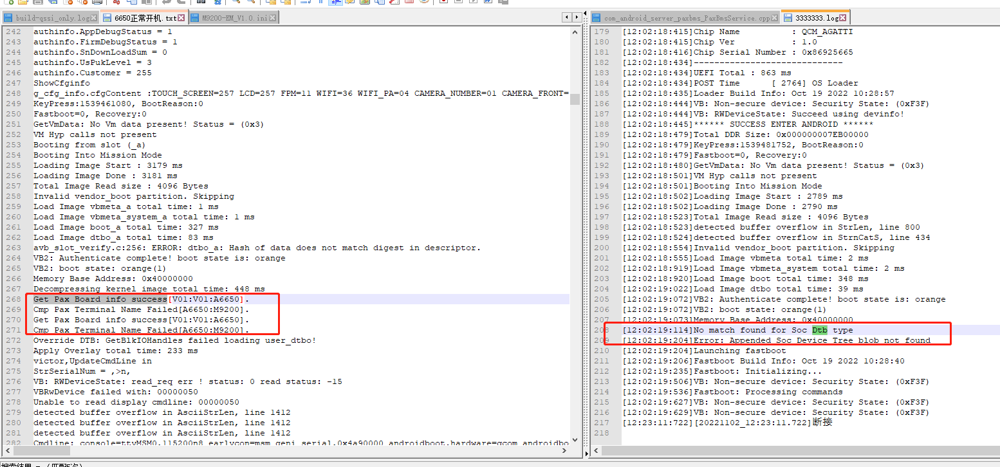

# 概述

AP/SP在ABL和init阶段。

# sp_init ABL流程

sp_init通过串口操作sp是在ABL阶段，主要有以下几个功能：
* fastboot write xxxxx nv
* fastboot flash 
* init uart get cfg/authorinfo获取

# cfg/authorinfo获取

下面先看ap串口如何读取sp中的cfg和authinfo信息，分为以下几个步骤：
* 1. 从cfg分区读取cfg信息。
* 2. 从xxxxx_nvram分区获取xxxxxsp spsn spexsn ethmac wifimac。
* 3. 如果支持sp则从sp再读一遍上面两个信息。
```C++
* LinuxLoaderEntry //ABL入口
  └── sp_init();
      ├── xxxxx_sp_cfg_init()
      │   ├── processGetAuthinfo();
      │   │   ├── 从xxxxx_nvram分区获取authinfo
      │   │   └── authinfo_setup();
      │   │       ├── StrnCpyS (Pname, ARRAY_SIZE (Pname),(CHAR16 *)Lxxx_NVRAM_NAME, StrLen ((CHAR16 *)Lxxx_NVRAM_NAME));
      │   │       ├── xxxxx_nvram_ptr =  AllocatePages (ALIGN_PAGES (xxx_PARTITION_SIZE, ALIGNMENT_MASK_4KB));
      │   │       ├── LoadImageFromPartition (xxxxx_nvram_ptr, &ImageSize,Pname);
      │   │       ├── OtpReadSecMode(buff,xxxxx_nvram_ptr);//从nvram分区里读取SecMode状态
      │   │       ├── memcpy(&g_authinfo.AppDebugStatus,xxxxx_nvram_ptr+BBL_APP_STATUS_OFFSET,BBL_APP_STATUS_SIZE); //应用调试态信息
      │   │       └── memcpy(&g_authinfo.FirmDebugStatus,xxxxx_nvram_ptr+BBL_FIRM_STATUS_OFFSET,BBL_FIRM_STATUS_SIZE); //固件调试态信息
      │   ├── 从cfg分区读取cfg信息
      │   ├── processGetCfginfo();
      │   │   ├── #define Lxxx_CFG_PARTITION_NAME     L"xxxxx_cfg"
      │   │   ├── StrnCpyS (Pname, ARRAY_SIZE (Pname),(CHAR16 *)Lxxx_CFG_PARTITION_NAME, StrLen ((CHAR16 *)Lxxx_CFG_PARTITION_NAME));
      │   │   ├── LoadImageFromPartition (ImageBuffer, &ImageSize,Pname);
      │   │   ├── #define SIGN_FLAG       "SIGNED_VER:00001"
      │   │   └── for(ImageSize = 0,p = ImageBuffer;ImageSize < MAX_PARAM_DATA - SIGN_FLAG_LENGTH + 1 ;ImageSize++,p++){
      │   │       ├── find = 1; //从cfg分区找字符串SIGNED_VER:00001，有则表示已签名
      │   │       └── if(find)
      │   │           └── find = parseAndSaveSpCfgFileInfo(ImageBuffer, ImageSize);
      │   │               ├── #define MAX_PARAM_DATA 2048
      │   │               └── memcpy(&cfginfo, pCfgDataBuf, cfgDataLen > MAX_PARAM_DATA ? MAX_PARAM_DATA : cfgDataLen); //直接拷贝2048 bit过来
      │   ├── 从xxxxx_nvram分区获取xxxxxsp spsn spexsn ethmac wifimac
      │   └── initOtherCfg(); 
      │       ├── #define Lxxx_NVRAM_NAME             L"xxxxx_nvram"
      │       ├── StrnCpyS (Pname, ARRAY_SIZE (Pname),(CHAR16 *)Lxxx_NVRAM_NAME, StrLen ((CHAR16 *)Lxxx_NVRAM_NAME)); 
      │       ├── ImageBuffer =  AllocatePages (ALIGN_PAGES (xxx_PARTITION_SIZE, ALIGNMENT_MASK_4KB));
      │       ├── LoadImageFromPartition (ImageBuffer, &ImageSize,Pname); //指针指向xxxxx_nvram分区
      │       ├── memcpy(char_len,ImageBuffer+UBOOT_EXSN_OFFSET,2); //获取xxxxxsp exsn数据长度的buffer
      │       ├── memset(g_other_cfg.xxxxxspexsn, 0, sizeof(g_other_cfg.xxxxxspexsn)); //赋值给g_other_cfg结构体
      │       └── memcpy(g_other_cfg.xxxxxspexsn,ImageBuffer+UBOOT_EXSN_OFFSET+2,g_other_cfg.xxxxxspexsn_len);//获取xxxxxsp exsn数据buffer
      └── if (is_sp_support()) //如果支持sp则从sp再读一遍
          ├── sp_info_reset();
          └── ret = xxxxx_sp_uart_init();
              ├── sp_uart_init();
              │   └── uart5_initialize(); //硬件初始化
              ├── xxxxx_serial_flush();
              ├── sp_get_info();//重要，串口读取sp cfg信息
              │   ├── shakeHandSP(); //AP/SP握手
              │   ├── processGetCfgInfo() //从sp获取配置文件
              │   │   └── processCmd(CMD_GET_COMMON_INFO, buf, sizeof(buf)); //向sp发送0xE9命令
              │   │       ├── makePackage(g_tx_buf, cmd, param, param_len); //做包
              │   │       ├── puts_sp(g_tx_buf, len); //发送指令
              │   │       │   └── xxxxx_serial_putc(tx_buff, len); //写一个byte函数
              │   │       │       └── uart5_write((UINT8*)buf+count*TXFIFO_SIZE,bytes_to_tx % TXFIFO_SIZE);
              │   │       └── ret = receivePackage(cmd, g_rx_buf, &g_rx_index, &g_rx_size);
              │   │           └── receiveMsg(cmd_ref, recvmsg, pos, size, true);
              │   │               └── gets_sp(tmp_buf, 1, 8000); //接收string
              │   │                   └── ret = getc_sp(&ch); /
              │   │                       ├── while ((len > 0) && (timeout > 0))
              │   │                       └── xxxxx_serial_getc(&buf, 1); //接收byte
              │   │                           └── uart5_read((UINT8 *)buf, bytes_to_rx);
              │   └── processgetAuthInfo();
              ├── debugAuthInfo(); //输出打印
              └── ShowCfginfo();
```

* `xxxxx_cfg_sp.c`看一下`g_other_cfg`/`g_authinfo`/`g_cfg_info`结构体，g_cfg_info还要分解:
```C++
typedef struct _cfg_info
{
#if 1
        char cfgContent[2048];
#else
        char IC_CARD[10];	 //"06"
        char RF_1356M[10];	 //="02"
        char MAIN_BOARD[10];	//="V01"
        char PORT_BOARD[10];	//="Vff"
        char SAM_BOARD[10];	 //="V01"
        char ANT_BOARD[10];	 //="V03"
        char PN[20];	 //="PX7-0BF-RD5-01AA"
        char TERMINAL_NAME[10];	//="PX7"
        char CAMERA_NUMBER[10];	//="01"
        char SAM_NUM[10];	 //="02"
        char CONFIG_FILE_VER[20];//="000000_V1.0"
        char MESH_BOARD[10];	//="V34"
        char MAG_CARD[10];	 //="MH1601-V01" //锟斤拷讯锟斤拷一锟斤拷锟斤拷艽锟酵?
        char RF_PARA_1[30];	 //="00000FFF04040F7F1000"
        char RF_PARA_2[30];	 //="9F6C0B0B020300000000"
        char RF_PARA_3[30];	 //="00000000000000000000"
        char rev[50];
#endif
}t_cfg_info;

typedef struct _POS_AUTH_INFO
{
        uint len;
        uint TamperClear;
        uint LastBblStatus;
        ushort SecMode;
        ushort security_level;
        uchar SnDownLoadSum;
        uchar AppDebugStatus;
        uchar FirmDebugStatus;
        uchar UsPukLevel;
        uchar AuthDownSn;
        uchar MachineType;
        uchar AesKey[8];
        ushort Customer;//xxxxx ==0 &&255
        ushort NowPukLevel;/*now puk level*/
#define AUTH_RES_NUM 0x0E
        ushort reserve[AUTH_RES_NUM];

} __attribute__((packed)) POS_AUTH_INFO;

typedef struct _other_cfg_info 
{
    char xxxxxspexsn[MAX_OTHER_CFG_LENGTH];
    char xxxxxspexsn_len;
    char xxxxxspsn[MAX_OTHER_CFG_LENGTH];
    char xxxxxspsn_len;
    char xxxxxspmac[MAC_NV_LENGTH*2+5];//ethmac
    char xxxxxspmac_len;
    char xxxxxbtmac[MAC_NV_LENGTH*2+5];
    char xxxxxbtmac_len;
    char xxxxxwifimac[MAC_NV_LENGTH*2+5];
    char xxxxxwifimac_len;
}t_other_cfg_info;
```

## AP/SP握手流程

* ap/sp开机先做一次握手，然后再通信，就是AP发送D字符给SP，SP回字符X：
```C++
#define	SHAKE_REQUEST  'D'
#define	SHAKE_REPLY    'X'

static int shakeHandSP(void)
{
        unsigned char ch;
        int retry = 0;
        int ret;
        int count = 0;

#define SHAKEHAND_TRY_TIMES 50

        while (1) {
                putc_sp(SHAKE_REQUEST);
                ret = gets_sp(&ch, 1, 2000);
                //dprintf(ALWAYS, "[%d]shake reply: %d, %c\n", retry, ret, ch);
                if (ret > 0) {
                        if (ch == SHAKE_REPLY) {
                                count++;
                                if (count >= 2)
                                        break;
                        }
                }
                else {
                        MicroSecondDelay(10000); //10ms
                }

                if (++retry >= SHAKEHAND_TRY_TIMES) {
                        dprintf(ALWAYS, "sp handshake timeout, retry: %d\n", retry);
                        return -1;
                }
        }

        dprintf(ALWAYS, "sp handshake ok, retry: %d\n", retry);
        return 0;
}

```

## AP/SP通信协议

AP向SP发包格式如下，注意双方在接收前都会先等待ACK，等到了再去读取，读取完再发送ACK：
```C++
#define PACK_STX  0x02
#define	ACK	 0x06

pack_buf[0] = PACK_STX;
pack_buf[1] = cmd;
pack_buf[2] = (unsigned char)(data_len >> 24);
pack_buf[3] = (unsigned char)(data_len >> 16);
pack_buf[4] = (unsigned char)(data_len >> 8);
pack_buf[5] = (unsigned char)(data_len >> 0);
pack_buf[6] = ucLRC; //冗余校验
```

* 发送函数`processCmd`:
```C++
//指令：
enum {
        CMD_GET_BOOT_INFO = 0xE1,

        CMD_DOWNLOAD_REQUEST = 0xE2,
        CMD_ERASE_FLASH = 0xE3,
        CMD_TRANSE_FILE = 0xE4,
        CMD_CHECK_TRANSE_OVER = 0xE5,
        CMD_WRITE_FILE_TO_FLASH = 0xE6,

        CMD_ERASE_FILE_SYSTEM = 0xE7,

        CMD_DOWNLOAD_COMMON_INFO = 0xE8,
        CMD_GET_COMMON_INFO = 0xE9,

        CMD_QUIT = 0xFF,
};

#define	ACK	 0x06
#define PACK_STX  0x02
#define MAX_PACK_SIZE  (4096+64)

//校验位计算
static uchar getLRC(uchar *pszBuf, int iLen)
{
        uchar ucTmp;
        int iLoop;

        for (iLoop=1,ucTmp=pszBuf[0]; iLoop<iLen; iLoop++) {
                ucTmp ^= pszBuf[iLoop];
        }

        return ucTmp;
}

static int makePackage(uchar *pack_buf, uchar cmd, uchar *data, uint data_len)
{
        int i;
        unsigned char ucLRC;
        unsigned int pack_size;

        pack_size = 0;

        pack_buf[0] = PACK_STX;
        pack_buf[1] = cmd;
        pack_buf[2] = (unsigned char)(data_len >> 24);
        pack_buf[3] = (unsigned char)(data_len >> 16);
        pack_buf[4] = (unsigned char)(data_len >> 8);
        pack_buf[5] = (unsigned char)(data_len >> 0);

        pack_size += 6;

        for (i=0; i < data_len; i++) {
                pack_buf[pack_size+i] = data[i];
        }
        pack_size += data_len;

        ucLRC = getLRC(&pack_buf[1], pack_size-1);
        pack_buf[pack_size] = ucLRC; //冗余校验
        pack_size += 1;

        return pack_size;
}

static int processCmd(uchar cmd, uchar *param, uint param_len)
{
        int ret = -1;
        int len;
        int try_send = 0;

#define PROCESS_TRY_CNT 3

        /* flush */
        //xxxxx_serial_flush();

        len = makePackage(g_tx_buf, cmd, param, param_len);

        if (len > 0) {
                while (try_send++ < PROCESS_TRY_CNT) {
                        memset(g_rx_buf, 0, sizeof(g_rx_buf));

                        //dumpBuff(g_tx_buf, len);
                        puts_sp(g_tx_buf, len);

                        ret = receivePackage(cmd, g_rx_buf, &g_rx_index, &g_rx_size);
                        if (ret == 0)
                                break;
                }
        }

        return ret;
}
```

## AP获取SP打印信息

```log
 ---ShowAuthinfo---
authinfo.SecMode = 3
authinfo.security_level = 3
authinfo.TamperClear = 0
authinfo.LastBblStatus = 0
authinfo.AppDebugStatus = 1
authinfo.FirmDebugStatus = 1
authinfo.SnDownLoadSum = 0
authinfo.UsPukLevel = 3
authinfo.Customer = 255
ShowCfginfo
g_cfg_info.cfgContent :TOUCH_SCREEN=257 LCD=257 FPM=11 WIFI=36 WIFI_PA=04 CAMERA_NUMBER=01 CAMERA_FRONT=80 MAIN_BOARD=V01 PORT_BOARD=V01 PN=A665x-AA200-260A-2N0-EA CONFIG_FILE_VER=2570000_V1.0 TERMINAL_NAME=A665x
```

# fastboot flash命令定制

看一下fastboot flash命令定制烧录spexsn/sp_reboot命令，xxxxx_cfg/cfg分区、sp_monitor/sp_boot镜像流程：
* `UM.9.15/bootable/bootloader/edk2/QcomModulePkg/Library/FastbootLib/FastbootCmds.c`:
* 1. 判断modem镜像和关键字是否匹配。
* 2. 目前只做了cfg和xxxxx_cfg分区烧录，sp exsn烧录，sp_reboot命令。
```C++
* FastbootCommandSetup (IN VOID *Base, IN UINT64 Size)
  └── {"flash:", CmdFlash},
      ├── Ret = is_overlay_partition(PartitionName); //判断烧录命令是否带_xxxxx_，比如 paydroidboot flash modem_a_xxxxx_A665x_EM NON-HLOS_EM.bin
      │   └── Token = StrStr(partitionName,L"_xxxxx_");
      └── if(StrnCmp(PartitionName+Ret+5, Buff16, StrLen(Buff16)) == 0){// only flash match Terminal name,else return; +5 means _xxxxx_
          └── if(StrLen(PartitionName) > (Ret+5+StrLen(Buff16))){//partition_name + _xxxxx_ + TermialName. something more after  terminalname,like modem_a_xxxxx_A665x_EM
              ├── if(getCfgBaseBand(Buff) < 0 ) 
              │   ├── getCfgItemValStr("BASEBAND", buf); //获取BASEBAND关键字 例如BASEBAND="77"
              │   ├── #define BASEBAND_A665x_EM_CFG  "77"
              │   └── if((0 == AsciiStrCmp(Buff, BASEBAND_A665x_EM_CFG) && NULL != StrStr(PartitionName, L"A665x_EM"))||(0 == AsciiStrCmp(Buff, BASEBAND_A665x_NA_CFG) && NULL != StrStr(PartitionName, L"A665x_NA"))) //如果BASEBAND="77" 且命令带有A665x_EM字符，满足条件
              │       └── SetMem(PartitionName+Ret, MAX_GPT_NAME_SIZE-Ret, 0); //烧录
              └── if(is_sp_partition(PartitionName)) //是否支持SP
                  ├── if ( (StrnCmp(PartitionName, Lxxx_CFG_PARTITION_NAME, StrLen(Lxxx_CFG_PARTITION_NAME)) == 0)|| (StrnCmp(PartitionName, LCFG_PARTITION_NAME, StrLen(LCFG_PARTITION_NAME)) == 0) ) //cfg和xxxxx_cfg分区烧录
                  │   └── HandleRawImgFlash (Lxxx_CFG_PARTITION_NAME,ARRAY_SIZE (Lxxx_CFG_PARTITION_NAME),mFlashDataBuffer, mFlashNumDataBytes);
                  ├── else if (xxxxxnv_download_all(PartitionName, mFlashDataBuffer, mFlashNumDataBytes)) //sp exsn烧录
                  │   └── if(StrnCmp(DownloadName, L"exsn", StrLen(L"exsn")) ==  0 )
                  │       └── writeToPartitionPax(aucTempbuf,len+2,UBOOT_EXSN_OFFSET);
                  └── if (EFI_SUCCESS == Status || (StrnCmp(PartitionName, L"sp_reboot", StrLen(L"sp_reboot")) == 0)) //sp重启命令
                      └── sp_download_all(PartitionName, mFlashDataBuffer, mFlashNumDataBytes)
                          └── else if(StrnCmp(DownloadName, L"sp_reboot", StrLen(L"sp_reboot")) ==0 )
                              └── xxxxx_sp_reset();
```

# SP属性通过cmdline到kernel

SP属性通过cmdline到kernel具体实现方式和哪些cmdline请参考：
* [0024_mtk_qcom_添加cmdline实现方案.md](/0009_kernel_function/docs/0024_mtk_qcom_添加cmdline实现方案.md)

# 根据cmdline设置xxxxx属性流程(ro.xxxxx.product.id等)

* 首先了解一下`ro.xxxxx.product.id`设置流程：
* `system/core/init/init.cpp`:
```C++
* SecondStageMain(int argc, char** argv)
  └── PropertyInit();
      └── ProcessKernelCmdline();
          └── if (StartsWith(key, ANDROIDBOOT_PREFIX)) //constexpr auto ANDROIDBOOT_PREFIX = "androidboot."sv;
              └── xxxxx_import_kernel_nv(key,value);
                  └── if (!strcmp(name, "TERMINAL_NAME")) //system/core/init/xxxxx_init.cpp
                      ├── InitPropertySet("ro.boot.xxxxxproduct", value.c_str());
                      └── InitPropertySet("ro.fac.cfg.TERMINAL_NAME", value.c_str());
```
* `core/init/xxxxx_init.cpp`具体内容如下：
```C++
#include <string.h>
#include <stdio.h>
#include <unistd.h>
#include <stdlib.h>
#include <android-base/properties.h>
#include <android-base/logging.h>
#include "property_service.h"
#include "xxxxx_init.h"

namespace android {
namespace init {

void xxxxx_import_kernel_nv(const std::string &key, const std::string& value)
{
        const char *name = key.c_str();
        if (!strcmp(name, "TERMINAL_NAME"))
        {
                InitPropertySet("ro.boot.boardname", value.c_str());
                InitPropertySet("ro.fac.cfg.TERMINAL_NAME", value.c_str());
        InitPropertySet("ro.boot.xxxxxproduct", value.c_str());
        }
        else if (!strcmp(name, "xxxxxboot_mode"))
        {
                InitPropertySet("ro.xxxxxboot.mode", value.c_str());
        }
    else if (!strcmp(name, "TOUCH_SCREEN"))
    {
        InitPropertySet("ro.touch.screen", value.c_str());
        InitPropertySet("ro.fac.cfg.TOUCH_SCREEN", value.c_str());
    }
        else if(!strcmp(name, "xxxxxspsn"))
        {
                InitPropertySet("xxxxx.sp.SN", value.c_str()); //sn number
                if(value != ""){
                        InitPropertySet("ro.fac.sn", value.c_str());
                        InitPropertySet("ro.serialno", value.c_str());//new
                }
        }
        //ro.fac.exsn
        else if(!strcmp(name, "xxxxxspexsn"))
        {
                InitPropertySet("ro.fac.exsn", value.c_str());//new
                InitPropertySet("xxxxx.sp.exsn", value.c_str());
        }
        else if(!strcmp(name, "MAIN_BOARD"))
        {
                InitPropertySet("ro.fac.cfg.MAIN_BOARD", value.c_str());
        }
        else if(!strcmp(name, "PORT_BOARD"))
        {
                InitPropertySet("ro.fac.cfg.PORT_BOARD", value.c_str());
        }
        else if(!strcmp(name, "SAM_BOARD"))
        {
                InitPropertySet("ro.fac.cfg.SAM_BOARD", value.c_str());
        }
        else if(!strcmp(name, "ANT_BOARD"))
        {
                InitPropertySet("ro.fac.cfg.ANT_BOARD", value.c_str());
        }
        else if(!strcmp(name, "PRINTER"))
        {
                InitPropertySet("ro.fac.cfg.PRINTER", value.c_str());
        }
        else if(!strcmp(name, "MAG_CARD"))
        {
                InitPropertySet("ro.fac.cfg.MAG_CARD", value.c_str());
    }
        else if(!strcmp(name, "IC_CARD"))
        {
                InitPropertySet("ro.fac.cfg.IC_CARD", value.c_str());
    }
        else if(!strcmp(name, "RF_1356M"))
        {
                InitPropertySet("ro.fac.cfg.RF_1356M", value.c_str());
        }
        else if(!strcmp(name, "ETHERNET"))
        {
                InitPropertySet("ro.fac.cfg.ETHERNET", value.c_str());
        }
        else if(!strcmp(name, "MODEM"))
        {
                InitPropertySet("ro.fac.cfg.MODEM", value.c_str());
        }
        else if(!strcmp(name, "CDMA"))
        {
                InitPropertySet("ro.fac.cfg.CDMA", value.c_str());
        }
        else if(!strcmp(name, "BASEBAND"))
        {
                InitPropertySet("ro.fac.cfg.BASEBAND", value.c_str());
        }
        else if(!strcmp(name, "WCDMA"))
        {
                InitPropertySet("ro.fac.cfg.WCDMA", value.c_str());
        }
        else if(!strcmp(name, "4G"))
        {
                InitPropertySet("ro.fac.cfg.4G", value.c_str());
        }
        else if(!strcmp(name, "WIFI_NET"))
        {
                InitPropertySet("ro.fac.cfg.WIFI_NET", value.c_str());
        }
    else if(!strcmp(name, "WIFI"))
        {
                InitPropertySet("ro.fac.cfg.WIFI", value.c_str());
        }
    else if(!strcmp(name, "FPM"))
        {
                InitPropertySet("ro.fac.cfg.FPM", value.c_str());
        }
        else if(!strcmp(name, "BLUE_TOOTH"))
        {
                InitPropertySet("ro.fac.cfg.BLUE_TOOTH", value.c_str());
        }
        else if(!strcmp(name, "DUAL_SIM"))
        {
                InitPropertySet("ro.fac.cfg.DUAL_SIM", value.c_str());
        }
        else if(!strcmp(name, "LCD"))
        {
                InitPropertySet("ro.fac.cfg.LCD", value.c_str());
        }
        else if(!strcmp(name, "BAT_DECT"))
        {
                InitPropertySet("ro.fac.cfg.BAT_DECT", value.c_str());
        }
        else if(!strcmp(name, "SAM_NUM"))
        {
                InitPropertySet("ro.fac.cfg.SAM_NUM", value.c_str());
        }
        else if(!strcmp(name, "CIPHER_CHIP"))
        {
                InitPropertySet("ro.fac.cfg.CIPHER_CHIP", value.c_str());
        }
        else if(!strcmp(name, "CAMERA_FRONT"))
        {
                InitPropertySet("ro.fac.cfg.CAMERA_FRONT", value.c_str());
        }
        else if(!strcmp(name, "CAMERA_BACK"))
        {
                InitPropertySet("ro.fac.cfg.CAMERA_BACK", value.c_str());
        }
        else if(!strcmp(name, "PN"))//PN
        {
                InitPropertySet("ro.fac.cfg.PN", value.c_str());//new
                InitPropertySet("ro.pci.hardware", value.c_str());      //PCI hardware
        }
        else if(!strcmp(name, "CAMERA_NUMBER"))
        {
                InitPropertySet("ro.fac.cfg.CAMERA_NUMBER", value.c_str());
        }
        else if(!strcmp(name, "SAM_NUM"))
        {
                InitPropertySet("ro.fac.cfg.SAM_NUM", value.c_str());
        }
        else if(!strcmp(name, "CONFIG_FILE_VER"))
        {
                InitPropertySet("ro.fac.cfg.CONFIG_FILE_VER", value.c_str());
        }
        else if(!strcmp(name, "MESH_BOARD"))
        {
                InitPropertySet("ro.fac.cfg.MESH_BOARD", value.c_str());
        }
        else if(!strcmp(name, "RF_PARA_1"))
        {
                InitPropertySet("ro.fac.cfg.RF_PARA_1", value.c_str());
        }
        else if(!strcmp(name, "RF_PARA_2"))
        {
                InitPropertySet("ro.fac.cfg.RF_PARA_2", value.c_str());
        }
        else if(!strcmp(name, "RF_PARA_3"))
        {
                InitPropertySet("ro.fac.cfg.RF_PARA_3", value.c_str());
        }
        else if(!strcmp(name, "RF_PARA_4"))
        {
                InitPropertySet("ro.fac.cfg.RF_PARA_4", value.c_str());
        }
        else if(!strcmp(name, "RF_PARA_5"))
        {
                InitPropertySet("ro.fac.cfg.RF_PARA_5", value.c_str());
        }
        else if(!strcmp(name, "RF_PARA_6"))
        {
                InitPropertySet("ro.fac.cfg.RF_PARA_6", value.c_str());
        }
        else if(!strcmp(name, "RF_PARA_7"))
        {
                InitPropertySet("ro.fac.cfg.RF_PARA_7", value.c_str());
        }
        else if(!strcmp(name, "RF_PARA_8"))
        {
                InitPropertySet("ro.fac.cfg.RF_PARA_8", value.c_str());
        }
        else if(!strcmp(name, "RF_PARA_9"))
        {
                InitPropertySet("ro.fac.cfg.RF_PARA_9", value.c_str());
        }
        else if(!strcmp(name, "RF_PARA_10"))
        {
                InitPropertySet("ro.fac.cfg.RF_PARA_10", value.c_str());
        }
        else if(!strcmp(name, "xxxxxspmac"))
        {
                InitPropertySet("ro.fac.mac", value.c_str());
        InitPropertySet("xxxxx.sp.mac", value.c_str());
        }
        else if(!strcmp(name, "MSR_VER"))
        {
                InitPropertySet("xxxxx.ctrl.magchipver", value.c_str());
        }
        else if(!strcmp(name, "BIOS"))
        {
                InitPropertySet("xxxxx.ctrl.spbootver", value.c_str());
                InitPropertySet("xxxxx.sp.BIOS",value.c_str());
        }
        else if(!strcmp(name, "MONITOR"))
        {
                InitPropertySet("xxxxx.ctrl.spver", value.c_str());//Ftest need
                InitPropertySet("xxxxx.sp.MONITOR", value.c_str());//Ftest need
        }
        else if(!strcmp(name, "BATTERY"))
        {
                InitPropertySet("ro.fac.cfg.BATTERY", value.c_str());
        }
        else if(!strcmp(name, "AppDebugStatus"))
        {
                if(!strcmp(value.c_str(), "1")){
                        InitPropertySet("xxxxx.config.apkruntime", "false");
                        InitPropertySet("ro.xxxxx.disable.app_rt.verify","true");
                }else {
                        InitPropertySet("xxxxx.config.apkruntime", "true");
                        InitPropertySet("ro.xxxxx.disable.app_rt.verify","false");
                }

        }else if(!strcmp(name, "has_battery_removed"))
        {
                if(!strcmp(value.c_str(), "1")){
                        InitPropertySet("xxxxx.config.nobattery", "true");
                }else{
                        InitPropertySet("xxxxx.config.nobattery", "false");
                }
        }
        else if(!strcmp(name, "xxxxxbtmac"))//btmac
        {
        InitPropertySet("ro.fac.btmac", value.c_str());
        InitPropertySet("xxxxx.bt.mac", value.c_str());
        }
        else if(!strcmp(name, "xxxxxwifimac"))//wifimac
        {
        InitPropertySet("ro.fac.wifimac", value.c_str());
        InitPropertySet("xxxxx.wifi.mac", value.c_str());
        }
    else if(!strcmp(name, "msm_drm.dsi_display0"))//dpi
    {
        InitPropertySet("ro.sf.lcd_density", value.substr(value.size()-4,3));
    }
    else if(!strcmp(name, "xxxxxctrllog"))//xxxxxctrllog
    {
        InitPropertySet("xxxxx.ctrl.log", value.c_str());
    }

//[FEATURE]-Add-BEGIN by (xielianxiong@xxxxx.com), 2021/12/29 for apk verify xxxxx signature
#ifdef xxxDROID_PCI
    InitPropertySet("sys.xxxxxdroid.debug", "no");
#elif xxxDROID_RELEASE
    InitPropertySet("sys.xxxxxdroid.debug", "no");
#else
    InitPropertySet("sys.xxxxxdroid.debug", "no");
#endif
//[FEATURE]-Add-end by (xielianxiong@xxxxx.com), 2021/12/29 for apk verify xxxxx signature

}

}
}
```

# 调试问题点

## gms分支abl找不打dtb起不来

打印如下：



我们dtb是从sp中读取三个变量，去匹配相应的dtb：
* `m92xx-scuba-iot.dts`:
```shell
/dts-v1/;

#include "scuba-iot.dtsi"

/ {
        model = "Qualcomm Technologies, Inc. Scuba IOT SoC";
        compatible = "qcom,scuba-iot";
        qcom,board-id = <34 2>;

        soc {
                xxxxx_board_info {
                        compatible = "xxxxx,board_info";
                        xxxxx,main_board = "V01";
                        xxxxx,port_board = "V01";
                        xxxxx,terminal_name = "M92xx";
                };
        };
};
```

* log打印如下：
```log
[12:02:19:114]No match found for Soc Dtb type
[12:02:19:204]Error: Appended Soc Device Tree blob not found

//正常：
Get Pax Board info success[V01:V01:A665x].
Cmp Pax Terminal Name Failed[A665x:M92xx].
Get Pax Board info success[V01:V01:A665x].
Cmp Pax Terminal Name Failed[A665x:M92xx].
Override DTB: GetBlkIOHandles failed loading user_dtbo!
```

* 解决方案：
gms分支里面匹配dts都是写死的，改成9200的就行了：
```diff
--- a/UM.9.15/bootable/bootloader/edk2/QcomModulePkg/Library/BootLib/LocateDeviceTree.c
+++ b/UM.9.15/bootable/bootloader/edk2/QcomModulePkg/Library/BootLib/LocateDeviceTree.c
@@ -776,7 +776,7 @@ STATIC EFI_STATUS GetPaxBoardInfoMatchDtb(DtInfo * CurDtbInfo)
   CHAR8 MainBoard[MAX_BOARDINFO_SIZE] = {0};
   CHAR8 PortBoard[MAX_BOARDINFO_SIZE] = {0};;
   CHAR8 TerminalName[MAX_BOARDINFO_SIZE] = {0};;
-  CHAR8 Buff[MAX_BOARDINFO_SIZE] = {"A665x"};
+  CHAR8 Buff[MAX_BOARDINFO_SIZE] = {"M92xx"};
```
