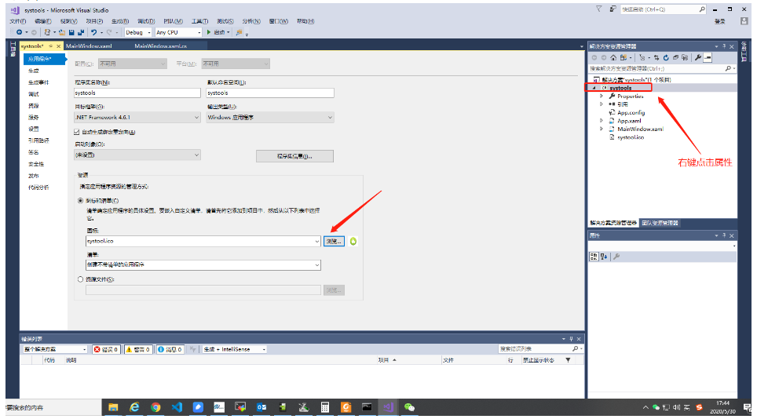
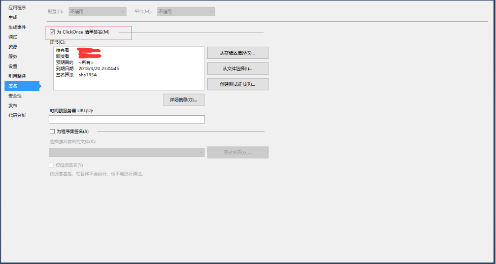

# 简述

WPF前期自学的一些学习记录

## 参考博客
```
https://www.cnblogs.com/zeroone/tag/C%23/
```

## 记录

* 背景渐变色

```
     <Grid.ColumnDefinitions>
            <ColumnDefinition Width="53*"/>
            <ColumnDefinition Width="93*"/>
        </Grid.ColumnDefinitions>
        <Grid.Background>
            <LinearGradientBrush>
                <GradientStop Color="#FF73A05E" Offset="0.367"/>
                <GradientStop Color="White" Offset="1"/>
                <GradientStop Color="#FF6EBF61" Offset="2"/>
            </LinearGradientBrush>
        </Grid.Background>
```

* TextBox加上滚条

```
VerticalScrollBarVisibility="Visible"
```


* adb使用
```
            Process p = new Process();
            p.StartInfo.FileName = "cmd.exe";
            p.StartInfo.UseShellExecute = false;//是否使用操作系统shell启动
            p.StartInfo.RedirectStandardInput = true;//接受来自调用程序的输入信息
            p.StartInfo.RedirectStandardOutput = true;//由调用程序获取输出信息
            p.StartInfo.RedirectStandardError = true;//重定向标准错误输出
           // p.StartInfo.CreateNoWindow = false;//不显示程序窗口
            p.StartInfo.CreateNoWindow = true;          //设置不显示窗口  
            p.Start();//启动程序
            p.StandardInput.WriteLine("adb root");//目录装到C盘
            p.StandardInput.WriteLine("exit");//结束标志
            output = p.StandardOutput.ReadToEnd();//获取cmd窗口的输出信息，即便并无获取的需要也需要写这句话，不然程序会假死
            TextBox1.Text = output;
            p.WaitForExit();//等待程序执行完
            p.Close();//退出进程
```


```
    System.Diagnostics.Process p = new System.Diagnostics.Process();
    p.StartInfo.UseShellExecute = false;
    p.StartInfo.CreateNoWindow = true;
    p.StartInfo.FileName = "cmd.exe";
    p.StartInfo.Arguments = "/c adb shell" + " " + "\"" + "find /sys/devices/platform -name mt_gpio" + "\"";
 
    p.StartInfo.RedirectStandardError = true;
    p.StartInfo.RedirectStandardInput = true;
    p.StartInfo.RedirectStandardOutput = true;

    p.Start();

    string outtr = p.StandardOutput.ReadToEnd();
     MessageBox.Show(outtr);
```

* 给字符转将双引号

```
   String str = "字符串";
   str = "\"" +str+ "\"";
   System.out.println(str);
```
* 判断Combobox清空值

```
if (comboBox1.SelectedIndex != -1)
```

* 字符串过滤去除换行回车符号

```
string l_strResult = 你的字符串.Replace("\n", "").Replace(" ","").Replace("\t","").Replace("\r","");
```
* 过滤如下字符串方法：

```
例如：
M50:/ # systool get imei

read:
imei0 is 123456789022222
imei1 is 123456789022222
imei2 is 000000000000000
imei3 is 000000000000000
[SYSTOOL:0] ok
```
方法：

```
outtr = outtr.Replace("read:", "");
outtr = outtr.Replace("imei0 is ", "");
outtr = outtr.Replace("imei1 is ", "");
outtr = outtr.Replace("imei2 is ", "");
outtr = outtr.Replace("imei3 is ", ""); //先把字母都过滤掉
ImeiArrayStr = outtr.Split(new string[] { "\r\n", ":" },  StringSplitOptions.RemoveEmptyEntries); //将字符串以"\r\n", ":"分隔成字符串

Imei_Select_String = ImeiArrayStr[Convert.ToInt32(SelectedImei)];//得到字符串数组

ImeiText.Text = Imei_Select_String;
```


* TextBox文本框中如何换行

```
首先设置可多行

this.TextBox1.Multiline=true; 

换行

this.TextBox1.Text="加入此换行符即可换行" + "\r\n";
```

* C# int与string转化

```
1、int-->string

1             int a = 15;
2             string s1 = a.ToString();
3             string s2 = Convert.ToString(a);
2、string -->int

1             string s = "18";
2             int a1 = int.Parse(s);
3             int a2;
4             int.TryParse(s, out a2);
5             int a3 = Convert.ToInt32(s);
```
* 去string除括号及括号内的内容

```
string GPIO_Select_Str = String.Concat(GPIO_Select_Arr);
GPIO_Select_Str = Regex.Replace(GPIO_Select_Str.Replace("（", "(").Replace("）", ")"), @"\([^\(]*\)", "");//去除括号及括号内的内容
```

* 如果只去除括号呢

```
GPIO_Select_String = GPIO_Select_String.Replace("(", "");
GPIO_Select_String = GPIO_Select_String.Replace(")", "");
```
* 控件设置

WPF中控件的显示与隐藏的属性是zd Visibility，它有3个枚举值 Visible, Hidden 和 Collapsed。其中Visible为可见，而 Hidden 和 Collapsed 都是隐藏，唯一不同的是 Hidden 只是隐藏，控件还占用其大小空间回；而Collapsed隐藏不占空间，有布局时原本的空间会被其他空间占据。
```
ctrl.Visibility = Visibility.Visible;
```
* string型数组转整型

```
MODE.SelectedIndex = Convert.ToInt32(GPIO_Select_Arr[0]) - '0'; //string转整型
DIR.SelectedIndex = Convert.ToInt32(GPIO_Select_Arr[1]) - '0'; //string转整型
DOUT.SelectedIndex = Convert.ToInt32(GPIO_Select_Arr[2]) - '0'; //string转整型
DIN.SelectedIndex = Convert.ToInt32(GPIO_Select_Arr[3]) - '0'; //string转整型
DRIVE.SelectedIndex = Convert.ToInt32(GPIO_Select_Arr[4]) - '0'; //string转整型
SMT.SelectedIndex = Convert.ToInt32(GPIO_Select_Arr[5]) - '0'; //string转整型
IES.SelectedIndex = Convert.ToInt32(GPIO_Select_Arr[6]) - '0'; //string转整型
PULLEN.SelectedIndex = Convert.ToInt32(GPIO_Select_Arr[7]) - '0'; //string转整型
PULLSEL.SelectedIndex = Convert.ToInt32(GPIO_Select_Arr[8]) - '0'; //string转整型
```
* 每个字符串中间加入空格
```
 GPIO_Select_Str_Print = Regex.Replace(GPIO_Select_Str_Print, @"(?<=.{0}).{1}", " $0"); //每个字符串中间加入空格,供打印使用
```

* 打开网页

```
Process.Start("https://github.com/wuguangnan110/MTK_GPIO_TOOLS");
```

* 定制图标icon



[JPG转ICO - 在线转换图标文件](https://www.aconvert.com/cn/icon/jpg-to-ico/)

* wpf怎么让Textbox只能输入数字

[wpf怎么让Textbox只能输入数字](https://zhidao.baidu.com/question/373380911035071084.html?qbl=relate_question_0&word=wpf%20TextBox%D6%BB%D4%CA%D0%ED%CA%E4%C8%EB%CA%FD%D7%D6)

* textbox控件里怎样让它只能输入一个字符

```
MaxLength="1"
```


* 打包程序

[[WPF]VS2019打包WPF程序](https://blog.csdn.net/weixin_30815427/article/details/98305011?utm_medium=distribute.pc_relevant.none-task-blog-BlogCommendFromMachineLearnPai2-1.nonecase&depth_1-utm_source=distribute.pc_relevant.none-task-blog-BlogCommendFromMachineLearnPai2-1.nonecase)

[VS2017 WPF程序打包部署](https://blog.csdn.net/kenjianqi1647/article/details/93742258)

* 定时器学习
参考

[WPF 使用定时器更新UI界面](https://blog.csdn.net/q465162770/article/details/103408341?utm_medium=distribute.pc_relevant.none-task-blog-baidujs-6)

```
Time = new DispatcherTimer();
Time.Interval = TimeSpan.FromMilliseconds(500);
Time.Tick += Time_Tick;
Time.Start();
            
void Time_Tick(object sender, EventArgs e)
{
    
    System.Diagnostics.Process p = new System.Diagnostics.Process();
    p.StartInfo.UseShellExecute = false;
    p.StartInfo.CreateNoWindow = true;
    p.StartInfo.FileName = "cmd.exe";
    p.StartInfo.Arguments = "/c adb devices";
    p.StartInfo.RedirectStandardError = true;
    p.StartInfo.RedirectStandardInput = true;
    p.StartInfo.RedirectStandardOutput = true;
    p.Start();

    string outtr = p.StandardOutput.ReadToEnd();

    p.Close();
    outtr = outtr.Replace("List of devices attached", "");
    outtr = outtr.Replace("device", "");
    outtr = outtr.Replace("\r", "");
    outtr = outtr.Replace("\n", "");
    if (outtr.Length == 0)
    {
        led.Fill = new SolidColorBrush(Colors.Red);
        led.Stroke = new SolidColorBrush(Colors.Red);
        if (value == 0)
        {
            MessageBox.Show("请连接adb设备");
            value++;
        }
    }
    else
    {
        led.Fill = new SolidColorBrush(Colors.Green);
        led.Stroke = new SolidColorBrush(Colors.Green);
        Time.Stop();
        if (value == 1)
        {
            MessageBox.Show("找到adb设备：" + outtr);
            value = 0;
        }
    }

}
```

* C# Split 分隔符为字符串及空格的处理

```
string outtr = p.StandardOutput.ReadToEnd();
string[] ArrayStr = outtr.Split(new string[] { "\r\n", ":" }, StringSplitOptions.RemoveEmptyEntries);
```


* 截取括号里的字符串

```
str = System.Text.RegularExpressions.Regex.Replace(@"带括号的(ddd)字符串", @"(.*\()(.*)(\).*)", "$2");//
```

* 判断文件是否存在

```
string Path = Environment.CurrentDirectory + "\\Images";
if (!System.IO.Directory.Exists(Path))
{
    System.IO.Directory.CreateDirectory(Path);//创建该文件夹
}
```

* C#-----字符串中加入反斜杠\
参考：

[C#-----字符串中加入反斜杠](https://www.cnblogs.com/lumao1122-Milolu/p/11630666.html)

字符串前加@
```
const string SIM1 = @"service call iphonesubinfo 3 i32 2 | grep -o '[0-9a-f]\{8\} ' | tail -n+3 | while read a; do echo -n \\u${a:4:4}\\u${a:0:4}; done";
```

* C#几个经常用到的字符串截取

```
1、取字符串的前i个字符

(1)string str1=str.Substring(0,i);

(2)string str1=str.Remove(i,str.Length-i);

2、去掉字符串的前i个字符

string str1=str.Remove(0,i);

string str1=str.SubString(i);

3、从右边开始取i个字符：

string str1=str.SubString(str.Length-i);

string str1=str.Remove(0,str.Length-i);

4、从右边开始去掉i个字符：

string str1=str.Substring(0,str.Length-i);

string str1=str.Remove(str.Length-i,i);

5 、如果字符串中有"abc"则替换成"ABC"
   str=str.Replace("abc","ABC");

6、c#截取字符串最后一个字符的问题!！！！！！！！！！！！！！！！！！！！！
str1.Substring(str1.LastIndexOf(",")+1);

7、C# 截取字符串最后一个字符

k = k.Substring(k.Length-1, 1);

 
```

* C# 16 进制字符串转 int的方法

```
    outtr = outtr.Replace("reg0x75:", "");
    outtr = outtr.Replace(",", "");
    outtr = outtr.Replace("0x", "");

    int cur_value = Convert.ToInt32(outtr, 16);
```
* C# int 转 16进制字符

```
   int tt = 30; //0x1E
   string st = tt.ToString("X");  //st = "1E"

   string st = tt.ToString("x");  //st = "1e"
```


* 增加自己写的返回函数， return null非常必要。

```
     private string Get_MT6370_Reg_value(string Reg)
        {
            try
            {
                p.StartInfo.UseShellExecute = false;
                p.StartInfo.CreateNoWindow = true;
                p.StartInfo.FileName = "cmd.exe";
                p.StartInfo.Arguments = "/c adb shell " + "\"" + "cat /sys/kernel/debug/rt-regmap/mt6370_pmu/reg0x" + Reg + "\"";
                p.StartInfo.RedirectStandardError = true;
                p.StartInfo.RedirectStandardInput = true;
                p.StartInfo.RedirectStandardOutput = true;

                p.Start();
                string outtr = p.StandardOutput.ReadToEnd();
                p.Close();

                outtr = outtr.Replace("\n", "").Replace(" ", "").Replace("\t", "").Replace("\r", "").Replace(":", "").Replace("0x", "").Replace(Reg, "").Replace("reg", "").Replace(",", "");

                return outtr;
            }
            catch
            {
                MessageBox.Show("请连接手机adb");
            }
            return null;
        }
```
* `adb shell`一条多个命令

例如：

```
adb shell  "cat  /sys/kernel/debug/rt-regmap/mt6370_pmu/reg0xa4 && cat  /sys/kernel/debug/rt-regmap/mt6370_pmu/reg0xa5"
reg0xa4:0x00,
reg0xa5:0x96,

代码如下：
    p.StartInfo.UseShellExecute = false;
    p.StartInfo.CreateNoWindow = true;
    p.StartInfo.FileName = "cmd.exe";


    p.StartInfo.Arguments = "/c adb shell " + " " + "\"" + "cat"  + "  /sys/kernel/debug/rt-regmap/mt6370_pmu/reg0xa4" + " && " + "cat" + "  /sys/kernel/debug/rt-regmap/mt6370_pmu/reg0xa5" + "\"";
    p.StartInfo.RedirectStandardError = true;
    p.StartInfo.RedirectStandardInput = true;
    p.StartInfo.RedirectStandardOutput = true;

    p.Start();
    string outtr = p.StandardOutput.ReadToEnd();
    p.Close();
```
### 如何取字符串中某个字母前的字符串：

```
C:\Users\wugangnan>adb shell cat /sys/class/mtk-adc-cali/mtk-adc-cali/AUXADC_read_channel
[ 0, 531, 198]-      ADC_RFTMP-
[ 1, 590, 219]-      ADC_APTMP-
[ 2, 427, 161]-ADC_LCM_VOLTAGE-
[ 3,  25,  18]-               -
[ 4,2162, 776]-               -
[ 5,   0,   9]-               -
[ 6,   0,   9]-               -
[ 7,   0,   9]-               -
[ 8,   0,   9]-               -
[ 9,   0,   9]-               -
[10,3546,1268]-               -
[11,3552,1270]-               -
[12,   0,   9]-               -
[13,   0,   9]-               -
[14,   0,   9]-               -
[15,   0,   9]-               -
-->REG:0x781a09e5,GAIN: 131,GE_A: 642,OE_A: 485,GE: 130,OE: -27
```

* 代码修改如下：
```
    int index = outtr.IndexOf('L') - 9; //先定位到L前面9个单位的位置
    string adc_value = outtr.Substring(index, 3);  //取3个单位
    int value = Convert.ToInt32(adc_value); //转换成int型
```

### 编译报错不签名
打印：No certificates were found that met all the given criteria

解决方案：

打开项目->属性->签名，去掉为 ClickOnce 清单签名即可。



### C#中string类使用Remove方法来移除指定位置的字符

```
举例，字符串string strA="ABCDEFG";

（1）移除从第4个字符开始后面的所有字符串可使用下列语句

string result=strA.Remove(3);//索引从0开始，第一个字符代表0

（2）从第4个字符开始，并且往后移除3个字符，可使用下列语句

string result=strA.Remove(3，3);//索引从0开始，第一个字符代表0
```


### 快捷键说明

* 1.注释头

在 VS 中，对类或者方法添加 C# 注释头很简单，只需要在类或者方法的上一行输入"///" 即可自动补全：