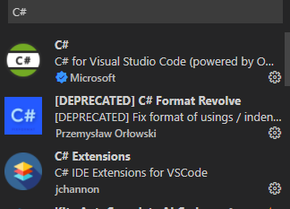
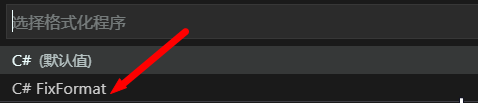
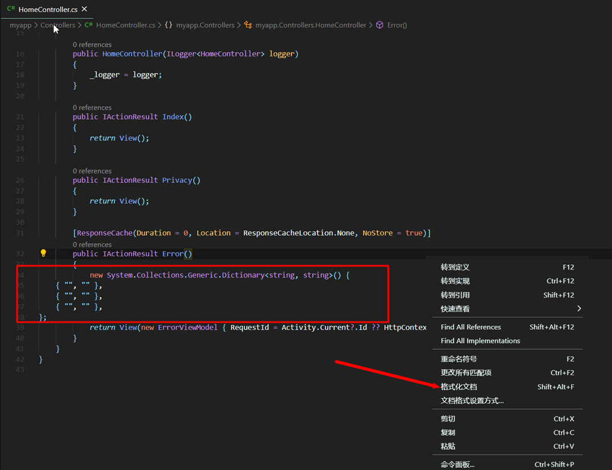
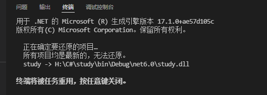
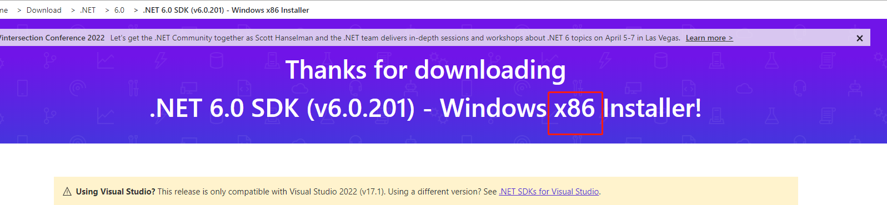

# 简述

用VS Code写C#教程

## 参考

* [用VS Code写C#](https://www.cnblogs.com/yunquan/p/10872743.html)
* [用VS Code写C#](https://www.cnblogs.com/springsnow/p/12881499.html)

## 记录

### 下载SDK
* [点我下载](https://dotnet.microsoft.com/en-us/download/dotnet/thank-you/sdk-6.0.201-windows-x64-installer)

首先要下载一个.net Core的SDK，,微软的，一路下一步就行。

### 安装C#支持

在VS Code里找插件，安装VS Code的支持，我推荐安装3个插件，C#,C#语法支持，以及一些快捷方式支持，如下图的三个插件，其实你搜C#，出来的前三位就是他们了。



### 快速创建C#控制台

你在安装完成.net Core SDK之后，打开命令行，输入`dotnet -h`，只要出来内容，就证明SDK安装是没问题的，下一步，输入`dotnet new console -o H:\C#\study`:
```C#
PS H:\wugn\md> dotnet new console -o H:\C#\study
已成功创建模板“控制台应用”。

正在处理创建后操作...
在 H:\C#\study\study.csproj 上运行 “dotnet restore”...
  正在确定要还原的项目…
  已还原 H:\C#\study\study.csproj (用时 71 ms)。
已成功还原。
```

讲解一下，new是新建，console是控制台，-o是IO路径，后面的是我准备安放的路径，H盘的study目录下，项目名称是NetCore,接下来就会创建一个默认的C#控制台程序，把这个程序拖进VS Code,点击调式，然后选择Net Core调式器，打个断点，可以发现，左方的Debug有变量的变化显示，上放也有断点进出的快捷键，真的很方便啊。

### 启动编译

直接按F5键或者输入`dotnet run`。

### 格式化代码

比如我的代码很乱，如下图：


只需要右键，格式化代码，选择C# FixFormat方式格式化即可：




格式化文档：



### 问题点

发现运行调试的时候，不能使用F5调试了，只能使用控制台输入dotnet run，报的错如标题所示报错的时候，会输出一段信息，如下：



原来是下错成x86架构的SDK了，下载x64版本的后就好了。



