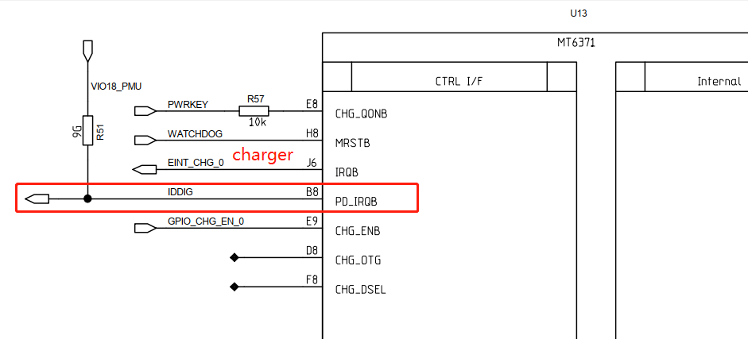
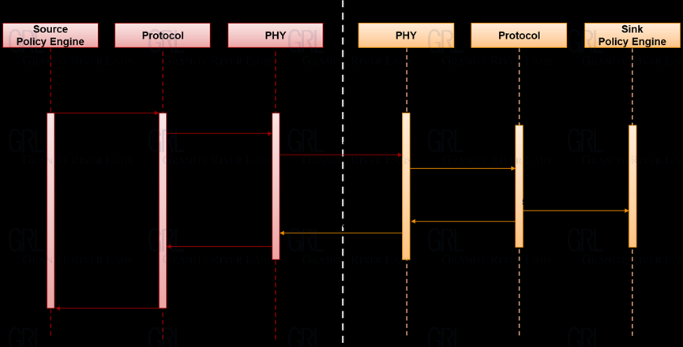

# 概述

Android TypeC PD驱动如何接收及处理cc/vbus事件分析。 

# 参考

* [Linux内核实现透视---kthread_work](http://www.manongjc.com/detail/22-aiyvyekfjbujmin.html)
* [细谈Type-C、PD原理（下）](https://zhuanlan.zhihu.com/p/148526944)

* 中英文翻译
```
toggle 切换
DEBOUNCE 防抖
TCPC： Type-C Port Controller 可以理解为mt6370芯片，负责PD控制
TCPCI： Type-C Port Controller Interface  可以理解为TCPC和TCPM的通信接口，目前mt6370采用的是i2c通信(i2c slave)
TCPM： Type-C Port Manager   可以理解为mt6762 typec驱动控制策略(i2c master)
VDM (Vendor defined message) 供应商定义的消息
```

# typec状态解释

状态：

* Disabled State：从CC引脚移除终端，如果不支持该状态，那么该端口在上电后直接是Unattached.SNK或Unattached.SRC，该状态端口不会驱动VBUS或VCONN，CC1和CC2会呈现高阻到地
* ErrorRecovery State：从CC1和CC2引脚移除终端，接下来会根据端口类型转化为Unattached.SNK或Unattached.SRC，这相当于强制断开连接事件，并寻找一个新的连接。如果该状态不支持，则转化为支持的disabled状态，如果disabled状态也不支持，则转化Unattached.SNK或Unattached.SRC。，该状态端口不会驱动VBUS或VCONN，CC1和CC2会呈现高阻到地
* Unattached.SNK State：端口等待检测到Source的出现，一个端口Dead Battery不供电时候进入这个状态，端口不能驱动VBUS和VCONN，CC1和CC2分别地通过Rd终止到地，当Source连接检测到会转化为AttachWait.SNK，意味着在一个CC引脚上有SNK.Rp。USB 2.0不支持USB PD可能在VBUS检测到直接转化到Attached.SNK
* AttachWait.SNK State：端口检测到SNK.Rp状态在一个CC引脚上，并等待VBUS。端口不驱动VBUS或VCONN
* Attached.SNK State：端口连接上了，并作为Sink操作，如果初始化进入这个状态同样作为UFP操作，Power和Data的状态改变可以通过USB PD Command。直接从Unattached.SNK转化过来是通过检测VBUS，不确定方向和可用的高于默认的USB Power
* Try.SRC State：端口查询决定伙伴端口是否支持Sink，不驱动VBUS和VCONN，端口要在CC1和CC2上分别Source电流
* TryWait.SNK State：端口成为Source失败，准备连接成Sink，不支持VBUS或VCONN，CC1和CC2分别通过Rd终止
* Try.SNK State：端口查询决定伙伴端口是否支持Source
* TryWait.SRC State：端口成为Sink失败，准备连接成Source

# 硬件

硬件主要是Type-C irq中断和cc/vbus硬件。

* typec irq引脚：


* mt6371对应IRQ：



* cc和vbus都在mt6370芯片上：


## USB PD 架构示意图 


The Type-C Port Controller Interface, TCPCI, is the interface between a Type-C Port Manager and a Type-C Port Controller.

* The Controller Interface uses the I2C protocol:
* The TCPM is the only master on this I2C bus.
* The TCPC is a slave device on this I2C bus.
* The TCPC supports Fast-Mode bus speed.
* The TCPC has an open-drain output, active-low PD_IRQB pin. This pin is used to indicate change of state, where the PD_IRQB pin is asserted when any Alert Bits are set.
* The TCPCI supports I/O nominal voltages of 1.8V and 3.3V.
* The TCPC supports auto-increment of the I2C internal register address for the last byte transferred during a read, independent of an ACK/NACK from the master
* TCPC： Type-C Port Controller 可以理解为mt6370芯片，负责PD控制
* TCPCI： Type-C Port Controller Interface  可以理解为TCPC和TCPM的通信接口，目前mt6370采用的是i2c通信(i2c slave)
* TCPM： Type-C Port Manager   可以理解为mt6762 typec驱动控制策略(i2c master)

TCPC英文全称是USB Type-C Port Controller，即USB Type-C 端口控制器，TCPC是一个功能控制模块，包括VBUS和VCONN电源控制、USB Type-C CC逻辑以及USB PD通信 BMC物理层和部分协议层等。

TCPC重点在“控制”，是USB Type-C控制器，负责控制底层通信的实施，包括出错重发机制。TCPM重点在“管理”，是USB Type-C管理器，负责管理一个或多个USB Type-C端口的上层策略。TCPM和TCPC之间的连接的接口叫做TCPCI，是两者之间的桥梁，可采用I2C（或SMbus）方式进行沟通。


## TCPM

### Policy Engine

向上提供Device Policy Manager个别埠的状态，使Policy Manager可以实时整合与更新装置状态并重新调配资源予每个埠。 向下依据政策判断如何发送与响应收到的PD讯息，并指示Protocol Layer建构讯息。
 
### Protocol Layer

传送讯息端：接收Policy Engine的指示建构所需讯息交给PHY Layer，并藉由对方回传GoodCRC确认讯息有正确送出，否则视为传送失败，适用重新发送(Retry)机制。

接收讯息端：收到PHY Layer传来的讯息，解读该讯息并将信息向上呈报给Policy Engine，在做相对响应前，先建构GoodCRC讯息让PHY回送给对方，表示讯息已正确收到并解读。

同时装置双方的Protocol Layer需各自计算对方是否在要求时间内有正确的响应 (Timer check)。 若以上确认内容有侦测到任何错误，任一方的Protocol Layer可发起Reset机制重整状态：


## TCPC

### PHY Layer

把Protocol层送来的讯息再加工，加上以4b5b方式编码的SOP*、CRC、EOP以及Preamble，组成一完整的讯息，透过CC以BMC方式传送给对方。


反之，收到讯息时，PHY要先验证收到的讯息CRC，若正确就将讯息向上回传给接收端的Protocol Layer。


PHY Layer传送讯息流程示意图 (图四，取自PD3.0 Spec)

下图以Source Capabilities讯息为例，简单表示上述内容中的传送端、接收端，以及讯息的传送流程：



# 软件架构


# 涉及文件

* 驱动文件如下：
```log
kernel-4.19/drivers/misc/mediatek/typec:
├── Kconfig
├── Makefile
├── switch
│   ├── fusb304.c
│   ├── Makefile
│   ├── ptn36241g.c
│   ├── typec_switch.c
│   └── typec_switch.h
└── tcpc
    ├── inc
    │   ├── mt6360.h
    │   ├── mt6370.h
    │   ├── mtk_direct_charge_vdm.h
    │   ├── pd_core.h
    │   ├── pd_dbg_info.h
    │   ├── pd_dpm_core.h
    │   ├── pd_dpm_pdo_select.h
    │   ├── pd_policy_engine.h
    │   ├── pd_process_evt.h
    │   ├── rt1711h.h
    │   ├── rt5081.h
    │   ├── std_tcpci_v10.h
    │   ├── tcpci_config.h
    │   ├── tcpci_core.h
    │   ├── tcpci_event.h
    │   ├── tcpci.h
    │   ├── tcpci_timer.h
    │   ├── tcpci_typec.h
    │   ├── tcpm.h
    │   └── tcpm_pd.h
    ├── Kconfig
    ├── Makefile
    ├── pd_core.c
    ├── pd_dbg_info.c
    ├── pd_dpm_alt_mode_dc.c
    ├── pd_dpm_alt_mode_dp.c
    ├── pd_dpm_core.c
    ├── pd_dpm_pdo_select.c
    ├── pd_dpm_prv.h
    ├── pd_dpm_reaction.c
    ├── pd_dpm_uvdm.c
    ├── pd_policy_engine.c
    ├── pd_policy_engine_com.c
    ├── pd_policy_engine_dbg.c
    ├── pd_policy_engine_dfp.c
    ├── pd_policy_engine_dr.c
    ├── pd_policy_engine_drs.c
    ├── pd_policy_engine_prs.c
    ├── pd_policy_engine_snk.c
    ├── pd_policy_engine_src.c
    ├── pd_policy_engine_ufp.c
    ├── pd_policy_engine_vcs.c
    ├── pd_process_evt.c
    ├── pd_process_evt_com.c
    ├── pd_process_evt_dbg.c
    ├── pd_process_evt_drs.c
    ├── pd_process_evt_prs.c
    ├── pd_process_evt_snk.c
    ├── pd_process_evt_src.c
    ├── pd_process_evt_tcp.c
    ├── pd_process_evt_vcs.c
    ├── pd_process_evt_vdm.c
    ├── rt_pd_manager.c
    ├── tcpci_alert.c
    ├── tcpci_alert_v20.c
    ├── tcpci.c
    ├── tcpci_core.c //提供核心函数，比如
    ├── tcpci_dual_role.c
    ├── tcpci_event.c
    ├── tcpci_timer.c
    ├── tcpci_typec.c
    ├── tcpc_mt6360.c
    ├── tcpc_mt6370.c  //typec probe处理，中断处理
    ├── tcpc_rt1711h.c
    ├── tcpc_rt5081.c
    └── tcpm.c
```

* dts如下:
```log
M8.dts重定义:
&mt6370_typec {
        mt6370pd,intr_gpio_num = <9>; /* direct defined GPIO num */
        mt6370pd,intr_gpio = <&pio 9 0x0>;
};

mt6370_pd.dtsi：
        mt6370_typec: type_c_port0 {
                /* 0: dfp/ufp, 1: dfp, 2: ufp */
                tcpc-dual,supported_modes = <0>;
                mt-tcpc,name = "type_c_port0"; /* tcpc_device's name */
                /* 0: SNK Only, 1: SRC Only, 2: DRP, 3: Try.SRC, 4: Try.SNK */
                mt-tcpc,role_def = <4>;
                mt-tcpc,rp_level = <1>; /* 0: Default, 1: 1.5, 2: 3.0 */
                /* 0: Never, 1: Always, 2: EMarkOnly, 3: StartOnly */
                mt-tcpc,vconn_supply  = <1>;
                /* the number of notifier supply */
#if (CONFIG_MTK_GAUGE_VERSION == 30)
                mt-tcpc,notifier_supply_num = <3>;
#else
                mt-tcpc,notifier_supply_num = <2>;
#endif
                mt6370pd,intr_gpio = <&pio 24 0x0>;
                mt6370pd,intr_gpio_num = <24>;

                charger = <&mt6370_chg>;

        pd_data: pd-data {
                        pd,vid = <0x29cf>;
                        pd,pid = <0x5081>;
                        pd,source-cap-ext = <0x508129cf 0x00000000 0x00000000
                                             0x00000000 0x00000000 0x07000000>;
                        pd,mfrs = "RichtekTCPC";

                        /*
                         *      VSAFE5V = 0, MAX_POWER = 1, CUSTOM = 2,
                         *      MAX_POWER_LV = 0x21, MAX_POWER_LVIC = 0x31
                         *      MAX_POWER_HV = 0x41, MAX_POWER_HVIC = 0x51
                         */
                        pd,charging_policy= <0x31>;

                        /*
                         * Fixed 5V, 500 mA <0x00019032>
                         * Fixed 5V, 1A <0x00019064>
                         * Fixed 5V, 2A <0x000190c8>
                         * Fixed 5V, 3A <0x0001912c>
                         * Fixed 9V, 500 mA <0x0002d032>
                         * Fixed 9V, 1A <0x0002d064>
                         * Fixed 9V, 2A <0x0002d0c8>
                         * Fixed 9V, 3A <0x0002d12c>
                         * Variable 5-9V, 1A <0x8642d064>
                         * Variable 5-9V, 2A <0x8642d0c8>
                         * Variable 5-9V, 3A <0x8642d12c>
                         * PPS 3V~5.9V, 3A <0xC0761E3C>
                         */
                        pd,source-pdo-size = <1>;
                        pd,source-pdo-data = <0x00019096>; /* 5V, 1500 mA */
                        pd,sink-pdo-size = <1>;
                        pd,sink-pdo-data = <0x000190c8>;

                        /*
                         * No DP, host + device
                         *      pd,id-vdo-size = <3>;
                         *      pd,id-vdo-data = <0xd10029cf 0x0 0x50810000>;
                         * With DP
                         *      pd,id-vdo-size = <3>;
                         *      pd,id-vdo-data = <0xd60029cf 0x0 0x50810000>;
                         */

                        pd,id-vdo-size = <3>;
                        pd,id-vdo-data = <0xd10029cf 0x0 0x50810000>;

                        bat,nr = <1>;
                        pd,country_nr = <0>;

                        bat-info0 {
                                bat,vid = <0x29cf>;
                                bat,pid = <0x5081>;
                                bat,mfrs = "bat1";
                                bat,design_cap = <3000>;
                        };

                        //bat-info1 {
                        //      bat,vid = <0x8abc>;
                        //      bat,pid = <0x5234>;
                        //      bat,mfrs = "bat2";
                        //      bat,design_cap = <4000>;
                        //};

                        //country0 {
                        //      pd,country_code = <0x5457>;
                        //      pd,country_len = <2>; /* max len = 26 */
                        //      pd,country_data = <0xff 0xff>;
                        //};

                        //country1 {
                        //      pd,country_code = <0x5553>;
                        //      pd,country_len = <3>; /* max len = 26 */
                        //      pd,country_data = <0xf1 0xf2 0xf3>;
                        //};
                };
...省略...
```

# 软件分析

## 1.mt6370中断处理

* 1.目前typec所有事件都是靠中断的方式通知ap端，当中断发生时，唤醒线程去读取中断类型，具体中断详细步骤如下：

* `tcpc_mt6370.c`:
```C++
* mt6370_i2c_probe(struct i2c_client *client,
  ├── mt_parse_dt(chip, &client->dev);
  │   ├── of_find_node_by_name(NULL, "type_c_port0");
  │   └── of_property_read_u32(np, "mt6370pd,intr_gpio_num", &chip->irq_gpio); //读取irq中断引脚
  ├── mt6370_regmap_init(chip); //map所有typec相关的寄存器
  ├── mt6370_tcpcdev_init(chip, &client->dev);
  │   ├── of_property_read_u32(np, "mt-tcpc,role_def", &val)  //读取默认typec role配置，目前默认配的是3: Try.SRC
  │   ├── of_property_read_u32(np, "mt-tcpc,rp_level", &val)  //默认配置Rp，目前是1.5A供电能力
  │   ├── of_property_read_u32(np, "mt-tcpc,vconn_supply", &val)
  │   └── tcpc_device_register(dev,desc, &mt6370_tcpc_ops, chip);
  │       ├── INIT_DELAYED_WORK(&tcpc->init_work, tcpc_init_work); //创建初始化工作队列
  │       ├── INIT_DELAYED_WORK(&tcpc->event_init_work, tcpc_event_init_work); //创建PD event处理队列
  │       └── pd_core_init(tcpc); //PD相关dts初始化
  │           ├── pd_parse_pdata(pd_port);
  │           ├── pd_core_power_flags_init(pd_port);
  │           └── pd_dpm_core_init(pd_port);
  │               └── pd_port->pps_request_task = kthread_run(pps_request_thread_fn, tcpc,"pps_request_%s",tcpc->desc.name); //pps request相关线程
  ├── mt6370_init_alert(chip->tcpc); //重要
  │   ├── gpio_to_irq(chip->irq_gpio); //申请PD gpio中断
  │   ├── kthread_init_worker(&chip->irq_worker); //初始化工作组
  │   ├── chip->irq_worker_task = kthread_run(kthread_worker_fn,&chip->irq_worker, "%s", chip->tcpc_desc->name);/创建一个内核线程并运行kthread_worker_fn 参数是kworker 后面的参数是线程名称
  │   ├── kthread_init_work(&chip->irq_work, mt6370_irq_work_handler);//向工作组添加一个工作mt6370_irq_work_handler，这个接口可能唤醒内核线程，执行完成后这个工作就被删除了
  │   └── request_irq(chip->irq, mt6370_intr_handler,IRQF_TRIGGER_FALLING | IRQF_NO_THREAD, name, chip); //gpio中断函数
  │       └── mt6370_intr_handler -> kthread_queue_work(&chip->irq_worker, &chip->irq_work); //有中断则调用irq_worker工作队列，运行mt6370_irq_work_handler
  └── tcpc_schedule_init_work(chip->tcpc);
      └── schedule_delayed_work(&tcpc->init_work, msecs_to_jiffies(30*1000)); //执行tcpc_init_work工作队列
          └── tcpc_init_work -> tcpc_device_irq_enable(tcpc); //打开typec中断
              ├── tcpc_typec_init(tcpc, tcpc->desc.role_def + 1); //初始化typec各种状态，如默认配置role_def，当配置成Try.SRC，则执行Try.SRC逻辑
              └── schedule_delayed_work(&tcpc->event_init_work, msecs_to_jiffies(10*1000)); //执行event_init_work工作队列
                  └── tcpc_event_init_work -> tcpc->pd_inited_flag = 1;
                      ├── INIT_DELAYED_WORK(&tcpc->bat_update_work, bat_update_work_func); //电池参数更新，下面可以看到主要获取电量和充电状态
                      │   ├── power_supply_get_property(tcpc->bat_psy, POWER_SUPPLY_PROP_CAPACITY, &value);
                      │   │   └── tcpc->bat_soc = value.intval;
                      │   └── power_supply_get_property(tcpc->bat_psy,POWER_SUPPLY_PROP_STATUS, &value);
                      │       └── tcpc->charging_status = BSDO_BAT_INFO_CHARGING;
                      ├── tcpc->bat_nb.notifier_call = bat_nb_call_func; //
                      │   └── if (val == PSY_EVENT_PROP_CHANGED &&strcmp(psy->desc->name, "battery") == 0)
                      │       └── schedule_delayed_work(&tcpc->bat_update_work, 0); //只要battery psy更新，则启动bat_update_work_func工作队列
                      └── retval = power_supply_reg_notifier(&tcpc->bat_nb); //注册电池监听notify
```

* 2.可以看到中断产生后会运行`mt6370_irq_work_handler`函数，该函数主要是中断期间while循环读取typec中断状态，具体如下：

```C++
static void mt6370_irq_work_handler(struct kthread_work *work)
{
	struct mt6370_chip *chip =
			container_of(work, struct mt6370_chip, irq_work);
	int regval = 0;
	int gpio_val;

	mt6370_poll_ctrl(chip);
	/* make sure I2C bus had resumed */
	tcpci_lock_typec(chip->tcpc);

#ifdef DEBUG_GPIO
	gpio_set_value(DEBUG_GPIO, 1);
#endif

	do {
		regval = tcpci_alert(chip->tcpc);
		if (regval)
			break;
		gpio_val = gpio_get_value(chip->irq_gpio);
	} while (gpio_val == 0);

	tcpci_unlock_typec(chip->tcpc);

#ifdef DEBUG_GPIO
	gpio_set_value(DEBUG_GPIO, 1);
#endif
}
```
* 3.中断处理流程，可以看到读取typec状态是通过读取0x10和0x12寄存器判断的，当读取到中断类型后，判断是什么中断，将执行中断函数`tcpci_alert_handlers[i].handler(tcpc_dev)`


```C++
* tcpci_alert(chip->tcpc);
  * __tcpci_alert(tcpc_dev); //tcpci_alert.c
    * tcpci_get_alert_status(tcpc_dev, &alert_status);
      * tcpc->ops->get_alert_status(tcpc, alert); //tcpci.c
        * mt6370_get_alert_status(struct tcpc_device *tcpc, uint32_t *alert)
          * mt6370_i2c_read16(tcpc, TCPC_V10_REG_ALERT); //#define TCPC_V10_REG_ALERT	(0x10) 重要，读取typec状态， 如cc和vbus状态变化
    * cpci_get_alert_mask(tcpc_dev, &alert_mask);
      * tcpc->ops->get_alert_mask(tcpc, alert); //tcpci.c
        * mt6370_get_alert_mask(struct tcpc_device *tcpc, uint32_t *mask)
          * mt6370_i2c_read16(tcpc, TCPC_V10_REG_ALERT_MASK); //#define TCPC_V10_REG_ALERT_MASK	(0x12) 重要，读取中断mask状态
    * tcpci_alert_status_clear(tcpc_dev,alert_status & (~TCPC_REG_ALERT_RX_MASK)); //读取完后清中断
    * for (i = 0; i < ARRAY_SIZE(tcpci_alert_handlers); i++)
      * if (tcpci_alert_handlers[i].bit_mask & alert_status)
        * tcpci_alert_handlers[i].handler(tcpc_dev);
```

目前支持的所有中断事件类型如下：

```C++
static const struct tcpci_alert_handler tcpci_alert_handlers[] = {
#ifdef CONFIG_USB_POWER_DELIVERY
	DECL_TCPCI_ALERT_HANDLER(4, tcpci_alert_tx_failed),
	DECL_TCPCI_ALERT_HANDLER(5, tcpci_alert_tx_discard),
	DECL_TCPCI_ALERT_HANDLER(6, tcpci_alert_tx_success),
	DECL_TCPCI_ALERT_HANDLER(2, tcpci_alert_recv_msg),
	DECL_TCPCI_ALERT_HANDLER(7, NULL),
	DECL_TCPCI_ALERT_HANDLER(8, NULL),
	DECL_TCPCI_ALERT_HANDLER(3, tcpci_alert_recv_hard_reset), //硬复位
	DECL_TCPCI_ALERT_HANDLER(10, tcpci_alert_rx_overflow),
#endif /* CONFIG_USB_POWER_DELIVERY */

#ifdef CONFIG_TYPEC_CAP_LPM_WAKEUP_WATCHDOG
	DECL_TCPCI_ALERT_HANDLER(16, tcpci_alert_wakeup), //低功耗唤醒
#endif /* CONFIG_TYPEC_CAP_LPM_WAKEUP_WATCHDOG */

#ifdef CONFIG_TYPEC_CAP_RA_DETACH
	DECL_TCPCI_ALERT_HANDLER(21, tcpci_alert_ra_detach), //发现Ra下拉电阻，说明需要Vconn供电
#endif /* CONFIG_TYPEC_CAP_RA_DETACH */

	DECL_TCPCI_ALERT_HANDLER(9, tcpci_alert_fault),
	DECL_TCPCI_ALERT_HANDLER(0, tcpci_alert_cc_changed),  //CC状态变化
	DECL_TCPCI_ALERT_HANDLER(1, tcpci_alert_power_status_changed),  //vbus状态变化
};
```
* CC的一些状态获取函数：

```C++
#define typec_get_cc1()		\
	tcpc_dev->typec_remote_cc[0]
#define typec_get_cc2()		\
	tcpc_dev->typec_remote_cc[1]
#define typec_get_cc_res()	\ //获取那根cc有效，作数据通信
	(tcpc_dev->typec_polarity ? typec_get_cc2() : typec_get_cc1())

#define typec_check_cc1(cc)	\
	(typec_get_cc1() == cc)

#define typec_check_cc2(cc)	\
	(typec_get_cc2() == cc)

#define typec_check_cc(cc1, cc2)	\
	(typec_check_cc1(cc1) && typec_check_cc2(cc2))

#define typec_check_cc_both(res)	\
	(typec_check_cc(res, res))

#define typec_check_cc_any(res)		\
	(typec_check_cc1(res) || typec_check_cc2(res))

#define typec_is_drp_toggling() \
	(typec_get_cc1() == TYPEC_CC_DRP_TOGGLING)

#define typec_is_cc_open()	\
	typec_check_cc_both(TYPEC_CC_VOLT_OPEN)

#define typec_is_cable_only()	\
	(typec_get_cc1() + typec_get_cc2() == TYPEC_CC_VOLT_RA)

#define typec_is_sink_with_emark()	\
	(typec_get_cc1() + typec_get_cc2() == \
	TYPEC_CC_VOLT_RA+TYPEC_CC_VOLT_RD)

#define typec_is_cc_no_res()	\
	(typec_is_drp_toggling() || typec_is_cc_open())
```

CC方向打印：
```log
pr_err("%s OTG plug in, polarity = %d\n", __func__, noti->typec_state.polarity);
打印：
pd_tcp_notifier_call OTG plug in, polarity = 0 //正向
```

* 4.一般typec主要处理CC/Vbus状态变化，当cc发送变化时，将运行`tcpci_alert_cc_changed`,下面我们分析CC状态处理流程：

```C++
* tcpci_alert_cc_changed
  ├── tcpci_get_cc(tcpc_dev);  //重要
  │   ├── ret = tcpc->ops->get_cc(tcpc, &cc1, &cc2);
  │   │   └── tcpc_ops mt6370_tcpc_ops = {.get_cc = mt6370_get_cc,}
  │   │       └── mt6370_get_cc(struct tcpc_device *tcpc, int *cc1, int *cc2)
  │   │           ├── status = mt6370_i2c_read8(tcpc, TCPC_V10_REG_CC_STATUS);
  │   │           ├── role_ctrl = mt6370_i2c_read8(tcpc, TCPC_V10_REG_ROLE_CTRL);
  │   │           ├── *cc1 = TCPC_V10_REG_CC_STATUS_CC1(status);
  │   │           └── *cc2 = TCPC_V10_REG_CC_STATUS_CC2(status);
  │   ├── tcpc->typec_remote_cc[0] = cc1;
  │   └── tcpc->typec_remote_cc[1] = cc2;
  └── tcpc_typec_handle_cc_change(tcpc_dev);
      ├── rp_present = typec_get_rp_present_flag(tcpc_dev); //读取Rp状态，是否为Rp 1.5A或者Rp 3A
      ├── TYPEC_INFO("[CC_Alert] %d/%d\r\n", typec_get_cc1(), typec_get_cc2()); //log打印CC状态
      ├── if (typec_is_drp_toggling())
      │   ├── TYPEC_DBG("[Warning] DRP Toggling\r\n");
      │   └── return 0; //如果DRP正在切换，则不处理返回
      ├── if (typec_try_exit_norp_src(tcpc_dev))
      │   ├── if (tcpc_dev->typec_state == typec_attached_norp_src)
      │   │   ├── TYPEC_INFO("norp_src=0\r\n");
      │   │   └── return true;
      │   └── return 0; //如果source端没有检测到Rp，直接返回，没检测到会打印norp_src=0
      ├── typec_disable_low_power_mode(tcpc_dev); //关闭低功耗模式
      ├── if (typec_is_cc_attach(tcpc_dev)) 
      │   └── typec_check_water_status(tcpc_dev);
      │       └── tcpci_is_water_detected(tcpc_dev);
      │           └── tcpc->ops->is_water_detected(tcpc); //如果已经完成attach了，有防水检测，不过mt6371不支持
      └── typec_detach_wait_entry(tcpc_dev); //重要处理cc各种状态
```

## 2.mt6370硬件CC原理

CC状态主要通过mt6370的`mt6370_get_cc`获取寄存器状态，其中包括role状态，CC线Rp电阻、DRP状态、CC状态(open Rp Rd)等，看下mt6370处理cc状态具体内容：

```C++
CC状态bit位：
bit 1:0 CC_STATUS
bit 2 ROLE_STATUS

CC状态定义：
enum tcpc_cc_voltage_status {
	TYPEC_CC_VOLT_OPEN = 0,
	TYPEC_CC_VOLT_RA = 1,
	TYPEC_CC_VOLT_RD = 2,

	TYPEC_CC_VOLT_SNK_DFT = 5, // sink ra发现电子标签？
	TYPEC_CC_VOLT_SNK_1_5 = 6, //sink 1.5a 这里是根据rp电阻判断source端供电能力
	TYPEC_CC_VOLT_SNK_3_0 = 7, //sink 3a

	TYPEC_CC_DRP_TOGGLING = 15,
};


#define TCPC_V10_REG_CC_STATUS				(0x1D)
#define TCPC_V10_REG_ROLE_CTRL				(0x1A)
static int mt6370_get_cc(struct tcpc_device *tcpc, int *cc1, int *cc2)
{
	int status, role_ctrl, cc_role;
	bool act_as_sink, act_as_drp;

	status = mt6370_i2c_read8(tcpc, TCPC_V10_REG_CC_STATUS); //获取cc状态
	if (status < 0)
		return status;

	role_ctrl = mt6370_i2c_read8(tcpc, TCPC_V10_REG_ROLE_CTRL); //获取role
	if (role_ctrl < 0)
		return role_ctrl;

	if (status & TCPC_V10_REG_CC_STATUS_DRP_TOGGLING) { //DRP正在切换
		*cc1 = TYPEC_CC_DRP_TOGGLING;
		*cc2 = TYPEC_CC_DRP_TOGGLING;
		return 0;
	}

	*cc1 = TCPC_V10_REG_CC_STATUS_CC1(status);
	*cc2 = TCPC_V10_REG_CC_STATUS_CC2(status);
  解释如下：
  #define TCPC_V10_REG_CC_STATUS_CC2(reg)  (((reg) & 0xc) >> 2)  读取0x1D寄存器bit3:2 CC2_STATUS
   #define TCPC_V10_REG_CC_STATUS_CC1(reg)  ((reg) & 0x3) 读取0x1D寄存器bit1:0 CC1_STATUS


	act_as_drp = TCPC_V10_REG_ROLE_CTRL_DRP & role_ctrl; // 读取0x1D寄存器bit5 DRP_STATUS 0b: the TCPC has stopped toggling or (ROLE_CONTROL.DRP =00)1b: the TCPC is toggling  判断是否为DRP模式

定义：
#define TCPC_V10_REG_CC_STATUS_DRP_RESULT(reg)	(((reg) & 0x10) >> 4)

	if (act_as_drp) {
		act_as_sink = TCPC_V10_REG_CC_STATUS_DRP_RESULT(status);// 读取0x1D寄存器bit4 DRP_RESULT 0b: the TCPC is presenting Rp 1b: the TCPC is presenting Rd
	} else {
		cc_role =  TCPC_V10_REG_CC_STATUS_CC1(role_ctrl);
		if (cc_role == TYPEC_CC_RP)
			act_as_sink = false;
		else
			act_as_sink = true;
	}

	/*
	 * If status is not open, then OR in termination to convert to
	 * enum tcpc_cc_voltage_status.
	 */

	if (*cc1 != TYPEC_CC_VOLT_OPEN)
		*cc1 |= (act_as_sink << 2); //CC1 bit2为role

	if (*cc2 != TYPEC_CC_VOLT_OPEN)
		*cc2 |= (act_as_sink << 2);

	mt6370_init_cc_params(tcpc,
		(uint8_t)tcpc->typec_polarity ? *cc2 : *cc1);

	return 0;
}
```

* 涉及寄存器：

* CC状态：


* 读取Rp电阻、DRP状态、CC状态(open Rp Rd):


## 3.主要处理函数分析

### cc处理

* 1.cc中断有很多种情况，详情请看`TYPEC_CONNECTION_STATE`,详细看一下cc处理函数`tcpci_typec.c`：

```C++
enum TYPEC_CONNECTION_STATE {
	typec_disabled = 0,
	typec_errorrecovery,

	typec_unattached_snk,
	typec_unattached_src,

	typec_attachwait_snk,
	typec_attachwait_src,

	typec_attached_snk,
	typec_attached_src,

#ifdef CONFIG_TYPEC_CAP_TRY_SOURCE
	/* Require : Assert Rp
	 * Exit(-> Attached.SRC) : Detect Rd (tPDDebounce).
	 * Exit(-> TryWait.SNK) : Not detect Rd after tDRPTry
	 */
	typec_try_src,

	/* Require : Assert Rd
	 * Exit(-> Attached.SNK) : Detect Rp (tCCDebounce) and Vbus present.
	 * Exit(-> Unattached.SNK) : Not detect Rp (tPDDebounce)
	 */

	typec_trywait_snk,
	typec_trywait_snk_pe,
#endif

#ifdef CONFIG_TYPEC_CAP_TRY_SINK

	/* Require : Assert Rd
	 * Wait for tDRPTry and only then begin monitoring CC.
	 * Exit (-> Attached.SNK) : Detect Rp (tPDDebounce) and Vbus present.
	 * Exit (-> TryWait.SRC) : Not detect Rp for tPDDebounce.
	 */
	typec_try_snk,

	/*
	 * Require : Assert Rp
	 * Exit (-> Attached.SRC) : Detect Rd (tCCDebounce)
	 * Exit (-> Unattached.SNK) : Not detect Rd after tDRPTry
	 */

	typec_trywait_src,
	typec_trywait_src_pe,
#endif	/* CONFIG_TYPEC_CAP_TRY_SINK */

	typec_audioaccessory,
	typec_debugaccessory,

#ifdef CONFIG_TYPEC_CAP_DBGACC_SNK
	typec_attached_dbgacc_snk,
#endif	/* CONFIG_TYPEC_CAP_DBGACC_SNK */

#ifdef CONFIG_TYPEC_CAP_CUSTOM_SRC
	typec_attached_custom_src,
#endif	/* CONFIG_TYPEC_CAP_CUSTOM_SRC */

#ifdef CONFIG_TYPEC_CAP_NORP_SRC
	typec_attached_norp_src,
#endif	/* CONFIG_TYPEC_CAP_NORP_SRC */

#ifdef CONFIG_TYPEC_CAP_ROLE_SWAP
	typec_role_swap,
#endif	/* CONFIG_TYPEC_CAP_ROLE_SWAP */

#ifdef CONFIG_WATER_DETECTION
	typec_water_protection_wait,
	typec_water_protection,
#endif /* CONFIG_WATER_DETECTION */

	typec_unattachwait_pe,	/* Wait Policy Engine go to Idle */
};


static inline void typec_detach_wait_entry(struct tcpc_device *tcpc_dev)
{
#ifdef CONFIG_TYPEC_CHECK_LEGACY_CABLE
	typec_legacy_handle_detach(tcpc_dev);
#endif	/* CONFIG_TYPEC_CHECK_LEGACY_CABLE */

	switch (tcpc_dev->typec_state) {
#ifdef TYPEC_EXIT_ATTACHED_SNK_VIA_VBUS
	case typec_attached_snk:
		typec_attached_snk_cc_detach(tcpc_dev);
		break;
#endif /* TYPEC_EXIT_ATTACHED_SNK_VIA_VBUS */

	case typec_attached_src:
		tcpc_enable_timer(tcpc_dev, TYPEC_TIMER_SRCDISCONNECT);
		break;

	case typec_audioaccessory:
		tcpc_enable_timer(tcpc_dev, TYPEC_TIMER_CCDEBOUNCE);
		break;

#ifdef TYPEC_EXIT_ATTACHED_SRC_NO_DEBOUNCE
	case typec_attached_src:
		TYPEC_INFO("Exit Attached.SRC immediately\r\n");
		tcpc_reset_typec_debounce_timer(tcpc_dev);

		/* force to terminate TX */
		tcpci_init(tcpc_dev, true);

		typec_cc_src_remove_entry(tcpc_dev);
		typec_alert_attach_state_change(tcpc_dev);
		break;
#endif /* TYPEC_EXIT_ATTACHED_SRC_NO_DEBOUNCE */

#ifdef CONFIG_TYPEC_CAP_TRY_SOURCE
	case typec_try_src:
		if (tcpc_dev->typec_drp_try_timeout)
			tcpc_enable_timer(tcpc_dev, TYPEC_TIMER_PDDEBOUNCE);
		else {
			tcpc_reset_typec_debounce_timer(tcpc_dev);
			TYPEC_DBG("[Try] Ignore cc_detach\r\n");
		}
		break;
#endif	/* CONFIG_TYPEC_CAP_TRY_SOURCE */

#ifdef CONFIG_TYPEC_CAP_TRY_SINK
	case typec_trywait_src:
		if (tcpc_dev->typec_drp_try_timeout)
			tcpc_enable_timer(tcpc_dev, TYPEC_TIMER_TRYCCDEBOUNCE);
		else {
			tcpc_reset_typec_debounce_timer(tcpc_dev);
			TYPEC_DBG("[Try] Ignore cc_detach\r\n");
		}
		break;
#endif	/* CONFIG_TYPEC_CAP_TRY_SINK */
	default:
		tcpc_enable_timer(tcpc_dev, TYPEC_TIMER_PDDEBOUNCE);
		break;
	}
}
```

### vbus处理

* 2.vbus中断有三种电压情况，首先读取vbus状态并设置vbus_level，通过寄存器如下读取，详情请看`tcpm_vbus_level`,看一下vbus处理函数`tcpci_typec.c`：


```C++
enum tcpm_vbus_level {
#ifdef CONFIG_TCPC_VSAFE0V_DETECT
	TCPC_VBUS_SAFE0V = 0,	/* < 0.8V */
	TCPC_VBUS_INVALID,		/* > 0.8V */
	TCPC_VBUS_VALID,		/* > 4.5V */
#endif /* CONFIG_TCPC_VSAFE0V_DETECT */
};

```

* 软件流程如下：
```C++
* tcpci_alert_power_status_changed
  ├── tcpci_get_power_status(tcpc_dev, &power_status); //获取vbus状态
  │   ├── tcpc->ops->get_power_status(tcpc, pw_status);
  │   │   └── mt6370_tcpc_ops = { get_power_status = mt6370_get_power_status,}
  │   │       ├── mt6370_i2c_read8(tcpc, TCPC_V10_REG_POWER_STATUS); //读取ox1E寄存器
  │   │       └── *pwr_status |= TCPC_REG_POWER_STATUS_VBUS_PRES; //读取ox1E寄存器第二位，连接或者未连接
  │   └── tcpci_vbus_level_init(tcpc, *pw_status); //根据power_status设置vbus_level
  ├── TCPC_INFO("ps_change=%d\r\n", tcpc_dev->vbus_level); //打印vbus状态
  └── tcpc_typec_handle_ps_change(tcpc_dev, tcpc_dev->vbus_level);
```
以上重要函数`tcpc_typec_handle_ps_change`如下：
```C++
int tcpc_typec_handle_ps_change(struct tcpc_device *tcpc_dev, int vbus_level)
{
	tcpc_dev->typec_reach_vsafe0v = false;

#ifdef CONFIG_TYPEC_CHECK_LEGACY_CABLE
	if (tcpc_dev->typec_legacy_cable) {
		typec_legacy_handle_ps_change(tcpc_dev, vbus_level);
		return 0;
	}
#endif /* CONFIG_TYPEC_CHECK_LEGACY_CABLE */

#ifdef CONFIG_TYPEC_CAP_NORP_SRC
	if (!typec_try_enter_norp_src(tcpc_dev))
		if (typec_try_exit_norp_src(tcpc_dev))
			return 0;
#endif	/* CONFIG_TYPEC_CAP_NORP_SRC */

	if (typec_is_drp_toggling()) {
		TYPEC_DBG("[Warning] DRP Toggling\r\n");
		if (tcpc_dev->typec_lpm && !tcpc_dev->typec_cable_only)
			typec_enter_low_power_mode(tcpc_dev);
		return 0;
	}

#ifdef CONFIG_TYPEC_CAP_AUDIO_ACC_SINK_VBUS
	if (tcpc_dev->typec_state == typec_audioaccessory) {
		return typec_audio_acc_sink_vbus(
			tcpc_dev, vbus_level >= TCPC_VBUS_VALID);
	}
#endif	/* CONFIG_TYPEC_CAP_AUDIO_ACC_SINK_VBUS */

	if (vbus_level >= TCPC_VBUS_VALID)
		return typec_handle_vbus_present(tcpc_dev);

	return typec_handle_vbus_absent(tcpc_dev);
}
```


* 根进代码发现，vbus打开关闭等操作还是在cc处理函数中操作的，比如source端打开vbus软件流程如下：

```C++
* typec_handle_debounce_timeout(tcpc_dev); //typec timer线程处理函数
  └── typec_handle_cc_changed_entry(tcpc_dev);
      └── typec_cc_src_remove_entry(tcpc_dev);
          └── else if (typec_check_cc_any(TYPEC_CC_VOLT_RD)) //检测到Rd
              └── typec_cc_src_detect_entry(tcpc_dev);
                  └── typec_cc_src_detect_vsafe0v_entry(tcpc_dev);
                      └── typec_source_attached_entry(tcpc_dev);
                          └── tcpci_source_vbus(tcpc_dev,TCP_VBUS_CTRL_TYPEC, TCPC_VBUS_SOURCE_5V, -1); //发送打开vbus通知
                              └── tcpc_check_notify_time(tcpc, &tcp_noti,TCP_NOTIFY_IDX_VBUS, TCP_NOTIFY_SOURCE_VBUS); //发送通知
```

* vbus接收通知`usb20.c`：

```C++
* .init = mt_usb_init,
  └── mt_usb_otg_init(musb);
      └── INIT_DELAYED_WORK(&register_otg_work, do_register_otg_work);
          ├── otg_nb.notifier_call = otg_tcp_notifier_call;
          └── ret = register_tcp_dev_notifier(otg_tcpc_dev, &otg_nb,TCP_NOTIFY_TYPE_VBUS | TCP_NOTIFY_TYPE_USB |TCP_NOTIFY_TYPE_MISC); //usb20_host.c
              └── static int otg_tcp_notifier_call(struct notifier_block *nb,
                  └── switch (event) {
                      └── case TCP_NOTIFY_SOURCE_VBUS:
                          ├── if (noti->vbus_state.mv) mt_usb_vbus_on(0); //实际控制vbus
                          └── else mt_usb_vbus_off(0);
```

### 实例分析

* M8插电脑，可以看到有CC两个中断信息，根据加的打印`wugn test typec_state`判断,是`typec_attached_snk`,unattached -> SNK过程log如下：

```C++
<5>[10102.195626] <10102.183>TCPC-TYPEC:Attached-> NULL
<5>[10102.195626] <10102.183>TCPC-TCPC:usb_port_
<5>[10102.195644]  (5)[112:pd_dbg_info]detached
<5>[10102.195644] <10102.183>TCPC-PE:PD -> IDLE1 (PDY)
<5>[10102.195644] <10102.183>TCPC-PE:bist_test_mode=0
<5>[10102.195644] <10102.183>TCPC-PE:PD -> IDLE2 (PDY)
<5>[10102.195644] <1010
<5>[10102.195663]  (5)[112:pd_dbg_info]2.186>TCPC-TYPEC:** TryWait.SNK
<5>[10102.195663] <10102.187>TCPC-TYPEC:[CC_Alert] 5/0
<5>[10102.227667]  (5)[112:pd_dbg_info]<10102.198>TCPC-TCPC:ps_change=1
<5>[10102.308600]  (5)[112:pd_dbg_info]<10102.308>TCPC-TYPEC:[CC_Change] 5/0
<5>[10102.308600] <10102.308>TCPC-TYPEC:wait_ps=SNK_VSafe5V
<5>[10102.308600] <10102.308>TCPC-TYPEC:Attached-> NULL(repeat)
<6>[10102.852349]  (5)[112:pd_dbg_info]///PD dbg info 38d
<5>[10102.852399]  (5)[112:pd_dbg_info]<10102.852>TCPC-TYPEC:[CC_Alert] 6/0
通知notify处理：
<6>[10102.858855]  (4)[5558:kworker/u16:2]tcpc_notifier_call: action:10// SINK_VBUS则关闭SNK端vbus
<6>[10102.858890]  (4)[5558:kworker/u16:2]pd_tcp_notifier_call sink vbus 5000mV 1500mA type(0x01)
<6>[10102.858928]  (4)[5558:kworker/u16:2]mt6370_pmu_charger mt6370_pmu_charger: mt6370_enable_power_path: en = 1, pp_en = 0

<6>[10102.865264]  (4)[5558:kworker/u16:2]pd_tcp_notifier_call USB Plug in, pol = 0
<5>[10102.865394]  (4)[261:attach_thread]typec_attach_thread bc12_sel:1
<5>[10102.865417]  (4)[261:attach_thread]psy_chr_type_set_property: prop:4 1
<5>[10102.865456]  (4)[5558:kworker/u16:2][MUSB]otg_tcp_notifier_call 404: TCP_NOTIFY_TYPEC_STATE, old_state=0, new_state=1 //状态变化TYPEC_UNATTACHED -> TYPEC_ATTACHED_SNK
<5>[10102.865478]  (4)[5558:kworker/u16:2][MUSB]mt_usb_host_disconnect 325: disconnect //关闭host
<5>[10102.865502]  (4)[5558:kworker/u16:2][MUSB]issue_host_work 307: issue work, ops<0>, delay<0>, on_st<1>
<5>[10102.865605]  (4)[5558:kworker/u16:2][MUSB]mt_usb_connect 715: [MUSB] USB connect //连接usb，函数mt_usb_connect();

检测到vbus电压5v:
<5>[10102.869997]  (4)[4042:kworker/4:2]get_pmic_vbus vbus:4995
使能充电:
<5>[10102.870676]  (4)[4042:kworker/4:2]xxx_CHG: _mtk_enable_charging en:1
<5>[10102.870730]  (4)[4042:kworker/4:2]xxx_CHG: enable_charging 1

完成Attached.SNK：
<6>[10102.883531]  (5)[112:pd_dbg_info]///PD dbg info 319d
<5>[10102.883546]  (5)[112:pd_dbg_info]<10102.856>TCPC-TCPC:ps_change=2 //检测到SRC端vbus 5v
<5>[10102.883546] <10102.857>TCPC-TYPEC:wait_ps=Disable
<5>[10102.883546] <10102.857>TCPC-TYPEC:** Attached.SNK
<5>[10102.883554]  (5)[112:pd_dbg_info]TYPEC:Attached-> SINK
<5>[10102.883554] <10102.858>TCPC-TCPC:usb_port_attached
```

### 普通Typec CC处理流程

* 接着上面的实例分析log，主要看`typec_attached_snk`过程，整个软件过程如下：

```C++
1.当有中断发生，读取到是cc中断则进入cc处理函数`tcpci_alert_cc_changed`。
2.`typec_detach_wait_entry`判断是哪种cc状态，则走不同流程。
3.打开timer并唤醒timer，根据timer_id匹配到timer实际运行函数，实际运行函数唤醒线程tcpc_timer_thread，tcpc_typec_handle_timeout为处理函数，该函数通过timer_id进行相应事件处理。
4.通过tcpc_check_notify_time通知cc状态，usb驱动/usb_switch驱动控制vbus及切换host/device，或者mt6370_pmu_charger驱动使能充电线程进行充电，PD收到通知会进行PD协商，都通过register_tcp_dev_notifier注册通知。
int tcpci_notify_typec_state(struct tcpc_device *tcpc)
{
	struct tcp_notify tcp_noti;
	int ret;

    //以下是状态赋值
	tcp_noti.typec_state.polarity = tcpc->typec_polarity;
	tcp_noti.typec_state.old_state = tcpc->typec_attach_old;
	tcp_noti.typec_state.new_state = tcpc->typec_attach_new;
	tcp_noti.typec_state.rp_level = tcpc->typec_remote_rp_level;

    //状态上报
	ret = tcpc_check_notify_time(tcpc, &tcp_noti,
		TCP_NOTIFY_IDX_USB, TCP_NOTIFY_TYPEC_STATE);
	return ret;
}
5.通过 tcpci_report_usb_port_attached通知PD policy处理PD协议。
6.SNK端关闭vbus，通知SRC打开vbus，SNK等待vbus 5v，SRC端会打印wait_ps=SNK_VSafe5V。
enum {
	/* TCP_NOTIFY_TYPE_MODE */
	TCP_NOTIFY_ENTER_MODE,
	TCP_NOTIFY_MODE_START = TCP_NOTIFY_ENTER_MODE, //0
	TCP_NOTIFY_EXIT_MODE,
	TCP_NOTIFY_AMA_DP_STATE,
	TCP_NOTIFY_AMA_DP_ATTENTION,
	TCP_NOTIFY_AMA_DP_HPD_STATE,
	TCP_NOTIFY_DC_EN_UNLOCK,
	TCP_NOTIFY_UVDM,
	TCP_NOTIFY_MODE_END = TCP_NOTIFY_UVDM,

	/* TCP_NOTIFY_TYPE_VBUS */
	TCP_NOTIFY_DIS_VBUS_CTRL,
	TCP_NOTIFY_VBUS_START = TCP_NOTIFY_DIS_VBUS_CTRL,
	TCP_NOTIFY_SOURCE_VCONN,
	TCP_NOTIFY_SOURCE_VBUS, //9
	TCP_NOTIFY_SINK_VBUS, // 10
	TCP_NOTIFY_EXT_DISCHARGE,
	TCP_NOTIFY_ATTACHWAIT_SNK,
	TCP_NOTIFY_ATTACHWAIT_SRC,
	TCP_NOTIFY_VBUS_END = TCP_NOTIFY_ATTACHWAIT_SRC,

	/* TCP_NOTIFY_TYPE_USB */
	TCP_NOTIFY_TYPEC_STATE, // 14
	TCP_NOTIFY_USB_START = TCP_NOTIFY_TYPEC_STATE,
	TCP_NOTIFY_PD_STATE, // 15
	TCP_NOTIFY_USB_END = TCP_NOTIFY_PD_STATE,

7.usb驱动/usb_switch驱动关闭host并切换成device模式。
8.检测到SRC端vbus 5v，完成CC协商。
```

* 以`tcpci_report_usb_port_attached`为分界，可以看到两个线程处理函数，分别是`tcpc_typec_handle_timeout`和`pd_policy_engine_run`。
  * tcpc_typec_handle_timeout是普通typec功能处理，通过timer唤醒线程进行处理，具体功能可以看`timer_id`支持哪些。
  * pd_policy_engine_run是PD协议处理函数，主要功能包括DR_SWAP、PR_SWAP、VCONN_SWAP、PD_ROLE_SINK、PD_ROLE_SOURCE等功能，在下面章节有讲。
```C++
* tcpci_alert_cc_changed
  └── tcpc_typec_handle_cc_change(tcpc_dev);
      ├── rp_present = typec_get_rp_present_flag(tcpc_dev); //读取Rp状态，是否为Rp 1.5A或者Rp 3A
      ├── TYPEC_INFO("[CC_Alert] %d/%d\r\n", typec_get_cc1(), typec_get_cc2()); //log打印CC状态
      ├── if (typec_is_drp_toggling())
      │   ├── TYPEC_DBG("[Warning] DRP Toggling\r\n");
      │   └── return 0; //如果DRP正在切换，则不处理返回
      ├── if (typec_try_exit_norp_src(tcpc_dev))
      │   ├── if (tcpc_dev->typec_state == typec_attached_norp_src)
      │   │   ├── TYPEC_INFO("norp_src=0\r\n");
      │   │   └── return true;
      │   └── return 0; //如果source端没有检测到Rp，直接返回，没检测到会打印norp_src=0
      ├── typec_disable_low_power_mode(tcpc_dev); //关闭低功耗模式
      ├── if (typec_is_cc_attach(tcpc_dev)) 
      │   └── typec_check_water_status(tcpc_dev);
      │       └── tcpci_is_water_detected(tcpc_dev);
      │           └── tcpc->ops->is_water_detected(tcpc); //如果已经完成attach了，有防水检测，不过mt6371不支持
      ├── typec_detach_wait_entry(struct tcpc_device *tcpc_dev)//重要,处理cc各种状态
      └── case typec_attached_snk: //这里仅分析attached_snk这一种情况
          ├── typec_attached_snk_cc_detach(tcpc_dev);
          └── tcpc_enable_timer(tcpc_dev, TYPEC_TIMER_APPLE_CC_OPEN); //打开timer
              └── hrtimer_start(&tcpc->tcpc_timer[timer_id],ktime_set(r, mod*1000), HRTIMER_MODE_REL); //使能timer
                  └── hrtimer_restart tcpc_timer_apple_cc_open(struct hrtimer *timer) //根据timer_id匹配到timer实际运行函数
                      └── TCPC_TIMER_TRIGGER();
                          └── wake_up_interruptible(&tcpc_dev->timer_wait_que); //timer只负责唤醒处理线程tcpc_timer_thread
                              └── tcpc_timer_thread(void *param) -> tcpc_handle_timer_triggered(tcpc_dev); //线程处理函数
                                  ├── on_pe_timer_timeout(tcpc_dev, i); //PD相关的event处理，包括vbus变化，硬复位等
                                  ├── tcpc_typec_handle_timeout(struct tcpc_device *tcpc_dev, uint32_t timer_id) //typec timer线程处理函数
                                  └── case TYPEC_TIMER_APPLE_CC_OPEN:
                                      ├── typec_handle_debounce_timeout(tcpc_dev);
                                      ├── typec_handle_cc_changed_entry(tcpc_dev); //处理CC事件 tcpci_typec.c
                                      │   └── typec_alert_attach_state_change(tcpc_dev);
                                      │       ├── ret = tcpci_report_usb_port_changed(tcpc_dev); //notify通知状态
                                      │       │   ├── tcpci_notify_typec_state(tcpc);
                                      │       │   │   └── tcpc_check_notify_time(tcpc, &tcp_noti,TCP_NOTIFY_IDX_USB, TCP_NOTIFY_TYPEC_STATE); //重要，notify通知
                                      │       │   └── if (tcpc->typec_attach_old == TYPEC_UNATTACHED)
                                      │       │       └── tcpci_report_usb_port_attached(tcpc); //这里主要是通知PD policy处理PD协议。
                                      │       │           ├── tcpc->dual_role_pr = DUAL_ROLE_PROP_PR_SNK; //赋值各种SNK状态
                                      │       │           ├── tcpc->dual_role_dr = DUAL_ROLE_PROP_DR_DEVICE;
                                      │       │           ├── tcpc->dual_role_mode = DUAL_ROLE_PROP_MODE_UFP;
                                      │       │           └── __pd_put_cc_attached_event(tcpc_dev, type);
                                      │       │               └── __pd_put_event(tcpc_dev, &evt, false);
                                      │       │                   └── wake_up_interruptible(&tcpc_dev->event_loop_wait_que);
                                      │       │                       └── tcpc_event_thread(void *param)
                                      │       │                           └── while (pd_policy_engine_run(tcpc_dev)) //唤醒PD event时间处理线程
                                      │       └── tcpc_dev->typec_attach_old = tcpc_dev->typec_attach_new; //赋值老状态typec_attach_old
                                      ├── TYPEC_INFO("[CC_Change] %d/%d\r\n", typec_get_cc1(), typec_get_cc2()); //打印CC 如TCPC-TYPEC:[CC_Change] 5/0
                                      └── if (typec_is_act_as_sink_role(tcpc_dev))
                                          └── typec_cc_change_sink_entry(tcpc_dev); //处理sink入口
                                              └── typec_cc_snk_detect_entry(tcpc_dev);
                                                  ├── if (tcpci_check_vbus_valid(tcpc_dev)) /* If Port Partner act as Source without VBUS, wait vSafe5V 等待vbus 5v*/
                                                  │   └── typec_cc_snk_detect_vsafe5v_entry(tcpc_dev); //检测vbus是否打开
                                                  └── else typec_wait_ps_change(tcpc_dev, TYPEC_WAIT_PS_SNK_VSAFE5V);
                                                      └── typec_wait_ps_change(tcpc_dev, TYPEC_WAIT_PS_DISABLE); //检测SNK端是否已经关闭vbus
                                                          └── typec_sink_attached_entry(tcpc_dev);
                                                              └── tcpc_dev->typec_attach_new = TYPEC_ATTACHED_SNK; //赋值新状态typec_attach_new
```
### PD Typec CC处理流程

#### PD Process

比如CC、Vbus完成后，会通知PD policy处理PD协议，唤醒PD event时间处理线程，PD process包含如下文件：
```log
wugn@jcrj-tf-compile:tcpc$ ls pd_process*
pd_process_evt.c      pd_process_evt_dbg.c  pd_process_evt_prs.c  pd_process_evt_src.c  pd_process_evt_vcs.c
pd_process_evt_com.c  pd_process_evt_drs.c  pd_process_evt_snk.c  pd_process_evt_tcp.c  pd_process_evt_vdm.c
```

如下程序流程，可以看出pd会分出来很多事件，每种事件分别对应pd_process开头的函数处理，同时对应d_policy_engine开头的文件名，我们这里以SNK为例展开跟踪一下代码：
```C++
* pd_policy_engine_run(struct tcpc_device *tcpc) //pd_policy_engine.c
  └── pd_handle_event(pd_port, pd_event);
      ├── pd_process_event(pd_port, pd_event)
      │   ├── if (pd_curr_is_vdm_evt(pd_port))
      │   │   └── pd_process_event_vdm(pd_port, pd_event);
      │   ├── if (pd_event->event_type == PD_EVT_TCP_MSG)
      │   │   └── pd_process_event_tcp(pd_port, pd_event);
      │   ├── switch (pd_port->state_machine)
      │   │   ├── case PE_STATE_MACHINE_DR_SWAP: ret = pd_process_event_drs(pd_port, pd_event);
      │   │   ├── case PE_STATE_MACHINE_PR_SWAP: ret = pd_process_event_prs(pd_port, pd_event);
      │   │   └── case PE_STATE_MACHINE_VCONN_SWAP: ret = pd_process_event_vcs(pd_port, pd_event);
      │   ├── if (pd_port->power_role == PD_ROLE_SINK) ret = pd_process_event_snk(pd_port, pd_event);
      │   │   └── case PD_EVT_CTRL_MSG: return pd_process_ctrl_msg(pd_port, pd_event); //pd_process_evt_snk.c 
      │   │       └── switch (pd_port->pe_state_curr) {
      │   │           └── case PD_CTRL_GET_SOURCE_CAP: pd_process_ctrl_msg_get_source_cap(pd_port, PE_DR_SNK_GIVE_SOURCE_CAP)//例子
      │   └── else ret = pd_process_event_src(pd_port, pd_event);
      └── pd_pe_state_change(pd_port, pd_event);
```
以上可见PD支持DR_SWAP、PR_SWAP、VCONN_SWAP、PD_ROLE_SINK、PD_ROLE_SOURCE等功能，这些是普通typec所不支持的。

#### PD Policy

我们看到很多`pd_policy`开头的文件，但是只用到了`pd_policy_engine.c`，其他的貌似都是提供接口给用户开发的。
```log
wugn@jcrj-tf-compile:tcpc$ ls pd_policy_engine*
pd_policy_engine.c      pd_policy_engine_dfp.c  pd_policy_engine_prs.c  pd_policy_engine_ufp.c
pd_policy_engine_com.c  pd_policy_engine_dr.c   pd_policy_engine_snk.c  pd_policy_engine_vcs.c
pd_policy_engine_dbg.c  pd_policy_engine_drs.c  pd_policy_engine_src.c
```

比如在`pd_policy_engine_src.c`中提供如下接口，应该都是给客户自己定制功能的，暂时还没想到怎么用。
```C++
/******************* Source *******************/
#ifdef CONFIG_USB_PD_PE_SOURCE
void pe_src_startup_entry(
	struct pd_port *pd_port);
void pe_src_discovery_entry(
	struct pd_port *pd_port);
void pe_src_send_capabilities_entry(
	struct pd_port *pd_port);
void pe_src_negotiate_capabilities_entry(
	struct pd_port *pd_port);
void pe_src_transition_supply_entry(
	struct pd_port *pd_port);
void pe_src_transition_supply_exit(
	struct pd_port *pd_port);
void pe_src_transition_supply2_entry(
	struct pd_port *pd_port);
void pe_src_ready_entry(
	struct pd_port *pd_port);
void pe_src_disabled_entry(
	struct pd_port *pd_port);
void pe_src_capability_response_entry(
	struct pd_port *pd_port);
void pe_src_hard_reset_entry(
	struct pd_port *pd_port);
void pe_src_hard_reset_received_entry(
	struct pd_port *pd_port);
void pe_src_transition_to_default_entry(
	struct pd_port *pd_port);
void pe_src_transition_to_default_exit(
	struct pd_port *pd_port);
void pe_src_get_sink_cap_entry(
	struct pd_port *pd_port);
void pe_src_get_sink_cap_exit(
	struct pd_port *pd_port);
void pe_src_wait_new_capabilities_entry(
	struct pd_port *pd_port);
void pe_src_send_soft_reset_entry(
	struct pd_port *pd_port);
void pe_src_soft_reset_entry(
	struct pd_port *pd_port);
```

# 软件配置分析

## 1.CONFIG_USB_PD_WAIT_BC12等待bc1.2

* 在中打开宏定义CONFIG_USB_PD_WAIT_BC12后，发现typec驱动里面会反复检测bc1.2状态，当然只有设备作为device才会等待bc1.2，具体看代码流程：
  * 1.初始化工作队列在typec驱动初始化后10s调用，这里定义bc1.2获取的哪个psy：
  * pd_put_cc_attached_event函数是cc attch最后发送event的，这里会开启timer反复轮询，等待bc1.2，直到读到充电类型，才会开启线程跑pd_policy_engine_run PD策略。
  * 3. timer处理函数，这里timer会轮询20次，timerout时间 100ms
```C++
tcpci_config.h:
#define CONFIG_USB_PD_WAIT_BC12

1.初始化工作队列在typec驱动初始化后10s调用，这里定义bc1.2获取的哪个psy：
static void tcpc_event_init_work(struct work_struct *work)
{
#ifdef CONFIG_USB_PD_WAIT_BC12
	tcpc->usb_psy = power_supply_get_by_name("usb");
	if (!tcpc->usb_psy) {
		tcpci_unlock_typec(tcpc);
		TCPC_ERR("%s get usb psy fail\n", __func__);
		return;
	}
#endif /* CONFIG_USB_PD_WAIT_BC12 */   
}

2.pd_put_cc_attached_event函数是cc attch最后发送event的，这里会开启timer反复轮询，等待bc1.2，直到读到充电类型，才会开启线程跑pd_policy_engine_run PD策略。
bool pd_put_cc_attached_event(
		struct tcpc_device *tcpc, uint8_t type)
{
	bool ret = false;
#ifdef CONFIG_USB_POWER_DELIVERY
#ifdef CONFIG_USB_PD_WAIT_BC12
	int rv = 0;
	union power_supply_propval val = {.intval = 0};
#endif /* CONFIG_USB_PD_WAIT_BC12 */
#endif /* CONFIG_USB_POWER_DELIVERY */

	mutex_lock(&tcpc->access_lock);

#ifdef CONFIG_USB_POWER_DELIVERY
#ifdef CONFIG_USB_PD_WAIT_BC12
	rv = power_supply_get_property(tcpc->usb_psy,
		POWER_SUPPLY_PROP_REAL_TYPE, &val);
	if ((type == TYPEC_ATTACHED_SNK || type == TYPEC_ATTACHED_DBGACC_SNK) &&
		(rv < 0 || val.intval == POWER_SUPPLY_TYPE_UNKNOWN)) {
		tcpc->pd_wait_bc12_count = 1;
		tcpc_enable_timer(tcpc, TYPEC_RT_TIMER_PD_WAIT_BC12);
		mutex_unlock(&tcpc->access_lock);
		return ret;
	}
	tcpc->pd_wait_bc12_count = 0;
	tcpc_disable_timer(tcpc, TYPEC_RT_TIMER_PD_WAIT_BC12);
#endif /* CONFIG_USB_PD_WAIT_BC12 */
#endif /* CONFIG_USB_POWER_DELIVERY */

	ret = __pd_put_cc_attached_event(tcpc, type);

	mutex_unlock(&tcpc->access_lock);

	return ret;
}

3. timer处理函数，这里timer会轮询20次，timerout时间 100ms
DECL_TCPC_TIMEOUT(TYPEC_RT_TIMER_PD_WAIT_BC12, 100),
#ifdef CONFIG_USB_PD_WAIT_BC12
static inline void typec_handle_pd_wait_bc12(struct tcpc_device *tcpc)
{
	int ret = 0;
	uint8_t type = TYPEC_UNATTACHED;
	union power_supply_propval val = {.intval = 0};

	mutex_lock(&tcpc->access_lock);

	type = tcpc->typec_attach_new;
	ret = power_supply_get_property(tcpc->usb_psy,
		POWER_SUPPLY_PROP_REAL_TYPE, &val);
	TYPEC_INFO("type=%d, ret,chg_type=%d,%d, count=%d\n", type,
		ret, val.intval, tcpc->pd_wait_bc12_count);

	if (type != TYPEC_ATTACHED_SNK && type != TYPEC_ATTACHED_DBGACC_SNK)
		goto out;

	if ((ret >= 0 && val.intval != POWER_SUPPLY_TYPE_UNKNOWN) ||
		tcpc->pd_wait_bc12_count >= 20) {
		__pd_put_cc_attached_event(tcpc, type);
	} else {
		tcpc->pd_wait_bc12_count++;
		tcpc_enable_timer(tcpc, TYPEC_RT_TIMER_PD_WAIT_BC12);
	}
out:
	mutex_unlock(&tcpc->access_lock);
}
#endif /* CONFIG_USB_PD_WAIT_BC12 */
```

qcom qcm2290识别过程：
```log

[Wed Dec 31 19:02:02 1969] rt-pd-manager soc:rt_pd_manager: usb_dwork_handler Device[   84.457442] msm-dwc3 4e00000.ssusb: DWC3_CONTROLLER_SET_CURRENT_DRAW_EVENT received

[Wed Dec [   84.478388] msm-dwc3 4e00000.ssusb: DWC3_CONTROLLER_SET_CURRENT_DRAW_EVENT received
31 19:02:02 1969] extcon extcon2: extcon_set_state_sync id = 2 state = 0
[Wed Dec 31 19:02:02 1969] extcon extcon2: extcon_set_state_sync state 1
[Wed Dec 31 19:02:02 1969] extcon extcon2: extcon_set_state_sync id = 1 state = 1
[Wed Dec 31 19:02:02 1969] extcon extcon2: extcon_set_state_sync state 1
[Wed Dec 31 19:02:02 1969] ///PD dbg info 149d
[Wed Dec 31 19:02:02 1969] extcon extcon2: extcon_sync state 1
[Wed Dec 31 19:02:02 1969] <   82.385>Trigger TYPEC_RT_TIMER_PD_WAIT_BC12\x0a<   82.385>TCPC-TYPEC:type=1, ret,chg_type=0,0, count=1\x0a<   82.385>Enable TYPEC_R
[Wed Dec 31 19:02:02 1969] T_TIMER_PD_WAIT_BC12
[Wed Dec 31 19:02:02 1969] extcon extcon2: extcon_sync state 2 index = 0
[Wed Dec 31 19:02:02 1969] extcon extcon2: extcon_sync state 3
[Wed Dec 31 19:02:02 1969] CPU: 0 PID: 7 Comm: kworker/0:1 Tainted: G        W         4.19.157 #1
[Wed Dec 31 19:02:02 1969] Hardware name: Qualcomm Technologies, Inc. Scuba IOT IDP (DT)
[Wed Dec 31 19:02:02 1969] Workqueue: events usb_dwork_handler
[Wed Dec 31 19:02:02 1969] Call trace:
[Wed Dec 31 19:02:02 1969] dump_backtrace+0x0/0x250
[Wed Dec 31 19:02:02 1969] show_stack+0x14/0x20
[Wed Dec 31 19:02:02 1969] dump_stack+0xc8/0x104
[Wed Dec 31 19:02:02 1969] qusb_phy_vbus_notifier+0x20/0x78
[Wed Dec 31 19:02:02 1969] raw_notifier_call_chain+0x78/0xb8
[Wed Dec 31 19:02:02 1969] extcon_sync+0x120/0x330
[Wed Dec 31 19:02:02 1969] extcon_set_state_sync+0xd4/0xf8
[Wed Dec 31 19:02:02 1969] usb_dwork_handler+0x100/0x110
[Wed Dec 31 19:02:02 1969] process_one_work+0x278/0x468
[Wed Dec 31 19:02:02 1969] worker_thread+0x238/0x4c8
[Wed Dec 31 19:02:02 1969] kthread+0x148/0x158
[Wed Dec 31 19:02:02 1969] ret_from_fork+0x10/0x1c
[Wed Dec 31 19:02:02 1969] msm-qusb-phy 1613000.qusb: Got VBUS notification: 1
[Wed Dec 31 19:02:02 1969] extcon extcon2: name_show = NAME=soc:rt_pd_manager
[Wed Dec 31 19:02:02 1969] ///PD dbg info 149d
[Wed Dec 31 19:02:02 1969] extcon extcon2: state_show = STATE=USB=1\x0aUSB-HOST=0
[Wed Dec 31 19:02:02 1969] <   82.485>Trigger TYPEC_RT_TIMER_PD_WAIT_BC12\x0a<   82.485>TCPC-TYPEC:type=1, ret,chg_type=0,0, count=2\x0a<   82.485>Enable TYPEC_R
[Wed Dec 31 19:02:02 1969] T_TIMER_PD_WAIT_BC12
[Wed Dec 31 19:02:02 1969] msm-qusb-phy 1613000.qusb: state: 0
[Wed Dec 31 19:02:02 1969] healthd: battery none chg=
[Wed Dec 31 19:02:02 1969] msm-qusb-phy 1613000.qusb: qusb_phy_enable_power turn on regulators
[Wed Dec 31 19:02:02 1969] msm-qusb-phy 1613000.qusb: min_vol:925000 max_vol:970000
[Wed Dec 31 19:02:02 1969] msm-qusb-phy 1613000.qusb: qusb_phy_enable_clocks(): on:1
[Wed Dec 31 19:02:02 1969] ///PD dbg info 149d
[Wed Dec 31 19:02:02 1969] <   82.585>Trigger TYPEC_RT_TIMER_PD_WAIT_BC12\x0a<   82.585>TCPC-TYPEC:type=1, ret,chg_type=0,0, count=3\x0a<   82.585>Enable TYPEC_R
[Wed Dec 31 19:02:02 1969] T_TIMER_PD_WAIT_BC12
[Wed Dec 31 19:02:02 1969] msm-qusb-phy 1613000.qusb: state: 1
[Wed Dec 31 19:02:02 1969] msm-qusb-phy 1613000.qusb: state: 2
[Wed Dec 31 19:02:02 1969] msm-qusb-phy 1613000.qusb: state: 1 reg: 0x0
[Wed Dec 31 19:02:02 1969] ///PD dbg info 149d
[Wed Dec 31 19:02:02 1969] <   82.686>Trigger TYPEC_RT_TIMER_PD_WAIT_BC12\x0a<   82.686>TCPC-TYPEC:type=1, ret,chg_type=0,0, count=4\x0a<   82.686>Enable TYPEC_R
[Wed Dec 31 19:02:02 1969] T_TIMER_PD_WAIT_BC12
[Wed Dec 31 19:02:02 1969] msm-qusb-phy 1613000.qusb: state: 2
[Wed Dec 31 19:02:02 1969] ///PD dbg info 149d
[Wed Dec 31 19:02:02 1969] <   82.786>Trigger TYPEC_RT_TIMER_PD_WAIT_BC12\x0a<   82.786>TCPC-TYPEC:type=1, ret,chg_type=0,0, count=5\x0a<   82.786>Enable TYPEC_R
[Wed Dec 31 19:02:02 1969] T_TIMER_PD_WAIT_BC12
[Wed Dec 31 19:02:02 1969] msm-qusb-phy 1613000.qusb: state: 3
[Wed Dec 31 19:02:02 1969] msm-qusb-phy 1613000.qusb: state: 2 reg: 0x0
[Wed Dec 31 19:02:02 1969] msm-qusb-phy 1613000.qusb: qusb_phy_enable_clocks(): on:0
[Wed Dec 31 19:02:02 1969] msm-qusb-phy 1613000.qusb: qusb_phy_enable_power turn off regulators
[Wed Dec 31 19:02:02 1969] ///PD dbg info 149d
[Wed Dec 31 19:02:02 1969] <   82.886>Trigger TYPEC_RT_TIMER_PD_WAIT_BC12\x0a<   82.886>TCPC-TYPEC:type=1, ret,chg_type=0,0, count=6\x0a<   82.886>Enable TYPEC_R
[Wed Dec 31 19:02:02 1969] T_TIMER_PD_WAIT_BC12
[Wed Dec 31 19:02:02 1969] msm-qusb-phy 1613000.qusb: min_vol:0 max_vol:970000
[Wed Dec 31 19:02:02 1969] msm-qusb-phy 1613000.qusb: QUSB PHY's regulators are turned OFF.
[Wed Dec 31 19:02:02 1969] msm-qusb-phy 1613000.qusb: Notify charger type: 4
[Wed Dec 31 19:02:02 1969] mp2721 0-003f: mp2721_set_property() set charge_type:4, ret:0
[Wed Dec 31 19:02:02 1969] msm-qusb-phy 1613000.qusb: Notify event: 1 for extcon_id: 1
[Wed Dec 31 19:02:02 1969] msm-qusb-phy 1613000.qusb: Failed to get TYPEC POLARITY
[Wed Dec 31 19:02:02 1969] ///PD dbg info 103d
[Wed Dec 31 19:02:02 1969] <   82.986>Trigger TYPEC_RT_TIMER_PD_WAIT_BC12\x0a<   82.986>TCPC-TYPEC:type=1, ret,chg_type=0,4, count=7
[Wed Dec 31 19:02:02 1969] i2c_geni 4a80000.i2c: i2c error :-107
[Wed Dec 31 19:02:03 1969] extcon extcon3: extcon_set_state_sync id = 1 state = 1
[Wed Dec 31 19:02:03 1969] extcon extcon3: extcon_set_state_sync state 1
[Wed Dec 31 19:02:03 1969] ///PD dbg info 73d
[Wed Dec 31 19:02:03 1969] <   83.035>TCPC-DC> dc_dfp_none\x0a<   83.035>TCPC-PE:PD -> SNK_START (CUN)
[Wed Dec 31 19:02:03 1969] extcon extcon3: extcon_sync state 1
[Wed Dec 31 19:02:03 1969] extcon extcon3: extcon_sync state 2 index = 0
[Wed Dec 31 19:02:03 1969] ///PD dbg info 226d
```