# 概述

MTK TypeC PD协议解析。 

## 参考

* [Linux内核实现透视---kthread_work](http://www.manongjc.com/detail/22-aiyvyekfjbujmin.html)
* [细谈Type-C、PD原理（下）](https://zhuanlan.zhihu.com/p/148526944)
* [Typec协议之PD通信消息详解](https://blog.csdn.net/qq_41799143/article/details/99715262)

PD及各厂商快充协议区分 - 扫盲链接:

(PD、QC、AFC、FCP/SCP、VOOC、PE)

* [一文看懂存在于手机端的那些快充协议](https://www.chongdiantou.com/archives/60814.html)
* [手机快充协议科普 | 细数那些让人抓狂的手机快充协议](https://zhuanlan.zhihu.com/p/353361232)
* [一篇文章带你了解常见快充协议](https://zhuanlan.zhihu.com/p/196757396)

## PD相关介绍

USB-PD（Power Delivery）是基于USB Type-C的一种电源供电标准，最大供电功率可达100瓦（W）；随着USB Type-C的普及，越来越多的设备（手机、平板、显示器、工作站、充电器等）使用USB-PD快速充电方案。

如果说TypeC的意义只在于整合了USB串行通信设备接口的话，那就大错特错了，借助USB-PD协议，用电端可以方便的从供电端取电。输出电压可调，最大传输5A-20V共100W的功率。

USB-PD（USB Power Delivery），是USB标准化组织USB-IF推出的一个USB电力输送标准。已经发展出 1.0、2.0、3.0 三个版本。

2017年，USB-IF 又在USB-PD 3.0 上增加了 可编程电源 PPS(Programmable Power Supply)。PPS作为PD 3.0的重大升级，旨在为当今的快速充电解决方案提供统一的规范。目前其已经实现对高通QC 3.0/4.0、联发科PE 2.0/3.0、OPPO VOOC、华为SuperCharge 等标准的收录。

* USB-PD的输出电压范围，从5V扩展到3.0V~21V。
* PPS可调整电压的分辨率为20mV。
* PPS有脉动保护机制，大电流传输下，每10s要在负载和适配器之间保持一次脉动沟通，避免充电过程失控。
* 可传输 5A-20V（100W）的功率。（3A以上需要线缆内置E-Marker芯片）。
* 支持DFU/UFP设备身份转换，可用同一接口完成供电、取电两种功能。

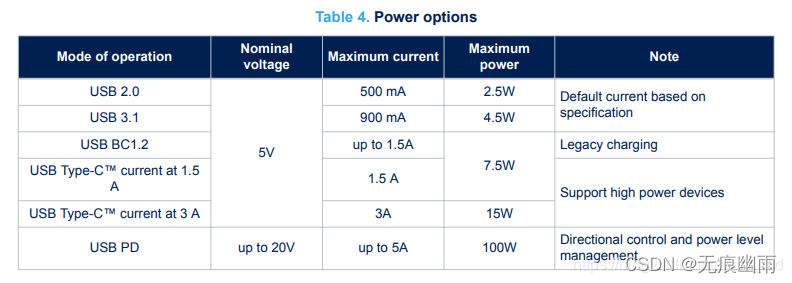

### 1.PPS 可编程电源
PPS 是 2017 年 USB-IF 标准化组织在 USB PD 3.0 标准中可编程电源（Programmable Power Supply）协议的缩写，作为一项额外的补充协议，PPS 在快充方面带来了更多的新玩法。首先相比高压快充的前辈 PD 2.0、PD 3.0（不带 PPS），PPS 支持我们上文提到的高效「直充」方式。

支持 PPS 的前提是支持 PD 3.0，但支持 PD 3.0 并不意味着支持 PPS。本文中如若特别声明，PD 3.0 均指代不带 PPS 支持的 PD 3.0 协议。

PPS 标准的优势在于能够让充电器「听懂」手机的充电需求从而动态调整电压，每隔 10 秒与手机交换一次数据，在 3~21V 的电压范围之间，能够以 0.02V 为单位来进行精细调压。

让充电器而非手机来精细调节电压，这样使得充电时的热源很大一部分将从手机转移到充电器，而且在精细调节电压方面，充电器能够做得更好、更精细（0.02V），提高效率减少能源浪费。

PPS 可以根据设备充电状态更智能地调控充电电压/电流

看到这里，相信你也能明白 PPS 的优势在哪了：通过更智能的调控电压/电流，减少了充电期间的转换损耗。 因为 PPS 使充电更高效的同时还能有效解决充电发热问题，它自然也成为了目前主流快充技术的发展方向之一。

### 2.不带CPU的产品如何实现PD快充

现在越来越多的消费品都希望加上 快充 来增加卖点，除了手机、手表之外，还有像小风扇、电动牙刷、剃须刀、电子烟这类的日用品。这些物品很多都没有 CPU/MCU，很难像手机一样有完善的电源管理。实现快充就需要 PD / QC诱骗芯片 + 升降压充电IC 组合的帮忙。

### 3.USB2.0/3.0 接口类型一览

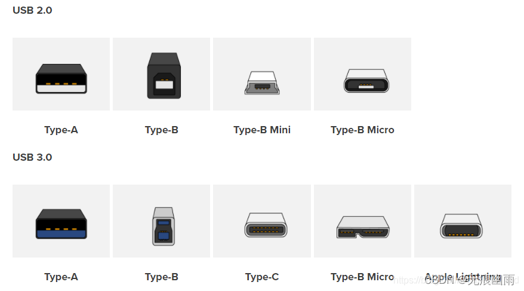

## PD协商过程

源端和吸端之间关于总线电压和电流的交流通过在CC线上传输串行的BMC编码来完成。包含PD协议的USB Type-C系统从源端到吸端的系统框图如下图所示：

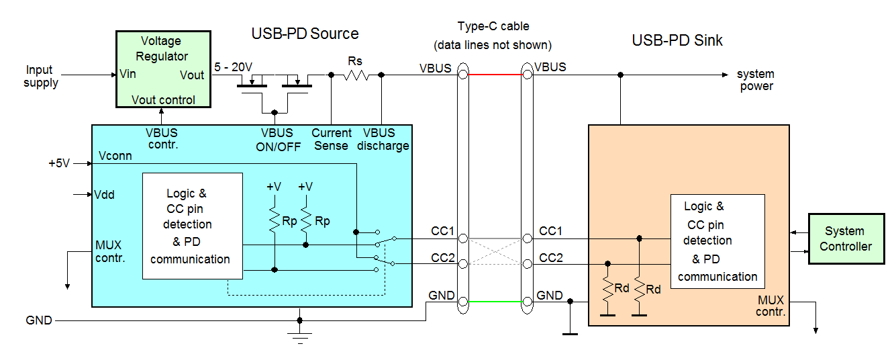

上图所示，Source和Sink各有一个PD芯片，在Source的内部包含了一个电压转换器，且受到PD控制器控制，他会根据输入电压的条件以及最高可输出规格需求，此电压转换器可以是BUCK、Boost、Buck-Boost或者反激转换器。整个通信过程都在PD控制器的管控之下，USB PD还有一个开关，用于切换VCONN电源（电缆包含电子标签时用到）。

当电缆接通之后，PD协议的SOP通信就开始在CC线上进行，以此来选择电源传输的规格，此部分由Sink端向Source端询问能够提供的电源配置参数（5V/9V/12V/15V/20V）。
SOP是DFP到UFP之间的通信包，SOP'是DFP和线材头部，SOP''是和线材尾部，统称为SOP*

如下波形为SINK 控制器申请一个9V电压输出的例子。

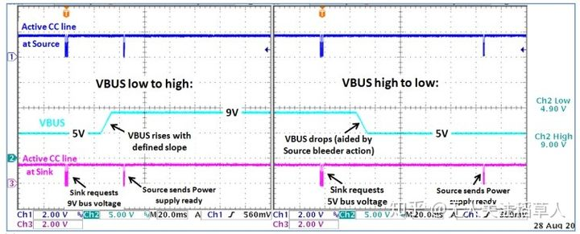

（1）SINK端发起SOP，申请获取Source能提供的规格资料

（2）Source回复能提供的规格列表

（3）SINK回复选择的电压规格，并带上所需要的电流参数，并发出相应的请求

（4）Source接受请求，并且把VBUS由5V抬升到9V

（5）在电压变化期间，SINK的电流会保持尽可能小，Source端VBUS到达9V并稳定之后，会发出Ready信号

（6）SINK端电流逐步抬升，若SINK需要降低电压，会重复以上过程

需要注意的是，在电压下降期间，Source为了让电压快速降低，Source会打开放电电路，达到额定值之后，Source会等待一段时间，电压稳定之后再发出Ready信号给SINK。

这种沟通方式的好处就是能确保任何电源的变化都能在SINK和SOURCE的规格范围内，避免出现不可控情况。

### power-z获取SRC供电能力

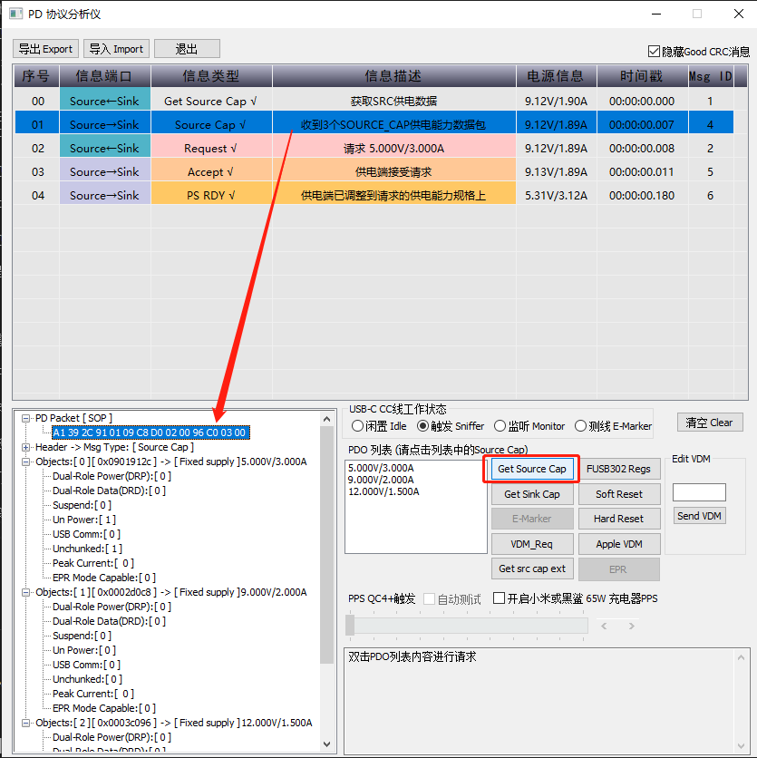

### power-z请求9V/2A过程

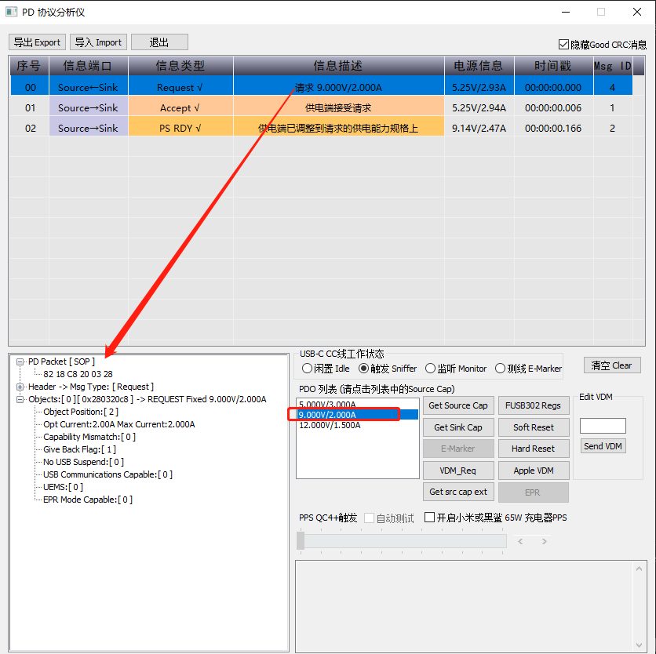

## 协议层数据类型

PD协议的通信编码为Bi-phase Mark Coded (BMC)，通过CC脚进行通信，如下图。

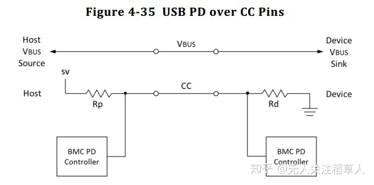

BMC码是一种单线通信编码，数据1的传输，需要有一次高/低电平之间的切换过程，而0的传输则是固定的高电平或者低电平。每一个数据包都包含有0/1交替的前置码，起始码（SOP），报文头，数据位，CRC以及结束码（EOP）

如下图所示，展开后的CC脚PD通信波形：

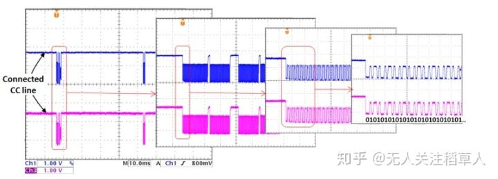

BMC编码的通信，也可以使用分析仪进行分析，用来抓取每个数据包，并且获得数据包的作用，如电压电流等，软件我暂时没找到。

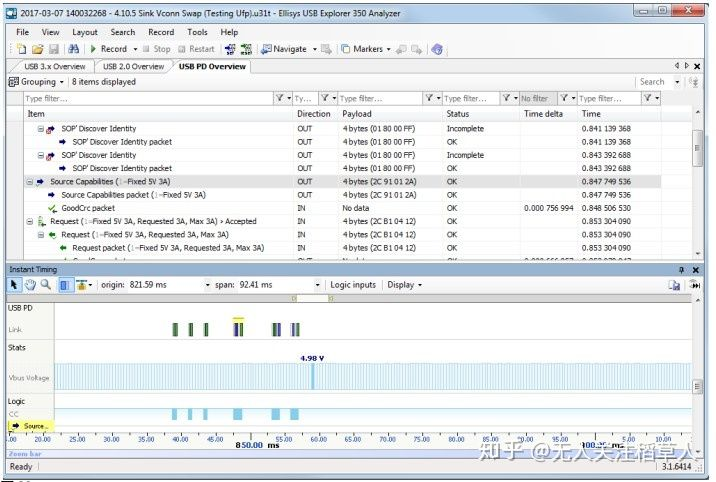

## 协议功率类型

PD3.0规范中，定义了以下电源配置清单：

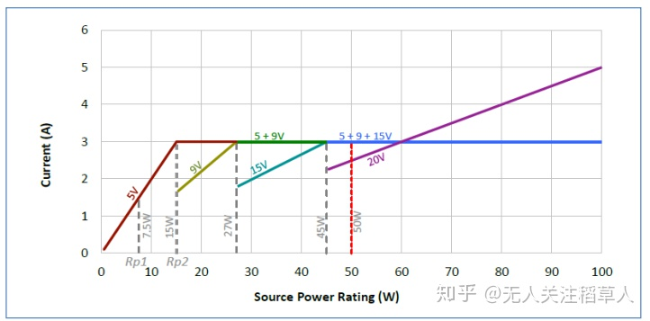

对于5V/9V/15V来说，最大的电流为3A，在20V的配置当中，如果是普通的电流，则最大能够支持20V/3A，即60W，如果使用的是带了E-Marker的线缆，则供电能达到20V5A，即100W。

支持超高速数据传输（USB3.1）或者是供电电流超过3A，电缆都必须使用E-Marker进行标识。线缆中有IC，他们需要从VCONN获得电源。

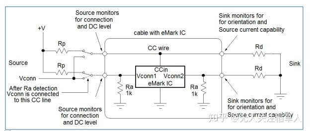

我们注意到，线缆中有1K的下拉电阻Ra，这样在线缆插入的时候，Source会识别到CC1和CC2电压下降的情况，具体的电压会告诉主机哪个端子被Sink的5.1K下拉，那个端子被线缆的1K电阻下拉。因此线缆的插入方向也可以被识别到。Source就可以通过开关，给E-Marker提供VCONN。

如下图为带E-Marker的情况：

（1）电缆接通之后，Source的一根CC线被来自VCONN的1K拉低。

（2）Source检测到此电压，知道电缆中有E-Marker，因此切换VCONN到对应的CC引脚。

（3）在之后，PD通信将会包含Source和E-Marker之间的通信（SOP'&SOP''）Source和Sink之间为SOP。

