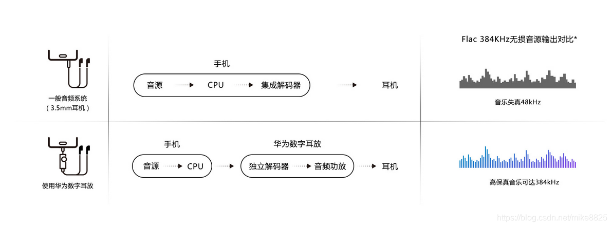
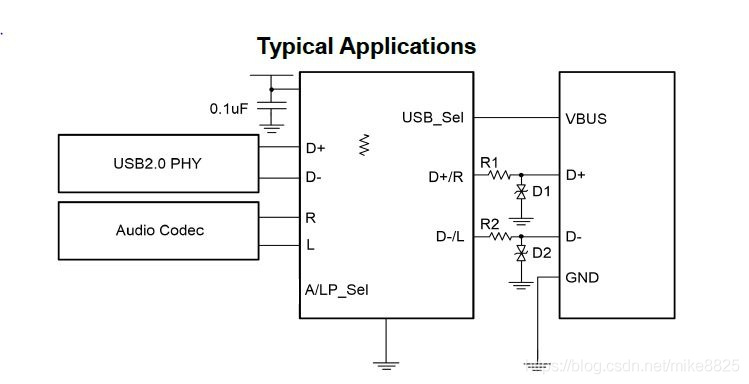
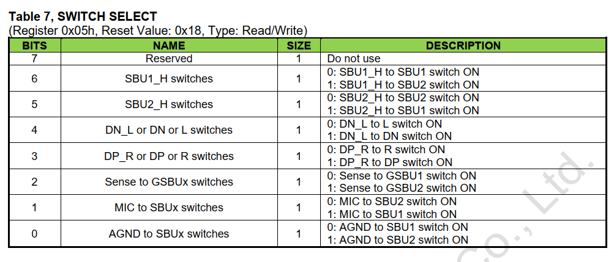

# 概述

qcom qcm2290 TypeC 耳机功能调试过程。

# 参考

* [ASW5480-DS-EN-V1.2-202108.pdf](refers/ASW5480-DS-EN-V1.2-202108.pdf)
* [ALSA子系统（十七）------支持Type-C耳机驱动](https://blog.csdn.net/Guet_Kite/article/details/117529642)
* [typec耳机知识介绍-数字耳机，模拟耳机](https://blog.csdn.net/qq_40662854/article/details/100052318)
* [ASW5480眼图测试报告-20210727.PDF](refers/ASW5480眼图测试报告-20210727.PDF)

# 数字耳机和模拟耳机

 typec耳机(中图)可能是模拟耳机也可能是数字耳机，以耳机内有没有芯片进行判别。数字耳机包含一个usb声卡+DAC&&ADC+amp+模拟耳机，当数字耳机接入到手机(otg)或者电脑后，手机或者电脑识别到了usb设备，并创建相应的声卡后，数字音频信号通过usb传输到数字耳机后，数字耳机通过DAC转换并放大信号，就可以听到声音了，这也是usb声卡的原理。

 手机中模拟和数字耳机的差异：



    DAC :Digital to analog converter数字模拟转换器
    AMP:放大器

kernel打开数字耳机支持需要打开宏`CONFIG_SND_USB_AUDIO`。

# typec cc识别原理

请参考以下文档音频设备章节：
* [0001_TypeC基础知识.md](0001_TypeC基础知识.md)

# typec耳机方案

电路板设计有一个耳机自动切换ic(模拟耳机的左右声道接在usb+、usb-,因此需要切换开光，如DIO3202A, vbus电平为高，芯片切换到usb通路,vbus电平为低，切换到耳机通路),数字耳机接入耳机后，typec逻辑芯片检测到从设备，cpu上的usb切换到主模式，并提供5v(vbus)给从设备供电，完成相应的数字信号传输。



目前A665x项目使用的是asw5480切换芯片，硬件原理如下：


CC_IN可以不经过ASW5480这颗芯片，直接连接到主控基带芯片即可，CC1和CC2的逻辑都是通过主控基带芯片来完成判断的,ASW5480这颗芯片是受控端，它只是个开关，开关的开启关闭和切换到哪一个通道是通过基带的主控通过I2C发送寄存器来实现的。
* USB硬件通路:DN_L to DN switch ON、DP_R to DP switch ON
* 耳机硬件通路: DN_L to L switch ON、DP_R to R switch ON

# 寄存器表

* device id


* SWITCH SELECT



# 参考代码

* [asw5480.c](refers/usb_audio_switch/asw5480.c)

# 打印

插入typec耳机有打印如下：
```log
[Tue Aug  2 23:54:33 2022] xxx-pd-manager soc:xxx_pd_manager: pd_tcp_notifier_call Audio plug in
[  537.098158] init: Control message: Could not find 'android.hardware.soundtrigger@2.0::ISoundTriggerHw/default' for ctl.interface_start from pid: 407 (/system/bin/hwservicemanager)
[  539.104856] init: Control message: Could not find 'android.hardware.soundtrigger@2.0::ISoundTriggerHw/default' for ctl.interface_start from pid: 407 (/system/bin/hwservicemanager)
[  540.105379] init: Control message: Could not find 'android.hardware.soundtrigger@2.0::ISoundTriggerHw/default' for ctl.interface_start from pid: 407 (/system/bin/hwservicemanager)
[  541.106552] init: Control message: Could not find 'android.hardware.soundtrigger@2.0::ISoundTriggerHw/default' for ctl.interface_start from pid: 407 (/system/bin/hwservicemanager)
[  542.109764] init: Control message: Could not find 'android.hardware.soundtrigger@2.0::ISoundTriggerHw/default' for ctl.interface_start from pid: 407 (/system/bin/hwservicemanager)
[  542.344424] xxx-pd-manager soc:xxx_pd_manager: pd_tcp_notifier_call event = 14
[Tue Aug  2 23:55:39 2022] xxx-pd-manager soc:xxx_pd_manager: pd_tcp_notifier_call Audio plug out
```