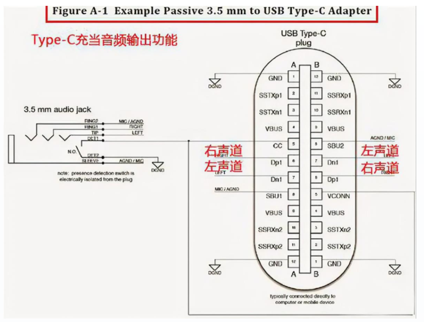
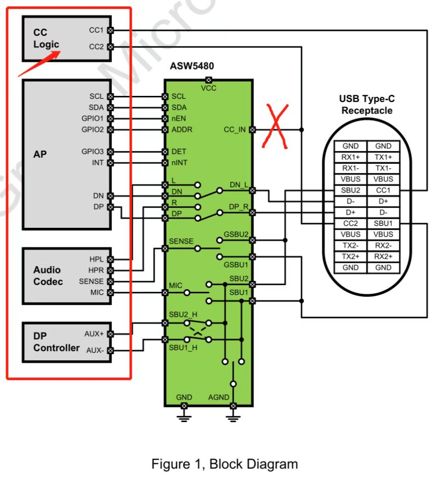
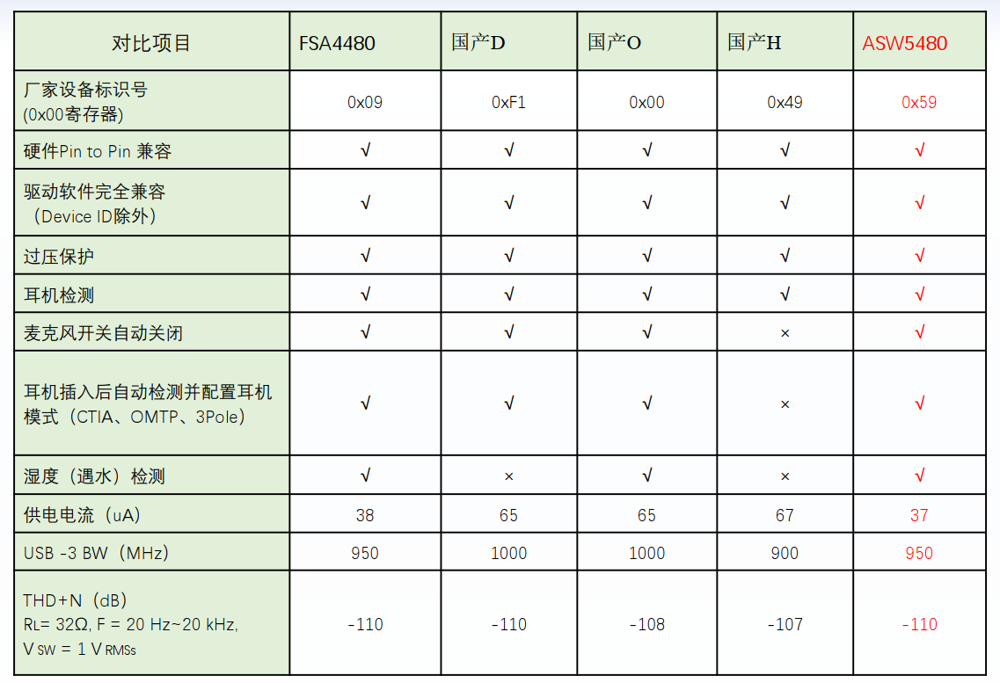
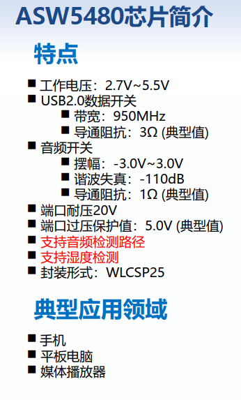
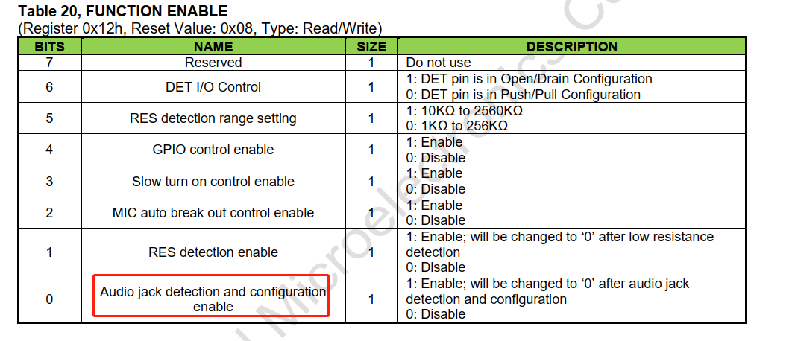
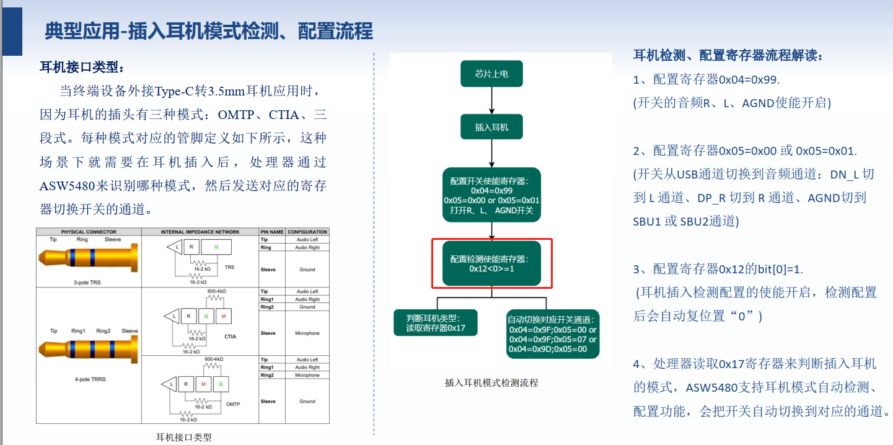
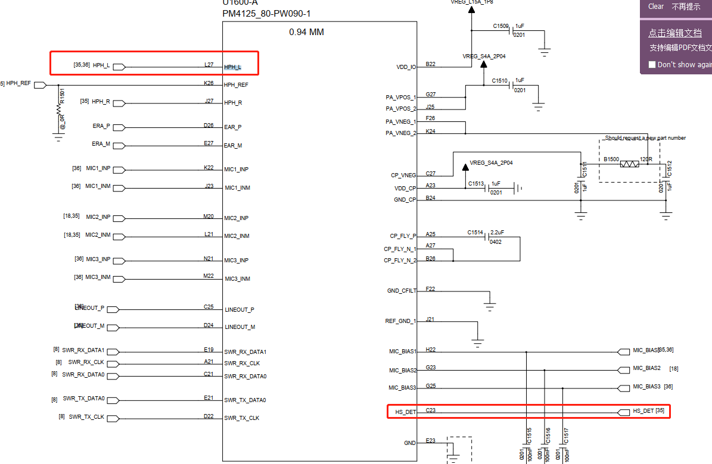
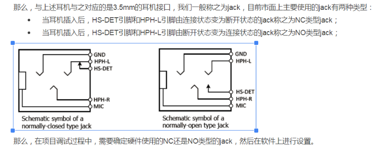

# 概述

qcom qcm2290 TypeC 耳机功能调试过程。

# 参考

* [ASW5480-DS-EN-V1.2-202108.pdf](refers/ASW5480-DS-EN-V1.2-202108.pdf)
* [ALSA子系统（十七）------支持Type-C耳机驱动](https://blog.csdn.net/Guet_Kite/article/details/117529642)
* [typec耳机知识介绍-数字耳机，模拟耳机](https://blog.csdn.net/qq_40662854/article/details/100052318)
* [ASW5480眼图测试报告-20210727.PDF](refers/ASW5480眼图测试报告-20210727.PDF)

# 数字耳机和模拟耳机

 typec耳机(中图)可能是模拟耳机也可能是数字耳机，以耳机内有没有芯片进行判别。数字耳机包含一个usb声卡+DAC&&ADC+amp+模拟耳机，当数字耳机接入到手机(otg)或者电脑后，手机或者电脑识别到了usb设备，并创建相应的声卡后，数字音频信号通过usb传输到数字耳机后，数字耳机通过DAC转换并放大信号，就可以听到声音了，这也是usb声卡的原理。

 手机中模拟和数字耳机的差异：


    DAC :Digital to analog converter数字模拟转换器
    AMP:放大器

kernel打开数字耳机支持需要打开宏`CONFIG_SND_USB_AUDIO`。

# typec cc识别原理

请参考以下文档音频设备章节：
* [0001_TypeC基础知识.md](0001_TypeC基础知识.md)

* ASW5480芯片一般是从电池取电， 终端在开机或关机状态下芯片均需要处于正常工作状态。
* 芯片默认加电后工作在USB模式， 如需要切换到音频模式， 需要CPU通过I2C协议来配置寄存器切换开关通道。
* 当耳机插入后， 会把CC1和CC2拉低(CC=VCONN=GND=0V)， 这时表示耳机插入， CPU发送指令把开关切换到音频通道。
* 如下图所示：



# typec耳机方案

电路板设计有一个耳机自动切换ic(模拟耳机的左右声道接在usb+、usb-,因此需要切换开光，如DIO3202A, vbus电平为高，芯片切换到usb通路,vbus电平为低，切换到耳机通路),数字耳机接入耳机后，typec逻辑芯片检测到从设备，cpu上的usb切换到主模式，并提供5v(vbus)给从设备供电，完成相应的数字信号传输。


目前A665x项目使用的是asw5480切换芯片，硬件原理如下：



CC_IN可以不经过ASW5480这颗芯片，直接连接到主控基带芯片即可，CC1和CC2的逻辑都是通过主控基带芯片来完成判断的,ASW5480这颗芯片是受控端，它只是个开关，开关的开启关闭和切换到哪一个通道是通过基带的主控通过I2C发送寄存器来实现的。
* USB硬件通路:DN_L to DN switch ON、DP_R to DP switch ON
* 耳机硬件通路: DN_L to L switch ON、DP_R to R switch ON

下图为手机或平板设备使用耳机时的应用场景：


# SW5480特性



注意，该IC有耳机插入后自动检测并配置耳机模式功能，所以正反插不用管，芯片自动配置通道。


* 特性：



# 寄存器表

* device id


* SWITCH SELECT


# 参考代码

* [asw5480.c](refers/usb_audio_switch/asw5480.c)

# 打印

插入typec耳机有打印如下：
```log
[Tue Aug  2 23:54:33 2022] xxx-pd-manager soc:xxx_pd_manager: pd_tcp_notifier_call Audio plug in
[  537.098158] init: Control message: Could not find 'android.hardware.soundtrigger@2.0::ISoundTriggerHw/default' for ctl.interface_start from pid: 407 (/system/bin/hwservicemanager)
[  539.104856] init: Control message: Could not find 'android.hardware.soundtrigger@2.0::ISoundTriggerHw/default' for ctl.interface_start from pid: 407 (/system/bin/hwservicemanager)
[  540.105379] init: Control message: Could not find 'android.hardware.soundtrigger@2.0::ISoundTriggerHw/default' for ctl.interface_start from pid: 407 (/system/bin/hwservicemanager)
[  541.106552] init: Control message: Could not find 'android.hardware.soundtrigger@2.0::ISoundTriggerHw/default' for ctl.interface_start from pid: 407 (/system/bin/hwservicemanager)
[  542.109764] init: Control message: Could not find 'android.hardware.soundtrigger@2.0::ISoundTriggerHw/default' for ctl.interface_start from pid: 407 (/system/bin/hwservicemanager)
[  542.344424] xxx-pd-manager soc:xxx_pd_manager: pd_tcp_notifier_call event = 14
[Tue Aug  2 23:55:39 2022] xxx-pd-manager soc:xxx_pd_manager: pd_tcp_notifier_call Audio plug out
```

# 高通自带fsa4480分析

高通自带fsa4480应用如下，和SW5480差不多，也具备自动检测耳机及切换功能。


看一下程序流程：
```c
* fsa4480_probe
  ├── fsa_priv->usb_psy = power_supply_get_by_name("usb");
  ├── fsa_priv->regmap = devm_regmap_init_i2c(i2c, &fsa4480_regmap_config); //采用regmap控制i2c
  ├── fsa4480_update_reg_defaults(fsa_priv->regmap); //将默认fsa_reg_i2c_defaults寄存器数据写入
  ├── fsa_priv->psy_nb.notifier_call = fsa4480_usbc_event_changed; //处理typec audio拔插信息
  ├── rc = power_supply_reg_notifier(&fsa_priv->psy_nb); //注册接收psy(typec)消息通知
  └── INIT_WORK(&fsa_priv->usbc_analog_work,fsa4480_usbc_analog_work_fn); //usb分析工作队列
```

* 寄存器默认配置如下：
```c
#define FSA4480_SWITCH_SETTINGS 0x04
#define FSA4480_SWITCH_CONTROL  0x05
#define FSA4480_SWITCH_STATUS1  0x07
#define FSA4480_SLOW_L          0x08
#define FSA4480_SLOW_R          0x09
#define FSA4480_SLOW_MIC        0x0A
#define FSA4480_SLOW_SENSE      0x0B
#define FSA4480_SLOW_GND        0x0C
#define FSA4480_DELAY_L_R       0x0D
#define FSA4480_DELAY_L_MIC     0x0E
#define FSA4480_DELAY_L_SENSE   0x0F
#define FSA4480_DELAY_L_AGND    0x10
#define FSA4480_RESET           0x1E

static const struct fsa4480_reg_val fsa_reg_i2c_defaults[] = {
	{FSA4480_SLOW_L, 0x00},
	{FSA4480_SLOW_R, 0x00},
	{FSA4480_SLOW_MIC, 0x00},
	{FSA4480_SLOW_SENSE, 0x00},
	{FSA4480_SLOW_GND, 0x00},
	{FSA4480_DELAY_L_R, 0x00},
	{FSA4480_DELAY_L_MIC, 0x00},
	{FSA4480_DELAY_L_SENSE, 0x00},
	{FSA4480_DELAY_L_AGND, 0x09},
	{FSA4480_SWITCH_SETTINGS, 0x98},
};
```

* 工作逻辑：当监听到psy typec audio拔插事件后，启动工作`usbc_analog_work`队列进行配置：
```c
static int fsa4480_usbc_event_changed(struct notifier_block *nb,
				      unsigned long evt, void *ptr)
{
	int ret;
	union power_supply_propval mode;
	struct fsa4480_priv *fsa_priv =
			container_of(nb, struct fsa4480_priv, psy_nb);
	struct device *dev;

	if (!fsa_priv)
		return -EINVAL;

	dev = fsa_priv->dev;
	if (!dev)
		return -EINVAL;

	if ((struct power_supply *)ptr != fsa_priv->usb_psy ||
				evt != PSY_EVENT_PROP_CHANGED)
		return 0;

	ret = power_supply_get_property(fsa_priv->usb_psy,
			POWER_SUPPLY_PROP_TYPEC_MODE, &mode);
	if (ret) {
		dev_err(dev, "%s: Unable to read USB TYPEC_MODE: %d\n",
			__func__, ret);
		return ret;
	}

	dev_dbg(dev, "%s: USB change event received, supply mode %d, usbc mode %d, expected %d\n",
		__func__, mode.intval, fsa_priv->usbc_mode.counter,
		POWER_SUPPLY_TYPEC_SINK_AUDIO_ADAPTER);

	switch (mode.intval) {
	case POWER_SUPPLY_TYPEC_SINK_AUDIO_ADAPTER:
	case POWER_SUPPLY_TYPEC_NONE:
		if (atomic_read(&(fsa_priv->usbc_mode)) == mode.intval)
			break; /* filter notifications received before 过滤两次相同的通知 */
		atomic_set(&(fsa_priv->usbc_mode), mode.intval);

		dev_dbg(dev, "%s: queueing usbc_analog_work\n",
			__func__);
		pm_stay_awake(fsa_priv->dev);
		queue_work(system_freezable_wq, &fsa_priv->usbc_analog_work); //启动工作usbc_analog_work队列进行配置
		break;
	default:
		break;
	}
	return ret;
}

static void fsa4480_usbc_analog_work_fn(struct work_struct *work)
{
	struct fsa4480_priv *fsa_priv =
		container_of(work, struct fsa4480_priv, usbc_analog_work);

	if (!fsa_priv) {
		pr_err("%s: fsa container invalid\n", __func__);
		return;
	}
	fsa4480_usbc_analog_setup_switches(fsa_priv);
	pm_relax(fsa_priv->dev);
}

static int fsa4480_usbc_analog_setup_switches(struct fsa4480_priv *fsa_priv)
{
	int rc = 0;
	union power_supply_propval mode;
	struct device *dev;

	if (!fsa_priv)
		return -EINVAL;
	dev = fsa_priv->dev;
	if (!dev)
		return -EINVAL;

	mutex_lock(&fsa_priv->notification_lock);
	/* get latest mode again within locked context */
	rc = power_supply_get_property(fsa_priv->usb_psy,
			POWER_SUPPLY_PROP_TYPEC_MODE, &mode);
	if (rc) {
		dev_err(dev, "%s: Unable to read USB TYPEC_MODE: %d\n",
			__func__, rc);
		goto done;
	}
	dev_dbg(dev, "%s: setting GPIOs active = %d\n",
		__func__, mode.intval != POWER_SUPPLY_TYPEC_NONE);

	switch (mode.intval) {
	/* add all modes FSA should notify for in here */
	case POWER_SUPPLY_TYPEC_SINK_AUDIO_ADAPTER:
		/* activate switches */
		fsa4480_usbc_update_settings(fsa_priv, 0x00, 0x9F); //reg:05 -> val:00 reg:04 -> val:9F

		/* notify call chain on event */
		blocking_notifier_call_chain(&fsa_priv->fsa4480_notifier,
		mode.intval, NULL);
		break;
	case POWER_SUPPLY_TYPEC_NONE:
		/* notify call chain on event */
		blocking_notifier_call_chain(&fsa_priv->fsa4480_notifier,
				POWER_SUPPLY_TYPEC_NONE, NULL);

		/* deactivate switches */
		fsa4480_usbc_update_settings(fsa_priv, 0x18, 0x98); //reg:05 -> val:18 reg:04 -> val:98
		break;
	default:
		/* ignore other usb connection modes */
		break;
	}

done:
	mutex_unlock(&fsa_priv->notification_lock);
	return rc;
}

static void fsa4480_usbc_update_settings(struct fsa4480_priv *fsa_priv,
		u32 switch_control, u32 switch_enable)
{
	if (!fsa_priv->regmap) {
		dev_err(fsa_priv->dev, "%s: regmap invalid\n", __func__);
		return;
	}

	regmap_write(fsa_priv->regmap, FSA4480_SWITCH_SETTINGS, 0x80); // reg:04 -> val:08  Device Enable
	regmap_write(fsa_priv->regmap, FSA4480_SWITCH_CONTROL, switch_control);
	/* FSA4480 chip hardware requirement */
	usleep_range(50, 55);
	regmap_write(fsa_priv->regmap, FSA4480_SWITCH_SETTINGS, switch_enable);
}
```
两条逻辑如下，可以看到主要是切换usb/audio通道和使能Sense/MIC/AGND切换，具体切换到哪条线路，芯片内部自动切：
  * audio plug in: reg:05 -> val:00 reg:04 -> val:9F
    * DP_R to R switch ON
    * DP_L to L switch ON
    * Sense to GSBUx switches enable
    * MIC to SBUx switches enable
    * AGND to SBUx switches enable
  * audio plug out: reg:05 -> val:18 reg:04 -> val:98
    * DP_R to DP switch ON
    * DP_L to DN switch ON
    * Sense,GSBU1 and GSBU2 will be high−Z fof positive input
    * MIC will be high−Z for positive input
    * AGND will be high−Z for positive input

# # SW5480驱动分析

V03增加了mic/AGND/Sense引脚，主要是增加了mic录音功能，功能和寄存器基本上和fsa4480一样，唯一不同的是多了一步耳机检测使能：




# 驱动如何上报audio jack

首先typec检测到耳机插入，然后通知audio驱动进行上报，具体如何上报，我们先看一下流程：

* `UM.9.15/vendor/qcom/opensource/audio-kernel/asoc/codecs/bolero/bolero-cdc.c`:
```c
* bolero_ssr_enable
  └── bolero_cdc_notifier_call(priv, BOLERO_WCD_EVT_SSR_UP);
      └── rouleur_event_notify //asoc/codecs/rouleur/rouleur.c 收获到通知
          └── rouleur_mbhc_hs_detect(component, mbhc->mbhc_cfg);//asoc/codecs/rouleur/rouleur-mbhc.c
              └── wcd_mbhc_start(&rouleur_mbhc->wcd_mbhc, mbhc_cfg); //asoc/codecs/wcd-mbhc-v2.c
                  ├── mbhc->fsa_nb.notifier_call = wcd_mbhc_usbc_ana_event_handler; //这个是9200 fsa4480的通知回调
                  │   └──  wcd_mbhc_usbc_ana_event_handler(struct notifier_block *nb
                  │       └── if (mode == POWER_SUPPLY_TYPEC_SINK_AUDIO_ADAPTER)
                  │           ├── mbhc->mbhc_cb->clk_setup(mbhc->component, true);
                  │           └──  WCD_MBHC_REG_UPDATE_BITS(WCD_MBHC_L_DET_EN, 1); /* insertion detected, enable L_DET_EN */
                  ├── rc = fsa4480_reg_notifier(&mbhc->fsa_nb, mbhc->fsa_np); //调用fsa4480-i2c.c驱动中的接口
                  ├── mbhc->hp_det_nb.notifier_call = hp_det_nc; //这个是6650的typec通知回调
                  ├── if (!dev_notify_register_client(card->dev, &mbhc->hp_det_nb)) //注册回调接收typec插入拔出通知
                  │   └── hp_det_nc(struct notifier_block *self, unsigned long event, void *data)
                  │       ├── mbhc->mbhc_cb->clk_setup(mbhc->component, true); //打开相关时钟
                  │       ├── WCD_MBHC_REG_UPDATE_BITS(WCD_MBHC_L_DET_EN, 1);/* insertion detected, enable L_DET_EN */
                  │       └── wcd_mbhc_swch_irq_handler(mbhc);
                  │           └── wcd_mbhc_report_plug(mbhc, 0, jack_type);
                  │               ├── wcd_mbhc_jack_report(mbhc, &mbhc->button_jack, 0,mbhc->buttons_pressed); //上报按键
                  │               └── wcd_mbhc_jack_report(mbhc, &mbhc->headset_jack,(mbhc->hph_status | SND_JACK_MECHANICAL),
                  │                   └── snd_soc_jack_report(jack, status, mask);
                  └── rc = wcd_mbhc_initialise(mbhc); //耳机检测相关 0:NC(normally-closed) 1:NO(normally-open)
                      ├── WCD_MBHC_REG_UPDATE_BITS(WCD_MBHC_HPHL_PLUG_TYPE, mbhc->hphl_swh);
                      └── WCD_MBHC_REG_UPDATE_BITS(WCD_MBHC_GND_PLUG_TYPE, mbhc->gnd_swh);
```

# 中断上报流程

有个疑问，为什么`wcd_mbhc_usbc_ana_event_handler`回调中没有去上报键值，原因是由中断处理了，具体看一下是哪些中断，通过`cat /proc/interrupts`：
```c
261:          0          0          0          0   rouleur   0 Edge      rouleur
262:          0          0          0          0   rouleur  14 Edge      HPHR PDM WD INT
263:          0          0          0          0   rouleur  13 Edge      HPHL PDM WD INT
264:          0          0          0          0   rouleur   4 Edge      mbhc sw intr //耳机插入检测
265:          0          0          0          0   rouleur   0 Edge      Button Press detect
266:          0          0          0          0   rouleur   1 Edge      Button Release detect
267:          0          0          0          0   rouleur   3 Edge      Elect Insert
268:          0          0          0          0   rouleur   2 Edge      Elect Remove
269:          0          0          0          0   rouleur   7 Edge      HPH_L OCP detect
270:          0          0          0          0   rouleur   5 Edge      HPH_R OCP detect
```

* `asoc/codecs/rouleur/rouleur.c`中断注册如下：
```c
* rouleur_soc_codec_probe //{ .compatible = "qcom,rouleur-codec" , .data = "rouleur" },
  * rouleur_mbhc_init(&rouleur->mbhc, component, rouleur->fw_data); //asoc/codecs/rouleur/rouleur-mbhc.c
    *  wcd_mbhc_init(wcd_mbhc, component, &mbhc_cb,&intr_ids, wcd_mbhc_registers, ROULEUR_ZDET_SUPPORTED); //asoc/codecs/wcd-mbhc-v2.c
      * const char *hph_switch = "qcom,msm-mbhc-hphl-swh"; const char *gnd_switch = "qcom,msm-mbhc-gnd-swh"; //在wcd_mbhc_initialise进行配置
      * of_property_read_u32(card->dev->of_node, hph_switch, &hph_swh);
      * of_property_read_u32(card->dev->of_node, gnd_switch, &gnd_swh);
      * ret = mbhc->mbhc_cb->request_irq(component,mbhc->intr_ids->mbhc_sw_intr,wcd_mbhc_mech_plug_detect_irq,"mbhc sw intr", mbhc);
        * rouleur_mbhc_request_irq  //asoc/codecs/rouleur/rouleur-mbhc.c
          * wcd_request_irq(&rouleur->irq_info, irq, name, handler, data); //asoc/codecs/wcd-irq.c
            * wcd_map_irq(irq_info, irq);
            * request_threaded_irq(irq, NULL, handler, IRQF_ONESHOT | IRQF_TRIGGER_RISING, name, data);
      * ret = mbhc->mbhc_cb->request_irq(component, mbhc->intr_ids->mbhc_btn_press_intr, wcd_mbhc_btn_press_handler, "Button Press detect", mbhc);
      * ret = mbhc->mbhc_cb->request_irq(component, mbhc->intr_ids->mbhc_btn_release_intr, wcd_mbhc_release_handler, "Button Release detect", mbhc);
      * ret = mbhc->mbhc_cb->request_irq(component, mbhc->intr_ids->mbhc_hs_ins_intr, mbhc->mbhc_fn->wcd_mbhc_hs_ins_irq, "Elect Insert", mbhc);
```

* 参考
* [Audio 耳机 （四）MBHC耳机插拔检测流程](http://www.manongjc.com/detail/27-pnriikehmuooerg.html)

codec通过检测硬件监控MBHC hsdet引脚上的电压，并在耳机插入或拔出插头时向中断控制器生成中断（更新寄存器）。

对于NC型插孔，未插入插头时，连接器的HS-DET和HPH-L引脚短接在一起，从而在MBHC_HSDET引脚上产生逻辑低电压。
将插头完全插入插孔后，断开连接器的HS-DET和HPH-L引脚，内部电流源将MBHC hsdet引脚上的电压拉高至1.8 V，并翻转比较器输出以触发中断信号。
拔出插头后，MBHC_HSDET引脚上的电压下降，导致比较器的输出逻辑改变，并向中断控制器生成中断信号。
对于NO型插孔，MBHC hsdet引脚上的电压与NC型插孔壳体相反。



* 中断配置过程：
```c
/**
 * struct regmap_irq - Description of an IRQ for the generic regmap irq_chip.
 *
 * @reg_offset: Offset of the status/mask register within the bank
 * @mask:       Mask used to flag/control the register.
 * @type_reg_offset: Offset register for the irq type setting.
 * @type_rising_mask: Mask bit to configure RISING type irq.
 * @type_falling_mask: Mask bit to configure FALLING type irq.
 */
struct regmap_irq {
    unsigned int reg_offset;
    unsigned int mask;
    unsigned int type_reg_offset;
    unsigned int type_rising_mask;
    unsigned int type_falling_mask;
};

#define REGMAP_IRQ_REG(_irq, _off, _mask)       \
    [_irq] = { .reg_offset = (_off), .mask = (_mask) }

static const struct regmap_irq ROULEUR_IRQs[ROULEUR_NUM_IRQS] = {
    REGMAP_IRQ_REG(ROULEUR_IRQ_MBHC_BUTTON_PRESS_DET, 0, 0x01),
    REGMAP_IRQ_REG(ROULEUR_IRQ_MBHC_BUTTON_RELEASE_DET, 0, 0x02),
    REGMAP_IRQ_REG(ROULEUR_IRQ_MBHC_ELECT_INS_REM_DET, 0, 0x04),
    REGMAP_IRQ_REG(ROULEUR_IRQ_MBHC_ELECT_INS_REM_LEG_DET, 0, 0x08),
    REGMAP_IRQ_REG(ROULEUR_IRQ_MBHC_SW_DET, 0, 0x10),
    REGMAP_IRQ_REG(ROULEUR_IRQ_HPHR_OCP_INT, 0, 0x20),
    REGMAP_IRQ_REG(ROULEUR_IRQ_HPHR_CNP_INT, 0, 0x40),
    REGMAP_IRQ_REG(ROULEUR_IRQ_HPHL_OCP_INT, 0, 0x80),
    REGMAP_IRQ_REG(ROULEUR_IRQ_HPHL_CNP_INT, 1, 0x01),
    REGMAP_IRQ_REG(ROULEUR_IRQ_EAR_CNP_INT, 1, 0x02),
    REGMAP_IRQ_REG(ROULEUR_IRQ_EAR_OCP_INT, 1, 0x04),
    REGMAP_IRQ_REG(ROULEUR_IRQ_LO_CNP_INT, 1, 0x08),
    REGMAP_IRQ_REG(ROULEUR_IRQ_LO_OCP_INT, 1, 0x10),
    REGMAP_IRQ_REG(ROULEUR_IRQ_HPHL_PDM_WD_INT, 1, 0x20),
    REGMAP_IRQ_REG(ROULEUR_IRQ_HPHR_PDM_WD_INT, 1, 0x40),
    REGMAP_IRQ_REG(ROULEUR_IRQ_HPHL_SURGE_DET_INT, 2, 0x04),
    REGMAP_IRQ_REG(ROULEUR_IRQ_HPHR_SURGE_DET_INT, 2, 0x08),
};

static struct regmap_irq_chip rouleur_regmap_irq_chip = {
    .name = "rouleur",
    .irqs = ROULEUR_IRQs,
    .num_irqs = ARRAY_SIZE(ROULEUR_IRQs),
    .num_regs = 3,
    .status_base = ROULEUR_DIG_SWR_INTR_STATUS_0,
    .mask_base = ROULEUR_DIG_SWR_INTR_MASK_0,
    .ack_base = ROULEUR_DIG_SWR_INTR_CLEAR_0,
    .use_ack = 1,
    .type_base = ROULEUR_DIG_SWR_INTR_LEVEL_0,
    .runtime_pm = false,
    .handle_post_irq = rouleur_handle_post_irq,//handle_post_irq: Driver specific callback to handle interrupt from device
    .irq_drv_data = NULL,
};

static int rouleur_handle_post_irq(void *data) //中断处理函数
{
    struct rouleur_priv *rouleur = data;
    u32 status1 = 0, status2 = 0, status3 = 0;

    regmap_read(rouleur->regmap, ROULEUR_DIG_SWR_INTR_STATUS_0, &status1);
    regmap_read(rouleur->regmap, ROULEUR_DIG_SWR_INTR_STATUS_1, &status2);
    regmap_read(rouleur->regmap, ROULEUR_DIG_SWR_INTR_STATUS_2, &status3);

    rouleur->tx_swr_dev->slave_irq_pending =
            ((status1 || status2 || status3) ? true : false);

    return IRQ_HANDLED;
}

static int rouleur_bind(struct device *dev)
{
    /* Set all interupts as edge triggered */
    for (i = 0; i < rouleur_regmap_irq_chip.num_regs; i++)
        regmap_write(rouleur->regmap,
                 (ROULEUR_DIG_SWR_INTR_LEVEL_0 + i), 0);

    rouleur_regmap_irq_chip.irq_drv_data = rouleur;
    rouleur->irq_info.wcd_regmap_irq_chip = &rouleur_regmap_irq_chip;
    rouleur->irq_info.codec_name = "rouleur";
    rouleur->irq_info.regmap = rouleur->regmap;
    rouleur->irq_info.dev = dev;
    ret = wcd_irq_init(&rouleur->irq_info, &rouleur->virq);
}
```

* dts中断定义：
```
    rx_macro: rx-macro@0a600000 {
        compatible = "qcom,rx-macro";
        reg = <0x0a600000 0x0>;
        clock-names = "rx_core_clk", "rx_npl_clk";
        clocks = <&clock_audio_rx_1 0>,
             <&clock_audio_rx_2 0>;
        qcom,rx-swr-gpios = <&rx_swr_gpios>;
        swr1: rx_swr_master {
            compatible = "qcom,swr-mstr";
            interrupts = <0 297 IRQ_TYPE_LEVEL_HIGH>;
            interrupt-names = "swr_master_irq";
            qcom,swr-num-ports = <5>;
            qcom,disable-div2-clk-switch = <1>;
            qcom,swr-port-mapping = <1 HPH_L 0x1>,
                <1 HPH_R 0x2>, <2 CLSH 0x1>,
                <3 COMP_L 0x1>, <3 COMP_R 0x2>,
                <4 LO 0x1>, <5 DSD_L 0x1>,
                <5 DSD_R 0x2>;
            qcom,swr-num-dev = <1>;
            qcom,swr-clock-stop-mode0 = <1>;
            rouleur_rx_slave: rouleur-rx-slave {
                compatible = "qcom,rouleur-slave";
                reg = <0x0C 0x01170224>;
            };
        };
    };

```
* `interrupts = <0 297 IRQ_TYPE_LEVEL_HIGH>;`表示用系统的297号中断。
* `soc/swr-mstr-ctrl.c`其中中断标志`slave_irq_pending`是通过`rouleur`驱动`rouleur_handle_post_irq`设置的，再根据handle_nested_irq寻找`irq id`找到对应的中断处理函数:
```c
static int swrm_probe(struct platform_device *pdev)
{
    if (swrm->reg_irq) {
        ret = swrm->reg_irq(swrm->handle, swr_mstr_interrupt, swrm,
                SWR_IRQ_REGISTER);
        if (ret) {
            dev_err(&pdev->dev, "%s: IRQ register failed ret %d\n",
                __func__, ret);
            goto err_irq_fail;
        }
    } else { //我感觉应该是走的这里，因为dts里面定义了swr_master_irq
        swrm->irq = platform_get_irq_byname(pdev, "swr_master_irq");
        if (swrm->irq < 0) {
            dev_err(swrm->dev, "%s() error getting irq hdle: %d\n",
                    __func__, swrm->irq);
            goto err_irq_fail;
        }

        ret = request_threaded_irq(swrm->irq, NULL,
                       swr_mstr_interrupt_v2,
                       IRQF_TRIGGER_RISING | IRQF_ONESHOT,
                       "swr_master_irq", swrm);
        if (ret) {
            dev_err(swrm->dev, "%s: Failed to request irq %d\n",
                __func__, ret);
            goto err_irq_fail;
        }

    }
}
//中断处理函数
static irqreturn_t swr_mstr_interrupt_v2(int irq, void *dev)
{
handle_irq:
    for (i = 0; i < SWRM_INTERRUPT_MAX; i++) {
        value = intr_sts_masked & (1 << i);
        if (!value)
            continue;

        switch (value) {
        case SWRM_INTERRUPT_STATUS_SLAVE_PEND_IRQ:
            dev_dbg(swrm->dev, "%s: Trigger irq to slave device\n",
                __func__);
            status = swr_master_read(swrm, SWRM_MCP_SLV_STATUS);
            ret = swrm_find_alert_slave(swrm, status, &devnum);
            if (ret) {
                dev_err_ratelimited(swrm->dev,
                   "%s: no slave alert found.spurious interrupt\n",
                    __func__);
                break;
            }
            swrm_cmd_fifo_rd_cmd(swrm, &temp, devnum, 0x0,
                        SWRS_SCP_INT_STATUS_CLEAR_1, 1);
            swrm_cmd_fifo_wr_cmd(swrm, 0x4, devnum, 0x0,
                        SWRS_SCP_INT_STATUS_CLEAR_1);
            swrm_cmd_fifo_wr_cmd(swrm, 0x0, devnum, 0x0,
                        SWRS_SCP_INT_STATUS_CLEAR_1);


            list_for_each_entry(swr_dev, &mstr->devices, dev_list) {
                if (swr_dev->dev_num != devnum)
                    continue;
                if (swr_dev->slave_irq) {
                    do {
                        swr_dev->slave_irq_pending = 0;
                        handle_nested_irq(
                            irq_find_mapping(
                            swr_dev->slave_irq, 0));
                    } while (swr_dev->slave_irq_pending);
                }

            }
            break;
        }
    intr_sts = swr_master_read(swrm, SWRM_INTERRUPT_STATUS);
    intr_sts_masked = intr_sts & swrm->intr_mask;

    if (intr_sts_masked) {
        dev_dbg(swrm->dev, "%s: new interrupt received 0x%x\n",
            __func__, intr_sts_masked);
        goto handle_irq;
    }
}
}
```


# 耳机NC、NO类型确认

耳机检测相关 0:NC(normally-closed) 1:NO(normally-open)
* 参考
* [高通音频MBHC耳机系统软件相关配置归纳](https://blog.csdn.net/hb9312z/article/details/86063963)
* [NC和NO、耳机美标和欧标的区别](https://www.cnblogs.com/linhaostudy/p/8260813.html)

* 这里涉及dts中的耳机配置：
```shell
&scuba_snd {
    qcom,model = "bengal-scubaidp_AW1SPK-snd-card";
    qcom,msm-mbhc-hphl-swh = <0>;
    qcom,msm-mbhc-gnd-swh = <0>;
};
```
根据硬件原理图，确认HS-DET和HPG-L引脚的连接状态，未插入时断开的则时NO,未插入时连接的则是NC，目前6650配置是的0。
具体原理如下：



# 驱动上报键值

* `sound/soc/soc-jack.c`kernel中重点看一下`snd_soc_jack_report`函数:
```c
/**
 * snd_soc_jack_report - Report the current status for a jack
 *
 * @jack:   the jack
 * @status: a bitmask of enum snd_jack_type values that are currently detected.
 * @mask:   a bitmask of enum snd_jack_type values that being reported.
 *
 * If configured using snd_soc_jack_add_pins() then the associated
 * DAPM pins will be enabled or disabled as appropriate and DAPM
 * synchronised.
 *
 * Note: This function uses mutexes and should be called from a
 * context which can sleep (such as a workqueue).
 */
 void snd_soc_jack_report(struct snd_soc_jack *jack, int status, int mask)
{
    struct snd_soc_dapm_context *dapm;
    struct snd_soc_jack_pin *pin;
    unsigned int sync = 0;
    int enable;
    if (!jack)
        return;
    trace_snd_soc_jack_report(jack, mask, status);
    dapm = &jack->card->dapm;
    mutex_lock(&jack->mutex);
    jack->status &= ~mask;
    jack->status |= status & mask;
    trace_snd_soc_jack_notify(jack, status);
    list_for_each_entry(pin, &jack->pins, list) {
        enable = pin->mask & jack->status;
        if (pin->invert)
            enable = !enable;
        if (enable)
            snd_soc_dapm_enable_pin(dapm, pin->pin);
        else
            snd_soc_dapm_disable_pin(dapm, pin->pin);
        /* we need to sync for this case only */
        sync = 1;
    }
    /* Report before the DAPM sync to help users updating micbias status */
    blocking_notifier_call_chain(&jack->notifier, jack->status, jack);
    if (sync)
        snd_soc_dapm_sync(dapm);
    snd_jack_report(jack->jack, jack->status);
    mutex_unlock(&jack->mutex);
}
EXPORT_SYMBOL_GPL(snd_soc_jack_report);

/**
 * snd_jack_report - Report the current status of a jack
 *
 * @jack:   The jack to report status for
 * @status: The current status of the jack
 */
void snd_jack_report(struct snd_jack *jack, int status)
{
    struct snd_jack_kctl *jack_kctl;
#ifdef CONFIG_SND_JACK_INPUT_DEV
    int i;
#endif
    if (!jack)
        return;
    list_for_each_entry(jack_kctl, &jack->kctl_list, list)
        snd_kctl_jack_report(jack->card, jack_kctl->kctl,
                        status & jack_kctl->mask_bits);
#ifdef CONFIG_SND_JACK_INPUT_DEV
    if (!jack->input_dev)
        return;
    for (i = 0; i < ARRAY_SIZE(jack->key); i++) {
        int testbit = SND_JACK_BTN_0 >> i;
        if (jack->type & testbit)
            input_report_key(jack->input_dev, jack->key[i],
                     status & testbit); //重点，上报键值
    }
    for (i = 0; i < ARRAY_SIZE(jack_switch_types); i++) {
        int testbit = 1 << i;
        if (jack->type & testbit)
            input_report_switch(jack->input_dev,
                        jack_switch_types[i],
                        status & testbit);
    }
    input_sync(jack->input_dev);
#endif /* CONFIG_SND_JACK_INPUT_DEV */
}

```