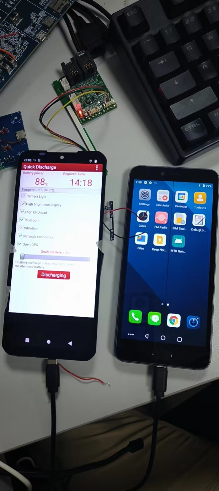

# 概述

研究一下typec底层接口及port注册流程。

# 参考

typec class用于以统一的方式向用户空间描述系统中的 USB Type-C 端口。该类旨在提供除了用户空间接口实现之外的任何其他内容，希望它可以在尽可能多的平台上使用。 这些平台预计会在课程中注册它们拥有的每个 USB Type-C 端口。在正常情况下，注册将由 USB Type-C 或 PD PHY 驱动程序完成，但它可能是 UCSI 等固件接口的驱动程序、USB PD 控制器的驱动程序，甚至是 Thunderbolt3 控制器的驱动程序。本文档将使用类注册 USB Type-C 端口的组件视为“端口驱动程序”。 除了显示功能之外，当端口驱动程序能够支持这些功能时，该类还提供对ports, partners和电缆插头的角色和替代模式的用户空间控制。 该类为本文档中描述的端口驱动程序提供了一个 API。属性在 Documentation/ABI/testing/sysfs-class-typec 中描述。
Typec Class Driver API：
* [USB Type-C connector class](https://dri.freedesktop.org/docs/drm/driver-api/usb/typec.html)
* [Sysfs_notify唤醒调用epoll的用户面进程](https://blog.csdn.net/mosha_2018/article/details/105668555)

# 涉及文件

```C++
CONFIG_TYPEC=y
CONFIG_USB_PD_POLICY=y
CONFIG_QPNP_USB_PDPHY=y

pd/Makefile
7:obj-$(CONFIG_QPNP_USB_PDPHY)  += qpnp-pdphy.o
.compatible	 = "qcom,qpnp-pdphy",dts中没有


pd/Makefile
6:obj-$(CONFIG_USB_PD_POLICY)   += policy_engine.o
这个是提供接口的，根据如下，判断也没加进来：
pd/policy_engine.c
4694: * usbpd_create - Create a new instance of USB PD protocol/policy engine
4703:struct usbpd *usbpd_create(struct device *parent)
4899:EXPORT_SYMBOL(usbpd_create);

pd/usbpd.h
14:struct usbpd *usbpd_create(struct device *parent);
17:static inline struct usbpd *usbpd_create(struct device *parent)

pd/qpnp-pdphy.c
867:    /* usbpd_create() could call back to us, so have __pdphy ready */
870:    pdphy->usbpd = usbpd_create(&pdev->dev);
872:            dev_err(&pdev->dev, "usbpd_create failed: %ld\n",

typec/Makefile
obj-$(CONFIG_TYPEC)             += typec.o
typec-y                         := class.o mux.o bus.o
obj-$(CONFIG_TYPEC)             += altmodes/
```

# Typec Class Driver API

目前class.c文件提供了很多API供驱动使用，这些接口用法在参考中有写，如下：
```C++
	行 271: EXPORT_SYMBOL_GPL(typec_altmode_register_notifier);
	行 281: EXPORT_SYMBOL_GPL(typec_altmode_unregister_notifier);
	行 311: EXPORT_SYMBOL_GPL(typec_altmode_update_active);
	行 331: EXPORT_SYMBOL_GPL(typec_altmode2port);
	行 565: EXPORT_SYMBOL_GPL(typec_unregister_altmode);
	行 626: EXPORT_SYMBOL_GPL(typec_partner_set_identity);
	行 646: EXPORT_SYMBOL_GPL(typec_partner_register_altmode);
	行 694: EXPORT_SYMBOL_GPL(typec_register_partner);
	行 707: EXPORT_SYMBOL_GPL(typec_unregister_partner);
	行 743: EXPORT_SYMBOL_GPL(typec_plug_register_altmode);
	行 785: EXPORT_SYMBOL_GPL(typec_register_plug);
	行 798: EXPORT_SYMBOL_GPL(typec_unregister_plug);
	行 863: EXPORT_SYMBOL_GPL(typec_cable_set_identity);
	行 911: EXPORT_SYMBOL_GPL(typec_register_cable);
	行 924: EXPORT_SYMBOL_GPL(typec_unregister_cable);
	行 1322: EXPORT_SYMBOL_GPL(typec_set_data_role);
	行 1340: EXPORT_SYMBOL_GPL(typec_set_pwr_role);
	行 1359: EXPORT_SYMBOL_GPL(typec_set_vconn_role);
	行 1401: EXPORT_SYMBOL_GPL(typec_set_pwr_opmode);
	行 1416: EXPORT_SYMBOL_GPL(typec_find_port_power_role);
	行 1430: EXPORT_SYMBOL_GPL(typec_find_power_role);
	行 1445: EXPORT_SYMBOL_GPL(typec_find_port_data_role);
	行 1472: EXPORT_SYMBOL_GPL(typec_set_orientation);
	行 1484: EXPORT_SYMBOL_GPL(typec_get_orientation);
	行 1498: EXPORT_SYMBOL_GPL(typec_set_mode);
	行 1531: EXPORT_SYMBOL_GPL(typec_port_register_altmode);
	行 1629: EXPORT_SYMBOL_GPL(typec_register_port);
	行 1642: EXPORT_SYMBOL_GPL(typec_unregister_port);
```

# 驱动程序分析

* class.c驱动中创建了type和typec_mux两个设备，其中typec_mux为空没有实际内容。
```C++
A665x:/sys/class/typec # ls
port0  port0-partner  port1

static int __init typec_init(void)
{
	int ret;

	ret = bus_register(&typec_bus);
	if (ret)
		return ret;

	ret = class_register(&typec_mux_class);
	if (ret)
		goto err_unregister_bus;

	typec_class = class_create(THIS_MODULE, "typec");
	if (IS_ERR(typec_class)) {
		ret = PTR_ERR(typec_class);
		goto err_unregister_mux_class;
	}

	return 0;

err_unregister_mux_class:
	class_unregister(&typec_mux_class);

err_unregister_bus:
	bus_unregister(&typec_bus);

	return ret;
}
subsys_initcall(typec_init);

static void __exit typec_exit(void)
{
	class_destroy(typec_class);
	ida_destroy(&typec_index_ida);
	bus_unregister(&typec_bus);
	class_unregister(&typec_mux_class);
}
module_exit(typec_exit);
```

* sys节点可供调试如下：
```log
console:/sys/class/typec/port0 # ls
data_role  power_operation_mode  supported_accessory_modes    vconn_source
device     power_role            uevent
port_type  preferred_role        usb_power_delivery_revision
power      subsystem             usb_typec_revision
```

# typec注册过程

这几个接口主要是支持/sys/class/typec/port0下power_role、data_role、vconn_source等功能，我们可以采用echo节点的方式进行验证，这几个函数仅供用户空间使用。真正的power_role、data_role主动控制都是在typec PD驱动中完成。
另外注意`typec_register_port`注册函数需要typec设备驱动注册完成后才能进行，否则会报错，执行顺序如下：
```C++
	g_info->tcpc = tcpc_dev_get_by_name("type_c_port0");
	if (!g_info->tcpc) {
		dev_err(&pdev->dev, "%s get tcpc dev fail\n", __func__);
		ret = -EPROBE_DEFER;
		if (probe_cnt >= PROBE_CNT_MAX)
			goto out;
		else
			goto err_get_tcpc_dev;
	}

	ret = typec_init();
	if (ret < 0) {
		dev_err(&pdev->dev, "%s init typec fail(%d)\n", __func__, ret);
		ret = -EPROBE_DEFER;
		if (probe_cnt >= PROBE_CNT_MAX)
			goto out;
		else
			goto err_init_typec;
	}
```
* `drivers/misc/xxx/power/xxxpd-charger-manager.c`:
```C++
static int tcpc_typec_try_role(const struct typec_capability *cap, int role)
{
	uint8_t typec_role = TYPEC_ROLE_UNKNOWN;

	dev_info(&g_info->pdev->dev, "%s role = %d\n", __func__, role);

	switch (role) {
	case TYPEC_NO_PREFERRED_ROLE:
		typec_role = TYPEC_ROLE_DRP;
		break;
	case TYPEC_SINK:
		typec_role = TYPEC_ROLE_TRY_SNK;
		break;
	case TYPEC_SOURCE:
		typec_role = TYPEC_ROLE_TRY_SRC;
		break;
	default:
		return 0;
	}

	return tcpm_typec_change_role_postpone(g_info->tcpc, typec_role, true);
}

static int tcpc_typec_dr_set(const struct typec_capability *cap,
			     enum typec_data_role role)
{
	int ret = 0;
	uint8_t data_role = tcpm_inquire_pd_data_role(g_info->tcpc);
	bool do_swap = false;

	dev_info(&g_info->pdev->dev, "%s role = %d\n", __func__, role);

	if (role == TYPEC_HOST) {
		if (data_role == PD_ROLE_UFP) {
			do_swap = true;
			data_role = PD_ROLE_DFP;
		}
	} else if (role == TYPEC_DEVICE) {
		if (data_role == PD_ROLE_DFP) {
			do_swap = true;
			data_role = PD_ROLE_UFP;
		}
	} else {
		dev_err(&g_info->pdev->dev, "%s invalid role\n", __func__);
		return -EINVAL;
	}

	if (do_swap) {
		ret = tcpm_dpm_pd_data_swap(g_info->tcpc, data_role, NULL);
		if (ret != TCPM_SUCCESS) {
			dev_err(&g_info->pdev->dev, "%s data role swap fail(%d)\n",
					   __func__, ret);
			return -EPERM;
		}
	}

	return 0;
}

static int tcpc_typec_pr_set(const struct typec_capability *cap,
			     enum typec_role role)
{
	int ret = 0;
	uint8_t power_role = tcpm_inquire_pd_power_role(g_info->tcpc);
	bool do_swap = false;

	dev_info(&g_info->pdev->dev, "%s role = %d\n", __func__, role);

	if (role == TYPEC_SOURCE) {
		if (power_role == PD_ROLE_SINK) {
			do_swap = true;
			power_role = PD_ROLE_SOURCE;
		}
	} else if (role == TYPEC_SINK) {
		if (power_role == PD_ROLE_SOURCE) {
			do_swap = true;
			power_role = PD_ROLE_SINK;
		}
	} else {
		dev_err(&g_info->pdev->dev, "%s invalid role\n", __func__);
		return -EINVAL;
	}

	if (do_swap) {
		ret = tcpm_dpm_pd_power_swap(g_info->tcpc, power_role, NULL);
		if (ret == TCPM_ERROR_NO_PD_CONNECTED)
			ret = tcpm_typec_role_swap(g_info->tcpc);
		if (ret != TCPM_SUCCESS) {
			dev_err(&g_info->pdev->dev, "%s power role swap fail(%d)\n",
					   __func__, ret);
			return -EPERM;
		}
	}

	return 0;
}

static int tcpc_typec_vconn_set(const struct typec_capability *cap,
				enum typec_role role)
{
	int ret = 0;
	uint8_t vconn_role = tcpm_inquire_pd_vconn_role(g_info->tcpc);
	bool do_swap = false;

	dev_info(&g_info->pdev->dev, "%s role = %d\n", __func__, role);

	if (role == TYPEC_SOURCE) {
		if (vconn_role == PD_ROLE_VCONN_OFF) {
			do_swap = true;
			vconn_role = PD_ROLE_VCONN_ON;
		}
	} else if (role == TYPEC_SINK) {
		if (vconn_role == PD_ROLE_VCONN_ON) {
			do_swap = true;
			vconn_role = PD_ROLE_VCONN_OFF;
		}
	} else {
		dev_err(&g_info->pdev->dev, "%s invalid role\n", __func__);
		return -EINVAL;
	}

	if (do_swap) {
		ret = tcpm_dpm_pd_vconn_swap(g_info->tcpc, vconn_role, NULL);
		if (ret != TCPM_SUCCESS) {
			dev_err(&g_info->pdev->dev, "%s vconn role swap fail(%d)\n",
					   __func__, ret);
			return -EPERM;
		}
	}

	return 0;
}

static int tcpc_typec_port_type_set(const struct typec_capability *cap,
				    enum typec_port_type type)
{
	bool as_sink = tcpc_typec_is_act_as_sink_role(g_info->tcpc);
	uint8_t typec_role = TYPEC_ROLE_UNKNOWN;

	dev_info(&g_info->pdev->dev, "%s type = %d, as_sink = %d\n",
			    __func__, type, as_sink);

	switch (type) {
	case TYPEC_PORT_SNK:
		if (as_sink)
			return 0;
		break;
	case TYPEC_PORT_SRC:
		if (!as_sink)
			return 0;
		break;
	case TYPEC_PORT_DRP:
		if (cap->prefer_role == TYPEC_SOURCE)
			typec_role = TYPEC_ROLE_TRY_SRC;
		else if (cap->prefer_role == TYPEC_SINK)
			typec_role = TYPEC_ROLE_TRY_SNK;
		else
			typec_role = TYPEC_ROLE_DRP;
		return tcpm_typec_change_role(g_info->tcpc, typec_role);
	default:
		return 0;
	}

	return tcpm_typec_role_swap(g_info->tcpc);
}

static int typec_init(void)
{
	int ret = 0;
	uint8_t typec_role = tcpm_inquire_typec_role(g_info->tcpc);

	g_info->typec_caps.type = TYPEC_PORT_DRP;
	g_info->typec_caps.data = TYPEC_PORT_DRD;
	g_info->typec_caps.revision = 0x0120; //对应节点usb_typec_revision
	g_info->typec_caps.pd_revision = 0x0300; //对应usb_power_delivery_revision节点
	switch (typec_role) {
	case TYPEC_ROLE_SRC:
	case TYPEC_ROLE_TRY_SRC:
		g_info->typec_caps.prefer_role = TYPEC_SOURCE; //对应节点preferred_role
		break;
	case TYPEC_ROLE_SNK:
	case TYPEC_ROLE_TRY_SNK:
		g_info->typec_caps.prefer_role = TYPEC_SINK;
		break;
	default:
		g_info->typec_caps.prefer_role = TYPEC_NO_PREFERRED_ROLE;
		break;
	}

	//这几个接口主要是支持/sys/class/typec/port0下power_role、data_role、vconn_source等功能操作。
	g_info->typec_caps.try_role = tcpc_typec_try_role;
	g_info->typec_caps.dr_set = tcpc_typec_dr_set;
	g_info->typec_caps.pr_set = tcpc_typec_pr_set;
	g_info->typec_caps.vconn_set = tcpc_typec_vconn_set;
	g_info->typec_caps.port_type_set = tcpc_typec_port_type_set;

	g_info->typec_port = typec_register_port(&g_info->pdev->dev, &g_info->typec_caps);
	if (IS_ERR(g_info->typec_port)) {
		ret = PTR_ERR(g_info->typec_port);
		dev_err(&g_info->pdev->dev, "%s typec register port fail(%d)\n",
				   __func__, ret);
		goto out;
	}

	g_info->partner_desc.identity = &g_info->partner_identity;
out:
	return ret;
}

static int xxx_charger_probe(struct platform_device *pdev)
{
	ret = typec_init();
	if (ret < 0) {
		dev_err(&pdev->dev, "%s init typec fail(%d)\n", __func__, ret);
		ret = -EPROBE_DEFER;
		if (probe_cnt >= PROBE_CNT_MAX)
			goto out;
		else
			goto err_init_typec;
	}
}
```

# 问题

## 1.设置data_swap接口tcpm_dpm_pd_data_swap和class中typec_set_data_role区别

按照我的理解，tcpm_dpm_pd_data_swap接口是直接操作typec芯片，typec_set_data_role是通过sysfs_notify通知typec芯片去做。
上面的想法不对，因为我发现A800能实现data_swap和power_swap，并没有调用typec_set_data_role或者typec_set_power_role接口，那这两个接口实际上就是给用户空间获取状态的，A800只是内部逻辑实现了，不可以用户主动去切。
```C++
int tcpm_dpm_pd_data_swap(struct tcpc_device *tcpc,
	uint8_t role, const struct tcp_dpm_event_cb_data *cb_data)
{
	struct tcp_dpm_event tcp_event = {
		.event_id = TCP_DPM_EVT_DR_SWAP_AS_UFP + role,
	};

	return tcpm_put_tcp_dpm_event_cbk1(
		tcpc, &tcp_event, cb_data, TCPM_BK_PD_CMD_TOUT);
}

void typec_set_data_role(struct typec_port *port, enum typec_data_role role)
{
	if (port->data_role == role)
		return;

	port->data_role = role;
	sysfs_notify(&port->dev.kobj, NULL, "data_role");
	kobject_uevent(&port->dev.kobj, KOBJ_CHANGE);
}
EXPORT_SYMBOL_GPL(typec_set_data_role);
```

## 2.用户空间如何操作power_role、data_role、vconn_source等功能

操作power_role节点是在`/sys/class/typec/port0/power_role`，可以看到操作条件需要注册时设置了pd_revision，设置了pr_set接口，且目前pwr_opmode是支持TYPEC_PWR_MODE_PD的，这三个条件满足了才会调用pr_set接口：
```C++
static ssize_t power_role_store(struct device *dev,
				struct device_attribute *attr,
				const char *buf, size_t size)
{
	struct typec_port *port = to_typec_port(dev);
	int ret;

	if (!port->cap->pd_revision) {
		dev_dbg(dev, "USB Power Delivery not supported\n");
		return -EOPNOTSUPP;
	}

	if (!port->cap->pr_set) {
		dev_dbg(dev, "power role swapping not supported\n");
		return -EOPNOTSUPP;
	}

	if (port->pwr_opmode != TYPEC_PWR_MODE_PD) {
		dev_dbg(dev, "partner unable to swap power role\n");
		return -EIO;
	}

	ret = sysfs_match_string(typec_roles, buf);
	if (ret < 0)
		return ret;

	mutex_lock(&port->port_type_lock);
	if (port->port_type != TYPEC_PORT_DRP) {
		dev_dbg(dev, "port type fixed at \"%s\"",
			     typec_port_power_roles[port->port_type]);
		ret = -EOPNOTSUPP;
		goto unlock_and_ret;
	}

	pr_err("pr_set = %d\n", ret);
	ret = port->cap->pr_set(port->cap, ret);
	if (ret)
		goto unlock_and_ret;

	ret = size;
unlock_and_ret:
	mutex_unlock(&port->port_type_lock);
	return ret;
}

static ssize_t power_role_show(struct device *dev,
			       struct device_attribute *attr, char *buf)
{
	struct typec_port *port = to_typec_port(dev);

	if (port->cap->type == TYPEC_PORT_DRP)
		return sprintf(buf, "%s\n", port->pwr_role == TYPEC_SOURCE ?
			       "[source] sink" : "source [sink]");

	return sprintf(buf, "[%s]\n", typec_roles[port->pwr_role]);
}
static DEVICE_ATTR_RW(power_role);
```

pd_revision和pwr_opmode设置分别在typec_init和pd_tcp_notifier_call中设置，其中`TYPEC_PWR_MODE_PD`表示支持PD协议才能进行power role swap：
```C++
static int typec_init(void)
{
	g_info->typec_caps.pd_revision = 0x0300;
}

pd_tcp_notifier_call(...)
{
	case TCP_NOTIFY_PD_STATE:
		dev_info(&g_info->pdev->dev, "%s pd state = %d\n",
				    __func__, noti->pd_state.connected);
		switch (noti->pd_state.connected) {
		case PD_CONNECT_NONE:
			break;
		case PD_CONNECT_HARD_RESET:
			break;
		case PD_CONNECT_TYPEC_ONLY_SNK:
			g_info->pd_type = PD_CONNECT_PE_READY_SNK;
			break;
		case PD_CONNECT_PE_READY_SNK:
		case PD_CONNECT_PE_READY_SNK_PD30:
		case PD_CONNECT_PE_READY_SNK_APDO:
			ret = tcpm_inquire_dpm_flags(g_info->tcpc);
			val.intval = ret & DPM_FLAGS_PARTNER_USB_SUSPEND ?
				     1 : 0;
			smblib_set_prop(POWER_SUPPLY_PROP_PD_USB_SUSPEND_SUPPORTED,&val);
		case PD_CONNECT_PE_READY_SRC:
		case PD_CONNECT_PE_READY_SRC_PD30:
			/* update chg->pd_active */
			val.intval = noti->pd_state.connected ==
				     PD_CONNECT_PE_READY_SNK_APDO ?
				     POWER_SUPPLY_PD_PPS_ACTIVE :
				     POWER_SUPPLY_PD_ACTIVE;
			smblib_set_prop(POWER_SUPPLY_PROP_PD_ACTIVE,
					&val);
			pd_sink_set_vol_and_cur(g_info->sink_mv_old,
						g_info->sink_ma_old,
						TCP_VBUS_CTRL_PD_STANDBY);
			typec_set_pwr_opmode(g_info->typec_port,
					     TYPEC_PWR_MODE_PD);
	}
```

# PR_SWAP操作实验

* 实验条件：
  * 1.两台机器都支持PD协议。

* 用A665x和M5x机器做实验，已知A665x配置的`tcpc,role_def`属性是`DRP`，M5x配置的是`Try.SNK`，当两台机器插入，默认A665x给M5x充电。
```C++
A665x:
tcpc,role_def = <2>; /* 0: SNK Only, 1: SRC Only, 2: DRP, */
						/* 3: Try.SRC, 4: Try.SNK */

M5x:
/* 0: SNK Only, 1: SRC Only, 2: DRP, 3: Try.SRC, 4: Try.SNK */
mt-tcpc,role_def = <4>;
```


* 查看当前A665x的power_role是source：
```shell
console:/sys/class/typec/port0 # cat power_role
[source] sink
```

* 执行命令`echo sink > power_role`，将调用pr_set接口，也就是`tcpc_typec_pr_set`设置PD的power_role成功，目前charger bc1.2识别不成功，没执行plug in，也就是没打开充电，可能要特殊处理。

```shell
console:/sys/class/typec/port0 # echo sink > power_role
[ 4356.132704] typec_roles1 = sink
[ 4356.132704]
[ 4356.137499] typec_roles2 = sink
[ 4356.137499]
[ 4356.142462] typec_roles3 = sink
[ 4356.142462]
[ 4356.147321] typec_roles4 = sink
[ 4356.147321]
[ 4356.151974] pr_set = 0
[ 4356.154531] charger soc:charger: tcpc_typec_pr_set role = 0
[ 4356.212175] pd_tcp_notifier_call event = SOURCE_VBUS
[ 4356.217309] pd_tcp_notifier_call source vbus 0mV
[ 4356.222080] pd_tcp_notifier_call - source vbus 0v output
[ 4356.227778] pd_tcp_notifier_call event = EXT_DISCHARGE
[ 4356.253923] pd_tcp_notifier_call event = EXT_DISCHARGE
[ 4356.259183] pd_tcp_notifier_call event = TYPEC_STATE
[ 4356.264495] tcpc_notifier_call, old_state = ATTACHED_SRC, new_state = ATTACHED_SNK
[ 4356.272212] pd_tcp_notifier_call event = PR_SWAP
[ 4356.276902] xxx_CHG: psy_charger_set_property: prop:122 10
[ 4356.282704] xxx_CHG: pd_status:10
[ 4356.286060] xxx_CHG: _wake_up_charger:
[ 4356.289989] xxx_CHG: xxx_is_charger_on chr_type = [Unknown] last_chr_type = [Unknown]
[ 4356.348486] pd_tcp_notifier_call event = SINK_VBUS
[ 4356.353340] charger soc:charger: pd_tcp_notifier_call sink vbus 5000mV 1500mA type(0x84)
[ 4356.362059] pd_tcp_notifier_call - sink vbus
[ 4356.366392] xxx_CHG: psy_charger_set_property: prop:8 5000000
[ 4356.372191] xxx_CHG: _wake_up_charger:
[ 4356.375978] psy_charger_get_property: 18 callbacks suppressed
[ 4356.375980] xxx_CHG: xxx_is_charger_on chr_type = [Unknown] last_chr_type = [Unknown]
[ 4356.375987] xxx_CHG: psy_charger_set_property: prop:144 5000000
[ 4356.395839] xxx_CHG: psy_charger_set_property: prop:143 5000000
[ 4356.401789] xxx_CHG: set pd_charging_voltage_max:5000 mv
[ 4356.401793] xxx_CHG: _wake_up_charger:
[ 4356.401816] xxx_CHG: psy_charger_set_property: prop:124 1500000
console:/sys/cla[ 4356.401820] PAss/typec/port0 #[ [ 4356.401835] pd_tcp_notifier_call event = SINK_VBUS
[ 4356.401843] charger soc:charger: pd_tcp_notifier_call sink vbus 5000mV 1500mA type(0x01)
[ 4356.401858] xxx_CHG: xxx_is_charger_on chr_type = [Unknown] last_chr_type = [Unknown]
[ 4356.473391] pd_tcp_notifier_call event = SINK_VBUS
[ 4356.540881] charger soc:charger: pd_tcp_notifier_call sink vbus 5000mV 3000mA type(0x01)
[ 4356.540883] pd_tcp_notifier_call - sink vbus
[ 4356.540890] xxx_CHG: psy_charger_set_property: prop:8 5000000
[ 4356.540894] xxx_CHG: _wake_up_charger:
[ 4356.553486] xxx_CHG: xxx_is_charger_on chr_type = [Unknown] last_chr_type = [Unknown]
[ 4356.649145] pd_tcp_notifier_call event = PD_STATE
[ 4356.653910] xxx_CHG: psy_charger_set_property: prop:125 0
[ 4356.653915] xxx_CHG: psy_charger_set_property: prop:122 1
[ 4356.665111] xxx_CHG: pd_status:1
[ 4356.668456] xxx_CHG: _wake_up_charger:
[ 4356.672334] xxx_CHG: psy_charger_set_property: prop:124 3000000
[ 4356.672430] xxx_CHG: xxx_is_charger_on chr_type = [Unknown] last_chr_type = [Unknown]
[ 4356.678376] xxx_CHG: set pd_charging_current_max:3000 ma
[ 4356.692167] xxx_CHG: _wake_up_charger:
[ 4356.696517] xxx_CHG: xxx_is_charger_on chr_type = [Unknown] last_chr_type = [Unknown]
[ 4359.159246] Battery: [ status:Not charging, health:Good, present:1, tech:Li-ion, capcity:86,cap_rm:4427 mah, vol:4059 mv, temp:34, curr:-380 ma, ui_soc:86, notify_code: 0 ]
[ 4359.182007] healthd: battery l=86 v=4059 t=34.0 h=2 st=4 c=-380000 fc=5192000 cc=13 chg=u
[ 4359.328212] type=1400 audit(1660277727.639:126): avc: denied { read } for comm="Binder:478_2" name="wakeup41" dev="sysfs" ino=45514 scontext=u:r:system_suspend:s0 tcontext=u:object_r:vendor_sysfs_battery_supply:s0 tclass=dir permissive=0
[ 4359.351346] type=1400 audit(1660277727.643:127): avc: denied { read } for comm="Binder:478_2" name="wakeup31" dev="sysfs" ino=44775 scontext=u:r:system_suspend:s0 tcontext=u:object_r:vendor_sysfs_usb_supply:s0 tclass=dir permissive=0
[ 4359.419138] ext_spk_switch_put: set Ext_Spk_Switch val 1
[ 4359.439102] msm_pcm_chmap_ctl_put: substream ref_count:0 invalid
[ 4359.470597] send_afe_cal_type: No cal sent for cal_index 0, port_id = 0xb030! ret -22
```

* 我用命令`i2cset -f -y 0 0x3f 0x09 0x53 b`，手动打开充电，可以看到电池电流是往里充的：
```shell
console:/sys/class/chg_info/mp2721 # i2cset -f -y 0 0x3f 0x09 0x53 b
console:/sys/class/chg_info/mp2721 # [ 4604.069683] psy_charger_get_property: 2 callbacks suppressed
[ 4604.093187] healthd: battery l=85 v=4093 t=34.0 h=2 st=2 c=-67000 fc=5192000 cc=13 chg=
[ 4719.615904] Battery: [ status:Charging, health:Good, present:1, tech:Li-ion, capcity:85,cap_rm:4410 mah, vol:4108 mv, temp:34, curr:64 ma, ui_soc:85, notify_code: 0 ]
```