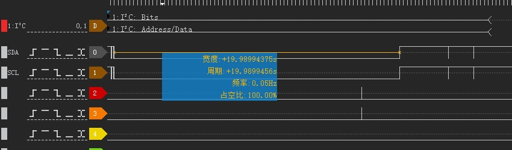

# qcom qcm2290 葆机压力测试USB失效问题分析

发现机器葆机后，USB无法使用，不枚举，充电状态不更新。

# log分析

```log
1. 电脑USB插入
01-01 08:01:55.362 E/        (    0): tcpc_notifier_call, old_state = UNATTACHED, new_state = ATTACHED_SNK
01-01 08:01:55.362 E/        (    0): pd_tcp_notifier_call Charger plug in, polarity = 1
01-01 08:01:55.525 E/xxx_CHG (    0): xxx_is_charger_on chr_type = [SDP] last_chr_type = [Unknown]

拔出
01-14 23:58:35.373 E/        (    0): tcpc_notifier_call, old_state = ATTACHED_SNK, new_state = UNATTACHED
01-14 23:58:35.373 E/        (    0): pd_tcp_notifier_call Charger plug out
01-14 23:58:35.373 E/xxx_CHG (    0): handle_typec_attach_dettach: ++ en:0
01-14 23:58:35.373 E/xxx_CHG (    0): pd_status:0
01-14 23:58:35.373 E/xxx_CHG (    0): xxx_is_charger_on chr_type = [Unknown] last_chr_type = [SDP]

继续插入电脑：
01-14 23:58:37.219 E/xxx_CHG (    0): set charge_type: SDP info->attach = 1
01-14 23:58:37.219 E/xxx_CHG (    0): xxx_is_charger_on chr_type = [SDP] last_chr_type = [Unknown]

拔出:
01-14 23:58:38.817 E/xxx_CHG (    0): xxx_is_charger_on chr_type = [Unknown] last_chr_type = [SDP]
01-14 23:58:38.817 E/xxx_CHG (    0): xxx_charger_plug_out

插入：
01-14 23:58:40.600 E/xxx_CHG (    0): set charge_type: SDP info->attach = 1
01-14 23:58:40.600 E/xxx_CHG (    0): xxx_is_charger_on chr_type = [SDP] last_chr_type = [Unknown]

拔出：
01-14 23:58:42.113 E/xxx_CHG (    0): handle_typec_attach_dettach: ++ en:0
01-14 23:58:42.113 E/xxx_CHG (    0): xxx_is_charger_on chr_type = [Unknown] last_chr_type = [SDP]

最后一次插入适配器：
01-14 23:59:49.151 E/xxx_CHG (    0): set charge_type: DCP info->attach = 1
01-14 23:59:49.151 E/xxx_CHG (    0): xxx_is_charger_on chr_type = [DCP] last_chr_type = [Unknown]
01-14 23:59:49.151 E/xxx_CHG (    0): xxx_charger_plug_in

马上收到ftest发来的关闭充电：
01-14 23:59:49.187 I/xxx_BMS (    0): SET_CHG_EN: 0
01-14 23:59:49.187 E/        (    0): bms_notify_call_chain
01-14 23:59:49.187 E/xxx_CHG (    0): bms_notify_event evt = SET_CHG_EN en:0
01-14 23:59:49.189 E/xxx_CHG (    0): mp2721_enable_charger last: 1 en: 0
01-14 23:59:49.193 I/CAM_ERR (    0): CAM-CDM: cam_hw_cdm_work: 1362 NULL payload
01-14 23:59:49.195 E/xxx_CHG (    0): enable_charging en: 0 last_en: 1
01-14 23:59:49.195 E/xxx_CHG (    0): xxx_charger_update, delay<40>
01-14 23:59:49.195 I/xxx_BMS (    0): type: NC_DISABLE_CHG_BY_USER, disable: 1, vote: 0x200000
```

# 最新进展

我们这边定位到连续扫码会出现I2C直接拉低20s情况。



从log上分析，这会导致i2c整个挂了：
```log
2-17 21:31:03.501 I/CAM_ERR (    0): CAM-CDM: cam_hw_cdm_work: 1362 NULL payload
02-17 21:31:03.547 I/CAM_ERR (    0): CAM-CDM: cam_hw_cdm_work: 1362 NULL payload
02-17 21:31:03.575 I/CAM_ERR (    0): CAM-CDM: cam_hw_cdm_work: 1362 NULL payload
02-17 21:31:03.612 I/CAM_ERR (    0): CAM-CDM: cam_hw_cdm_work: 1362 NULL payload
02-17 21:31:03.650 I/CAM_ERR (    0): CAM-CDM: cam_hw_cdm_work: 1362 NULL payload
02-17 21:31:03.652 E/sdl_control_ioctl(    0): w:58 00 a8                                         X..
02-17 21:31:03.654 E/sdl_control_ioctl(    0): r:58 80                                            X.
02-17 21:31:03.655 E/sdl_control_ioctl(    0): w:77 03 86                                         w..
02-17 21:31:03.697 E/sdl_control_ioctl(    0): r:77 80                                            w.
02-17 21:31:03.704 I/CAM_ERR (    0): CAM-SENSOR: se4770_mipi_misc_release: 1153 SDL release se4770_mipi_misc_release:1153 rc=0 is_opened_by_SDL=1
02-17 21:31:03.760 I/CAM_INFO(    0): CAM-CRM: cam_req_mgr_process_flush_req: 2163 Last request id to flush is 192
02-17 21:31:03.760 I/CAM_INFO(    0): CAM-ISP: __cam_isp_ctx_flush_req_in_top_state: 2741 Last request id to flush is 192
02-17 21:31:03.760 I/CAM_ERR (    0): CAM-ISP: cam_tfe_mgr_cmd: 4558 Reg dump on flush failed req id: 189 num_reg_dump:0x0 rc: -22
02-17 21:31:03.760 I/CAM_ERR (    0): CAM-ISP: __cam_isp_ctx_flush_req_in_top_state: 2750 Reg dump on flush failed rc: -22
02-17 21:31:03.760 I/CAM_INFO(    0): CAM-ISP: __cam_isp_ctx_flush_req_in_top_state: 2764 Stop HW complete. Reset HW next.
02-17 21:31:03.761 I/CAM_ERR (    0): CAM-ISP: cam_tfe_csid_irq: 3106 CSID 1 irq status TOP: 0x0 RX: 0x11 IPP: 0x0 RDI0: 0x1e02 RDI1: 0x0 RDI2: 0x0 CSID clk:80000000
02-17 21:31:03.817 W/perfetto(    0): disabled ftrace
02-17 21:31:03.850 I/CAM_ERR (    0): CAM-ISP: cam_tfe_csid_irq: 3106 CSID 1 irq status TOP: 0x1 RX: 0x0 IPP: 0x0 RDI0: 0x0 RDI1: 0x0 RDI2: 0x0 CSID clk:80000000
02-17 21:31:03.857 I/CAM_INFO(    0): CAM-SENSOR: cam_sensor_driver_cmd: 1598 CAM_STOP_DEV with is_opened_by_SDL = 1
02-17 21:31:03.857 I/CAM_ERR (    0): CAM-SENSOR: streamOff_sdl: 871 streamOff_sdl+
02-17 21:31:03.857 I/CAM_ERR (    0): CAM-SENSOR: se4770_mipi_i2c_txdata: 654 i2c_tx+
02-17 21:31:03.858 I/CAM_ERR (    0): CAM-SENSOR: se4770_mipi_i2c_txdata: 658 i2c_tx-1
02-17 21:31:03.858 I/CAM_ERR (    0): CAM-SENSOR: se4770_mipi_i2c_rxdata: 634 i2c_rx+
02-17 21:31:03.858 I/CAM_ERR (    0): CAM-SENSOR: se4770_mipi_i2c_rxdata: 638 i2c_rx-1
02-17 21:31:03.858 I/CAM_ERR (    0): CAM-SENSOR: streamOff_sdl: 894 se4770_mipi_i2c_rxdata streamOff_AcqOff success! i =0,respbuf[1]=0x80
02-17 21:31:03.858 I/CAM_ERR (    0): CAM-SENSOR: streamOff_sdl: 902 streamOf_sdl-1
02-17 21:31:03.858 I/CAM_INFO(    0): CAM-SENSOR: cam_sensor_driver_cmd: 1610 CAM_STOP_DEV Success, sensor_id:0x4100,sensor_slave_addr:0x5c
02-17 21:31:03.858 I/CAM_INFO(    0): CAM-CSIPHY: cam_csiphy_core_cfg: 997 STOP_DEV: CSIPHY_IDX: 1, Device_slot: 0, Datarate: 640000000, Settletime: 4400000000
02-17 21:31:03.880 I/CAM_INFO(    0): CAM-SENSOR: cam_sensor_driver_cmd: 1476 Set is_opened_by_SDL = 0
02-17 21:31:03.886 I/i2c_camera 0-005c(    0): Dropping the link to regulator.48
02-17 21:31:03.892 I/i2c_camera 0-005c(    0): Dropping the link to regulator.47
02-17 21:31:03.945 I/i2c_camera 0-005c(    0): Dropping the link to regulator.38
02-17 21:31:03.946 I/CAM_INFO(    0): CAM-SENSOR: cam_sensor_driver_cmd: 1507 CAM_RELEASE_DEV Success, sensor_id:0x4100,sensor_slave_addr:0x5c


02-17 21:31:16.185 W/->handle_irq()(    0): 0000000093f02af2, msm_gpio_irq_handler+0x0/0x158
02-17 21:31:16.185 W/->irq_data.chip()(    0): 00000000738fe862, msm_mpm_gic_chip+0x0/0x110
02-17 21:31:16.185 W/->action()(    0): 00000000c87a7013
02-17 21:31:16.185 W/->action->handler()(    0): 00000000469cba0c, bad_chained_irq+0x0/0x40
02-17 21:31:16.185 W/        (    0): IRQ_LEVEL set
02-17 21:31:16.185 W/        (    0): IRQ_NOPROBE set
02-17 21:31:16.185 W/        (    0): IRQ_NOREQUEST set
02-17 21:31:16.185 W/        (    0): IRQ_NOTHREAD set
02-17 21:31:16.196 I/init    (    0): Service 'vendor.msm_irqbalance' (pid 8201) exited with status 234
02-17 21:31:16.196 I/init    (    0): Sending signal 9 to service 'vendor.msm_irqbalance' (pid 8201) process group...
02-17 21:31:16.197 I/libprocessgroup(    0): Successfully killed process cgroup uid 0 pid 8201 in 0ms
02-17 21:31:16.199 I/init    (    0): starting service 'vendor.msm_irqbalance'...

02-17 21:31:26.449 E/i2c_geni 4a80000.i2c(    0): I2C xfer timeout: 126
02-17 21:31:26.450 E/i2c_geni 4a80000.i2c(    0): I2C TXN timed out
02-17 21:31:27.183 W/audit   (    0): audit_lost=13474 audit_rate_limit=5 audit_backlog_limit=1024
02-17 21:31:27.183 E/audit   (    0): rate limit exceeded
02-17 21:31:27.473 E/i2c_geni 4a80000.i2c(    0): Cancel failed
02-17 21:31:27.474 E/i2c_geni 4a80000.i2c(    0): i2c error :-110
02-17 21:31:27.475 E/sdl_control_ioctl(    0): w:01                                               .
02-17 21:31:27.989 E/i2c_geni 4a80000.i2c(    0): I2C xfer timeout: 126
02-17 21:31:27.989 E/i2c_geni 4a80000.i2c(    0): I2C TXN timed out
02-17 21:31:28.119 E/xxx_CHG (    0): xxx_is_charger_on chr_type = [DCP] last_chr_type = [DCP]
02-17 21:31:29.009 E/i2c_geni 4a80000.i2c(    0): Cancel failed
02-17 21:31:29.009 E/i2c_geni 4a80000.i2c(    0): i2c error :-110
02-17 21:31:29.521 E/i2c_geni 4a80000.i2c(    0): I2C xfer timeout: 126
02-17 21:31:29.522 E/i2c_geni 4a80000.i2c(    0): I2C TXN timed out
02-17 21:31:30.545 E/i2c_geni 4a80000.i2c(    0): Cancel failed
02-17 21:31:30.545 E/i2c_geni 4a80000.i2c(    0): i2c error :-110
02-17 21:31:30.546 W/i2c_write(    0): write failed ret(-110), maybe in standby
02-17 21:31:31.057 E/i2c_geni 4a80000.i2c(    0): I2C xfer timeout: 126
02-17 21:31:31.057 E/i2c_geni 4a80000.i2c(    0): I2C TXN timed out
```

# 解决方案

后续修复问题方案是扫码头供应商更新了扫码相关应用的so库，并没有说明什么原因。