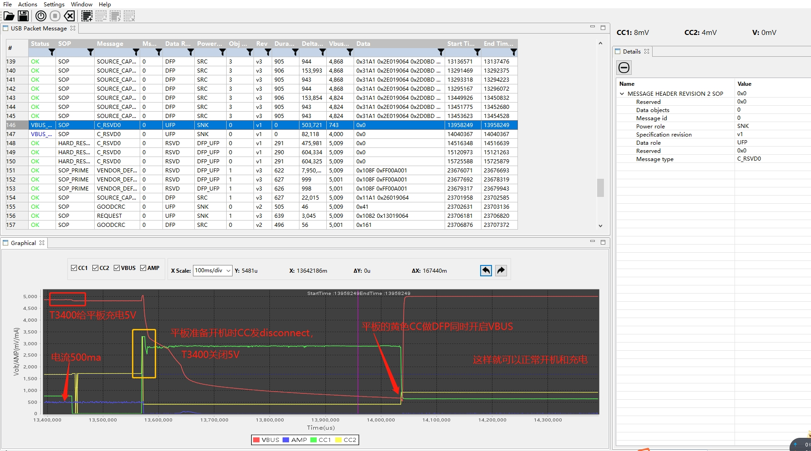

# T3400给低电M8供电无法开机

分析平板在没有电的时候，通过T3400给平板充电，无法开机问题

# 供应商初步分析

以下是供应商给的分析：

平板在没有电的时候，通过T3400给平板充电，无法开机，原因是平板在准备开机时，CC有个不规范导致的，建议平板更改逻辑：
1. 只有到可以正常对外开VBUS的时候才进入开机模式，不能在还不能开VBUS的时候开机；

2. 或者开机的时候CC不要发断开的信号，

以上两个解决方案看哪个好改

PS: 适配器可以是应该适配器是only DFP模式，而扩展坞是DRP双向模式，逻辑不一样，用Dell和苹果原装扩展坞也有同样问题


具体分析如下：


如下图是关机时经过T3400给平板充电可以正常开机的：



* 以上得出几个信息：
1. 扩展坞是DRP双向模式，M8是only DFP模式。
2. 低电量M8再对外供电会造成关机。

# 默认Try.SRC

目前默认是Try.SRC，所以机器开机会`Attached-> SOURCE`，vbus是对T3400供电了，如果是低电量很容易造成关机，具体打印过程如下：
```log
<6>[    2.708153] .(0)[1:swapper/0]__tcpc_class_complete_work = type_c_port0
<6>[    2.710322] .(3)[112:pd_dbg_info]///PD dbg info 42d
<5>[    2.710334] .(3)[112:pd_dbg_info]<    2.710>TCPC-TYPEC:typec_init: TrySRC
<6>[    3.960568] .(6)[112:pd_dbg_info]///PD dbg info 274d
<5>[    3.960606] .(6)[112:pd_dbg_info]<    3.933>TCPC-TYPEC:LC->Suspect: 1
<5>[    3.960606] <    3.938>TCPC-TYPEC:[CC_Change] 0/0
<5>[    3.960606] <    3.938>TCPC-TYPEC:wait_ps=Disable
<5>[    3.960606] <    3.938>T
<5>[    3.960622] .(6)[112:pd_dbg_info]CPC-TYPEC:** TryWait.SNK
<5>[    3.960622] <    3.949>TCPC-TYPEC:[CC_Change] 0/0
<5>[    3.960622] <    3.949>TCPC-TYPEC:** Unattached.SNK
<5>[    3.960622] <    3.951>TCPC-TYPEC:
<5>[    3.960701] .(6)[112:pd_dbg_info][CC_Alert] 15/15
<6>[    4.000108] .(0)[331:kworker/u16:9]tcpc_notifier_call: action:11
<6>[    4.000123] .(0)[331:kworker/u16:9]pd_tcp_notifier_call ext discharge = 0
<6>[    4.000134] .(0)[331:kworker/u16:9]mt6370_pmu_charger mt6370_pmu_charger: mt6370_enable_discharge: en = 0
<6>[    4.026929] .(7)[112:pd_dbg_info]///PD dbg info 38d
<5>[    4.026972] .(7)[112:pd_dbg_info]<    4.026>TCPC-TYPEC:[CC_Alert] 7/0
<6>[    4.027794] .(0)[331:kworker/u16:9]tcpc_notifier_call: action:12
<6>[    4.052498] .(7)[112:pd_dbg_info]///PD dbg info 41d
<5>[    4.052536] .(7)[112:pd_dbg_info]<    4.027>TCPC-TYPEC:** AttachWait.SNK
<6>[    4.148038] .(7)[112:pd_dbg_info]///PD dbg info 82d
<5>[    4.148079] .(7)[112:pd_dbg_info]<    4.147>TCPC-TYPEC:[CC_Change] 7/0
<5>[    4.148079] <    4.147>TCPC-TYPEC:wait_ps=SNK_VSafe5V
<6>[    4.160000] .(5)[244:irq/28-mt6370_p]mt6370_pmu_irq_handler
<6>[    4.165378] .(4)[244:irq/28-mt6370_p]mt6370_pmu 5-0034: mt6370_pmu_irq_handler: handler irq_domain = (8, 4)
<6>[    4.172462] .(7)[112:pd_dbg_info]///PD dbg info 217d
<5>[    4.172481] .(7)[112:pd_dbg_info]<    4.160>TCPC-TCPC:ps_change=2
<5>[    4.172481] <    4.160>TCPC-TYPEC:wait_ps=Disable
<5>[    4.172481] <    4.160>TCPC-TYPEC:** Try.SRC
<5>[    4.172481] <    4.161>TCPC-TYPEC
<5>[    4.172485] .(7)[112:pd_dbg_info]:[CC_Alert] 0/0
<5>[    4.172485] <    4.164>TCPC-TYPEC:[CC_Alert] 2/0
<5>[    4.172485] <    4.171>TCPC-TCPC:ps_change=1
<6>[    4.200472] .(7)[112:pd_dbg_info]///PD dbg info 82d
<5>[    4.200490] .(7)[112:pd_dbg_info]<    4.174>TCPC-TYPEC:[CC_Change] 2/0
<5>[    4.200490] <    4.174>TCPC-TYPEC:wait_ps=SRC_VSafe0V
<6>[    4.736440] .(0)[112:pd_dbg_info]///PD dbg info 121d
<5>[    4.736459] .(0)[112:pd_dbg_info]<    4.709>TCPC-TYPEC:wait_ps=Disable
<5>[    4.736459] <    4.709>TCPC-TYPEC:** Attached.SRC
<5>[    4.736459] <    4.709>TCPC-TYPEC:wait_ps=SRC_VSafe5V
<6>[    4.988673] .(4)[112:pd_dbg_info]///PD dbg info 34d
<5>[    4.988684] .(4)[112:pd_dbg_info]<    4.988>TCPC-TCPC:ps_change=2
<6>[    5.020414] .(4)[112:pd_dbg_info]///PD dbg info 120d
<5>[    5.020424] .(4)[112:pd_dbg_info]<    4.988>TCPC-TYPEC:wait_ps=Disable
<5>[    5.020424] <    4.988>TCPC-TYPEC:Attached-> SOURCE
<5>[    5.020424] <    4.989>TCPC-TCPC:usb_port_attached
```

11s后T3400通过`SRC_START`协商给M8供电，M8选择5v/3a档位：


```log
<6>[   12.792953] .(5)[112:pd_dbg_info]///PD dbg info 68d
<5>[   12.792964] .(5)[112:pd_dbg_info]<   12.792>TCPC-DC> dc_dfp_none
<5>[   12.792964] <   12.792>TCPC-PE:PD-> SRC_START
<6>[   12.824434] .(5)[112:pd_dbg_info]///PD dbg info 193d
<5>[   12.824453] .(5)[112:pd_dbg_info]<   12.813>TCPC-PE-EVT:timer
<5>[   12.824453] <   12.813>TCPC-PE-EVT:tcp_event(disc_cable), 28
<5>[   12.824453] <   12.813>TCPC-PE:VDM-> SRC_VDM_ID_REQ
<5>[   12.824453] <   12.
<5>[   12.824457] .(5)[112:pd_dbg_info]818>TCPC-PE-EVT:tx_err
<5>[   12.824457] <   12.818>TCPC-PE:VDM-> SRC_VDM_ID_NAK
<6>[   12.852431] .(5)[112:pd_dbg_info]///PD dbg info 339d
<5>[   12.852448] .(5)[112:pd_dbg_info]<   12.838>TCPC-PE-EVT:timer
<5>[   12.852448] <   12.838>TCPC-PE:PD-> SRC_SEND_CAP
<5>[   12.852448] <   12.840>TCPC-PE-EVT:good_crc
<5>[   12.852448] <   12.845>TCPC-PE-EVT:request
<5>[   12.852452] <   12.845>TCPC-PE:PD-> SRC_NEG_CAP
<5>[   12.852452] <   12.845>TCPC-PE:pd_rev=2
<5>[   12.852452] <   12.845>TCPC-DPM:RequestCap1
<5>[   12.852452] <   12.845>TCPC-PE-EVT:d
<5>[   12.852465] .(5)[112:pd_dbg_info]pm_ack
<5>[   12.852465] <   12.845>TCPC-PE:PD-> SRC_TRANS_SUPPLY
<5>[   12.852465] <   12.846>TCPC-PE-EVT:good_crc
<5>[   12.873819] .(2)[260:kworker/u16:4][MUSB]otg_tcp_notifier_call 395: source vbus = 5000mv
<5>[   12.873831] .(2)[260:kworker/u16:4][MUSB]mt_usb_vbus_on 378: vbus_on
<5>[   12.873839] .(2)[260:kworker/u16:4][MUSB]issue_vbus_work 367: issue work, ops<1>, delay<0>
<6>[   12.873854] .(2)[260:kworker/u16:4]tcpc_notifier_call: action:9
<5>[   12.873874] .(6)[336:kworker/u16:11][MUSB]_set_vbus 167: op<1>, status<1>
<6>[   12.884438] .(5)[112:pd_dbg_info]///PD dbg info 177d
<5>[   12.884455] .(5)[112:pd_dbg_info]<   12.873>TCPC-PE-EVT:timer
<5>[   12.884455] <   12.873>TCPC-PE-EVT:vbus_stable
<5>[   12.884455] <   12.873>TCPC-PE:PD-> SRC_TRANS_SUPPLY2
<5>[   12.884455] <   12.875>TCPC-PE-
<5>[   12.884459] .(5)[112:pd_dbg_info]EVT:good_crc
<5>[   12.884459] <   12.875>TCPC-PE:PD-> SRC_READY
<6>[   12.916415] .(6)[112:pd_dbg_info]///PD dbg info 61d
<5>[   12.916431] .(6)[112:pd_dbg_info]<   12.900>TCPC-PE-EVT:timer
<5>[   12.916431] <   12.900>TCPC-PE:sink_tx_ng
<7>[   12.945009] .(6)[914:AALMain][PWM] disp_pwm_log: (latest= 8):   879( 225, 421)  880( 225, 437)  881( 225, 568)  882( 225, 714)  883( 225, 877)  881( 226,  57)  880( 226,  73)  878( 226,  89)
<6>[   12.948425] .(6)[112:pd_dbg_info]///PD dbg info 410d
<5>[   12.958444] .(2)[251:kworker/u16:3][MUSB]otg_tcp_notifier_call 395: source vbus = 0mv
<5>[   12.958455] .(2)[251:kworker/u16:3][MUSB]mt_usb_vbus_off 384: vbus_off
<5>[   12.958463] .(2)[251:kworker/u16:3][MUSB]issue_vbus_work 367: issue work, ops<0>, delay<0>
<6>[   12.958483] .(2)[251:kworker/u16:3]tcpc_notifier_call: action:9
<5>[   12.958501] .(2)[251:kworker/u16:3][MUSB]_set_vbus 167: op<0>, status<1>
<6>[   12.958517] .(2)[251:kworker/u16:3]mt6370_pmu_charger mt6370_pmu_charger: mt6370_enable_otg: en = 0
<6>[   12.958563] .(2)[336:kworker/u16:11]tcpc_notifier_call: action:11
<6>[   12.958581] .(2)[336:kworker/u16:11]pd_tcp_notifier_call ext discharge = 1
<6>[   12.958590] .(2)[336:kworker/u16:11]mt6370_pmu_charger mt6370_pmu_charger: mt6370_enable_discharge: en = 1
<6>[   12.958867] .(2)[251:kworker/u16:3]mt6370_pmu_charger mt6370_pmu_charger: mt6370_enable_otg: reg0x33 = 0x73
<6>[   12.961101] .(4)[244:irq/28-mt6370_p]mt6370_pmu_irq_handler
<6>[   12.963628] .(4)[244:irq/28-mt6370_p]mt6370_pmu 5-0034: mt6370_pmu_irq_handler: handler irq_domain = (8, 4)
<6>[   12.967420] .(0)[336:kworker/u16:11]tcpc_notifier_call: action:11
<6>[   12.967434] .(0)[336:kworker/u16:11]pd_tcp_notifier_call ext discharge = 0
<6>[   12.967446] .(0)[336:kworker/u16:11]mt6370_pmu_charger mt6370_pmu_charger: mt6370_enable_discharge: en = 0
<5>[   12.968208] .(4)[336:kworker/u16:11]PD charger event:14 0
<6>[   12.968246] .(4)[336:kworker/u16:11]pd_tcp_notifier_call Source_to_Sink
<5>[   12.968284] .(4)[336:kworker/u16:11][MUSB]otg_tcp_notifier_call 404: TCP_NOTIFY_TYPEC_STATE, old_state=2, new_state=1
<6>[   12.968295] .(4)[336:kworker/u16:11]tcpc_notifier_call: action:14
<5>[   12.968310] .(5)[267:attach_thread]typec_attach_thread bc12_sel:1
<5>[   12.968313] .(4)[336:kworker/u16:11]PD charger event:16 0
<6>[   12.968318] .(4)[336:kworker/u16:11]tcpc_notifier_call: action:16
<5>[   12.968370] .(5)[267:attach_thread]psy_chr_type_set_property: prop:4 1
<5>[   12.970415] .(6)[112:pd_dbg_info]<   12.925>TCPC-PE-EVT:timer
<5>[   12.970415] <   12.925>TCPC-PE-EVT:tcp_event(get_snk_cap), 11
<5>[   12.970415] <   12.925>TCPC-PE:PD-> SRC_GET_CAP
<5>[   12.970415] <   12.927
<5>[   12.970419] .(6)[112:pd_dbg_info]>TCPC-PE-EVT:good_crc
<5>[   12.970419] <   12.928>TCPC-PE-EVT:sink_cap
<5>[   12.970419] <   12.928>TCPC-PE:PD-> SRC_READY
<5>[   12.970419] <   12.928>TCPC-PE-EVT:tcp_event(pr_s
<5>[   12.970433] .(6)[112:pd_dbg_info]wap_snk), 1
<5>[   12.970433] <   12.928>TCPC-PE:PD-> P_SRC_SEND
<5>[   12.970433] <   12.930>TCPC-PE-EVT:good_crc
<5>[   12.970433] <   12.931>TCPC-PE-EVT:accept
<5>[   12.970433] <   12.931>TCPC
<5>[   12.970447] .(6)[112:pd_dbg_info]-PE:PD-> P_SRC_TRANS_OFF
<6>[   12.974687] .(4)[244:irq/28-mt6370_p]mt6370_pmu_irq_handler
<6>[   12.978009] .(5)[244:irq/28-mt6370_p]mt6370_pmu 5-0034: mt6370_pmu_irq_handler: handler irq_domain = (8, 4)
<6>[   12.984511] .(2)[251:kworker/u16:3]mt6370_pmu_charger mt6370_pmu_charger: mt6370_enable_wdt: en = 0
<6>[   12.996418] .(7)[112:pd_dbg_info]///PD dbg info 509d
<5>[   12.996436] .(7)[112:pd_dbg_info]<   12.958>TCPC-PE-EVT:timer
<5>[   12.996436] <   12.960>TCPC-TCPC:ps_change=1
<5>[   12.996436] <   12.967>TCPC-TCPC:ps_change=0
<5>[   12.996436] <   12.967>TCPC-PE-EVT:vbus_0v
<5>[   12.996440] .(7)[112:pd_dbg_info]
<5>[   12.996440] <   12.967>TCPC-PE:PD-> P_SRC_ASSERT
<5>[   12.996440] <   12.967>TCPC-TYPEC:** Attached.SNK
<5>[   12.996440] <   12.967>TCPC-TYPEC:Attached-> SINK
<5>[   12.996440] <   12.968
<5>[   12.996453] .(7)[112:pd_dbg_info]>TCPC-PE-EVT:dpm_ack
<5>[   12.996453] <   12.968>TCPC-PE:PD-> P_SRC_WAIT_ON
<5>[   12.996453] <   12.969>TCPC-TYPEC:[CC_Alert] 0/0
<5>[   12.996453] <   12.970>TCPC-PE-EVT:good_crc
<5>[   12.996468] <   12.975>TCPC-TYPEC:[CC_Alert] 7/0
<5>[   12.996468] <   12.975>TCPC-TCPC:[Warning] ps_changed 0 ->2
<5>[   12.996468] <   12.975>TCPC-TCPC:ps_change=2
<7>[   13.075474] .(4)[914:AALMain][PWM] disp_pwm_log: (latest= 8):   876( 226, 105)  874( 226, 122)  872( 226, 138)  870( 226, 154)  868( 226, 171)  867( 226, 187)  865( 226, 203)  863( 226, 220)
<6>[   13.077253] .(7)[112:pd_dbg_info]///PD dbg info 66d
<5>[   13.077270] .(7)[112:pd_dbg_info]<   13.077>TCPC-PE-EVT:ps_rdy
<5>[   13.077270] <   13.077>TCPC-PE:PD-> SNK_START
<6>[   13.108407] .(7)[112:pd_dbg_info]///PD dbg info 145d
<5>[   13.108423] .(7)[112:pd_dbg_info]<   13.077>TCPC-PE-EVT:reset_prl_done
<5>[   13.108423] <   13.077>TCPC-PE:PD-> SNK_DISC
<5>[   13.108423] <   13.077>TCPC-PE-EVT:vbus_high
<5>[   13.108423] <   13.077>TCPC-PE:PD
<5>[   13.108427] .(7)[112:pd_dbg_info]-> SNK_WAIT_CAP
<6>[   13.176440] .(7)[267:attach_thread]CDP, PASS
<6>[   13.180266] .(7)[112:pd_dbg_info]///PD dbg info 32d
<5>[   13.184330] .(7)[112:pd_dbg_info]<   13.180>TCPC-PE-EVT:src_cap
<7>[   13.205919] .(6)[914:AALMain][PWM] disp_pwm_log: (latest= 8):   861( 226, 236)  859( 226, 252)  857( 226, 269)  856( 226, 285)  854( 226, 301)  852( 226, 318)  850( 226, 334)  848( 226, 350)
<6>[   13.208427] .(7)[112:pd_dbg_info]///PD dbg info 320d
<5>[   13.208442] .(7)[112:pd_dbg_info]<   13.180>TCPC-PE:PD-> SNK_EVA_CAP
<5>[   13.208442] <   13.180>TCPC-DPM:Policy=0x31
<5>[   13.208442] <   13.180>TCPC-DPM:Select SrcCap1
<5>[   13.208442] <   13.180>TCPC-DPM:ca
<5>[   13.208445] .(7)[112:pd_dbg_info]p miss match case
<5>[   13.208445] <   13.180>TCPC-PE-EVT:dpm_ack
<5>[   13.208445] <   13.180>TCPC-PE:PD-> SNK_SEL_CAP
<5>[   13.208445] <   13.181>TCPC-PE-EVT:good_crc
<5>[   13.208445] <   13.
<5>[   13.208460] .(7)[112:pd_dbg_info]183>TCPC-PE-EVT:accept
<5>[   13.208460] <   13.183>TCPC-PE:PD-> SNK_TRANS_SINK
```

# 默认Try.SNK

如果默认是`Try.SNK`，M8请求了3次5v/3a档位，最后请求9v/2a档位


```log
<6>[    2.726671]  (4)[112:pd_dbg_info]///PD dbg info 42d
<5>[    2.726682]  (4)[112:pd_dbg_info]<    2.726>TCPC-TYPEC:typec_init: TrySNK
<6>[    2.729153]  (0)[1:swapper/0]tcpc_device_irq_enable : tcpc irq enable OK!
<6>[    2.751836]  (5)[112:pd_dbg_info]///PD dbg info 230d
<5>[    2.751845]  (5)[112:pd_dbg_info]<    2.726>TCPC-TYPEC:PowerOffCharge
<5>[    2.751845] <    2.726>TCPC-TYPEC:** Unattached.SNK
<5>[    2.751845] <    2.729>TCPC-TCPC:FaultAlert=0x20
<5>[    2.751845] <    2.729>
<5>[    2.751881]  (5)[112:pd_dbg_info]TCPC-TYPEC:[CC_Alert] 7/0
<5>[    2.751881] <    2.730>TCPC-TYPEC:** AttachWait.SNK
<5>[    2.751881] <    2.730>TCPC-TCPC:ps_change=2
<6>[    2.850293]  (5)[112:pd_dbg_info]///PD dbg info 78d
<5>[    2.850321]  (5)[112:pd_dbg_info]<    2.850>TCPC-TYPEC:[CC_Change] 7/0
<5>[    2.850321] <    2.850>TCPC-TYPEC:** Attached.SNK
<6>[    2.875802]  (4)[112:pd_dbg_info]///PD dbg info 79d
<5>[    2.875821]  (4)[112:pd_dbg_info]<    2.850>TCPC-TYPEC:Attached-> SINK
<5>[    2.875821] <    2.850>TCPC-TCPC:usb_port_attached  //变成sink

选择档位：
行 1172: <5>[   19.382415]  (1)[307:charger_thread][__mtk_pdc_setup]idx:-1:0:1:0 vbus:5000 cur:1000 ret:0
行 1472: <5>[   24.431931]  (3)[307:charger_thread][__mtk_pdc_setup]idx:0:1:1:0 vbus:9000 cur:890 ret:0
行 1693: <5>[   29.310575]  (3)[307:charger_thread][__mtk_pdc_setup]idx:1:1:1:0 vbus:9000 cur:890 ret:-100
行 2043: <5>[   34.351567]  (2)[307:charger_thread][__mtk_pdc_setup]idx:1:1:1:0 vbus:9000 cur:890 ret:-100
行 2483: <5>[   39.394962]  (0)[307:charger_thread][__mtk_pdc_setup]idx:1:1:1:0 vbus:9000 cur:890 ret:-100
行 2854: <5>[   44.438695]  (2)[307:charger_thread][__mtk_pdc_setup]idx:1:1:1:0 vbus:9000 cur:890 ret:-100
```

# 解决方案

我觉得当设置为Try.SRC后，当电量小于30%就不应该对外充电了。