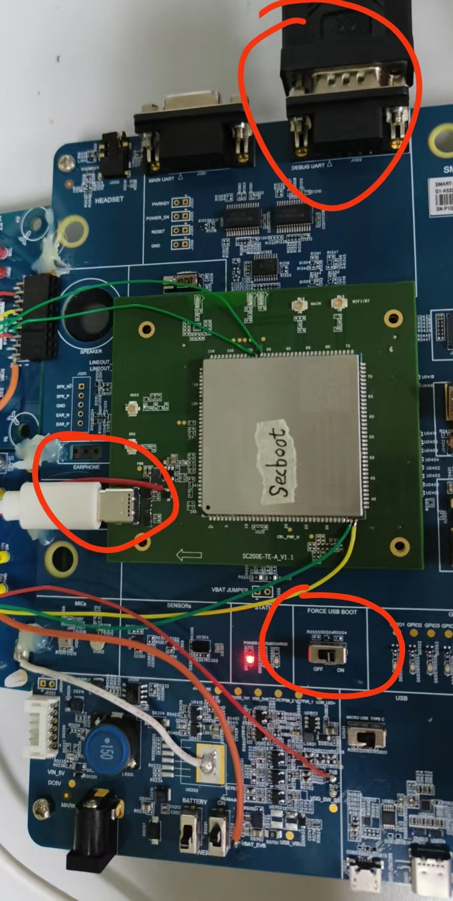
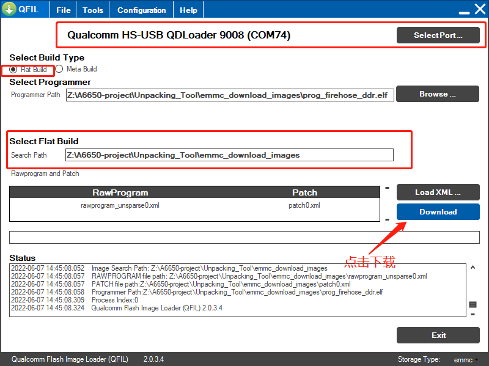
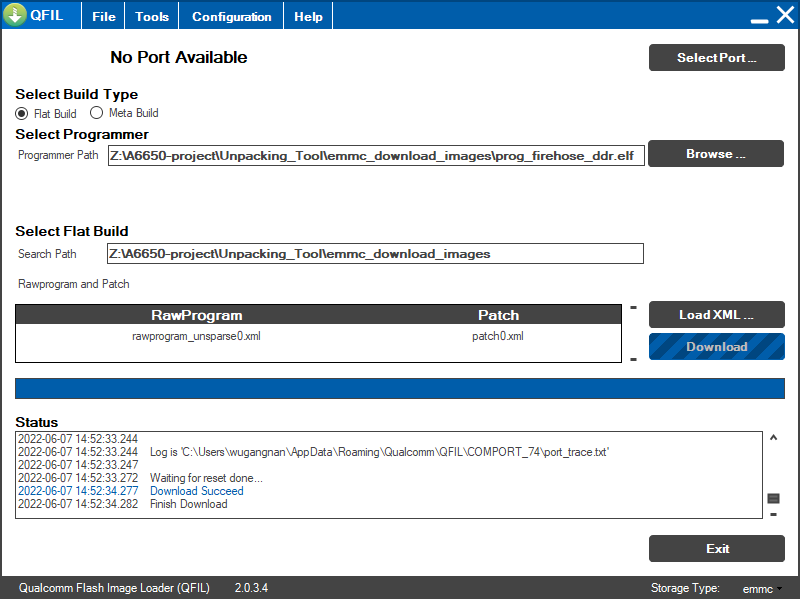

# 概述

简单记录下调试记录

# 重要路径记录

```log
分区表：
A6650_Unpacking_Tool\QCM2290.LA.2.0\common\config\emmc\partition_r_ext.xml
```

# xbl/abl如何打开log

debug等级定义如下：
```C++
//
// Declare bits for PcdDebugPrintErrorLevel and the ErrorLevel parameter of DebugPrint()
//
#define DEBUG_INIT      0x00000001  // Initialization
#define DEBUG_WARN      0x00000002  // Warnings
#define DEBUG_LOAD      0x00000004  // Load events
#define DEBUG_FS        0x00000008  // EFI File system
#define DEBUG_POOL      0x00000010  // Alloc & Free's
#define DEBUG_PAGE      0x00000020  // Alloc & Free's
#define DEBUG_INFO      0x00000040  // Informational debug messages
#define DEBUG_DISPATCH  0x00000080  // PEI/DXE/SMM Dispatchers
#define DEBUG_VARIABLE  0x00000100  // Variable
#define DEBUG_BM        0x00000400  // Boot Manager
#define DEBUG_BLKIO     0x00001000  // BlkIo Driver
#define DEBUG_NET       0x00004000  // SNI Driver
#define DEBUG_UNDI      0x00010000  // UNDI Driver
#define DEBUG_LOADFILE  0x00020000  // UNDI Driver
#define DEBUG_EVENT     0x00080000  // Event messages
#define DEBUG_GCD       0x00100000  // Global Coherency Database changes
#define DEBUG_CACHE     0x00200000  // Memory range cachability changes
#define DEBUG_VERBOSE   0x00400000  // Detailed debug messages that may significantly impact boot performance
#define DEBUG_ERROR     0x80000000  // Error
```

```diff
ABL:
--- a/UM.9.15/bootable/bootloader/edk2/QcomModulePkg/QcomModulePkg.dsc
+++ b/UM.9.15/bootable/bootloader/edk2/QcomModulePkg/QcomModulePkg.dsc
@@ -160,7 +160,7 @@
 # ASSERT_DEADLOOP_ENABLED    0x20

   gEfiMdePkgTokenSpaceGuid.PcdDebugPropertyMask|0x2f
-  gEfiMdePkgTokenSpaceGuid.PcdDebugPrintErrorLevel|0x80000042
+  gEfiMdePkgTokenSpaceGuid.PcdDebugPrintErrorLevel|0x80400042  //open DEBUG_VERBOSE
   gEfiMdePkgTokenSpaceGuid.PcdReportStatusCodePropertyMask|0x06

 ################################################################################

XBL:
--- a/A6650_Unpacking_Tool/BOOT.XF.4.1/boot_images/QcomPkg/SocPkg/AgattiPkg/LAA/Core.dsc
+++ b/A6650_Unpacking_Tool/BOOT.XF.4.1/boot_images/QcomPkg/SocPkg/AgattiPkg/LAA/Core.dsc
@@ -554,7 +554,7 @@
   #   DEBUG_ERROR     0x80000000  // Error
 !if $(PRODMODE) == "PRODMODE"
   # Only enable Errors and Boot Manager if Production Mode Flag is set
-  gEfiMdePkgTokenSpaceGuid.PcdDebugPrintErrorLevel|0x80000400
+  gEfiMdePkgTokenSpaceGuid.PcdDebugPrintErrorLevel|0x80400400
   gEfiMdePkgTokenSpaceGuid.PcdFixedDebugPrintErrorLevel|0x80000400
 !else
   gEfiMdePkgTokenSpaceGuid.PcdDebugPrintErrorLevel|0x800fee4f
```

# EVB如何使用QFIL下载

* 1.开发板将`FORCE USB BOOT`拨到`ON`档位。
* 2.接入type-c口至红色框位置。



* 3.工具如下配置，主要是选择分区表`rawprogram_unsparse0.xml`配置文件。



* 4.下载完成。



# XBL编译

* 编译XBL命令:./build_qcm2290.sh boot ddr4
* 编译文件清除：./build_qcm2290.sh boot ddr4 clr

* 镜像生成目录：

```
A6650_Unpacking_Tool\BOOT.XF.4.1\boot_images\QcomPkg\SocPkg\AgattiPkg\Bin\LAA\RELEASE\xbl.elf
```

# 解锁烧录

* 解锁步骤：
```
1.开发者选项打开oem unlock开关。
2.adb reboot bootloader
3.fastboot flashing unlock
4.使用音量+power键选择确定解锁。
5.adb root && adb disable-verity
```

* 烧录步骤：
```
1.adb reboot bootloader
2.fastboot flash boot_a boot.img
3.fastboot reboot
```

# i2ctool使用

```log
查找设备：
1|bengal:/sys/class/power_supply/mp2721_charger # tect -y 0
     0  1  2  3  4  5  6  7  8  9  a  b  c  d  e  f
00:          -- -- -- -- -- -- -- -- -- -- -- -- --
10: -- -- -- -- -- -- -- -- -- -- -- -- -- -- -- --
20: -- -- -- -- -- -- -- -- -- -- -- -- -- -- -- --
30: -- -- -- -- -- -- -- -- -- -- -- -- -- -- -- UU
40: -- -- -- -- -- -- -- -- -- -- -- -- -- -- UU --
50: -- -- -- -- -- -- -- -- -- -- -- -- -- -- -- --
60: -- -- -- -- -- -- -- -- -- -- -- -- -- -- -- --
70: -- -- -- -- -- -- -- --

查看0x3f设备寄存器值：
bengal:/sys/class/power_supply/mp2721_charger # i2cdump -f -y 0 0x3f
     0  1  2  3  4  5  6  7  8  9  a  b  c  d  e  f    0123456789abcdef
00: 0b 13 65 70 b8 e0 2a 0b 2f 53 23 10 51 60 99 00    ??ep??*?/S#?Q`?.
10: 44 80 74 a0 00 00 40 ff ff ff ff ff ff ff ff ff    D?t?..@?????????
20: ff ff ff ff ff ff ff ff ff ff ff ff ff ff ff ff    ????????????????
30: 00 bf 04 13 06 ff ff 00 40 00 c2 00 00 ff ff ff    .??????.@.?..???
40:i2cdump: i2c_read_byte: Transport endpoint is not connected

i2cset设置寄存器：
usage: i2cset [-fy] BUS CHIP ADDR VALUE... MODE

Write an i2c register. MODE is b for byte, w for 16-bit word, i for I2C block.

-f      Force access to busy devices
-y      Answer "yes" to confirmation prompts (for script use)

设置0x3f设备0x09寄存器值为0x50:
i2cset -f -y 0 0x3f 0x09 0x50 b

获取：
bengal:/sys/class/power_supply/mp2721_charger # i2cget -f -y 0 0x3f 0x09
0x50
```

# 驱动中添加专属打印

```C++
//#define CHARGER_DBG
#ifdef CHARGER_DBG
#define PAX_CHARGER_DBG(fmt, arg...) printk(KERN_ERR "[pax_charger] %s: " fmt "\n" , __func__, ## arg)
#else
#define PAX_CHARGER_DBG(fmt, arg...)
#endif
#define PAX_CHARGER_ERR(fmt, arg...) printk(KERN_ERR "[pax_charger] %s: " fmt "\n" , __func__ , ## arg)
#define PAX_CHARGER_WARN(fmt, arg...) printk(KERN_WARNING "[pax_charger] %s: " fmt "\n" , __func__ , ## arg)

或者：
/* default log level */
#define CHR_LOG_LEVEL 3

#define CHRLOG_ERROR_LEVEL	1
#define CHRLOG_INFO_LEVEL	2
#define CHRLOG_DEBUG_LEVEL	3

int chr_get_debug_level(void)
{
  u8 log_level;

  log_level = CHR_LOG_LEVEL;

  return log_level;
}

#define chr_err(fmt, args...)					\
do {								\
	if (chr_get_debug_level() >= CHRLOG_ERROR_LEVEL) {	\
		pr_notice("PAX_CHG: "fmt, ##args);				\
	}							\
} while (0)

#define chr_info(fmt, args...)					\
do {								\
	if (chr_get_debug_level() >= CHRLOG_INFO_LEVEL) {	\
		pr_notice_ratelimited("PAX_CHG: "fmt, ##args);		\
	}							\
} while (0)

#define chr_debug(fmt, args...)					\
do {								\
	if (chr_get_debug_level() >= CHRLOG_DEBUG_LEVEL) {	\
		pr_notice("PAX_CHG: "fmt, ##args);				\
	}							\
} while (0)
```

# UEFI学习资料

* [UEFI学习——事件函数WaitForEvent和CreateEvent/CreateEventEx](https://blog.csdn.net/wlswls1711/article/details/119410569)
* [CSDN UEFI学习专栏](https://blog.csdn.net/sevensevensevenday/category_6781560.html)

# wakeup_source_register使用

```C++
wakeup_source_register(chip->dev, "husb311_irq_wake_lock");
改为：
wakeup_source_register(&tcpc->dev, "husb311_irq_wake_lock");
```

# 如何查看目前gpio配置

使用命令`cat /sys/kernel/debug/gpio`:
```log
A6650:/sys # cat ./kernel/debug/gpio
gpiochip1: GPIOs 1143-1152, parent: platform/1c40000.qcom,spmi:qcom,pm2250@0:pinctrl@c000, 1c40000.qcom,spmi:qcom,pm2250@0:pinctrl@c000:
 gpio1 : in   normal  vin-0 pull-down 10uA              push-pull  low  high    atest-1 dtest-0
 gpio2 : out  func1   vin-0 no pull                     push-pull  low  low     atest-1 dtest-0
 gpio3 : out  normal  vin-1 pull-down 10uA              push-pull  high low     atest-1 dtest-0
 gpio4 : out  normal  vin-1 pull-down 10uA              push-pull  high low     atest-1 dtest-0
 gpio5 : in   normal  vin-0 pull-down 10uA              push-pull  low  high    atest-1 dtest-0
 gpio6 : ---
 gpio7 : out  normal  vin-0 pull-down 10uA              push-pull  high high    atest-1 dtest-0
 gpio8 : in   normal  vin-0 pull-down 10uA              push-pull  low  high    atest-1 dtest-0
 gpio9 : out  normal  vin-0 no pull                     push-pull  high medium  atest-1 dtest-0
 gpio10: out  func1   vin-0 no pull                     push-pull  low  high    atest-1 dtest-0
gpiochip0: GPIOs 1153-1279, parent: platform/500000.pinctrl, 500000.pinctrl:
 gpio0   : in  high func1 2mA pull up
 gpio1   : in  high func1 2mA pull up
 gpio2   : in  high func0 2mA pull up
 gpio3   : in  high func0 2mA pull up
 gpio4   : in  low  func1 2mA pull down
 gpio5   : out low  func1 2mA pull down
 gpio6   : in  high func0 2mA no pull
 gpio7   : in  high func0 2mA no pull
 gpio8   : in  low  func0 2mA pull down
 gpio9   : in  low  func0 2mA pull down
 gpio10  : in  high func0 2mA pull up
 gpio11  : in  low  func0 2mA pull down
 gpio12  : out low  func1 2mA no pull
 gpio13  : in  high func1 2mA no pull
 gpio14  : in  high func0 2mA pull down
 gpio15  : in  low  func0 2mA pull down
 gpio16  : in  low  func0 2mA pull down
 gpio17  : in  low  func0 2mA pull down
 gpio18  : out low  func0 2mA pull down
 gpio19  : out low  func0 2mA pull down
 gpio20  : in  low  func1 2mA pull down
 gpio21  : in  low  func1 2mA pull down
 gpio22  : in  high func1 2mA pull down
 gpio23  : in  high func1 2mA pull down
 gpio24  : out low  func0 2mA pull down
 gpio25  : out low  func0 2mA no pull
 gpio26  : out low  func0 2mA no pull
 gpio27  : in  low  func1 2mA pull down
 gpio28  : in  low  func0 2mA pull down
 gpio29  : in  high func1 2mA pull down
 gpio30  : in  high func1 2mA pull down
 gpio31  : in  low  func0 2mA pull down
 gpio32  : out low  func0 8mA pull up
 gpio33  : in  low  func0 2mA pull down
 gpio34  : in  low  func0 2mA no pull
 gpio35  : in  high func0 2mA no pull
 gpio36  : in  low  func0 2mA no pull
 gpio37  : in  low  func0 2mA pull down
 gpio38  : in  low  func0 2mA pull down
 gpio39  : in  low  func0 2mA pull down
 gpio40  : in  low  func0 2mA pull down
 gpio41  : in  low  func0 2mA pull down
 gpio42  : in  low  func0 2mA pull down
 gpio43  : in  low  func0 2mA pull down
 gpio44  : in  low  func0 2mA pull down
 gpio45  : in  low  func0 2mA pull down
 gpio46  : in  low  func0 2mA pull down
 gpio47  : in  low  func0 2mA pull down
 gpio48  : in  low  func0 2mA pull down
 gpio49  : in  low  func0 2mA pull down
 gpio50  : in  low  func0 2mA pull down
 gpio51  : in  low  func0 2mA pull down
 gpio52  : in  low  func0 2mA pull down
 gpio53  : in  low  func0 2mA pull down
 gpio54  : in  low  func0 2mA pull down
 gpio55  : in  high func0 2mA pull up
 gpio56  : out low  func0 2mA pull down
 gpio57  : in  low  func0 2mA pull down
 gpio58  : in  high func0 2mA pull down
 gpio59  : in  low  func0 2mA pull down
```

# 修改kernel打印等级

可以使用`dmesg -n 8`将打印等级提升到8，默认是5。

手动切换adb：
setprop sys.usb.config diag,serial_cdev,rmnet,adb

# QTI LogKit抓取工具重启打不开

```log
08-11 23:09:33.101  6118  6118 D CompatibilityChangeReporter: Compat change id reported: 171228096; UID 1000; state: ENABLED
08-11 23:09:33.114  6118  6118 I qti-logkit.cActivity: Storage card not initialized yet so can't update
08-11 23:09:33.115  6118  6118 I qti-logkit.cActivity: Storage card details not available
08-11 23:09:33.145  6118  6118 I qti-logkit.cService: onCreate service
08-11 23:09:33.170  6118  6118 I qti-logkit.cService: Logkit is not enabled please check documentation
08-11 23:09:33.170  6118  6118 I qti-logkit.cService: onDestroy service
08-11 23:09:33.173  6118  6118 I Process : Sending signal. PID: 6118 SIG: 9
08-11 23:09:33.203   544   544 I Zygote  : Process 6118 exited due to signal 9 (Killed)
```

log导出方式，`Session_11-02_1022-1667398953928`根据日期来的:
```
adb pull /storage/self/primary/Android/data/com.qualcomm.qti.logkit.lite/files/logdata/Session_11-02_1022-1667398953928 .
```

# Android用户空间的hvdcp（high voltage deticated charger port）

hvdcp是高通平台控制qc快充协议的应用程序，具体qc协议请参考：
* [BC1.2协议以及QC2.0/3.0快充协议学习笔记](https://blog.csdn.net/zzsddre/article/details/124420624)

如果不支持或者用不到，软件上关闭：
```diff
--- a/UM.9.15/vendor/qcom/proprietary/common/config/device-vendor-qssi.mk
+++ b/UM.9.15/vendor/qcom/proprietary/common/config/device-vendor-qssi.mk
@@ -4918,7 +4918,9 @@ PRODUCT_PACKAGES += $(FTM)
 PRODUCT_PACKAGES += $(GPQESE)
 PRODUCT_PACKAGES += $(GSMA_NFC)
 PRODUCT_PACKAGES += $(HBTP)
-PRODUCT_PACKAGES += $(HVDCP_OPTI)
+#[BUGFIX]-BEGIN by wugangnan@paxsz.com 2022-08-27,remove the qcom charger app
+#PRODUCT_PACKAGES += $(HVDCP_OPTI)
+#[BUGFIX]-END by wugangnan@paxsz.com 2022-08-27,remove the qcom charger app
 PRODUCT_PACKAGES += $(HY11_HY22_diff)
 PRODUCT_PACKAGES += $(BTSAR)

diff --git a/UM.9.15/vendor/qcom/proprietary/common/config/device-vendor.mk b/UM.9.15/vendor/qcom/proprietary/common/config/device-vendor.mk
index e8ad9285cfe..d9459e5d845 100755
--- a/UM.9.15/vendor/qcom/proprietary/common/config/device-vendor.mk
+++ b/UM.9.15/vendor/qcom/proprietary/common/config/device-vendor.mk
@@ -5783,9 +5783,11 @@ PRODUCT_PACKAGES += $(GPQESE)
 PRODUCT_PACKAGES += $(GSMA_NFC)
 PRODUCT_PACKAGES += $(HBTP)
 PRODUCT_PACKAGES += $(TS_FORWARD)
-ifneq ($(TARGET_BOARD_AUTO),true)
-PRODUCT_PACKAGES += $(HVDCP_OPTI)
-endif
+#[BUGFIX]-BEGIN by wugangnan@paxsz.com 2022-08-27,remove the qcom charger app
+#ifneq ($(TARGET_BOARD_AUTO),true)
+#PRODUCT_PACKAGES += $(HVDCP_OPTI)
+#endif
+#[BUGFIX]-END by wugangnan@paxsz.com 2022-08-27,remove the qcom charger app
 PRODUCT_PACKAGES += $(HY11_HY22_diff)
 PRODUCT_PACKAGES += $(BTSAR)
```

# pmic vote机制学习

* [pmic voter](https://huaqianlee.github.io/2019/05/15/Android/pmic-voter/)

# 随机GUID生成

* [Online GUID / UUID Generator](https://www.guidgenerator.com/online-guid-generator.aspx)
* [英文字母大小写转换](https://www.iamwawa.cn/daxiaoxie.html)

# 自定义QFile烧录镜像

在原生的rawprogram做减法，把不需要的分区删除即可；但要求一定要将gpt分区刷入，例如烧录xbl镜像：
```xml
<?xml version="1.0" ?>
<data>
  <!--NOTE: This is an ** Autogenerated file **-->
  <!--NOTE: Sector size is 512bytes-->
  <program SECTOR_SIZE_IN_BYTES="512" file_sector_offset="0" filename="xbl.elf" label="xbl_a" num_partition_sectors="7168" partofsingleimage="false" physical_partition_number="0" readbackverify="false" size_in_KB="3584.0" sparse="false" start_byte_hex="0xc000000" start_sector="393216" />
  <program SECTOR_SIZE_IN_BYTES="512" file_sector_offset="0" filename="xbl.elf" label="xbl_b" num_partition_sectors="7168" partofsingleimage="false" physical_partition_number="0" readbackverify="false" size_in_KB="3584.0" sparse="false" start_byte_hex="0xc380000" start_sector="400384" />
  <program SECTOR_SIZE_IN_BYTES="512" file_sector_offset="0" filename="xbl_config.elf" label="xbl_config_a" num_partition_sectors="256" partofsingleimage="false" physical_partition_number="0" readbackverify="false" size_in_KB="128.0" sparse="false" start_byte_hex="0x10000000" start_sector="524288" />
  <program SECTOR_SIZE_IN_BYTES="512" file_sector_offset="0" filename="xbl_config.elf" label="xbl_config_b" num_partition_sectors="256" partofsingleimage="false" physical_partition_number="0" readbackverify="false" size_in_KB="128.0" sparse="false" start_byte_hex="0x10020000" start_sector="524544" />
  <program SECTOR_SIZE_IN_BYTES="512" file_sector_offset="0" filename="gpt_main0.bin" label="PrimaryGPT" num_partition_sectors="34" partofsingleimage="true" physical_partition_number="0" readbackverify="false" size_in_KB="17.0" sparse="false" start_byte_hex="0x0" start_sector="0" />
  <program SECTOR_SIZE_IN_BYTES="512" file_sector_offset="0" filename="gpt_backup0.bin" label="BackupGPT" num_partition_sectors="33" partofsingleimage="true" physical_partition_number="0" readbackverify="false" size_in_KB="16.5" sparse="false" start_byte_hex="(512*NUM_DISK_SECTORS)-16896." start_sector="NUM_DISK_SECTORS-33." />

</data>
```

# 各种命令

* fastboot进入下载模式:fastboot oem rebootedl

# 回读分区

1. 打开Qfil工具：


2. 选择要回读的分区：


# add2line使用方法

如下kernel panic：
```
[    8.684774] PAX_CHG: BMS charge start: 8
[    8.688755] PAX_CHG: BMS bms_dump: CHG [online: 0, type: 4, vol: 500000, cur: 2000000, time: 0], BAT [present: 1, status: 1, vol: 3803000, cur: 0, resistance: 0, temp: 320, soc: 33], OTHER [skin_temp: 0, chg_vote: 0x0, notify_code: 0x0],
[    8.695737] SELinux:  policy capability network_peer_controls=1
[    8.710235] bms_notify_call_chain
[    8.715938] SELinux:  policy capability open_perms=1
[    8.719249] Unable to handle kernel read from unreadable memory at virtual address 0000000000000000
[    8.724233] SELinux:  policy capability extended_socket_class=1
[    8.724237] SELinux:  policy capability always_check_network=0
[    8.733329] Mem abort info:
[    8.733333]   ESR = 0x86000005
[    8.739282] SELinux:  policy capability cgroup_seclabel=0
[    8.739285] SELinux:  policy capability nnp_nosuid_transition=1
[    8.745142]   Exception class = IABT (current EL), IL = 32 bits
[    8.768376]   SET = 0, FnV = 0
[    8.771448]   EA = 0, S1PTW = 0
[    8.774619] user pgtable: 4k pages, 39-bit VAs, pgdp = ffffffe95b7a8000
[    8.781286] [0000000000000000] pgd=0000000000000000, pud=0000000000000000
[    8.788119] Internal error: Oops: 86000005 [#1] PREEMPT SMP
[    8.793713] Modules linked in:
[    8.796787] Process kworker/1:0 (pid: 22, stack limit = 0xffffff8008208000)
[    8.803772] CPU: 1 PID: 22 Comm: kworker/1:0 Tainted: G        W         4.19.157 #57
[    8.811621] Hardware name: Qualcomm Technologies, Inc. Scuba IOT IDP (DT)
[    8.818435] Workqueue: events power_supply_changed_work
[    8.823684] pstate: 80400005 (Nzcv daif +PAN -UAO)
[    8.828495] pc :           (null)
[    8.831827] lr : blocking_notifier_call_chain+0x50/0x98
[    8.837072] sp : ffffff800820bc30
[    8.840397] x29: ffffff800820bc30 x28: ffffffe97f69d330
[    8.845729] x27: ffffff9a80b5c018 x26: 000000007f6a1a05
[    8.851060] x25: 0000000000000000 x24: 00000000ffffffff
[    8.856390] x23: ffffffe95c3053d8 x22: ffffff9a80fc11d8
[    8.861721] x21: 0000000040046201 x20: ffffff800820bca4
[    8.867053] x19: ffffff9a80fc3468 x18: 0000000000000028
[    8.872384] x17: ffffff9a811d7000 x16: 000000000000003a
[    8.877714] x15: ffffff9a7ffeda68 x14: 0000000000003335
[    8.883045] x13: 0000000000000035 x12: 0000000000000000
[    8.888376] x11: 15e9204037011100 x10: 15e9204037011100
[    8.893707] x9 : 0000000000000000 x8 : 0000000000000000
[    8.899038] x7 : 635f796669746f6e x6 : ffffff9a811d9611
[    8.904369] x5 : 0000000000000000 x4 : 0000000000000004
[    8.909700] x3 : ffffff800820b928 x2 : ffffff800820bca4
[    8.915031] x1 : 0000000040046201 x0 : ffffffe95dc9f3d8
[    8.920363] Call trace:
[    8.922831]            (null)
[    8.925820]  bms_notify_call_chain+0x3c/0x48
[    8.930112]  pax_bms_external_power_changed+0x10c/0x138
[    8.935351]  __power_supply_changed_work+0xbc/0xd8
[    8.940163]  class_for_each_device+0x80/0xf8
[    8.944455]  power_supply_changed_work+0x68/0xf0
[    8.949088]  process_one_work+0x278/0x458
[    8.953116]  worker_thread+0x26c/0x4c0
[    8.956887]  kthread+0x13c/0x150
[    8.960131]  ret_from_fork+0x10/0x1c
[    8.963729] Code: bad PC value
[    8.966801] ---[ end trace d0d3606b0e7fa7bf ]---
[    8.971585] kworker/1:0 (22) used greatest stack depth: 12096 bytes left
```

* 使用如下命令解析sp指针位置：
`./prebuilts/gcc/linux-x86/aarch64/aarch64-linux-android-4.9/bin/aarch64-linux-android-addr2line -f -e out/target/product/bengal/obj/KERNEL_OBJ/vmlinux ffffff80082d3c30`
* 打印：
```
mandatory_lock
/home/wugn/A6650-project/UM.9.15/kernel/msm-4.19/include/linux/fs.h:2388
```