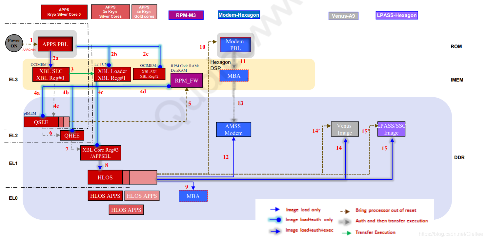
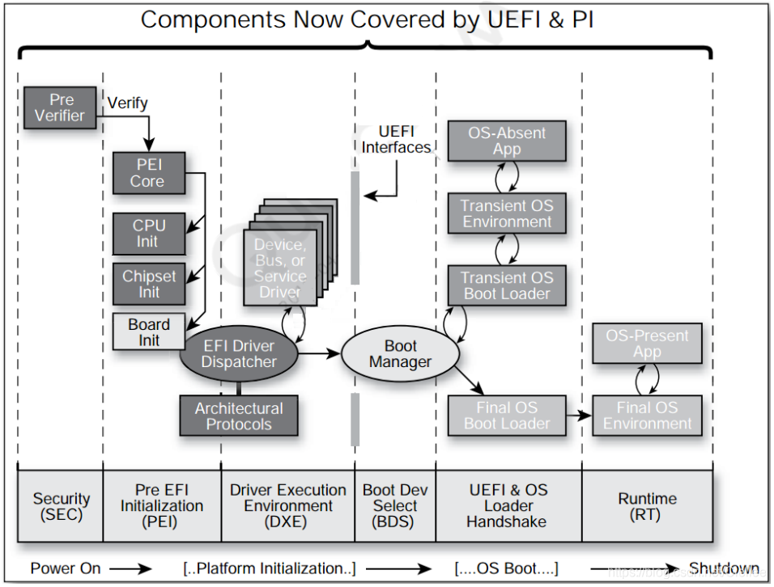
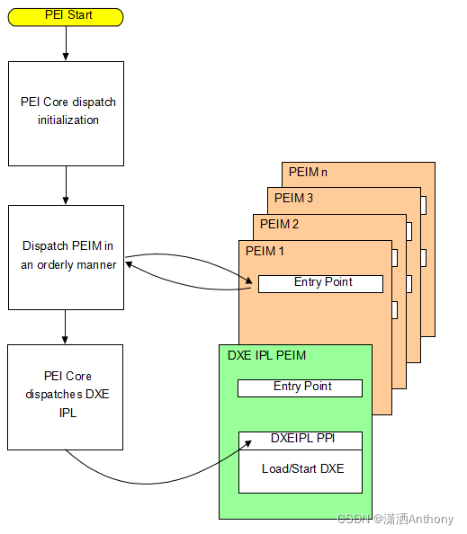
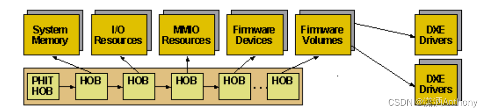

# 概述

之前学习的lk阶段点亮LCD的流程算是比较经典，但是高通已经推出了很多种基于UEFI方案的启动架构。所以需要对这块比较新的技术进行学习。在学习之前，有必要了解一下高通UEFI启动流程。

# refer

* [Android XBL开机流程](https://blog.csdn.net/ciellee/category_10787948.html)
* [高通Android UEFI XBL 代码流程分析](https://www.cnblogs.com/schips/p/qualcomm_uefi_boot_sequence.html)
* [UEFI原理与编程实践--UEFI系统的启动过程](https://blog.csdn.net/u011397314/article/details/121515314)

Core.fdf:UEFI的配置文件

# 打印

```
Active Platform          = /home/wugn/A6650-project/Unpacking_Tool/BOOT.XF.4.1/boot_images/QcomPkg/SocPkg/AgattiPkg/LAA/Core.dsc
Flash Image Definition   = /home/wugn/A6650-project/Unpacking_Tool/BOOT.XF.4.1/boot_images/QcomPkg/SocPkg/AgattiPkg/LAA/Core.fdf
```

# 总览
先来看下高通SDM660芯片冷启动的流程。可以看出，在设备上电后，先跑的是 APPS PBL，然后SBL1 ，接着运行XBL SEC、XBL Loader，通过Loader引出XBL CORE APPSBL，最后进入HLOS。



我们来看下这几个涉及的模块大概功能：

## 1、Application primary boot loader (APPS PBL)

PBL 启动时，CPU只开启了第一个核心 CPU Core 0，运行固件在ROM中，这部分是高通写死在芯片中的固件，外部开发人员是无法修改这部份的。

主要功能为：
* （1）系统安全环境的初始化，以确保后续的XBL中的APPS 能够正常运行。
* （2）根据boot gpio的配置选择从什么设备启动操作系统（如 Nand，USB等）。
* （3）通过检测GPIO判断是否进入Emergency Download mode，用户可以通过FILE来下载完整的系统镜像。
* （4）通过L2 TCM来加载XBL1 ELF，OCIMEM 和 RPM CodeRAM 代码。

## 2、Extensible boot loader (XBL)

从XBL开始，跑的就是我们编译下载进eMMC/UFS的系统镜像了，在XBL中主要是初始化相关的硬件环境，及代码安全环境。

* （1）初始化 Buses、DDR、Clocks、CDT，启动QSEE，QHEE,RPM_FW, XBL core images。
* （2）使能memory dump through USB and Sahara（系统死机时memory dump），看门狗，RAM dump to SD support等功能。
* （3）初始化 USB驱动，USB充电功能，温升检测，PMIC驱动初始化，和 DDR training模块。

## 3、XBL core (UEFI or LK，ABL)

XBL core，就是之前的bootloader，主要功能就是初始化display驱动，提供fastboot功能，引导进入HLOS kernel操作系统。

> 注意，在ABL中，同样也只有CPU Core0在工作，其他的CPU核以是在进入HLOS Kernel后才开始初始化启用的。

本文中，我们重点关注的是Extensible boot loader (XBL)，主要来学学UEFI XBL架构，及UEFI XBL代码流程。

# 一、UEFI XBL

代码目录分析
`UEFI XBL代码路径位于：BOOT.XF.1.4\boot_images\`:

```C++
# BOOT.XF.1.4\boot_images

ArmPkg					----> ARM 架构相关的Protocols
ArmPlatformPkg			----> ARM 开发板相关的UEFI代码
BaseTools				----> 编译EDK和EDK2相关的工具,如
EmbeddedPkg				----> 
FatPkg
IntelFrameworkModulePkg
IntelFrameworkPkg
MdeModulePkg
MdePkg
QcomPkg					----> 高通定制的相关pkg，如display和usb充电都在里面
ShellPkg				----> UEFI shell 环境
```

# UEFI代码运行流程

从图中可以看出，UEFI代码运行流程为：

SEC(安全验证)--->PEI(EFI前期初始化)--->DXE(驱动执行环境)--->BDS(启动设备选择)--->UEFI Loader(操作系统加载前期)--->RT(Run Time)。

接下来，我们根据这个流程来分析下UEFI代码。



看图粗略说一下：

## SEC:

安全验证阶段，这个阶段，需要用Assembly做一些 C 无法处理的工作，C语言无法处理CPU的特殊寄存器。让CPU进入Protected Mode(Flat Mode)的环境，会使用到CPU内部的临时ram，其实也就是缓存，这个阶段主要还是使用的汇编，也就是说为后面的阶段建立一个C语言和硬件通信的编译环境，最后将控制权交给PEI Phase。

## PEI：

很基本的Chipset 初始化、 Memory Sizing、 BIOS Recovery、 ACPI S3 Resume 、切换Stack to Memory、启动DxeIpl。这个阶段就是开始一些CPU、主板、芯片的初始化了，也就是EFI前期初始化，这个阶段后期才是内存的初始化，知道内存初始化的地方可以便于debug。PEI阶段对系统的初始化主要是PEIM完成的，PEIM之间的通信又是通过PPI完成，进入DXE阶段需要HOB列表。



## HOB : Hand off Block

有些 information 要从 PEI Phase 传到 DXE Phase 组成 ，每一个Block有自己的GUID & Structure 。HOB的Block List是动态的，没有顺序要求。



## DXE：

遍历固件中的所有的DXE driver，也就是驱动执行环境，当然了，DXE阶段也有DXE派遣器，通信通过protocol，也就是协议。当所有的 dxe driver加载完成后，系统完成初始化，DXE通过EFI_BDS_ARCH_PROTOCOL找到BDS并调用BDS的入口函数，从而进入BDS阶段，从本质上讲，BDS是一种特殊的DXE阶段的应用程序。

## BDS：

BDS：Boot Device Selection，启动必要的驱动程序，启动设备选择。BDS策略通过全局NVRAM变量配置，通过修改变量值修改启动顺序（bootorder），这个修改启动顺序在工厂需要经常用到的，工厂都是批量生产，因此需要写个工具给产线TE，批量修改启动顺序。

## TSL:

操作系统加载器执行的第一阶段，在这一阶段OS Loader作为一个UEFI应用程序运行，系统资源仍然由UEFI内核控制。

## RT:

Run Time，系统控制权从UEFI内核转交到OS Loader手中。

上述是很久之前写的，直接copy了，现在回过头来看，其实这样写是很笼统的，这次，咱们就追踪一下代码，看它到底是怎么跑的吧：

# SEC (安全验证)代码分析

SEC的汇编代码入口位于：

* `BOOT.XF.1.4\boot_images\QcomPkg\XBLCore\AARCH64\ModuleEntryPoint.masm`的`_ModuleEntryPoint`中

入口汇编代码分析

分析看看`ModuleEntryPoint.masm`这个文件:

该汇编代码中，主要工作为：

* 1、关闭所有中断
* 2、关闭MMU和Caches
* 3、关闭TLB缓存表
* 4、获得当前运行的安全环境：EL1、EL2、EL3
* 5、初始化ELX 安全环境
* 6、使能 Cache
* 7、初始化栈
* 8、调用 CEntryPoint，传参 _StackBase（0x80C00000）、_StackSize（0x00040000）

```C++
#include <AsmMacroIoLibV8.h>
#include <Base.h>
#include <Library/PcdLib.h>
#include <AutoGen.h>

    AREA    |.text|,ALIGN=8,CODE,READONLY
        
# BOOT.XF.1.4\boot_images\QcomPkg\XBLCore\AARCH64\ModuleEntryPoint.masm
IMPORT CEntryPoint				// 导入CEntryPoint()函数
EXPORT _ModuleEntryPoint		// 输出 _ModuleEntryPoint段
IMPORT InitStackCanary			// 导入InitStackCanary()函数 初始化栈

IMPORT  ArmDisableInterrupts	// 导入ArmDisableInterrupts()函数 禁用arm 中断
IMPORT  ArmDisableCachesAndMmu  // 导入ArmDisableCachesAndMmu()函数 禁用cache, mmu
IMPORT  ArmWriteCptr			
IMPORT  ArmWriteHcr
IMPORT  ArmWriteVBar

EXPORT _StackBase 				// 输出栈起始地址，起始地址为：0x80C00000
EXPORT _StackSize				// 输出栈大小，栈大小为 0x00040000，256k
EXPORT CNTFRQ 					// 输出时钟频率，19200000

//定义于： BOOT.XF.1.4\boot_images\QcomPkg\Sdm660Pkg\Common\Sdm660Pkg_Loader.dsc
_StackBase
  dcq FixedPcdGet64(PcdPrePiStackBase)
        
_StackSize
  dcq FixedPcdGet64(PcdPrePiStackSize)
        
CNTFRQ
  dcq FixedPcdGet32(PcdArmArchTimerFreqInHz)

_ModuleEntryPoint
  mov x0, #0
  // 1、关闭所有中断	 /* First ensure all interrupts are disabled */
  bl ArmDisableInterrupts

  // 2、关闭MMU和Caches	 /* Ensure that the MMU and caches are off */
  bl ArmDisableCachesAndMmu
  
  // 3、关闭TLB缓存表	 /* Invalidate Instruction Cache and TLB */ 
  bl ArmInvalidateInstructionCache
  bl ArmInvalidateTlb
  // 4、获得当前运行的安全环境：EL1、EL2、EL3
  /* Get current EL in x0 */
  EL1_OR_EL2_OR_EL3(x0)
  // CurrentEL : 0xC = EL3; 8 = EL2; 4 = EL1
  // This only selects between EL1 and EL2 and EL3, else we die.
  // Provide the Macro with a safe temp xreg to use.
        //mrs    x0, CurrentEL
        cmp    x0, #0xC			// 比较 x0寄存器是否为 0xc，如果是跳转到 标签3
        beq   %F3			
        cmp    x0, #0x8			// 比较 x0寄存器是否为 0x8，如果是跳转到 标签2
        beq   %F2
        cmp    x0, #0x4			// 比较 x0寄存器是否为 0x4
        bne   、                   // We should never get here
// EL1 code starts here

1  beq _Start
2  beq _Start					// 如果当前是 EL2，直接跳转到_Start
  /* Do not trap any access to Floating Point and Advanced SIMD in EL3、*/
  /* Note this works only in EL3, x0 has current EL mode */
3  mov x0, #0
  bl ArmWriteCptr				// 如果当前是 EL3，直接跳转到ArmWriteCptr 
  // msr cptr_el3, x0  // EL3 Coprocessor Trap Reg (CPTR)
  
// 5、初始化ELX 安全环境
_SetupELx
  mov x0, #0x30           /* RES1 */				// x0 = 0x30
  orr x0, x0, #(1 << 0)   /* Non-secure bit */		// 使能第0位为1
  orr x0, x0, #(1 << 8)   /* HVC enable */			// 使能第8位为1
  orr x0, x0, #(1 << 10)  /* 64-bit EL2 */			// 使能第10位为1
  msr scr_el3, x0									// 配置通用寄存器 scr_el3 为-
  msr cptr_el3, xzr       /* Disable copro、traps to EL3 */
  ldr x0, CNTFRQ
  //msr cntfrq_el0, x0
  msr sctlr_el2, xzr
  .......省略一部分代码.......
// 6、使能 Cache
_EnableCache
#ifdef PRE_SIL
  LoadConstantToReg (FixedPcdGet32(PcdSkipEarlyCacheMaint), x0)
  cmn x0, #0
  b.ne _PrepareArguments
#endif
  bl ArmInvalidateDataCache
  bl ArmEnableInstructionCache
  bl ArmEnableDataCache
// 7、初始化栈
_PrepareArguments
  /* Initialize Stack Canary */
  bl InitStackCanary
// 8、调用 CEntryPoint，传参 _StackBase（0x80C00000）、_StackSize（0x00040000）
  /* x0 = _StackBase and x1 = _StackSize */
  ldr x0, _StackBase     /* Stack base arg0 */
  ldr x1, _StackSize     /* Stack size arg1 */
  bl CEntryPoint
```

初始化C运行环境
前面汇编代码中主要目的是初始化C运行环境，初始化栈，以便可以调C代码运行。

SEC的C代码入口位于：`BOOT.XF.1.4\boot_images\QcomPkg\XBLCore\Sec.c`的 CEntryPoint 中

```C++
/**  Entry point
  @param  StackBase       pointer to the stack base
  @param  StackSize       stack size
**/
VOID CEntryPoint (IN  VOID  *StackBase,IN  UINTN StackSize){
  UefiDebugModeEntry();		// 如果支待jtag调试的话，此处会循环等待，直到debug指向的地址匹配
  TargetEarlyInit()
  Main (StackBase, StackSize);	//进入main函数，传参 _StackBase（0x80C00000）、_StackSize（0x00040000）
}
```

接下来，我们进入 main函数分析下：
```C++
VOID Main (IN  VOID  *StackBase, IN  UINTN StackSize){
  // 1、获得fdf文件所在的地址，fdf可以说是UEFI的配置文件，
  // 在fdf文件中包含所有的inf文件所在路径，及相关的bmp图片资源路径，以及相关的cfg配置文件路径。
  // ## FD Base offset (refer to .fdf for FD size)
  UefiFdBase = FixedPcdGet64(PcdEmbeddedFdBaseAddress);		// 0x80200000
  
  SecHeapMemBase = UefiFdBase + SEC_HEAP_MEM_OFFSET;		// 0x300000
  HobStackSize = StackSize;
  // 2、初始化栈
  InitStackCanary();
  // 3、启动定时器周期计数
  StartCyclCounter ();
  // 4、初始化UART，主要是serial port端口初始化，及 serial buffer初始化  /* Start UART debug output */
  UartInit();
  // 5、打印"UEFI Start" 串口信息
  PrintUefiStartInfo();
  // 6、初始化CPU异常处理入口
  InitializeCpuExceptionHandlers (NULL);
  // 7、打印从开机到现在的时间差
  PrintTimerDelta();
  // 8、如果支持的话，启动程序流预测 /* Enable program flow prediction, if supported */
  ArmEnableBranchPrediction ();
  // 9、/* Initialize Info Block */
  UefiInfoBlkPtr = InitInfoBlock (UefiFdBase + UEFI_INFO_BLK_OFFSET);
  UefiInfoBlkPtr->StackBase = StackBase;
  UefiInfoBlkPtr->StackSize = StackSize;
  // 10、初始化 RAM 分区表，起始地址0x80000000，内存大小512M，检查地址是否非法，是否可正常访问
  InitRamPartitionTableLib ();
  ValidateFdRegion(UefiFdBase);

  //TODO: Move this to ACPI-specific location
  InitializeFBPT();
  
  /* Get nibble from random value to adjust SEC heap */
  SecHeapAslrVal = AslrAdjustRNGVal(ASLR_HEAP_RNG_BITS);
  // 11、初始化hoblist，有关hob可参考：https://blog.csdn.net/z190814412/article/details/85330324
  InitHobList(SecHeapMemBase,SEC_HEAP_MEM_SIZE - (SecHeapAslrVal*ASLR_HEAP_ALIGN), UefiInfoBlkPtr);
  /* Add the FVs to the hob list */
  BuildFvHob (PcdGet64(PcdFlashFvMainBase), PcdGet64(PcdFlashFvMainSize));
  // 12、打印RAM 分区信息
  /* Should be done after we have setup HOB for memory allocation  */
  PrintRamPartitions ();
  // 13、初始化cache
  Status = EarlyCacheInit (UefiFdBase, UEFI_FD_SIZE);
  
  // 14、加载并解析 uefiplat.cfg平台配置文件，/* Load and Parse platform cfg file, cache re-initialized per cfg file */
  Status = LoadAndParsePlatformCfg();

  // 15、更新系统内存区相关信息 /* Add information from all other memory banks */
  Status = UpdateSystemMemoryRegions();
  Status = InitCacheWithMemoryRegions();

  // 16、初始化所有的共享库 /* All shared lib related initialization */
  //初始化的lib源码位于 BOOT.XF.1.4/QcomPkg/SocPkg/AgattiPkg/Library
  //配置文件位于 BOOT.XF.4.1/boot_images/QcomPkg/SocPkg/AgattiPkg/LAA/Core.dsc
  Status = InitSharedLibs();
  InitDbiDump();
  
  // 17、获得DXE Heap堆内存信息，/* Look for "DXE Heap" memory region in config file */
  Status = GetMemRegionInfoByName("DXE Heap", &DxeHeapMemInfo);
  /* Get nibble from random value to adjust DXE heap */
  DxeHeapAslrVal = AslrAdjustRNGVal(ASLR_HEAP_RNG_BITS);

  /* Re-initialize HOB to point to the DXE Heap in CFG */
  ReInitHobList(DxeHeapMemInfo.MemBase,
                DxeHeapMemInfo.MemSize - (DxeHeapAslrVal*ASLR_HEAP_ALIGN),
                UefiInfoBlkPtr);
  // 18、初始化分页池缓存区
  /* Now we have access to bigger pool, move pre-pi memory allocation pool to it */
  ReInitPagePoolBuffer ();
  // 19、创建Stack、CPU Hob信息
  BuildStackHob ((EFI_PHYSICAL_ADDRESS)StackBase, HobStackSize);
  BuildCpuHob (PcdGet8 (PcdPrePiCpuMemorySize), PcdGet8 (PcdPrePiCpuIoSize));
  // 20、Display 早期初始化
  DisplayEarlyInfo();

  AddMemRegionHobs ();

  /* Start perf here, after timer init, start at current tick value */
   // 21. 开启耗费的时间统计，用于计算性能 /* Start perf here, after timer init, start at current tick value */
  InitPerf();

  /* SEC phase needs to run library constructors by hand */
  ExtractGuidedSectionLibConstructor ();
  LzmaDecompressLibConstructor ();
  ZlibDecompressLibConstructor ();

  /* Build HOBs to pass up our Version of stuff the DXE Core needs to save space */
  BuildPeCoffLoaderHob ();
  BuildExtractSectionHob (
    &gLzmaCustomDecompressGuid,
    LzmaGuidedSectionGetInfo,
    LzmaGuidedSectionExtraction
    );

  BuildExtractSectionHob (
    &gZlibDecompressGuid,
    ZlibGuidedSectionGetInfo,
    ZlibGuidedSectionDecompress
    );
  /* Check PRODMODE flag */
  ProdmodeInfo = PRODMODE_ENABLED;
  /* Build HOB to pass up prodmode info for security applications */
  BuildGuidDataHob (&gQcomProdmodeInfoGuid, &ProdmodeInfo, sizeof(BOOLEAN));
  UefiStartTime = ConvertTimerCountms(gUEFIStartCounter);
  BuildGuidDataHob (&gEfiStartTimeHobGuid, &UefiStartTime, sizeof(UINT32));


  /* Assume the FV that contains the SEC (our code) also contains a compressed FV */
  DecompressFirstFv ();

  /* Any non-critical initialization */
  TargetLateInit();

  /* Build memory allocation HOB for FV2 type
     Need to remove for decompressed image */
  BuildMemHobForFv(EFI_HOB_TYPE_FV2);

  /* Load the DXE Core and transfer control to it */
   // 22. 加载且将CPU交给 DXE Core。
  LoadDxeCoreFromFv (NULL, 0);

  /* DXE Core should always load and never return */
  ASSERT (FALSE);
  CpuDeadLoop();
}
```

* 1. 获得fdf文件所在的地址，在fdf文件中包含所有的inf文件所在路径，及相关的bmp图片资源路径，以及相关的cfg配置文件路径。fdf可以说是UEFI的配置文件。
* 2. 初始化栈
* 3. 启动定时器周期计数
* 4. 初始化UART，主要是serial port端口初始化，及 serial buffer初始化
* 5. 打印"UEFI Start" 串口信息
* 6. 初始化CPU异常处理入口
* 7. 打印从开机到现在的时间差
* 8. 如果支持的话，启动程序流预测 /* Enable program flow prediction, if supported */
* 9. Initialize Info Block
* 10. 初始化 RAM 分区表，起始地址0x80000000，内存大小512M，检查地址是否非法，是否可正常访问
* 11. 初始化hoblist，有关hob可参考：https://blog.csdn.net/z190814412/article/details/85330324
* 12. 打印RAM 分区信息
* 13. 初始化cache
* 14. 加载并解析 uefiplat.cfg平台配置文件
* 15. 更新系统内存区相关信息 /* Add information from all other memory banks */
* 16. 初始化所有的共享库 /* All shared lib related initialization */
> 初始化的lib源码位于 BOOT.XF.1.4/QcomPkg/SocPkg/AgattiPkg/Library
> 配置文件位于 BOOT.XF.4.1/boot_images/QcomPkg/SocPkg/AgattiPkg/LAA/Core.dsc
* 17. 获得DXE Heap堆内存信息，/* Look for “DXE Heap” memory region in config file */
* 18. 初始化分页池缓存区
* 19. 创建Stack、CPU Hob信息
* 20. Display 早期初始化
* 21. 开启耗费的时间统计，用于计算性能
* 22. 加载且将CPU交给 DXE Core。

## LoadAndParsePlatformCfg() 加载并解析 uefiplat.cfg平台配置文件

主要工作流程如下：

1. 初始化相关全局变量
2. 加载并解析 uefiplat.cfg 配置文件 #define UEFIPLATCFG_FILE "uefiplat.cfg"
3. 文件内容保存在 CfgBuffer 中，解析器描述符保存在MemParserDesc 中
4. 在cfg文件中包含了内存相关的信息及系统相关的配置，QcomPkg/SocPkg/AgattiPkg/LAA/uefiplat.cfg
5. 解析 uefiplat.cfg 中的 [Config] 区域
6. 解析 uefiplat.cfg 中的 [MemoryMap] 区域
7. 解析 uefiplat.cfg 中的 [RegisterMap] 区域，内容保存在mMemRegions中
8. 解析 uefiplat.cfg 中的 [ConfigParameters] 区域
9. 内容保存在 ConfigTable 中，ConfigTableEntryCount表示其内容的数量
10. 解析 uefiplat.cfg 中的 [ChipIDConfig] 区域
11. uefiplat.cfg配置了启动哪些默认app


```C++
QcomPkg/XBLCore/UefiPlatCfg.c:
EFI_STATUS EFIAPI LoadAndParsePlatformCfg ( VOID ){
  // 1. 初始化相关全局变量
  InitGlobals();
  // 2. 加载并解析 uefiplat.cfg 配置文件 #define UEFIPLATCFG_FILE "uefiplat.cfg"
  // 文件内容保存在 CfgBuffer 中，解析器描述符保存在MemParserDesc 中
  // 在cfg文件中包含了内存相关的信息及系统相关的配置，amss\BOOT.XF.1.4\boot_images\QcomPkg\Sdm660Pkg\LA\uefiplat.cfg
  Status = LoadFileFromFV0 (UEFIPLATCFG_FILE, &CfgBuffer, &FileSize);
  MemParserDesc = OpenParser (CfgBuffer, FileSize, NULL);

  /* Reset Global for RAM load */
  mMemRegions = NULL;
  mNumMemRegions = 0;
  // 3. 解析uefiplat.cfg 中的 [Config] 区域
  EnumKeyValues (MemParserDesc, (UINT8*)"Config",  ProcessConfigTokens);
  MemParserDesc = ReopenParser (MemParserDesc);
  // 4. 解析uefiplat.cfg 中的 [MemoryMap] 区域
  EnumCommaDelimSectionItems (MemParserDesc, (UINT8*)"MemoryMap",  ProcessMemoryMapTokens);
  GetCfgMemMapBounds();
  //UpdateSystemMemoryRegions();
  MemParserDesc = ReopenParser (MemParserDesc);
  // 5. 解析uefiplat.cfg 中的 [RegisterMap] 区域，内容保存在mMemRegions中
  EnumCommaDelimSectionItems (MemParserDesc, (UINT8*)"RegisterMap",  ProcessMemoryMapTokens);
  MemParserDesc = ReopenParser (MemParserDesc);
  /* Reset for RAM load */
  ConfigTable = NULL;
  ConfigTableEntryCount = 0;
  // 6. 解析uefiplat.cfg 中的 [ConfigParameters] 区域
  // 内容保存在 ConfigTable 中，ConfigTableEntryCount表示其内容的数量
  EnumKeyValues (MemParserDesc, (UINT8*)"ConfigParameters", ParseConfigParameters);
  MemParserDesc = ReopenParser (MemParserDesc);
  // 7. 解析uefiplat.cfg 中的 [ChipIDConfig] 区域
  EnumCommaDelimSectionItems (MemParserDesc, (UINT8*)"ChipIDConfig", ParseChipIDConfigParameters);
  CloseParser(MemParserDesc);
  return EFI_SUCCESS;
}
```

其中比较重要的两个默认APP是charger app和ABL，将在BDS阶段启动，如下：

```log
## Default app to boot in platform BDS init
DefaultChargerApp = "QcomChargerApp"
DefaultBDSBootApp = "LinuxLoader"
```

##  DisplayEarlyInfo() 显示模块早期初始化

在 DisplayEarlyInfo 中主要工作就是解析 UEFI version 版本号，然后根据版本号加载对应的镜像，接着打印系统启动的路径。

主要流程为：

1. 获取UefiPlatCfg.c中的UEFI CORE字段信息，PlatConfigFileName="uefiplatLA.cfg"
2. 获取固件版本号，定义在boot_images\QcomPkg\Sdm660Pkg\LA\Sdm660Pkg_Core.dsc中gEfiMdeModulePkgTokenSpaceGuid.PcdFirmwareVersionString|L"4.2"
3. 根据固件版本号查找对应的image镜像 Append Image version string component
4. 打印UEFI固件版本号
5. 选UEFI启动类型，判断顺序为 UFS > EMMC > SPI

a6650打印版本号如下：
```log
UEFI Ver   : 5.0.220730.BOOT.XF.4.1-00343-KAMORTALAZ-1
Platform           : IDP
Chip Name          : QCM_AGATTI
Chip Ver           : 1.0
Chip Serial Number : 0x52834787
```

代码如下：
```C++
QcomPkg/XBLCore/FwVersion.c:
VOID DisplayEarlyInfo(VOID){
  // 1. 获取UefiPlatCfg.c中的UEFI CORE字段信息，PlatConfigFileName="uefiplatLA.cfg"
  Status = GetConfigString("PlatConfigFileName", ImgVerAsciiStr, &FileNameBuffLen);
  DEBUG ((EFI_D_WARN, "CONF File   : %a\n", ImgVerAsciiStr));
  // 2. 获取固件版本号，定义在boot_images\QcomPkg\Sdm660Pkg\LA\Sdm660Pkg_Core.dsc中
  //  gEfiMdeModulePkgTokenSpaceGuid.PcdFirmwareVersionString|L"4.2"
  VerStr = FixedPcdGetPtr(PcdFirmwareVersionString);  
  // ...... 省略部分代码

  // 3. 根据固件版本号查找对应的image镜像 Append Image version string component
  Status = GetImageVersionString(ImgVerAsciiStr);
  // 4. 打印UEFI固件版本号
  DEBUG ((EFI_D_ERROR, "UEFI Ver    : %a\n", FinalVersionString));

  BuildGuidDataHob (&gQcomFwVersionStringGuid, &FinalVersionString, AsciiStrSize(FinalVersionString));
  BuildGuidDataHob (&gQcomFwVersionHexGuid, &Version, sizeof(UINT32));
  BuildGuidDataHob (&gQcomRelDateStringGuid, &RelDateString, AsciiStrSize(RelDateString));

  if(sizeof (UINTN) == 0x8)
    DEBUG ((EFI_D_ERROR, "Build Info  : 64b %a %a\n", __DATE__, __TIME__));
  else
    DEBUG ((EFI_D_ERROR, "Build Info  : 32b %a %a\n", __DATE__, __TIME__));
  // 5. 选UEFI启动类型，判断顺序为 UFS > EMMC > SPI
  if (boot_from_ufs())  DEBUG ((EFI_D_ERROR,   "Boot Device : UFS\n"));
  else if (boot_from_emmc()) DEBUG ((EFI_D_ERROR,   "Boot Device : eMMC\n"));
  else if (boot_from_spi_nor()) DEBUG ((EFI_D_ERROR,   "Boot Device : SPI\n"));
}
```

## LoadDxeCoreFromFv() 加载DXE Core

先查找DXE_CORE的文件地址，接着调用LoadDxeCoreFromFfsFile 加载 EntryPoint函数
```C++
# amss\BOOT.XF.1.4\boot_images\EmbeddedPkg\Library\PrePiLib\PrePiLib.c
EFI_STATUS EFIAPI LoadDxeCoreFromFv(IN UINTN *FvInstance, OPTIONAL IN UINTN  StackSize)
{
  if (FvInstance != NULL) {
    // Caller passed in a specific FV to try, so only try that one
    Status = FfsFindNextVolume (*FvInstance, &VolumeHandle);
    if (!EFI_ERROR (Status)) {
      Status = FfsFindNextFile (EFI_FV_FILETYPE_DXE_CORE, VolumeHandle, &FileHandle);
    }
  } else {
    Status = FfsAnyFvFindFirstFile (EFI_FV_FILETYPE_DXE_CORE, &VolumeHandle, &FileHandle);
  }
  return LoadDxeCoreFromFfsFile (FileHandle, StackSize);
}
```

在 LoadDxeCoreFromFfsFile() 中最终调用运行 EntryPoint函数。
```C++
    SwitchStack (
      (SWITCH_STACK_ENTRY_POINT)(UINTN)EntryPoint,
      Hob,
      NULL,
      TopOfStack
      );
```

#  DXE (驱动执行环境)

* DXE的加载位置在：
```
BOOT.XF.1.4\boot_images\EmbeddedPkg\Library\PrePiLib\PrePiLib.c的 LoadDxeCoreFromFv中
```

在前面我们分析，CPU跳转到了ENTRY_POINT函数 DxeMain()中

```C++
BOOT.XF.1.4\boot_images\MdeModulePkg\Core\Dxe\DxeMain.inf
[Defines]
  INF_VERSION                    = 0x00010005
  BASE_NAME                      = DxeCore
  MODULE_UNI_FILE                = DxeCore.uni
  FILE_GUID                      = D6A2CB7F-6A18-4e2f-B43B-9920A733700A
  MODULE_TYPE                    = DXE_CORE
  VERSION_STRING                 = 1.0
  ENTRY_POINT                    = DxeMain
```

我们接下来看下DxeMain的主要工作。

DXE的入口代码位于：
```
amss\BOOT.XF.1.4\boot_images\MdeModulePkg\Core\Dxe\DxeMain\DxeMain.c的 DxeMain中
```

* 主要工作流程为：
  * 初始化CPU异常处理情况。
  * 初始化内存、事件等相关基础服务, 主要目的是初始化UEFI代码基础环境（这一大段代码有点看不懂，跳过）
  * 初始化DXE 调度器相关
  * 遍历固件中的所有的DXE driver

```C++
VOID EFIAPI DxeMain (IN  VOID *HobStart)
{
  // 1. 初始化CPU异常处理情况。
  Status = InitializeCpuExceptionHandlers (VectorInfoList);
  // 2. 初始化内存、事件等相关基础服务, 主要目的是初始化UEFI代码基础环境
  CoreInitializeMemoryServices (&HobStart, &MemoryBaseAddress, &MemoryLength);

  // Start the Image Services.
  Status = CoreInitializeImageServices (HobStart);
  // Initialize the Global Coherency Domain Services
  Status = CoreInitializeGcdServices (&HobStart, MemoryBaseAddress, MemoryLength);
  // Call constructor for all libraries
  ProcessLibraryConstructorList (gDxeCoreImageHandle, gDxeCoreST);
  // .... 省略一部分代码 .... 
  // Install the DXE Services Table into the EFI System Tables's Configuration Table
  Status = CoreInstallConfigurationTable (&gEfiDxeServicesTableGuid, gDxeCoreDS);
  // Install the HOB List into the EFI System Tables's Configuration Table
  Status = CoreInstallConfigurationTable (&gEfiHobListGuid, HobStart);
  // Install Memory Type Information Table into the EFI System Tables's Configuration Table
  Status = CoreInstallConfigurationTable (&gEfiMemoryTypeInformationGuid, &gMemoryTypeInformation);
  // Initialize the Event Services
  Status = CoreInitializeEventServices ();
  MemoryProfileInstallProtocol ();
  CoreInitializePropertiesTable ();
  CoreInitializeMemoryAttributesTable ();

  // Get the Protocols that were passed in from PEI to DXE through GUIDed HOBs
  //
  // These Protocols are not architectural. This implementation is sharing code between
  // PEI and DXE in order to save FLASH space. These Protocols could also be implemented
  // as part of the DXE Core. However, that would also require the DXE Core to be ported
  // each time a different CPU is used, a different Decompression algorithm is used, or a
  // different Image type is used. By placing these Protocols in PEI, the DXE Core remains
  // generic, and only PEI and the Arch Protocols need to be ported from Platform to Platform,
  // and from CPU to CPU.
  //
  // Publish the EFI, Tiano, and Custom Decompress protocols for use by other DXE components
  Status = CoreInstallMultipleProtocolInterfaces(&mDecompressHandle,&gEfiDecompressProtocolGuid,&gEfiDecompress,NULL);

  // Register for the GUIDs of the Architectural Protocols, so the rest of the
  // EFI Boot Services and EFI Runtime Services tables can be filled in.
  // Also register for the GUIDs of optional protocols.
  //
  CoreNotifyOnProtocolInstallation ();

  // Produce Firmware Volume Protocols, one for each FV in the HOB list.
  Status = FwVolBlockDriverInit (gDxeCoreImageHandle, gDxeCoreST);
  ASSERT_EFI_ERROR (Status);

  Status = FwVolDriverInit (gDxeCoreImageHandle, gDxeCoreST);
  ASSERT_EFI_ERROR (Status);

  // Produce the Section Extraction Protocol
  Status = InitializeSectionExtraction (gDxeCoreImageHandle, gDxeCoreST);
  ASSERT_EFI_ERROR (Status);
  // 3. 初始化DXE 调度器相关
  // Initialize the DXE Dispatcher
  PERF_START (NULL,"CoreInitializeDispatcher", "DxeMain", 0) ;
  CoreInitializeDispatcher ();
  PERF_END (NULL,"CoreInitializeDispatcher", "DxeMain", 0) ;
  // Invoke the DXE Dispatcher
  PERF_START (NULL, "CoreDispatcher", "DxeMain", 0);
  CoreDispatcher ();
  PERF_END (NULL, "CoreDispatcher", "DxeMain", 0);

  // Display Architectural protocols that were not loaded if this is DEBUG build
  DEBUG_CODE_BEGIN ();
  CoreDisplayMissingArchProtocols ();
  DEBUG_CODE_END ();

  // Display any drivers that were not dispatched because dependency expression
  // evaluated to false if this is a debug build
  DEBUG_CODE_BEGIN ();
  CoreDisplayDiscoveredNotDispatched ();
  DEBUG_CODE_END ();

  // Assert if the Architectural Protocols are not present.
  Status = CoreAllEfiServicesAvailable ();

  // Report Status code before transfer control to BDS
  REPORT_STATUS_CODE ( EFI_PROGRESS_CODE, (EFI_SOFTWARE_DXE_CORE | EFI_SW_DXE_CORE_PC_HANDOFF_TO_NEXT));

  // Transfer control to the BDS Architectural Protocol
  gBds->Entry (gBds);

  // BDS should never return
  CpuDeadLoop ();
}
```

目前QCM6650所有DEX_DRIVER如下，包括`UsbConfigLib`和`UsbfnDwc3Lib`：
```
wugn@jcrj-tf-compile:boot_images$ ack DXE_DRIVER QcomPkg/SocPkg/AgattiPkg:

QcomPkg/SocPkg/AgattiPkg/Settings/DALConfig/DALGenLibCore.inf
32:  MODULE_TYPE                    = DXE_DRIVER

QcomPkg/SocPkg/AgattiPkg/Settings/DALConfig/DALConfigCoreLib.inf
20:  MODULE_TYPE                    = DXE_DRIVER

QcomPkg/SocPkg/AgattiPkg/Settings/DALConfig/DALGenLibTools.inf
28:  MODULE_TYPE                    = DXE_DRIVER

QcomPkg/SocPkg/AgattiPkg/Settings/DALConfig/DALGenLibLoader.inf
30:  MODULE_TYPE                    = DXE_DRIVER

QcomPkg/SocPkg/AgattiPkg/Library/UsbfnDwc3Lib/UsbfnDwc3Lib.inf
36:  MODULE_TYPE                    = DXE_DRIVER

QcomPkg/SocPkg/AgattiPkg/Library/UsbConfigLib/UsbConfigLib.inf
45:  MODULE_TYPE                    = DXE_DRIVER

QcomPkg/SocPkg/AgattiPkg/Library/ButtonsLib/ButtonsLib.inf
26:  MODULE_TYPE                    = DXE_DRIVER


```

#  BDS (启动设备选择)

代码位于:
```C++
BOOT.XF.1.4\boot_images\QcomPkg\Drivers\BdsDxe\BdsEntry.c 的 BdsEntry 中
```

其主要工作为：

1. 注册按键事件，按下按键后会回调到HotkeyEvent() 函数，最终调用到HotkeyCallback()函数中，解析其中的key scancode
2. 平台BDS初始化
3. 在其中会打印显示版本号，平台版本信息等等
4. 调用LaunchDefaultBDSApps ()加载默认APP，重要
5. 调用SetupPlatformSecurity()初始化secureboot安全环境
6. 挂载efisp分区
7. 调用ReadAnyKey() 循环检测音量下键是否按下，从而更新对应的启动项
8. 初始化所有 DriverOptionList 上的 驱动协议。
9. 根据选择的启动方式，启动对应的的系统

```C++
BOOT.XF.1.4\boot_images\QcomPkg\Drivers\BdsDxe\BdsEntry.c
VOID EFIAPI BdsEntry(IN EFI_BDS_ARCH_PROTOCOL  *This)
{
  // 1. 注册按键事件，按下按键后会回调到HotkeyEvent() 函数，最终调用到HotkeyCallback()函数中，解析其中的key scancode
  // Initialize hotkey service
  InitializeHotkeyService ();
  // 2. 平台BDS初始化，在其中会打印显示版本号，平台版本信息等等，调用LaunchDefaultBDSApps ()加载默认APP，调用SetupPlatformSecurity()初始化secureboot安全环境，挂载efisp分区，调用ReadAnyKey() 循环检测音量下键是否按下，从而更新对应的启动项
  PlatformBdsInit ();

  // 3. 初始化所有 DriverOptionList 上的 驱动协议。
  // Set up the device list based on EFI 1.1 variables
  // process Driver#### and Load the driver's in the driver option list
  BdsLibLoadDrivers (&DriverOptionList);
  
  // Check if we have the boot next option
  mBootNext = BdsLibGetVariableAndSize ( L"BootNext",&gEfiGlobalVariableGuid,&BootNextSize );

  // Setup some platform policy here
  PlatformBdsPolicyBehavior (&DriverOptionList, &BootOptionList, BdsProcessCapsules, BdsMemoryTest);
  // 4. 根据选择的启动方式，启动对应的的系统，  启动sheLl app
  // BDS select the boot device to load OS
  BdsBootDeviceSelect ();

  // Only assert here since this is the right behavior, we should never
  // return back to DxeCore.
  ASSERT (FALSE);
  return ;
}
```

# RT(Run Time)

代码位于:
>
amss\BOOT.XF.1.4\boot_images\MdeModulePkg\Core\RuntimeDxe\Runtime.c的 RuntimeDriverInitialize 中

# log

XBL开机打印如下：
```
UEFI Start     [ 2057]
 - 0x05FC01000 [ 2062] Sec.efi
ASLR        : ON
DEP         : ON (RTB)
Timer Delta : +5 mS
RAM Entry 0 : Base 0x0000000040000000  Size 0x000000003E580000
RAM Entry 1 : Base 0x00000000A0000000  Size 0x0000000060000000
RAM Entry 2 : Base 0x0000000080000000  Size 0x0000000020000000
UART Buffer size set to 0x8000
Wrong CPU core 4
                Wrong CPU core 5
                                Wrong CPU core 6
                                                Wrong CPU core 7
                                                                UEFI Ver    : 5.0.220619.BOOT.XF.4.1-00343-KAMORTALAZ-1
Build Info  : 64b Jun 19 2022 17:43:43
Boot Device : eMMC
PROD Mode   : TRUE
Retail      : TRUE
Module cannot re-initialize DAL module environment
Embedded Images Supported and Commonlibs loaded
Read: NumHalfSectors 0x1, ReliableWriteCount 0x0
Read: NumHalfSectors 0x1, ReliableWriteCount 0x0
Read: NumHalfSectors 0x8, ReliableWriteCount 0x0
Read: NumHalfSectors 0x4, ReliableWriteCount 0x0
Read: NumHalfSectors 0x2, ReliableWriteCount 0x0
Read: NumHalfSectors 0x2, ReliableWriteCount 0x0
Read: NumHalfSectors 0x2, ReliableWriteCount 0x0
Read: NumHalfSectors 0x2, ReliableWriteCount 0x0
Read: NumHalfSectors 0x2, ReliableWriteCount 0x0
Read: NumHalfSectors 0x2, ReliableWriteCount 0x0
Read: NumHalfSectors 0x2, ReliableWriteCount 0x0
Read: NumHalfSectors 0x2, ReliableWriteCount 0x0
Read: NumHalfSectors 0x2, ReliableWriteCount 0x0
Read: NumHalfSectors 0x2, ReliableWriteCount 0x0
Read: NumHalfSectors 0x2, ReliableWriteCount 0x0
Read: NumHalfSectors 0x2, ReliableWriteCount 0x0
Read: NumHalfSectors 0x2, ReliableWriteCount 0x0
Read: NumHalfSectors 0x2, ReliableWriteCount 0x0
Read: NumHalfSectors 0x2, ReliableWriteCount 0x0
HW Wdog Setting from PCD : Disabled
PM0: 55,
UsbConfigPortsQueryConnectionChange: UFP and Type-C
UsbConfigPortsQueryConnectionChange: usbport->connectstate: ATT
Setvariable returned Success
DisplayDxe: Resolution 720x1280 (1 intf)
MinidumpTADxe: Minidump TA loading not enabled.
Disp init wait [ 2667]
input CTRL+C enter ALLPIN mode
-----------------------------
Platform Init  [ 3208] BDS
UEFI Ver   : 5.0.220619.BOOT.XF.4.1-00343-KAMORTALAZ-1
Platform           : IDP
Chip Name          : QCM_AGATTI
Chip Ver           : 1.0
Chip Serial Number : 0xC54520C0
-----------------------------
UEFI Total : 1175 ms
POST Time      [ 3232] OS Loader
Loader Build Info: Jun 13 2022 07:51:52
Read: NumHalfSectors 0x10, ReliableWriteCount 0x0
VB: RWDeviceState: Succeed using rpmb!
****** SUCCESS ENTER ANDROID ******
Total DDR Size: 0x00000000BE580000
=====sp init======
Loading Image Start : 3255 ms
Loading Image Done : 3256 ms
Total Image Read size : 20480 Bytes
victor,OtpInit,OTP_INIT_FLAG = ,OTP_INIT,
victor,authinfo use values from emmc
Loading Image Start : 3257 ms
Loading Image Done : 3258 ms
Total Image Read size : 1024 Bytes
victor,Load cfg Partition in,,find = 1,ImageSize = 505,
verify OK.
Loading Image Start : 3260 ms
Loading Image Done : 3262 ms
Total Image Read size : 20480 Bytes
 ---ShowAuthinfo---
authinfo.SecMode = 3
authinfo.security_level = 3
authinfo.TamperClear = 0
authinfo.LastBblStatus = 0
authinfo.AppDebugStatus = 1
authinfo.FirmDebugStatus = 1
authinfo.SnDownLoadSum = 0
authinfo.UsPukLevel = 3
authinfo.Customer = 255
ShowCfginfo
g_cfg_info.cfgContent :TOUCH_SCREEN=257 LCD=257 FPM=11 WIFI=36 WIFI_PA=04 CAMERA_NUMBER=01 CAMERA_FRONT=80 MAIN_BOARD=V01 PORT_BOARD=V01 PN=A6650-AA200-260A-2N0-EA CONFIG_FILE_VER=2570000_V1.0 TERMINAL_NAME=A6650
KeyPress:1539461080, BootReason:0
Fastboot=0, Recovery:0
GetVmData: No Vm data present! Status = (0x3)
VM Hyp calls not present
Booting from slot (_a)
Booting Into Mission Mode
Loading Image Start : 3263 ms
Loading Image Done : 3264 ms
Total Image Read size : 4096 Bytes
Invalid vendor_boot partition. Skipping
Load Image vbmeta_a total time: 1 ms
avb_vbmeta_image.c:206: ERROR: Hash does not match!
avb_slot_verify.c:575: ERROR: vbmeta_a: Error verifying vbmeta image: HASH_MISMATCH
Load Image vbmeta_system_a total time: 1 ms
Load Image boot_a total time: 327 ms
avb_slot_verify.c:256: ERROR: boot_a: Hash of data does not match digest in descriptor.
Load Image dtbo_a total time: 82 ms
avb_slot_verify.c:256: ERROR: dtbo_a: Hash of data does not match digest in descriptor.
VB2: Authenticate complete! boot state is: orange
VB2: boot state: orange(1)
Memory Base Address: 0x40000000
Decompressing kernel image total time: 447 ms
Get Pax Board info success[V01:V01:A6650].
Cmp Pax Terminal Name Failed[A6650:A7000].
Get Pax Board info success[V01:V01:A6650].
Cmp Pax Terminal Name Failed[A6650:A7000].
Override DTB: GetBlkIOHandles failed loading user_dtbo!
Apply Overlay total time: 229 ms
victor,UpdateCmdLine in
StrSerialNum = ,>n,
VB: RWDeviceState: read_req err ! status: 0 read status: -15
VBRwDevice failed with: 00000050
Unable to read display cmdline: 00000050
detected buffer overflow in AsciiStrLen, line 1412
detected buffer overflow in AsciiStrLen, line 1412
detected buffer overflow in AsciiStrLen, line 1412
Cmdline: console=ttyMSM0,115200n8 earlycon=msm_geni_serial,0x4a90000 androidboot.hardware=qcom androidboot.console=ttyMSM0 androidboot.memcg=1 lpm_levels.sleep_disabled=1 video=vfb:640x400,bpp=32,memsize=3072000 msm_rtb.filter=0x237 service_locator.enable
RAM Partitions
Add Base: 0x0000000040000000 Available Length: 0x000000003E580000
Add Base: 0x00000000A0000000 Available Length: 0x0000000060000000
Add Base: 0x0000000080000000 Available Length: 0x0000000020000000
ERROR: Could not get splash memory region node
Update Device Tree total time: 67 ms

Shutting Down UEFI Boot Services: 4574 ms
Start EBS        [ 4574]
BDS: LogFs sync skipped, Unsupported
Write: NumHalfSectors 0x2, ReliableWriteCount 0x2
Write: NumHalfSectors 0x2, ReliableWriteCount 0x2
Write: NumHalfSectors 0x2, ReliableWriteCount 0x2
Write: NumHalfSectors 0x2, ReliableWriteCount 0x2
Write: NumHalfSectors 0x2, ReliableWriteCount 0x2
Write: NumHalfSectors 0x2, ReliableWriteCount 0x2
App Log Flush : 34 ms
Exit EBS        [ 4659] UEFI End
[    0.000000] Booting Linux on physical CPU 0x0000000000 [0x51af8014]
```