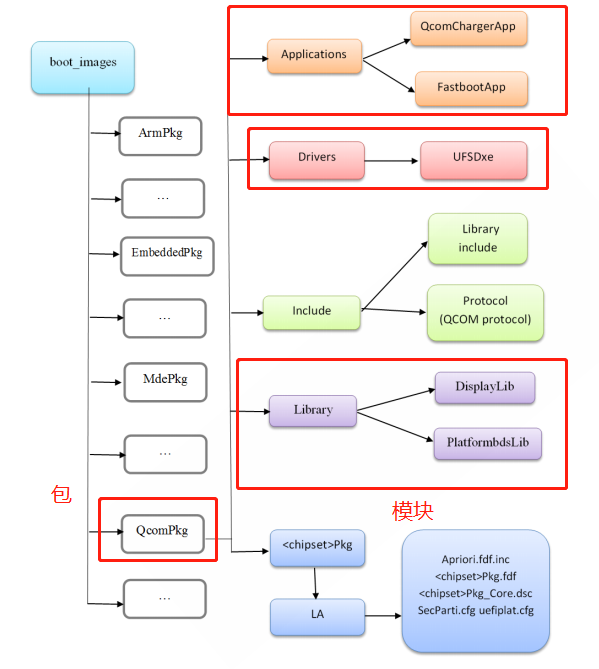

# README

高通UEFI学习。

# refer

* [UEFI原理与编程（二）：UEFI工程模块文件-标准应用程序工程模块](https://blog.csdn.net/sevensevensevenday/article/details/70789517)

# 模块(Module)和包(Package)

在EDK2环境下编程之前，先介绍EDK2的两个概念模块(Module)和包(Package).
　　“包”是一组模块及平台描述文件(.dsc文件)、包声明文件(.dec文件)则、组成的集合，多在以*pkg命名的文件夹中，一般也称这样的文件夹为一个包。
　　模块是UEFI系统的一个特色。模块(可执行文件，即.efi文件)像插件一样可以动态地加载到UEFI内核中。对应到源文件，EDK2中的每个工程模块由元数据文件(.inf)和源文件(有些情况也可以包含.efi文件)组成。
主要介绍3种应用程序模块、UEFI驱动模块和库模块。



# Protocol服务

UEFI 驱动程序使用Protocol服务来访问其他模块产生的Protocol接口。 UEFI 规范定义了一组引导服务来处理Protocol，
包含：
实现动态链接时使用Protocol。 对于静态链接使用库。 要实现任何想要动态使用的新服务，请使用Protocol。

## 如何通过protocol找到驱动对应接口

* 如何通过protocol找到驱动对应接口，比如驱动调用`ChargerLib_GetBatteryStatus`这个接口，我们跟进代码如下：
* `QcomPkg/Library/ChargerLib/ChargerLibCommon.c`:
```
* EFI_STATUS ChargerLib_GetBatteryStatus(chargerlib_batt_status_info *pBatteryStatus)
  └── ChargerLibTarget_GetBatteryStatus(pBatteryStatus)
      └── PmicQgProtocol->GetBatteryStatus(BatteryGaugeInfo.QGaugePmicInfo.PmicIndex,(EFI_PM_QG_BATT_STATUS_INFO *)&BatteryStatus);//QcomPkg/Library/ChargerLib/target/Agatti/ChargerLibTarget.c
```

* `EFI_PM_QG_BATT_STATUS_INFO`结构体如下，定义了所有protocol支持的函数：
```C++
typedef struct _EFI_PM_QG_BATT_STATUS_INFO
{
  UINT32 StateOfCharge;
  INT32  ChargeCurrent;
  INT32  BatteryVoltage;
  INT32  BatteryTemperature;
}EFI_PM_QG_BATT_STATUS_INFO;
```

* 我们通过检索`EFI_PM_QG_BATT_STATUS_INFO`结构体可以找到定义它的驱动位置：
```
QcomPkg/Drivers/PmicDxe/Qg/PmicQg.c
203:   OUT EFI_PM_QG_BATT_STATUS_INFO *BattStsInfo
207:  EFI_PM_QG_BATT_STATUS_INFO stsInfo = {0};
294:   OUT EFI_PM_QG_BATT_STATUS_INFO *BattStsInfo
```

* 找到定义函数如下，可以看到该接口主要是获取电池电流电压和温度：
```C++
/**
EFI_PmicQgBatteryStatus()

@brief
Returns Battery Status parameters such as State of Charge (SOC)
*/
EFI_STATUS
EFIAPI
EFI_PmicQgGetBatteryStatus

(
   IN  UINT32         PmicDeviceIndex,
   OUT EFI_PM_QG_BATT_STATUS_INFO *BattStsInfo
)
{
  EFI_STATUS Status   = EFI_SUCCESS;
  EFI_PM_QG_BATT_STATUS_INFO stsInfo = {0};

  if(NULL == BattStsInfo )
  {
    return EFI_INVALID_PARAMETER;
  }
  Status = PmicQg_GetBatteryStatus(PmicDeviceIndex, &stsInfo);

  *BattStsInfo = stsInfo;

  return Status;
}

/**
PmicQg_GetBatteryStatus

@brief
Returns Battery Status parameters such as Voltage
*/
EFI_STATUS
PmicQg_GetBatteryStatus
(
   IN  UINT32         PmicDeviceIndex,
   OUT EFI_PM_QG_BATT_STATUS_INFO *BattStsInfo
)
{
  EFI_STATUS       Status   = EFI_SUCCESS;
  pm_err_flag_type errFlag  = PM_ERR_FLAG_SUCCESS;
  UINT32           VBat = 0;
  INT32            ibat = 0;
  INT32            BattTemp = 0;

  if(NULL == BattStsInfo )
  {
    return EFI_INVALID_PARAMETER;
  }

  /* Get Battery voltage */
  errFlag = pm_qgauge_get_vbat(PmicDeviceIndex, &VBat);
  Status = (PM_ERR_FLAG_SUCCESS == errFlag)? EFI_SUCCESS : EFI_DEVICE_ERROR;

  BattStsInfo->BatteryVoltage = VBat;

  /* Get Battery charge current */
  errFlag |= pm_qgauge_get_ibat(PmicDeviceIndex, &ibat);

  BattStsInfo->ChargeCurrent = ibat;

  errFlag |= PmicQg_ReadBattTemp(&BattTemp);

  BattStsInfo->BatteryTemperature = BattTemp;


  return (Status | errFlag);
}

```