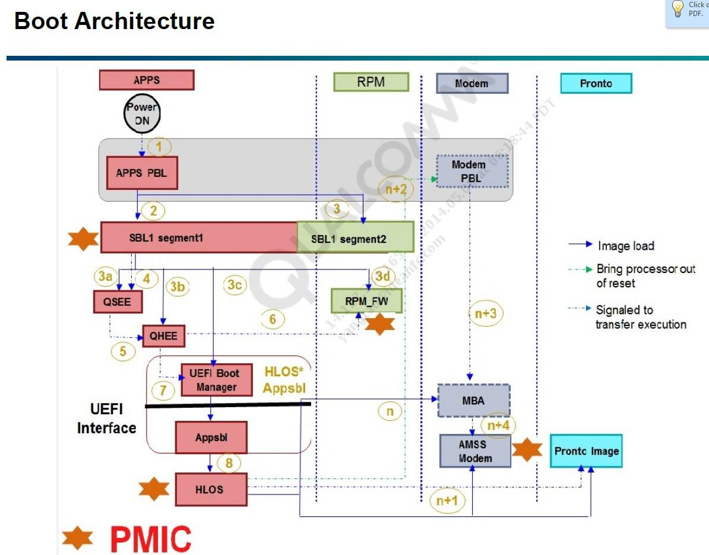
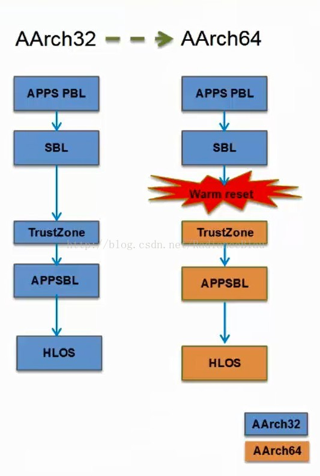
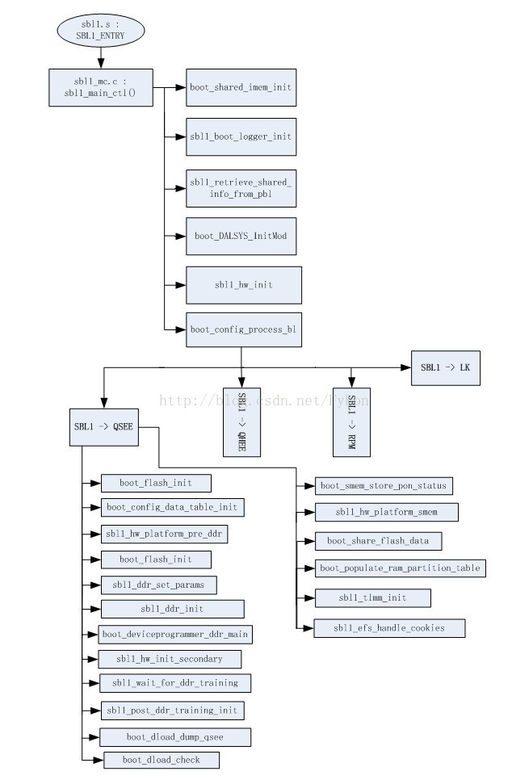

# qcom

高通qcm2290 PBL-SBL1流程分析。全称：Secondary boot loader,SBL1是XBL前运行的一个流程，今天就要分析一下开机前几秒钟起着关键作用的sbl1.

# refer

* [高通平台ANDROID源码BOOTLOADER分析之SBL1(一)](https://www.freesion.com/article/2106235017/)
* [linux驱动由浅入深系列：PBL-SBL1-(bootloader)LK-Android启动过程详解之一（高通MSM8953启动实例）](https://www.cnblogs.com/linux-xin/p/8124509.html)
* [高通 MSM8K bootloader之一： SBL1](https://www.cnblogs.com/linux-xin/p/8125988.html)

启动相关image介绍
1. PBL(Primary Boot Loader)   位于rom中，是芯片上电后执行的真正第一行代码，在正常启动流程中会加载SBL1。如果启动异常会虚拟出9008端口用于紧急下载（短接板子上的force_boot_from_usb引脚(MSM8953 为gpio37)到1.8v可以强制进入紧急下载模式）。
2. SBL1(Second BootLoader stage 1) 位于eMMC中，由PBL加载，初始化buses、DDR、clocks等，会虚拟出9006端口，用于不能开机时dump ram
3. QSEE/TrustZone安全相关，如fuse
4. DEVCFG OEM配置信息（如OEMLock）
6. Debug Policy 调试相关
7. APPSBL即为BootLoader，目前使用LK（littlekernel）
8. HLOS(High LevelOperating System) 即为Linux/Android
9. Modem PBL  即为Modem处理器的PBL
10. MBA(Modem BootAuthenticator) Modem处理器启动鉴权

# 框架

首先来看一下高通的bootloader流程框图，主要由ap、RPM及modem三部分构成，由于我工作主要涉及到ap侧，所以对RPM和modem侧代码不了解，以后有空时间的话到可以研究一下，框图如下：



# 启动流程

启动流程

1. 系统上电，使芯片从上电复位开始运行。
2. 在Cortex A53中运行的PBL会加载：
  * a. 从启动设备（如eMMC）加载SBL1 segment1到L2（即为TCM）
  * b. 加载SBL1 segment2到RPM处理器的RAM中。
3. SBL1 segment1会初始化DDR，然后完成如下加载：
  a. 从启动设备加载QSEE image到DDR
  b. 从启动设备加载DEVCFG image到DDR
  c. 从启动设备加载Debug Policy image到DDR
  d. 从启动设备加载HLOS APPSBL image到DDR
  e. 从启动设备加载RPMfirmware image到RPM的RAM中。
4. SBL1移交运行控制权给QSEE。QSEE建立安全运行环境，配置xPU，支持fuse。
  a. SBL1运行在AArch32（译者注：名词相关知识见文末“附件介绍一”）模式，而QSEE运行在AArch64模式。为了切换到AArch64模式，SBL1会启动重映射器，操作RMR寄存器，然后触发warm-reset，QSEE就能够运行在AArch64模式了。
5. QSEE通知RPM启动RPM 固件的执行。
6. QSEE移交运行控制权给HLOS APPSBL。
  a. APPSBL只能在AArch32模式开始运行。
  b. 这时AArch32的运行模式切换是在EL3/Monitor模式（译者注：名词相关知识见文末“附件介绍二”）完成的。通过查看APPSBL的ELF头能够得知其需要运行在32位指令集架构下。EL3/Monitor模式改变到32位模式，然后再启动APPSBL。
7. APPSBL加载、验证kernel。APPSBL通过SCM调用改变到HLOS kernel需要的AArch64模式。这和之前LK直接跳转到kernel运行是不同的。
8. HLOS kernel通过PIL加载MBA到DDR
9. HLOS kernel对Hexagon modem DSP进行解复位。
10. Modem PBL继续它的启动。
11. HLOS kernel 通过PIL加载AMSS modemimage到DDR
12. Modem PBL验证MBA然后跳转到MBA。
13. HLOS通过PIL加载WCNSS(Pronto)image到DDR
14. HLOS对WCNSS(Pronto)进行解复位以便Prontoimage开始执行。
15. HLOS通过PIL加载LPASS image到DDR
16. HLOS对LPSAA进行解复位以便LPASSimage开始执行。

下面是流程的简化图，其中区分了AArch32和AArch64位的QSEE/TrustZone：



* 关于eMMC和DDR的初始化时间问题

从上面的描述中已经可以看清，为避免迷惑，在分离出来看看：
1. PBL中是含有eMMC驱动的，有访问eMMC的能力，自身运行在MCU内部SRAM中。
2. 除了PBL程序的img在MCU片内ROM外，其余img均存储在eMMC中。
3. PBL首先从eMMC加载SBL1到L2（内部缓存并非DDR），SBL1同样运行在片内SRAM。
4. 有SBL1初始化DDR各种时序后，DDR自此可用（eMMC一直可用）
5. 再由SBL1加载其余各个img到DDR，然后XBL按照linux的正常顺序启动^-^....

# SBL1软件流程分析

下面将SBL1我比较关注的点调用流程总结成如下图，图中的LK指的是XBL，后面再针对关注点展开，逐个分析:



# SBL1入口：sbl1_Aarch64.s

* `QcomPkg\SocPkg\Library\XBLLoaderLib\sbl1_Aarch64.s`:
```
/*====*====*====*====*====*====*====*====*====*====*====*====*====*====*====*

                              SBL1 Aarch64

 GENERAL DESCRIPTION
   This file bootstraps the processor. The Start-up Primary Bootloader
   (SBL1) performs the following functions:

      - Set up the hardware to continue boot process.
      - Initialize DDR memory
      - Load Trust-Zone OS
      - Load APPSBL and continue boot process

   The SBL1 is written to perform the above functions with optimal speed.
   It also attempts to minimize the execution time and hence reduce boot time.

 Copyright 2013 - 2018 by Qualcomm Technologies, Inc.
 All Rights Reserved.
*====*====*====*====*====*====*====*====*====*====*====*====*====*====*====*/

/*====*====*====*====*====*====*====*====*====*====*====*====*====*====*====*/

sbl1_entry_init_stack:  
  // -------------------------------
  // add more assembly init code here for entering sbl1_main_ctl	
  // 
  // restore PBL parameter and enter sbl1_main_ctl
  // -------------------------------
  MOV w0, w7
  BL sbl1_main_ctl
```
* 此文件引导处理器，主要有实现如下操作：
  * 设置硬件，继续boot进程。
  * 初始化ddr。
  * 加载Trust_Zone操作系统。
  * 加载RPM固件。
  * 加载APPSBL然后继续boot进程。

# SBL1_MAIN_CTL

此函数位于`boot_images/QcomPkg/SocPkg/Library/XBLLoaderLib/sbl1_mc.c`，主要完成初始化RAM等工作， 注此函数决不return。部分关键源码如下，我加汉字解释的是我认为我们应该关注的部分：
```C++
** ==========================================================================
*/
/*!
*
* @brief
*   The  Main Controller performs the following functions:
*       - Initializes ram
*       - And so on...
*
* @param[in] pbl_shared Pointer to shared data
*
* @par Dependencies
*   None
*
* @retval
*   None
*
* @par Side Effects
*   This function never returns.
*
*/
void sbl1_main_ctl(boot_pbl_shared_data_type *pbl_shared)
{
      DALResult bsy_wait_init;

  /* Configure Domain access control register */
  mmu_set_dacr(DACR_ALL_DOMAIN_CLIENTS);

  /* Retrieve info passed from PBL*/
  sbl1_retrieve_shared_info_from_pbl(pbl_shared);

  /* Initialize shared functions structure - provides other images with function pointers in Loader */
  boot_shared_functions_register();

  /* Initialize SBL memory map */
  sbl1_populate_initial_mem_map(&bl_shared_data);

  /* Calculate the SBL start time for use during boot logger initialization. */
  sbl_start_time = CALCULATE_TIMESTAMP(HWIO_IN(TIMETICK_QTIMER_CLK));
  sbl_start_time_mpm = CALCULATE_MPM_TIMESTAMP(HWIO_IN(TIMETICK_CLK));

  /* Initialize busywait module Note: required before logger init due to uart driver dependency on busywait */
  BL_VERIFY((bsy_wait_init=boot_busywait_init()) == DAL_SUCCESS, (uint16)bsy_wait_init|BL_ERROR_GROUP_BUSYWAIT);

  /* Enable qdss workaround*/
  BL_VERIFY(boot_clock_debug_init() == TRUE, FALSE|BL_ERROR_GROUP_CLK );

  /* Enter debug mode if debug cookie is set */
  sbl1_debug_mode_enter();

  /* Initialize the stack protection canary */
  boot_init_stack_chk_canary();

  /* Initialize boot shared imem */
  boot_shared_imem_init(&bl_shared_data);

  /* Initialize the ChipInfo driver */
  ChipInfo_Init();

  /* Initialize the QSEE interface */
  sbl1_init_sbl_qsee_interface(&bl_shared_data, &sbl_verified_info);

  /* Initialize dal heap using internal memory */
  boot_DALSYS_HeapInit(boot_internal_heap, BOOT_INTERNAL_HEAP_SIZE, FALSE);

  /*Initialize DAL, needs to be called before modules that uses DAL */
  boot_DALSYS_InitMod(NULL);

  /* Initialize boot logger and start the log timer.
     This must be done after sbl1_retrieve_shared_info_from_pbl
     and boot_secboot_ftbl_init. */
  /*初始化log系统，即串口驱动*/
  sbl1_boot_logger_init(&boot_log_data, pbl_shared);

  boot_log_set_meta_info(boot_log_data.meta_info_start);

  /* Set hash algorithm */
  BL_VERIFY(boot_set_hash_algo(SBL_HASH_SHA256) == BL_ERR_NONE, BL_ERR_UNSUPPORTED_HASH_ALGO|BL_ERROR_GROUP_BOOT);
  /* Call sbl1_hw_init to config pmic device so we can use PS_HOLD to reset */
  /*配置PMIC芯片，以便我们能通过PS_HOLD复位*/
  sbl1_hw_init();

#if defined (FEATURE_DEVICEPROGRAMMER_IMAGE) || defined (FEATURE_DDI_IMAGE)
  /* Enter device programmer does not return */
  device_programmer_init(&bl_shared_data, pbl_shared);
#else

  /* Store the sbl1 hash to shared imem */
  boot_store_tpm_hash_block(&bl_shared_data, &sbl_verified_info);

  /*-----------------------------------------------------------------------
    Process the target-dependent SBL1 procedures
  -----------------------------------------------------------------------*/
  /*执行sbl1的目标依赖进程*/
  boot_config_process_bl(&bl_shared_data, SBL1_IMG, sbl1_config_table);
#endif
}
```

# SBL1_CONFIG_TABLE

sbl1_config_table为一个结构体数组，里面存储了加载QSEE、RPM、APPSBL等镜像所需要的配置参数及执行函数，位于`boot_images/QcomPkg/SocPkg/Library/XBLLoaderLib/sbl1_config.c`。其关键代码如下：
```C++

/*==========================================================================
                      DEFINE TARGET BOOT CONFIG TABLE
===========================================================================*/
boot_configuration_table_entry sbl1_config_table[] = 
{
/* host_img_id host_img_type target_img_id target_img_type target_img_sec_type        load   auth   exec   jump   exec_func jump_func   pre_procs       post_procs         load_cancel              target_img_partition_id         target_img_str            boot_ssa_enabled enable_xpu xpu_proc_id sbl_qsee_interface_index seg_elf_entry_point whitelist_ptr */
  /* 省略 */
  {SBL1_IMG, CONFIG_IMG_QC, GEN_IMG, CONFIG_IMG_ELF,     SECBOOT_APDP_SW_TYPE,        TRUE,  TRUE,  FALSE, FALSE, NULL, NULL,           apdp_pre_procs, apdp_post_procs,   apdp_load_cancel,        apdp_partition_id,              APDP_BOOT_LOG_STR,        FALSE, FALSE, 0x0, 0x0, 0x0,                    apdp_img_whitelist    },
  /* SBL1 -> QSEE */
  {SBL1_IMG, CONFIG_IMG_QC, GEN_IMG, CONFIG_IMG_ELF,     SECBOOT_APPSBL_SW_TYPE,      TRUE,  TRUE,  FALSE, TRUE,  NULL, qsee_jump_func, NULL,           appsbl_post_procs, appsbl_load_cancel,      appsbl_partition_id,            APPSBL_BOOT_LOG_STR,      FALSE, FALSE, 0x0, 0x0, SCL_XBL_CORE_CODE_BASE, xbl_core_img_whitelist},
  {NONE_IMG, }
};
```

# apdp_pre_procs 

apdp_pre_procs为一个函数结构体数组，在QSEE加载之前执行。源码注释写得很清楚并且容易理解，我就不多此一举去翻译了，关键源码如下：
```C++
/*==========================================================================
              FUNCTIONS TO EXECUTE BEFORE APDP IMAGE LOADING
===========================================================================*/
boot_function_table_type apdp_pre_procs[] =
{
  /* Initialize the flash device */
  {boot_flash_init, "boot_flash_init"},

  /* Initialize XBL config Lib */
  {sbl1_xblconfig_init, "sbl1_xblconfig_init"},

  /*Initialize feature configuration from xbl config image*/
  {sbl1_feature_config_init,"sbl1_feature_config_init"},

  /* Initialize the default CDT before reading CDT from flash */
  {boot_config_data_table_default_init, "boot_config_data_table_default_init"},

  /* Set default DDR params */
  {sbl1_ddr_set_default_params, "sbl1_ddr_set_default_params"},

  /* Copy the configure data table from flash */
  {boot_config_data_table_init, "boot_config_data_table_init"},

  /* Store platform id */
  {sbl1_hw_platform_pre_ddr, "sbl1_hw_platform_pre_ddr"},

  /* Initialize PMIC and railway driver */
  {sbl1_hw_pre_ddr_init, "sbl1_hw_pre_ddr_init"},

  /* Check if forced dload timeout reset cookie is set */
  {boot_dload_handle_forced_dload_timeout, "boot_dload_handle_forced_dload_timeout"},

  /* Configure ddr parameters based on eeprom CDT table data. */
  {sbl1_ddr_set_params, "sbl1_ddr_set_params"},

  /* Initialize DDR */
  {sbl1_ddr_init, "sbl1_ddr_init"},

  /* Train DDR if applicable */
  {sbl1_do_ddr_training, "sbl1_do_ddr_training"},

  /*----------------------------------------------------------------------
   Run deviceprogrammer if compiling the deviceprogrammer_ddr image.
   In XBL builds the function below is stubbed out (does nothing)
  ----------------------------------------------------------------------*/
  {sbl1_hand_control_to_devprog_ddr_or_ddi, "sbl1_hand_control_to_devprog_ddr_or_ddi"},

#ifndef FEATURE_DEVICEPROGRAMMER_IMAGE

  /* Initialize SBL1 DDR ZI region, relocate boot log to DDR */
  {sbl1_post_ddr_init, "sbl1_post_ddr_init"},

  {sbl1_hw_init_secondary, "sbl1_hw_init_secondary"},

#endif /*FEATURE_DEVICEPROGRAMMER_IMAGE*/

  /* Last entry in the table. */
  NULL
};
```

# apdp_post_procs

post_procs同样也为一个函数结构体数组，其在加载QSEE之后执行。关键源码如下：
```C++
/*==========================================================================
   FUNCTIONS TO EXECUTE AFTER APDP LOADING
===========================================================================*/
boot_function_table_type apdp_post_procs[] = 
{
#ifndef FEATURE_DEVICEPROGRAMMER_IMAGE

/* Backup QSEE and QHEE region for ramdumps */  
  {boot_dload_dump_security_regions, "boot_dload_dump_security_regions"},

  /* Check to see if DLOAD mode needs to be entered */
  {boot_dload_check, "boot_dload_check"},

  /* Set the memory barrier pointer to shared memory */
  {boot_cache_set_memory_barrier, "boot_cache_set_memory_barrier"},

  /*----------------------------------------------------------------------
   Put SMEM in debug state such that smem_alloc() calls will return NULL. 
   The state is changed back to normal once smem_boot_init() is called.
   This call has to be made after setting the memory barrier.
  ----------------------------------------------------------------------*/
  {boot_smem_debug_init, "boot_smem_debug_init"},  
    
  /* Initialize shared memory after dload to preserve logs */
  {boot_smem_init, "boot_smem_init"},

  /* Initialize SMEM minidump table */
  {boot_smem_alloc_for_minidump, "boot_smem_alloc_for_minidump"},

  /* Store Power on Status in SMEM. */  
  {boot_smem_store_pon_status, "boot_smem_store_pon_status"},

  /* Store the platform id to smem */
  {sbl1_hw_platform_smem, "sbl1_hw_platform_smem"},

  {(boot_procedure_func_type) boot_clock_init_rpm, "boot_clock_init_rpm"},

  {boot_vsense_copy_to_smem, "boot_vsense_copy_to_smem"},

  /*----------------------------------------------------------------------
   Get shared data out of the flash device module
  ----------------------------------------------------------------------*/
  {boot_share_flash_data, "boot_share_flash_data"},
  
  /*----------------------------------------------------------------------
   populate the ram partition table
  ----------------------------------------------------------------------*/
  {boot_populate_ram_partition_table, "boot_populate_ram_partition_table"},

  /*populate ddr details shared memory*/
  {boot_populate_ddr_details_shared_table, "boot_populate_ddr_details_shared_table"},

  /*----------------------------------------------------------------------
   Initialize GPIO for low power configuration
  ----------------------------------------------------------------------*/
  {sbl1_tlmm_init, "sbl1_tlmm_init"},
  
  /*-----------------------------------------------------------------------
   Calls efs cookie handling api to perform efs backup/restore
  -----------------------------------------------------------------------*/  
  {sbl1_efs_handle_cookies, "sbl1_efs_handle_cookies"},
    
  /*-----------------------------------------------------------------------
   APT Security Test
   ----------------------------------------------------------------------*/
   {(boot_procedure_func_type) boot_apt_test, "boot_apt_test"},

#endif /* FEATURE_DEVICEPROGRAMMER_IMAGE */

  /* Last entry in the table. */
  NULL 
};
```

# SBL1阶段pmic初始化及开机电压检测

我们从`apdp_pre_func`中了解到，在这里会对pmic进行初始化和开机电压检测：
```C++
  /* Initialize PMIC and railway driver */
  {sbl1_hw_pre_ddr_init, "sbl1_hw_pre_ddr_init"},
```

* `QcomPkg/SocPkg/Library/XBLLoaderLib/sbl1_hw.c`程序流程：
```C++
* sbl1_hw_pre_ddr_init
  ├── BL_VERIFY((pm_device_init=boot_pm_device_init()) == PM_ERR_FLAG__SUCCESS, (uint16)pm_device_init|BL_ERROR_GROUP_PMIC);
  │   └── pm_device_init(); #QcomPkg/XBLLoader/boot_extern_pmic_interface.c
  │       ├── pm_target_information_init();
  │       ├── pm_device_pre_init();
  │       ├── pm_pon_init();
  │       ├── pm_pbs_info_rom_init();  /* Read PBS INFO for the pmic rom devices */
  │       ├── pm_sbl_pre_config(); /* SBL Pre Configuration */
  │       ├── pm_sbl_config(); /* SBL Configuration */
  │       ├── pm_sbl_config_test(); /* SBL Configuration validation, only executes complete code if spare reg 0x88F bit 0 is set*/
  │       ├── pm_pbs_info_ram_init();  /* Read PBS INFO for the pmic ram devices */
  │       ├── pm_pbs_ram_version_validation_test(); /* PBS RAM Version validation, only executes complete code if spare reg 0x88F bit 0 is set*/
  │       └──  pm_device_post_init(); /* Initialize PMIC with the ones PDM can not perform */
  ├── BL_VERIFY((pm_driver_init=boot_pm_driver_init()) == PM_ERR_FLAG__SUCCESS, (uint16)pm_driver_init|BL_ERROR_GROUP_PMIC);
  │   └── pm_driver_init();
  │       ├── pm_device_init_status()
  │       ├── pm_driver_pre_init ();
  │       └── pm_driver_post_init ();
  └── BL_VERIFY((pm_sbl_chg_init=boot_pm_sbl_chg_init()) == PM_ERR_FLAG__SUCCESS, (uint16)pm_sbl_chg_init|BL_ERROR_GROUP_PMIC);
      └── pm_sbl_chg_init();
          └── if(pm_sbl_is_charging_applicable()) //判断是否是支持充电的平台，支持
              ├── pm_chg_is_debug_board_present(&debug_board_present);
              │   ├── pm_chg_get_batt_id(PM_BATT_ID_PU_30K, &battery_id); //获取Battery ID，如果有，表示is_debug_board
              │   └── pm_log_message("Battery ID: %dOhm", battery_id); 
              ├── pm_chg_is_battery_present(&battery_present); //判断电池是否在位，这里貌似有没有电池都是在位状态
              │   └── pm_bmd_get_battery_missing_rt_status(pm_chg_get_pmic_index(), PM_BMD_BAT_MISS_STS_DEB, &battery_missing);
              │       └── pm_comm_read_byte(SLAVE_ID, ADDRESS(bmd_bat_miss_sts), &data, 0);
              ├── if(battery_present == FALSE) return err_flag; //没电池，不往下跑了
              ├── pm_chg_enable_usb_charging(TRUE); //使能充电
              │   └── pm_scpq_chgr_enable_charging(pm_chg_get_pmic_index(), enable);
              │       └── pm_comm_write_byte_mask(SLAVE_ID, reg, mask, data, 0);
              ├── pm_app_chg_check_weak_battery_status(); //检测电池电压是否低压
              │   └── while(TRUE) //循环检测电池电压，直达大于阈值，才继续往下走
              │       ├── pm_chg_get_vbatt(&battery_voltage);
              │       ├── pm_chg_get_ibatt(&battery_current);
              │       ├── if(battery_voltage > charger_config->dead_battery_threshold) break; //如果电压大于dead_battery_threshold跳出循环
              │       ├── pm_chg_is_charging_ongoing(&charging_ongoing);
              │       └── if(FALSE == charging_ongoing) err_flag |= pm_device_shutdown(); //如果没有在充电则关机
              └── pm_sbl_chg_post_init();
                  └── pm_err_flag_type err_flag = PM_ERR_FLAG_SUCCESS;
```

* 正常启动log打印如下：
```
B -    531310 - PM: Battery ID: 99615Ohm
B -    984878 - PM: Charger SRC: SDP
B -    984964 - PM: VBAT: 4592mV IBAT: 106mA
B -    988249 - PM: CHG Init # SPMI Transn: 4251
```

* 低压状态，不接USB充电，直接关机：
```
B -    420999 - PM: Battery ID: 99480Ohm
B -    421081 - PM: USB not inserted
B -    424830 - PM: VBAT: 3222mV IBAT: 3mA
```

* 低压接USB充电，充电过程中会循环检测电池电压：
```
B -    414931 - PM: Battery ID: 99422Ohm
B -    868498 - PM: Charger SRC: SDP
B -    868670 - PM: VBAT: 3253mV IBAT: 0mA
B -   1322490 - PM: Charger SRC: SDP
B -   1822601 - PM: VBAT: 3252mV IBAT: 0mA
B -   2273280 - PM: Charger SRC: SDP
B -   2773510 - PM: VBAT: 3252mV IBAT: 0mA
```

由于SBL阶段检测电池电量没有低电量图片显示，而XBL阶段也做了相同方式的检测，建议去掉该阶段的检测，将电压阈值降低，修改如下：
```diff
--- a/A665x_Unpacking_Tool/BOOT.XF.4.1/boot_images/QcomPkg/SocPkg/AgattiPkg/Settings/PMIC/pm_config_target.c
+++ b/A665x_Unpacking_Tool/BOOT.XF.4.1/boot_images/QcomPkg/SocPkg/AgattiPkg/Settings/PMIC/pm_config_target.c
@@ -133,7 +133,7 @@ sbl_pon_specific_data[1] =
 pm_chg_charger_config_type pm_charger_config =
 {
   .pmic_index_charger                 = 0,                                          // PMIC_A, Cocos
-  .dead_battery_threshold             = 3450,                                       // Increase UEFI bootup threshold to 3.45V. This will allow UEFI to draw additional current from USBIN
+  .dead_battery_threshold             = 3200,                                       // Increase UEFI bootup threshold to 3.45V. This will allow UEFI to draw additional current from USBIN
```

# log

* qcm2290 SBL1启动log如下：
```
B -    266600 - SBL1, Start (MPM timestamp = 271419)
B -    371193 - SBL1 BUILD @ 17:43:08 on Jun 19 2022
B -    376524 - usb: hs_phy_nondrive_start
B -    380893 - usb: hs_phy_nondrive_finish
D -      8528 - sbl1_hw_init
D -        13 - boot_flash_init
D -      5929 - Auth Metadata
D -     30154 - sbl1_xblconfig_init
D -         4 - sbl1_feature_config_init
D -         2 - boot_config_data_table_default_init
D -        18 - sbl1_ddr_set_default_params
B -    434294 - Using default CDT
D -      3914 - boot_config_data_table_init
B -    441262 - CDT Version:3,Platform ID:34,Major ID:1,Minor ID:0,Subtype:0
D -      9483 - sbl1_hw_platform_pre_ddr
D -      2488 - devcfg init
B -    458658 - PM: PM 0=0x8000028000000010:0x0
B -    458725 - PM: POWER ON by USB_CHG, POWER OFF by PS_HOLD
B -    518522 - PM: SET_VAL:Skip
B -    518690 - PM: PSI: b0x00_v0x14
B -    525025 - PM: Device Init # SPMI Transn: 3996
B -    528139 - PM: Driver Init # SPMI Transn: 230
B -    531310 - PM: Battery ID: 99615Ohm
B -    984878 - PM: Charger SRC: SDP
B -    984964 - PM: VBAT: 4592mV IBAT: 106mA
B -    988249 - PM: CHG Init # SPMI Transn: 4251
D -    536606 - pmic XBL init
D -     10396 - vsense_railway_cpr init
D -    555182 - sbl1_hw_pre_ddr_init
D -         3 - boot_dload_handle_forced_dload_timeout
D -       499 - sbl1_load_ddr_training_data
D -      4972 - sbl1_ddr_set_params
B -   1025998 - DSF version = 20.0, DSF RPM version = 11.0
B -   1026038 - Manufacturer ID = 1, Device Type = 7
B -   1031256 - Rank 0 size = 1536 MB, Rank 1 size = 1536 MB
B -   1035957 - Max Frequency = 1804 MHz
B -   1041354 - Row Hammer Check : DRAM supports unlimited MAC Value : MR24[OP2:0 = 0] & MR24[OP3 = 1] for CH0 & CS0
B -   1050582 - Row Hammer Check : DRAM supports unlimited MAC Value : MR24[OP2:0 = 0] & MR24[OP3 = 1] for CH0 & CS1
D -     38365 - sbl1_ddr_init
B -   1065532 - do_ddr_training, Start
B -   1073521 - Bootup frequency set to 1555200
D -      5338 - do_ddr_training, Delta
D -     12288 - sbl1_do_ddr_training
D -         2 - sbl1_hand_control_to_devprog_ddr_or_ddi
B -   1084618 - Pimem init cmd, entry
D -      9919 - Pimem init cmd, exit
D -     15619 - sbl1_post_ddr_init
D -         7 - sbl1_hw_init_secondary
B -   1106276 - APDP Image Loaded, Start
D -      3179 - APDP Image Loaded, Delta - (0 Bytes)
D -         4 - boot_dload_dump_security_regions
B -   1117818 - usb: Serial - 4299ce11
B -   1572751 - usb phy: chgr -  USB_SDP_CHARGER
D -    455632 - boot_dload_check
D -         2 - boot_cache_set_memory_barrier
D -         2 - boot_smem_debug_init
D -       331 - boot_smem_init
D -         4 - boot_smem_alloc_for_minidump
D -        46 - boot_smem_store_pon_status
D -        14 - sbl1_hw_platform_smem
D -       120 - boot_clock_init_rpm
D -         2 - boot_vsense_copy_to_smem
D -         1 - boot_share_flash_data
D -         9 - boot_populate_ram_partition_table
D -         7 - boot_populate_ddr_details_shared_table
D -         4 - sbl1_tlmm_init
D -         2 - sbl1_efs_handle_cookies
D -         1 - boot_apt_test
B -   1627729 - OEM_MISC Image Loaded, Start
D -      5581 - Auth Metadata
D -       251 - Segments hash check
D -     11614 - OEM_MISC Image Loaded, Delta - (8024 Bytes)
B -   1642975 - QTI_MISC Image Loaded, Start
D -      4895 - QTI_MISC Image Loaded, Delta - (0 Bytes)
B -   1653972 - PM: PM Total Mem Allocated: 1249
D -      5045 - sbl1_pm_aop_pre_init_wrapper
B -   1661361 - RPM Image Loaded, Start
D -       960 - Auth Metadata
D -      1388 - Segments hash check
D -     13561 - RPM Image Loaded, Delta - (220788 Bytes)
B -   1678151 - QSEE Dev Config Image Loaded, Start
D -      1017 - Auth Metadata
D -       495 - Segments hash check
D -     12358 - QSEE Dev Config Image Loaded, Delta - (36552 Bytes)
B -   1699285 - QSEE Image Loaded, Start
D -     17843 - Auth Metadata
D -     17709 - Segments hash check
D -     87644 - QSEE Image Loaded, Delta - (3293200 Bytes)
D -        50 - sbl1_hw_play_vibr
B -   1795627 - SEC Image Loaded, Start
D -      5613 - Auth Metadata
D -       234 - Segments hash check
D -     11891 - SEC Image Loaded, Delta - (7460 Bytes)
B -   1810743 - QHEE Image Loaded, Start
D -       940 - Auth Metadata
D -      2455 - Segments hash check
D -     13760 - QHEE Image Loaded, Delta - (374328 Bytes)
B -   1828148 - STI Image Loaded, Start
D -      4710 - STI Image Loaded, Delta - (0 Bytes)
B -   1837185 - APPSBL Image Loaded, Start
D -      1019 - Auth Metadata
D -      8816 - Segments hash check
D -     25182 - APPSBL Image Loaded, Delta - (2171904 Bytes)
D -         6 - sbl1_appsbl_arch_determination
B -   1871741 - SBL1, End
```