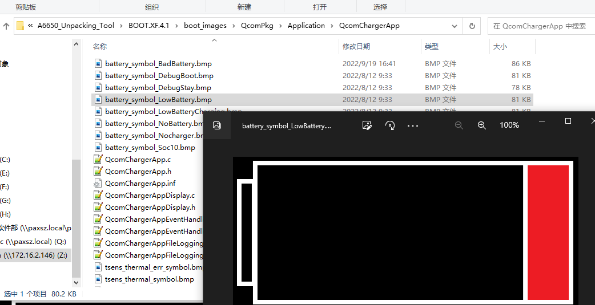

# 概述

高通平台如果达不到开机状态，也就是电池电压过低，会在XBL阶段运行comChargerApp进行充电，直到电池电压大于开机阈值则进入kernel，类似mtk平台lk阶段充电。

# 参考

* [【Android SDM660源码分析】- 02 - UEFI XBL QcomChargerApp充电流程代码分析](https://ciellee.blog.csdn.net/article/details/113759442)

# 流程图


* 摘要：
  * 1. 循环监控程序中获取电池电压电流温度，这里主要用来判断开机条件，硬件上一定要接正确。
  * 2. 开机条件实际上只有一个，DC和Soc的方式默认关闭，只需配置`BootToHLOSThresholdInMv`值即可，目前配置的是`3.45v`。
  * 3. App访问驱动通过LocateProtocol接口，也就是Protocol方式，这种是UEFI通用的方式。

# 加载 UEFI 默认应用程序

在高通代码中，QcomChargerApp是作为默认应用程序配置在uefiplat.cfg中`QcomPkg/SocPkg/AgattiPkg/LAA/uefiplat.cfg`：
```C++
## Default app to boot in platform BDS init
DefaultChargerApp = "QcomChargerApp"
DefaultBDSBootApp = "LinuxLoader"
```

* 系统开机过程中，初始化 Bsd 时，会调用LaunchDefaultBDSApps()函数，在该函数中，会实现对上述两个默认app 的调用。
  * 解析 uefiplat.cfg 中的 DefaultChargerApp，字符串保存在 DefaultApp 数组中。
  * 加载 QcomCharger App 应用程序，传参gMainFvGuid 和 “DefaultChargerApp”
  * 解析 uefiplat.cfg 中的 DefaultBDSBootApp，字符串保存在 DefaultApp 数组中
  * 加载 DefaultBDSBootApp 应用程序，加载后不再返回


```C++
/**
 * Launch default BDS Boot App.
 * If default BDS Boot App is specified then this function should NOT return,
 * on failure to launch or if the launched app returns, launch the shell app
 * if the device is NOT in retail mode as determined by PRODMODE Build and
 * fuse blown status.
*/
STATIC
EFI_STATUS
EFIAPI
LaunchDefaultBDSApps (VOID)
{

  EFI_STATUS Status = EFI_SUCCESS;
  CHAR8 DefaultApp[DEF_APP_STR_LEN];
  UINTN Size = DEF_APP_STR_LEN;
  CHAR8 FileinFV[64] = {0};

  //1. 解析 uefiplat.cfg中的DefaultChargerApp，字符串保存在DefaultApp数组中。
  Status = GetConfigString ("DefaultChargerApp", DefaultApp, &Size);
  AsciiStrCpy (FileinFV, FILE_IN_FV_PREPEND);
  AsciiStrCat (FileinFV, DefaultApp);

  if (Status == EFI_SUCCESS)
  {
    // 2. 加载QcomChargerApp 应用程序，传参gMainFvGuid 和 “DefaultChargerApp”
    Status = LoadImageFromFV (FileinFV, NULL );
    if (EFI_ERROR(Status))
      DEBUG((EFI_D_ERROR, "Failed to launch default charger app, status: %r\n", Status));
  }

  Size = DEF_APP_STR_LEN;

  //解析 uefiplat.cfg中的DefaultBDSBootApp，字符串保存在DefaultApp数组中。就是ABL
  Status = GetConfigString ("DefaultBDSBootApp", DefaultApp, &Size);
  if (Status == EFI_SUCCESS)
  {
    DisplayPOSTTime ();
    // 4. 加载ABL应用程序，加载后不再返回
    LaunchAppFromGuidedFv(&gEfiAblFvNameGuid, DefaultApp, NULL);
    //If we return from above function, considered a failure
    ConfirmShutdownOnFailure();
  }
  else
  {
    DEBUG ((EFI_D_INFO, "[QcomBds] No default boot app specified\n"));
  }

  return Status;
}
```

# QcomChargerApp应用程序初始化

# 入口函数 QcomChargerApp_Entry()

```shell
// amss\BOOT.XF.1.4\boot_images\QcomPkg\Application\QcomChargerApp\QcomChargerApp.inf
[Defines]
  INF_VERSION                    = 0x00010005
  BASE_NAME                      = QcomChargerApp
  FILE_GUID                      = EEE9C2B1-16CA-4f34-87EA-2E6D1E160CC4
  MODULE_TYPE                    = UEFI_APPLICATION
  VERSION_STRING                 = 1.0
  ENTRY_POINT                    = QcomChargerApp_Entry
```

* 从QcomChargerApp.inf中可知，其入口函数为 QcomChargerApp_Entry()，我们跳转进入分析下:
  * 获得当前的平台类型，如EFI_PLATFORMINFO_TYPE_MTP=0x08等
  * 如果当前平台是 EFI_PLATFORMINFO_TYPE_CDP 或 EFI_PLATFORMINFO_TYPE_RUMI，则不需要运行充电应用程序
  * 获得充电驱动的结构体函数，结构体指针保存在pQcomChargerProtocol中。
  * 获得当前的电池状态，如果不等于EFI_QCOM_CHARGER_ACTION_DEBUG_BOARD_GOOD_TO_BOOT则运行该app进行循环充电，否则退出。
  * 判断是否需要加载充电电池曲线数参数FG battery profile。
  * 如果当前电池状态不允许正常开机，则调用QcomChargerApp_Initialize() 初始化PMIC充电，且在QcomChargerApp_MonitorCharging()中开始循环监控充电状态。
  * 退出充电模式。
* `boot_images\QcomPkg\Application\QcomChargerApp\QcomChargerApp.c`:
```C++
# amss\BOOT.XF.1.4\boot_images\QcomPkg\Application\QcomChargerApp\QcomChargerApp.c

EFI_STATUS QcomChargerApp_Entry(IN EFI_HANDLE ImageHandle, IN EFI_SYSTEM_TABLE *SystemTable)
{
  // 1. 获得当前的平台类型，如EFI_PLATFORMINFO_TYPE_MTP=0x08等
  Status |= GetPlatformType(&PlatformType);
  // 2. 如果当前平台是 EFI_PLATFORMINFO_TYPE_CDP  或 EFI_PLATFORMINFO_TYPE_RUMI，则不需要运行充电应用程序
  if((EFI_PLATFORMINFO_TYPE_CDP == PlatformType) || (EFI_PLATFORMINFO_TYPE_RUMI == PlatformType))
  {	/*if platform is CDP/RUMI , don't need to run the app. */
    CHARGERAPP_FILE_UART_DEBUG(( EFI_D_WARN, "QcomChargerApp:: %a CDP/RUMI (%d) Platform detected. Exiting app. \r\n", __FUNCTION__, PlatformType));
    return EFI_SUCCESS;
  }
  // 3. 获得充电驱动的结构体函数，结构体指针保存在pQcomChargerProtocol中。
  Status = gBS->LocateProtocol( &gQcomChargerProtocolGuid, NULL, (VOID **)&pQcomChargerProtocol );
  // 4. 获得当前的电池状态，如果不等于EFI_QCOM_CHARGER_ACTION_DEBUG_BOARD_GOOD_TO_BOOT
  /*Get charging Action to be taken */
  Status = pQcomChargerProtocol->GetChargingAction(&ChargingAction, &ChargerActionInfo);
  // 5. 判断是否需要加载充电电池曲线数参数FG battery profile
  /* Handle if FG battery profile needs to be loaded */
  if(EFI_QCOM_CHARGER_PLATFORM_ACTION_PROFILE_LOAD == ChargingAction){
    if(ChargerActionInfo.ProfState == EFI_QCOM_CHARGER_PROFILE_LOAD){
      Status |= QcomChargerApp_DisplaySignOfLifeOnVBat(&ChargerActionInfo);
    }
    /* Load Battery Profile */
    Status |= pQcomChargerProtocol->TakeAction(ChargingAction, &ChargerActionInfo);
    /*Get charging Action again to be taken to proceed further for charging if needed */
    Status = pQcomChargerProtocol->GetChargingAction(&ChargingAction, &ChargerActionInfo);
  }
  // 6. 如果当前电池状态不允许正常开机，则调用QcomChargerApp_Initialize() 显示充电图标及启动一个5s的定时器，且在QcomChargerApp_MonitorCharging()中开始循环监控充电状态
  /* Take Action First skip if debug board i.e. boot to HLOS */
  if(EFI_QCOM_CHARGER_ACTION_DEBUG_BOARD_GOOD_TO_BOOT != ChargingAction)
  {
	  Status |= pQcomChargerProtocol->TakeAction(ChargingAction, &ChargerActionInfo);
	  /* DO charger App Actions */
	  switch(ChargingAction)
	  {
	    case EFI_QCOM_CHARGER_ACTION_START_CHARGING:
	    case EFI_QCOM_CHARGER_ACTION_NO_CHARGE_WAIT:
	    case EFI_QCOM_CHARGER_ACTION_CONTINUE:
	      /*Initializes and displays the battery symbol*/
	      Status |= QcomChargerApp_Initialize(ChargingAction);
	      /* if initialization success then start charging upto target SoC*/
	      Status |= QcomChargerApp_MonitorCharging();
	      Status |= QcomChargerApp_PostProcessing();
	    break;
	  }
  }
  // 7. 退出充电模式
  /* After post processing call to exit module */
  Status |= QcomChargerApp_DeInitialize();
  CHARGERAPP_DEBUG((EFI_D_WARN, "QcomChargerApp:: %a Exiting \r\n", __FUNCTION__));
  return Status;
}
```

* `QcomPkg/Drivers/QcomChargerDxe/QcomCharger.c`QcomCharger驱动提供以下protocol供APP使用:
```C++
/**
  PMIC FG UEFI Protocol implementation
 */
EFI_QCOM_CHARGER_PROTOCOL QcomChargerProtocolImplementation =
{
  QCOM_CHARGER_REVISION,
  EFI_QcomChargerEnableCharging,
  EFI_QcomChargerGetMaxUsbCurrent,
  EFI_QcomChargerSetMaxUsbCurrent,
  EFI_QcomChargerGetChargingAction,
  EFI_QcomChargerTakeAction,
  EFI_QcomChargerDisplayImage,
  EFI_QcomChargerGetBatteryPresence,
  EFI_QcomChargerGetBatteryVoltage,
  EFI_QcomChargerDeInitialize,
  EFI_QcomChargerGetFileLogInfo,
  EFI_QcomChargerDumpPeripheral,
  EFI_QcomChargerIsDcInValid,
  EFI_QcomChargerGetChargerConfig,
  EFI_QcomChargerIsChargingSupported,
  EFI_QcomChargerGetDisplayImageType
};
```

#  充电初始化 QcomChargerApp_Initialize()

* 在 QcomChargerApp_Initialize() 中主要动作就是:
  * 根据获取到的电池状态显示充电图片。
  * 创建一个定时事件刷新UI显示，定时时间为500ms，显示7秒并灭屏，达到休眠效果。
```C++
EFI_STATUS QcomChargerApp_Initialize( EFI_QCOM_CHARGER_ACTION_TYPE ChargingAction )
{
  EFI_STATUS Status = EFI_SUCCESS;

  if (EFI_PLATFORMINFO_TYPE_UNKNOWN == PlatformType )
  {
    Status = GetPlatformType(&PlatformType);
    if(EFI_SUCCESS != Status)
    {
      DEBUG((EFI_D_WARN, "QcomChargerApp:: %a Error getting platform type = %r \r\n", __FUNCTION__, Status));
      return EFI_DEVICE_ERROR;
    }
  }
  if (EFI_PLATFORMINFO_TYPE_CLS != PlatformType )
  {
    if (ChargingAction == EFI_QCOM_CHARGER_ACTION_TSENSE_HIGH_WAIT)
    {
      QcomChargerAppEvent_DispBattSymbol(EFI_QCOM_CHARGER_DISP_IMAGE_TSENS_THERMAL_SYMBOL);
    }
    else if (ChargingAction == EFI_QCOM_CHARGER_ACTION_DEBUG_BOARD_WAIT)
    {
      QcomChargerAppEvent_DispBattSymbol(EFI_QCOM_CHARGER_DISP_IMAGE_DEBUG_LOW_SYMBOL);
    }
    else
    {
      QcomChargerAppEvent_DispBattSymbol(EFI_QCOM_CHARGER_DISP_IMAGE_LOWBATTERY);
    }
    /* Start required timers */
    Status |= QcomChargerAppEvent_DisplayTimerEvent(TRUE, TRUE);
  }
  else
  {
    CHARGERAPP_DEBUG((EFI_D_WARN, "QcomChargerApp:: %a Entering LPM \r\n", __FUNCTION__));  
    QcomChargerAppEvent_EnterLPM();/* Enter LPM */
  }
  CHARGERAPP_DEBUG((EFI_D_WARN, "QcomChargerApp:: %a Status = %r \r\n", __FUNCTION__, Status));

  return Status;
}

EFI_STATUS QcomChargerAppEvent_DisplayTimerEvent(BOOLEAN bDispOffTimer, BOOLEAN AnimTimer)
{
  EFI_STATUS Status = EFI_SUCCESS;
  EFI_PLATFORMINFO_PLATFORM_TYPE PlatformType;
  
  Status = GetPlatformType(&PlatformType);
  if(EFI_SUCCESS != Status)
  {
	DEBUG((EFI_D_WARN, "QcomChargerApp:: %a Error getting platform type = %r \r\n", __FUNCTION__, Status));
	return EFI_DEVICE_ERROR;
  }

  if (EFI_PLATFORMINFO_TYPE_CLS != PlatformType )
  {

  switch (bDispOffTimer)
  {
    case TRUE:
      /* Create Animation timer */
      if(NULL == EventAnimImg )
      {
        /* To Clear screen from snapdragon logo */
        if(NULL == pQcomChargerProtocol)
        {
          Status = gBS->LocateProtocol( &gQcomChargerProtocolGuid, NULL, (VOID **)&pQcomChargerProtocol );
        }
        if((Status != EFI_SUCCESS) || (NULL == pQcomChargerProtocol))
        {
          CHARGERAPP_DEBUG((EFI_D_ERROR, "QcomChargerApp:: %a locate protocol error = %r \r\n", __FUNCTION__, Status));
          return Status;
        }
        // 创建一个定时事件，定时时间为500ms，如果时间到达则会发送EVT_NOTIFY_SIGNAL事件
        Status |= gBS->CreateEvent(EVT_TIMER | EVT_NOTIFY_SIGNAL, TPL_CALLBACK, QcomChargerAppEvent_AnimImgTimer, NULL, /*GUID Display guys provide*/ &EventAnimImg);

      }
      if (TRUE == AnimTimer)
      {
        Status |= gBS->SetTimer(EventAnimImg, TimerPeriodic, CHGAPP_ANIM_TIMER_DURATION_IN_US);
        DisplayOffCount = 0; /* Reset DisplyOff Count */
      }
      break;
    case FALSE:
      if (NULL != EventAnimImg)
      {
        Status |= gBS->CloseEvent (EventAnimImg);
        EventAnimImg = (EFI_EVENT)NULL;
      }
      break;
    default:
      break;
  }
  	}
  return Status;
}

//定时器超时函数：
//Timer event for 500ms timer to animate Image during charging while display is ON
VOID EFIAPI QcomChargerAppEvent_AnimImgTimer
(
 IN EFI_EVENT        Event,
 IN VOID             *Context
 )
{
  STATIC CHGAPP_DISP_ANIM_IMG_NUM AnimImgNum = CHGAPP_DISP_ANIM_IMG_LOW_BATTERY;
  EFI_PLATFORMINFO_PLATFORM_TYPE PlatformType;
  
  GetPlatformType(&PlatformType);

  if (EFI_PLATFORMINFO_TYPE_CLS != PlatformType )
  {
  /*periodic timer for image display every 500ms */
  if(QCOMCHARGERAPP_EVENT_ANIMATION__CHARGING_ANIM == gAnimationType)
  {
    switch(AnimImgNum)
    {
      case CHGAPP_DISP_ANIM_IMG_LOW_BATTERY:
           QcomChargerAppDisplay_DispBattSymbol(EFI_QCOM_CHARGER_DISP_IMAGE_LOWBATTERYCHARGING, FALSE);
           AnimImgNum = CHGAPP_DISP_ANIM_IMG_LOW_BATT_CHARGING;
           break;
      case CHGAPP_DISP_ANIM_IMG_LOW_BATT_CHARGING:
           QcomChargerAppDisplay_DispBattSymbol(EFI_QCOM_CHARGER_DISP_IMAGE_LOWBATTERY, FALSE);
           AnimImgNum = CHGAPP_DISP_ANIM_IMG_LOW_BATTERY;
           break;
      default:
           break;
    }
  }

  if(++DisplayOffCount >= CHGAPP_FLASH_IMAGE_COUNT)
  {
    DisplayOffCount = 0;
    QcomChargerAppEvent_DisplayOff();
  }
}
}
```

# 循环监控充电状态 QcomChargerApp_MonitorCharging()

主要是循环监控充电状态：
1. 关闭 看门狗
2. 查询当前的充电状态
3. 配置超时时间，如果配置了充电LED灯，超时时间为500ms，否则为3s
4. 循环获取当前的充电状态
5. 根据当前状态判断是否要开机、关机、继续充电
6. 开启10分钟的看门狗定时器
```C++
# amss\BOOT.XF.1.4\boot_images\QcomPkg\Application\QcomChargerApp\QcomChargerApp.c
/*
ChgAppMonitorCharging(): This is the charging loop that will keep the chargerApp running, it will also call ChargerPlatform_Periodic function to get the error status,
get charging/gauging status, control charging and determine when to exit charging loop.
*/
EFI_STATUS QcomChargerApp_MonitorCharging( VOID )
{
  CHARGERAPP_DEBUG((EFI_D_WARN, "QcomChargerApp:: %a \r\n", __FUNCTION__));

  if(!pQcomChargerProtocol)
    Status = gBS->LocateProtocol( &gQcomChargerProtocolGuid, NULL, (VOID **)&pQcomChargerProtocol );
  // 1. 关闭 看门狗
  /* Disable crash dump watchdog only when charger app starts charging */
  gBS->SetWatchdogTimer(0, 0, 0, NULL);
  // 2. 查询当前的充电状态
  /* Query charging action */
  Status = pQcomChargerProtocol->GetChargingAction(&ChargingAction, &ChargerActionInfo);
  CHARGERAPP_DEBUG((EFI_D_WARN, "QcomChargerApp:: %a ChargingAction = %d Status = %r LedConfigType = %d \r\n", __FUNCTION__, ChargingAction, Status, ChargerActionInfo.LedConfigType));

  CHARGERAPP_FILE_DEBUG((EFI_D_WARN, "RebootCount,TimeStamp,StateOfCharge,Voltage,ChargeCurrent,Temp \r\n"));
  DEBUG((EFI_D_WARN, "QcomChargerApp::%a TimeStamp,StateOfCharge,Voltage,ChargeCurrent,Temp \r\n",__FUNCTION__));
  // 3. 配置超时时间，如果配置了充电LED灯，超时时间为500ms，否则为3s
  /* Calculate Time to know if IDLE wait have reached to print logs and get next action */
  if(ChargerActionInfo.LedConfigType == EFI_QCOM_CHARGER_CHARGING_LED_TOGGLE){
    /* wait for IDLE duration to get status and print status info */
    Timeoutms = QCOM_CHARGER_TOGGLE_LED_WAIT_DURATION_IN_MS;		// 500ms
  }else{
    /* Normal wait for 3s*/
    Timeoutms      = QCOM_CHARGER_IDLE_WAIT_DURATION_IN_MS;			// 3s
  }

  do{
  	// 4. 循环获取当前的充电状态
    /* Get charging action to be taken */
    Status = pQcomChargerProtocol->GetChargingAction(&ChargingAction, &ChargerActionInfo);
    CHARGERAPP_DEBUG((EFI_D_WARN, "QcomChargerApp:: %a ChargingAction = %d Status = %r LedConfigType = %d \r\n", __FUNCTION__, ChargingAction, Status, ChargerActionInfo.LedConfigType));
    // 5. 根据当前状态判断是否要开机、关机、继续充电
    switch(ChargingAction)
    {
      case EFI_QCOM_CHARGER_ACTION_GOOD_TO_BOOT:
      /*TBD Handle Charging actions with Switch statement */
      {
        Status = pQcomChargerProtocol->TakeAction(ChargingAction, &ChargerActionInfo);
        QcomChargerAppEvent_ExitLPM();
        QcomChargerAppEvent_DisplayTimerEvent(FALSE, FALSE);
        ExitChargingLoop = TRUE;
      }
      break;

      case EFI_QCOM_CHARGER_ACTION_SHUTDOWN:
        {
          /*Exit LPM and Display image before shutting down*/
          QcomChargerAppEvent_ExitLPM();
          QcomChargerAppEvent_DisplayTimerEvent(FALSE, FALSE);
        }
        Status = pQcomChargerProtocol->TakeAction(ChargingAction, &ChargerActionInfo);
        /* Control does not return here as in case to shutdown action */
        ExitChargingLoop = TRUE;
      break;

      case EFI_QCOM_CHARGER_ACTION_NO_CHARGE_WAIT:
        {
          /* Take Action to make sure charging is disabled */
          Status = pQcomChargerProtocol->TakeAction(ChargingAction, &ChargerActionInfo);
          CHARGERAPP_FILE_UART_DEBUG((EFI_D_WARN, "QcomChargerApp:: %a No Charge Wait ChrgAct = %d wait %d ms \r\n", __FUNCTION__, ChargingAction, QCOM_CHARGER_IDLE_WAIT_DURATION_IN_MS));
          WaitForTimeout (QCOM_CHARGER_IDLE_WAIT_DURATION_IN_MS, QCOM_CHARGER_TIMEOUT_WAIT_FOR_KEY, &UserKey);
          /*Check if WaitForTimeout returned due to key press */
          if((UserKey.UnicodeChar != 0x00) || (UserKey.ScanCode != 0x00))
          {
            DEBUG((EFI_D_WARN, "QcomChargerApp:: %a Keypress detected \r\n", __FUNCTION__));
            QcomChargerAppEvent_KeyPressHandler(QCOMCHARGERAPP_EVENT_ANIMATION__LOW_BATTERY_NO_ANIM);
          }
        }
      break;
      case EFI_QCOM_CHARGER_ACTION_CRITICAL:
        {
          /*Exit LPM and Display image before shutting down*/
          QcomChargerAppEvent_ExitLPM(  );
          Status = pQcomChargerProtocol->TakeAction(ChargingAction, &ChargerActionInfo);
          /* Control does not return here as in case to shutdown action */
          ExitChargingLoop = TRUE;
          }
      break;
      case EFI_QCOM_CHARGER_ACTION_SHUTDOWN_USB_DC_PON_DISABLED:
          {
            /*Exit LPM and Display image before shutting down*/
            QcomChargerAppEvent_ExitLPM();
            CHARGERAPP_FILE_UART_DEBUG((EFI_D_WARN, "QcomChargerApp:: %a Shutdown with PON disabled \r\n", __FUNCTION__));
            Status = pQcomChargerProtocol->TakeAction(ChargingAction, &ChargerActionInfo);
            /* Control does not return here as in case to shutdown action */
            ExitChargingLoop = TRUE;
        }
      break;
      case EFI_QCOM_CHARGER_ACTION_CONTINUE:
      default:
           Status = QcomChargerApp_ContinueCharging(ChargingAction, &ChargerActionInfo);
           break;
    }
  }while (FALSE == ExitChargingLoop);
  // 6. 开启10分钟的看门狗定时器
  /* Start 10min watchdog timer */
  gBS->SetWatchdogTimer(10 * 60, 0, 0, NULL);

  CHARGERAPP_DEBUG((EFI_D_WARN, "QcomChargerApp:: %a Exiting ChargingAction = %d \r\n", __FUNCTION__, ChargingAction));

  return Status;
}
```

#  显示充电图标 QcomChargerAppDisplay_DispBattSymbol

1. 通过QcomChargerAppDisplay_AsciiStrNDup() 显示当前的充电状态图标。
2. 通过DrawBmpFile() 绘制 BMP图片。
```C++
EFI_STATUS QcomChargerAppDisplay_DispBattSymbol(EFI_QCOM_CHARGER_DISP_IMAGE_TYPE DispImage, BOOLEAN ClearScreen)
{
  EFI_STATUS Status = EFI_SUCCESS;
  EFI_PIL_PROTOCOL  *PILProtocol = NULL;
  char   *str = NULL;  

  switch (DispImage)
  {
  case EFI_QCOM_CHARGER_DISP_IMAGE_ABOVE_THRESHOLD:
    str = QcomChargerAppDisplay_AsciiStrNDup(CHARGER_BATTERY_SYMBOL_ABOVE_THRESHOLD, AsciiStrLen(CHARGER_BATTERY_SYMBOL_ABOVE_THRESHOLD));
    break;
  case EFI_QCOM_CHARGER_DISP_IMAGE_NOBATTERY:
    str = QcomChargerAppDisplay_AsciiStrNDup(CHARGER_BATTERY_SYMBOL_NOBATTERY, AsciiStrLen(CHARGER_BATTERY_SYMBOL_NOBATTERY));
    break;
  case EFI_QCOM_CHARGER_DISP_IMAGE_NOCHARGER:
    str = QcomChargerAppDisplay_AsciiStrNDup(CHARGER_BATTERY_SYMBOL_NOCHARGER, AsciiStrLen(CHARGER_BATTERY_SYMBOL_NOCHARGER));
    break;
  case EFI_QCOM_CHARGER_DISP_IMAGE_LOWBATTERYCHARGING:
    str = QcomChargerAppDisplay_AsciiStrNDup(CHARGER_BATTERY_SYMBOL_LOWBATTERYCHARGING, AsciiStrLen(CHARGER_BATTERY_SYMBOL_LOWBATTERYCHARGING));
    break;
  case EFI_QCOM_CHARGER_DISP_IMAGE_LOWBATTERY:
    str = QcomChargerAppDisplay_AsciiStrNDup(CHARGER_BATTERY_SYMBOL_LOWBATTERY, AsciiStrLen(CHARGER_BATTERY_SYMBOL_LOWBATTERY));
    break;
  case EFI_QCOM_CHARGER_DISP_IMAGE_TSENS_THERMAL_SYMBOL:
    str = QcomChargerAppDisplay_AsciiStrNDup(CHARGER_TSENS_THERMAL_SYMBOL, AsciiStrLen(CHARGER_TSENS_THERMAL_SYMBOL));
    break;
  case EFI_QCOM_CHARGER_DISP_IMAGE_TSENS_CRITICAL_SYMBOL:
    str = QcomChargerAppDisplay_AsciiStrNDup(CHARGER_TSENS_CRITICAL_SYMBOL, AsciiStrLen(CHARGER_TSENS_CRITICAL_SYMBOL));
    break;
  case EFI_QCOM_CHARGER_DISP_IMAGE_DEBUG_BOOT_SYMBOL:
    str = QcomChargerAppDisplay_AsciiStrNDup(CHARGER_BATTERY_SYMBOL_DEBUG_BOARD_BOOT, AsciiStrLen(CHARGER_BATTERY_SYMBOL_DEBUG_BOARD_BOOT));
    break;
  case EFI_QCOM_CHARGER_DISP_IMAGE_DEBUG_LOW_SYMBOL:
    str = QcomChargerAppDisplay_AsciiStrNDup(CHARGER_BATTERY_SYMBOL_DEBUG_BOARD_STAY, AsciiStrLen(CHARGER_BATTERY_SYMBOL_DEBUG_BOARD_STAY));
    break;
  default:
    break;
  }

  /*Clear Screen when requested*/
  if(TRUE == ClearScreen)
  {
    if (EFI_SUCCESS != (Status = QcomChargeAppDisplay_ClearScreen()))
    {
      DEBUG((EFI_D_ERROR, "QcomChargerApp:: %a ChgAppClearScreen() returned error = %r\n\r", __FUNCTION__,Status));
    }
    /* CHARGER_DEBUG((EFI_D_ERROR, "QcomChargerApp: QcomChargerAppEvent_DispBattSymbol ChgAppClearScreen Cleared: %d\n\r", Status)); */
  }

  if(ImageFvLoadedFlag == FALSE)
  {
    Status = gBS->LocateProtocol (&gEfiPilProtocolGuid,NULL, (VOID **) &PILProtocol);
    if ((EFI_SUCCESS != Status) || (NULL == PILProtocol))
    {
      DEBUG(( EFI_D_ERROR, "ChargerLib:: %a %r \r\n", __FUNCTION__, Status));
      return Status;
    }

    Status = PILProtocol->ProcessPilImage(L"ImageFv");
    if ((EFI_SUCCESS != Status))
    {
      DEBUG(( EFI_D_ERROR, "ChargerLib:: %a %r \r\n", __FUNCTION__, Status));
      return Status;
    }
    ImageFvLoadedFlag = TRUE;
  }

  /* Draw BMP image with default options, the screen will be cleared and the image
     will be drawn at the center of the screen*/
  Status = DrawBmpFile(str, NULL, 0, &gEfiImageFvNameGuid);

  if(NULL != str )
  {
    FreePool(str);
    str = NULL;
  }

  return Status;
}
```

* `boot_images\QcomPkg\Application\QcomChargerApp\QcomChargerAppDisplay.h`图片资源定义如下：
```C++
#define CHARGER_BATTERY_SYMBOL_NOBATTERY            "battery_symbol_NoBattery.bmp"
#define CHARGER_BATTERY_SYMBOL_NOCHARGER            "battery_symbol_Nocharger.bmp"
#define CHARGER_BATTERY_SYMBOL_ABOVE_THRESHOLD      "battery_symbol_Soc10.bmp"
#define CHARGER_BATTERY_SYMBOL_LOWBATTERYCHARGING   "battery_symbol_LowBatteryCharging.bmp"
#define CHARGER_BATTERY_SYMBOL_LOWBATTERY           "battery_symbol_LowBattery.bmp"
#define CHARGER_TSENS_THERMAL_SYMBOL                "tsens_thermal_symbol.bmp"
#define CHARGER_TSENS_CRITICAL_SYMBOL               "tsens_thermal_err_symbol.bmp"
#define CHARGER_BATTERY_SYMBOL_DEBUG_BOARD_BOOT     "battery_symbol_DebugBoot.bmp"
#define CHARGER_BATTERY_SYMBOL_DEBUG_BOARD_STAY     "battery_symbol_DebugStay.bmp"
```

# 充电驱动各函数分析

通过前面代码`gBS->LocateProtocol( &gQcomChargerProtocolGuid, NULL, (VOID **)&pQcomChargerProtocol )`
充电驱动是和`gQcomChargerProtocolGuid`绑定在一起，接下来，我们看下它的代码。

* `QcomPkg\SocPkg\AgattiPkg\LAA\Core.fdf`:
```
  #
  # Charger Driver
  #
  INF QcomPkg/Drivers/QcomChargerDxe/QcomChargerDxeLA.inf

```

* `QcomPkg/SocPkg/AgattiPkg/LAA/ImageFv.fdf.inc`图片资源定义:
```C++
  FILE FREEFORM = 3E5584ED-05D4-4267-9048-0D47F76F4248 {
    SECTION UI = "battery_symbol_Soc10.bmp"
    SECTION RAW = QcomPkg/Application/QcomChargerApp/battery_symbol_Soc10.bmp
  }

  FILE FREEFORM = 4753E815-DDD8-402d-BF69-9B8C4EB7573E {
      SECTION UI = "battery_symbol_NoBattery.bmp"
      SECTION RAW = QcomPkg/Application/QcomChargerApp/battery_symbol_NoBattery.bmp
  }

  FILE FREEFORM = 03DED53E-BECD-428f-9F79-5ABA64C58445 {
      SECTION UI = "battery_symbol_Nocharger.bmp"
      SECTION RAW = QcomPkg/Application/QcomChargerApp/battery_symbol_Nocharger.bmp
  }

  FILE FREEFORM = 8b86cd38-c772-4fcf-85aa-345b2b3c1ab4 {
      SECTION UI = "battery_symbol_LowBatteryCharging.bmp"
      SECTION RAW = QcomPkg/Application/QcomChargerApp/battery_symbol_LowBatteryCharging.bmp
  }

  FILE FREEFORM = 3FD97907-93F1-4349-AF3C-3B68B0A5E626 {
      SECTION UI = "battery_symbol_LowBattery.bmp"
      SECTION RAW = QcomPkg/Application/QcomChargerApp/battery_symbol_LowBattery.bmp
  }
```

## 入口函数 QcomChargerInitialize()

* `BOOT.XF.1.4\boot_images\QcomPkg\Drivers\QcomChargerDxe\QcomCharger.c`:
```C++
EFI_STATUS QcomChargerInitialize(IN EFI_HANDLE ImageHandle,IN EFI_SYSTEM_TABLE *SystemTable){
  /* Required Initialization */
  Status = ChargerPlatform_Init();
  Status = gBS->InstallMultipleProtocolInterfaces( &ImageHandle,
                      &gQcomChargerProtocolGuid, &QcomChargerProtocolImplementation, NULL );
  return Status;
}
```
可以看出，在入口函数中，只做了两件事，第一个为充电初化，第二就是将QcomChargerProtocolImplementation结构体函数指针与gQcomChargerProtocolGuid 绑定在一起，我们来看下充电初始化函数中做了啥。

1. 获取平台类型，如： EFI_PLATFORMINFO_TYPE_MTP
2. 加载充电配置文件 QcomChargerCfg.cfg，解析的内容保存在QCOM_CHARGER_PLATFORM_CFGDATA_TYPE gChargerPlatformCfgData 结构体中
3. 根据gChargerPlatformCfgData 中的配置信息，初始化充电相关的lib 库
4. 获取充电配置文件中的 BootToHLOSThresholdInMv = 3450, OsStandardBootSocThreshold = 7
5. 使能充电硬件 JEITA
6. 根据配置文件决定是否开启看门狗

* `QcomPkg\Drivers\QcomChargerDxe\QcomChargerPlatform.c`:
```C++
/* ChargerPlatform_Init(): This function locates and initializes ADC Protocal, Charger Protocal and other Protocols 
that are needed for that specific platform. It also loads the cfg file and initialize charger and FG accordingly. */
EFI_STATUS ChargerPlatform_Init( VOID )
{
  // 1. 获取平台类型，如： EFI_PLATFORMINFO_TYPE_MTP
  Status |= GetPlatformType(&PlatformType);

  // 2. 加载充电配置文件 QcomChargerCfg.cfg，解析的内容保存在gChargerPlatformCfgData 结构体中  /* Load CFG file */
  Status |= ChargerPlatformFile_ReadDefaultCfgData();

  // 3. 根据gChargerPlatformCfgData 中的配置信息，初始化充电相关的lib 库 /* Init Charger lib configs */
  Status |= ChargerLibCommon_InitConfiguration((chargerlib_cfgdata_type*)&gChargerPlatformCfgData);
  Status = ChargerPlatformFile_FileLogInit(gChargerPlatformCfgData);
  /* Init Charger lib */
  Status |= ChargerLibCommon_Init();

  // 4. 获取充电配置文件中的 BootToHLOSThresholdInMv = 3600, OsStandardBootSocThreshold = 7
  gThresholdVbatt = gChargerPlatformCfgData.BootToHLOSThresholdInMv;	
  gThresholdSoc   = gChargerPlatformCfgData.BootToHLOSThresholdInSOC;
 
  // 5. 使能充电硬件 JEITA /* Enable HW JEITA*/
  Status |= ChargerLib_EnableHWJeita(TRUE);

  // 6. 根据配置文件决定是否开启看门狗 /*Disable Charger wdog before applying config based wdog setting*/
  Status = ChargerLib_EnableWdog(FALSE);
  if((QCOM_CHG_WDOG_DISABLE_ON_EXIT == gChargerPlatformCfgData.EnableChargerWdog)|| (QCOM_CHG_WDOG_LEAVE_ENABLED_ON_EXIT == gChargerPlatformCfgData.EnableChargerWdog))
  {
    /* Enable Charger Watchdog*/
    Status = ChargerLib_EnableWdog(TRUE);
  }
  return Status;
}
```

## 配置文件 QcomChargerConfig_VbattTh.cfg

充电配置文件实际路径为`QcomPkg/SocPkg/AgattiPkg/Settings/Charger/QcomChargerConfig_VbattTh.cfg`，在该文件中定义了一系列的充电参数。
```C++
//QcomPkg\SocPkg\AgattiPkg\LAA\Core.fdf:
  FILE FREEFORM = 45FE4B7C-150C-45da-A021-4BEB2048EC6F {
    SECTION UI = "QcomChargerCfg.cfg"
    SECTION RAW = QcomPkg/SocPkg/AgattiPkg/Settings/Charger/QcomChargerConfig_VbattTh.cfg
  }

//充电电流配置为200mA  	Charging termination current in milliamps
ChargingTermCurrent = 200 

//电流ID电压误差容量8%  	Battery ID Tolerance Percentage 8%
BatteryIdTolerance = 8

//开机电压3.45v  Boot device to HLOS in case of unsupported battery or battery emulator. In millivolt*/
BootToHLOSThresholdInMv = 3450

//低电压3.2v  	Lowest Voltage at which device should shutdown gracefully value in mV
EmergencyShutdownVbatt = 3200

//是否加载电池配置文件 	Load Fuel Gauge Battery Profile profile for SOC estimation and accuracy
LoadBatteryProfile   = FALSE
```

## 设置Action状态 pQcomChargerProtocol->TakeAction()

在函数EFI_QcomChargerTakeAction() 中调用的是ChargerPlatform_TakeAction() 函数，我们来分析下：
电池状态的处理情况，分类如下几种：

1. 直接关机：QCOM_CHARGER_PLATFORM_ACTION_CRITICAL、QCOM_CHARGER_PLATFORM_ACTION_SHUTDOWN
2. 开始/停止 充电：QCOM_CHARGER_PLATFORM_ACTION_START_CHARGING、QCOM_CHARGER_PLATFORM_ACTION_STOP_CHARGING
3. 继续充电： QCOM_CHARGER_PLATFORM_ACTION_CONTINUE
4. 加载充电曲线配置文件：QCOM_CHARGER_PLATFORM_ACTION_PROFILE_LOAD
```C++
EFI_STATUS ChargerPlatform_TakeAction(EFI_QCOM_CHARGER_ACTION_TYPE ChargingAction, CONST QCOM_CHARGER_PLATFORM_ACTION_INFO *pChargerActionInfo)
{
  QCOM_CHARGER_BATT_STATUS_INFO CurrentBatteryStatus = {0};
  STATIC BOOLEAN bToggleLed = TRUE;
  CHARGERLIB_CHARGER_INPUT_STATUS ChargerInputStatus = {0};
  CHARGERLIB_ATTACHED_CHGR_TYPE     AttachedCharger   = CHARGERLIB_ATTACHED_CHGR__NONE;
  EFI_STATUS Status = EFI_SUCCESS;

  if(!pChargerActionInfo)
  {
    CHARGER_DEBUG(( EFI_D_WARN, "QcomChargerDxe:: %a Invalid parameter \r\n", __FUNCTION__));
    return EFI_INVALID_PARAMETER;
  }

  CurrentBatteryStatus = (QCOM_CHARGER_BATT_STATUS_INFO)pChargerActionInfo->BattStsInfo;

  switch (ChargingAction)
  {
  case EFI_QCOM_CHARGER_ACTION_CRITICAL:
         //print out and flush critical error messages 
         //Perform AFP
         CHARGER_FILE_UART_DEBUG((EFI_D_WARN, "QcomChargerDxe::%a Critical Error occurred. Shutting down \r\n", __FUNCTION__));
         ChargerLib_ForceSysShutdown(CHGAPP_RESET_AFP);
         break;

  case   EFI_QCOM_CHARGER_ACTION_SHUTDOWN:
         //print error message and trigger system shutdown
         //These errors will only be checked and handled when battery voltage is not high enough to boot and uefi charging is needed.
         CHARGER_FILE_UART_DEBUG((EFI_D_WARN, "QcomChargerDxe::%a Waiting for %d s \r\n", __FUNCTION__, QCOM_CHARGER_IDLE_WAIT_DURATION/QCOM_CHARGER_MS_TO_S));
         WaitForTimeout (QCOM_CHARGER_IDLE_WAIT_DURATION, TIMEOUT_WAIT_FOR_KEY, NULL);
         ChargerLib_ForceSysShutdown(CHGAPP_RESET_SHUTDOWN);
         break;

  case EFI_QCOM_CHARGER_ACTION_START_CHARGING:
          /* Assign entry voltage on warm boot and soc after profile is loaded or not loaded as in warm/cold boot */
          if(gChargerSharedInfo.uefi_entry_mV == QCOM_CHARGER_INVALID_VALUE_MARKER)
          {
            gChargerSharedInfo.uefi_entry_mV    = CurrentBatteryStatus.BatteryVoltage;
          }
          if (gChargerPlatformCfgData.ChargerLibCfgData.fg_cfg_data.LoadBatteryProfile == TRUE)
          {
            gChargerSharedInfo.uefi_entry_soc = CurrentBatteryStatus.StateOfCharge;
          }
          else
          {
            gChargerSharedInfo.uefi_entry_soc   = QCOM_CHARGER_INVALID_VALUE_MARKER;
          }
          CHARGER_DEBUG(( EFI_D_WARN, "QcomChargerDxe:: %a Saving Entry VBatt  = %d SOC = %d \r\n", __FUNCTION__,
                          CurrentBatteryStatus.BatteryVoltage, CurrentBatteryStatus.StateOfCharge));

          Status = ChargerLib_GetChargingPath(&AttachedCharger);
          if ((EFI_SUCCESS == Status) && (CHARGERLIB_ATTACHED_CHGR__USB == AttachedCharger))
          {
            ChargerLib_InitializeCharging();
          }
         break;

  case EFI_QCOM_CHARGER_ACTION_STOP_CHARGING:
         if(TRUE == gChargingInitialized)
         {
           ChargerLib_ChargerEnable(FALSE);
           gChargingInitialized = FALSE;
         }
         if(gChargerPlatformCfgData.ChargerLibCfgData.charger_led_config)
         {
           /* Turn Off Charging */
           bToggleLed = FALSE;
           ChargerLib_LedOn(bToggleLed);
         }
         break;

  case EFI_QCOM_CHARGER_ACTION_NO_CHARGE_WAIT:
  case EFI_QCOM_CHARGER_ACTION_TSENSE_HIGH_WAIT:
	    ChargerLib_HandleNoChargeAndWait();
         if(gChargerPlatformCfgData.ChargerLibCfgData.enable_charger_wdog)
         {
           /* Pet the watchdog if feature is enabled */
           ChargerLib_PetChgWdog();
         }
         break;
    
  case EFI_QCOM_CHARGER_ACTION_CONTINUE:
         if(gChargerPlatformCfgData.ChargerLibCfgData.enable_charger_wdog)
         {
           /* Pet the watchdog if feature is enabled */
           ChargerLib_PetChgWdog();
         }
         if(gChargerPlatformCfgData.ChargerLibCfgData.charger_led_config)
         {
            /*  DEBUG ONLY */
           /* CHARGER_DEBUG((EFI_D_WARN, "QcomChargerDxe::%a SWLedToggleConfig = %d \r\n", __FUNCTION__, gChargerPlatformCfgData.ChargerLibCfgData.charger_led_config)); */
           switch(gChargerPlatformCfgData.ChargerLibCfgData.charger_led_config)
           {
             case QCOM_CHARGER_PLATFORM_CHARGING_LED_ON:
               bToggleLed = TRUE; /* Make sure to turn on flag as control can come back from wait state */
               ChargerLib_LedOn(bToggleLed);
               break;
             case QCOM_CHARGER_PLATFORM_CHARGING_LED_TOGGLE:
               ChargerLib_LedOn(bToggleLed);
               bToggleLed = (bToggleLed == TRUE)? FALSE: TRUE;
              break;
             case QCOM_CHARGER_PLATFORM_CHARGING_LED_OFF:
              /* will not reache here */
             default:
              break;
            }
         }
         else
         {
           /*  DEBUG ONLY */
           /* CHARGER_DEBUG(( EFI_D_WARN, "QcomChargerDxe:: %a Charging Led Indication is off = %d \r\n", __FUNCTION__, gChargerPlatformCfgData.ChargerLibCfgData.charger_led_config)); */
         }
         ChargerLib_GetChargerInputStatus(&ChargerInputStatus);
         CHARGER_DEBUG(( EFI_D_WARN, "QcomChargerDxe:: %a ICLFinal = %d mA, ICLMax = %d mA\r\n", __FUNCTION__,
                         ChargerInputStatus.ICLfinalMa, ChargerInputStatus.ICLMaxMa));
         /* Debug FG SRAM */
         ChargerLib_DumpSram(FALSE);
         break;

  case EFI_QCOM_CHARGER_ACTION_GOOD_TO_BOOT:
        /* Assign Exit voltage and soc */
        gChargerSharedInfo.uefi_exit_mV    = CurrentBatteryStatus.BatteryVoltage;
        if (gChargerPlatformCfgData.ChargerLibCfgData.fg_cfg_data.LoadBatteryProfile == TRUE)
        {
          gChargerSharedInfo.uefi_exit_soc = CurrentBatteryStatus.StateOfCharge;
        }
        else
        {
          gChargerSharedInfo.uefi_exit_soc   = QCOM_CHARGER_INVALID_VALUE_MARKER;
        }
        CHARGER_DEBUG(( EFI_D_WARN, "QcomChargerDxe:: %a Saving Exit VBat = %d Soc = %d \r\n", __FUNCTION__,
                         CurrentBatteryStatus.BatteryVoltage, CurrentBatteryStatus.StateOfCharge));
        /* Save Smem Info ignoring return status as XBL loader changes are not ready yet*/
        ChargerPlatform_SaveChargeInfoToSmem(&gChargerSharedInfo);
		if (gChargerPlatformCfgData.DCInCfgData.DCINDisableOnExit)
        {
          //suspend DCIn 
          (void)ChargerLib_DcinSuspend(TRUE);
        }
        
        /* Turn Off Charging */
        bToggleLed = FALSE;
        ChargerLib_LedOn(bToggleLed);
        break;

  case EFI_QCOM_CHARGER_PLATFORM_ACTION_PROFILE_LOAD:
        /* Assign only entry voltage for smem before profile load, soc will be update after profile is loaded in next action which is start charging action*/
        gChargerSharedInfo.uefi_entry_mV    = CurrentBatteryStatus.BatteryVoltage;
        ChargerPlatform_LoadProfile(pChargerActionInfo);
        break;

  case EFI_QCOM_CHARGER_ACTION_SHUTDOWN_USB_DC_PON_DISABLED:
      //print error message and trigger system shutdown
      //These errors will only be checked and handled when battery voltage is not high enough to boot and uefi charging is needed.
      CHARGER_FILE_UART_DEBUG((EFI_D_WARN, "QcomChargerDxe::%a Waiting for %d s \r\n", __FUNCTION__, QCOM_CHARGER_IDLE_WAIT_DURATION/QCOM_CHARGER_MS_TO_S));
      WaitForTimeout (QCOM_CHARGER_IDLE_WAIT_DURATION, TIMEOUT_WAIT_FOR_KEY, NULL);
      ChargerLib_ForceSysShutdown(CHGAPP_RESET_SHUTDOWN_USB_DC_PON_DISABLED);
      break;

        break;
  case EFI_QCOM_CHARGER_ACTION_FACTORY_MODE_BOOT_TO_HLOS:
	  CHARGER_FILE_UART_DEBUG((EFI_D_WARN, "QcomChargerDxe::Factory Mode - Boot to HLOS\r\n"));
	  break;
    default:
        CHARGER_DEBUG(( EFI_D_WARN, "QcomChargerDxe:: %a Action Passed = %d \r\n", __FUNCTION__,ChargingAction));
      break;
  }
  
  return EFI_SUCCESS;
}
```

## 获取当前Action状态 pQcomChargerProtocol->GetChargingAction()

1. 检测充电相关错误，如函数运行失败直接通关机。
2. 根据前面的错误进行不同的处理：电池不存在，调试主板，温度异常，电池电压异常，充电电源异常
3. 默认LED 灯为闪烁模式。
4. 加载电池曲线参数
5. 检测充电过程的所有错误，并进行相应的处理
6. 获取电池状态
7. 获取当前充电的输入方式，如 USB、DCIN
8. 当一切准备就绪时，配置 pActionType=QCOM_CHARGER_PLATFORM_ACTION_START_CHARGING
9. 如果状态不符，则获取当前的充电状态
10. 如果是不在充电，则dump打印寄存器信息，如果是无线充电，配置为NO_CHARGE_WAIT，否则配置为START_CHARGING开始充电，如果是正在充电，则配置为 CONTINUE
11. 如果充电线已经连接，则触发重新插入动作
12. 检查当前是否满足正常开机条件，如果满足的话，更新 pActionType 为 QCOM_CHARGER_PLATFORM_ACTION_GOOD_TO_BOOT
```C++
EFI_STATUS ChargerPlatform_GetChargingAction(EFI_QCOM_CHARGER_ACTION_TYPE *pActionType, QCOM_CHARGER_PLATFORM_ACTION_INFO *pChargerActionInfo, BOOLEAN vbattChecking)
{
  EFI_STATUS Status                = EFI_SUCCESS;
  BOOLEAN    bChargerReinserted    = FALSE, DAMConnectSts = FALSE;
  CHARGERLIB_CHARGING_ERROR_TYPES           ErrorType  = CHARGERLIB_CHARGING_ERROR_NONE;
  STATIC EFI_QCOM_CHARGER_ACTION_TYPE  PrevChargerAction = EFI_QCOM_CHARGER_ACTION_INVALID;
  BOOLEAN                                   ChargingEnabled    = FALSE;

  if (!pChargerActionInfo || !pActionType)
    return EFI_INVALID_PARAMETER;

  /* Check if factory cable is connected */
  if (gChargerPlatformCfgData.ChargerLibCfgData.schg_cfg_data.EnDebugAccessMode)
  {
	  Status |= ChargerLib_GetDAMConnectStatus(&DAMConnectSts);
	  if (EFI_SUCCESS != Status)
	  {
		  CHARGER_DEBUG((EFI_D_ERROR, "QcomChargerDxe:: %a Error Getting Debug Accessory Mode Status = %r.\r\n", __FUNCTION__, Status));
	  }
	  if (DAMConnectSts)
	  {
		  *pActionType = EFI_QCOM_CHARGER_ACTION_FACTORY_MODE_BOOT_TO_HLOS;
		  PrevChargerAction = *pActionType;
		  return Status;
	  }
  }

  /* Get Error like debug board or battery not detected first */
  Status |= ChargerLib_GetErrors(vbattChecking, &ErrorType);
  if(EFI_SUCCESS != Status)
  {
    CHARGER_DEBUG(( EFI_D_ERROR, "QcomChargerDxe:: %a Error Getting Battery Error = %r.\r\n", __FUNCTION__, Status));
    *pActionType = EFI_QCOM_CHARGER_ACTION_SHUTDOWN;
    PrevChargerAction = *pActionType;
    return Status;
  }

  if((CHARGERLIB_CHARGING_ERROR_BATTERY_NOT_DETECTED == ErrorType ) || (CHARGERLIB_CHARGING_ERROR_DEBUG_BOARD == ErrorType ) ||
    (CHARGERLIB_DEVICE_ERROR == ErrorType ) || (CHARGERLIB_CHARGING_ERROR_UNKNOWN_BATTERY == ErrorType ) ||
    (CHARGERLIB_CHARGING_ERROR_TSENSE_CRITICAL == ErrorType) || (CHARGERLIB_CHARGING_ERROR_TSENSE_TIMEOUT == ErrorType) || (CHARGERLIB_CHARGING_ERROR_TSENSE_HIGH == ErrorType))
  {
    Status = ChargerLib_GetErrorAction(ErrorType, (((CHARGERLIB_ERROR_ACTION_TYPE*)pActionType)));
    PrevChargerAction = *pActionType;
    CHARGER_DEBUG((EFI_D_WARN, "QcomChargerDxe:: %a pActionType = %d.\r\n", __FUNCTION__, *pActionType));
    /*If there is a battery error, return */
    return Status;
  }

  /* Assign Led config to toggle led */
  pChargerActionInfo->LedConfigType = (QCOM_CHARGER_PLATFORM_CHARGING_LED_CONFIG_TYPE)gChargerPlatformCfgData.ChargerLibCfgData.charger_led_config;

  if (PrevChargerAction == EFI_QCOM_CHARGER_ACTION_INVALID)
  {
    /* Load profile if SocBasedboot is true or profile load is enabled */
    if((gChargerPlatformCfgData.ChargerLibCfgData.soc_based_boot== TRUE ) || (gChargerPlatformCfgData.ChargerLibCfgData.fg_cfg_data.LoadBatteryProfile == TRUE ))
    {
      Status = ChargerPlatform_ProfileLoadingInit(pActionType, pChargerActionInfo, ErrorType);
      PrevChargerAction = *pActionType;

      /* Return since action is decided for this Invalid charging action case */
      return Status;
    }
    else
    {
      CHARGER_DEBUG(( EFI_D_WARN, "QcomChargerDxe:: %a Battery Profile Loading Not Required \r\n", __FUNCTION__));
    }
  }

  Status |= ChargerLib_GetBatteryStatus((chargerlib_batt_status_info*)&(pChargerActionInfo->BattStsInfo));
  if (EFI_SUCCESS != Status)
  {
    CHARGER_DEBUG((EFI_D_WARN, "QcomChargerDxe:: %a Error Getting Battery Status = %r.\r\n", __FUNCTION__, Status));
    *pActionType = EFI_QCOM_CHARGER_ACTION_STOP_CHARGING;
    PrevChargerAction = *pActionType;

    /*If there is an error, return since action is decided */
    return Status;
  }

  if(CHARGERLIB_CHARGING_ERROR_NONE != ErrorType)
  {
    Status = ChargerLib_GetErrorAction(ErrorType, (((CHARGERLIB_ERROR_ACTION_TYPE*)pActionType)));
    PrevChargerAction = *pActionType;

    /*If there is a battery error, return */
    return Status;
  }

  Status = ChargerLib_GetChargingPath(&pChargerActionInfo->ChargerAttached);
  if (EFI_SUCCESS != Status)
  {
    CHARGER_DEBUG((EFI_D_WARN, "QcomChargerDxe:: %a Error Getting Power Path = %r.\r\n", __FUNCTION__, Status));
    *pActionType = EFI_QCOM_CHARGER_ACTION_STOP_CHARGING;
    PrevChargerAction = *pActionType;
    return Status;
  }

  if (((QCOM_CHARGER_PLATFORM_CHARGER_ATTACHED_USB == pChargerActionInfo->ChargerAttached) || (QCOM_CHARGER_PLATFORM_CHARGER_ATTACHED_DCIN == pChargerActionInfo->ChargerAttached)) &&
    ((EFI_QCOM_CHARGER_ACTION_INVALID == PrevChargerAction) ||
    (EFI_QCOM_CHARGER_PLATFORM_ACTION_PROFILE_LOAD == PrevChargerAction) ||
    (EFI_QCOM_CHARGER_ACTION_NO_CHARGE_WAIT == PrevChargerAction)))
  {
    *pActionType = EFI_QCOM_CHARGER_ACTION_START_CHARGING;
  }
  else
  {
    Status = ChargerLib_GetChargingStatus(&ChargingEnabled);
    if(EFI_SUCCESS != Status)
    {
      CHARGER_DEBUG((EFI_D_WARN, "ChargerLib::%a Error Getting Charging Status = %r \r\n", __FUNCTION__, Status));
      return Status;
    }

    if(FALSE == ChargingEnabled)
    {
      /*Charger register dump in case need to determine why charging is disabled*/
		Status |= ChargerLib_DumpChargerPeripheral();     
    }
    else
    {
        /* Charging already started, go to continue. */
      *pActionType = EFI_QCOM_CHARGER_ACTION_CONTINUE;
        /* Assign Led config to toggle led */
        /* pChargerActionInfo->LedConfigType = (QCOM_CHARGER_PLATFORM_CHARGING_LED_CONFIG_TYPE)gChargerPlatformCfgData.ChargerLibCfgData.charger_led_config;*/
      }

    if (QCOM_CHARGER_PLATFORM_CHARGER_ATTACHED_USB == pChargerActionInfo->ChargerAttached)
    {
      /* Check if charger was swapped/re-inserted */
      Status = ChargerLib_WasChargerReinserted(&bChargerReinserted);
      if(EFI_SUCCESS != Status )
      {
        CHARGER_DEBUG((EFI_D_WARN, "ChargerLib::%a Error = %d Error Checking Charger Re-insertion. \r\n", __FUNCTION__, Status));
        return Status;
      }

      if(bChargerReinserted)
      {
        //Status = ChargerLib_CheckAPSDResults();
        Status = ChargerLib_ReRunAicl();
      }
    }
  }

  Status |= ChargerPlatform_CheckIfOkToBoot(pActionType, *pChargerActionInfo, pChargerActionInfo->BattStsInfo);

  CHARGER_DEBUG(( EFI_D_WARN, "QcomChargerDxe:: %a Action Returned = %d \r\n", __FUNCTION__,*pActionType));

  PrevChargerAction = *pActionType;

  return Status;
}

EFI_STATUS ChargerPlatform_CheckIfOkToBoot
(
  EFI_QCOM_CHARGER_ACTION_TYPE *pActionType,
  QCOM_CHARGER_PLATFORM_ACTION_INFO  ChargerActionInfo, 
  QCOM_CHARGER_BATT_STATUS_INFO      CurrentBatteryStatus
)
{
  switch(gChargerPlatformCfgData.ChargerLibCfgData.soc_based_boot)
  {
    case FALSE:
      if(QCOM_CHARGER_PLATFORM_CHARGER_ATTACHED_DCIN == ChargerActionInfo.ChargerAttached)
      {
        if (CurrentBatteryStatus.BatteryVoltage >= gChargerPlatformCfgData.DCInCfgData.DCInBootThreshold)
        {
          *pActionType = EFI_QCOM_CHARGER_ACTION_GOOD_TO_BOOT;
          CHARGER_DEBUG((EFI_D_WARN, "QcomChargerDxe:: %a Good To Boot To HLOS BatteryVoltage= %d DCIn threshold = %d \r\n",
			  __FUNCTION__, CurrentBatteryStatus.BatteryVoltage, gChargerPlatformCfgData.DCInCfgData.DCInBootThreshold));
        }
      }
      else if (CurrentBatteryStatus.BatteryVoltage >= gThresholdVbatt) //重要，判断电池是否达到正常开机阈值
      {
        *pActionType = EFI_QCOM_CHARGER_ACTION_GOOD_TO_BOOT;
         CHARGER_DEBUG(( EFI_D_WARN, "QcomChargerDxe:: %a Good To Boot To HLOS BatteryVoltage= %d gThresholdVbatt = %d \r\n",
                        __FUNCTION__, CurrentBatteryStatus.BatteryVoltage, gThresholdVbatt));
      }
      else
      { /* TBD comment out */
        CHARGER_DEBUG(( EFI_D_WARN, "QcomChargerDxe:: %a NOT Enough BatteryVoltage To Boot = %d gThresholdVbatt = %d \r\n",
                        __FUNCTION__, CurrentBatteryStatus.BatteryVoltage, gThresholdVbatt));
      }
      break;

    case TRUE:
      if(CurrentBatteryStatus.StateOfCharge >= gThresholdSoc)
      {
        *pActionType = EFI_QCOM_CHARGER_ACTION_GOOD_TO_BOOT;
        CHARGER_DEBUG(( EFI_D_WARN, "QcomChargerDxe:: %a Good To Boot To HLOS StateOfCharge= %d gThresholdSoc = %d \r\n",
                       __FUNCTION__, CurrentBatteryStatus.StateOfCharge, gThresholdSoc));
      }
      else
      { /* TBD comment out */
        CHARGER_DEBUG(( EFI_D_WARN, "QcomChargerDxe:: %a Not Enough StateOfCharge= %d To Boot gThresholdSoc = %d \r\n",
                       __FUNCTION__, CurrentBatteryStatus.StateOfCharge, gThresholdSoc));
      }
    break;
    default:
    break;
  }
  
  return EFI_SUCCESS;
}
```

# 充电图标显示流程

* 从上面的章节我们知道以下几点：
  * 1. 获取充电状态是`GetChargingAction`接口。
  * 2. 如果是充电状态，专门有刷新UI的定时器`AnimImgTimer`，500ms轮询一次，显示`LOW_BATT_CHARGING`和`LOW_BATTERY`充电两个状态的闪烁效果。

## 图片资源存储

* 图片资源存储路径是`boot_images/QcomPkg/SocPkg/AgattiPkg/LAA/ImageFv.fdf.inc`:
```shell
[FV.ImageFv]
BlockSize          = 0x40
NumBlocks          = 0x0
FvAlignment        = 8
ERASE_POLARITY     = 1
MEMORY_MAPPED      = TRUE
STICKY_WRITE       = TRUE
LOCK_CAP           = TRUE
LOCK_STATUS        = TRUE
WRITE_DISABLED_CAP = TRUE
WRITE_ENABLED_CAP  = TRUE
WRITE_STATUS       = TRUE
WRITE_LOCK_CAP     = TRUE
WRITE_LOCK_STATUS  = TRUE
READ_DISABLED_CAP  = TRUE
READ_ENABLED_CAP   = TRUE
READ_STATUS        = TRUE
READ_LOCK_CAP      = TRUE
READ_LOCK_STATUS   = TRUE
FvNameGuid         = a8169396-d0f7-49cb-890a-25e1a9767406

  FILE FREEFORM = 3E5584ED-05D4-4267-9048-0D47F76F4248 {
    SECTION UI = "battery_symbol_Soc10.bmp"
    SECTION RAW = QcomPkg/Application/QcomChargerApp/battery_symbol_Soc10.bmp
  }

  FILE FREEFORM = 4753E815-DDD8-402d-BF69-9B8C4EB7573E {
      SECTION UI = "battery_symbol_NoBattery.bmp"
      SECTION RAW = QcomPkg/Application/QcomChargerApp/battery_symbol_NoBattery.bmp
  }

  FILE FREEFORM = 03DED53E-BECD-428f-9F79-5ABA64C58445 {
      SECTION UI = "battery_symbol_Nocharger.bmp"
      SECTION RAW = QcomPkg/Application/QcomChargerApp/battery_symbol_Nocharger.bmp
  }

  FILE FREEFORM = 8b86cd38-c772-4fcf-85aa-345b2b3c1ab4 {
      SECTION UI = "battery_symbol_LowBatteryCharging.bmp"
      SECTION RAW = QcomPkg/Application/QcomChargerApp/battery_symbol_LowBatteryCharging.bmp
  }

  FILE FREEFORM = 3FD97907-93F1-4349-AF3C-3B68B0A5E626 {
      SECTION UI = "battery_symbol_LowBattery.bmp"
      SECTION RAW = QcomPkg/Application/QcomChargerApp/battery_symbol_LowBattery.bmp
  }

  FILE FREEFORM = E2EA5A4F-98BD-4203-AB49-399505DDFB7D {
      SECTION UI = "tsens_thermal_symbol.bmp"
      SECTION RAW = QcomPkg/Application/QcomChargerApp/tsens_thermal_symbol.bmp
  }

  FILE FREEFORM = C72FB1A9-5527-4E13-BAC4-F671D0330145 {
      SECTION UI = "tsens_thermal_err_symbol.bmp"
      SECTION RAW = QcomPkg/Application/QcomChargerApp/tsens_thermal_err_symbol.bmp
  }

  FILE FREEFORM = B0F8D1BE-5353-4812-B1F6-07E7768204CC {
      SECTION UI = "battery_symbol_DebugBoot.bmp"
      SECTION RAW = QcomPkg/Application/QcomChargerApp/battery_symbol_DebugBoot.bmp
  }

  FILE FREEFORM = F9E8F683-E065-4E09-B4F9-0230D7CECD08 {
      SECTION UI = "battery_symbol_DebugStay.bmp"
      SECTION RAW = QcomPkg/Application/QcomChargerApp/battery_symbol_DebugStay.bmp
  }

[FV.IMAGEFV_COMPACT]
BlockSize          = 0x200
NumBlocks          = 0x10
FvAlignment        = 8
ERASE_POLARITY     = 1
MEMORY_MAPPED      = TRUE
STICKY_WRITE       = TRUE
LOCK_CAP           = TRUE
LOCK_STATUS        = TRUE
WRITE_DISABLED_CAP = TRUE
WRITE_ENABLED_CAP  = TRUE
WRITE_STATUS       = TRUE
WRITE_LOCK_CAP     = TRUE
WRITE_LOCK_STATUS  = TRUE
READ_DISABLED_CAP  = TRUE
READ_ENABLED_CAP   = TRUE
READ_STATUS        = TRUE
READ_LOCK_CAP      = TRUE
READ_LOCK_STATUS   = TRUE


  FILE FV_IMAGE = 072BE68A-6EC0-B209-9B83-276F017EBEAA {
    SECTION GUIDED EE4E5898-3914-4259-9D6E-DC7BD79403CF PROCESSING_REQUIRED = TRUE {
      SECTION FV_IMAGE = IMAGEFV
    }
  }
```

这些图片资源都保存在`imagefv.elf`镜像里面`rawprogram_unsparse0.xml`：
```xml
  <program SECTOR_SIZE_IN_BYTES="512" file_sector_offset="0" filename="imagefv.elf" label="imagefv_a" num_partition_sectors="4096" partofsingleimage="false" physical_partition_number="0" readbackverify="false" size_in_KB="2048.0" sparse="false" start_byte_hex="0x25f002000L" start_sector="19890192" />
  <program SECTOR_SIZE_IN_BYTES="512" file_sector_offset="0" filename="imagefv.elf" label="imagefv_b" num_partition_sectors="4096" partofsingleimage="false" physical_partition_number="0" readbackverify="false" size_in_KB="2048.0" sparse="false" start_byte_hex="0x25f202000L" start_sector="19894288" />
```

## 图片资源配置

* 在源码中，充电图相关的图片位于：`boot_images\QcomPkg\Application\QcomChargerApp`:



* `QcomPkg/Application/QcomChargerApp/QcomChargerAppDisplay.h`相关图片定义如下:
```C
#define CHARGER_BATTERY_SYMBOL_NOBATTERY            "battery_symbol_NoBattery.bmp"
#define CHARGER_BATTERY_SYMBOL_NOCHARGER            "battery_symbol_Nocharger.bmp"
#define CHARGER_BATTERY_SYMBOL_ABOVE_THRESHOLD      "battery_symbol_Soc10.bmp"
#define CHARGER_BATTERY_SYMBOL_LOWBATTERYCHARGING   "battery_symbol_LowBatteryCharging.bmp"
#define CHARGER_BATTERY_SYMBOL_LOWBATTERY           "battery_symbol_LowBattery.bmp"
#define CHARGER_TSENS_THERMAL_SYMBOL                "tsens_thermal_symbol.bmp"
#define CHARGER_TSENS_CRITICAL_SYMBOL               "tsens_thermal_err_symbol.bmp"
#define CHARGER_BATTERY_SYMBOL_DEBUG_BOARD_BOOT     "battery_symbol_DebugBoot.bmp"
#define CHARGER_BATTERY_SYMBOL_DEBUG_BOARD_STAY     "battery_symbol_DebugStay.bmp"
```

## 图片显示及Err/Action获取软件逻辑

* `QcomPkg/Application/QcomChargerApp/QcomChargerAppEventHandler.c`:
```
* QcomChargerAppEvent_HandleDispBattSymbol(EFI_QCOM_CHARGER_ACTION_TYPE ChargingAction)
  * Status = pQcomChargerProtocol->GetDisplayImageType(&DispImageType);
    * EFI_QcomChargerGetDisplayImageType //Drivers/QcomChargerDxe/QcomCharger.c 调用驱动
      * ChargerLib_GetDisplayImageType((CHARGERLIB_EVENT_DISP_IMAGE_TYPE *)pDispImage) //Library/ChargerLib/ChargerLibCommon.c
        * ChargerLibTarget_GetDisplayImageType(pDispImage) //Library/ChargerLib/target/Agatti/ChargerLibTarget.c
          * *pDispImage = gDispImage; //这里直接赋值了
  * QcomChargerAppEvent_DispBattSymbol(DispImageType);
    * QcomChargerAppDisplay_DispBattSymbol(DispImageType, TRUE); //图片显示函数
      * comChargerAppDisplay_AsciiStrNDup(CHARGER_BATTERY_SYMBOL_ABOVE_THRESHOLD, AsciiStrLen(CHARGER_BATTERY_SYMBOL_ABOVE_THRESHOLD));//图片显示函数
      * Status = DrawBmpFile(str, NULL, 0, &gEfiImageFvNameGuid); //绘制图片
```

* 接着继续看看图片显示逻辑如下，图片全局变量`gDispImage`是根据`ChargingErrorType`来的：
```C++
EFI_STATUS ChargerLibTarget_GetErrorAction( CHARGERLIB_CHARGING_ERROR_TYPES  ChargingErrorType, CHARGERLIB_ERROR_ACTION_TYPE *pErrorAction)
{
  EFI_STATUS  Status = EFI_SUCCESS;
  chargerlib_batt_status_info BatteryStatus = {0};

  if(!pErrorAction)
  {
    return EFI_INVALID_PARAMETER;
  }

  *pErrorAction = CHARGERLIB_ERROR_ACTION_NONE;

  Status = ChargerLib_GetBatteryStatus(&BatteryStatus);
  if( EFI_SUCCESS != Status )
  {
    CHARGER_DEBUG((EFI_D_WARN, "ChargerLib:: %a Error getting battery status = %r \r\n", __FUNCTION__, Status));
    return Status;
  }

  switch (ChargingErrorType)
  {
    case CHARGERLIB_CHARGING_ERROR_NONE:
    case CHARGERLIB_CHARGING_ERROR_TSENSE_OK:
        /* No Action just continue */
        break;
    case CHARGERLIB_CHARGING_ERROR_TSENSE_CRITICAL:
                // case ChargerLib_ChargingError_TsensCritical:
        gDispImage = CHARGERLIB_EVENT_DISP_IMAGE_TSENS_CRITICAL_SYMBOL;
    case CHARGERLIB_CHARGING_ERROR_BATT_TEMP_OUTSIDE_OPERATIONAL_RANGE:
        *pErrorAction = CHARGERLIB_ERROR_ACTION_CRITICAL_SHUTDOWN;
        break;
    case CHARGERLIB_CHARGING_ERROR_BATTERY_NOT_DETECTED:
                gDispImage = CHARGERLIB_EVENT_DISP_IMAGE_NOBATTERY;
        *pErrorAction = CHARGERLIB_ERROR_ACTION_SHUTDOWN;
        break;
    case CHARGERLIB_CHARGING_ERROR_LOW_VBATT:
         /* Emergency Low VBatt shutdown */
        gDispImage = CHARGERLIB_EVENT_DISP_IMAGE_LOWBATTERY;
        *pErrorAction = CHARGERLIB_ERROR_ACTION_SHUTDOWN_USB_DC_PON_DISABLED;
      break;
    case CHARGERLIB_CHARGING_ERROR_TSENSE_TIMEOUT:
        gDispImage = CHARGERLIB_EVENT_DISP_IMAGE_TSENS_THERMAL_SYMBOL;
    case CHARGERLIB_CHARGING_ERROR_ADC_ERROR:
    case CHARGERLIB_CHARGING_ERROR_FG_ERROR:
    case CHARGERLIB_CHARGING_ERROR_VBATT_OUTSIDE_RANGE:
    case CHARGERLIB_CHARGING_ERROR_CHARGING_TIMEOUT:
    case CHARGERLIB_DEVICE_ERROR:
        *pErrorAction = CHARGERLIB_ERROR_ACTION_SHUTDOWN;
        break;
    case CHARGERLIB_CHARGING_ERROR_CHARGING_SOURCE_NOT_DETECTED:
        if(gChargerLibTargetCfgData.soc_based_boot == TRUE)
        {
          if(BatteryStatus.StateOfCharge < gChargerLibTargetCfgData.boot_to_hlos_threshold_in_soc)
          {
             gDispImage = CHARGERLIB_EVENT_DISP_IMAGE_NOCHARGER; //重要
            *pErrorAction = CHARGERLIB_ERROR_ACTION_SHUTDOWN;
          }
         else
          {//if already reached threshold,it's not an error and goot to boot
            *pErrorAction = CHARGERLIB_ERROR_ACTION_GOOD_TO_BOOT;
          }
        }
        else
        {
          if(BatteryStatus.BatteryVoltage < gChargerLibTargetCfgData.boot_to_hlos_threshold_in_mv)
          {
              gDispImage = CHARGERLIB_EVENT_DISP_IMAGE_NOCHARGER;
            *pErrorAction = CHARGERLIB_ERROR_ACTION_SHUTDOWN;
          }
          else
          {//if already reached threshold,it's not an error and goot to boot
            *pErrorAction = CHARGERLIB_ERROR_ACTION_GOOD_TO_BOOT;
          }
        }
       break;

    case CHARGERLIB_CHARGING_ERROR_BATT_TEMP_OUTSIDE_CHARGING_RANGE:
        if(gChargerLibTargetCfgData.soc_based_boot == TRUE)
        {
          if(BatteryStatus.StateOfCharge < gChargerLibTargetCfgData.boot_to_hlos_threshold_in_soc)
          {
            *pErrorAction = CHARGERLIB_ERROR_ACTION_NO_CHARGE_WAIT;
          }
          else
          {//if already reached threshold,it's not an error and goot to boot
            *pErrorAction = CHARGERLIB_ERROR_ACTION_GOOD_TO_BOOT;
            CHARGER_DEBUG((EFI_D_WARN, "ChargerLib:: %a Temp outside charging range good soc boot to hlos \r\n", __FUNCTION__));
          }
        }
        else
        {
          if(BatteryStatus.BatteryVoltage < gChargerLibTargetCfgData.boot_to_hlos_threshold_in_mv)
          {
            *pErrorAction = CHARGERLIB_ERROR_ACTION_NO_CHARGE_WAIT;
          }
          else
          {//if already reached threshold,it's not an error and goot to boot
            CHARGER_DEBUG((EFI_D_WARN, "ChargerLib:: %a Temp outside charging range good vbatt boot to hlos \r\n", __FUNCTION__));
            *pErrorAction = CHARGERLIB_ERROR_ACTION_GOOD_TO_BOOT;
          }
        }
       break;
    case CHARGERLIB_CHARGING_ERROR_TSENSE_HIGH:
         *pErrorAction = CHARGERLIB_ERROR_ACTION_TSENSE_HIGH_WAIT;
         break;
    case CHARGERLIB_CHARGING_ERROR_DEBUG_BOARD:
         Status = ChargerLibTarget_GetDebugBoardAction(pErrorAction);
         break;
    case CHARGERLIB_CHARGING_ERROR_UNKNOWN_BATTERY:
         Status = ChargerLibTarget_GetUnknownBatteryAction(pErrorAction);
         break;
     default:
       *pErrorAction = CHARGERLIB_ERROR_ACTION_STOP_CHARGING;
       CHARGER_DEBUG((EFI_D_WARN, "ChargerLib:: %a default action stop charging %d \r\n", __FUNCTION__, *pErrorAction));
      break;
  }

  return Status;
}
```

那`ChargingErrorType`是根据什么来的？App中调用`GetChargingAction`时会同时调用`ChargerLib_GetErrors`和`ChargerLib_GetErrorAction`接口，也就是首先获取charger错误信息，然后根据错误信息获取下一步执行Action：
```
* ChargerPlatform_GetChargingAction(EFI_QCOM_CHARGER_ACTION_TYPE *pActionType, QCOM_CHARGER_PLATFORM_ACTION_INFO *pChargerActionInfo, BOOLEAN vbattChecking)
  * Status |= ChargerLib_GetErrors(vbattChecking, &ErrorType);
  * Status = ChargerLib_GetErrorAction(ErrorType, (((CHARGERLIB_ERROR_ACTION_TYPE*)pActionType)));
```

* `ChargerLib_GetErrors`如下，以下是部分代码：
```C++
EFI_STATUS ChargerLib_GetErrors(BOOLEAN vbattChecking, CHARGERLIB_CHARGING_ERROR_TYPES  *pChargingError)
{
  EFI_STATUS                        Status            = EFI_SUCCESS;
  ChargerLibThermalStatus           ThermalStatus     = CHARGERLIB_THERMAL_STATUS_MAX;
  CHARGERLIB_BATT_TEMP_STATUS       BattTempStatus    = ChargerLib_Batt_Temp_Normal;
  CHARGERLIB_VBATT_STATUS           BattVoltageStatus = ChargerLib_VBatt_Normal;
  CHARGERLIB_ATTACHED_CHGR_TYPE     AttachedCharger   = CHARGERLIB_ATTACHED_CHGR__NONE;

  BOOLEAN     BatteryPresent = FALSE;
  ChgBattType BatteryType = CHG_BATT_TYPE_INVALID;

  STATIC BOOLEAN FirstTimeUnkownBattDetected = FALSE;

  if (!pChargingError)
  {
    return EFI_INVALID_PARAMETER;
  }

  *pChargingError = CHARGERLIB_CHARGING_ERROR_NONE;

  /* Check Critical errors first */

  /* Battery Presence Detection */
  Status = ChargerLib_GetBatteryPresence(&BatteryPresent);
  if (!BatteryPresent)
  {
    *pChargingError = CHARGERLIB_CHARGING_ERROR_BATTERY_NOT_DETECTED;
    CHARGER_DEBUG(( EFI_D_ERROR, "ChargerLib:: %a ERROR Battery not detected \r\n", __FUNCTION__));
    return Status;//Got Critical error, return
  }

  ChargerLib_GetBatteryType(&BatteryType);
  if(CHG_BATT_TYPE_DEBUG_BOARD == BatteryType)
  {
    *pChargingError = CHARGERLIB_CHARGING_ERROR_DEBUG_BOARD;
    CHARGER_DEBUG(( EFI_D_ERROR, "ChargerLib:: %a Debug board detected. \r\n", __FUNCTION__));
    return Status; //Not real battery, no need to check other errors
  }
  else if(CHG_BATT_TYPE_UNKNOWN == BatteryType)
  {
    CHARGER_DEBUG((EFI_D_ERROR, "ChargerLib:: %a  Unknown battery detected, unknown_battery_behavior: %d \r\n", __FUNCTION__, gChargerLibCfgData.unknown_battery_behavior));
    if(FALSE == FirstTimeUnkownBattDetected)
    { /*If this is the first time unknown battery is detected, return error type as
        Unknown Battery so that required initial configurations can be done*/
      *pChargingError = CHARGERLIB_CHARGING_ERROR_UNKNOWN_BATTERY;
      FirstTimeUnkownBattDetected = TRUE;
      return Status;
···省略···
    }
  }
}
```

## 图片显示函数

上面分析了图片显示逻辑是根据充电错误信息来的，下一步研究一下`comChargerAppDisplay_AsciiStrNDup`函数：
```C++
/**
  Duplicates ASCII string

  @param  Source  Null Terminated string of characters
  @param  Length  source String length
  @return  Duplicated String  if successful otherwise return NULL

  note: Caller responsibility to Free returned String
**/
static CHAR8 * QcomChargerAppDisplay_AsciiStrNDup(
  CONST CHAR8               *Source,
  UINTN                     Length
)
{
  CHAR8 *Dest = NULL;
  if(NULL == Source || 0 == Length)
    return NULL;

  Dest = AllocatePool (Length + 1);
  if (NULL == Dest)
  {
    return NULL;
  }

  AsciiStrnCpy(Dest, Source, Length + 1);

  return Dest;
}
```

该函数主要是申请与字符串对应的内存并返回内存地址保存在Destk中 ，接着拷贝图片路径到其中。

* 绘制图片DrawBmpFile()主要功能如下：
  * 安装图片输出驱动
  * 根据传入的路径，从fv固件中加载对应的图片
  * 解析BMP图片，最终图片内容保存在 Blt地址指向的内存中（RGB格式），图片bmp头信息中的宽高保存在Height、Width中。
  * 显示图片

```C++
//amss\BOOT.XF.1.4\boot_images\QcomPkg\Library\BMPLib\BMPLib.c
EFI_STATUS EFIAPI DrawBmpFile (IN CHAR8 *FileName, IN BMPLIB_OPTION  Opts[] OPTIONAL,IN UINTN NumOpts)
{
  // 1. 安装图片输出驱动
  /* Ensure Graphics Output protocol is up */
  Status = CheckGOPAvailable();
  ===============>
  	Status = gBS->LocateProtocol (&gEfiGraphicsOutputProtocolGuid,NULL,(VOID**)&mGOP);
  <===============
  // 2. 根据传入的路径，从fv固件中加载对应的图片
  /* Load file into buffer */
  Status = LoadFromFV(FileName, &FileBuffer, &FileSize);
  // 3． 解析BMP图片，最终图片内容保存在 Blt地址指向的内存中（RGB格式），图片bmp头信息中的宽高保存在Height、Width中。
  /* Convert bitmap to GOP blit safe format */
  Status = ConvertBmpToGopBlt ( FileBuffer, FileSize,
              (VOID **) &Blt, &BltSize, &Height, &Width);
  // 4. 显示图片
  Status = DrawGopBltBuffer( Blt, BltSize, Height, Width, Opts, NumOpts);

  return Status;
}
```

从上可看出，显示图片的重头戏在于 DrawGopBltBuffer() 中，我们来分析下：
```C++
// amss\BOOT.XF.1.4\boot_images\QcomPkg\Library\BMPLib\BMPLib.c
EFI_STATUS EFIAPI DrawGopBltBuffer(
  IN VOID *GopBlt, IN UINTN  BltSize, IN UINTN Height, IN UINTN Width, 
  IN BMPLIB_OPTION Opts[] OPTIONAL, IN UINTN NumOpts)
{
  // 1. 安装图片输出驱动 /* Ensure Graphics Output protocol is up */
  Status = CheckGOPAvailable();
  
  // 2. 解析 opts，并清空屏幕
  /* Validate and Get Option: ClearScreen */
  Status = BmpLibGetOption(Opts, NumOpts, BmplibOptionTypeClearScreen, (VOID**)&OptClsParams);
  /* Validate and Get Option: Location */
  Status = BmpLibGetOption(Opts, NumOpts, BmplibOptionTypeLocation, (VOID**)&OptLocParams);
  /* Clear screen unless overriden */
  Status = BmpLibClearScreen(OptClsParams);

  /* Blit GOP buffer as specified */
  Status = BmpLibBltGopBuffer( GopBlt,BltSize, Height, Width, OptLocParams );
  return Status;
}
```

# 新增坏电池检测功能

* 坏电池检测原理：开机阶段电池电压小于2v，则显示换电池提醒图片，无论是否在充电都执行关机动作，与低压检测不同的就是，如果在充电则不会进行低压检测。修改代码如下：
```diff
--- a/A6650_Unpacking_Tool/BOOT.XF.4.1/boot_images/QcomPkg/Library/ChargerLib/ChargerLibCommon.c
+++ b/A6650_Unpacking_Tool/BOOT.XF.4.1/boot_images/QcomPkg/Library/ChargerLib/ChargerLibCommon.c
@@ -1183,8 +1183,31 @@ EFI_STATUS ChargerLib_GetBatteryVoltageStatus(CHARGERLIB_VBATT_STATUS *pBatteryV
     }
   }
   /* Check for vbatt below emergency shutdown limit */
-  else if ((UINT32)BatteryStatus.BatteryVoltage < gChargerLibCfgData.emergency_shutdown_vbatt)
+  else if ((UINT32)BatteryStatus.BatteryVoltage > gChargerLibCfgData.emergency_shutdown_vbatt)
   {
+
+       //[NEW FEATURE]-BEGIN by wugangnan@paxsz.com 2022-09-22, add bad battery and voltage check function
+       if (BatteryStatus.BatteryVoltage > gChargerLibCfgData.batt_check_bad_threshold_in_mv)
+       {
+         for (EmergencyShutdownCounter = 0; EmergencyShutdownCounter < MAX_EMERGENCY_SHUTDOWN_COUNT; EmergencyShutdownCounter++)
+         {
+           gBS->Stall(10000); //delay foy 100ms
+           ChargerLib_GetBatteryStatus(&BatteryStatus);
+               CHARGER_FILE_UART_DEBUG(( EFI_D_ERROR, "ChargerLib:: %a  Bad BatteryVoltage= %d\r\n",__FUNCTION__, BatteryStatus.BatteryVoltage));
+           if (BatteryStatus.BatteryVoltage < gChargerLibCfgData.batt_check_bad_threshold_in_mv) {
+             break;
+           }
+         }
+         if(EmergencyShutdownCounter >= MAX_EMERGENCY_SHUTDOWN_COUNT)
+      {
+           *pBatteryVoltageStatus = ChargerLib_VBatt_BelowThresholdBad;
+            CHARGER_FILE_UART_DEBUG(( EFI_D_ERROR, "ChargerLib:: %a Found Bad BatteryVoltage! Bad BatteryVoltage= %d gThresholdBadBat = %d \r\n",
+                   __FUNCTION__, BatteryStatus.BatteryVoltage, gChargerLibCfgData.batt_check_bad_threshold_in_mv));
+                return Status;
+         }
+       }
+       //[NEW FEATURE]-END by wugangnan@paxsz.com 2022-09-22, add bad battery and voltage check function
+
     if(BatteryStatus.ChargeCurrent > 0) /* Battery is discharging */
     {
       CHARGER_DEBUG((EFI_D_WARN, "ChargerLib:: %a Current BattVoltage = %d mV is below EmergencyShutdownVbatt = %d mV ", __FUNCTION__,
@@ -1193,6 +1216,7 @@ EFI_STATUS ChargerLib_GetBatteryVoltageStatus(CHARGERLIB_VBATT_STATUS *pBatteryV
       if(EmergencyShutdownCounter >= MAX_EMERGENCY_SHUTDOWN_COUNT)
       {
         *pBatteryVoltageStatus = ChargerLib_VBatt_BelowThreshold;
+
         CHARGER_DEBUG((EFI_D_WARN, "ChargerLib:: %a EmergencyShutdownCounter Exceeded : \r\n", __FUNCTION__ ));
         CHARGER_DEBUG((EFI_D_WARN, " Curr Battery voltage = %d mV is below threshold = %d mV \r\n",
           BatteryStatus.BatteryVoltage, gChargerLibCfgData.emergency_shutdown_vbatt ));
@@ -1300,6 +1324,13 @@ EFI_STATUS ChargerLib_GetErrors(BOOLEAN vbattChecking, CHARGERLIB_CHARGING_ERROR
     /* Check Voltage errors*/
     if(EFI_SUCCESS == ChargerLib_GetBatteryVoltageStatus(&BattVoltageStatus))
     {
+      if(ChargerLib_VBatt_BelowThresholdBad == BattVoltageStatus)
+      {
+        *pChargingError = CHARGERLIB_CHARGING_ERROR_BAD_BATTERY;
+        CHARGER_FILE_UART_DEBUG(( EFI_D_ERROR, "ChargerLib:: %a ERROR Battery voltage below bad threshold \r\n", __FUNCTION__));
+        return Status;
+      }
+
       if(ChargerLib_VBatt_TooHigh == BattVoltageStatus)
       {
         *pChargingError = CHARGERLIB_CHARGING_ERROR_VBATT_OUTSIDE_RANGE;
diff --git a/A6650_Unpacking_Tool/BOOT.XF.4.1/boot_images/QcomPkg/Library/ChargerLib/target/Agatti/ChargerLibTarget.c b/A6650_Unpacking_Tool/BOOT.XF.4.1/boot_images/QcomPkg/Library/ChargerLib/target/Agatti/ChargerLibTarget.c
index 144ec3bdd60..b805f7e5136 100755
--- a/A6650_Unpacking_Tool/BOOT.XF.4.1/boot_images/QcomPkg/Library/ChargerLib/target/Agatti/ChargerLibTarget.c
+++ b/A6650_Unpacking_Tool/BOOT.XF.4.1/boot_images/QcomPkg/Library/ChargerLib/target/Agatti/ChargerLibTarget.c
@@ -2392,6 +2392,12 @@ EFI_STATUS ChargerLibTarget_GetErrorAction( CHARGERLIB_CHARGING_ERROR_TYPES  Cha
     case CHARGERLIB_CHARGING_ERROR_UNKNOWN_BATTERY:
          Status = ChargerLibTarget_GetUnknownBatteryAction(pErrorAction);
          break;
+       //[NEW FEATURE]-BEGIN by wugangnan@paxsz.com 2022-09-22, add bad battery and voltage check function
+       case CHARGERLIB_CHARGING_ERROR_BAD_BATTERY:
+         gDispImage = CHARGERLIB_EVENT_DISP_IMAGE_BADBATTERY;
+         *pErrorAction = CHARGERLIB_ERROR_ACTION_SHUTDOWN;
+         break;
+       //[NEW FEATURE]-END by wugangnan@paxsz.com 2022-09-22, add bad battery and voltage check function
      default:
        *pErrorAction = CHARGERLIB_ERROR_ACTION_STOP_CHARGING;
        CHARGER_DEBUG((EFI_D_WARN, "ChargerLib:: %a default action stop charging %d \r\n", __FUNCTION__, *pErrorAction));

diff --git a/A6650_Unpacking_Tool/BOOT.XF.4.1/boot_images/QcomPkg/SocPkg/AgattiPkg/Settings/Charger/QcomChargerConfig_VbattTh.cfg b/A6650_Unpacking_Tool/BOOT.XF.4.1/boot_images/QcomPkg/SocPkg/AgattiPkg/Settings/Charger/QcomChargerConfig_VbattTh.cfg
index 3b50b77ab76..e2397deb0c9 100755
--- a/A6650_Unpacking_Tool/BOOT.XF.4.1/boot_images/QcomPkg/SocPkg/AgattiPkg/Settings/Charger/QcomChargerConfig_VbattTh.cfg
+++ b/A6650_Unpacking_Tool/BOOT.XF.4.1/boot_images/QcomPkg/SocPkg/AgattiPkg/Settings/Charger/QcomChargerConfig_VbattTh.cfg
@@ -121,6 +121,10 @@ DebugBoardBehavior = 2
 #Boot device to HLOS in case of unsupported battery or battery emulator. In millivolt*/
 BootToHLOSThresholdInMv = 3450
 
+#//[NEW FEATURE]-BEGIN by wugangnan@paxsz.com 2022-09-17, add bad battery check function
+BadBatteryThresholdInMv = 2000
+#//[NEW FEATURE]-END by wugangnan@paxsz.com 2022-09-17, add bad battery check function
+
 #Minimum SOC Threshold before allowing to boot to HLOS
 #below param is considered only when SocBasedBoot = TRUE and LoadBatteryProfile = TRUE
 OsStandardBootSocThreshold = 7
```

* 新增我们charger ic驱动：
```
QcomPkg/Application/QcomChargerApp/battery_symbol_BadBattery.bmp
QcomPkg/Drivers/QcomChargerDxe/PaxCharger.c
QcomPkg/Drivers/QcomChargerDxe/PaxCharger.h
```

主要是`ChargerLib_GetErrors`获取充电错误信息和`ChargerLib_GetErrorAction`根据错误执行关机操作两个修改。


## 新增图片无法显示

ps:
新增图片时，一定要全编并烧录`imagefv.elf`镜像。

* 新增一张图片报错超出大小，如下：
```
Generate Region at Offset 0x0
   Region Size = 0x212400
   Region Name = FV

Generating FVMAIN_COMPACT FV
#####
Generating FVMAIN FV
###################################
########################################
########################################
########################################
########################################
########################################
#######
Generating IMAGEFV FV
#####################
Generating IMAGEFV_COMPACT FV
######Return Value = 2
GenFv: ERROR 3000: Invalid
  the required fv image size 0x23c8 exceeds the set fv image size 0x2000
```

* 尝试改大`BlockSize`也无法显示，显示函数执行时会报错找不到地址。
* 尝试删除两张不用的图片，如下：
```diff
--- a/A6650_Unpacking_Tool/BOOT.XF.4.1/boot_images/QcomPkg/SocPkg/AgattiPkg/LAA/ImageFv.fdf.inc
+++ b/A6650_Unpacking_Tool/BOOT.XF.4.1/boot_images/QcomPkg/SocPkg/AgattiPkg/LAA/ImageFv.fdf.inc
@@ -69,17 +69,11 @@ FvNameGuid         = a8169396-d0f7-49cb-890a-25e1a9767406
       SECTION RAW = QcomPkg/Application/QcomChargerApp/tsens_thermal_err_symbol.bmp
   }

-  FILE FREEFORM = B0F8D1BE-5353-4812-B1F6-07E7768204CC {
-      SECTION UI = "battery_symbol_DebugBoot.bmp"
-      SECTION RAW = QcomPkg/Application/QcomChargerApp/battery_symbol_DebugBoot.bmp
+  FILE FREEFORM = A5322E73-C587-4668-AC99-BC24411CA1C5 {
+      SECTION UI = "battery_symbol_BadBattery.bmp"
+      SECTION RAW = QcomPkg/Application/QcomChargerApp/battery_symbol_BadBattery.bmp
   }

-  FILE FREEFORM = F9E8F683-E065-4E09-B4F9-0230D7CECD08 {
-      SECTION UI = "battery_symbol_DebugStay.bmp"
-      SECTION RAW = QcomPkg/Application/QcomChargerApp/battery_symbol_DebugStay.bmp
-  }
-

--- a/A6650_Unpacking_Tool/BOOT.XF.4.1/boot_images/QcomPkg/Application/QcomChargerApp/QcomChargerAppDisplay.c
+++ b/A6650_Unpacking_Tool/BOOT.XF.4.1/boot_images/QcomPkg/Application/QcomChargerApp/QcomChargerAppDisplay.c
@@ -151,12 +151,17 @@ EFI_STATUS QcomChargerAppDisplay_DispBattSymbol(EFI_QCOM_CHARGER_DISP_IMAGE_TYPE
   case EFI_QCOM_CHARGER_DISP_IMAGE_TSENS_CRITICAL_SYMBOL:
     str = QcomChargerAppDisplay_AsciiStrNDup(CHARGER_TSENS_CRITICAL_SYMBOL, AsciiStrLen(CHARGER_TSENS_CRITICAL_SYMBOL));
     break;
-  case EFI_QCOM_CHARGER_DISP_IMAGE_DEBUG_BOOT_SYMBOL:
-    str = QcomChargerAppDisplay_AsciiStrNDup(CHARGER_BATTERY_SYMBOL_DEBUG_BOARD_BOOT, AsciiStrLen(CHARGER_BATTERY_SYMBOL_DEBUG_BOARD_BOOT));
-    break;
-  case EFI_QCOM_CHARGER_DISP_IMAGE_DEBUG_LOW_SYMBOL:
-    str = QcomChargerAppDisplay_AsciiStrNDup(CHARGER_BATTERY_SYMBOL_DEBUG_BOARD_STAY, AsciiStrLen(CHARGER_BATTERY_SYMBOL_DEBUG_BOARD_STAY));
-    break;
+//  case EFI_QCOM_CHARGER_DISP_IMAGE_DEBUG_BOOT_SYMBOL:
+//    str = QcomChargerAppDisplay_AsciiStrNDup(CHARGER_BATTERY_SYMBOL_DEBUG_BOARD_BOOT, AsciiStrLen(CHARGER_BATTERY_SYMBOL_DEBUG_BOARD_BOOT));
+//    break;
+//  case EFI_QCOM_CHARGER_DISP_IMAGE_DEBUG_LOW_SYMBOL:
+//    str = QcomChargerAppDisplay_AsciiStrNDup(CHARGER_BATTERY_SYMBOL_DEBUG_BOARD_STAY, AsciiStrLen(CHARGER_BATTERY_SYMBOL_DEBUG_BOARD_STAY));
+//    break;
+  //[NEW FEATURE]-BEGIN by wugangnan@paxsz.com 2022-09-19, add bad battery check function
+  case EFI_QCOM_CHARGER_DISP_IMAGE_BADBATTERY:
+       str = QcomChargerAppDisplay_AsciiStrNDup(CHARGER_BATTERY_SYMBOL_BADBATTERY, AsciiStrLen(CHARGER_BATTERY_SYMBOL_BADBATTERY));
+       break;
+  //[NEW FEATURE]-END by wugangnan@paxsz.com 2022-09-19, add bad battery check function
```

这样显示正常了。

# 开机reboot无法启动(过压保护)

现象：执行reboot时偶发性重启，pmic对电池高低压检测，怀疑是检测电池高压了，增加打印如下：
```diff
--- a/A6650_Unpacking_Tool/BOOT.XF.4.1/boot_images/QcomPkg/Drivers/QcomChargerDxe/QcomChargerPlatform.c
+++ b/A6650_Unpacking_Tool/BOOT.XF.4.1/boot_images/QcomPkg/Drivers/QcomChargerDxe/QcomChargerPlatform.c
@@ -305,6 +305,7 @@ EFI_STATUS ChargerPlatform_GetChargingAction(EFI_QCOM_CHARGER_ACTION_TYPE *pActi
     return Status;
   }

+  CHARGER_FILE_UART_DEBUG(( EFI_D_ERROR, "QcomChargerDxe:: %a ErrorType = %d.\r\n", __FUNCTION__, ErrorType));
   if((CHARGERLIB_CHARGING_ERROR_BATTERY_NOT_DETECTED == ErrorType ) || (CHARGERLIB_CHARGING_ERROR_DEBUG_BOARD == ErrorType ) ||
     (CHARGERLIB_DEVICE_ERROR == ErrorType ) || (CHARGERLIB_CHARGING_ERROR_UNKNOWN_BATTERY == ErrorType ) ||
     (CHARGERLIB_CHARGING_ERROR_TSENSE_CRITICAL == ErrorType) || (CHARGERLIB_CHARGING_ERROR_TSENSE_TIMEOUT == ErrorType) || (CHARGERLIB_CHARGING_ERROR_TSENSE_HIGH == ErrorType))
@@ -341,6 +342,7 @@ EFI_STATUS ChargerPlatform_GetChargingAction(EFI_QCOM_CHARGER_ACTION_TYPE *pActi
     Status = ChargerLib_GetErrorAction(ErrorType, (((CHARGERLIB_ERROR_ACTION_TYPE*)pActionType)));
     PrevChargerAction = *pActionType;

+       CHARGER_FILE_UART_DEBUG(( EFI_D_ERROR, "QcomChargerDxe:: %a ErrorType = %d PrevChargerAction =%d\r\n", __FUNCTION__, ErrorType , PrevChargerAction));
     /*If there is a battery error, return */
     return Status;
   }
diff --git a/A6650_Unpacking_Tool/BOOT.XF.4.1/boot_images/QcomPkg/Library/ChargerLib/ChargerLibCommon.c b/A6650_Unpacking_Tool/BOOT.XF.4.1/boot_images/QcomPkg/Library/ChargerLib/ChargerLibCommon.c
index ed19100d16f..d469bbad592 100755
--- a/A6650_Unpacking_Tool/BOOT.XF.4.1/boot_images/QcomPkg/Library/ChargerLib/ChargerLibCommon.c
+++ b/A6650_Unpacking_Tool/BOOT.XF.4.1/boot_images/QcomPkg/Library/ChargerLib/ChargerLibCommon.c
@@ -1158,7 +1158,7 @@ EFI_STATUS ChargerLib_GetBatteryVoltageStatus(CHARGERLIB_VBATT_STATUS *pBatteryV
     return Status;
   }

-  CHARGER_DEBUG((EFI_D_WARN, "ChargerLib:: %a Battery voltage = %d mV \r\n", __FUNCTION__, BatteryStatus.BatteryVoltage));
+  CHARGER_FILE_UART_DEBUG((EFI_D_ERROR, "ChargerLib:: %a Battery voltage = %d mV \r\n", __FUNCTION__, BatteryStatus.BatteryVoltage));

   /* Return status if vbatt is good */
   if ((UINT32)BatteryStatus.BatteryVoltage > (gChargerLibCfgData.schg_cfg_data.ChgFvMax + gChargerLibCfgData.batt_volt_lim_high_delta))
@@ -1172,12 +1172,12 @@ EFI_STATUS ChargerLib_GetBatteryVoltageStatus(CHARGERLIB_VBATT_STATUS *pBatteryV
       return Status;
     }

-    CHARGER_DEBUG((EFI_D_WARN, "ChargerLib:: %a Current Battery voltage =  %d mV \r\n", __FUNCTION__, BatteryStatus.BatteryVoltage));
+    CHARGER_FILE_UART_DEBUG((EFI_D_ERROR, "ChargerLib:: %a Current Battery voltage =  %d mV \r\n", __FUNCTION__, BatteryStatus.BatteryVoltage));

     /* Check for High Voltage Limit */
     if (((UINT32)(BatteryStatus.BatteryVoltage - VBATT_TOLERANCE)) > (gChargerLibCfgData.schg_cfg_data.ChgFvMax + gChargerLibCfgData.batt_volt_lim_high_delta))
     {
-      CHARGER_DEBUG((EFI_D_WARN, "ChargerLib:: %a Current Battery voltage too high %d mV, Threshold = %d mV  \r\n", __FUNCTION__,
+      CHARGER_FILE_UART_DEBUG((EFI_D_ERROR, "ChargerLib:: %a Current Battery voltage too high %d mV, Threshold = %d mV  \r\n", __FUNCTION__,
                                 BatteryStatus.BatteryVoltage, (gChargerLibCfgData.schg_cfg_data.ChgFvMax + gChargerLibCfgData.batt_volt_lim_high_delta)));
       *pBatteryVoltageStatus = ChargerLib_VBatt_TooHigh;
     }
```

* 打以上得知当电压过高，印如下：
```
QcomChargerApp:: QcomChargerApp_Entry QcomChargerApp_Entry = Success
ChargerLib:: ChargerLib_GetBatteryVoltageStatus Battery voltage = 4477 mV
ChargerLib:: ChargerLib_GetBatteryVoltageStatus Current Battery voltage =  4477 mV
ChargerLib:: ChargerLib_GetBatteryVoltageStatus Current Battery voltage too high 4477 mV, Threshold = 4430 mV
QcomChargerDxe:: ChargerPlatform_GetChargingAction ErrorType = 2.
QcomChargerDxe:: ChargerPlatform_GetChargingAction Battery Profile Loading Not Required
QcomChargerDxe:: ChargerPlatform_GetChargingAction ErrorType = 2 PrevChargerAction =5
```

* 高电压软件检测流程：
```
* ChargerLib_GetErrors(vbattChecking, &ErrorType);
  └── ChargerLib_GetBatteryVoltageStatus(&BattVoltageStatus))
      ├── if (((UINT32)(BatteryStatus.BatteryVoltage - VBATT_TOLERANCE)) > (gChargerLibCfgData.schg_cfg_data.ChgFvMax + gChargerLibCfgData.batt_volt_lim_high_delta))
      └── *pBatteryVoltageStatus = ChargerLib_VBatt_TooHigh; //2
```

* 执行关机动作流程：
```
* ChargerLib_GetErrorAction(ErrorType, (((CHARGERLIB_ERROR_ACTION_TYPE*)pActionType)));
  └── ChargerLibTarget_GetErrorAction(ChargingErrorType, pErrorAction);
      └── case CHARGERLIB_CHARGING_ERROR_VBATT_OUTSIDE_RANGE: //2
          └── *pErrorAction = CHARGERLIB_ERROR_ACTION_SHUTDOWN;
```

* 代码中我们可以了解到过压门限值为`gChargerLibCfgData.schg_cfg_data.ChgFvMax + gChargerLibCfgData.batt_volt_lim_high_delta`，再加上容忍值`VBATT_TOLERANCE = 5`，根据以下定义得知最后阈值是4.435v。
* `QcomPkg/SocPkg/AgattiPkg/Settings/Charger/QcomChargerConfig_VbattTh.cfg`:
```C++
BattVoltLimHighDelta = 30

ChgFvMax  = 4400
ChgFccMax = 2000
```

* 规格书过压阈值如下：


提高阈值到4.53v后正常启动打印，`ErrorType = 11`表示`CHARGERLIB_CHARGING_ERROR_CHARGING_SOURCE_NOT_DETECTED`应该问题不大：
```
QcomChargerApp:: QcomChargerApp_Entry QcomChargerApp_Entry = Success
ChargerLib:: ChargerLib_GetBatteryVoltageStatus Battery voltage = 4477 mV
QcomChargerDxe:: ChargerPlatform_GetChargingAction ErrorType = 11.
QcomChargerDxe:: ChargerPlatform_GetChargingAction Battery Profile Loading Not Required
QcomChargerDxe:: ChargerPlatform_GetChargingAction ErrorType = 11 PrevChargerAction =3
```

# 低电量插USB开机无法充电直接关机

打印如下：
```
QcomChargerApp:: QcomChargerApp_Entry QcomChargerApp_Entry = Success
ChargerLib:: ChargerLib_GetBatteryVoltageStatus Battery voltage = 3248 mV
QcomChargerDxe:: ChargerPlatform_GetChargingAction Battery Profile Loading Not Required
QcomChargerDxe:: ChargerPlatform_GetChargingAction ErrorType = 11 PrevChargerAction =5
QcomChargerApp:: QcomChargerAppEvent_HandleDispBattSymbol GetDisplayImageType = Success DispImageType = 2
QcomChargerDxe::ChargerPlatform_TakeAction ChargingAction = 5
```

看一下为什么`ErrorType = 11`，表示`CHARGERLIB_CHARGING_ERROR_CHARGING_SOURCE_NOT_DETECTED`，也就是没检测到电源插入，代码如下：
```C++
* ChargerLib_GetErrors
  └── Status = ChargerLib_GetChargingPath(&AttachedCharger); // Charge Source Detection 
      └── ChargerLibTarget_GetChargingPath(ChargingPath);
          └── Status = PmicSchgProtocol->UsbinValid(ChargerInfo.ChargerPmicInfo.PmicIndex, &IsInputValid);
              └── EFI_PmicSchgUsbinValid //QcomPkg/Drivers/PmicDxe/PmicSchgProtocol.c
                  ├── errFlag = pm_schg_usb_irq_status(PmicDeviceIndex, PM_SCHG_USB_IRQ_USBIN_PLUGIN, PM_IRQ_STATUS_RT,(boolean*)&UsbinPlugedIn);
                  └── *Valid = (UsbinPlugedIn) ? TRUE : FALSE;
```


和硬件工程师讨论，发现是因为vbus上接的10k电阻太大，导致分压过大，模块端应该是没达到USB检测最小阈值4v。当时串联电阻是移远建议加上来的，用来做开机上电，不能没有，至少要保证vbus上有25mA的电流才能启动。


* 解决方案：
模块VBUS上的那个10K电阻换成200欧的，修改后正常启动XBL阶段充电：
```log
QcomChargerApp:: QcomChargerApp_Entry QcomChargerApp_Entry = Success
ChargerLib:: ChargerLib_GetBatteryVoltageStatus Battery voltage = 3431 mV
QcomChargerDxe:: ChargerPlatform_GetChargingAction Battery Profile Loading Not Required
QcomChargerDxe:: ChargerPlatform_CheckIfOkToBoot NOT Enough BatteryVoltage To Boot = 3431 gThresholdVbatt = 3450
QcomChargerDxe:: ChargerPlatform_GetChargingAction Action Returned = 1
QcomChargerDxe::ChargerPlatform_TakeAction ChargingAction = 1
Pax_ChargerEnable:0x1
Read addr:0x1 data:0x13
Read addr:0x2 data:0xD6
Read addr:0x9 data:0x53
ChargerLib:: ChargerLib_GetBatteryVoltageStatus Battery voltage = 3670 mV
QcomChargerDxe:: ChargerPlatform_CheckIfOkToBoot Weak Battery Check Pass! Good To Boot To HLOS BatteryVoltage= 3670 gThresholdVbatt = 3450
QcomChargerDxe:: ChargerPlatform_GetChargingAction Action Returned = 3
QcomChargerDxe::ChargerPlatform_TakeAction ChargingAction = 3
```

