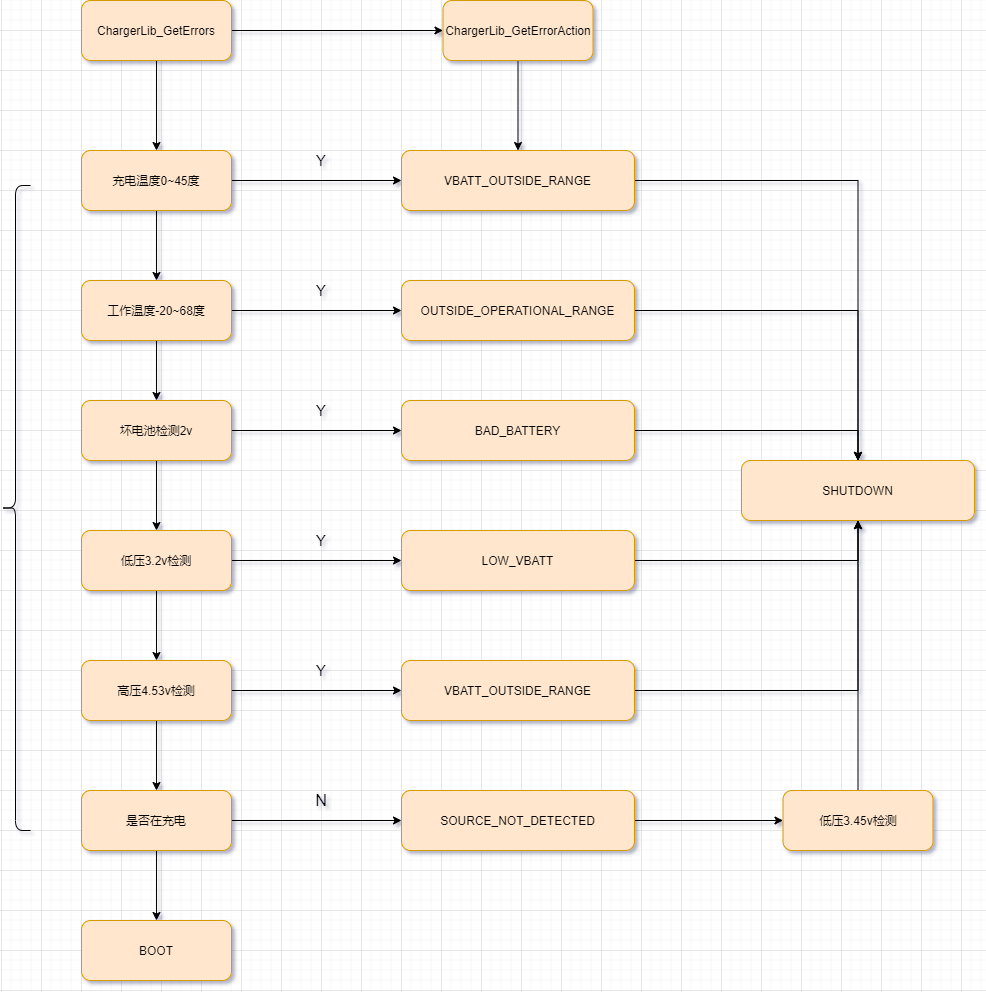

# qcom XBL阶段电池电压检测流程

看一下xbl阶段电池电压检测流程。

# 流程图



# APP程序流程

* 循环监控充电状态 QcomChargerApp_MonitorCharging()
```c
* QcomChargerApp_Entry //入口函数
  └── QcomChargerApp_MonitorCharging() //循环检测
      ├── pQcomChargerProtocol->GetChargingAction(&ChargingAction, &ChargerActionInfo, TRUE); //获取执行的结果ChargingAction,TRUE表示vbattChecking检测电池
      ├── QcomChargerAppEvent_HandleDispBattSymbol(); //获取要显示的图片
      │   ├── Status = pQcomChargerProtocol->GetDisplayImageType(&DispImageType); //调用驱动GetDisplayImageType获取图片
      │   └── QcomChargerAppEvent_DispBattSymbol(DispImageType); //显示图片类型
      │       └── EFI_QcomChargerGetDisplayImageType //QcomCharger.c
      │           └── ChargerLib_GetDisplayImageType((CHARGERLIB_EVENT_DISP_IMAGE_TYPE *)pDispImage) // ChargerLibCommon.c
      │               └── ChargerLibTarget_GetDisplayImageType(pDispImage); //ChargerLibTarget.c
      │                   └── *pDispImage = gDispImage; //重要，下面分析
      └── switch(ChargingAction) //执行开机或者关机动作
          ├── case EFI_QCOM_CHARGER_ACTION_GOOD_TO_BOOT: // 开机
          │   ├── QcomChargerAppEvent_DisplayPanelOn(); /* Turn display panel ON */
          │   └── ExitChargingLoop = TRUE;
          └── case EFI_QCOM_CHARGER_ACTION_SHUTDOWN: //关机
              └── Status = pQcomChargerProtocol->TakeAction(ChargingAction, &ChargerActionInfo); 
```
从上图得知，app开启循环检测，`GetChargingAction`是最重要的。

# 驱动程序流程

* 首先看一下XBL阶段驱动流程是怎样的：
```c
* QcomChargerInitialize //驱动入口
  * gBS->InstallMultipleProtocolInterfaces( &ImageHandle, &gQcomChargerProtocolGuid, &QcomChargerProtocolImplementation, NULL ); //供app调用，包含GetChargingAction
  * ChargerPlatform_Init(); //一些电池的初始化
```
看上去很简单，主要是供app调用的。

# GetChargingAction流程

* `SocPkg/AgattiPkg/Settings/Charger/QcomChargerConfig_VbattTh.cfg`:首先看一下电池的相关参数：
```shell
#Lowest Voltage at which device should shutdown gracefully
#value in mV
EmergencyShutdownVbatt = 3200

#Boot device to HLOS in case of unsupported battery or battery emulator. In millivolt*/
BootToHLOSThresholdInMv = 3450
BootToHLOSThresholdInMv_M9200 = 3200

#//[NEW FEATURE]-BEGIN by wugangnan@paxsz.com 2022-09-17, add bad battery check function
BadBatteryThresholdInMv = 2000
#//[NEW FEATURE]-END by wugangnan@paxsz.com 2022-09-17, add bad battery check function

#fastboot下载要求最小电压
SWFlashMinBattVoltageMv = 3500

[PlatformMTP]
## Parameter values with respect to MTP Platform (Platform 1)
# Configure FVMax and Fcc values
ChgFvMax  = 4400
ChgFccMax = 2000
# Configure Battery Voltage and Current limit
#[BUGFIX]-BEGIN by (wugangnan@paxsz.com), 2022/09/21 Since the Bat_P pin is connected to Vsys,
#the maximum voltage of battery detection will be increased, and the detection threshold needs to be increased
#BattVoltLimHighDelta = 30
BattVoltLimHighDelta = 130

# Configure limits for Battery Temperature (For negative values, use negative sign. Ex: -30)
JeitaCriticalTempLowLimit = -20
JeitaHardColdLimit = 0
JeitaSoftColdLimit = 10
JeitaSoftHotLimit  = 40
JeitaHardHotLimit  = 45
JeitaCriticalTempHighLimit = 60

#Program device Skin and Charger Hot threhsolds
ProgramSkinAndChargerHotThreshold = FALSE
DeviceSkinHotInC    = 70
DeviceSkinTooHotInC = 80
ChargerHotInC       = 80
ChargerTooHotInC    = 90

## TSENS ##
#High Temperature limit for thermal wait
TsensHighTemp = 85
#High Temperature limit for battey and device safety (battery disconnect)
TsensExtremeTemp = 90
#Low Temperature limit for end of thermal wait
TsensLowTemp = 75
# Give up time in thermal wait for battery disconnect - support up to 60min
TsensTimeoutMins = 90
```

* 软件流程：
```c
* ChargerPlatform_GetChargingAction()
  ├── ChargerLib_GetErrors(vbattChecking, &ErrorType);
  │   ├── Status = ChargerLib_GetBatteryPresence(&BatteryPresent);
  │   ├── if(EFI_SUCCESS == ChargerLib_GetBatteryTempStatus(&BattTempStatus))//Check battery temperature related errors
  │   │   ├── Status = ChargerLib_GetBatteryStatus(&BatteryStatus);
  │   │   │   └── ChargerLibTarget_GetBatteryStatus(pBatteryStatus); //ChargerLibCommon.c
  │   │   │       └── PmicQgProtocol->GetBatteryStatus(BatteryGaugeInfo.QGaugePmicInfo.PmicIndex,(EFI_PM_QG_BATT_STATUS_INFO *)&BatteryStatus); //  ChargerLibTarget.c
  │   │   │           └── PmicQg_GetBatteryStatus(PmicDeviceIndex, &stsInfo); //PmicQgProtocol.c
  │   │   │               └── PmicQg_GetBatteryStatus(PmicDeviceIndex, &stsInfo); //这里是调用的最底层接口，获取电池电压电流温度
  │   │   │                   ├── errFlag = pm_qgauge_get_vbat(PmicDeviceIndex, &VBat);
  │   │   │                   ├── BattStsInfo->BatteryVoltage = VBat;
  │   │   │                   ├── errFlag |= pm_qgauge_get_ibat(PmicDeviceIndex, &ibat);
  │   │   │                   ├── BattStsInfo->ChargeCurrent = ibat;
  │   │   │                   ├── errFlag |= PmicQg_ReadBattTemp(&BattTemp);
  │   │   │                   └── BattStsInfo->BatteryTemperature = BattTemp;
  │   │   ├── if((TRUE == HwJeitaStatus.JeitaHardCold) || (TRUE == HwJeitaStatus.JeitaHardHot))
  │   │   │   └── *pBattTempStatus = ChargerLib_Batt_Temp_OutsideChargingRange; //电池超过充电温度 0 ~ 45度
  │   │   ├── if(( BatteryStatus.BatteryTemperature < gChargerLibCfgData.fg_cfg_data.HwJeitaThreshold.JeitaCriticalTempLowLimit) ||
  │   │   └── ( BatteryStatus.BatteryTemperature > gChargerLibCfgData.fg_cfg_data.HwJeitaThreshold.JeitaCriticalTempHighLimit))
  │   │       └── *pBattTempStatus = ChargerLib_Batt_Temp_OutsideOperationalRange; //如果电池超过68度或者小于-20度
  │   ├── if(ChargerLib_Batt_Temp_OutsideOperationalRange == BattTempStatus)
  │   │   └── *pChargingError = CHARGERLIB_CHARGING_ERROR_BATT_TEMP_OUTSIDE_OPERATIONAL_RANGE; //电池超过工作温度
  │   │       └── return Status; //Got Critical error, return
  │   └── if (vbattChecking)
  │       ├── if(EFI_SUCCESS == ChargerLib_GetBatteryVoltageStatus(&BattVoltageStatus))
  │       │   ├── if(ChargerLib_VBatt_BelowThresholdBad == BattVoltageStatus) //电池电压小于2v
  │       │   │   └── *pChargingError = CHARGERLIB_CHARGING_ERROR_BAD_BATTERY; //坏电池
  │       │   ├── if(ChargerLib_VBatt_TooHigh == BattVoltageStatus) //电池电压过高 高于ChgFvMax + BattVoltLimHighDelta 目前是4.53v
  │       │   │   └── *pChargingError = CHARGERLIB_CHARGING_ERROR_VBATT_OUTSIDE_RANGE;
  │       │   └── else if(ChargerLib_VBatt_BelowThreshold == BattVoltageStatus) //电压过低 这里是小于3.2v
  │       │       └── *pChargingError = CHARGERLIB_CHARGING_ERROR_LOW_VBATT;
  │       └── Status = ChargerLib_GetChargingPath(&AttachedCharger); //获取充电状态
  │           ├── ChargerLibTarget_GetChargingPath(ChargingPath);
  │           │   └── PmicSchgProtocol->UsbinValid(ChargerInfo.ChargerPmicInfo.PmicIndex, &IsInputValid);
  │           ├── if ((CHARGERLIB_ATTACHED_CHGR__BATT == AttachedCharger) || (CHARGERLIB_ATTACHED_CHGR__NONE == AttachedCharger)) //没充电
  │           │   └── *pChargingError = CHARGERLIB_CHARGING_ERROR_CHARGING_SOURCE_NOT_DETECTED;
  │           └── if(ChargerLib_Batt_Temp_OutsideChargingRange == BattTempStatus) //电池超过充电温度
  │               └── *pChargingError = CHARGERLIB_CHARGING_ERROR_BATT_TEMP_OUTSIDE_CHARGING_RANGE;
  ├── if((CHARGERLIB_CHARGING_ERROR_BATTERY_NOT_DETECTED == ErrorType ) || (CHARGERLIB_CHARGING_ERROR_DEBUG_BOARD == ErrorType ) ||
  │   ├── Status = ChargerLib_GetErrorAction(ErrorType, (((CHARGERLIB_ERROR_ACTION_TYPE*)pActionType))); //除了电池电压判断一下，其他action都保持原样
  │   │   └── ChargerLibTarget_GetErrorAction(ChargingErrorType, pErrorAction);
  │   │       ├── DEBUG((EFI_D_ERROR, "not charging, Is USB Online:%X \n", AttachedCharger));
  │   │       └── switch (ChargingErrorType)
  │   │           ├── case CHARGERLIB_CHARGING_ERROR_BATTERY_NOT_DETECTED: //没检测到电池直接关机，这里我们模块的vbat_p连接的是vsys，所以无法判断。
  │   │           │   ├── gDispImage = CHARGERLIB_EVENT_DISP_IMAGE_NOBATTERY;
  │   │           │   └── *pErrorAction = CHARGERLIB_ERROR_ACTION_SHUTDOWN;
  │   │           ├── case CHARGERLIB_CHARGING_ERROR_BATT_TEMP_OUTSIDE_OPERATIONAL_RANGE: //电池超过工作温度直接关机
  │   │           │   └── *pErrorAction = CHARGERLIB_ERROR_ACTION_CRITICAL_SHUTDOWN;
  │   │           ├── case CHARGERLIB_CHARGING_ERROR_ADC_ERROR:
  │   │           ├── case CHARGERLIB_CHARGING_ERROR_FG_ERROR:
  │   │           ├── case CHARGERLIB_CHARGING_ERROR_VBATT_OUTSIDE_RANGE: //高压4.53v以上
  │   │           ├── case CHARGERLIB_CHARGING_ERROR_CHARGING_TIMEOUT:
  │   │           ├── case CHARGERLIB_DEVICE_ERROR:
  │   │           │   └── *pErrorAction = CHARGERLIB_ERROR_ACTION_SHUTDOWN;
  │   │           ├── case CHARGERLIB_CHARGING_ERROR_CHARGING_SOURCE_NOT_DETECTED:
  │   │           │   ├── if(BatteryStatus.BatteryVoltage < gChargerLibTargetCfgData.boot_to_hlos_threshold_in_mv) //不充电情况下，电池电压小于3.45v
  │   │           │   │   ├── gDispImage = CHARGERLIB_EVENT_DISP_IMAGE_NOCHARGER; //重要   显示无充电器画面
  │   │           │   │   └── *pErrorAction = CHARGERLIB_ERROR_ACTION_SHUTDOWN; //action是关机
  │   │           │   └── else
  │   │           │       └── *pErrorAction = CHARGERLIB_ERROR_ACTION_GOOD_TO_BOOT; //正常启动
  │   │           └── case CHARGERLIB_CHARGING_ERROR_LOW_VBATT://小于3.2v也是直接关机
  │   │               └── *pErrorAction = CHARGERLIB_ERROR_ACTION_SHUTDOWN_USB_DC_PON_DISABLED;
  │   ├── PrevChargerAction = *pActionType;
  │   └── return Status; //如果没充电直接返回
  ├── Status = ChargerLib_GetChargingPath(&pChargerActionInfo->ChargerAttached); //查看充电状态
  └── if (((QCOM_CHARGER_PLATFORM_CHARGER_ATTACHED_USB == pChargerActionInfo->ChargerAttached))) //如果是充电状态
      ├── *pActionType = EFI_QCOM_CHARGER_ACTION_START_CHARGING;
      ├── *pActionType = EFI_QCOM_CHARGER_ACTION_GOOD_TO_BOOT; //目前是直接开机启动
      └── Pax_ChargerEnable(TRUE); //使能charger ic充电
```
* 上面可以看到以下逻辑：
  * 由于`sw_thermal_mitigation_enable`thermal相关的宏没打开，只进行电池电压/温度判断，没有对thermal判断。