# 概述

简单记录下梦源逻辑分析仪和示波器简单实用方法。

# 参考

* [梦源产品展示](http://www.dslogic.cn/Products-13299878.html)
* [0002_DSview中文使用手册.pdf](refers/0002_DSview中文使用手册.pdf)
* [I2C通信协议详解和通信流程分析](https://blog.csdn.net/weixin_42031299/article/details/123602636)

# 产品介绍

目前公司买的是U2BASIC版本，性能描述如下：

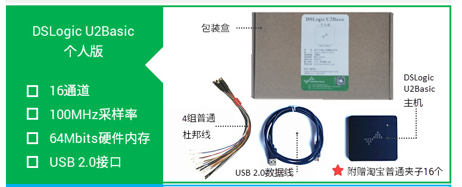

支持协议列表：

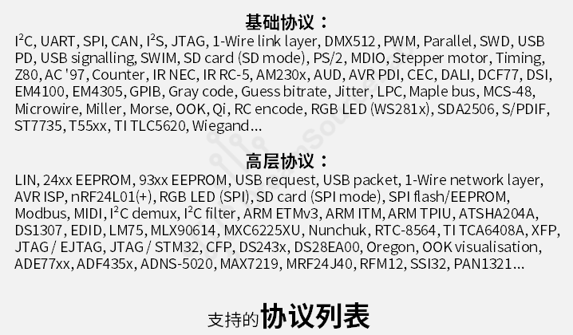

# 软件下载地址

https://www.dreamsourcelab.com/download/

# 使用方法

## 硬件选项

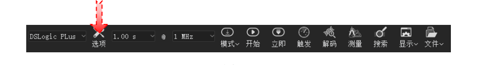

不同的硬件设备，设备选项窗口的具体内容也会不同，对于 DSLogic 设备，
会出现如下图（图 2-6） 所示的硬件选项设置窗口：
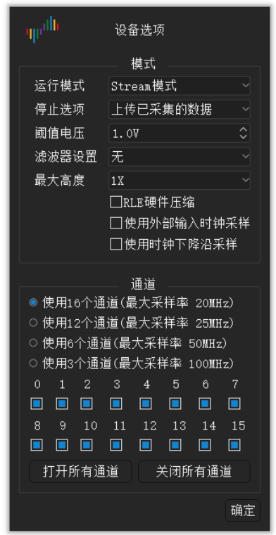

* 运行模式：
  * Buffer 模式： 采集过程中，数据存储在板载内存中，采集完成后通过 usb传输到 PC。这种模式有两个优点，第一，板载内存带宽高，不受 usb 带宽限制，从而可以到达更高的采样率；第二，由于采集和传输不是同时进行的，所以对usb 传输速度没有硬性要求，极大的提高了传输的稳定性， 避免了数据传输错误，或者标称的采样率达不到的情况； 此模式的不足之处在于，板载内存的大小相对较小，采样深度会受到影响。 DSView 在此模式下支持 RLE 硬件压缩来扩展采样深度，对于跳变较少的信号，可以获得非常高的压缩比，在一定程度上弥补了采样深度的不足。
  * Stream 模式： 采集过程中，数据实时传输到 PC 内存中。这种模式采样深度不受板载内存限制，不过采样带宽受 usb 传输带宽的限制，所以采样率较低。对于速率较低的信号，想要获取较大的采样深度的情况，可使用此模式。
  * 内部测试： 此模式仅作测试使用。

  ## 采样时长与采样频率

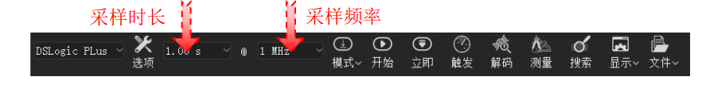

### 采样时长

如上图所示，前一个选项框表示采样的时间长度， 不同模式/采样率/通道数的设置下，采样时长有不同的范围。
* Buffer 模式： 最大时长 = 硬件内存大小 / 采样率 / 通道数。 例如， DSLogic Plus 设备具有 256Mbits 硬件内存, 所以在 100M 采样率 16 通道设置下, 最大的采样时长为 167.77 毫秒; 在 400M 采样率 1 通道设置下, 最大的采样时长为 671.09 毫秒. 如果开启 RLE 硬件压缩功能，可以达到更大的采样时长，不过这取决于被采集信号变化量的多少。
* Stream 模式： 最大时长（64 位版本） = 16G / 采样率。例如， 1M 采样率，最大采样时长为 4.77 小时； 100M 采样率， 最大采样时长为 2.86 分钟。

### 采样频率

如上图所示，后一个选项框表示每通道的采样频率， 不同模式下有效的采样频率有所不同。
* Buffer 模式：
  * 100M@16 通道： 10KHz~100MHz
  * 200M@8 通道： 10KHz~200MHz
  * 400M@4 通道： 10KHz~400MHz
* Stream 模式：
  * 100M@3 通道： 10KHz~100MHz
  * 50M@6 通道： 10KHz~50MHz
  * 25M@12 通道： 10KHz~25MHz
  * 20M@16 通道： 10KHz~20MHz
通常情况下，采样频率需要设置为被测信号最高频率的 4x-10x 倍。例如采样115200 波特率的串口信号，采样率通常设置为 1MHz，采样 50MHz 的 SPI 信号，采样率可以设置为 400MHz。当然，采样率越高，获取的采样结果的分辨率越高，也越接近真实的信号。

## 触发设置
设置触发条件后， 如果被测信号的波形不满足设定条件，采样过程会一直等待，直到满足设定条件后，才可完成当前采样。触发可以帮助我们捕获想要观察的特定时刻的信号， 是逻辑分析仪最重要的特性之一。 DSView 支持两种触发模式：简单触发和高级触发。

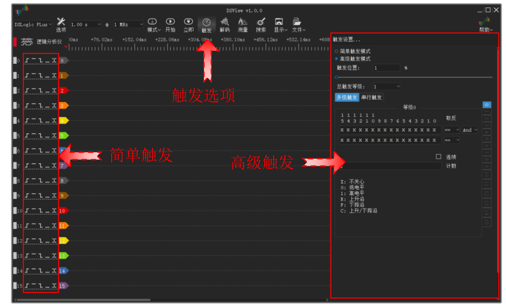

每个通道的触发含义如下图（图 2-11）所示：

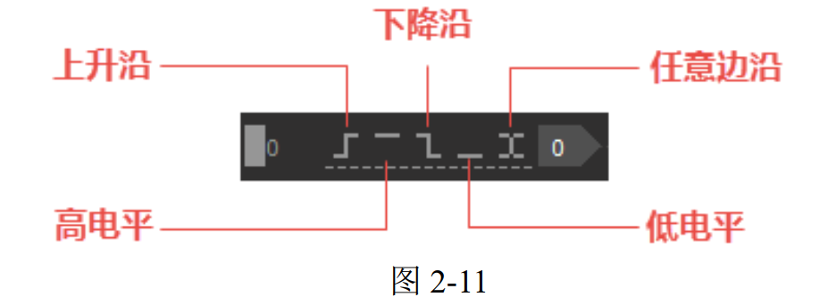

## 采集模式

如图 2-21 所示， DSView 支持两种运行模式：单次采集和重复采集。

* 单次采集： 在这个模式下，采集操作只会被执行一次。当采样时长达到时，采集会自动停止。
* 重复采集： 在这个模式下，采集操作会被自动重复执行，直到按下停止按钮。结合触发条件的设置，这个模式可以帮助我们持续观察特定事件下的波形，而不用任何人工的干预。例如每次重启，或者每次按键等等。另外，此模式支持每次采样间隔时间的定义（从 1s 到 10s）。

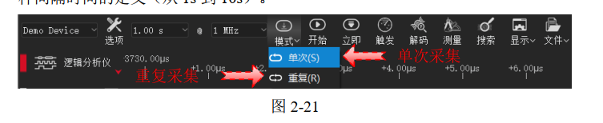

## 协议解码

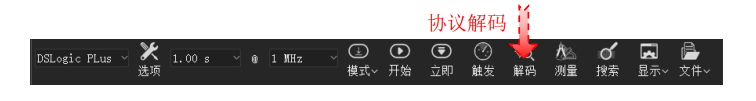

单击解码按钮即可调出协议解码窗口，协议解码窗口主要分为两个部分，协议选择和设置以及解码结果列表显示区域，如下图（图 2-44）所示。

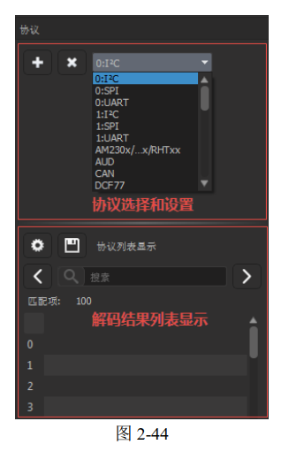

### 添加协议

在协议列表框中选择需要添加的协议名称， 单击协议面板的“+” 号按钮，就会跳出协议的设置窗口，包括协议的显示、 通道、 参数以及解码区域设置。如下图（图 2-45）所示， 设置好相应参数之后，点击确定按钮，即可成功添加新的协议。如果有多个协议需要添加，依次选中添加即可。

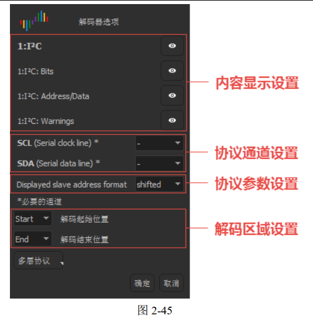

## 数据保存

数据保存可以把当前采集到的数据保存成 DSView 软件可解析的文件格式，以便重新使用 DSView 打开查看相应波形。

## 数据打开

DSView 只支持打开自己保存的后缀为 dsl 的文件。单击“打开” 菜单，选择需要载入的数据文件即可。

## 数据导出

DSView 支持把当前数据导出到通用文件格式，以便使用其他软件处理数据。在逻辑分析仪模式下， 目前支持的导出格式包括： csv， vcd 以及 gnuplot 等。

## 截屏

如果希望把当前界面保存成图片格式，可以选择截屏操作。单击“截屏”菜单， 将保存当前的界面图形为 PNG 格式的文件。

# 实例分析

## I2C读取实例

下图是对从地址0x3f(7bit)设备0x13寄存器读取到值为0x80。

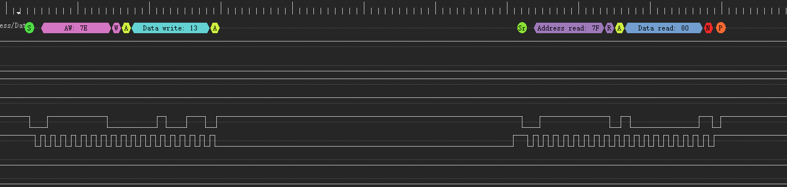

分析如下：

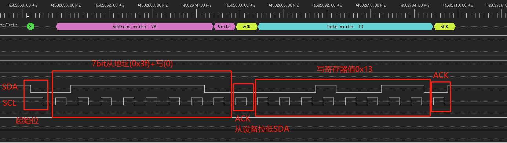
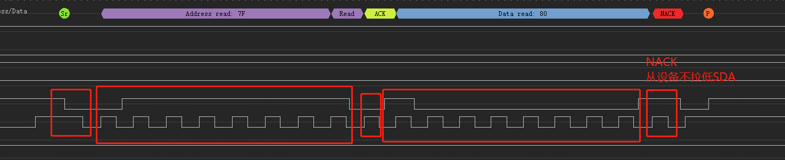

## 示波器使用介绍

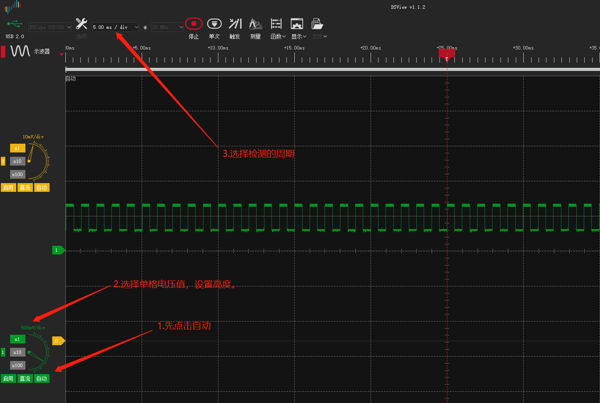