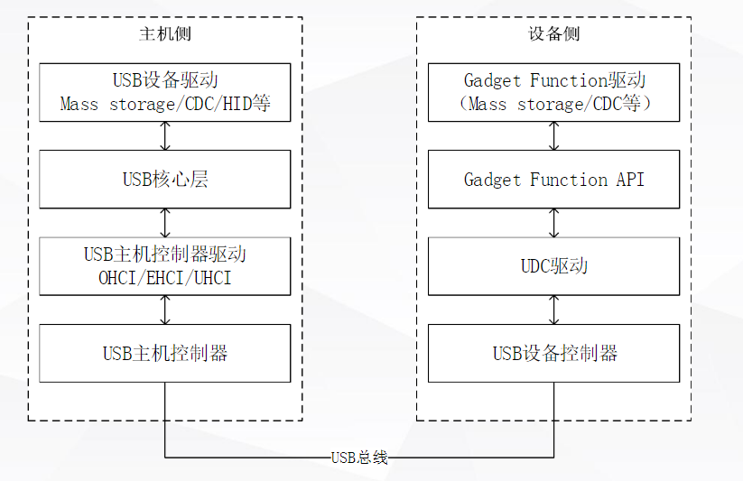
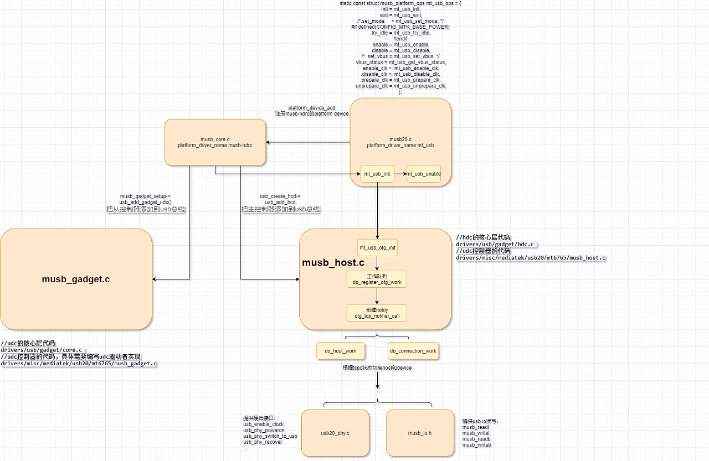
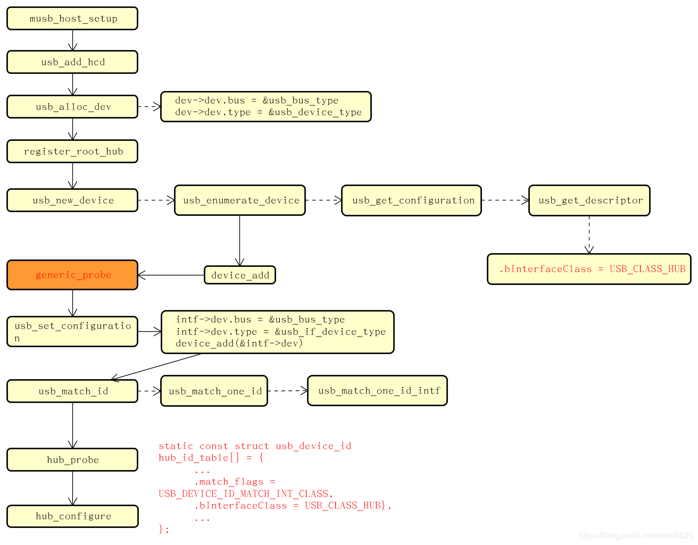
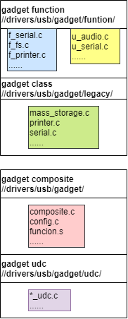

# README

musb驱动分析。

# refers

* [USB驱动之二控制器驱动(musb)](https://blog.csdn.net/mike8825/article/details/103756462)
* [musb 0619](https://blog.csdn.net/Decisiveness/article/details/51714871)
* [mtk OTG驱动分析](https://www.cnblogs.com/wen123456/p/14036543.html)
* [musb_core.c 是usb_general.c 调用进musb模块的核心函数](https://blog.csdn.net/metuu/article/details/17227285)
* [Linux设备模型(8)——platform设备](https://blog.csdn.net/fang_yang_wa/article/details/112618516)
* [devm_ioremap_resource devm_ioremap 区别](https://blog.csdn.net/weixin_46485500/article/details/118752708?spm=1001.2101.3001.6650.6&utm_medium=distribute.pc_relevant.none-task-blog-2%7Edefault%7EBlogCommendFromBaidu%7ERate-6-118752708-blog-78184395.pc_relevant_antiscanv2&depth_1-utm_source=distribute.pc_relevant.none-task-blog-2%7Edefault%7EBlogCommendFromBaidu%7ERate-6-118752708-blog-78184395.pc_relevant_antiscanv2&utm_relevant_index=8)
* [Linux USB](https://blog.csdn.net/u013836909/category_9808058.html)
* Multipoint USB Highspeed Dual-Role Controller (MUSB HDRC) 
* HCD(host controller device/主)
  * OHCI(open host controller inferface)
  * UHCI(universal host controller interface)
  * EHCI(enhanced host controller interface)
  * xHCI(eXtensible Host Controller Interface)
* UDC(usb device controllerr/从)

# 名词解释

这里就简单列一下各种xHCI（也包括真正的xHCI）的基本含义吧。

简单地讲，OHCI、UHCI都是USB1.1的接口标准，而EHCI是对应USB2.0的接口标准，最新的xHCI是USB3.0的接口标准。
* 1. OHCI（Open Host Controller Interface）是支持USB1.1的标准，但它不仅仅是针对USB，还支持其他的一些接口，比如它还支持Apple的火线（Firewire，IEEE 1394）接口。与UHCI相比，OHCI的硬件复杂，硬件做的事情更多，所以实现对应的软件驱动的任务，就相对较简单。主要用于非x86的USB，如扩展卡、嵌入式开发板的USB主控。
* 2. UHCI（Universal Host Controller Interface），是Intel主导的对USB1.0、1.1的接口标准，与OHCI不兼容。UHCI的软件驱动的任务重，需要做得比较复杂，但可以使用较便宜、较简单的硬件的USB控制器。Intel和VIA使用UHCI，而其余的硬件提供商使用OHCI。
* 3. EHCI（Enhanced Host Controller Interface），是Intel主导的USB2.0的接口标准。EHCI仅提供USB2.0的高速功能，而依靠UHCI或OHCI来提供对全速（full-speed）或低速（low-speed）设备的支持。
* 4. xHCI（eXtensible Host Controller Interface），是最新最火的USB3.0的接口标准，它在速度、节能、虚拟化等方面都比前面3中有了较大的提高。xHCI 支持所有种类速度的USB设备（USB 3.0 SuperSpeed, USB 2.0 Low-, Full-, and High-speed, USB 1.1 Low- and Full-speed）。xHCI的目的是为了替换前面3中（UHCI/OHCI/EHCI）。

# 整体架构




整个 USB 系统的通讯模型如上图所示，

# cfg信息

* cfg:
```
CONFIG_USB_MTK_HDRC=y
CONFIG_MTK_MUSB_QMU_SUPPORT=y
CONFIG_MTK_MUSB_QMU_PURE_ZLP_SUPPORT=y
CONFIG_MTK_MUSB_DRV_36BIT=y
CONFIG_USB_MTK_OTG=y
```

* Kconfig:

```C++
涉及文件：
wugn@jcrj-tf-compile:kernel-4.19$ cd drivers/misc/mediatek/usb20/
wugn@jcrj-tf-compile:usb20$ tree
.
├── Kconfig
├── Makefile
├── mt6765
│   ├── Makefile
│   ├── mtk-phy-a60810.h
│   ├── otg.c
│   ├── usb20.c
│   ├── usb20.h
│   ├── usb20_host.c
│   ├── usb20_otg_if.c
│   ├── usb20_phy.c
│   └── usb20_phy_debugfs.c
├── mtk_dual_role.c
├── mtk_musb.h
├── mtk_musb_reg.h
├── mtk_qmu.c
├── mtk_qmu.h
├── musb_core.c //入口驱动
├── musb_core.h
├── musb_debugfs.c
├── musb_debug.h
├── musb_dma.h
├── musb_gadget.c //从控制器
├── musb_gadget_ep0.c
├── musb_gadget.h
├── musb.h
├── musb_host.c //主控制器
├── musb_host.h
├── musbhsdma.c
├── musbhsdma.h
├── musb_io.h
├── musb_qmu.c
├── musb_qmu.h
└── musb_virthub.c

#Platform
obj-$(CONFIG_MACH_MT6765) += $(subst ",,$(CONFIG_MTK_PLATFORM))/    就是mt6765文件

#Driver
obj-$(CONFIG_USB_MTK_HDRC) += musb_hdrc.o
musb_hdrc-$(CONFIG_USB_MTK_HDRC) := musb_core.o
musb_hdrc-$(CONFIG_USB_MTK_HDRC) += musb_gadget_ep0.o musb_gadget.o
musb_hdrc-$(CONFIG_USB_MTK_HDRC) += musb_virthub.o musb_host.o
musb_hdrc-$(CONFIG_USB_MTK_HDRC) += musbhsdma.o

# QMU Realted
obj-$(CONFIG_MTK_MUSB_QMU_SUPPORT) += mtk_qmu.o musb_qmu.o
ifeq ($(CONFIG_MTK_MUSB_QMU_SUPPORT),y)
subdir-ccflags-$(CONFIG_MACH_MT8163) += -DMUSB_QMU_LIMIT_SUPPORT -DMUSB_QMU_LIMIT_RXQ_NUM=4 -DMUSB_QMU_LIMIT_TXQ_NUM=4
endif
ifeq ($(CONFIG_MTK_MUSB_QMU_SUPPORT),y)
subdir-ccflags-$(CONFIG_MACH_MT8167) += -DMUSB_QMU_LIMIT_SUPPORT -DMUSB_QMU_LIMIT_RXQ_NUM=4 -DMUSB_QMU_LIMIT_TXQ_NUM=4
endif
```

* dts：

```C++
usb: usb0@11200000 {
        compatible = "mediatek,mt6765-usb20";
        reg = <0 0x11200000 0 0x10000>,
                <0 0x11CC0000 0 0x10000>;
        interrupts = <GIC_SPI 73 IRQ_TYPE_LEVEL_LOW>;
        mode = <2>;
        multipoint = <1>;
        num_eps = <16>;
        clocks = <&infracfg_ao CLK_IFR_ICUSB>,
                <&topckgen CLK_TOP_USB_TOP_SEL>,
                <&topckgen CLK_TOP_UNIVPLL3_D4>;
        clock-names = "usb0",
                "usb0_clk_top_sel",
                "usb0_clk_univpll3_d4";
        charger = <&mt6370_chg>;
};

修改usb驱动能力：
&usb {
    usb_tuning {
        compatible = "mediatek,phy_tuning";
        u2_vrt_ref = <7>;
        u2_term_ref = <0>;
    };
};

默认host模式：
&usb {
        bootmode = <&chosen>;
        default_mode = <1>; //0-device mode, 1-host mode
        pogo_dev_detect_type = <2>;
};
```

# 软件流程

总体流程图如下：



## musb_core注册过程

`musb_core.c`platform driver注册如下，名称为musb-hdrc:

```C++
#define MUSB_DRIVER_NAME "musb-hdrc"
const char musb_driver_name[] = MUSB_DRIVER_NAME;
static struct platform_driver musb_driver = {
	.driver = {
		   .name = (char *)musb_driver_name,
		   .bus = &platform_bus_type,
#if (!defined(CONFIG_MACH_MT2701)) && (!defined(CONFIG_ARCH_MT7623))
			.of_match_table = apusb_of_ids,
#endif
			.owner = THIS_MODULE,
		   .pm = MUSB_DEV_PM_OPS,
		   },
	.probe = musb_probe,
	.remove = musb_remove,
	.shutdown = musb_shutdown,
};

/*-------------------------------------------------------------------------*/

static int __init musb_init(void)
{
	if (usb_disabled())
		return 0;

	pr_info("%s: version " MUSB_VERSION ", ?dma?, otg (peripheral+host)\n"
		, musb_driver_name);
	return platform_driver_register(&musb_driver);
}
```

## usb20注册musb-hdrc（musb_core）的platform device

```C++
首先注册platform驱动为mt_usb：

static struct platform_driver mt_usb_driver = {
	.remove = mt_usb_remove,
	.probe = mt_usb_probe,
	.driver = {
		.name = "mt_usb",
		.of_match_table = apusb_of_ids,
	},
};

static int __init usb20_init(void)
{
	int ret;

	DBG(0, "usb20 init\n");

#ifdef CONFIG_MTK_USB2JTAG_SUPPORT
	if (usb2jtag_mode()) {
		pr_notice("[USB2JTAG] in usb2jtag mode, not to initialize usb driver\n");
		return 0;
	}
#endif

	ret = platform_driver_register(&mt_usb_driver);

#ifdef FPGA_PLATFORM
	add_usb_i2c_driver();
#endif

	DBG(0, "usb20 init ret:%d\n", ret);
	return ret;
}
```
probe中注册musb-hdrc驱动(usb_core)的platform_device，最主要目的是让musb-hdrc驱动能够调用mt_usb_ops操作mtk平台usb：

```C++
发现mt_usb platform_device包含有musb-hdrc的platform_device:
PAYPHONEM50:/sys/devices/platform/mt_usb/musb-hdrc # ls -l
total 0
-rw-rw-r-- 1 root system 4096 2010-01-01 00:00 cmode
lrwxrwxrwx 1 root root      0 2022-06-24 08:06 driver -> ../../../../bus/platform/drivers/musb-hdrc
-rw-r--r-- 1 root root   4096 2022-06-24 08:06 driver_override
drwxr-xr-x 3 root root      0 2010-01-01 00:00 gadget
-r--r--r-- 1 root root   4096 2022-06-24 08:06 modalias
-r--r--r-- 1 root root   4096 2022-06-24 08:06 pools
drwxr-xr-x 2 root root      0 2010-01-01 00:00 power
lrwxrwxrwx 1 root root      0 2022-06-24 08:06 subsystem -> ../../../../bus/platform
drwxr-xr-x 3 root root      0 2010-01-01 00:00 udc
-rw-r--r-- 1 root root   4096 2010-01-01 00:00 uevent
drwxr-xr-x 5 root root      0 2010-01-01 00:00 usb1

static const struct musb_platform_ops mt_usb_ops = {
	.init = mt_usb_init,
	.exit = mt_usb_exit,
	/*.set_mode     = mt_usb_set_mode, */
#if defined(CONFIG_MTK_BASE_POWER)
	.try_idle = mt_usb_try_idle,
#endif
	.enable = mt_usb_enable,
	.disable = mt_usb_disable,
	/* .set_vbus = mt_usb_set_vbus, */
	.vbus_status = mt_usb_get_vbus_status,
	.enable_clk =  mt_usb_enable_clk,
	.disable_clk =  mt_usb_disable_clk,
	.prepare_clk = mt_usb_prepare_clk,
	.unprepare_clk = mt_usb_unprepare_clk,
};

static int mt_usb_probe(struct platform_device *pdev)
{
    struct musb_hdrc_platform_data *pdata = pdev->dev.platform_data;

    musb = platform_device_alloc("musb-hdrc", PLATFORM_DEVID_NONE); //动态分配musb-hdrcd的一个struct platform_device变量。
	if (!musb) {
		dev_notice(&pdev->dev, "failed to allocate musb device\n");
		goto err1;
	}

	usb_phy_base = of_iomap(np, 1);
	pdata = devm_kzalloc(&pdev->dev, sizeof(*pdata), GFP_KERNEL);
	if (!pdata) {
		dev_notice(&pdev->dev, "failed to allocate musb platform data\n");
		goto err2;
	}

	config = devm_kzalloc(&pdev->dev, sizeof(*config), GFP_KERNEL);
	if (!config) {
		/* dev_notice(&pdev->dev,
		 * "failed to allocate musb hdrc config\n");
		 */
		goto err2;
	}

	pdata->config = config;

	musb->dev.parent = &pdev->dev;
	musb->dev.dma_mask = &mt_usb_dmamask;
	musb->dev.coherent_dma_mask = mt_usb_dmamask;

	pdev->dev.dma_mask = &mt_usb_dmamask;
	pdev->dev.coherent_dma_mask = mt_usb_dmamask;
	arch_setup_dma_ops(&musb->dev, 0, mt_usb_dmamask, NULL, 0);

	glue->dev = &pdev->dev;
	glue->musb = musb; //glue作为

	pdata->platform_ops = &mt_usb_ops;

	ret = device_rename(&pdev->dev, "mt_usb"); //名字改回来了
	if (ret)
		dev_notice(&pdev->dev, "failed to rename\n");
	/*
	 * fix uaf(use afer free) issue:backup pdev->name,
	 * device_rename will free pdev->name
	 */
	pdev->name = pdev->dev.kobj.name;

	platform_set_drvdata(pdev, glue);

	ret = platform_device_add_resources(musb,
				pdev->resource, pdev->num_resources); //向platform device中增加资源描述。
	if (ret) {
		dev_notice(&pdev->dev, "failed to add resources\n");
		goto err2;
	}

	ret = platform_device_add_data(musb, pdata, sizeof(*pdata)); //向platform device中添加自定义的数据，最主要是的mt_usb_ops
	if (ret) {
		dev_notice(&pdev->dev, "failed to add platform_data\n");
		goto err2;
	}

	ret = platform_device_add(musb);// 注册musb-hdrc的platform device

	if (ret) {
		dev_notice(&pdev->dev, "failed to register musb device\n");
		goto err2;
	}
}
```

## musb_core.c和musb20.c关系及probe流程

1.在mt6765目录下的usb20.c中的mt_usb_probe函数中,musb_hdrc_platform_data类型的结构中的指针成员platform_ops指向musb_platform_ops类型的mt_usb_ops结构。
2.之后通过platform_device_add_data函数将platform device结构中的device结构中的指针platform_data成员指向musb_hdrc_platform_data类型的结构。
```C++
static int mt_usb_probe(struct platform_device *pdev)
{
    struct musb_hdrc_platform_data *pdata = pdev->dev.platform_data;

pdata->platform_ops = &mt_usb_ops;
ret = platform_device_add_data(musb, pdata, sizeof(*pdata)); //向platform device中添加自定义的数据，最主要是的mt_usb_ops

}
```

3.在musb core驱动的musb_probe中根据platform_device结构（就是usb20.c中的mt musb controller），获得这个结构中的device类型结构给musb_init_controller，在这个函数中，根据参数device类型的结构中的platform_data指针得到一个musb_hdrc_platform_data类型的结构，这个结构中有一个musb_hdrc_config类型的成员，根据这个成员和musb controller寄存器起始地址，通过allocate_instance创建一个musb结构。创建这个musb结构时，设置musb中的mregs成员为参数中的musb controller寄存器base address。然后在musb_init_controller函数中，将分配得到的musb结构中的musb_platform_ops类型的成员ops设置为musb_hdrc_platform_data中的platform_ops指针。然后根据musb执行musb_platform_init。

在这个函数中，执行musb中的musb_platform_ops类型的成员ops中的init函数。

```C++
* musb_probe(struct platform_device *pdev)
  * iomem = platform_get_resource(pdev, IORESOURCE_MEM, 0);
  * base = devm_ioremap(dev, iomem->start, resource_size(iomem)); //上面两段程序能够获取usb20.c驱动里面的ops，也就是申请并映射usb20.c驱动的device resource
  * musb_init_controller(dev, irq, base, pbase); //获得这个结构中的device类型结构dev给musb_init_controller
    * struct musb_hdrc_platform_data *plat = dev->platform_data; //根据参数device类型的结构中的platform_data指针得到一个musb_hdrc_platform_data类型的结构
    * musb = allocate_instance(dev, plat->config, ctrl); //创建musb结构？？
      * hcd = usb_create_hcd(&musb_hc_driver, dev, dev_name(dev));  //实例化主控制器，musb_host.c
      * musb = hcd_to_musb(hcd);
      * musb->mregs = mbase; //设置musb中的mregs成员为参数中的musb controller寄存器base address
    * musb->ops = plat->platform_ops; //将分配得到的musb结构中的musb_platform_ops类型的成员ops设置为musb_hdrc_platform_data中的platform_ops指针
    * musb->default_mode = plat->default_mode; //设置默认模式
    * musb_platform_prepare_clk(musb);
      * musb->ops->prepare_clk(musb);
        * .prepare_clk = mt_usb_prepare_clk, //usb20.c mt_usb_ops
    * musb_core_init(plat->config->multipoint? MUSB_CONTROLLER_MHDRC : MUSB_CONTROLLER_HDRC, musb);/* setup musb parts of the core (especially endpoints) */
      * .init = mt_usb_init,//usb20.c mt_usb_ops 非常重要
    * musb_platform_enable(musb);
      * .enable = mt_usb_enable,
```

## musb_core musb_core_init流程

前面讲了usb20注册musb-hdrc（musb_core）的platform device，这样musb_core就能调用到usb20的ops，musb_core_init就是调用musb20驱动里面的mt_usb_init函数，具体看看：

```C++
static int __init mt_usb_init(struct musb *musb)
{
	int ret;

	DBG(1, "%s\n", __func__);

	usb_phy_generic_register();
	musb->xceiv = usb_get_phy(USB_PHY_TYPE_USB2);

	if (IS_ERR_OR_NULL(musb->xceiv)) {
		DBG(0, "[MUSB] usb_get_phy error!!\n");
		return -EPROBE_DEFER;
	}

	musb->dma_irq = (int)SHARE_IRQ;
	musb->fifo_cfg = fifo_cfg;
	musb->fifo_cfg_size = ARRAY_SIZE(fifo_cfg);
	musb->dyn_fifo = true;
	musb->power = false;
	musb->is_host = false;
	musb->fifo_size = 8 * 1024;
#ifndef FPGA_PLATFORM
	musb->usb_rev6_setting = usb_rev6_setting;
#endif

	musb->usb_lock = wakeup_source_register(NULL, "USB suspend lock");

#ifndef FPGA_PLATFORM
	reg_vusb = regulator_get(musb->controller, "vusb");
	if (!IS_ERR(reg_vusb)) {
#ifdef NEVER
#define	VUSB33_VOL_MIN 3070000
#define	VUSB33_VOL_MAX 3070000
		ret = regulator_set_voltage(reg_vusb,
					VUSB33_VOL_MIN, VUSB33_VOL_MAX); //设置usb vbus电压范围
		if (ret < 0)
			pr_notice("regulator set vol failed: %d\n", ret);
		else
			DBG(0, "regulator set vol ok, <%d,%d>\n",
					VUSB33_VOL_MIN, VUSB33_VOL_MAX);
#endif /* NEVER */
		ret = regulator_enable(reg_vusb); //使能
		if (ret < 0) {
			pr_notice("regulator_enable vusb failed: %d\n", ret);
			regulator_put(reg_vusb);
		}
	} else
		pr_notice("regulator_get vusb failed\n");


	reg_va12 = regulator_get(musb->controller, "va12");
	if (!IS_ERR(reg_va12)) {
		ret = regulator_enable(reg_va12);
		if (ret < 0) {
			pr_notice("regulator_enable va12 failed: %d\n", ret);
			regulator_put(reg_va12);
		}
	} else
		pr_notice("regulator_get va12 failed\n");

#endif

	ret = device_create_file(musb->controller, &dev_attr_cmode);

	/* mt_usb_enable(musb); */

	musb->isr = mt_usb_interrupt;  //配置usb中断函数
	musb_writel(musb->mregs,
			MUSB_HSDMA_INTR, 0xff |
			(0xff << DMA_INTR_UNMASK_SET_OFFSET));
	DBG(1, "musb platform init %x\n",
			musb_readl(musb->mregs, MUSB_HSDMA_INTR));

#ifdef CONFIG_MTK_MUSB_QMU_SUPPORT
	/* FIXME, workaround for device_qmu + host_dma */
	musb_writel(musb->mregs,
			USB_L1INTM,
		    TX_INT_STATUS |
		    RX_INT_STATUS |
		    USBCOM_INT_STATUS |
		    DMA_INT_STATUS |
		    QINT_STATUS);
#else
	musb_writel(musb->mregs,
			USB_L1INTM,
		    TX_INT_STATUS |
		    RX_INT_STATUS |
		    USBCOM_INT_STATUS |
		    DMA_INT_STATUS);
#endif
#if defined(CONFIG_MTK_BASE_POWER)
	timer_setup(&musb->idle_timer, musb_do_idle, 0);
#endif
#ifdef CONFIG_USB_MTK_OTG
	mt_usb_otg_init(musb); //这里很重要，使能otg功能，也就是根据cc/id脚切换device/host
#endif
#ifdef CONFIG_MACH_MT6761
	/* only for mt6761 */
	usb_sram_init();
#endif
	mt_usb_psy_init(musb); //这里也是
	return 0;
}
```

### mt_usb_interrupt中断函数

这里是处理usb中断的，包括irq sources (phy, dma, etc)，这块暂时没研究。
```C++
static irqreturn_t mt_usb_interrupt(int irq, void *dev_id)
{
	irqreturn_t tmp_status;
	irqreturn_t status = IRQ_NONE;
	struct musb *musb = (struct musb *)dev_id;
	u32 usb_l1_ints;
	unsigned long flags;

	spin_lock_irqsave(&musb->lock, flags);
	usb_l1_ints = musb_readl(musb->mregs, USB_L1INTS) &
		musb_readl(mtk_musb->mregs, USB_L1INTM);
	DBG(1, "usb interrupt assert %x %x  %x %x %x %x %x\n", usb_l1_ints,
	    musb_readl(mtk_musb->mregs, USB_L1INTM),
	    musb_readb(musb->mregs, MUSB_INTRUSBE),
		musb_readw(musb->mregs, MUSB_INTRTX),
		musb_readw(musb->mregs, MUSB_INTRTXE),
		musb_readw(musb->mregs, MUSB_INTRRX),
		musb_readw(musb->mregs, MUSB_INTRRXE));

	if ((usb_l1_ints & TX_INT_STATUS) || (usb_l1_ints & RX_INT_STATUS)
	    || (usb_l1_ints & USBCOM_INT_STATUS)
#ifdef CONFIG_MTK_MUSB_QMU_SUPPORT
	    || (usb_l1_ints & QINT_STATUS)
#endif
	   ) {
		tmp_status = generic_interrupt(irq, musb);
		if (tmp_status != IRQ_NONE)
			status = tmp_status;
	}
	spin_unlock_irqrestore(&musb->lock, flags);

	/* FIXME, workaround for device_qmu + host_dma */
/* #ifndef CONFIG_MTK_MUSB_QMU_SUPPORT */
	if (usb_l1_ints & DMA_INT_STATUS) {
		tmp_status = dma_controller_irq(irq, musb->dma_controller);
		if (tmp_status != IRQ_NONE)
			status = tmp_status;
	}

	return status;

}

* generic_interrupt(int irq, void *__hci)
  * musb_interrupt(musb);

/*
 * handle all the irqs defined by the HDRC core. for now we expect:  other
 * irq sources (phy, dma, etc) will be handled first, musb->int_* values
 * will be assigned, and the irq will already have been acked.
 *
 * called in irq context with spinlock held, irqs blocked
 */
irqreturn_t musb_interrupt(struct musb *musb)
{
	irqreturn_t retval = IRQ_NONE;
	u8 devctl;
	int ep_num;
	u32 reg;

	devctl = musb_readb(musb->mregs, MUSB_DEVCTL);
#ifdef CONFIG_MTK_MUSB_QMU_SUPPORT
	DBG(1, "usb(%x) tx(%x) rx(%x) queue(%x)\n",
		musb->int_usb, musb->int_tx, musb->int_rx, musb->int_queue);
#else
	DBG(1, "** IRQ %s usb%04x tx%04x rx%04x\n",
	    (devctl & MUSB_DEVCTL_HM) ? "host" : "peripheral",
	    musb->int_usb, musb->int_tx, musb->int_rx);
#endif

	dumpTime(funcInterrupt, 0);

	if (unlikely(!musb->softconnect && !(devctl & MUSB_DEVCTL_HM))) {
		DBG(0, "!softconnect, IRQ usb%04x tx%04x rx%04x\n",
			musb->int_usb, musb->int_tx, musb->int_rx);
		return IRQ_HANDLED;
	}

	/* the core can interrupt us for multiple reasons; docs have
	 * a generic interrupt flowchart to follow
	 */
	if (musb->int_usb)
		retval |= musb_stage0_irq(musb, musb->int_usb, devctl);

	/* "stage 1" is handling endpoint irqs */

	/* handle endpoint 0 first */
	if (musb->int_tx & 1) {
		if (devctl & MUSB_DEVCTL_HM)
			retval |= musb_h_ep0_irq(musb);
		else
			retval |= musb_g_ep0_irq(musb);
	}

	if (unlikely(!musb->power))
		return IRQ_HANDLED;

#ifdef CONFIG_MTK_MUSB_QMU_SUPPORT
	/* process generic queue interrupt */
	if (musb->int_queue) {
		musb_q_irq(musb);
		retval = IRQ_HANDLED;
	}
#endif

	/* FIXME, workaround for device_qmu + host_dma */
/* #ifndef MUSB_QMU_SUPPORT */
	/* RX on endpoints 1-15 */
	reg = musb->int_rx >> 1;
	ep_num = 1;
	while (reg) {
		if (reg & 1) {
			/* musb_ep_select(musb->mregs, ep_num); */
			/* REVISIT just retval = ep->rx_irq(...) */
			retval = IRQ_HANDLED;
			if (devctl & MUSB_DEVCTL_HM)
				musb_host_rx(musb, ep_num);
			else
				musb_g_rx(musb, ep_num);
		}

		reg >>= 1;
		ep_num++;
	}

	/* TX on endpoints 1-15 */
	reg = musb->int_tx >> 1;
	ep_num = 1;
	while (reg) {
		if (reg & 1) {
			/* musb_ep_select(musb->mregs, ep_num); */
			/* REVISIT just retval |= ep->tx_irq(...) */
			retval = IRQ_HANDLED;
			if (devctl & MUSB_DEVCTL_HM) {
				bool skip_tx = false;
				static DEFINE_RATELIMIT_STATE(rlmt, HZ, 2);
				static int skip_cnt;

				if (musb_host_db_enable && host_tx_refcnt_dec(ep_num) < 0) {
					int ref_cnt;

					musb_host_db_workaround_cnt++;
					ref_cnt = host_tx_refcnt_inc(ep_num);

					if (__ratelimit(&rlmt)) {
						DBG(0,
							"unexpect TX <%d,%d,%d>\n",
							ep_num, ref_cnt,
							skip_cnt);
						dump_tx_ops(ep_num);
						skip_cnt = 0;
					} else
						skip_cnt++;

					skip_tx = true;
				}

				if (likely(!skip_tx))
					musb_host_tx(musb, ep_num);
			} else
				musb_g_tx(musb, ep_num);
		}
		reg >>= 1;
		ep_num++;
	}

	return retval;
}
```


### otg初始化(mt_usb_otg_init)

接下来看看mt_usb_otg_init，使能otg功能，也就是根据cc/id脚切换device/host，这里定义了CONFIG_TCPC_CLASS，也就是用的typec的cc脚切主从，不会跑iddig_int_init函数，
```C++
void mt_usb_otg_init(struct musb *musb)
{
	/* test */
	INIT_DELAYED_WORK(&host_plug_test_work, do_host_plug_test_work);
	ktime_start = ktime_get();

	/* CONNECTION MANAGEMENT*/
#ifdef CONFIG_MTK_USB_TYPEC
	DBG(0, "host controlled by TYPEC\n");
	typec_control = 1;
#ifdef CONFIG_TCPC_CLASS
	INIT_DELAYED_WORK(&register_otg_work, do_register_otg_work);
/* Add-BEGIN by (shanliangliang@paxsz.com), 2021/08/27 fix notifier reigister too late */
	schedule_delayed_work(&register_otg_work,
			msecs_to_jiffies(REGISTER_OTG_WORK_DELAY)); //重要，调用do_register_otg_work工作队列
/* Add-END by (shanliangliang@paxsz.com), 2021/08/27 fix notifier reigister too late */
	vbus_control = 0;
#endif
#else
	DBG(0, "host controlled by IDDIG\n");
	iddig_int_init();
	vbus_control = 1;
#endif

	/* EP table */
	musb->fifo_cfg_host = fifo_cfg_host;
	musb->fifo_cfg_host_size = ARRAY_SIZE(fifo_cfg_host);

	/* Add-BEGIN by (shanliangliang@paxsz.com), 2021/08/15 add for M8 usb otg */
	if (musb->default_mode == MUSB_HOST) {
		mt_usb_host_connect(0);   //默认dts如果定义了host，则使能host
	}
	musb->lcd_state = FB_BLANK_UNBLANK;
	fb_register_client(&musb_fb_notifier);

	musb_chg_dev_init(musb);
	/* Add-END by (shanliangliang@paxsz.com), 2021/08/15 add for M8 usb otg */

}
```
### do_register_otg_work注册notify监听tcpc

1.获取typec设备名称type_c_port0，获取不到就反复schedule_delayed_work调用本身获取。
2.通过register_tcp_dev_notifier注册监听vbus和usb状态。
```C++
#define TCPC_OTG_DEV_NAME "type_c_port0"
static void do_register_otg_work(struct work_struct *data)
{
/* Add-BEGIN by (shanliangliang@paxsz.com), 2021/08/27 fix notifier reigister too late */
#define REGISTER_OTG_WORK_DELAY 200
/* Add-END by (shanliangliang@paxsz.com), 2021/08/27 fix notifier reigister too late */
	static int ret;

	if (!otg_tcpc_dev)
		otg_tcpc_dev = tcpc_dev_get_by_name(TCPC_OTG_DEV_NAME);

	if (!otg_tcpc_dev) {
		DBG(0, "get type_c_port0 fail\n");
/* Add-BEGIN by (shanliangliang@paxsz.com), 2021/08/27 fix notifier reigister too late */
#if 0
		queue_delayed_work(mtk_musb->st_wq, &register_otg_work,
				msecs_to_jiffies(REGISTER_OTG_WORK_DELAY));
#else
		schedule_delayed_work(&register_otg_work,
				msecs_to_jiffies(REGISTER_OTG_WORK_DELAY));
#endif
/* Add-END by (shanliangliang@paxsz.com), 2021/08/27 fix notifier reigister too late */
		return;
	}

	otg_nb.notifier_call = otg_tcp_notifier_call;
	ret = register_tcp_dev_notifier(otg_tcpc_dev, &otg_nb,
		TCP_NOTIFY_TYPE_VBUS | TCP_NOTIFY_TYPE_USB |
		TCP_NOTIFY_TYPE_MISC);
	if (ret < 0) {
		DBG(0, "register OTG <%p> fail\n", otg_tcpc_dev);
/* Add-BEGIN by (shanliangliang@paxsz.com), 2021/08/27 fix notifier reigister too late */
#if 0
		queue_delayed_work(mtk_musb->st_wq, &register_otg_work,
				msecs_to_jiffies(REGISTER_OTG_WORK_DELAY));
#else
		schedule_delayed_work(&register_otg_work,
				msecs_to_jiffies(REGISTER_OTG_WORK_DELAY));
#endif
/* Add-END by (shanliangliang@paxsz.com), 2021/08/27 fix notifier reigister too late */
		return;
	}

	DBG(0, "register OTG <%p> ok\n", otg_tcpc_dev);
}
```

监听函数如下：

这个地方是就是根据cc状态控制usb vbus和otg功能的，具体解释可以参考文档

[usb_switch](..\..\..\0002_usb_switch\docs\0001_USB_SWITCH功能介绍.md)

```C++
static int otg_tcp_notifier_call(struct notifier_block *nb,
		unsigned long event, void *data)
{
	struct tcp_notify *noti = data;

	switch (event) {
	case TCP_NOTIFY_SOURCE_VBUS:
		DBG(0, "source vbus = %dmv\n", noti->vbus_state.mv);
		if (noti->vbus_state.mv)
			mt_usb_vbus_on(0);
		else
			mt_usb_vbus_off(0);
		break;
	case TCP_NOTIFY_TYPEC_STATE:
		DBG(0, "TCP_NOTIFY_TYPEC_STATE, old_state=%d, new_state=%d\n",
				noti->typec_state.old_state,
				noti->typec_state.new_state);

		/* Add-BEGIN by (shanliangliang@paxsz.com), 2021/08/15 add for M8 usb otg */
		mtk_musb->typec_state = noti->typec_state.new_state;
		/* Add-END by (shanliangliang@paxsz.com), 2021/08/15 add for M8 usb otg */

		if (noti->typec_state.old_state == TYPEC_UNATTACHED &&
			noti->typec_state.new_state == TYPEC_ATTACHED_SRC) {
			DBG(0, "OTG Plug in\n");
			mt_usb_dev_disconnect();
			mt_usb_host_connect(100);
		/* Add-BEGIN by (shanliangliang@paxsz.com), 2021/09/23 add for M8 usb otg */
		} else if (noti->typec_state.old_state == TYPEC_UNATTACHED &&
			noti->typec_state.new_state == TYPEC_ATTACHED_SNK) {
			if (!((mtk_musb->pogo_dev_detect_type == POGO_DETECT_BY_EXT_PIN) && (mtk_musb->pogo_dev_state == POGO_DEV_STATE_ONLINE))) {
				mt_usb_host_disconnect(0);
				mt_usb_connect();
			}
		/* Add-END by (shanliangliang@paxsz.com), 2021/09/23 add for M8 usb otg */
		} else if ((noti->typec_state.old_state == TYPEC_ATTACHED_SRC ||
			noti->typec_state.old_state == TYPEC_ATTACHED_SNK ||
			noti->typec_state.old_state ==
					TYPEC_ATTACHED_NORP_SRC) &&
			noti->typec_state.new_state == TYPEC_UNATTACHED) {
			/* Add-BEGIN by (shanliangliang@paxsz.com), 2021/08/15 add for M8 usb otg */
				if (mtk_musb->default_mode != MUSB_HOST) {
					if (is_host_active(mtk_musb)) {
						DBG(0, "OTG Plug out\n");
						mt_usb_host_disconnect(0);
					} else {
						DBG(0, "USB Plug out\n");
						mt_usb_dev_disconnect();
					}

					if (mtk_musb->pogo_dev_detect_type != POGO_DETECT_BY_CC) {
						if (mtk_musb->r15_state == R15_STATUS_ONLINE) {
							mt_usb_host_connect(100);
						}
					}
				}
				else {
					if ((noti->typec_state.old_state != TYPEC_ATTACHED_SRC) && 
							(noti->typec_state.new_state == TYPEC_UNATTACHED)) {
						if (is_host_active(mtk_musb)) {
							//DBG(0, "OTG Plug out\n");
							//mt_usb_host_disconnect(0);
						} else {
							DBG(0, "USB Plug out\n");
							mt_usb_dev_disconnect();
						}
						
						if (mtk_musb->lcd_state != FB_BLANK_POWERDOWN) {
							msleep(50);
							mt_usb_host_connect(100);
						}
					}
					else if ((noti->typec_state.old_state == TYPEC_ATTACHED_SRC) && 
							(noti->typec_state.new_state == TYPEC_UNATTACHED)) {
						if (mtk_musb->lcd_state == FB_BLANK_POWERDOWN) {
							if (is_host_active(mtk_musb)) {
								DBG(0, "OTG Plug out\n");
								mt_usb_host_disconnect(10000);
							} else {
								DBG(0, "USB Plug out\n");
								mt_usb_dev_disconnect();
							}
						}
					}
				}

				if (mtk_musb->pogo_dev_detect_type == POGO_DETECT_BY_CC) {
					if (mtk_musb->r15_state == R15_STATUS_ONLINE) {
						mtk_musb->r15_state = R15_STATUS_OFFLINE;
					}
				}

		/* Add-END by (shanliangliang@paxsz.com), 2021/08/15 add for M8 usb otg */
#ifdef CONFIG_MTK_UART_USB_SWITCH
		} else if ((noti->typec_state.new_state ==
					TYPEC_ATTACHED_SNK ||
				noti->typec_state.new_state ==
					TYPEC_ATTACHED_CUSTOM_SRC ||
				noti->typec_state.new_state ==
					TYPEC_ATTACHED_NORP_SRC) &&
				in_uart_mode) {
			pr_info("%s USB cable plugged-in in UART mode.
					Switch to USB mode.\n", __func__);
			usb_phy_switch_to_usb();
#endif
		}
		break;
	case TCP_NOTIFY_DR_SWAP:
		DBG(0, "TCP_NOTIFY_DR_SWAP, new role=%d\n",
				noti->swap_state.new_role);
		if (is_host_active(mtk_musb) &&
			noti->swap_state.new_role == PD_ROLE_UFP) {
			if (!((mtk_musb->default_mode == MUSB_HOST) && (mtk_musb->usb_type == POWER_SUPPLY_USB_TYPE_DCP))) {
				DBG(0, "switch role to device\n");
				mt_usb_host_disconnect(0);
				mt_usb_connect();
			}
		} else if (is_peripheral_active(mtk_musb) &&
			noti->swap_state.new_role == PD_ROLE_DFP) {
			DBG(0, "switch role to host\n");
			mt_usb_dev_disconnect();
			mt_usb_host_connect(100);
		}
		break;
	}
	return NOTIFY_OK;
}
```

#### host/device切换底层原理

可以看到主要是以下几种切换逻辑：

```C++
dev -> host
mt_usb_dev_disconnect();
mt_usb_host_connect(100);

host -> dev
mt_usb_host_disconnect(0);
mt_usb_connect();

host Plug out:
mt_usb_host_disconnect(0);

dev Plog out:
mt_usb_dev_disconnect();
```

##### 1.device切换原理

device的connect和disconnect都是通过issue_connection_work(CONNECTION_OPS_CONN)实现的，看一下具体内容：

```C++
usb操作主要有以下三种：
/* specific USB operation */
enum CONNECTION_OPS {
	CONNECTION_OPS_DISC = 0,
	CONNECTION_OPS_CHECK,
	CONNECTION_OPS_CONN
};
```

1.usb_prepare_clock初始化时钟。
2.usb_connected状态是读取charger bc1.2检测，如果检测到是dcp sdp则表示连接上，这个仅供检查使用(CONNECTION_OPS_CHECK)。
3.is_host，如果这个时候要切host，则立即返回。
4.如果是CONNECTION_OPS_CONN指令则enable interrupts, dma, etc，否则disable interrupts, dma, etc。

```C++
static void issue_connection_work(int ops)
{
	struct mt_usb_work *work;

	if (!mtk_musb) {
		DBG(0, "mtk_musb = NULL\n");
		return;
	}
	/* create and prepare worker */
	work = kzalloc(sizeof(struct mt_usb_work), GFP_ATOMIC);
	if (!work) {
		DBG(0, "wrap is NULL, directly return\n");
		return;
	}
	work->ops = ops;
	INIT_DELAYED_WORK(&work->dwork, do_connection_work);
	/* issue connection work */
	DBG(0, "issue work, ops<%d>\n", ops);
	queue_delayed_work(mtk_musb->st_wq, &work->dwork, 0);
}

void do_connection_work(struct work_struct *data)
{
	unsigned long flags = 0;
	int usb_clk_state = NO_CHANGE;
	bool usb_on, usb_connected;
	struct mt_usb_work *work =
		container_of(data, struct mt_usb_work, dwork.work);

	DBG(0, "is_host<%d>, power<%d>, ops<%d>\n",
		mtk_musb->is_host, mtk_musb->power, work->ops);

	/* always prepare clock and check if need to unprepater later */
	/* clk_prepare_cnt +1 here*/
	usb_prepare_clock(true); //第一步

	/* be aware this could not be used in non-sleep context */
	usb_connected = usb_cable_connected(mtk_musb);

	/* additional check operation here */
	if (musb_force_on)
		usb_on = true;
	else if (work->ops == CONNECTION_OPS_CHECK)
		usb_on = usb_connected;
	else
		usb_on = (work->ops ==
			CONNECTION_OPS_CONN ? true : false); //一般是走这里

	if (cmode_effect_on())
		usb_on = false;
	/* additional check operation done */

	spin_lock_irqsave(&mtk_musb->lock, flags);

	if (mtk_musb->is_host) {//如果这个时候要切host，则立即返回
		DBG(0, "is host, return\n");
		goto exit;
	}

#ifdef CONFIG_MTK_UART_USB_SWITCH
	if (in_uart_mode) {
		DBG(0, "in uart mode, return\n");
		goto exit;
	}
#endif

	if (!mtk_musb->power && (usb_on == true)) {
		/* enable usb */
		if (!mtk_musb->usb_lock->active) {
			__pm_stay_awake(mtk_musb->usb_lock);
			DBG(0, "lock\n");
		} else {
			DBG(0, "already lock\n");
		}

		/* note this already put SOFTCON */
		musb_start(mtk_musb); //重要
		usb_clk_state = OFF_TO_ON;

	} else if (mtk_musb->power && (usb_on == false)) {
		/* disable usb */
		musb_stop(mtk_musb); //重要
		if (mtk_musb->usb_lock->active) {
			DBG(0, "unlock\n");
			__pm_relax(mtk_musb->usb_lock);
		} else {
			DBG(0, "lock not active\n");
		}
		usb_clk_state = ON_TO_OFF;
	} else
		DBG(0, "do nothing, usb_on:%d, power:%d\n",
				usb_on, mtk_musb->power);
exit:
	spin_unlock_irqrestore(&mtk_musb->lock, flags);

	if (usb_clk_state == ON_TO_OFF) {
		/* clock on -> of: clk_prepare_cnt -2 */
		usb_prepare_clock(false);
		usb_prepare_clock(false);
	} else if (usb_clk_state == NO_CHANGE) {
		/* clock no change : clk_prepare_cnt -1 */
		usb_prepare_clock(false);
	}

	/* free mt_usb_work */
	kfree(work);
}

bool usb_cable_connected(struct musb *musb)
{
	struct power_supply *psy;
	union power_supply_propval pval;
	union power_supply_propval tval;
	int ret;

	/* workaround to register psy again */
	if (IS_ERR_OR_NULL(musb->usb_psy)) {
		DBG(0, "usb_psy not ready\n");
		if (mt_usb_psy_init(musb))
			return false;
	}

	psy = musb->usb_psy;
	ret = power_supply_get_property(psy,
				POWER_SUPPLY_PROP_ONLINE, &pval);
	if (ret != 0) {
		DBG(0, "failed to get psy prop, ret=%d\n", ret);
		return false;
	}

	ret = power_supply_get_property(psy,
				POWER_SUPPLY_PROP_USB_TYPE, &tval);
	if (ret != 0) {
		DBG(0, "failed to get psy prop, ret=%d\n", ret);
		return false;
	}

	DBG(0, "online=%d, type=%d\n", pval.intval, tval.intval);

	if (pval.intval && (tval.intval == POWER_SUPPLY_USB_TYPE_SDP ||
			tval.intval == POWER_SUPPLY_USB_TYPE_CDP))
		return true;
	else
		return false;
}

/*-------------------------------------------------------------------------*/

/*
 * Program the HDRC to start (enable interrupts, dma, etc.).
 */
void musb_start(struct musb *musb)
{
	void __iomem *regs = musb->mregs;
	int vbusdet_retry = 5;

	u8 intrusbe;

	DBG(0, "start, is_host=%d is_active=%d\n",
			musb->is_host, musb->is_active);

	musb_platform_enable(musb);
	musb_platform_reset(musb);
	musb_generic_disable(musb);

	intrusbe = musb_readb(regs, MUSB_INTRUSBE);
	if (musb->is_host) {
		musb->intrtxe = 0xffff;
		musb->intrrxe = 0xfffe;
		intrusbe = 0xf7;

		while (!musb_platform_get_vbus_status(musb)) { //看原函数直接return true，没啥用
			mdelay(100);
			if (vbusdet_retry-- <= 1) {
				DBG(0, "VBUS detection fail!\n");
				break;
			}
		}

	} else if (!musb->is_host) {
		/* enable ep0 interrupt */
		musb->intrtxe = 0x1;
		musb->intrrxe = 0;
		/* device mode enable reset interrupt */
		intrusbe |= MUSB_INTR_RESET;
#if defined(CONFIG_USBIF_COMPLIANCE)
		/* device mode enable connect interrupt */
		intrusbe |= MUSB_INTR_CONNECT;
#endif
	}

	musb_writew(regs, MUSB_INTRTXE, musb->intrtxe);
	musb_writew(regs, MUSB_INTRRXE, musb->intrrxe);
	musb_writeb(regs, MUSB_INTRUSBE, intrusbe);

	/* In U2 host mode, USB bus will issue
	 * Babble INT if it was interfered by
	 * external signal,ex:drill nosie.
	 * we need to keep session on and continue
	 * to seed SOF,and same time let hw don't
	 * care the babble signal
	 * remove babble: NOISE_STILL_SOF:1, BABBLE_CLR_EN:0
	 */
	intrusbe = musb_readb(regs, MUSB_ULPI_REG_DATA);
	intrusbe = intrusbe | 0x80;
	intrusbe = intrusbe & 0xbf;
	musb_writeb(regs, MUSB_ULPI_REG_DATA, intrusbe);
	DBG(0, "set ignore babble MUSB_ULPI_REG_DATA=%x\n",
			musb_readb(regs, MUSB_ULPI_REG_DATA));

	{
		u8 val = MUSB_POWER_ENSUSPEND;

		if (musb_speed)
			val |= MUSB_POWER_HSENAB;
		if (musb->softconnect) {
			DBG(0, "add softconn\n");
			val |= MUSB_POWER_SOFTCONN;
		}
		musb_writeb(regs, MUSB_POWER, val);
	}

	if (musb->is_host)
		musb->is_active = 0;
	else
		musb->is_active = 1;

#ifdef CONFIG_DUAL_ROLE_USB_INTF
	mt_usb_dual_role_changed(musb);
#endif
}

/*
 * Make the HDRC stop (disable interrupts, etc.);
 * reversible by musb_start
 * called on gadget driver unregister
 * with controller locked, irqs blocked
 * acts as a NOP unless some role activated the hardware
 */
void musb_stop(struct musb *musb)
{
	/* stop IRQs, timers, ... */
	musb_generic_disable(musb);

	gadget_stop(musb);

	musb_flush_dma_transcation(musb);

	musb_platform_disable(musb);
	musb->is_active = 0;
	DBG(0, "HDRC disabled\n");

	/* FIXME
	 *  - mark host and/or peripheral drivers unusable/inactive
	 *  - disable DMA (and enable it in HdrcStart)
	 *  - make sure we can musb_start() after musb_stop(); with
	 *    OTG mode, gadget driver module rmmod/modprobe cycles that
	 *  - ...
	 */
	musb_platform_try_idle(musb, 0);

#ifdef CONFIG_DUAL_ROLE_USB_INTF
	mt_usb_dual_role_changed(musb);
#endif
}
```

##### 2.host切换原理

host的connect和disconnect都是通过issue_host_work(CONNECTION_OPS_CONN)实现的，传入ops执行do_host_work工作队列：

```C++
void mt_usb_host_connect(int delay)
{
	typec_req_host = true;
	DBG(0, "%s\n", typec_req_host ? "connect" : "disconnect");
	issue_host_work(CONNECTION_OPS_CONN, delay, true);
}
void mt_usb_host_disconnect(int delay)
{
	typec_req_host = false;
	DBG(0, "%s\n", typec_req_host ? "connect" : "disconnect");
	issue_host_work(CONNECTION_OPS_DISC, delay, true);
}

static void issue_host_work(int ops, int delay, bool on_st)
{
/* Add-BEGIN by (shanliangliang@paxsz.com), 2021/10/28 modify for M8 usb host shedule work*/
	struct mt_usb_work *work = NULL;
/* Add-END by (shanliangliang@paxsz.com), 2021/10/28 modify for M8 usb host shedule work*/

	if (!mtk_musb) {
		DBG(0, "mtk_musb = NULL\n");
		return;
	}

/* Add-BEGIN by (shanliangliang@paxsz.com), 2021/10/28 modify for M8 usb host shedule work*/
#if 0
	/* create and prepare worker */
	work = kzalloc(sizeof(struct mt_usb_work), GFP_ATOMIC);
	if (!work) {
		DBG(0, "work is NULL, directly return\n");
		return;
	}
	work->ops = ops;
	INIT_DELAYED_WORK(&work->dwork, do_host_work);
#else
	if (ops == CONNECTION_OPS_DISC) {
		if (!mt_host_disconnect_work) {
			mt_host_disconnect_work = kzalloc(sizeof(struct mt_usb_work), GFP_ATOMIC);
			if (!mt_host_disconnect_work) {
				DBG(0, "work is NULL, directly return\n");
				return;
			}
			INIT_DELAYED_WORK(&mt_host_disconnect_work->dwork, do_host_work);
		}

		if (mt_host_connect_work) {
			cancel_delayed_work(&mt_host_connect_work->dwork);
		}

		work = mt_host_disconnect_work;
		work->ops = ops;
	}
	else {
		if (!mt_host_connect_work) {
			mt_host_connect_work = kzalloc(sizeof(struct mt_usb_work), GFP_ATOMIC);
			if (!mt_host_connect_work) {
				DBG(0, "work is NULL, directly return\n");
				return;
			}
			INIT_DELAYED_WORK(&mt_host_connect_work->dwork, do_host_work);
		}

		if (mt_host_disconnect_work) {
			cancel_delayed_work(&mt_host_disconnect_work->dwork);
		}

		work = mt_host_connect_work;
		work->ops = ops;
	}
#endif
/* Add-END by (shanliangliang@paxsz.com), 2021/10/28 modify for M8 usb host shedule work*/

	/* issue connection work */
	DBG(0, "issue work, ops<%d>, delay<%d>, on_st<%d>\n",
		ops, delay, on_st);

	if (on_st)
		queue_delayed_work(mtk_musb->st_wq,
					&work->dwork, msecs_to_jiffies(delay));
	else
		schedule_delayed_work(&work->dwork,
					msecs_to_jiffies(delay));
}
```

具体切换工作如下：

1.准备时钟usb_prepare_clock。
2.如果是切host，is_host先标记为1.
3.调用ep_config_from_table_for_host函数setup fifo for host mode
4.mt_usb_set_vbus(mtk_musb, 1)打开vbus，sleep一下，等vbus上电完成。
5.set_usb_phy_mode(PHY_IDLE_MODE)将phy雀环为idle模式。
6.set_usb_phy_mode(PHY_HOST_ACTIVE)切换成host模式。
7.musb_start(mtk_musb)使能enable interrupts, dma, etc。
8.断开host则2~7步骤相反。
```C++
static void do_host_work(struct work_struct *data)
{
	u8 devctl = 0;
	unsigned long flags;
	static int inited, timeout; /* default to 0 */
	static s64 diff_time;
	bool host_on;
	int usb_clk_state = NO_CHANGE;
	struct mt_usb_work *work =
		container_of(data, struct mt_usb_work, dwork.work);

	/* kernel_init_done should be set in
	 * early-init stage through init.$platform.usb.rc
	 */
	while (!inited && !kernel_init_done &&
		   !mtk_musb->is_ready && !timeout) {
		ktime_end = ktime_get();
		diff_time = ktime_to_ms(ktime_sub(ktime_end, ktime_start));

		DBG_LIMIT(3,
			"init_done:%d, is_ready:%d, inited:%d, TO:%d, diff:%lld",
			kernel_init_done,
			mtk_musb->is_ready,
			inited,
			timeout,
			diff_time);

		if (diff_time > ID_PIN_WORK_BLOCK_TIMEOUT) {
			DBG(0, "diff_time:%lld\n", diff_time);
			timeout = 1;
		}
		msleep(ID_PIN_WORK_RECHECK_TIME);
	}

	if (!inited) {
		DBG(0, "PASS,init_done:%d,is_ready:%d,inited:%d, TO:%d\n",
				kernel_init_done,  mtk_musb->is_ready,
				inited, timeout);
		inited = 1;
	}

	/* always prepare clock and check if need to unprepater later */
	/* clk_prepare_cnt +1 here */
	usb_prepare_clock(true);

	down(&mtk_musb->musb_lock);

	host_on = (work->ops ==
			CONNECTION_OPS_CONN ? true : false);

	DBG(0, "work start, is_host=%d, host_on=%d\n",
		mtk_musb->is_host, host_on);

	if (host_on && !mtk_musb->is_host) {
		/* switch to HOST state before turn on VBUS */
		MUSB_HST_MODE(mtk_musb);

		/* to make sure all event clear */
		msleep(32);
#ifdef CONFIG_MTK_UAC_POWER_SAVING
		if (!usb_on_sram) {
			int ret;

			ret = gpd_switch_to_sram(mtk_musb->controller);
			DBG(0, "gpd_switch_to_sram, ret<%d>\n", ret);
			if (ret == 0)
				usb_on_sram = 1;
		}
#endif
		/* setup fifo for host mode */
		ep_config_from_table_for_host(mtk_musb);
		__pm_stay_awake(mtk_musb->usb_lock);
		mt_usb_set_vbus(mtk_musb, 1);

		/* this make PHY operation workable */
		musb_platform_enable(mtk_musb);

		/* for no VBUS sensing IP*/

		/* wait VBUS ready */
		msleep(100);
		/* clear session*/
		devctl = musb_readb(mtk_musb->mregs, MUSB_DEVCTL);
		musb_writeb(mtk_musb->mregs,
				MUSB_DEVCTL, (devctl&(~MUSB_DEVCTL_SESSION)));
		set_usb_phy_mode(PHY_IDLE_MODE);
		/* wait */
		mdelay(5);
		/* restart session */
		devctl = musb_readb(mtk_musb->mregs, MUSB_DEVCTL);
		musb_writeb(mtk_musb->mregs,
				MUSB_DEVCTL, (devctl | MUSB_DEVCTL_SESSION));
		set_usb_phy_mode(PHY_HOST_ACTIVE);

		musb_start(mtk_musb);
		if (!typec_control && !host_plug_test_triggered)
			switch_int_to_device(mtk_musb);

		if (host_plug_test_enable && !host_plug_test_triggered)
			queue_delayed_work(mtk_musb->st_wq,
						&host_plug_test_work, 0);
		usb_clk_state = OFF_TO_ON;
	}  else if (!host_on && mtk_musb->is_host) {
		/* switch from host -> device */
		/* for device no disconnect interrupt */
		spin_lock_irqsave(&mtk_musb->lock, flags);
		if (mtk_musb->is_active) {
			DBG(0, "for not receiving disconnect interrupt\n");
			usb_hcd_resume_root_hub(musb_to_hcd(mtk_musb));
			musb_root_disconnect(mtk_musb);
		}
		spin_unlock_irqrestore(&mtk_musb->lock, flags);

		DBG(1, "devctl is %x\n",
				musb_readb(mtk_musb->mregs, MUSB_DEVCTL));
		musb_writeb(mtk_musb->mregs, MUSB_DEVCTL, 0);
		if (mtk_musb->usb_lock->active)
			__pm_relax(mtk_musb->usb_lock);

		mt_usb_set_vbus(mtk_musb, 0);

		/* for no VBUS sensing IP */
		set_usb_phy_mode(PHY_IDLE_MODE);

		musb_stop(mtk_musb);

		if (!typec_control && !host_plug_test_triggered)
			switch_int_to_host(mtk_musb);

#ifdef CONFIG_MTK_UAC_POWER_SAVING
		if (usb_on_sram) {
			gpd_switch_to_dram(mtk_musb->controller);
			usb_on_sram = 0;
		}
#endif
		/* to make sure all event clear */
		msleep(32);

		mtk_musb->xceiv->otg->state = OTG_STATE_B_IDLE;
		/* switch to DEV state after turn off VBUS */
		MUSB_DEV_MODE(mtk_musb);

		usb_clk_state = ON_TO_OFF;
	}
	DBG(0, "work end, is_host=%d\n", mtk_musb->is_host);
	up(&mtk_musb->musb_lock);

	if (usb_clk_state == ON_TO_OFF) {
		/* clock on -> of: clk_prepare_cnt -2 */
		usb_prepare_clock(false);
		usb_prepare_clock(false);
	} else if (usb_clk_state == NO_CHANGE) {
		/* clock no change : clk_prepare_cnt -1 */
		usb_prepare_clock(false);
	}

/* Add-BEGIN by (shanliangliang@paxsz.com), 2021/10/28 modify for M8 usb host shedule work*/
#if 0
	/* free mt_usb_work */
	kfree(work);
#endif
/* Add-END by (shanliangliang@paxsz.com), 2021/10/28 modify for M8 usb host shedule work*/
}
```

### mt_usb_psy_init

这里主要是notify监听charger bc1.2检测到sdp或者dcp时执行mt_usb_connect或者mt_usb_disconnect操作。

```C++
static int mt_usb_psy_init(struct musb *musb)
{
	int ret = 0;
	struct device *dev = musb->controller->parent;

	musb->usb_psy = devm_power_supply_get_by_phandle(dev, "charger");
	if (IS_ERR_OR_NULL(musb->usb_psy)) {
		DBG(0, "couldn't get usb_psy\n");
		return -EINVAL;
	}

	musb->psy_nb.notifier_call = mt_usb_psy_notifier;
	ret = power_supply_reg_notifier(&musb->psy_nb);
	if (ret)
		DBG(0, "failed to reg notifier: %d\n", ret);

	return ret;
}

static int mt_usb_psy_notifier(struct notifier_block *nb,
				unsigned long event, void *ptr)
{
	struct musb *musb = container_of(nb, struct musb, psy_nb);
	struct power_supply *psy = ptr;

	if (event == PSY_EVENT_PROP_CHANGED && psy == musb->usb_psy) {

		DBG(0, "psy=%s, event=%d", psy->desc->name, event);

		if (usb_cable_connected(musb))
			mt_usb_connect();
		else
			mt_usb_disconnect();
	}
	return NOTIFY_DONE;
}
```

## musb_core musb_init_controller简要分析

上面暂不分析了，直接借鉴一下网友写的musb_init_controller具体干了什么，注意：主要的两个函数usb_add_hcd和musb_gadget_setup暂时不讲，我也不懂。

```C++
musb_init_controller(struct device *dev, int nIrq, void __iomem *ctrl)  
{  
    int         status;  
    struct musb     *musb;  
    struct musb_hdrc_platform_data *plat = dev->platform_data;  
  
    /* The driver might handle more features than the board; OK. 
     * Fail when the board needs a feature that's not enabled. 
     */  
    if (!plat) {  
        dev_dbg(dev, "no platform_data?\n");  
        status = -ENODEV;  
        goto fail0;  
    }  
  
    switch (plat->mode) {  
    case MUSB_HOST:  
#ifdef CONFIG_USB_MUSB_HDRC_HCD  
        break;  
#else  
        goto bad_config;  
#endif  
    case MUSB_PERIPHERAL:  
#ifdef CONFIG_USB_GADGET_MUSB_HDRC  
        break;  
#else  
        goto bad_config;  
#endif  
    case MUSB_OTG:  
#ifdef CONFIG_USB_MUSB_OTG  
        break;  
#else  
bad_config:  
#endif  
    default:  
        dev_err(dev, "incompatible Kconfig role setting\n");  
        status = -EINVAL;  
        goto fail0;  
    }  
  
    /* allocate */  
    musb = allocate_instance(dev, plat->config, ctrl);    //分配实例  
    if (!musb) {  
        status = -ENOMEM;  
        goto fail0;  
    }  
  
    spin_lock_init(&musb->lock);  
    musb->board_mode = plat->mode;  
    musb->board_set_power = plat->set_power;  
    musb->set_clock = plat->set_clock;  
    musb->min_power = plat->min_power;  
  
    /* Clock usage is chip-specific ... functional clock (DaVinci, 
     * OMAP2430), or PHY ref (some TUSB6010 boards).  All this core 
     * code does is make sure a clock handle is available; platform 
     * code manages it during start/stop and suspend/resume. 
     */  
    if (plat->clock) {  
        musb->clock = clk_get(dev, plat->clock);  
        if (IS_ERR(musb->clock)) {  
            status = PTR_ERR(musb->clock);  
            musb->clock = NULL;  
            goto fail1;  
        }  
    }  
  
    /* The musb_platform_init() call: 
     *   - adjusts musb->mregs and musb->isr if needed, 
     *   - may initialize an integrated tranceiver 
     *   - initializes musb->xceiv, usually by otg_get_transceiver() 
     *   - activates clocks. 
     *   - stops powering VBUS 
     *   - assigns musb->board_set_vbus if host mode is enabled 
     * 
     * There are various transciever configurations.  Blackfin, 
     * DaVinci, TUSB60x0, and others integrate them.  OMAP3 uses 
     * external/discrete ones in various flavors (twl4030 family, 
     * isp1504, non-OTG, etc) mostly hooking up through ULPI. 
     */  
    musb->isr = generic_interrupt;                                 //赋值 musb->irq  
    status = musb_platform_init(musb);                             //初始化 musb  
    if (status < 0)  
        goto fail2;  
  
    if (!musb->isr) {  
        status = -ENODEV;  
        goto fail3;  
    }  
  
#ifndef CONFIG_MUSB_PIO_ONLY  
    if (use_dma && dev->dma_mask) {                  //屏蔽DMA  
        struct dma_controller   *c;  
  
        c = dma_controller_create(musb, musb->mregs);  
        musb->dma_controller = c;  
        if (c)  
            (void) c->start(c);  
    }  
#endif  
    /* ideally this would be abstracted in platform setup */  
    if (!is_dma_capable() || !musb->dma_controller)  
        dev->dma_mask = NULL;  
  
    /* be sure interrupts are disabled before connecting ISR */       //先关闭中断  
    musb_platform_disable(musb);  
    musb_generic_disable(musb);  
  
    /* setup musb parts of the core (especially endpoints) */  
    status = musb_core_init(plat->config->multipoint                     //这个是主要函数  
            ? MUSB_CONTROLLER_MHDRC  
            : MUSB_CONTROLLER_HDRC, musb);  
    if (status < 0)  
        goto fail3;  
  
#ifdef CONFIG_USB_MUSB_OTG  
    setup_timer(&musb->otg_timer, musb_otg_timer_func, (unsigned long) musb);  
#endif  
  
    /* Init IRQ workqueue before request_irq */  
    INIT_WORK(&musb->irq_work, musb_irq_work);                  //初始化工作队列  
  
    /* attach to the IRQ */  
    if (request_irq(nIrq, musb->isr, 0, dev_name(dev), musb)) {    //申请中断号  
        dev_err(dev, "request_irq %d failed!\n", nIrq);  
        status = -ENODEV;  
        goto fail3;  
    }  
    musb->nIrq = nIrq;  
/* FIXME this handles wakeup irqs wrong */  
    if (enable_irq_wake(nIrq) == 0) {  
        musb->irq_wake = 1;  
        device_init_wakeup(dev, 1);  
    } else {  
        musb->irq_wake = 0;  
    }  
  
    /* host side needs more setup */                   //使能host模式  
    if (is_host_enabled(musb)) {  
        struct usb_hcd  *hcd = musb_to_hcd(musb);  
  
        otg_set_host(musb->xceiv, &hcd->self);  
  
        if (is_otg_enabled(musb))  
            hcd->self.otg_port = 1;  
        musb->xceiv->host = &hcd->self;  
        hcd->power_budget = 2 * (plat->power ? : 250);  
  
        /* program PHY to use external vBus if required */  
        if (plat->extvbus) {  
            u8 busctl = musb_read_ulpi_buscontrol(musb->mregs);  
            busctl |= MUSB_ULPI_USE_EXTVBUS;  
            musb_write_ulpi_buscontrol(musb->mregs, busctl);  
        }  
    }  
  
    /* For the host-only role, we can activate right away. 
     * (We expect the ID pin to be forcibly grounded!!) 
     * Otherwise, wait till the gadget driver hooks up. 
     */  
    if (!is_otg_enabled(musb) && is_host_enabled(musb)) {         //如果使能了 OTG 模式或 host 模式  
        MUSB_HST_MODE(musb);  
        musb->xceiv->default_a = 1;  
        musb->xceiv->state = OTG_STATE_A_IDLE;  
  
        status = usb_add_hcd(musb_to_hcd(musb), -1, 0);       //把 musb 添加到 hcd（host controller driver）中  
  
        DBG(1, "%s mode, status %d, devctl %02x %c\n",  
            "HOST", status,  
            musb_readb(musb->mregs, MUSB_DEVCTL),  
            (musb_readb(musb->mregs, MUSB_DEVCTL)  
                    & MUSB_DEVCTL_BDEVICE  
                ? 'B' : 'A'));  
  
    } else /* peripheral is enabled */ {                         //如果使能了 Peripheral 模式  
        MUSB_DEV_MODE(musb);  
        musb->xceiv->default_a = 0;  
        musb->xceiv->state = OTG_STATE_B_IDLE;  
   
        status = musb_gadget_setup(musb);                    //则建立 gadget  
  
        DBG(1, "%s mode, status %d, dev%02x\n",  
            is_otg_enabled(musb) ? "OTG" : "PERIPHERAL",  
            status,  
            musb_readb(musb->mregs, MUSB_DEVCTL));  
  
    }  
    if (status < 0)  
        goto fail3;  
  
#ifdef CONFIG_SYSFS  
    status = sysfs_create_group(&musb->controller->kobj, &musb_attr_group);     //在 /sys 下建立目录  
    if (status)  
        goto fail4;  
#endif  
  
    dev_info(dev, "USB %s mode controller at %p using %s, IRQ %d\n",            //dmesg中打印消息  
            ({char *s;  
             switch (musb->board_mode) {  
             case MUSB_HOST:        s = "Host"; break;  
             case MUSB_PERIPHERAL:  s = "Peripheral"; break;  
             default:       s = "OTG"; break;  
             }; s; }),  
            ctrl,  
            (is_dma_capable() && musb->dma_controller)  
            ? "DMA" : "PIO",  
            musb->nIrq);  
  
    return 0;  
  
fail4:  
    if (!is_otg_enabled(musb) && is_host_enabled(musb))       
        usb_remove_hcd(musb_to_hcd(musb));  
    else  
        musb_gadget_cleanup(musb);  
  
fail3:  
    if (musb->irq_wake)  
        device_init_wakeup(dev, 0);  
    musb_platform_exit(musb);  
  
fail2:  
    if (musb->clock)  
        clk_put(musb->clock);  
  
fail1:  
    dev_err(musb->controller,  
        "musb_init_controller failed with status %d\n", status);  
  
    musb_free(musb);  
  
fail0:  
  
    return status;  
  
}  
```

### 1. usb_add_hcd注册主控制器HCD(host controller device/主)

参考：

* [USB驱动之二控制器驱动(musb)](https://blog.csdn.net/mike8825/article/details/103756462)

来看一下host controller是如何驱动的，软件流程如下，我们发现，他们都会去执行下面的调用：调用usb_create_hcd()来创建usb_hcd结构体；调用usb_add_hcd()来把主控制器添加到usb总线上。

```C++
* musb_init_controller(struct device *dev, int nIrq, void __iomem *ctrl)  
{
  * static struct musb *allocate_instance(...)
    {
        hcd = usb_create_hcd(&musb_hc_driver, dev, dev_name(dev));
        if (!hcd)
            return NULL;
        /* usbcore sets dev->driver_data to hcd, and sometimes uses that... */
    }

status = usb_add_hcd(musb_to_hcd(musb), -1, 0);       //把 musb 添加到 hcd（host controller driver）中  
}

musb_host.c:
const struct hc_driver musb_hc_driver = {
	.description = "musb-hcd",
	.product_desc = "MUSB HDRC host driver",
	.hcd_priv_size = sizeof(struct musb),
	.flags = HCD_USB2 | HCD_MEMORY,

	/* not using irq handler or reset hooks from usbcore, since
	 * those must be shared with peripheral code for OTG configs
	 */

	.start = musb_h_start,
	.stop = musb_h_stop,

	.get_frame_number = musb_h_get_frame_number,

	.urb_enqueue = musb_urb_enqueue,
	.urb_dequeue = musb_urb_dequeue,
	.endpoint_disable = musb_h_disable,

	.hub_status_data = musb_hub_status_data,
	.hub_control = musb_hub_control,
	.bus_suspend = musb_bus_suspend,
	.bus_resume = musb_bus_resume,
	/* .start_port_reset    = NULL, */
	/* .hub_irq_enable      = NULL, */
};
```

这些ops是谁调用呢？

比如endpoint_disable，貌似都是给usb_core(usb总线)调用的，我们索引到`kernel-4.19/drivers/usb/core/hcd.c`:
```C++
void usb_hcd_disable_endpoint(struct usb_device *udev,
                struct usb_host_endpoint *ep)
{
        struct usb_hcd          *hcd;

        might_sleep();
        hcd = bus_to_hcd(udev->bus);
        if (hcd->driver->endpoint_disable)
                hcd->driver->endpoint_disable(hcd, ep);
}

core/driver.c:
* usb_probe_interface(struct device *dev)
  * usb_set_interface(struct usb_device *dev, int interface, int alternate) //core/message.c:
    * usb_disable_interface(struct usb_device *dev, struct usb_interface *intf,
      * usb_disable_endpoint(struct usb_device *dev, unsigned int epaddr, bool reset_hardware)
```

HCD的注册过程:



### 2.musb_gadget_setup注册从控制器UDC(usb device controllerr/从)

参考：

* [gadget之udc](https://blog.csdn.net/u013836909/article/details/114953427)
* [gadget驱动框架（一）](https://blog.csdn.net/u013836909/article/details/114952794)

udc全称为（usb device conctrl），usb设备控制器，其为某soc的usb device的控制器，将usb device的功能抽象，转换成一个个可实现的实例。相关源码如下：
```C++
//udc的核心层代码
drivers/usb/gadget/core.c 
//udc控制器的代码，具体需要编写udc驱动者实现
drivers/misc/mediatek/usb20/mt6765/musb_gadget.c
```
* 结构体：

```C++
/**
 * struct usb_udc - describes one usb device controller
 * @driver - the gadget driver pointer. For use by the class code
 * @dev - the child device to the actual controller
 * @gadget - the gadget. For use by the class code
 * @list - for use by the udc class driver
 * @vbus - for udcs who care about vbus status, this value is real vbus status;
 * for udcs who do not care about vbus status, this value is always true
 *
 * This represents the internal data structure which is used by the UDC-class
 * to hold information about udc driver and gadget together.
 */
struct usb_udc {
	struct usb_gadget_driver	*driver;
	struct usb_gadget		*gadget;
	struct device			dev;
	struct list_head		list;
	bool				vbus;
};
```

#### gadget驱动框架

* gadget源码主要在：drivers/usb/gadget，以虚拟串口为例，对源文件做简单说明：
 * `drivers/usb/gadget/function/*.c`:实现具体的usb功能，有serial、video、audio等
 * `drivers/usb/gadget/legacy/*.c`:注册usb class驱动，往上与function衔接，往下与composite
 * `drivers/usb/gadget/udc/*.c`：usb device conctrl，与各IC相关，需各自实现；
 * `drivers/usb/gadget/composite.c`：复合设备，与硬件无关，往下与udc驱动衔接

#### gadget驱动架构图



#### gadget相关数据结构体关系


```C++
musb_init_controller(struct device *dev, int nIrq, void __iomem *ctrl)  
{
	status = musb_gadget_setup(musb);
}

int musb_gadget_setup(struct musb *musb)
{
	int status;

	/* REVISIT minor race:  if (erroneously) setting up two
	 * musb peripherals at the same time, only the bus lock
	 * is probably held.
	 */

	musb->g.ops = &musb_gadget_operations;
	musb->g.max_speed = USB_SPEED_HIGH;
	musb->g.speed = USB_SPEED_UNKNOWN;

	/* this "gadget" abstracts/virtualizes the controller */
	musb->g.name = musb_driver_name;
	musb->g.is_otg = 1;

	musb_g_init_endpoints(musb); //初始化endpoinit

	musb->is_active = 0;
	musb_platform_try_idle(musb, 0);

	/* Fix: gadget device dma ops is null,so add musb controller dma ops */
	/* to gadget device dma ops, otherwise will go do dma dump ops. */
#ifdef CONFIG_XEN
	if (musb->controller->archdata.dev_dma_ops) {
		DBG(0, "musb controller dma ops is non-null\n");
		musb->g.dev.archdata.dev_dma_ops =
			musb->controller->archdata.dev_dma_ops;
	}
#endif

	status = usb_add_gadget_udc(musb->controller, &musb->g);
	if (status)
		goto err;

	return 0;
err:
	musb->g.dev.parent = NULL;
	device_unregister(&musb->g.dev);
	return status;
}

ops：
static const struct usb_gadget_ops musb_gadget_operations = {
	.get_frame = musb_gadget_get_frame,
	.wakeup = musb_gadget_wakeup,
	.set_selfpowered = musb_gadget_set_self_powered,
	/* .vbus_session                = musb_gadget_vbus_session, */
	.vbus_draw = musb_gadget_vbus_draw,
	.pullup = musb_gadget_pullup,
	.udc_start = musb_gadget_start,
	.udc_stop = musb_gadget_stop,
};
```

* `gadget/udc/core.c`:udc与usb_gadget绑定程序流程：

```C++
* usb_add_gadget_udc(struct device *parent, struct usb_gadget *gadget)
  * usb_add_gadget_udc_release(parent, gadget, NULL)
    * udc->gadget = gadget; //udc 与 usb_gadget绑定
    * list_add_tail(&udc->list, &udc_list);//将udc设备添加到udc_list链表中
    * ret = check_pending_gadget_drivers(udc);
      * list_for_each_entry(driver, &gadget_driver_pending_list, pending)
      * ret = udc_bind_to_driver(udc, driver);//遍历gadget_driver_pending_list链表，如有usb_gadget_driver注册，则将其与udc设备绑定
        * ret = driver->bind(udc->gadget, driver);
        * ret = usb_gadget_udc_start(udc);//回调usb_gadget的udc_start函数，启动udc控制器,该功能需udc控制器驱动（musb_host.c）实现
        *if (udc->vbus) usb_udc_connect_control(udc); //如果识别到vbus插入，会回调到usb_gadget的pullup函数，配置上拉，连接到host，就是musb_gadget_operations里面的ops
          * ret = gadget->ops->pullup(gadget, 1);
```

* musb_g_init_endpoints 初始化端点，udc所有操作端点的操作都在musb_ep_ops里面。

```C++
* musb_g_init_endpoints()
  * for (epnum = 0, hw_ep = musb->endpoints;epnum < musb->nr_endpoints; epnum++, hw_ep++) 
  * init_peripheral_ep(musb, &hw_ep->ep_in, epnum, 0);
    * ep->end_point.ops = &musb_ep_ops;
	* list_add_tail(&ep->end_point.ep_list, &musb->g.ep_list);

static const struct usb_ep_ops musb_ep_ops = {
	.enable = musb_gadget_enable,
	.disable = musb_gadget_disable,
	.alloc_request = musb_alloc_request,
	.free_request = musb_free_request,
	.queue = musb_gadget_queue,
	.dequeue = musb_gadget_dequeue,
	.set_halt = musb_gadget_set_halt,
	.set_wedge = musb_gadget_set_wedge,
	.fifo_status = musb_gadget_fifo_status,
	.fifo_flush = musb_gadget_fifo_flush,
#if defined(CONFIG_MTK_MD_DIRECT_TETHERING_SUPPORT)
	|| defined(CONFIG_MTK_MD_DIRECT_LOGGING_SUPPORT)
	.suspend_control = musb_gadget_suspend_control,
	.resume_control	= musb_gadget_resume_control,
#endif
};
```