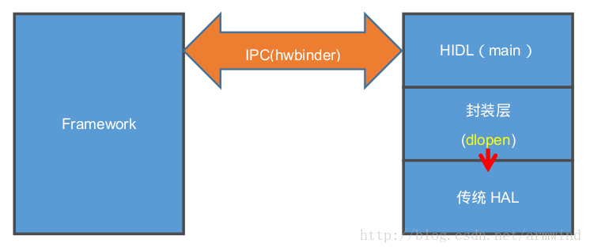
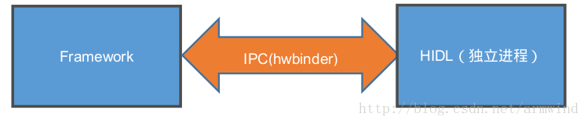
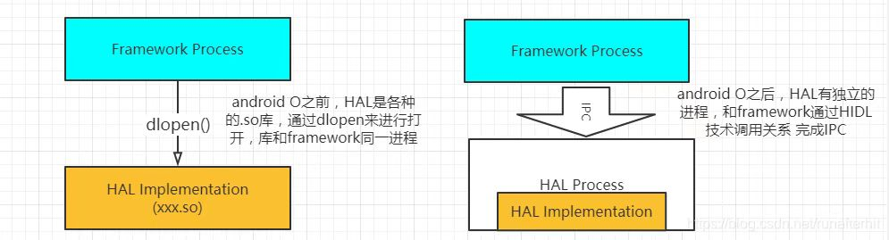

# README

Android HIDL绑定方式分析，bms采用直通型，xxxserver是采用绑定模式。

# refers

* [Android P HIDL服务绑定模式与直通模式的分析](https://blog.csdn.net/tovey2008/article/details/106681126/)
* [Android8.0 HIDL绑定式和直通式区别](https://unbroken.blog.csdn.net/article/details/84879078)

# 概述

　　从Android 8.0之后，Android 引入Treble机制，主要是为了解决目前Android 版本之间升级麻烦的问题，将OEM适配的部分vendor与google 对android  大框架升级的部分system部分做了分离，一旦适配了一个版本的vendor信息之后，之后的版本再进行升级时，直接升级system即可，这个就不会给OEM厂商升级带来太大的工作量，直接升级最新功能，可以解决目前市面上Android版本过来凌乱的问题。

* 首先Treble机制在Vendor分区中有两种模式：
  * 一个编译成`so`库，供`System`分区的进程和应用直接加载调用，两者在同一个进程中，这种叫直通式`HAL(passthrough)`模式。这个是由hidl 封装的hal，具体是在hidl封装处dlopen传统的hal（目前8.0上Camera是这种形式）大概形如如下面这个：

  * 另外一种是直接编译成一个`daemon`可运行的服务，然后`System`分区的进程通过`HwBinder`的`IPC`通信方式来调用，两者在二个独立的进程中，这种称为绑定式`HAL(Binderized)`模式。


# 区别

 直通模式与 绑定模式最大的区别就是直通模式没有一个独立运行的服务进程，而绑定模式是作为一个独立运行的服务相当于Deamon进程在运行。直通模式是将android 8.0之前的版本的module 封装起来，供System以上的服务进行调用， 上层直接调用 HIDL_FETCH_XXX 来调用此接口的。



# 代码分析

## 总体流程

```C++
* getService(const std::string &serviceName, const bool getStub)
  * getServiceInternal<BpHwMapper>(serviceName, true, getStub)
    * vintfHwbinder = (transport == Transport::HWBINDER);//绑定模式
    * Return<sp<IBase>> ret = sm->get(descriptor, instance);  //绑定模式
    * vintfPassthru = (transport == Transport::PASSTHROUGH);//直通模式
    * const sp<IServiceManager> pm = getPassthroughServiceManager();//先通过getPassthroughServiceManager ，获取IServiceManager的句柄，然后再get得到对应的服务。
    * pm->get(descriptor, instance).withDefault(nullptr);//直通模式
      * openLibs(fqName, [&](void* handle, const std::string &lib, const std::string &sym) 
        * string prefix = packageAndVersion + "-impl";//路径最后组装成/system 或者/vendor 下面的供调用的xxxxx-impl.so
        * const std::string fullPath = path + lib;
        * dlopen(fullPath.c_str(), dlMode);
```

## 具体分析

上面已经说明了直通模式与绑定模式的初始化，现在我们来介绍下如何调用直通模式和绑定模式，两者调用的函数有没有什么区别呢？ 答案是两者使用的调用接口是一样的，都是通过getService 来调用的。

```C++
IMapper mMapper = mapper::V2_0::IMapper::getService()
```

同样getService 也是HIDL的工具生成的函数执行的：
```C++
out/soong/.intermediates/hardware/interfaces/graphics/mapper/2.1/android.hardware.graphics.mapper@2.1_genc++/gen/android/hardware/graphics/mapper/2.1/MapperAll.cpp
::android::sp<IMapper> IMapper::getService(const std::string &serviceName, const bool getStub){
　　return ::android::hardware::details::getServiceInternal<BpHwMapper>(serviceName, true, getStub);
}
sp<IType> getServiceInternal(const std::string & instance, bool retry, bool getStub){
    sp<IBase> base = getRawServiceInternal(IType::descriptor, inst/ance, retyr, getStub);
.....
}
 
sp<::android::hidl::base::V1_0::IBase> getRawServiceInternal(const std::string& descriptor,
                                                             const std::string& instance,
                                                             bool retry, bool getStub) {
    const sp<IServiceManager1_1> sm = defaultServiceManager1_1();
....
//绑定模式
    const bool vintfHwbinder = (transport == Transport::HWBINDER);
//直通模式
    const bool vintfPassthru = (transport == Transport::PASSTHROUGH);
......
//绑定模式
    for (int tries = 0; !getStub && (vintfHwbinder || vintfLegacy); tries++) {
        Return<sp<IBase>> ret = sm->get(descriptor, instance);
    }
//直通模式
    if (getStub || vintfPassthru || vintfLegacy) {
        const sp<IServiceManager> pm = getPassthroughServiceManager();
            sp<IBase> base = pm->get(descriptor, instance).withDefault(nullptr);
    }
 
....
```

* 这里分成了二条路:
  * `绑定模式`就直接通过IServiceManager->get的方法去获取，是不是觉得很熟悉，就和AIDL一个套路，通过BpBinder 和 BnBinder 直接对Binder驱动的操作来完成数据交换，但AIDL的binder驱动是/dev/binder, HIDL的hwbinder驱动是/dev/hwbinder,具体的我们就不去详细分析了。
  * `直通模式`，先通过getPassthroughServiceManager ，获取IServiceManager的句柄，然后再get得到对应的服务。

```C++

sp<IServiceManager1_0> getPassthroughServiceManager() {
    return getPassthroughServiceManager1_1();
}
sp<IServiceManager1_1> getPassthroughServiceManager1_1() {
    static sp<PassthroughServiceManager> manager(new PassthroughServiceManager());
    return manager;
}
```

这里相当于直接new了一个PassthroughServiceManager(), 之后再调用get 方法：

```C++
 Return<sp<IBase>> get(const hidl_string& fqName,
                          const hidl_string& name) override {
        sp<IBase> ret = nullptr;
        openLibs(fqName, [&](void* handle, const std::string &lib, const std::string &sym) {
            IBase* (*generator)(const char* name);
            //这里就会调用 到sym 也就是HIDL_FETCH_XXX ，然后通过dlsym 去链接调用了。
            *(void **)(&generator) = dlsym(handle, sym.c_str());
            ret = (*generator)(name.c_str());
        });
        return ret;
    }
 
static void openLibs(
        const std::string& fqName,
        const std::function<bool /* continue */ (void* /* handle */, const std::string& /* lib */,
                                                 const std::string& /* sym */)>& eachLib) {
        std::string packageAndVersion = fqName.substr(0, idx);
        std::string ifaceName = fqName.substr(idx + strlen("::"));
 
        const std::string prefix = packageAndVersion + "-impl";
　　　　　//HIDL_FETCH_XXX 出现了，就是passthrough模式下需要被调用的方法。
        const std::string sym = "HIDL_FETCH_" + ifaceName;
.....
        std::vector<std::string> paths = {HAL_LIBRARY_PATH_ODM, HAL_LIBRARY_PATH_VENDOR,
                                          halLibPathVndkSp, HAL_LIBRARY_PATH_SYSTEM};
....
        for (const std::string& path : paths) {
            std::vector<std::string> libs = search(path, prefix, ".so");
 
            for (const std::string &lib : libs) {
　　　　　　　　　　//路径最后组装成/system 或者/vendor 下面的供调用的xxxxx-impl.so
                const std::string fullPath = path + lib;
 
                if (path == HAL_LIBRARY_PATH_SYSTEM) {
                    //这里就供dlopen了。
                    handle = dlopen(fullPath.c_str(), dlMode);
                } else {
                    handle = android_load_sphal_library(fullPath.c_str(), dlMode);
                }
.....
        }
    }
```
