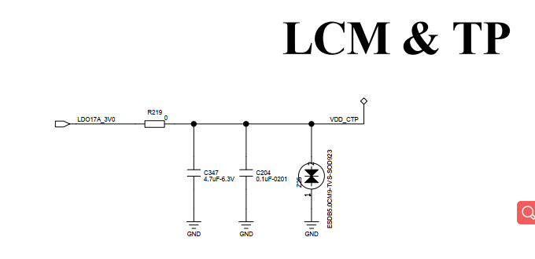
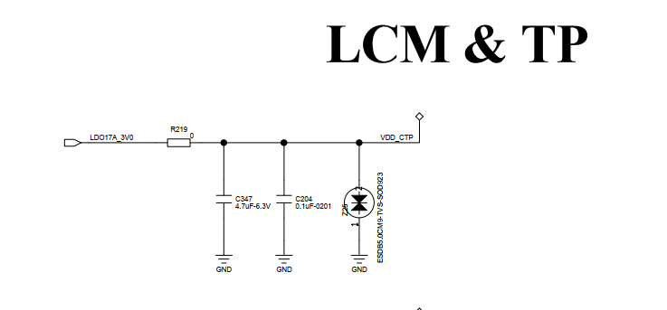
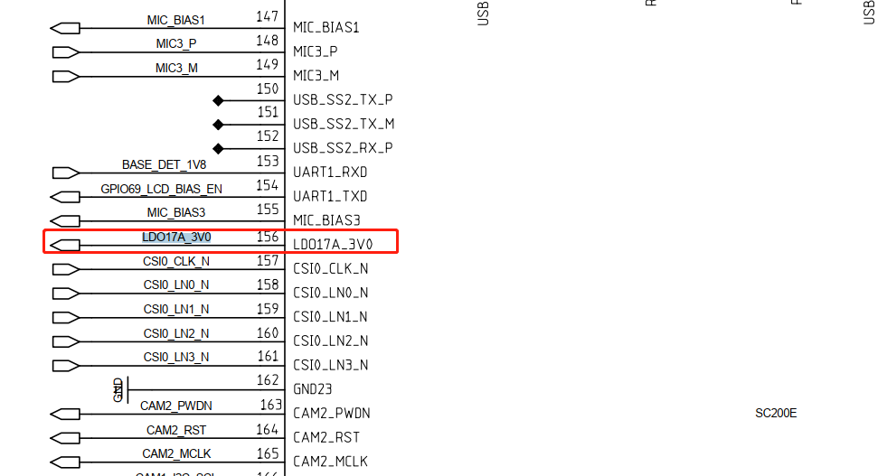

# README

高通平台qcm2290，TP ILITEK_TDDI_DRIVERV3.X调试。

# refers


# 开发板kernel驱动分析

* QCM2290开发板原始驱动如下：

```log
路径：
drivers/input/touchscreen/focaltech_touch/

cfg:
vendor/bengal_defconfig
356:CONFIG_TOUCHSCREEN_FTS=y

makefile:
obj-$(CONFIG_TOUCHSCREEN_FTS)   +=  focaltech_core.o
obj-$(CONFIG_TOUCHSCREEN_FTS)   +=  focaltech_ex_fun.o
obj-$(CONFIG_TOUCHSCREEN_FTS)   +=  focaltech_ex_mode.o
obj-$(CONFIG_TOUCHSCREEN_FTS)   +=  focaltech_gesture.o
obj-$(CONFIG_TOUCHSCREEN_FTS)   +=  focaltech_esdcheck.o
obj-$(CONFIG_TOUCHSCREEN_FTS)   +=  focaltech_point_report_check.o

obj-$(CONFIG_TOUCHSCREEN_FTS)   +=  focaltech_i2c.o
obj-$(CONFIG_TOUCHSCREEN_FTS)   +=  focaltech_flash.o
obj-$(CONFIG_TOUCHSCREEN_FTS)   +=  focaltech_flash/

dts:
&qupv3_se2_i2c {
        status = "okay";
        //qcom,i2c-touch-active="novatek,NVT-ts";

        focaltech@38{
                compatible = "focaltech,fts_ts";
                reg = <0x38>;
                interrupt-parent = <&tlmm>;
                interrupts = <22 0x2008>;
                focaltech,reset-gpio = <&tlmm 71 0x0>;
                focaltech,irq-gpio = <&tlmm 80 0x02008>;
                vdd-supply = <&L17A>;
                vcc_i2c-supply  = <&L15A>;
                focaltech,max-touch-number = <5>;
                focaltech,display-coords =  <0 0 720 1280>;
                pinctrl-names = "pmx_ts_active","pmx_ts_suspend","pmx_ts_release";
                pinctrl-0 = <&ts_int_active &ts_reset_active>;
                pinctrl-1 = <&ts_int_suspend &ts_reset_suspend>;
                pinctrl-2 = <&ts_release>;
                focaltech,have-key;
                focaltech,key-number = <3>;
                focaltech,keys = <139 172 158>;
                focaltech,key-y-coords = <1340 1340 1340>;
                focaltech,key-x-coords = <150 330 660>;
                panel = <&dsi_ili9881d_720p_video>;
        };
};
```

# 硬件信息


功能 | 引脚 |
---|---|---
reset | GPIO_71 |
int| GPIO_80 |
sda| GPIO_6(i2c2)|
scl| GPIO_7(i2c2)|

供电是和sensor共电3.0V ：




# ILITEK_V3涉及文件

File |Description
---|---|---
ili9881x_mtk.c | MTK 平台初始化，设置 GPIO、 ISR、 Suspend/Resume 等
ili9881x_qcom.c | QCOM 平台初始化，设置 GPIO、 ISR、 Suspend/Resume 等
ili9881x_i2c.c  | I2C 读写
ili9881x_spi.c  | SPI 读写
ili9881x.c  | 事件入口管理， FW 更新、 产测、报点、 workqueue 和休眠控制
ili9881x_touch.c  | IC 相关操作，包含取得 Chip ID、 ICE Mode、 Soft Reset 等
ili9881x_flash.c  | FW 更新、配置 Flash 参数、 Flash 读写操作
ili9881x_hostdl.c  | 无 Flash 配置，开机时 FW 由驱动 Host load code
ili9881x_mp.c  | 整机产测，需搭配正确的 FW 及 ini 档
ili9881x_touch.c |  报点，载入 Gesture Code 及 MP Code
ili9881x_node.c |  建立与上层沟通的节点、 IOCTL
ili9881x.h  | 所有档案共用的头文件，定义 Linux 头文件、 IC 及 Flash 位址、功能开关、 Debug 讯息、驱动版本等
ili9881x_fw.hv |  从 Hex 档案转译的 firmware 资料，用于镜像烧录。
Makefile | 选择要编译的通讯介面及平台 (仅支援 built-in，如要用 module 需自
行修改)。

# ILITEK_V3代码流程

* `drivers\input\touchscreen\ILITEK_V3\ilitek_v3_qcom.c`:
```C++
* module_init(ilitek_plat_dev_init);
  * ili_dev_init(&hwif)
  * .of_match_table = of_match_ptr(tp_match_table),{.compatible = DTS_OF_NAME}, #define DTS_OF_NAME "tchip,ilitek" //platform device和driver匹配
    * ilitek_plat_probe(void) 
      * #if REGULATOR_POWER ilitek_plat_regulator_power_init(); //使能regulator
        * ilits->vdd = regulator_get(ilits->dev, vdd_name);//const char *vdd_name = "vdd";
        * regulator_set_voltage(ilits->vdd, VDD_VOLTAGE, VDD_VOLTAGE)
        * regulator_get(ilits->dev, vcc_name);//const char *vcc_name = "vcc";
        * regulator_set_voltage(ilits->vcc, VCC_VOLTAGE, VCC_VOLTAGE)
      * #ifdef __DRM_PANEL_H__ ili_v3_drm_check_dt(ilits->dev->of_node);
        * of_count_phandle_with_args(np, "panel", NULL); //在dts中找panel，这里定义
        * panel = of_drm_find_panel(node);
        * active_panel = panel; //全局变量，供notify使用
      * ilitek_plat_gpio_register()
        * ilits->tp_int = of_get_named_gpio_flags(dev_node, DTS_INT_GPIO, 0, &flag);//#define DTS_INT_GPIO	"touch,irq-gpio"
        * ilits->tp_rst = of_get_named_gpio_flags(dev_node, DTS_RESET_GPIO, 0, &flag);//#define DTS_RESET_GPIO	"touch,reset-gpio"
      * ili_irq_register(ilits->irq_tirgger_type); //注册中断
        * devm_request_threaded_irq(ilits->dev, ilits->irq_num, ilitek_plat_isr_top_half,ilitek_plat_isr_bottom_half,type | IRQF_ONESHOT, "ilitek", NULL); //申请中断，
      * ili_tddi_init() // ?
      * #if SPRD_SYSFS_SUSPEND_RESUME ili_sysfs_add_device(ilits->dev); //增加sys调试节点，休眠唤醒通过写节点方式
      * #else ilitek_plat_sleep_init();
        * #ifdef __DRM_PANEL_H__ ilits->notifier_fb.notifier_call = drm_notifier_callback; //亮灭屏监听panel
          * case DRM_PANEL_BLANK_UNBLANK:
            * ili_sleep_handler(TP_RESUME) //亮屏
          * case DRM_PANEL_BLANK_POWERDOWN:
            * ili_sleep_handler(TP_DEEP_SLEEP) //灭屏
        * drm_panel_notifier_register(active_panel, &ilits->notifier_fb) //注册notify
      * #if CHARGER_NOTIFIER_CALLBACK ilitek_plat_charger_init();// ?
```

看看中断上下段内容：

```C++
static irqreturn_t ilitek_plat_isr_top_half(int irq, void *dev_id)
{
	if (irq != ilits->irq_num) {
		ILI_ERR("Incorrect irq number (%d)\n", irq);
		return IRQ_NONE;
	}

	if (atomic_read(&ilits->cmd_int_check) == ENABLE) {
		atomic_set(&ilits->cmd_int_check, DISABLE);
		ILI_DBG("CMD INT detected, ignore\n");
		wake_up(&(ilits->inq));
		return IRQ_HANDLED;
	}

	if (ilits->prox_near) {
		ILI_INFO("Proximity event, ignore interrupt!\n");
		return IRQ_HANDLED;
	}

	ILI_DBG("report: %d, rst: %d, fw: %d, switch: %d, mp: %d, sleep: %d, esd: %d, igr:%d\n",
			ilits->report,
			atomic_read(&ilits->tp_reset),
			atomic_read(&ilits->fw_stat),
			atomic_read(&ilits->tp_sw_mode),
			atomic_read(&ilits->mp_stat),
			atomic_read(&ilits->tp_sleep),
			atomic_read(&ilits->esd_stat),
			atomic_read(&ilits->ignore_report));

	if (!ilits->report || atomic_read(&ilits->tp_reset) ||  atomic_read(&ilits->ignore_report) ||
		atomic_read(&ilits->fw_stat) || atomic_read(&ilits->tp_sw_mode) ||
		atomic_read(&ilits->mp_stat) || atomic_read(&ilits->tp_sleep) ||
		atomic_read(&ilits->esd_stat)) {
			ILI_DBG("ignore interrupt !\n");
			return IRQ_HANDLED;
	}

	return IRQ_WAKE_THREAD;
}

static irqreturn_t ilitek_plat_isr_bottom_half(int irq, void *dev_id)
{
	if (mutex_is_locked(&ilits->touch_mutex)) {
		ILI_DBG("touch is locked, ignore\n");
		return IRQ_HANDLED;
	}
	mutex_lock(&ilits->touch_mutex);
	ili_report_handler(); //报点
	mutex_unlock(&ilits->touch_mutex);
	return IRQ_HANDLED;
}
```

# 增加pinctrl

主要功能是在resume时调用pmx_ts_active拉高rst和int，suspend时调用pmx_ts_suspend拉低rst和int。

```C++
dts:
		pinctrl-names = "pmx_ts_active","pmx_ts_suspend","pmx_ts_release";
		pinctrl-0 = <&ts_int_active &ts_reset_active>;
		pinctrl-1 = <&ts_int_suspend &ts_reset_suspend>;
		pinctrl-2 = <&ts_release>;

pinctrl:
		pmx_ts_int_active {
			ts_int_active: ts_int_active {
				mux {
					pins = "gpio80";
					function = "gpio";
				};

				config {
					pins = "gpio80";
					drive-strength = <8>;
					bias-pull-up;
				};
			};
		};

		pmx_ts_int_suspend {
			ts_int_suspend: ts_int_suspend {
				mux {
					pins = "gpio80";
					function = "gpio";
				};

				config {
					pins = "gpio80";
					drive-strength = <2>;
					bias-pull-down;
				};
			};
		};

		pmx_ts_reset_active {
			ts_reset_active: ts_reset_active {
				mux {
					pins = "gpio71";
					function = "gpio";
				};

				config {
					pins = "gpio71";
					drive-strength = <8>;
					bias-pull-up;
				};
			};
		};

		pmx_ts_reset_suspend {
			ts_reset_suspend: ts_reset_suspend {
				mux {
					pins = "gpio71";
					function = "gpio";
				};

				config {
					pins = "gpio71";
					drive-strength = <2>;
					bias-pull-down;
				};
			};
		};

		pmx_ts_release {
			ts_release: ts_release {
				mux {
					pins = "gpio80", "gpio71";
					function = "gpio";
				};

				config {
					pins = "gpio80", "gpio71";
					drive-strength = <2>;
					bias-pull-down;
				};
			};
		};


代码：

#if ILI_PINCTRL_EN
static int ilitek_pinctrl_init(struct ilitek_ts_data *ts)
{
	int ret = 0;

	ts->pinctrl = devm_pinctrl_get(ts->dev);
	if (IS_ERR_OR_NULL(ts->pinctrl)) {
		FTS_ERROR("Failed to get pinctrl, please check dts");
		ret = PTR_ERR(ts->pinctrl);
		goto err_pinctrl_get;
	}

	ts->pins_active = pinctrl_lookup_state(ts->pinctrl, "pmx_ts_active");
	if (IS_ERR_OR_NULL(ts->pins_active)) {
		FTS_ERROR("Pin state[active] not found");
		ret = PTR_ERR(ts->pins_active);
		goto err_pinctrl_lookup;
	}

	ts->pins_suspend = pinctrl_lookup_state(ts->pinctrl, "pmx_ts_suspend");
	if (IS_ERR_OR_NULL(ts->pins_suspend)) {
		FTS_ERROR("Pin state[suspend] not found");
		ret = PTR_ERR(ts->pins_suspend);
		goto err_pinctrl_lookup;
	}

	ts->pins_release = pinctrl_lookup_state(ts->pinctrl, "pmx_ts_release");
	if (IS_ERR_OR_NULL(ts->pins_release)) {
		FTS_ERROR("Pin state[release] not found");
		ret = PTR_ERR(ts->pins_release);
	}

	return 0;
err_pinctrl_lookup:
	if (ts->pinctrl) {
		devm_pinctrl_put(ts->pinctrl);
	}
err_pinctrl_get:
	ts->pinctrl = NULL;
	ts->pins_release = NULL;
	ts->pins_suspend = NULL;
	ts->pins_active = NULL;
	return ret;
}
static int ilitek_pinctrl_select_normal(struct ilitek_ts_data *ts)
{
	int ret = 0;

	if (ts->pinctrl && ts->pins_active) {
		ret = pinctrl_select_state(ts->pinctrl, ts->pins_active);
		if (ret < 0) {
			FTS_ERROR("Set normal pin state error:%d", ret);
		}
	}

	return ret;
}

static int ilitek_pinctrl_select_suspend(struct ilitek_ts_data *ts)
{
	int ret = 0;

	if (ts->pinctrl && ts->pins_suspend) {
		ret = pinctrl_select_state(ts->pinctrl, ts->pins_suspend);
		if (ret < 0) {
			FTS_ERROR("Set suspend pin state error:%d", ret);
		}
	}

	return ret;
}

static int ilitek_pinctrl_select_release(struct ilitek_ts_data *ts)
{
	int ret = 0;

	if (ts->pinctrl) {
		if (IS_ERR_OR_NULL(ts->pins_release)) {
			devm_pinctrl_put(ts->pinctrl);
			ts->pinctrl = NULL;
		} else {
			ret = pinctrl_select_state(ts->pinctrl, ts->pins_release);
			if (ret < 0)
				FTS_ERROR("Set gesture pin state error:%d", ret);
		}
	}

	return ret;
}
#endif /* ILI_PINCTRL_EN */


probe(){

  #if ILI_PINCTRL_EN
		ilitek_pinctrl_init(ilits);
		ilitek_pinctrl_select_normal(ilits);
#endif
}
```

# 调试过程

首先需要配置i2c、log、平台(高通、MTK)：

* 打开调试功能`ilitek_v3.h`：

```C++
#define DEBUG_OUTPUT	DEBUG_ALL
```

* 配置为i2c通信：

```C++
ilitek_v3.h：
#define TDDI_INTERFACE			BUS_I2C /* BUS_I2C(0x18) or BUS_SPI(0x1C) */

Makefile：
BUILD_INFAE := i2c
BUILD_PLATFORM := qcom
BUILD_MODULE := n
```

原装屏正常打印：

```
[   10.084701] i2c_pmic 1-0009: ignoring dependency for device, assuming no driver
[   10.097757] [FTS_TS/I]fts_ts_probe:Touch Screen(I2C BUS) driver prboe...
[   10.104583] [FTS_TS/I]fts_ts_probe_entry:Focaltech V3.1 20190807
[   10.110659] [FTS_TS/I]fts_get_dt_coords:display x(0 720) y(0 1280)
[   10.116889] [FTS_TS/I]fts_parse_dt:VK Number:3, key:(139,172,158), coords:(150,1340),(330,1340),(660,1340)
[   10.126877] [FTS_TS/I]fts_parse_dt:max touch number:5, irq gpio:1233, reset gpio:1224
[   10.135461] [FTS_TS/I]fts_input_init:set key capabilities
[   10.141602] input: fts_ts as /devices/platform/soc/4a88000.i2c/i2c-2/2-0038/input/input2
[   10.150742] fts_ts 2-0038: Linked as a consumer to regulator.40
[   10.157370] fts_ts 2-0038: Linked as a consumer to regulator.38
[   10.385623] [FTS_TS/I]fts_get_ic_information:get ic information, chip id = 0x5422
[   10.393189] [FTS_TS/I]fts_create_apk_debug_channel:Create proc entry success!
[   10.400517] [FTS_TS/I]fts_create_sysfs:[EX]: sysfs_create_group() succeeded!!
[   10.408361] [FTS_TS/I]fts_irq_registration:irq:243, flag:2002
[   10.414876] [FTS_TS/I]fts_fwupg_init:fw upgrade init function
[   10.420697] [FTS_TS/I]fts_ts_probe:Touch Screen(I2C BUS) driver prboe successfully
[   10.421233] fts_ts 2-0038: Falling back to syfs fallback for: focaltech_ts_fw_gvo.bin
```

## 1.供电VDD VCC确定

首先确定供电这块，硬件同事说tp只有VDD一路电LDO17A_3V0，如下图，3v：




软件修改ldo电压值`ilitek_v3.h`：

```
#define VDD_VOLTAGE			1800000
#define REGULATOR_POWER                 ENABLE
```

软件参考开发板，vdd是kernel自动添加-supply后缀组成vdd-supply，vcc_i2c同理，从dts中获取：

```C++
dts：
            compatible = "focaltech,fts_ts";
                reg = <0x38>;
                vdd-supply = <&L17A>;
                vcc_i2c-supply  = <&L15A>;


        rpm-regulator-ldoa15 {
                status = "okay";
                L15A: pm2250_l15: regulator-l15 {
                        regulator-min-microvolt = <1200000>;
                        regulator-max-microvolt = <2000000>;
                        qcom,init-voltage = <1800000>;
                        status = "okay";
                };
        };

ldoa17的电压值必须在3v~3.6v之间，否则会报错：
pm2250_l17: requested voltage range [1800000, 1800000] does not fit within constraints: [3000000, 3600000]

        rpm-regulator-ldoa17 {
                status = "okay";
                L17A: pm2250_l17: regulator-l17 {
                        regulator-min-microvolt = <3000000>;
                        regulator-max-microvolt = <3600000>;
                        qcom,init-voltage = <2800000>;
                        status = "okay";
                };
        };

/*****************************************************************************
* Name: fts_power_source_init
* Brief: Init regulator power:vdd/vcc_io(if have), generally, no vcc_io
*        vdd---->vdd-supply in dts, kernel will auto add "-supply" to parse
*        Must be call after fts_gpio_configure() execute,because this function
*        will operate reset-gpio which request gpio in fts_gpio_configure()
* Input:
* Output:
* Return: return 0 if init power successfully, otherwise return error code
*****************************************************************************/
static int fts_power_source_init(struct fts_ts_data *ts_data)
{
	int ret = 0;

	FTS_FUNC_ENTER();
	ts_data->vdd = regulator_get(ts_data->dev, "vdd");
	if (IS_ERR_OR_NULL(ts_data->vdd)) {
		ret = PTR_ERR(ts_data->vdd);
		FTS_ERROR("get vdd regulator failed,ret=%d", ret);
		return ret;
	}

	if (regulator_count_voltages(ts_data->vdd) > 0) {
		ret = regulator_set_voltage(ts_data->vdd, FTS_VTG_MIN_UV,
						FTS_VTG_MAX_UV);
		if (ret) {
			FTS_ERROR("vdd regulator set_vtg failed ret=%d", ret);
			regulator_put(ts_data->vdd);
			return ret;
		}

		ret = regulator_set_load(ts_data->vdd, FTS_LOAD_MAX_UA);
		if (ret) {
			FTS_ERROR("vdd regulator set_load failed ret=%d", ret);
			regulator_put(ts_data->vdd);
			return ret;
		}
	}

	ts_data->vcc_i2c = regulator_get(ts_data->dev, "vcc_i2c");
	if (!IS_ERR_OR_NULL(ts_data->vcc_i2c)) {
		if (regulator_count_voltages(ts_data->vcc_i2c) > 0) {
			ret = regulator_set_voltage(ts_data->vcc_i2c,
						FTS_I2C_VTG_MIN_UV,
						FTS_I2C_VTG_MAX_UV);
			if (ret) {
				FTS_ERROR("vcc_i2c regulator set_vtg failed,ret=%d", ret);
				regulator_put(ts_data->vcc_i2c);
			}
		}
	}

#if FTS_PINCTRL_EN
	fts_pinctrl_init(ts_data);
	fts_pinctrl_select_normal(ts_data);
#endif

	ts_data->power_disabled = true;
	ret = fts_power_source_ctrl(ts_data, ENABLE);
	if (ret) {
		FTS_ERROR("fail to enable power(regulator)");
	}

	FTS_FUNC_EXIT();
	return ret;
}
```

## 2.RST/INT GPIO确认

确认同开发板focaltech tp配置一样。

## 3.panel配置

panel选择`dsi_ili7807s_1080p_video`，

```
&qupv3_se2_i2c {
	status = "okay";
	ilitek_ts@41 {
		compatible = "tchip,ilitek";
		status = "okay";
		reg = <0x41>;
		interrupt-parent = <&tlmm>;
		touch,reset-gpio = <&tlmm 71 0x0>;
		touch,irq-gpio = <&tlmm 80 0x02008>;
		vdd-supply = <&L17A>;
		vcc_i2c-supply  = <&L15A>;
		panel = <&dsi_ili7807s_1080p_video>;
	};
};
```

## 4.无法获取panel

没接TP：
```log
[    4.258161] ILITEK: (ilitek_i2c_probe, 323): ilitek i2c probe
[    4.263994] ILITEK: (ilitek_plat_probe, 625): platform probe
[    4.269679] ILITEK: (ili_v3_drm_check_dt, 435): find drm_panel count(1)
[    4.269684] ILITEK: (ili_v3_drm_check_dt, 438): nodeffffffe034a3caf0
[    4.276421] ILITEK: (ili_v3_drm_check_dt, 440): panelfffffffffffffdfb
[    4.282797] ILITEK: (ili_v3_drm_check_dt, 450): no find drm_panel
[    4.289369] ILITEK: (ilitek_plat_probe, 633): [ili_v3_drm_check_dt] parse drm-panel fail
[    4.295521] ILITEK: (ilitek_plat_gpio_register, 185): TP INT: 1233
[    4.309842] ILITEK: (ilitek_plat_gpio_register, 186): TP RESET: 1224
[    4.316392] ILITEK: (ili_irq_register, 338): ilits->irq_num = 195
[    4.322982] ILITEK: (ili_irq_register, 346): IRQ TYPE = IRQF_TRIGGER_FALLING
[    4.330075] ILITEK: (ili_tddi_init, 1166): driver version = 3.0.7.0.210625
[    4.337492] ILITEK: (ili_reset_ctrl, 1032): TP HW RST
[    4.342579] ILITEK: (ili_tp_reset, 31): edge delay = 40
[    4.393859] ILITEK: (ili_set_tp_data_len, 822): TP mode = 0, format = 0, len = 112
[    4.402473] i2c_geni 4a88000.i2c: GSI QN err:0x0, status:0x4cc, err:2
[    4.408934] i2c_geni 4a88000.i2c: GSI QN err:0x0, status:0x4cc, err:2
[    4.415756] ILITEK: (ilitek_i2c_write, 171): i2c write error, ret = -1
[    4.422310] ILITEK: (ili_i2c_wrapper, 280): i2c-wrapper write error
[    4.428621] ILITEK: (ili_ice_mode_ctrl, 350): write ice mode cmd error
[    4.435172] ILITEK: (ili_ice_mode_write, 267): ice mode not enabled
[    4.441453] ILITEK: (ili_ice_mode_ctrl, 357): Write cs high failed
[    4.447656] ILITEK: (ili_ice_mode_ctrl, 375): Enable ICE mode, mcu on = 0
[    4.454482] ILITEK: (ili_ic_dummy_check, 1264): ice mode doesn't enable
[    4.461121] ILITEK: (ili_tddi_init, 1207): Not found ilitek chip
[    4.467147] ILITEK: (ilitek_plat_probe, 642): ILITEK Driver probe failed
[    4.474049] ILITEK: (ili_dev_remove, 1268): remove ilitek dev
[    4.480325] ILITEK: (ili_interface_dev_exit, 475): remove i2c dev
```

接了TP：
```log
[    4.231417] ILITEK: (ilitek_i2c_probe, 323): ilitek i2c probe
[    4.237251] ILITEK: (ilitek_plat_probe, 716): platform probe
[    4.243114] ILITEK_TDDI 1-0041: Linked as a consumer to regulator.40
[    4.249630] ILITEK_TDDI 1-0041: Linked as a consumer to regulator.38
[    4.256011] ILITEK: (ili_plat_regulator_power_on, 126): POWER ON
[    4.268060] ILITEK: (ili_v3_drm_check_dt, 435): find drm_panel count(1)
[    4.268064] ILITEK: (ili_v3_drm_check_dt, 438): nodeffffffd8b4a3daf0
[    4.274804] ILITEK: (ili_v3_drm_check_dt, 440): panelfffffffffffffdfb
[    4.281176] ILITEK: (ili_v3_drm_check_dt, 450): no find drm_panel
[    4.287725] ILITEK: (ilitek_plat_probe, 724): [ili_v3_drm_check_dt] parse drm-panel fail
[    4.293885] ILITEK: (ilitek_plat_gpio_register, 185): TP INT: 1233
[    4.308211] ILITEK: (ilitek_plat_gpio_register, 186): TP RESET: 1224
[    4.315009] ILITEK: (ili_irq_register, 338): ilits->irq_num = 195
[    4.321658] ILITEK: (ili_irq_register, 346): IRQ TYPE = IRQF_TRIGGER_FALLING
[    4.328750] ILITEK: (ili_tddi_init, 1166): driver version = 3.0.7.0.210625
[    4.336214] ILITEK: (ili_reset_ctrl, 1032): TP HW RST
[    4.341293] ILITEK: (ili_tp_reset, 31): edge delay = 40
[    4.392572] ILITEK: (ili_set_tp_data_len, 822): TP mode = 0, format = 0, len = 112
[    4.904171] i2c_geni 4a88000.i2c: I2C gsi xfer timeout:126 flags:0 addr:0x41
[    4.911428] i2c_geni 4a88000.i2c: GSI QN err:0x0, status:0x644, err:4
[    4.918348] ILITEK: (ilitek_i2c_write, 171): i2c write error, ret = -1
[    4.924916] ILITEK: (ili_i2c_wrapper, 280): i2c-wrapper write error
[    4.931232] ILITEK: (ili_ice_mode_ctrl, 350): write ice mode cmd error
[    4.937796] ILITEK: (ili_ice_mode_write, 267): ice mode not enabled
[    4.944099] ILITEK: (ili_ice_mode_ctrl, 357): Write cs high failed
[    4.950323] ILITEK: (ili_ice_mode_ctrl, 375): Enable ICE mode, mcu on = 0
[    4.957142] ILITEK: (ili_ic_dummy_check, 1264): ice mode doesn't enable
[    4.963791] ILITEK: (ili_tddi_init, 1207): Not found ilitek chip
[    4.969847] ILITEK: (ilitek_plat_probe, 738): ILITEK Driver probe failed
[    4.976763] ILITEK: (ili_dev_remove, 1268): remove ilitek dev
[    4.982706] esd_check (256) used greatest stack depth: 13856 bytes left
[    4.989629] ILITEK: (ili_interface_dev_exit, 475): remove i2c dev

```

由于panel驱动还没加载，所以将tp驱动延时加载就好了,修改如下：

```C++
module_init(ilitek_plat_dev_init);
改为
late_initcall(ilitek_plat_dev_init);
```

正常打印：
```
[    6.896123] ILITEK: (ili_plat_regulator_power_on, 126): POWER ON
[    6.902485] PAX_CHG: psy_charger_get_property psp:30
[    6.913144] ILITEK: (ili_v3_drm_check_dt, 435): find drm_panel count(1)
[    6.913147] ILITEK: (ili_v3_drm_check_dt, 438): nodeffffffd234a3daf0
[    6.913498] PAX_CHG: psy_charger_get_property psp:35
[    6.918460] ILITEK: (ili_v3_drm_check_dt, 440): panelffffffd21348e4a8
[    6.918462] ILITEK: (ili_v3_drm_check_dt, 444): find drm_panel successfully
[    6.943106] ILITEK: (ilitek_plat_gpio_register, 185): TP INT: 1233
[    6.956310] ILITEK: (ilitek_plat_gpio_register, 186): TP RESET: 1224
[    6.963010] ILITEK: (ili_irq_register, 338): ilits->irq_num = 243
[    6.969364] ILITEK: (ili_irq_register, 346): IRQ TYPE = IRQF_TRIGGER_FALLING
[    6.976453] ILITEK: (ili_tddi_init, 1166): driver version = 3.0.7.0.210625
[    6.983650] ILITEK: (ili_reset_ctrl, 1032): TP HW RST
[    6.988751] ILITEK: (ili_tp_reset, 31): edge delay = 40
[    7.040036] ILITEK: (ili_set_tp_data_len, 822): TP mode = 0, format = 0, len = 112
[    7.209026] PAX_CHG: pax_is_charger_on chr_type = 0
[    7.213929] PAX_CHG: disable charging 0 0 0
[    7.218138] PAX_CHG: charger_routine_thread end , 0
[    7.560126] i2c_geni 4a88000.i2c: I2C gsi xfer timeout:126 flags:0 addr:0x41
[    7.567324] i2c_geni 4a88000.i2c: GSI QN err:0x0, status:0x644, err:4
[    7.574116] ILITEK: (ilitek_i2c_write, 171): i2c write error, ret = -1
[    7.580684] ILITEK: (ili_i2c_wrapper, 280): i2c-wrapper write error
[    7.587003] ILITEK: (ili_ice_mode_ctrl, 350): write ice mode cmd error
[    7.593576] ILITEK: (ili_ice_mode_write, 267): ice mode not enabled
[    7.599871] ILITEK: (ili_ice_mode_ctrl, 357): Write cs high failed
[    7.606085] ILITEK: (ili_ice_mode_ctrl, 375): Enable ICE mode, mcu on = 0
[    7.612923] ILITEK: (ili_ic_dummy_check, 1264): ice mode doesn't enable
[    7.619566] ILITEK: (ili_tddi_init, 1207): Not found ilitek chip
[    7.624941] PAX_CHG: pax_is_charger_on chr_type = 0
[    7.625603] ILITEK: (ilitek_plat_probe, 738): ILITEK Driver probe failed
[    7.630509] PAX_CHG: disable charging 0 0 0
[    7.637314] ILITEK: (ili_dev_remove, 1268): remove ilitek dev
```
