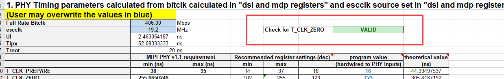

# README

高通平台qcm2290，屏驱IC:ILI7807S调试，特性1080x2560分辨率。

# refers

* [ILI7807S Data Sheet for all customer(V001)_20200108.pdf](refers/ILI7807Sdatasheet.pdf)
* [移远提供patch](refers/移远提供patch)
* [供应商提供初始化代码及porch](refers/供应商提供初始化代码及porch)
* [高通Android UEFI中的LCD分析（2）：关键的函数](https://www.cnblogs.com/schips/p/qualcomm_uefi_display_important_functions.html)
* [SM7250(高通5G)平台LCD bringup](https://blog.csdn.net/melody157398/article/details/115986401)

# kernel移植流程

## 1.dts Panel命令信息

请参考：
* [Quectel_SC200E系列_Android12_显示驱动_开发指导.doc](refers/Quectel_SC200E系列_Android12_显示驱动_开发指导.doc)

## 2.屏幕物理数据

Timing配置的示例如下图所示：


### 生成DSI的Timing

Panel需要在DSI PHY寄存器中为bitclk设置PHY值。80-NH713-1_DSI.zip压缩包（压缩文件在工具目录中可用）中的80-nh713-1_yj_dsi timing parameters user interactive spreadsheet.xlsm可用于自动计算timing值。
* [80-nh713-1_yj_dsi_timing_parameters_user_interactive_spreadsheet.xlsm](refers/80-nh713-1_yj_dsi_timing_parameters_user_interactive_spreadsheet.xlsm)

### 操作步骤

1. 打开DSI和MDP寄存器表。将frame rate、lane numbers、panel resolution、porch和chip值输入到红线框定的区域。如下图所示:


2. 打开DSI PHY timing setting sheet页，先按ctrl + j清除，然后按ctrl + k重新生成。Check for T_CLK_ZERO值会变成VALID：



3. 打开DSI PHY 2.0.0 timing setting表，查看蓝色字段中与计算出的DSI相关时钟速率。如下图所示：


4. 使用从Excel工作表中获取的上述值更新面板XML文件<PanelTimings>。如下所示。值为从上述内容中复制。


## 最终代码

```C++
&dsi_ft8006s_720p_video {
        qcom,dsi-select-clocks = "mux_byte_clk0", "mux_pixel_clk0";
        qcom,mdss-dsi-t-clk-post = <0x0b>; //60 fps
        qcom,mdss-dsi-t-clk-pre = <0x22>;
        qcom,panel-supply-entries = <&dsi_panel_pwr_supply>;
        qcom,mdss-dsi-bl-pmic-control-type = "bl_ctrl_pwm";
        pwms = <&pm2250_pwm3 0 0>;
        qcom,bl-pmic-pwm-period-usecs = <100>;
        qcom,mdss-dsi-bl-min-level = <1>;
        qcom,mdss-dsi-bl-max-level = <255>;
        qcom,platform-te-gpio = <&tlmm 81 0>;
        qcom,platform-reset-gpio = <&tlmm 82 0>;

        qcom,mdss-dsi-display-timings {
                timing@0{
                        qcom,mdss-dsi-panel-phy-timings =
                        [
                         1f 10 05 06 03 02 04 0a //60 fps
                         1f 10 05 06 03 02 04 0a
                         1f 10 05 06 03 02 04 0a
                         1f 10 05 06 03 02 04 0a
                         1f 1c 05 06 03 02 04 0a
                        ];
                        qcom,display-topology = <1 0 1>;
                        qcom,default-topology-index = <0>;
                };
        };
};

/* Copyright (c) 2016-2018, The Linux Foundation. All rights reserved.
 *
 * This program is free software; you can redistribute it and/or modify
 * it under the terms of the GNU General Public License version 2 and
 * only version 2 as published by the Free Software Foundation.
 *
 * This program is distributed in the hope that it will be useful,
 * but WITHOUT ANY WARRANTY; without even the implied warranty of
 * MERCHANTABILITY or FITNESS FOR A PARTICULAR PURPOSE.  See the
 * GNU General Public License for more details.
 */

&mdss_mdp {
	dsi_ft8006s_720p_video: qcom,mdss_dsi_ft8006s_720p_video {
		qcom,mdss-dsi-panel-name ="ft8006s video mode dsi panel without DSC";
		qcom,mdss-dsi-panel-type = "dsi_video_mode";
		qcom,dsi-ctrl-num = <0>;
		qcom,dsi-phy-num = <0>;
		qcom,mdss-dsi-virtual-channel-id = <0>;
		qcom,mdss-dsi-stream = <0>;
		qcom,mdss-dsi-h-left-border = <0>;
		qcom,mdss-dsi-h-right-border = <0>;
		qcom,mdss-dsi-v-top-border = <0>;
		qcom,mdss-dsi-v-bottom-border = <0>;
		qcom,mdss-dsi-bpp = <24>;
		qcom,mdss-dsi-color-order = "rgb_swap_rgb";
		qcom,mdss-dsi-underflow-color = <0xff>;
		qcom,mdss-dsi-border-color = <0>;
		qcom,mdss-dsi-h-sync-pulse = <0>;
		qcom,mdss-dsi-traffic-mode = "non_burst_sync_event";
		qcom,mdss-dsi-lane-map = "lane_map_0123";
		qcom,mdss-dsi-bllp-eof-power-mode;
		qcom,mdss-dsi-bllp-power-mode;
		qcom,mdss-dsi-tx-eot-append;
		qcom,mdss-dsi-lane-0-state;
		qcom,mdss-dsi-lane-1-state;
		qcom,mdss-dsi-lane-2-state;
		qcom,mdss-dsi-lane-3-state;
		qcom,mdss-dsi-dma-trigger = "trigger_sw";
		qcom,mdss-dsi-mdp-trigger = "none";
		qcom,mdss-dsi-lp11-init;
		qcom,mdss-dsi-bl-pmic-control-type = "bl_ctrl_wled";
		qcom,mdss-dsi-bl-min-level = <1>;
		qcom,mdss-dsi-bl-max-level = <4095>;
		qcom,mdss-dsi-reset-sequence = <1 10>, <0 10>, <1 10>;
		qcom,mdss-dsi-te-pin-select = <1>;
		qcom,mdss-dsi-wr-mem-start = <0x2c>;
		qcom,mdss-dsi-wr-mem-continue = <0x3c>;
		qcom,mdss-dsi-te-dcs-command = <1>;
		qcom,mdss-dsi-te-check-enable;
		qcom,mdss-dsi-te-using-te-pin;
		qcom,mdss-dsi-display-timings {
			timing@0{
				qcom,mdss-dsi-panel-width = <720>;
				qcom,mdss-dsi-panel-height = <1600>;
				qcom,mdss-dsi-h-front-porch = <24>;
				qcom,mdss-dsi-h-back-porch = <24>;
				qcom,mdss-dsi-h-pulse-width = <16>;
				qcom,mdss-dsi-h-sync-skew = <0>;
				qcom,mdss-dsi-v-back-porch = <110>;
				qcom,mdss-dsi-v-front-porch = <130>;
				qcom,mdss-dsi-v-pulse-width = <10>;
				qcom,mdss-dsi-panel-framerate = <60>;
		qcom,mdss-dsi-on-command =[ 
		05 01 00 00 78 00 02 11 00
		05 01 00 00 14 00 02 29 00];
		qcom,mdss-dsi-off-command = [05 01 00 00 32 00 02 28 00
					05 01 00 00 78 00 02 10 00];
				qcom,mdss-dsi-on-command-state = "dsi_lp_mode";
				qcom,mdss-dsi-off-command-state = "dsi_hs_mode";
				qcom,mdss-dsi-h-sync-pulse = <0>;
			};
		};
	};
};
```

# XBL流程

## 移植流程

### 1.增加panel，填写uefiPanelList配置

* `A6650_Unpacking_Tool/BOOT.XF.4.1/boot_images/QcomPkg/SocPkg/AgattiPkg/Library/MDPPlatformLib/MDPPlatformLib.c`:

```C++
static PlatformDSIDetectParams uefiPanelList[] = { 

      MDPPLATFORM_PANEL_ILI7807S_1080P_VIDEO,                 // eSelectedPanel
};
```
目前暂不支持读display id的方式兼容多个屏，只能存一个屏。

### 2.在XBL中添加新屏参数

* `BOOT.XF.4.1\boot_images\QcomPkg\Settings\Panel\Panel_ili7807s_1080p_video.xml`目录下保存所有屏参。

```xml
<?xml version="1.0" encoding="utf-8"?>
<PanelName>ILI7807S_1080P</PanelName>
<PanelDescription>ili7807s 1080p video mode dsi panel</PanelDescription>
<Group id="Active Timing">
 <HorizontalActive>1080</HorizontalActive>
 <HorizontalFrontPorch>22</HorizontalFrontPorch>
 <HorizontalBackPorch>23</HorizontalBackPorch>
 <HorizontalSyncPulse>4</HorizontalSyncPulse>
 <HorizontalSyncSkew>0</HorizontalSyncSkew>
 <HorizontalLeftBorder>0</HorizontalLeftBorder>
 <HorizontalRightBorder>0</HorizontalRightBorder>
 <VerticalActive>2408</VerticalActive>
 <VerticalFrontPorch>12</VerticalFrontPorch>
 <VerticalBackPorch>12</VerticalBackPorch>
 <VerticalSyncPulse>2</VerticalSyncPulse>
 <VerticalSyncSkew>0</VerticalSyncSkew>
 <VerticalTopBorder>0</VerticalTopBorder>
 <VerticalBottomBorder>0</VerticalBottomBorder>
</Group>
<Group id="Display Interface">
 <InterfaceType>8</InterfaceType>
 <InterfaceColorFormat>3</InterfaceColorFormat>
</Group>
<Group id="DSI Interface">
 <DSIChannelId>1</DSIChannelId>
 <DSIVirtualId>0</DSIVirtualId>
 <DSIColorFormat>36</DSIColorFormat>
 <DSITrafficMode>1</DSITrafficMode>
 <DSILanes>4</DSILanes>
 <DSILowPowerModeInBLLPEOF>True</DSILowPowerModeInBLLPEOF>
 <DSILowPowerModeInBLLP>True</DSILowPowerModeInBLLP>
 <DSIRefreshRate>0x280000</DSIRefreshRate>
 <DSIDynamicRefreshRates>0x3B0000 0x3B4000 0x3B8000 0x3BC000 0x3C0000</DSIDynamicRefreshRates>
 <DSICmdSwapInterface>False</DSICmdSwapInterface>
 <DSICmdUsingTrigger>False</DSICmdUsingTrigger>
 <DSIControllerMapping>
  00
 </DSIControllerMapping>
</Group>
<DSIInitSequence>

39 FF 78 07 01

39 00 41
39 01 50
39 02 00
39 03 5C
39 08 81
39 09 06
39 0a 70
39 0c 00
39 0e 51
39 31 02
39 32 07
39 33 07
39 34 07
39 35 07
39 36 07
39 37 07
39 38 36
39 39 35
39 3a 34
39 3b 30
39 3c 2F
39 3d 2E
39 3e 2C
39 3f 11
39 40 17
39 41 15
39 42 13
39 43 09
39 44 28
39 45 28
39 46 28
39 47 28
39 48 28
39 49 02
39 4a 07
39 4b 07
39 4c 07
39 4d 07
39 4e 07
39 4f 07
39 50 36
39 51 35
39 52 34
39 53 30
39 54 2F
39 55 2E
39 56 2C
39 57 10
39 58 16
39 59 14
39 5a 12
39 5b 08
39 5c 28
39 5d 28
39 5e 28
39 5f 28
39 60 28
39 61 02
39 62 07
39 63 07
39 64 07
39 65 07
39 66 07
39 67 07
39 68 36
39 69 35
39 6a 34
39 6b 30
39 6c 2F
39 6d 2E
39 6e 2C
39 6f 12
39 70 14
39 71 16
39 72 10
39 73 08
39 74 28
39 75 28
39 76 28
39 77 28
39 78 28
39 79 02
39 7a 07
39 7b 07
39 7c 07
39 7d 07
39 7e 07
39 7f 07
39 80 36
39 81 35
39 82 34
39 83 30
39 84 2F
39 85 2E
39 86 2C
39 87 13
39 88 15
39 89 17
39 8a 11
39 8b 09
39 8c 28
39 8d 28
39 8e 28
39 8f 28
39 90 28
39 A7 00
39 B2 00
39 B3 04
39 F0 2C
39 D1 12
39 D3 40
39 D4 04
39 D8 64
39 E6 22
39 D5 12
39 D9 85
39 E1 08
39 DA 01
39 DB 01
39 DC 08
39 DD 98

39 FF 78 07 11
39 38 00
39 39 4C

39 FF 78 07 02
39 01 55
39 02 09
39 40 01
39 41 00
39 42 0A
39 43 2E
39 1B 02
39 46 22
39 47 03
39 82 32
39 53 06
39 76 13
39 80 32
39 06 6D
39 08 00
39 0E 0E
39 0F 0C
39 24 16
39 4E C4

39 FF 78 07 12
39 48 00
39 49 00
39 4A 09
39 4B 2C
39 4E 06
39 52 13
39 53 22
39 C8 6D
39 C9 00
39 CA 0E
39 CB 0C
39 01 44
39 03 44

39 FF 78 07 04
39 B7 CF
39 B8 45
39 BA 74
39 BD 01

39 FF 78 07 05
39 1D 00
39 1E 87
39 1F 00
39 20 87
39 61 CB
39 72 75
39 74 41
39 76 70
39 7A 3C
39 7B 85
39 7C 85
39 C6 1B
39 56 FF
39 46 55
39 B5 55
39 3E 50
39 56 FF
39 FF 78 07 06
39 C0 68
39 C1 19
39 C3 06
39 13 13
39 12 BD

39 FF 78 07 07
39 03 20
39 11 16
39 12 00
39 29 00

39 FF 78 07 08
39 E0 00 00 20 52 00 93 C0 E3 15 19 42 80 25 B0 F7 2E 2A 65 A4 CB 3E FE 23 4E 3F 67 89 BA 0F D8 D9
39 E1 00 00 20 52 00 93 C0 E3 15 19 42 80 25 B0 F7 2E 2A 65 A4 CB 3E FE 23 4E 3F 67 89 BA 0F D8 D9

39 FF 78 07 0B
39 94 88
39 95 23
39 96 06
39 97 06
39 98 CB
39 99 CB
39 9A 46
39 9B D6
39 9C 05
39 9D 05
39 9E AB
39 9F AB
39 AA 12
39 AB E0
39 C6 88
39 C7 21
39 C8 06
39 C9 06
39 CA CB
39 CB CB
39 D8 06
39 D9 D7
39 DA 05
39 DB 05
39 DC AB
39 DD AB

39 FF 78 07 0C
39 40 22
39 41 3C
39 42 21
39 43 36
39 44 21
39 45 36
39 46 23
39 47 48
39 48 20
39 49 31
39 4A 21
39 4B 37
39 4C 22
39 4D 3F
39 4E 22
39 4F 3D
39 50 21
39 51 38
39 52 22
39 53 40
39 54 22
39 55 3E
39 56 22
39 57 43
39 58 21
39 59 39
39 5A 22
39 5B 41
39 5C 21
39 5D 35
39 5E 22
39 5F 45
39 60 21
39 61 33
39 62 22
39 63 3B
39 64 20
39 65 30
39 66 22
39 67 44
39 68 22
39 69 3A
39 6A 22
39 6B 42
39 6C 22
39 6D 46
39 6E 21
39 6F 32
39 70 21
39 71 34


39 80 20
39 81 3A
39 82 20
39 83 39
39 84 20
39 85 39
39 86 20
39 87 31
39 88 20
39 89 33
39 8A 20
39 8B 34
39 8C 20
39 8D 30
39 8E 21
39 8F 45
39 90 21
39 91 42
39 92 21
39 93 3F
39 94 21
39 95 40
39 96 21
39 97 47
39 98 20
39 99 3C
39 9A 21
39 9B 46
39 9C 21
39 9D 48
39 9E 21
39 9F 41
39 A0 21
39 A1 44
39 A2 20
39 A3 3D
39 A4 20
39 A5 36
39 A6 20
39 A7 38
39 A8 20
39 A9 3E
39 AA 20
39 AB 35
39 AC 20
39 AD 3B
39 AE 20
39 AF 32
39 B0 20
39 B1 37

39 FF 78 07 0E
39 00 A3
39 B9 CC
39 02 0F
39 04 06
39 13 04
39 41 14
39 42 02
39 43 14
39 44 82
39 40 03
39 45 0B
39 46 72
39 47 20
39 49 5B
39 B0 01
39 B1 68
39 C0 02
39 C2 68
39 C3 68
39 C4 68
39 C5 68
39 C6 68
39 C7 68
39 C8 68
39 C9 68
39 4D CF
39 50 00
39 4B 18
39 05 20
39 E0 01
39 E2 0A
39 E3 2E
39 E5 06

39 FF 78 07 1E
39 BD 02 
39 B1 11
39 61 17
39 63 17
39 60 0B
39 65 0B
39 66 0D
39 67 00
39 69 C9
39 6B 18
39 16 5E
39 1E 5E
39 1F 5E
39 6D BB
39 70 00
39 B4 28
39 B5 60
39 B6 8C
39 B7 1A
39 BA 00
39 20 00
39 22 09
39 23 2C
39 24 06
39 C9 02
39 C0 1F
39 C1 00
39 C2 1C
39 C3 1C
39 C4 1A
39 C7 00
	
39 FF 78 07 00
39 11 00
39 29 00 
39 35 00
05 11 00
ff 78
05 29 00
ff 05

</DSIInitSequence>
<DSITermSequence>
 05 28
 FF 14
 05 10
 FF 78
</DSITermSequence>
<Group id='Backlight Configuration'>
 <BacklightType>1</BacklightType>
 <BacklightPmicControlType>2</BacklightPmicControlType>
 <DisplayResetInfo>0 10 10000 10000 0</DisplayResetInfo>
</Group>
```

### 3.添加定义

* `BOOT.XF.4.1\boot_images\QcomPkg\Include\Library` MDPPlatformLib.h中定义了 `MDPPlatformPanelType`：

```diff
--- a/A6650_Unpacking_Tool/BOOT.XF.4.1/boot_images/QcomPkg/Include/Library/MDPPlatformLib.h
+++ b/A6650_Unpacking_Tool/BOOT.XF.4.1/boot_images/QcomPkg/Include/Library/MDPPlatformLib.h
@@ -108,20 +108,14 @@ typedef enum {
   MDPPLATFORM_PANEL_BOE_AMOLED_FHD_DSC_CMD,               /* BOE AMOLED fhd plus cmd panel DSC mode single dsi */
   MDPPLATFORM_PANEL_TRULY_RM69298_AMOLED_FHD_CMD,         /* Truly rm69298 amoled fhd cmd panel single dsi */
   MDPPLATFORM_PANEL_TRULY_RM69298_AMOLED_FHD_VIDEO,       /* Truly rm69298 amoled fhd video panel single dsi*/
-  MDPPLATFORM_PANEL_TD4330_TRULY_FHD_CMD,                 /* td4330 cmd mode dsi truly panel (Nicobar) */
-  MDPPLATFORM_PANEL_TD4330_TRULY_FHD_VIDEO,               /* td4330 video mode dsi truly panel (Nicobar) */
   MDPPLATFORM_PANEL_TD4330_V2_TRULY_FHD_CMD,              /* td4330 cmd mode dsi truly panel  */
   MDPPLATFORM_PANEL_TD4330_V2_TRULY_FHD_VIDEO,            /* td4330 video mode dsi truly panel */
-  MDDPLATFORM_PANEL_NT36672_TRUKY_FHD_VIDEO,              /* nt36672 truly 9:21 video mode */
   MDPPLATFORM_PANEL_NT36525_TRULY_HDPLUS_VIDEO,           /* nt36525 truly hdplus video mode */
-  MDPPLATFORM_PANEL_R66451_AMOLED_HDPLUS_CMD,                    /* r66451 hd plus 90hz cmd mode */
-  MDPPLATFORM_PANEL_R66451_AMOLED_HDPLUS_VIDEO,                          /* r66451 hd plus 90hz video mode */
-  MDPPLATFORM_PANEL_NT36672E_90HZ_FHD_PLUS_VIDEO,         /* nt36672e 90hz fhd plus video mode */
-  MDPPLATFORM_PANEL_NT36672E_120HZ_FHD_PLUS_VIDEO,        /* nt36672e 120hz fhd plus video mode */
-  MDPPLATFORM_PANEL_EXT_BRIDGE_1080P_VIDEO,               /* External bridge 1080p vid */
-  MDPPLATFORM_PANEL_ILI9881C_720P_VIDEO,                  /* ILI9881C lcd video mode panel */
   MDPPLATFORM_PANEL_HX8394F_720P_VIDEO,
   MDPPLATFORM_PANEL_ILI9881D_720P_VIDEO,
+  MDPPLATFORM_PANEL_ILI7807S_1080P_VIDEO, //30
+  MDPPLATFORM_PANEL_ILI9881C_720P_VIDEO,                  /* ILI9881C lcd video mode panel */
+  MDPPLATFORM_PANEL_EXT_BRIDGE_1080P_VIDEO,               /* External bridge 1080p vid */
   MDPPLATFORM_PANEL_MAX
 } MDPPlatformPanelType;
```
去掉一部分是因为该枚举数需要和上下电时序里的数组序号对应上，比如`MDPPLATFORM_PANEL_ILI7807S_1080P_VIDEO`是30，那`sMDPPlatformPanelFunction[MDPPLATFORM_PANEL_MAX]`中对应的序号也是30才对应得上，下面会讲。

### 4.定义上下电时序 

* `BOOT.XF.4.1\boot_images\QcomPkg\SocPkg\AgattiPkg\Library\MDPPlatformLib`:

```diff
--- a/A6650_Unpacking_Tool/BOOT.XF.4.1/boot_images/QcomPkg/SocPkg/AgattiPkg/Library/MDPPlatformLib/MDPPlatformLibPanelConfig.h
+++ b/A6650_Unpacking_Tool/BOOT.XF.4.1/boot_images/QcomPkg/SocPkg/AgattiPkg/Library/MDPPlatformLib/MDPPlatformLibPanelConfig.h
@@ -208,6 +208,16 @@ MDPPlatformPanelFunctionTable sMDPPlatformPanelFunction[MDPPLATFORM_PANEL_MAX] =
     Panel_Default_Peripheral_Power,                                       // pPanel_Peripheral_Power
     Panel_Default_Brightness_Enable,                                  // pPanel_Brightness_Enable
     Panel_Default_Brightness_Level                                        // pPanel_Brightness_Level
+  },
+   { /* Pax Panel */
+    MDPPLATFORM_PANEL_ILI7807S_1080P_VIDEO,                       // ePanelSelected
+    "Panel_ili7807s_1080p_video.xml",                                 // pPanelXmlConfig
+    Panel_Default_PowerUp,                                                    // pPanel_PowerUp
+    Panel_Default_PowerDown,                                              // pPanel_PowerDown
+    Panel_Default_Reset,                                                      // pPanel_Reset
+    Panel_Default_Peripheral_Power,                                       // pPanel_Peripheral_Power
+    Panel_Default_Brightness_Enable,                                  // pPanel_Brightness_Enable
+    Panel_Default_Brightness_Level                                        // pPanel_Brightness_Level
   },
```

### 5.增加fastboot模式下panel

fastboot模式会选择`fastBootPanelList`中作为panel：

```diff
@@ -197,6 +211,8 @@ const PanelDTInfoType fastBootPanelList[] =
   PANEL_CREATE_ENTRY("hx8394f_720p_video",               MDPPLATFORM_PANEL_HX8394F_720P_VIDEO,         "qcom,mdss_dsi_hx8394f_720p_video:",  DISP_INTF_DSI,  DISP_TOPOLOGY_CONFIG_NONE,  DISP_TIMING_CONFIG_N
ONE,        PLL_OVERRIDE_NONE, DISP_MODE_SINGLE_DSI,                 DISP_MODE_SINGLE_DSI,                        DISP_MODE_SINGLE_DSI),
   PANEL_CREATE_ENTRY("ili9881d_720p_video",             MDPPLATFORM_PANEL_ILI9881D_720P_VIDEO,         "qcom,mdss_dsi_ili9881d_720p_video:",  DISP_INTF_DSI,  DISP_TOPOLOGY_CONFIG_NONE,  DISP_TIMING_CONFIG_
NONE,    PLL_OVERRIDE_NONE, DISP_MODE_SINGLE_DSI,                 DISP_MODE_SINGLE_DSI,                    DISP_MODE_SINGLE_DSI),

+  PANEL_CREATE_ENTRY("ili7807S_1080p_video",            MDPPLATFORM_PANEL_ILI7807S_1080P_VIDEO,        "qcom,mdss_dsi_ili7807S_1080p_video:",  DISP_INTF_DSI,  DISP_TOPOLOGY_CONFIG_NONE,  DISP_TIMING_CONFIG
_NONE,    PLL_OVERRIDE_NONE, DISP_MODE_SINGLE_DSI,                DISP_MODE_SINGLE_DSI,                    DISP_MODE_SINGLE_DSI),
+
```

### 6.指定xml地址

配置`Display panel configuration xml`时需要增加一个`Guid`，就是唯一标识，可以由以下工具生成：

* [Online GUID](https://www.guidgenerator.com/online-guid-generator.aspx)

```diff
--- a/A6650_Unpacking_Tool/BOOT.XF.4.1/boot_images/QcomPkg/SocPkg/AgattiPkg/LAA/Core.fdf
+++ b/A6650_Unpacking_Tool/BOOT.XF.4.1/boot_images/QcomPkg/SocPkg/AgattiPkg/LAA/Core.fdf
@@ -444,6 +444,11 @@ FvNameGuid         = 631008B0-B2D1-410A-8B49-2C5C4D8ECC7E
     SECTION UI = "Panel_ili9881d_720p_video.xml"
     SECTION RAW = QcomPkg/Settings/Panel/Panel_ili9881d_720p_video.xml
   }
+
+  FILE FREEFORM = b04153d9-84e9-4660-872c-47aed4572f2b {
+    SECTION UI = "Panel_ili7807s_1080p_video.xml"
+    SECTION RAW = QcomPkg/Settings/Panel/Panel_ili7807s_1080p_video.xml
+  }
```


## 代码流程

根据配置文件`QcomPkg/SocPkg/AgattiPkg/LAA/Core.fdf`增加了显示驱动，在fdf文件中包含所有的inf文件所在路径：
```log
  # Display/MDP DXE driver
  #
  INF QcomPkg/Drivers/DisplayDxe/DisplayDxe.inf

QcomPkg/Drivers/DisplayDxe/DisplayDxe.inf：
[Defines]
  INF_VERSION                    = 0x00010005
  BASE_NAME                      = DisplayDxe
  FILE_GUID                      = 4138022F-06C7-4f79-9C94-7E33B511A4E7
  MODULE_TYPE                    = DXE_DRIVER
  VERSION_STRING                 = 1.0
  ENTRY_POINT                    = DisplayDxeInitialize //定义入口函数
```
以下是MDP初始化屏的流程：

```C++
* MDPInit(MDP_InitParamsType *pMDPInitParams, uint32 uFlags) //QcomPkg/Library/MDPLib/MDPLib.c
  └── MDPPlatformConfigure(MDP_DISPLAY_PRIMARY, MDPPLATFORM_CONFIG_GETPLATFORMINFO, &sPlatformParams) //QcomPkg/SocPkg/DivarPkg/Library/MDPPlatformLib/MDPPlatformLib.c
      └── case MDPPLATFORM_CONFIG_GETPANELCONFIG: //上面函数第二个参数
          └── case MDP_DISPLAY_PRIMARY: //上面函数第一个参数
              ├── *pPanelList = &uefiPanelList[0]; //这里写死只有一个屏，uefiPanelList里面就是指定屏的参数，包括id
              ├── if (MDP_STATUS_OK == DynamicDSIPanelDetection(&sPlatformPanel, &uPanelID, pPanelList, uPanelCnt) //根据pPanelList匹配屏的panel
              │   └── if (MDP_STATUS_OK == DSIDriver_MinimalInit()) //DSI驱动minimal初始化
              │       ├── if (MDP_STATUS_OK != DSIDriver_ConfigClockLane(uClkConfig))
              │       ├── if (MDP_STATUS_OK != DSIDriver_RemapLane(pPanelList[uPanelIndex].uLaneRemapOrder))
              │       ├── MDP_OSAL_MEMZERO(panelID, PLATFORM_PANEL_ID_MAX_COMMANDS); //清空panelID数组
              │       └── for(iCommandIndex = 0; iCommandIndex<PLATFORM_PANEL_ID_MAX_COMMANDS; iCommandIndex++) //PLATFORM_PANEL_ID_MAX_COMMANDS = 3，也就是连续读三次，读到了即返回。
              │           ├── DSIDriver_Read(pPanelList[uPanelIndex].uCmdType,pPanelList[uPanelIndex].panelIdCommands[iCommandIndex].address,  //这里是uefiPanelList中读取display id的，貌似暂时没用
              │           ├── if (0 == CompareMem(readback, pPanelList[uPanelIndex].panelIdCommands[iCommandIndex].expectedReadback, readSize)) //比较读取到的id和uefiPanelList中expect值是否一致
              │           │   ├── panelID[iCommandIndex] = readback[0];// store the first byte of readback as panel ID
              │           │   └── bMatch = TRUE; // mark one panel ID matched
              │           └── pPlatformPanel->eSelectedPanel  = pPanelList[uPanelIndex].eSelectedPanel; //保存选取的panel
              ├── if (MDP_STATUS_OK != FindPanelIndex(&sPlatformPanel))//需要重做映射 eSelectedPanle 到 uSelectedPanleIndex 以防检测到较新的 eSelectedPanel
              └── if(MDP_STATUS_OK != GetPanelXmlConfig(&sPlatformPanel)) //获取xml文件
                  ├── pPlatformParams->sPlatformPanel.pPanelXMLConfig = (int8 *)dummy_xmldata; //如果获取不到赋值一个dummy空的panel
                  ├── else MDP_OSAL_MEMCPY(&pPlatformParams->sPlatformPanel, &sPlatformPanel, sizeof(MDPPlatformPanelInfo));//否则正常走这里，拷贝xml数据
                  └── Display_Utils_LoadFile(sMDPPlatformPanelFunction[pPlatformPanel->uSelectedPanelIndex].pPanelXml,
                      └── ReadFromFV(LogoFile, (void **)Buffer, &BufferSizeN); //从logo文件中读取？ 
```


# 调试

## 1.无法获取xml文件

xbl按照文档操作增加新屏后机器获取不到panel，用的是dummy，打印如下：

```log
HW Wdog Setting from PCD : Disabled
PM0: 55,
Setvariable returned Success
DisplayDxe: Resolution 640x480 (1 intf)
MinidumpTADxe: Minidump TA loading not enabled.
Disp init wait [ 1736]
-----------------------------
Platform Init  [ 1779] BDS
UEFI Ver   : 5.0.220714.BOOT.XF.4.1-00343-KAMORTALAZ-1
Platform           : IDP
Chip Name          : QCM_AGATTI
Chip Ver           : 1.0
Chip Serial Number : 0xC54520C0
```

* 开发板自带屏打印如下：

```log
addr:FFDB0C50 readback[0] = 0
addr:FFDB0C50 readback[1] = 0
Detected panel id:00980000 pPlatformPanel->eSelectedPanel = 30
wugn Detected panel id:00980000 pPlatformPanel->eSelectedPanel = 30 bMatch = 1
wugn test1 uPanelId = 9961472
Status = 0
DeStatus 0  pPlatformPanel->uSelectedPanelIndex = 30 xml = Pnlii81_2pvdoxlPnlii87_00_ie.mwugn test1 Copy the panel configurations
wugn test2 uPanelId = 9961472
wugn DisplayDxe: Resolution 720x1280 (1 intf) pPanelInfo->eSelectedPanel = 30
MinidumpTADxe: Minidump TA loading not enabled.
Disp init wait [ 2588]
```


添加打印,改成30也不行。
```C++
    Status = ReadFromFV(LogoFile, (void **)Buffer, &BufferSizeN);
	DEBUG((EFI_D_ERROR, "Status = %d\n", Status));
    if (EFI_ERROR(Status) || (Buffer == NULL))
    {
      Status = EFI_LOAD_ERROR;
	  if (EFI_ERROR(Status)) {
	  DEBUG((EFI_D_ERROR, "Display_Utils_LoadFile: 44444.\n"));
	  	}
	  else
	  	{
			DEBUG((EFI_D_ERROR, "Display_Utils_LoadFile: 555555.\n"));
	  }
	  if(Buffer != NULL)
	  {
		DEBUG((EFI_D_ERROR, "Buffer is not null\n"));
	  }
    }

    *RetSize = (UINT32) BufferSizeN;
  }
```

打印如下，说明ReadFromFV返回失败，不是buffer为空，具体不知道什么原因。
```
addr:FFDB0C50 readback[0] = 0
addr:FFDB0C50 readback[1] = 0
wugn Detected panel id:00000000 pPlatformPanel->eSelectedPanel = 30 bMatch = 0
Status = 14
Display_Utils_LoadFile: 44444.
Buffer is not null
Display_Utils_LoadFile fail
xml = Pnlh89f70_ie.mDeStatus 5  pPlatformPanel->uSelectedPanelIndex = 30 xml = Pnlii87_00_ie.mwugn test1 Get the panel not ok eSelectedPanel = 30
wugn test2 uPanelId = 0
wugn DisplayDxe: Resolution 640x480 (1 intf) pPanelInfo->eSelectedPanel = 30
```


后面发现原装屏在`QcomPkg/SocPkg/AgattiPkg/LAA/Core.fdf`路径下配置了如下信息，新屏增加如下即可：

```diff
--- a/A6650_Unpacking_Tool/BOOT.XF.4.1/boot_images/QcomPkg/SocPkg/AgattiPkg/LAA/Core.fdf
+++ b/A6650_Unpacking_Tool/BOOT.XF.4.1/boot_images/QcomPkg/SocPkg/AgattiPkg/LAA/Core.fdf
@@ -444,6 +444,11 @@ FvNameGuid         = 631008B0-B2D1-410A-8B49-2C5C4D8ECC7E
     SECTION UI = "Panel_ili9881d_720p_video.xml"
     SECTION RAW = QcomPkg/Settings/Panel/Panel_ili9881d_720p_video.xml
   }
+
+  FILE FREEFORM = b04153d9-84e9-4660-872c-47aed4572f2b {
+    SECTION UI = "Panel_ili7807s_1080p_video.xml"
+    SECTION RAW = QcomPkg/Settings/Panel/Panel_ili7807s_1080p_video.xml
+  }
```

成功打印如下：

```log
addr:FFDB2C50 readback[0] = 0
addr:FFDB2C50 readback[1] = 0
wugn Detected panel id:00000000 pPlatformPanel->eSelectedPanel = 31 bMatch = 0
Status = 0
DeStatus 0  pPlatformPanel->uSelectedPanelIndex = 31 xml = Pnlii87_00_ie.mwugn test1 Copy the panel configurati                                                                                               ons
wugn test2 uPanelId = 0
wugn DisplayDxe: Resolution 1080x2408 (1 intf) pPanelInfo->eSelectedPanel = 31
MinidumpTADxe: Minidump TA loading not enabled.
Disp init wait [ 1723]
input CTRL+C enter ALLPIN mode
```

## 2.kernel调试

xbl调通了，kernel继续报错重启如下，没找到panel，没找到reset gpio引脚：

```log
[    5.302352] [drm:dsi_ctrl_dev_probe] [msm-dsi-info]: dsi-ctrl-0: Probe successful
[    5.310951] OF: graph: no port node found in /soc/qcom,dsi-display-primary
[    5.317957] [drm:dsi_panel_get] *ERROR* [msm-dsi-error]: [ili7807s video mode dsi panel without DSC] failed get reset gpio, rc=-2
[    5.329659] [drm:dsi_panel_get] *ERROR* [msm-dsi-error]: failed to parse panel gpios, rc=-2
[    5.338041] [drm:dsi_display_init] *ERROR* [msm-dsi-error]: failed to get panel, rc=-2
[    5.345987] [drm:dsi_display_init] *ERROR* [msm-dsi-error]: [(null)] failed to initialize resources, rc=-2
[    5.355688] [drm:dsi_display_init] *ERROR* [msm-dsi-error]: device init failed, rc=-2
[    5.363560] msm-dsi-display: probe of soc:qcom,dsi-display-primary failed with error -2

[   11.164824] [drm:msm_pdev_shutdown] *ERROR* invalid drm device node
[   11.171551] reboot: Restarting system with command 'userrequested,recovery'
[   11.178566] Going down for restart now
```

dts里面检索一下ili9881d，按照ili9881d的dts全部重新配置 一遍：

```log
wugn@jcrj-tf-compile:a6650$ ack ili9881d
scuba-sde-display.dtsi
6:#include "dsi-panel-ili9881d-720p-video.dtsi"
145:&dsi_ili9881d_720p_video {

dsi-panel-ili9881d-720p-video.dtsi
14:     dsi_ili9881d_720p_video: qcom,mdss_dsi_ili9881d_720p_video {
15:             qcom,mdss-dsi-panel-name ="ili9881d video mode dsi panel without DSC";

scuba-iot-idp.dtsi
107:&dsi_ili9881d_720p_video {
197:            panel = <&dsi_ili9881d_720p_video>;
```

重新整合一下dts如下：

```diff
--- a/UM.9.15/vendor/qcom/proprietary/devicetree-4.19/qcom/a6650/a6650-scuba-iot-idp-overlay.dts
+++ b/UM.9.15/vendor/qcom/proprietary/devicetree-4.19/qcom/a6650/a6650-scuba-iot-idp-overlay.dts
@@ -3,6 +3,7 @@

 #include <dt-bindings/interrupt-controller/arm-gic.h>
 #include "scuba-iot-idp.dtsi"
+#include "dsi-panel-ili7807s-1080p-video.dtsi"

 / {
        model = "Qualcomm Technologies, Inc. Scuba IOT IDP";
@@ -314,4 +315,37 @@
                otg-output-current-limit = <2100>;      /* Boost output current limit, Range 500-1500-2100-3000 ma */
                irq-pin = <&tlmm 86 GPIO_ACTIVE_HIGH>;
        };
+};
+
+&sde_dsi {
+       qcom,dsi-default-panel = <&dsi_ili7807s_1080p_video>;
+};
+
+&dsi_ili7807s_1080p_video {
+       qcom,dsi-select-clocks = "mux_byte_clk0", "mux_pixel_clk0";
+       qcom,mdss-dsi-t-clk-post = <0x0e>; //60 fps
+       qcom,mdss-dsi-t-clk-pre = <0x34>;
+       qcom,panel-supply-entries = <&dsi_panel_pwr_supply>;
+       qcom,mdss-dsi-bl-pmic-control-type = "bl_ctrl_pwm";
+       pwms = <&pm2250_pwm3 0 0>;
+       qcom,bl-pmic-pwm-period-usecs = <100>;
+       qcom,mdss-dsi-bl-min-level = <1>;
+       qcom,mdss-dsi-bl-max-level = <255>;
+       qcom,platform-te-gpio = <&tlmm 81 0>;
+       qcom,platform-reset-gpio = <&tlmm 82 0>;
+
+       qcom,mdss-dsi-display-timings {
+               timing@0{
+                       qcom,mdss-dsi-panel-phy-timings =
+                       [
+                        25 1e 08 0a 06 02 04 0a //60 fps
+                        25 1e 08 0a 06 02 04 0a
+                        25 1e 08 0a 06 02 04 0a
+                        25 1e 08 0a 06 02 04 0a
+                        21 1f 09 0a 06 02 04 0a
+                       ];
+                       qcom,display-topology = <1 0 1>;
+                       qcom,default-topology-index = <0>;
+               };
+       };
 };
```