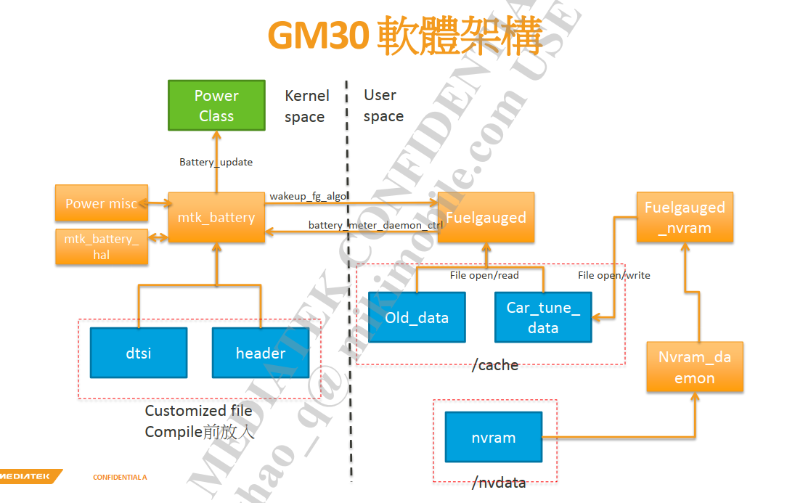
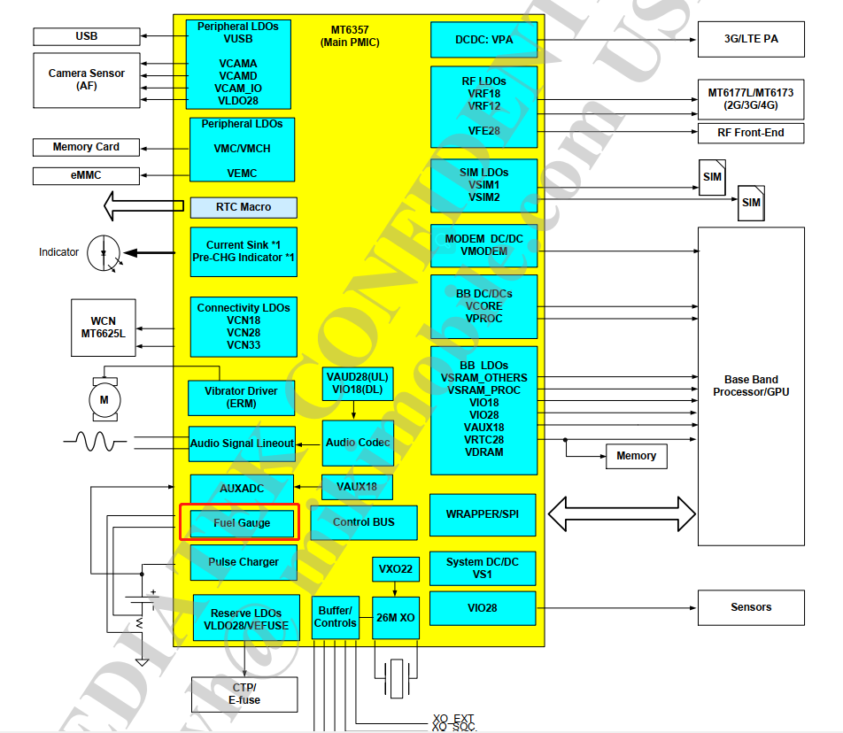
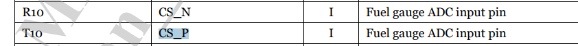
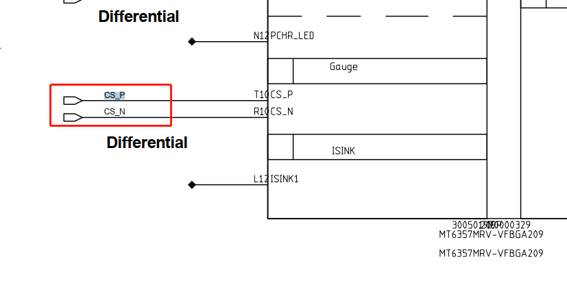
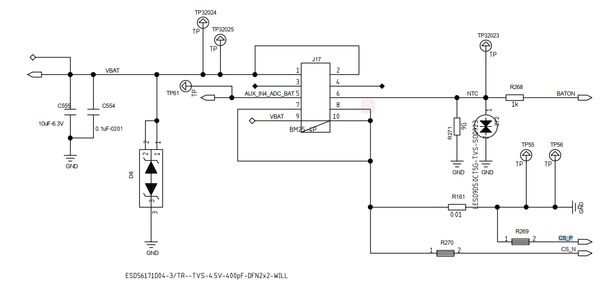
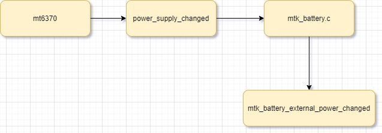

# README

mtk平台gauge驱动简介。

# refers

* [Fuel Gauge资料整理](refers/Fuel_Gauge)
* [MT6357_PMIC_Data_Sheet_V1.8.pdf](refers/MT6357_PMIC_Data_Sheet_V1.8.pdf)
* [Linux Power supply子系统分析](https://blog.csdn.net/weixin_46376201/article/details/125201962)

# 软件架构



# 硬件信息

mtk平台guage功能集成 在mt6357这颗pmic中：



电池直接接到mt6357上面获取电池adc电压值：





# dts

```C++
mt6357.dts:
        mtk_gauge: mtk_gauge {
                compatible = "mediatek,mt6357-gauge";
                charger = <&mt6370_chg>;
                bootmode = <&chosen>;
                io-channels = <&pmic_auxadc AUXADC_BAT_TEMP>,
                                <&pmic_auxadc AUXADC_ISENSE>,
                                <&pmic_auxadc AUXADC_VBIF>,
                                <&pmic_auxadc AUXADC_IMP>,
                                <&pmic_auxadc AUXADC_IMIX_R>;
                io-channel-names = "pmic_battery_temp",
                                "pmic_battery_voltage",
                                "pmic_bif_voltage",
                                "pmic_ptim_voltage",
                                "pmic_ptim_r";
                nvmem-cells = <&fg_init>, <&fg_soc>;
                nvmem-cell-names = "initialization", "state-of-charge";
        };

bat_setting/mt6765_battery_prop.dtsi:
&mtk_gauge {
        DIFFERENCE_FULLOCV_ITH = <(200)>;
        /* Charging termination current */
        SHUTDOWN_1_TIME = <(30)>;
        /* If ui_soc shows 1% more than X minites, system will shutdown */
        KEEP_100_PERCENT = <(1)>;
        R_FG_VALUE = <(10)>;
        /* R_sense resistance */
        EMBEDDED_SEL = <(0)>;
        /* Configures whether using embedded battery or not */
        PMIC_SHUTDOWN_CURRENT = <(20)>;
        /* System shutdown current */
        FG_METER_RESISTANCE = <(75)>;
        /* The resistance of PCB */
        CAR_TUNE_VALUE = <(100)>;
        /* Tune value for current measurement */
        PMIC_MIN_VOL = <(33500)>;
        /* vboot voltage for gauge 0%*/
        POWERON_SYSTEM_IBOOT = <(500)>;
        /* power on system iboot */
        SHUTDOWN_GAUGE0_VOLTAGE = <(34000)>;
        /* shutdown gauge 0% voltage */
        TEMPERATURE_T0 = <(50)>;
        /* Battery temperature T0 */
        TEMPERATURE_T1 = <(25)>;
        /* Battery temperature T1 */
        TEMPERATURE_T2 = <(10)>;
        /* Battery temperature T2 */
        TEMPERATURE_T3 = <(0)>;
        /* Battery temperature T3 */
        TEMPERATURE_T4 = <(-6)>;
        /* Battery temperature T4 */
        TEMPERATURE_T5 = <(-10)>;
        /* Battery temperature T5 */
        g_FG_PSEUDO100_T0 = <(100)>;
        /* Pseudo 100% percentage at T0 */
        g_FG_PSEUDO100_T1 = <(100)>;
        /* Pseudo 100% percentage at T1 */
        g_FG_PSEUDO100_T2 = <(100)>;
        /* Pseudo 100% percentage at T2 */
        g_FG_PSEUDO100_T3 = <(100)>;
        /* Pseudo 100% percentage at T3 */
        g_FG_PSEUDO100_T4 = <(100)>;
        /* Pseudo 100% percentage at T4 */
        Q_MAX_SYS_VOLTAGE_BAT0 = <(3350)>;
        /* Pseudo1 for hide percentage */
        Q_MAX_SYS_VOLTAGE_BAT1 = <(3350)>;
        /* Pseudo1 for hide percentage */
        Q_MAX_SYS_VOLTAGE_BAT2 = <(3350)>;
        /* Pseudo1 for hide percentage */
        Q_MAX_SYS_VOLTAGE_BAT3 = <(3350)>;
        /* Pseudo1 for hide percentage */
        COM_FG_METER_RESISTANCE = <(100)>;
        /* compensate The resistance of PCB */
        COM_R_FG_VALUE = <(0)>;
        /* compensate R_sense resistance */
        enable_tmp_intr_suspend = <(0)>;
        /* Enable update temp when suspend */
        ACTIVE_TABLE = <(6)>;
        /* Table numbers per battery */
        MULTI_TEMP_GAUGE0 = <(1)>;
        /* Multi gauge0 enable */
        RBAT_PULL_UP_R = <(16900)>;
        RBAT_PULL_UP_VOLT = <(1800)>;

#include "mt6765_battery_table_ext.dtsi"
};

bat_setting/mt6765_battery_table_ext.dtsi:电池曲线数据

        battery0_profile_t0_num = <100>;
        battery0_profile_t0_col = <3>;
        battery0_profile_t0 =
        <
        0       43370   1150
        307     43192   1150
        614     43032   1150
        920     42903   1150
        1227    42775   1139
        1534    42648   1127
        1841    42537   1142
        2147    42424   1165
        2454    42307   1195
        2761    42191   1187
        3068    42076   1178
        3374    41965   1194
        3681    41855   1200
        3988    41744   1200
...省略...
```

# 上报信息

电量计驱动需要完成很大一部分的工作，电量计实现比较复杂，这里简单列举一下：

充电曲线平滑算法；
放电曲线平滑算法；
电池基本信息上报，包括电池容量，充放电状态，电池百分比等等；

```shell
PAYTABLETM8:/sys/class/power_supply/battery # ls
capacity            current_avg      en_uisoc_lt_int  present        technology        uisoc
capacity_level      current_now      health           reset          temp              uisoc_ht_int_gap
charge_counter      cycle_count      init_done        resistance     temperature       uisoc_lt_int_gap
charge_full         device           log_level        serial_number  time_to_full_now  voltage_now
charge_full_design  disable          manufacturer     status         type              voltage_ocv
coulomb_int_gap     en_uisoc_ht_int  power            subsystem      uevent            wakeup116
```
下面对上报信息做个简单介绍：
capacity：当前电池容量
charge_full：充满电的电池容量
temp：电池温度
uevent：上报uevent需要用到的数据
charge_counter：充电次数
current_now：当前充电电流
health status：电池健康状态，包括cold，hot ,Good等
technology：电池类型，包括锂电池，镍铬电池等等
voltage_now：当前电池电压

# 上报信息代码流程

```C++
* mt6357_gauge_probe(struct platform_device *pdev) //mt6357_gauge.c
  * gauge->psy_desc.name = "mtk-gauge";
  * power_supply_register(&pdev->dev, &gauge->psy_desc,&gauge->psy_cfg); //注册gauge的psy设备，无实际作用
  * battery_psy_init(pdev) //重要啊，注册battery psy设备，负责上报
    * battery_service_data_init(gm);
      * bs_data->psd.name = "battery", //配置psy各种属性
      * 	bs_data->psd.external_power_changed = mtk_battery_external_power_changed; //当一个PSY设备存在supply PSY，且该supply PSY的属性发生改变（如online offline）时，power supply core会调用该回调函数，通知PSY driver以便让它做出相应处理。
    * power_supply_register(&(pdev->dev), &gm->bs_data.psd, &gm->bs_data.psy_cfg); //注册psy设备
  * battery_init(pdev); //mtk_battery.c 重点
    * kthread_run(battery_update_routine, gm, "battery_thread"); //线程更新，使用timer触发
    * mtk_power_misc_init(gm); //线程轮询关机条件，详情请参考
    * battery_algo_init(gm); //电池算法？不知道啥意思
```

# battery_update_routine线程

这里的更新策略和charger差不多，线程一直在这里`wait_event(gm->wait_que, (gm->fg_update_flag > 0));`阻塞着，采用hrtimer高精度定时器让线程每10s启动一次，代码如下：
```C++
/* ============================================================ */
/* periodic timer */
/* ============================================================ */
void fg_drv_update_hw_status(struct mtk_battery *gm)
{
	ktime_t ktime;

	bm_err("car[%d,%ld,%ld,%ld,%ld] tmp:%d soc:%d uisoc:%d vbat:%d ibat:%d algo:%d gm3:%d %d %d %d,boot:%d\n",
		gauge_get_int_property(GAUGE_PROP_COULOMB),
		gm->coulomb_plus.end, gm->coulomb_minus.end,
		gm->uisoc_plus.end, gm->uisoc_minus.end,
		force_get_tbat_internal(gm, true),
		gm->soc, gm->ui_soc,
		gauge_get_int_property(GAUGE_PROP_BATTERY_VOLTAGE),
		gauge_get_int_property(GAUGE_PROP_BATTERY_CURRENT),
		gm->algo.active,
		gm->disableGM30, gm->fg_cust_data.disable_nafg,
		gm->ntc_disable_nafg, gm->cmd_disable_nafg,
		gm->bootmode);

	fg_drv_update_daemon(gm);

	/* kernel mode need regular update info */
	if (gm->algo.active == true)
		battery_update(gm);

	if (bat_get_debug_level() >= BMLOG_DEBUG_LEVEL)
		ktime = ktime_set(10, 0);
	else
		ktime = ktime_set(60, 0);

	hrtimer_start(&gm->fg_hrtimer, ktime, HRTIMER_MODE_REL);
}

int battery_update_routine(void *arg)
{
	struct mtk_battery *gm = (struct mtk_battery *)arg;

	battery_update_psd(gm);
	while (1) {
		bm_err("%s\n", __func__);
		wait_event(gm->wait_que, (gm->fg_update_flag > 0));
		gm->fg_update_flag = 0;

		fg_drv_update_hw_status(gm);
	}
}

void fg_update_routine_wakeup(struct mtk_battery *gm)
{
	bm_err("%s\n", __func__);
	gm->fg_update_flag = 1;
	wake_up(&gm->wait_que);
}

enum hrtimer_restart fg_drv_thread_hrtimer_func(struct hrtimer *timer)
{
	struct mtk_battery *gm;

	bm_err("%s\n", __func__);
	gm = container_of(timer,
		struct mtk_battery, fg_hrtimer);
	fg_update_routine_wakeup(gm);
	return HRTIMER_NORESTART;
}

void fg_drv_thread_hrtimer_init(struct mtk_battery *gm)
{
	ktime_t ktime;

	ktime = ktime_set(10, 0); //第一个形参为秒，第二个为纳秒，这里设置10秒更新一次
	hrtimer_init(&gm->fg_hrtimer, CLOCK_MONOTONIC, HRTIMER_MODE_REL);
	gm->fg_hrtimer.function = fg_drv_thread_hrtimer_func;
	hrtimer_start(&gm->fg_hrtimer, ktime, HRTIMER_MODE_REL);
}
```

# battery_update更新参数

可以看到battery实际也只更新了如下几个参数，包括：电池电压、温度、电池技术、健康信息、在位信息、电量，最终调用`power_supply_changed`上报。
```C++
/* ============================================================ */
/* power supply battery */
/* ============================================================ */
void battery_update_psd(struct mtk_battery *gm)
{
	struct battery_data *bat_data = &gm->bs_data;

	gauge_get_property(GAUGE_PROP_BATTERY_VOLTAGE, &bat_data->bat_batt_vol);
	bat_data->bat_batt_temp = force_get_tbat(gm, true);
}
void battery_update(struct mtk_battery *gm)
{
	struct battery_data *bat_data = &gm->bs_data;
	struct power_supply *bat_psy = bat_data->psy;

	if (gm->is_probe_done == false || bat_psy == NULL) {
		bm_err("[%s]battery is not rdy:probe:%d\n",
			__func__, gm->is_probe_done);
		return;
	}

	battery_update_psd(gm);
	bat_data->bat_technology = POWER_SUPPLY_TECHNOLOGY_LION;
	bat_data->bat_health = POWER_SUPPLY_HEALTH_GOOD;
	bat_data->bat_present =
		gauge_get_int_property(GAUGE_PROP_BATTERY_EXIST);

	if (battery_get_int_property(BAT_PROP_DISABLE))
		bat_data->bat_capacity = 50;

	if (gm->algo.active == true)
		bat_data->bat_capacity = gm->ui_soc;

	power_supply_changed(bat_psy);

}
```

# external_power_changed原理分析

其实这个原理很简单，就是供电者通知被供电者的一种方式，首先关注一下`struct power_supply`,它为power supply class的核心数据结构，用于抽象PSY设备，定义如下(kernel/msm-4.19/include/linux/power_supply.h)：
```C++
struct power_supply {
       const char *name;   //该PSY的名称
       enum power_supply_type type; //该PSY的类型，枚举类型，一般包括:battery、USB-charger、DC-charger。
       enum power_supply_property *properties; //该PSY具有的属性列表，枚举型。
#ifdef CONFIG_CHARGING_NODEADD
        Int charge_node_add    //需要添加节点的话要在这里添加节点属性

#endif

       size_t num_properties;  //属性的个数
       char **supplied_to; //一个字符串数组，保存了由该PSY供电的PSY列表，以此可将PAY组成互相级联的PSY链表。这些被供电的PSY，称作supplicant（客户端，乞求者）
       size_t num_supplicants;//supplicant的个数。
       char **supplied_from; //一个字符串数组，保存了该PSY供电的PSY列表，也称作supply（提供者），从另外一个方向组织PSY之间的级联关系。
       size_t num_supplies; //supply的个数
```

当一个PSY设备存在supply PSY(供电者)，且该supply PSY的属性发生改变（如online offline）时，power supply core会调用该回调函数，通知PSY driver以便让它做出相应处理。

## supply PSY(供电者)注册

逻辑关系如下：


可以看到mt6370给mtk-master-charger和battery供电，当mt6370的PSY的属性发生改变，被供电者的external_power_changed将会被回调通知。
```C++
static char *mt6370_charger_supplied_to[] = {
	"battery",
	"mtk-master-charger"
};

static int mt6370_pmu_charger_probe(struct platform_device *pdev)
{
  /* power supply register */
  memcpy(&chg_data->psy_desc,
    &mt6370_charger_desc, sizeof(chg_data->psy_desc));
  chg_data->psy_desc.name = dev_name(&pdev->dev);

  charger_cfg.drv_data = chg_data;
  charger_cfg.of_node = pdev->dev.of_node;
  charger_cfg.supplied_to = mt6370_charger_supplied_to;
  charger_cfg.num_supplicants = ARRAY_SIZE(mt6370_charger_supplied_to);
  chg_data->psy = devm_power_supply_register(&pdev->dev,
          &chg_data->psy_desc, &charger_cfg);
  if (IS_ERR(chg_data->psy)) {
    dev_notice(&pdev->dev, "Fail to register power supply dev\n");
    ret = PTR_ERR(chg_data->psy);
    goto err_register_psy;
  }
}
```

## battery被供电者配置

当mt6370的PSY的属性发生改变，battery具体干了更新充电状态、获取充电类型并判断电池是拔出还是插入了，并更新上报电池参数。
```C++
void battery_service_data_init(struct mtk_battery *gm)
{
	struct battery_data *bs_data;

	bs_data = &gm->bs_data;
	bs_data->psd.name = "battery",
	bs_data->psd.type = POWER_SUPPLY_TYPE_BATTERY;
	bs_data->psd.properties = battery_props;
	bs_data->psd.num_properties = ARRAY_SIZE(battery_props);
	bs_data->psd.get_property = battery_psy_get_property;
	bs_data->psd.external_power_changed =
		mtk_battery_external_power_changed;
	bs_data->psy_cfg.drv_data = gm;
}

static void mtk_battery_external_power_changed(struct power_supply *psy)
{
	struct mtk_battery *gm;
	struct battery_data *bs_data;
	union power_supply_propval online, status;
	union power_supply_propval prop_type;
	int cur_chr_type;

	struct power_supply *chg_psy = NULL;
	int ret;

	gm = psy->drv_data;
	bs_data = &gm->bs_data;
	chg_psy = devm_power_supply_get_by_phandle(&gm->gauge->pdev->dev,
						       "charger");
	if (IS_ERR_OR_NULL(chg_psy)) {
		bm_err("%s Couldn't get chg_psy\n", __func__);
	} else {
		ret = power_supply_get_property(chg_psy,
			POWER_SUPPLY_PROP_ONLINE, &online);

		ret = power_supply_get_property(chg_psy,
			POWER_SUPPLY_PROP_STATUS, &status);

		if (!online.intval)
			bs_data->bat_status = POWER_SUPPLY_STATUS_DISCHARGING;
		else {
//FEATURE-MOD-BEGIN by shanliangliang@paxsz.com, 2021/09/23
#if 0
			if (status.intval == POWER_SUPPLY_STATUS_NOT_CHARGING)
				bs_data->bat_status =
					POWER_SUPPLY_STATUS_NOT_CHARGING;
			else
				bs_data->bat_status =
					POWER_SUPPLY_STATUS_CHARGING;
#else
			if (POWER_SUPPLY_STATUS_FULL != status.intval)
				bs_data->bat_status = status.intval;
#endif
//FEATURE-MOD-BEGIN by shanliangliang@paxsz.com, 2021/09/23
			fg_sw_bat_cycle_accu(gm);
		}

		//[FEATRUE]-MOD-BEGIN by shanliangliang@paxsz.com, 2021-09-23
		if (status.intval == POWER_SUPPLY_STATUS_FULL
			&& gm->b_EOC != true) {
			bm_err("POWER_SUPPLY_STATUS_FULL\n");
			notify_fg_chr_full(gm, true);
			if (bs_data->bat_capacity >= 100) {
				bs_data->bat_status = POWER_SUPPLY_STATUS_FULL;
				gm->b_EOC = true;
				notify_fg_chr_full(gm, false);
			}
		} else if (status.intval != POWER_SUPPLY_STATUS_FULL) {
			gm->b_EOC = false;
		}
		//[FEATRUE]-MOD-END by shanliangliang@paxsz.com, 2021-09-23

		battery_update(gm);

		/* check charger type */
		ret = power_supply_get_property(chg_psy,
			POWER_SUPPLY_PROP_USB_TYPE, &prop_type);

		/* plug in out */
		cur_chr_type = prop_type.intval;

		if (cur_chr_type == POWER_SUPPLY_TYPE_UNKNOWN) {
			if (gm->chr_type != POWER_SUPPLY_TYPE_UNKNOWN)
				wakeup_fg_algo(gm, FG_INTR_CHARGER_OUT);
		} else {
			if (gm->chr_type == POWER_SUPPLY_TYPE_UNKNOWN)
				wakeup_fg_algo(gm, FG_INTR_CHARGER_IN);
		}

	}

	bm_err("%s event, name:%s online:%d, status:%d, EOC:%d, cur_chr_type:%d old:%d\n",
		__func__, psy->desc->name, online.intval, status.intval,
		gm->b_EOC, cur_chr_type, gm->chr_type);

	gm->chr_type = cur_chr_type;

}
```