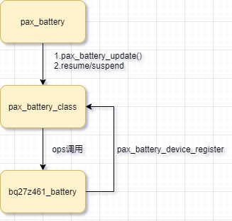

# README

mtk平台gauge驱动简介。

# refers


# 软件架构

这里采用和pax_charger相同的软件架构，都是每一个驱动ic在加载时只需要在该类文件下通过接口`device_register`向内核注册名为gauge_ic的设备文件即可，设备文件包含操作gauge的所有ops，同时对外暴露以下接口供pax_battey或者bms调用：



* ops：
```C++
static struct pax_battery_device_ops bq27z746_bat_ctl_ops = {
	.is_bat_exist = bq27z746_is_exist,
	.get_bat_manufactuer = bq27z746_get_manufactuer_name,
	.get_bat_sn = bq27z746_get_manufactuer_info,
	.get_bat_capacity = bq27z746_get_cap, //容量
	.get_bat_rm_capacity = bq27z746_get_rm,
	.get_bat_voltage = bq27z746_get_volt,
	.get_bat_current = bq27z746_get_current,
	.get_bat_avg_current = bq27z746_get_current_avg,
	.get_bat_temperature = bq27z746_get_temp,
	//.get_ibus = ,
	//.get_vbus = ,
	.get_uisoc = bq27z746_get_uisoc, //和get_soc一样
	.get_soc = bq27z746_get_soc,
	.get_bat_health = bq27z746_get_health,
	.get_bat_soh = bq27z746_get_soh, //电池健康度可以理解为电池当前的容量与出厂容量的百分比
	.get_bat_cycle = bq27z746_get_bat_cycle, //充电次数
	.get_fault_status = bq27z746_get_fault_status,
};
```

* pax_battery接口：
```C++
extern int pax_battery_register_power_supply(struct device *dev); //注册psy设备
extern int pax_battery_set_status(int new_status);  //设置充电状态
extern int pax_battery_get_info(void);
extern int pax_battery_supply_changed(void);
extern int pax_battery_update(void);
```

# 实体battery注册class设备

```C++
struct pax_battery_device *pax_battery_device_register(const char *name,
		struct device *parent, void *devdata,
		const struct pax_battery_device_ops *ops)
{
	int ret;
	struct pax_battery_device *battery_dev;
	struct device_attribute **attrs;
	struct device_attribute *attr;


	pr_info("%s: name=%s\n", __func__, name);
	battery_dev = kzalloc(sizeof(*battery_dev), GFP_KERNEL);
	if (!battery_dev)
		return ERR_PTR(-ENOMEM);

	mutex_init(&battery_dev->ops_lock);
	battery_dev->name = name;
	battery_dev->dev.class = pax_battery_class;
	battery_dev->dev.parent = NULL;
	battery_dev->dev.release = pax_battery_device_release;
	dev_set_name(&battery_dev->dev, "gauge_ic");
	dev_set_drvdata(&battery_dev->dev, devdata);

	ret = device_register(&battery_dev->dev);
	if (ret) {
		kfree(battery_dev);
		return ERR_PTR(ret);
	}
	battery_dev->ops = ops;
	battery_dev->ws_charge = wakeup_source_register(NULL, "ws_charge");
	g_pax_battery_dev = battery_dev;

	pax_battery_parse_dt(parent);

	attrs = pax_battery_attrs;
	while ((attr = *attrs++)) {
		device_create_file(&battery_dev->dev, attr);
	}


	/* for init soc show */
	INIT_DELAYED_WORK(&get_bat_info_work, pax_get_bat_info_work);
	schedule_delayed_work(&get_bat_info_work, msecs_to_jiffies(5000));

	alarm_init(&battery_dev->batt_alarm, ALARM_BOOTTIME,
			pax_battery_alarm_func);

	return battery_dev;
}
EXPORT_SYMBOL(pax_battery_device_register);

static int bq27z746_i2c_probe(struct i2c_client *client, const struct i2c_device_id *id)
{
	g_batt_info->pax_bat_dev = pax_battery_device_register(BQ27Z746_DEVICE_NAME,
			&client->dev, g_batt_info, &bq27z746_bat_ctl_ops);
}
```

# pax_battery轮询上报

pax_battery创建一个5s轮询工作队列通过`pax_battery_update`上报给health，休眠则关闭上报。
```C++
static void pax_battery_dwork(struct work_struct *work)
{
	pax_battery_update();

	schedule_delayed_work(&g_info->batt_change_dwork, msecs_to_jiffies(BATTERY_POLL_INTERVAL));

}

static int pax_battery_probe(struct platform_device *pdev)
{
	ret = pax_battery_register_power_supply(&pdev->dev);
	if (ret < 0) {
		pr_err("%s: register battery psy fail!\n", __func__);
		goto err1;
	}

	INIT_DELAYED_WORK(&g_info->batt_change_dwork, pax_battery_dwork);
	schedule_delayed_work(&g_info->batt_change_dwork, msecs_to_jiffies(10*1000));	

}

static int pax_battery_suspend(struct device *dev)
{
	cancel_delayed_work(&g_info->batt_change_dwork);
	pax_battery_class_suspend();
	return 0;
}

static int pax_battery_resume(struct device *dev)
{
	schedule_delayed_work(&g_info->batt_change_dwork, msecs_to_jiffies(2));
	pax_battery_class_resume();
	return 0;
}
```