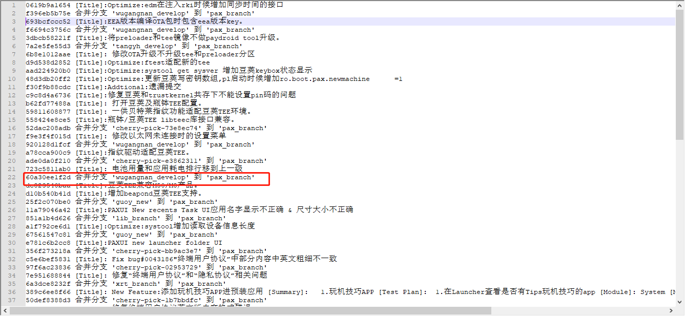
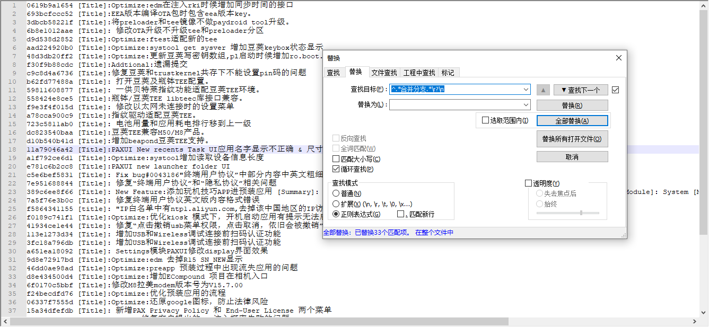
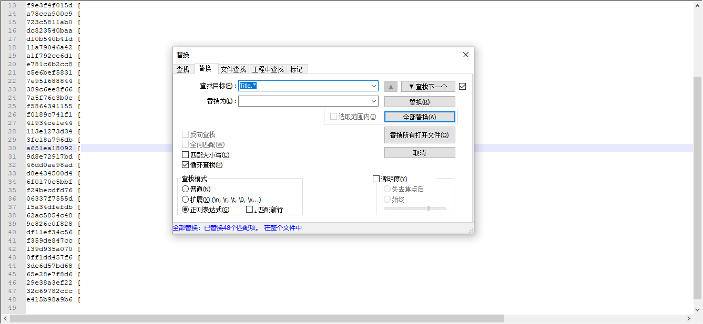
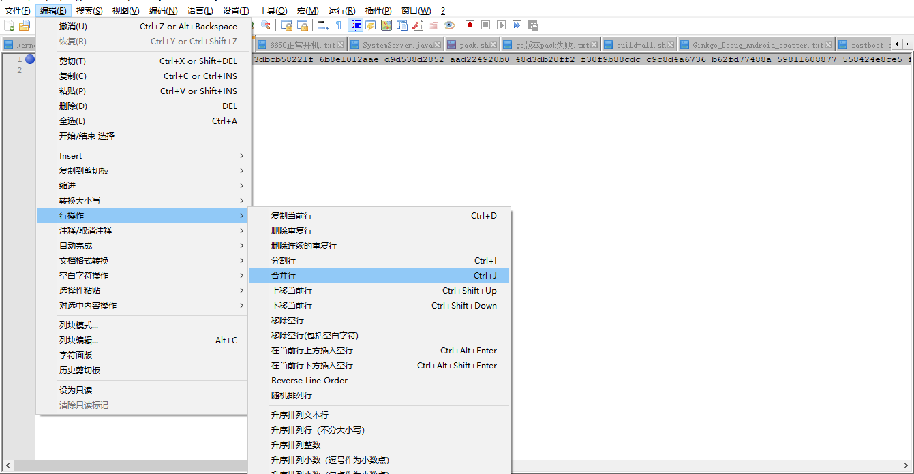
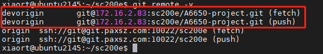

# 常用git操作汇总

总结以下常用的git命令

# cherry-pick技巧

* git cherry-pick <commit id>:单独合并一个提交
* git cherry-pick -x <commit id>：同上，不同点：保留原提交者信息。
* 如果有100个commit要合并到master分支呢？
* git cherry-pick commit1..commit100

但是要注意，这是一个左开右闭的操作，也就是说，commit1不会被合并到master分支，而commit100则会。这样的话上面的需求可以如下操作来实现：

注意：上面讲到cherry-pick命令每拣选一个commit就会提交一次生成一个新的commit id。 如果我们想让每个commit 拣选后暂缓提交，等到所有commit都拣选完成后，自己手动commit，应该怎么办呢？答案是用-n 选项。

# cherry-pick挑选中间几个

* [notepad++ 去掉包含某个字符串的所有行](https://www.cnblogs.com/czp2016/p/15661741.html)
* [Notepad++常用操作——去除每行某字符串后面的内容](https://blog.csdn.net/qq_38516799/article/details/105371700)

* git log --oneline -100 origin/pax_branch



* 需要使用正则`^.*合并分支.*\r?\n`删除合并选项：



* 正则`Title.*`去除每行`Title`字符串后面的内容:



* 使用notepad合并行功能，多列变一行：



* 出现合并冲突：
```shell
wugn@jcrj-tf-compile:M8-project$ git cherry-pick 0619b9a1654 693bcfccc52 3dbcb58221f 6b8e1012aae d9d538d2852 aad224920b0 48d3db20ff2 f30f9b88cdc c9c8d4a6736 b62fd77488a 59811608877 558424e8ce5 f9e3f4f015d a78cca900c9 723c5811ab0 dc823540baa d10b540b41d 11a79046a42 a1f792ce6d1 e781c6b2cc8 c5e6bef5831 7e951688844 389c6ee8f66 7a5f76e3b0c f5864341155 f0189c741f1 41934ce1e44 113e1273d34 3fc18a796db a651ea18092 9d8e72917bd 46dd0ae98ad d8e434500d4 6f0170c5bbf f24becdfd76 06337f7555d 15a34dfefdb 62ac5854c48 9e826c0f828 df11ef34c56 f359de847cc 139d935a070 0ff1dd457f6 3de6d57bd68 65e28e7f8d6 29e38a3ef22 32c69782cfc e415b98a9b6

Performing inexact rename detection: 100% (1188/1188), done.
error: could not apply 0619b9a1654... [Title]:Optimize:edm在注入rki时候增加同步时间的接口
hint: after resolving the conflicts, mark the corrected paths
hint: with 'git add <paths>' or 'git rm <paths>'
hint: and commit the result with 'git commit'
```

* git diff :
```diff
--- a/paxdroid/packages/apps/edm/Android.mk
+++ b/paxdroid/packages/apps/edm/Android.mk
@@@ -7,7 -7,7 +7,11 @@@ LOCAL_MODULE_SUFFIX := $(COMMON_ANDROID
  #LOCAL_PRIVILEGED_MODULE :=
  LOCAL_PRODUCT_MODULE := true
  LOCAL_CERTIFICATE := platform
++<<<<<<< HEAD
 +LOCAL_SRC_FILES := EDM_V2.00.00_20220809_release.apk
++=======
+ LOCAL_SRC_FILES := EDM_V2.00.00_20221024_release.apk
++>>>>>>> 0619b9a1654... [Title]:Optimize:edm在注入rki时候增加同步时间的接口
  LOCAL_MODULE_PATH := $(TARGET_OUT_VENDOR)/operator/app
  LOCAL_DEX_PREOPT := false
  #LOCAL_REQUIRED_MODULES :=
* Unmerged path paxdroid/packages/apps/edm/EDM_V2.00.00_20220809_release.apk
* Unmerged path paxdroid/packages/apps/edm/EDM_V2.00.00_20220923_release.apk
* Unmerged path paxdroid/packages/apps/edm/EDM_V2.00.00_20221024_release.apk

```

* 解决第一个冲突后添加：
```
wugn@jcrj-tf-compile:M8-project$ rm paxdroid/packages/apps/edm/EDM_V2.00.00_20220809_release.apk
wugn@jcrj-tf-compile:M8-project$ rm paxdroid/packages/apps/edm/EDM_V2.00.00_20220923_release.apk
git add paxdroid/packages/apps/edm
```

* git commit:
```shell
wugn@jcrj-tf-compile:M8-project$ git commit
[product e7c56eaa002] [Title]:Optimize:edm在注入rki时候增加同步时间的接口
 Author: lib <lib@paxsz.com>
 Date: Mon Oct 24 23:37:33 2022 +0800
 4 files changed, 1 insertion(+), 1 deletion(-)
 rename paxdroid/packages/apps/edm/{EDM_V2.00.00_20220809_release.apk => EDM_V2.00.00_20221024_release.apk} (88%)
 create mode 100755 paxdroid/packages/apps/edm/EDM_V2.00.00_20221026_release.apk
 create mode 100755 paxdroid/packages/apps/edm/edmsource/common_lib/libs/libusbmonitor_20221022094026.jar
```

* git cherry-pick --continue:
```
wugn@jcrj-tf-compile:M8-project$ git cherry-pick --continue
[product 4de6948cd26] [Title]:EEA版本编译OTA包时包含eea版本key。
 Date: Mon Oct 24 12:37:36 2022 +0800
 2 files changed, 28 insertions(+)
error: could not apply 3dbcb58221f... [Title]:将preloader和tee镜像不做paydroid tool升级。
hint: after resolving the conflicts, mark the corrected paths
hint: with 'git add <paths>' or 'git rm <paths>'
hint: and commit the result with 'git commit'

wugn@jcrj-tf-compile:M8-project$ vim vendor/mediatek/proprietary/buildinfo_vnd/label.ini
wugn@jcrj-tf-compile:M8-project$ vim vendor/mediatek/proprietary/buildinfo_vnd/label_eea.ini
wugn@jcrj-tf-compile:M8-project$ git add vendor/mediatek/proprietary/buildinfo_vnd
wugn@jcrj-tf-compile:M8-project$ git commit
[product 73f6417b816] [Title]:将preloader和tee镜像不做paydroid tool升级。
 Date: Sat Oct 22 16:31:03 2022 +0800
 11 files changed, 40 insertions(+), 12 deletions(-)
 create mode 100755 selfbuild_modem
```

一个一个的修改就好了。

# 多个git项目库之间的cherry-pick操作

* [多个git项目库之间的cherry-pick操作](https://blog.csdn.net/qq_40102178/article/details/123378200)

* 目的：目的：把A库master分支的某次提交commit id 提交到 B库pax_gms_branch_m9200分支

从git上的A库 fork 到 B库，然后A库和B库进行独自的开发。开发中也会遇到一些问题，例如A库有重要的代码修复，老办法是再去B库修改一次，操作起来不太方便。这里就尝试从多个不同git库中进行cherry-pick。

* B库： 在本地添加另一个A库
```
git remote add devorigin git@172.16.2.83:sc200e/A6650-project.git
```

* `git remote -v`B库： 通过 git remote -v 查看是否添加成功:



* B库： 通过 git fetch devorigin 将A库的该分支信息同步到本地

* B库： 通过`git log devorigin/gms_branch_m9200`获取A库gms_branch_m9200分支提交。

* 完成 fetch 就已经可以开始cherry-pick操作了,B库:
```
git cherry-pick fa25a2a43d3f82870b68883645fd7442412ab40c(首)..bff5dcedbb046aeb30ad070632e3d7bd8d5690b9
```

# git stash

如果我们不想提交完成一半或者不完善的代码，但是却不得不去修改一个紧急Bug，那么使用git stash就可以将你当前未提交到本地（和服务器）的代码推入到Git的栈中，这时候你的工作区间和上一次提交的内容是完全一样的，所以你可以放心的修Bug，等到修完Bug，提交到服务器上后，再使用git stash pop将以前一半的工作应用回来。git stash命令把未提交的修改储存起来，用于后续的恢复,记住不能执行git commit

git stash [save 'message']： git stash用于保存为提交的修改，已经commit的不适用了，加一个save可以添加备注信息，用于记录版本。
git stash list：查看所有的stash。
git stash show ：显示做了哪些改动，默认show第一个存储,如果要显示其他存储，后面加stash id，比如第二个 git stash show stash@{1}，完整的差异可以使用git stash show -p。
git stash pop：将stash缓存堆栈中第一个stash也就是stash@{0}删除，并将对应修改应用到当前的工作目录下。
git stash apply:  将stash缓存堆栈中第一个stash应用到当前的工作目录下，但是不会删除缓存堆栈中的缓存，默认使用第一个存储,即stash@{0}，应用某个stash后面加stash id。
git stash drop stash@{$num} ：删除stash@{$num}存储，从列表中删除这个存储，默认删除第一个。
git stash clear:  删除缓存堆栈中所有存储。

# git clean使用总结

git clean移除工作区中untracked的文件(即：需要先add)。一直都是用rm来操作……😓

1、git clean -n：列出会被删除的文件，未删除

2、git clean -f：force, 执行删除，不会删除.gitignore中指定的文件，clean.requireForce设置为false可不用带-f，直接使用git clean。

3、git clean -f <path>：删除指定路径的文件

4、git clean -df：删除文件和目录

5、git clean -xf：连.gitignore中指定的文件一起删除

# git diff原理

掌握git diff命令的重点在于，明白Git文件的四种状态，以及文件的所在区域。
文件所在的区域有三个：工作区、暂存区、仓库。 
文件的流转方向是由工作区创建，add进入暂存区，commit进入仓库。
git diff的比较是从右向左。
git diff 比较暂存区与工作区文件的区别。
git diff --cached 比较仓库与暂存区文件的区别。