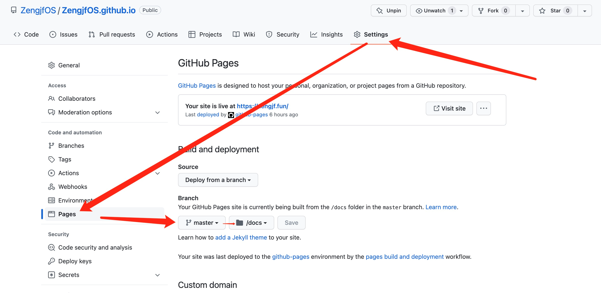
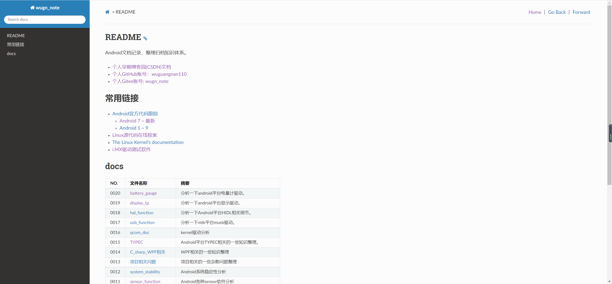
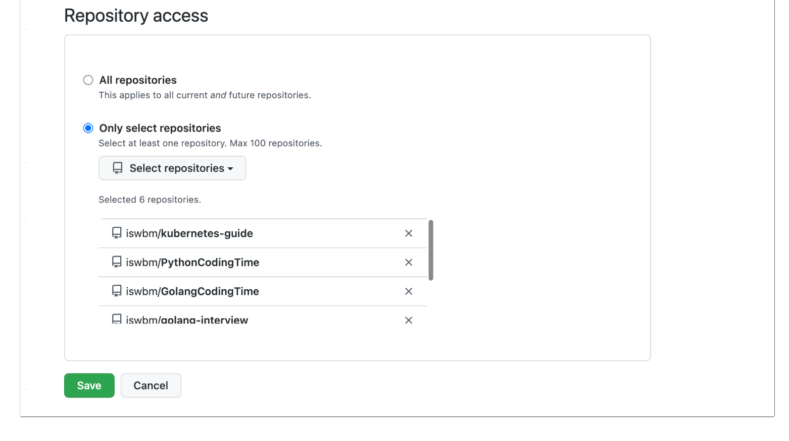
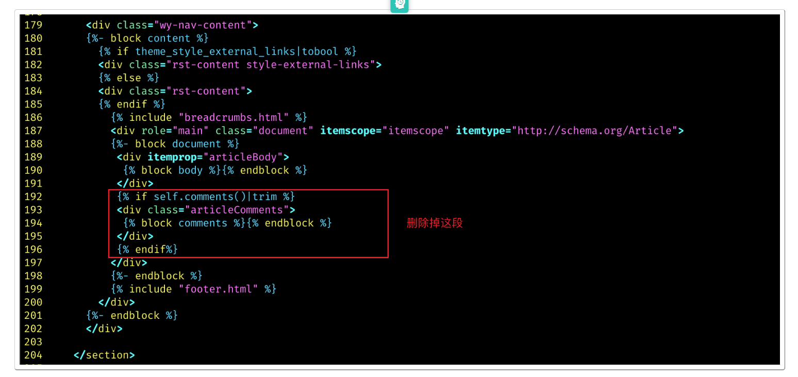
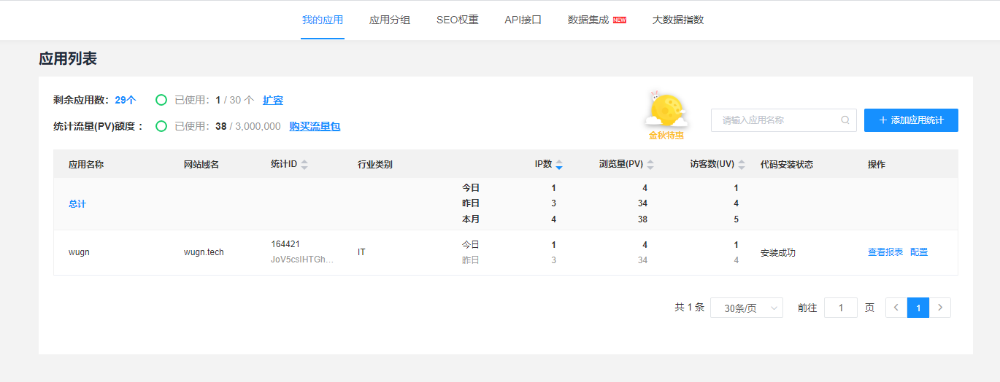
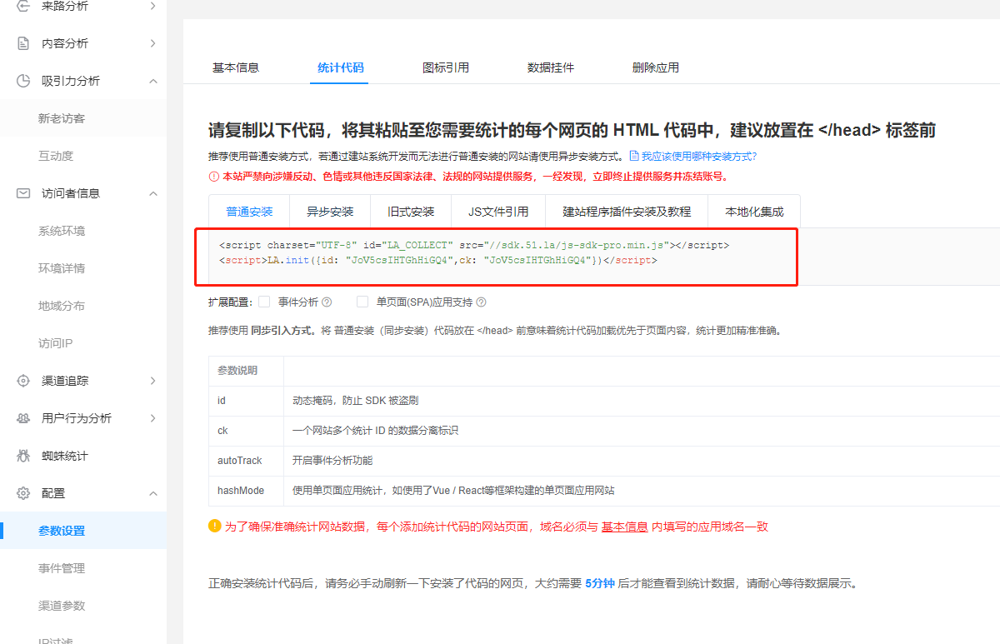
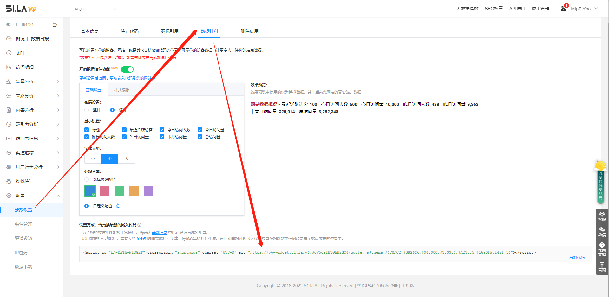
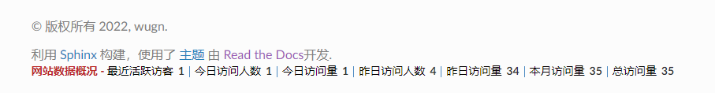

# README

介绍sphinx渲染markdown文档。

所谓Sphinx，其实就是一个能将reStructuredText（类似于Markdown）语法的文本文件转换为HTML、PDF、epub等格式的强大工具。

要知道，Python的官方文档就是利用这款工具书写而成的，并且被广泛用于各式各样的说明文档。

# Sphinx注意事项

* github图片某些图片无法正常显示，需要连接外网才行，国内有限制。
* Sphinx制作渲染图片时，文件路径及文件名不能带中文，否则无法显示。
* 文字和图片中间应该添加空格，不然会挤在一起，影响美观。
* 代码块中不能有未注释的中文，否则整体显示没效果，不高亮。
* `make server`后，访问`http://127.0.0.1:8090`可在本地预览。

# refers

* [Sphinx Getting started](https://www.sphinx-doc.org/en/master/tutorial/getting-started.html#setting-up-your-project-and-development-environment)
* [Sphinx Markdown](https://www.sphinx-doc.org/zh_CN/master/usage/markdown.html)
* [make: sphinx-build: Command not found](https://blog.csdn.net/Will_Ye/article/details/106319473)
* [Sphinx_Demo](refers/Sphinx_Demo)
* [Sphinx入门教程](https://blog.csdn.net/weixin_47319129/article/details/125309657)
* [Sphinx Themes Gallery](https://sphinx-themes.org/)
* [Sphinx 使用手册](https://zh-sphinx-doc.readthedocs.io/en/latest/rest.html)

gittee搭建：
* [利用Gitee+Hexo搭建个人网站](https://zhuanlan.zhihu.com/p/269420507)
* [gitee码云Pages说明](http://git.mydoc.io/?t=154714)

# 命令介绍

```shell
make html //编译静态网站
make docs //将_build编译文件拷贝到docs里面，github page一般选择docs文件夹作网页展示
make server //创建本地服务器网站
```

# github.io创建

GitHub.io 就是GitPage，GitPage 是一个用于展示你的项目和项目网站的托管工具。
简言之我们可以把项目介绍，主页等放到GitHub.io上。

* 我们能在GitHub.io上做什么
  * GitHub.io可以存放 .html 文件来展示网页，可用于项目主页也可以搭建个人博客。
    * 例如 Hello World
  * GitHub.io也可以作为你自己的图床，上传一张图片到仓库，并生成一个远程链接。
    * 例如 测试图片

参考以下搭建：
* [GitHub.io 使用教程](https://www.jianshu.com/p/22b413e3da53)

# sphinx环境配置

这里先简单说明一下各个文件的作用：
* build：生成的文件的输出目录
* source: 存放文档源文件
  * _static：静态文件目录，比如图片等
  * _templates：模板目录
  * conf.py：进行 Sphinx 的配置，如主题配置等
  * index.rst：文档项目起始文件，用于配置文档的显示结构
* cmd.bat：这是自己加的脚本文件（里面的内容是‘cmd.exe’）,用于快捷的打开windows的命令行
* make.bat：Windows 命令行中编译用的脚本
* Makefile：编译脚本，make 命令编译时用

首先保障python3环境正常，并执行以下命令：
* pip3 install sphinx
* pip3 install sphinx-rtd-theme
* pip3 install myst-parser
* sphinx-build --version
```
sphinx-build 4.3.2
```

# 新建sphinx project

* sphinx-quickstart docs
```shell
Welcome to the Sphinx 4.3.2 quickstart utility.

Please enter values for the following settings (just press Enter to
accept a default value, if one is given in brackets).

Selected root path: docs

You have two options for placing the build directory for Sphinx output.
Either, you use a directory "_build" within the root path, or you separate
"source" and "build" directories within the root path.
> Separate source and build directories (y/n) [n]: y

The project name will occur in several places in the built documentation.
> Project name: wugn_note
> Author name(s): wugn
> Project release []: 0.0.1

If the documents are to be written in a language other than English,
you can select a language here by its language code. Sphinx will then
translate text that it generates into that language.

For a list of supported codes, see
https://www.sphinx-doc.org/en/master/usage/configuration.html#confval-language.
> Project language [en]: en

Creating file /home/pi/wugn/sphinx/docs/source/conf.py.
Creating file /home/pi/wugn/sphinx/docs/source/index.rst.
Creating file /home/pi/wugn/sphinx/docs/Makefile.
Creating file /home/pi/wugn/sphinx/docs/make.bat.

Finished: An initial directory structure has been created.

You should now populate your master file /home/pi/wugn/sphinx/docs/source/index.rst and create other documentation
source files. Use the Makefile to build the docs, like so:
   make builder
where "builder" is one of the supported builders, e.g. html, latex or linkcheck.
```

* make html
```shell
Running Sphinx v4.3.2
loading translations [en]... done
loading pickled environment... done
building [mo]: targets for 0 po files that are out of date
building [html]: targets for 1 source files that are out of date
updating environment: [config changed ('language')] 1 added, 0 changed, 0 removed
reading sources... [100%] index
looking for now-outdated files... none found
pickling environment... done
checking consistency... done
preparing documents... done
writing output... [100%] index
generating indices... genindex done
writing additional pages... search done
copying static files... done
copying extra files... done
dumping search index in English (code: en)... done
dumping object inventory... done
build succeeded.

The HTML pages are in build/html.
```

# markdown支持修改

增加扩展`myst_parser`兼容markdown文件。sphinx配置为解析具有扩展名的所有文件 .md 和 .txt 作为 Markdown
```diff
diff --git a/source/conf.py b/source/conf.py
index 9e4f81f..30fc640 100644
--- a/source/conf.py
+++ b/source/conf.py
@@ -31,8 +31,15 @@ release = '0.0.1'
 # extensions coming with Sphinx (named 'sphinx.ext.*') or your custom
 # ones.
 extensions = [
+    'myst_parser'
 ]

+source_suffix = {
+    '.rst': 'restructuredtext',
+    '.txt': 'restructuredtext',
+    '.md': 'markdown',
+}
+
 # Add any paths that contain templates here, relative to this directory.
 templates_path = ['_templates']

@@@ -46,7 -41,14 +46,7 @@@ templates_path = ['_templates'
  # List of patterns, relative to source directory, that match files and
  # directories to ignore when looking for source files.
  # This pattern also affects html_static_path and html_extra_path.
--exclude_patterns = []
++exclude_patterns = ['_build', 'Thumbs.db', '.DS_Store']

@@ -54,7 +61,7 @@ exclude_patterns = []
 # The theme to use for HTML and HTML Help pages.  See the documentation for
 # a list of builtin themes.
 #
-html_theme = 'alabaster'
+html_theme = 'sphinx_rtd_theme'

@@@ -55,11 -57,11 +55,16 @@@
  # a list of builtin themes.
  #
  html_theme = 'sphinx_rtd_theme'
++html_title = 'wugn'
++html_short_title = 'wugn'

# Add any paths that contain custom static files (such as style sheets) here,
  # relative to this directory. They are copied after the builtin static files,
  # so a file named "default.css" will overwrite the builtin "default.css".
 -ihtml_static_path = ['_static']
 +html_static_path = ['_static']
++templates_path = ['_templates']
 +
 +def setup(app):
-     app.add_css_file('default.css')
++    app.add_css_file('default.css')
+ 
 # Add any paths that contain custom static files (such as style sheets) here,
 # relative to this directory. They are copied after the builtin static files,
 ```

 # html width

* `docs/source/_static/default.css`让表格长度自适应:
```
.wy-nav-content {
    max-width: none;
}
```

貌似这个主题不会添加default.css，需要独立添加:
```diff
diff --git a/source/conf.py b/source/conf.py
index 9e4f81f..a218b5c 100644
--- a/source/conf.py
+++ b/source/conf.py
@@ -54,9 +61,12 @@ exclude_patterns = []
 # The theme to use for HTML and HTML Help pages.  See the documentation for
 # a list of builtin themes.
 #
 html_theme = 'sphinx_rtd_theme'

 # Add any paths that contain custom static files (such as style sheets) here,
 # relative to this directory. They are copied after the builtin static files,
 # so a file named "default.css" will overwrite the builtin "default.css".
 html_static_path = ['_static']
+
+def setup(app):
+    app.add_css_file('default.css')
```

# make.bat配置

* `make.bat`是windows下的makefile文件：
* 修改SOURCEDIR文件指向当前目录，然后将source目录下`_static`及conf.py移动到当前根目录：


* 增加`docs`和`server`编译指令：
  * `docs`编译指令，主要是将`_build\html`编译目录全部移动到`docs`目录下，因为docs目录才是github必须指定的效果渲染目录。
  * `make server`这条命令，可以开一个本地`http server`，这样你可以http://127.0.0.1:8080在本地预览。
  * 这个`make server`预览的不是`docs`目录下的，是`_build/html`目录中的临时文件预览。
```diff
index dc1312a..88ef067 100644
--- a/make.bat
+++ b/make.bat
@@ -7,8 +7,12 @@ REM Command file for Sphinx documentation
 if "%SPHINXBUILD%" == "" (
        set SPHINXBUILD=sphinx-build
 )
-set SOURCEDIR=source
-set BUILDDIR=build
+set SOURCEDIR=.
+set BUILDDIR=_build
+
+if "%1" == "" goto help
+if "%1" == "server" goto server
+if "%1" == "docs" goto docs

 %SPHINXBUILD% >NUL 2>NUL
 if errorlevel 9009 (
@@ -23,9 +27,20 @@ if errorlevel 9009 (
        exit /b 1
 )

-if "%1" == "" goto help
-
+echo F | xcopy README.md index.md /i /y
 %SPHINXBUILD% -M %1 %SOURCEDIR% %BUILDDIR% %SPHINXOPTS% %O%
+del index.md
+goto end
+
+:docs
+rmdir /s /q docs
+xcopy /S /I /Q /Y /F _build\html docs
+type nul > docs\.nojekyll
+echo F | xcopy CNAME docs /i /y
+goto end
+
+:server
+python -m http.server -d %BUILDDIR%\html 8080
 goto end

 :help
```

# 增加git忽略

* `.gitignore`_build是Sphinx生成的编译文件，无需上传：
```
.DS_Store
_build
log.txt
.ipynb_checkpoints
```

# make html && make docs

将个人所有文档放入到src文件钟，现在可以开始编译渲染文件了，执行`make html`：
```shell
F:\pax\wuguangnan110.github.io>make html
目标 index.md 是文件名
还是目录名
(F = 文件，D = 目录)? F
F:README.md
复制了 1 个文件
正在运行 Sphinx v5.1.1
正在加载 Pickle 序列化的环境... 完成
myst v0.18.0: MdParserConfig(commonmark_only=False, gfm_only=False, enable_extensions=[], disable_syntax=[], all_links_external=False, url_schemes=('http', 'https', 'mailto', 'ftp'), ref_domains=None, highlight_code_blocks=True, number_code_blocks=[], title_to_header=False, heading_anchors=None, heading_slug_func=None, footnote_transition=True, words_per_minute=200, sub_delimiters=('{', '}'), linkify_fuzzy_links=True, dmath_allow_labels=True, dmath_allow_space=True, dmath_allow_digits=True, dmath_double_inline=False, update_mathjax=True, mathjax_classes='tex2jax_process|mathjax_process|math|output_area')
正在构建 [mo]： 0 个 po 文件的目标文件已过期
正在构建 [html]： 0 个源文件的目标文件已过期
正在更新环境：有 0 个新增文件，有 30 个文件已被修改，有 0 个文件已被移除
正在读取源文件……[100%] src/0018_hal_function/docs/0001_Android_HIDL服务调用方式(java及C++)     

···省略···

正在生成索引... genindex 完成
正在写入附加页面... search 完成
正在复制图像文件……[100%] src/0013_项目相关问题/docs/images/0001_mtk.png
正在复制可下载文件……[100%] src/0012_system_stability/docs/refers/0001_open_uart_debug.patchB422_RELEASE.bin.pdf_spreadsheet.xlsm
正在复制静态文件... 完成
正在复制额外文件... 完成
正在导出 English (code: en) 的搜索索引... 完成
正在导出对象清单... 完成
构建成功，428 条警告。

HTML 页面保存在 _build\html 目录。
```

* `make docs`:
```shell
F:\pax\wuguangnan110.github.io>make docs
系统找不到指定的文件。
复制了 850 个文件
F:CNAME
复制了 1 个文件
```

# github配置

*首先要指定渲染目录，如下设置：


# 个人网址配置

在根目录增加CNAME关联自己的网址`CNAME`:
```
wugn.tech
```

同时域名解析如下：


# 显示效果

然后将所有文件上传即可，等待github deployment完成即可看到效果：




# 增加评论系统

* [基于 utterance 插件为博客部署评论系统（适用于 Sphinx 文档）](https://iswbm.com/678.html)

## 安装 utterances

访问[utterances](https://github.com/apps/utterances)应用程序 ，然后点击 Install 按钮进行安装


在安装时，可以立即选择是否限制其访问的仓库，若安装时忘记设置了，也可以在安装后再次选择。

只要再次访问 utterances 应用程序，就会显示配置的界面

点进去就能更新配置，选择完直接 Save 。


 
我的文档使用的是 Sphinx + rtd 主题，因此找到 sphinx_rtd_theme 所在的目录，比如我的目录是`C:\Users\Administrator\AppData\Local\Programs\Python\Python310\Lib\site-packages\sphinx_rtd_theme`

在该目录下新建 comments.html 文件，内容如下:
```java
<comments>
  <script src="https://utteranc.es/client.js"
    repo="iswbm/magic-python"
    issue-term="pathname"
    theme="github-light"
    crossorigin="anonymous"
    async>
  </script>
</comments>
```

其中你需要根据自己的情况进行调整的字段只有 repo，填写你评论要存放在哪个 github 仓库。

定义了 comments 的模板文件后，要在 layout.html 中引用它

但由于原先 layout.html 已经预留了 comments 的内容，先将其删除



```xml
           
             <div class="articleComments">
               
             </div>
           
```

替换成
```xml
        <div class="articleComments">
               
           </div>
```

##  编译查看效果

执行 make html 重新编译文档的静态 html 文件，再次查看网页，就会发现在文档的尾部出现了期待的评论区


想要在文章下评论，就得先登陆 Github 授权一下,登陆并授权之后，你的 Github 头像出现了，是可以评论的状态,utterances 的评论是放在 issue 里的，因此评论这边也是要支持 markdown

## 总结一下

utterances 与 gitalk 对比一下，缺点不少，比如：

gitalk 可以通过 如下容器定义评论区的位置，而 utterances 则不行（反正我没有找到对应方法），需要你有动手能力去定义模板。
utterances 不支持在评论区直接引用他人的评论进行多级回复
当有评论时 utterances 的评论框是在所有的评论的下方，不太符合用户逻辑
即使 utterances 有如此之多的缺点，但 utterances 不需要手动去创建 issue ，仅凭这一点，在我看来，就可以秒杀 gitalk ，希望 gitalk 早日改进支持吧。

# 增加网站统计

首先在* [51.LA](https://v6.51.la/)中添加自己想要统计的域名：



## 增加网站统计挂件

进入查看报表->配置->参数配置中，将以下两行代码添加到`_templates/footer.html`文件中：




* 代码添加：
```xml




<script charset="UTF-8" id="LA_COLLECT" src="//sdk.51.la/js-sdk-pro.min.js"></script>
<script>LA.init({id: "JoV5csIHTGhHiGQ4",ck: "JoV5csIHTGhHiGQ4"})</script>

<br/>
<script id="LA-DATA-WIDGET" crossorigin="anonymous" charset="UTF-8" src="https://v6-widget.51.la/v6/JoV5csIHTGhHiGQ4/quote.js?theme=#4C8AC2,#BB2626,#040000,#333333,#AE3535,#1690FF,14&f=14"></script>


```

* `conf.py`添加如下：
```py
# Add any paths that contain templates here, relative to this directory.
templates_path = ['_templates']
```

* 显示效果如下：

