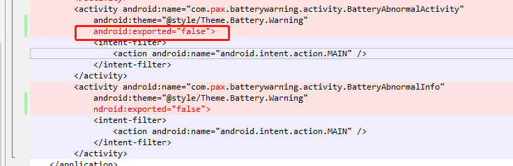

# Mark

记录一些零碎的知识

# Android.bp, Android.mk同时存在，编译调用哪个

有Android.bp, Android.mk同时存在，只调用Android.bp

# android 12报错合集

# 开机报错安装

安装应用报错如下：
```log
01-02 11:25:31.850  1181  1181 W PackageManager: Failed to parse /system/app/BatteryWarning: /system/app/BatteryWarning/BatteryWarning.apk (at Binary XML file line #55): com.pax.batterywarning.act
ivity.BatteryAbnormalActivity: Targeting S+ (version 31 and above) requires that an explicit value for android:exported be defined when intent filters are present
```

* 参考：
* [Targeting S+ (version 31 and above) requires that an explicit value for android:exported be defin...](https://www.jianshu.com/p/26ac58c8fdf3)

* 原因：
因为在 Android 12 中包含 <intent-filter> 的 activity 、 service 或 receiver 必须为这些应用组件显示声明 android:exported 属性.

* 解决方案：
```
在AndroidManifest.xml中找到对应的Activity，加上android:exported属性：
```



# 无法通过计算器暗码启动app

参考：
* [Android开发-Activity中“android:exported“属性的作用，以及“Permission Denial: starting Intent“错误解决](https://blog.csdn.net/liranke/article/details/123437721)

* 报错如下：
```log
04-08 16:01:45.944  1129  4395 I ActivityTaskManager: START u0 {flg=0x10000000 cmp=com.pax.batterywarning/.activity.BatteryAbnormalActivity} from uid 10049
04-08 16:01:45.945  1129  4395 W ActivityTaskManager: Permission Denial: starting Intent { flg=0x10000000 cmp=com.pax.batterywarning/.activity.BatteryAbnormalActivity } from ProcessRecord{92eaa95
5026:com.android.calculator2/u0a49} (pid=5026, uid=10049) not exported from uid 10053
04-08 16:01:45.947  5026  5026 D AndroidRuntime: Shutting down VM
--------- beginning of crash
04-08 16:01:45.949  5026  5026 E AndroidRuntime: FATAL EXCEPTION: main
04-08 16:01:45.949  5026  5026 E AndroidRuntime: Process: com.android.calculator2, PID: 5026
04-08 16:01:45.949  5026  5026 E AndroidRuntime: java.lang.IllegalStateException: Could not execute method for android:onClick
04-08 16:01:45.949  5026  5026 E AndroidRuntime:        at android.view.View$DeclaredOnClickListener.onClick(View.java:6260)
04-08 16:01:45.949  5026  5026 E AndroidRuntime:        at android.view.View.performClick(View.java:7441)
04-08 16:01:45.949  5026  5026 E AndroidRuntime:        at android.view.View.performClickInternal(View.java:7418)
04-08 16:01:45.949  5026  5026 E AndroidRuntime:        at android.view.View.access$3700(View.java:835)
04-08 16:01:45.949  5026  5026 E AndroidRuntime:        at android.view.View$PerformClick.run(View.java:28681)
04-08 16:01:45.949  5026  5026 E AndroidRuntime:        at android.os.Handler.handleCallback(Handler.java:938)
04-08 16:01:45.949  5026  5026 E AndroidRuntime:        at android.os.Handler.dispatchMessage(Handler.java:99)
04-08 16:01:45.949  5026  5026 E AndroidRuntime:        at android.os.Looper.loopOnce(Looper.java:201)
04-08 16:01:45.949  5026  5026 E AndroidRuntime:        at android.os.Looper.loop(Looper.java:288)
04-08 16:01:45.949  5026  5026 E AndroidRuntime:        at android.app.ActivityThread.main(ActivityThread.java:7880)
04-08 16:01:45.949  5026  5026 E AndroidRuntime:        at java.lang.reflect.Method.invoke(Native Method)
04-08 16:01:45.949  5026  5026 E AndroidRuntime:        at com.android.internal.os.RuntimeInit$MethodAndArgsCaller.run(RuntimeInit.java:548)
04-08 16:01:45.949  5026  5026 E AndroidRuntime:        at com.android.internal.os.ZygoteInit.main(ZygoteInit.java:1009)
04-08 16:01:45.949  5026  5026 E AndroidRuntime: Caused by: java.lang.reflect.InvocationTargetException
04-08 16:01:45.949  5026  5026 E AndroidRuntime:        at java.lang.reflect.Method.invoke(Native Method)
04-08 16:01:45.949  5026  5026 E AndroidRuntime:        at android.view.View$DeclaredOnClickListener.onClick(View.java:6255)
04-08 16:01:45.949  5026  5026 E AndroidRuntime:        ... 12 more
04-08 16:01:45.949  5026  5026 E AndroidRuntime: Caused by: java.lang.SecurityException: Permission Denial: starting Intent { flg=0x10000000 cmp=com.pax.batterywarning/.activity.BatteryAbnormalAct
ivity } from ProcessRecord{92eaa95 5026:com.android.calculator2/u0a49} (pid=5026, uid=10049) not exported from uid 10053
04-08 16:01:45.949  5026  5026 E AndroidRuntime:        at android.os.Parcel.createExceptionOrNull(Parcel.java:2426)
04-08 16:01:45.949  5026  5026 E AndroidRuntime:        at android.os.Parcel.createException(Parcel.java:2410)
04-08 16:01:45.949  5026  5026 E AndroidRuntime:        at android.os.Parcel.readException(Parcel.java:2393)
04-08 16:01:45.949  5026  5026 E AndroidRuntime:        at android.os.Parcel.readException(Parcel.java:2335)
04-08 16:01:45.949  5026  5026 E AndroidRuntime:        at android.app.IActivityTaskManager$Stub$Proxy.startActivity(IActivityTaskManager.java:2284)
04-08 16:01:45.949  5026  5026 E AndroidRuntime:        at android.app.Instrumentation.execStartActivity(Instrumentation.java:1745)
04-08 16:01:45.949  5026  5026 E AndroidRuntime:        at android.app.Activity.startActivityForResult(Activity.java:5403)
04-08 16:01:45.949  5026  5026 E AndroidRuntime:        at android.app.Activity.startActivityForResult(Activity.java:5361)
04-08 16:01:45.949  5026  5026 E AndroidRuntime:        at android.app.Activity.startActivity(Activity.java:5747)
04-08 16:01:45.949  5026  5026 E AndroidRuntime:        at android.app.Activity.startActivity(Activity.java:5700)
04-08 16:01:45.949  5026  5026 E AndroidRuntime:        at com.android.calculator2.Calculator.startHideApp(Calculator.java:1184)
04-08 16:01:45.949  5026  5026 E AndroidRuntime:        at com.android.calculator2.Calculator.onEquals(Calculator.java:1053)
04-08 16:01:45.949  5026  5026 E AndroidRuntime:        at com.android.calculator2.Calculator.onButtonClick(Calculator.java:882)
04-08 16:01:45.949  5026  5026 E AndroidRuntime:        ... 14 more
04-08 16:01:45.949  5026  5026 E AndroidRuntime: Caused by: android.os.RemoteException: Remote stack trace:
04-08 16:01:45.949  5026  5026 E AndroidRuntime:        at com.android.server.wm.ActivityTaskSupervisor.checkStartAnyActivityPermission(ActivityTaskSupervisor.java:1098)
04-08 16:01:45.949  5026  5026 E AndroidRuntime:        at com.android.server.wm.ActivityStarter.executeRequest(ActivityStarter.java:979)
04-08 16:01:45.949  5026  5026 E AndroidRuntime:        at com.android.server.wm.ActivityStarter.execute(ActivityStarter.java:669)
04-08 16:01:45.949  5026  5026 E AndroidRuntime:        at com.android.server.wm.ActivityTaskManagerService.startActivityAsUser(ActivityTaskManagerService.java:1201)
04-08 16:01:45.949  5026  5026 E AndroidRuntime:        at com.android.server.wm.ActivityTaskManagerService.startActivityAsUser(ActivityTaskManagerService.java:1173)
04-08 16:01:45.949  5026  5026 E AndroidRuntime:
04-08 16:01:45.952  2292  4070 D audio_hw_primary: start_output_stream: enter: stream(0xae1bd000)usecase(1: low-latency-playback) devices(0x2) is_haptic_usecase(0)
04-08 16:01:45.953   649   649 E ANDR-PERF-TARGET: Error: Invalid logical cluster id 0
04-08 16:01:45.953   649   649 E ANDR-PERF-REQUEST: invalid request
```

* 原因：

Activity中"android:exported"属性说明：
在程序清单AndroidMenifest.xml文件中，可以设置这个属性。

Android中的Activity中"android:exported"属性设置为true，意味着允许让外部组件启动这个Activity；反之，则不允许让外部组件启动这个Activity；

如果设置了false，又在外部试图启动这个Activity，则会发生程序崩溃，报异常，例如：
```
java.lang.SecurityException: Permission Denial: starting Intent
```