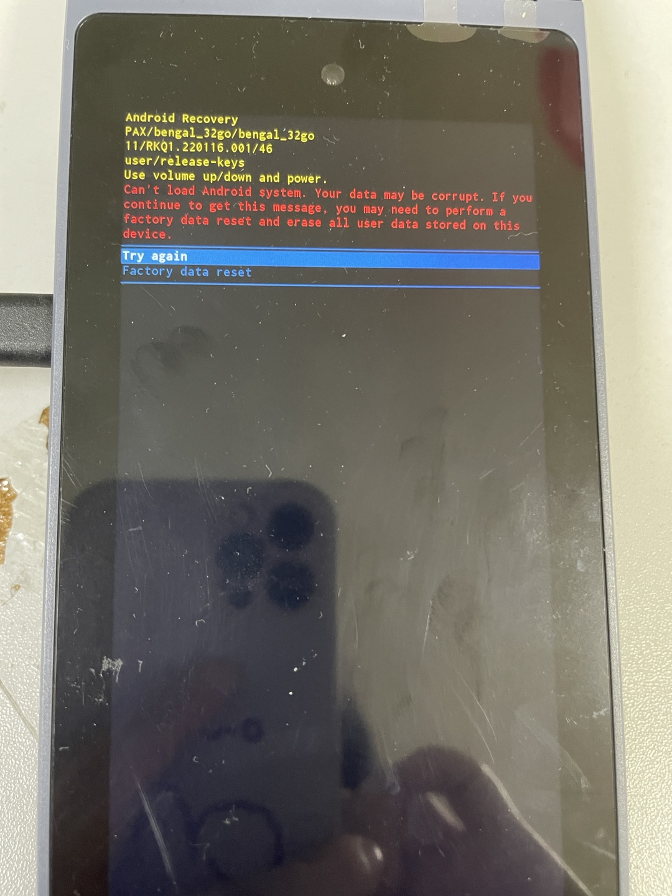
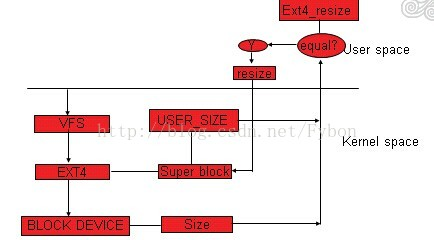
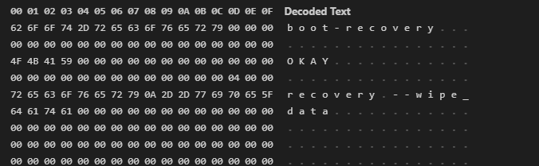

# qcm2290 android系统运行中拔电池进入recovery界面提示文件系统损坏

开机使用过程中拔电池，机器概率性进入recovery界面

# 参考

* [碎碎念android eMMC](https://blog.csdn.net/Fybon/article/details/44242549)
* [一种基于高通平台通过新增分区兼容不同大小EMMC的方法与流程](https://www.xjishu.com/zhuanli/55/202011407849.html)
* [Userdata 分区 resize 功能](https://blog.csdn.net/u011006622/article/details/118999260)

# 现象

在一个高负荷读写的f2fs文件系统下，如果突然发生掉电，就很有可能发生文件系统内部结构不一致，导致文件系统破坏。



log提示如下：
```log
[   13.708743] init: processing action (ro.kernel.version=4.19 && late-fs) from (/system/etc/init/hw/init.rc:622)
[   13.719740] init: processing action (late-fs) from (/system/etc/init/hw/init.rc:626)
[   13.728208] init: processing action (late-fs) from (/vendor/etc/init/hw/init.target.rc:66)
[   13.736837] init: start_waiting_for_property("hwservicemanager.ready", "true"): already set
[   13.791673] wait_for_keymaster: Waiting for Keymaster device
[   13.797784] binder: 483:483 ioctl 40046210 be912af8 returned -22
[   13.803944] binder: 476:476 ioctl 40046210 beb59a70 returned -22
[   13.831088] binder: 476:476 ioctl 40046210 beb59360 returned -22
[   14.811071] ServiceManager: Waited one second for android.system.keystore2.IKeystoreService/default (is service started? are binder threads started and available?)
[   14.827243] wait_for_keymaster: Keymaster device ready
[   14.844269] binder: undelivered transaction 213, process died.
[   14.869262] binder: 491:491 ioctl 40046210 bed6da28 returned -22
[   14.920571] binder: 492:492 ioctl 40046210 be8dba08 returned -22
[   14.947435] vdc: Command: cryptfs mountFstab /dev/block/bootdevice/by-name/userdata /data Failed: Status(-8, EX_SERVICE_SPECIFIC): '0: '
[   15.018090] PAX_CHG: sgm41528_charger_reboot_callback:enter
[   15.028888] ==sp_pm_shutdown
[   15.032362] reboot: Restarting system with command 'recovery'
[   15.038167] Going down for restart now
```

# 解决方案

* 由于修改为ext4格式后，在挂载userdata分区时出现如下的错误，导致userdata无法挂载，系统不能正常开机。
```
[   18.090538] EXT4-fs (sda11): bad geometry: block count 10664230 exceeds size of device (10662182 blocks)
```
 因此需要修改userdata分区的大小。

* 关于BOARD_USERDATAIMAGE_PARTITION_SIZE的取值建议：
* BOARD_USERDATAIMAGE_PARTITION_SIZE表示文件系统中的容量，这个值一定不能大于分给userdata分区的物理空间大小。
  * 步骤一：确定userdata分区的device名称，使用ls -l /dev/block/by-name | grep userdata 命令查看，userdata分区对应的设备是：/dev/block/mmcblk0p57
```shell
M9200:/ # ls -l /dev/block/by-name | grep userdata
lrwxrwxrwx 1 root root 21 1970-01-01 08:00 userdata -> /dev/block/mmcblk0p57
```
  * 步骤二：查看userdata分区的物理空间大小，使用cat /proc/partitions | grep mmcblk0p57 命令，这里过滤的mmcblk0p57就是上一步查询到的，
```log
M9200:/ # cat /proc/partitions | grep mmcblk0p57
 259       25   25928687 mmcblk0p57
```
我们看到留给userdata分区的物理空间大小是25928687KB = 26550975488 Bytes
  * 步骤三：确定BOARD_USERDATAIMAGE_PARTITION_SIZE的大小：
  * BOARD_USERDATAIMAGE_PARTITION_SIZE的大小一定不能大于26550975488，由于不同厂家不同批次的ufs存储器实际空间可能存在差异，所以建议客户一般预留100M左右的空间，计算如下：
```
26550975488 – 100 * 1024 * 1024 = 26446117888
```

* 又因为ufs要做到4K对齐，所以要检查26446117888是否能被4096整除，这里26446114816是可以整除4096的，就不用再修改了，如果不能请客户自行调整，调整方法：不能整除4096时，就除以4096取整，再乘以4096即可。

但是我们有多种size规格eMMC，如果设置成26G，1+8G的型号就不兼容，那如何兼容呢，网上搜了一下答案。

* [碎碎念android eMMC](https://blog.csdn.net/Fybon/article/details/44242549)

# 方案一 利用文件系统自身resize功能

mountdata之前，比较super block的size与block deviceszie，不一样就去resize



高通平台f2fs有这个功能，`/system/bin/resize2fs`工具去实现的，ext4反而去掉了，不知道什么原因。

# 方案二 第一次开机format data分区

如果使用的filesystem没有resize功能，比如f2fs, fat32等。

那只能采用此种办法啦：

不下载userdata.img

mountdata之前，fs_mgrservice判断是否会第一次开机，如果是，则启动format

system/core/fs_mgr

新增一个分区如 formatemmc.img（这个分区需要比userdata先mount），然后根据刷机后，根据这个分区标志位去格式化 userdata分区，之后进行mount操作，然后清空标志位，以后不需要再格式化

# 方案三 烧录特定misc分区



misc分区结构如下：
```
boot-recovery
OKAY
recovery --wipe_data
```

以上会让机器第一次开机进入recovery并格式化userdata分区，最后采用的是该方案。

# f2fs

F2FS 全称为 Flash Friendly File System，是一种较为新型的支持 Linux 内核使用的文件系统。最早是由三星在2012年研发设计的，其目的就是为了更好的适应 NAND 一类的闪存设备（例如固态硬盘、eMMC和SD卡等），在F2FS中三星应用了日志结构档案系统的概念，使它更适合用于储存设备。
简而言之，一个新的文件系统。

## F2FS的提升在哪里？
主要在随机读写性能中，随机写入性能性能较为明显。反映到现实使用中就是相同的存储介质和标准下，应用打开快一点缓存的图片打开快一点。
 
## F2FS的提升不在哪里？

持续读写性能还是要靠硬件能力的进步，而不是一个文件系统就能解决的。反映到现实使用中就是EXT4的UFS3.0读写大文件（如安装应用，拷贝大型文件等）吊打F2FS的UFS2.1。
参考1+7 Pro对比测评，尤其是软件安装速度测试部分。
文件系统可以优化一些东西，但终究还是软件层面，无法替代硬件升级。
就像emmc优化成ufs一样，笑笑就好别信，能用软件更新的还要提升硬件干嘛。
 
## F2FS影响寿命？

因为文件系统格式的区别相同的文件会比在EXT4下大一些，这一定程度上会增加读写量。但可以忽略不计，基本不存在，不需要操无意义之心。

## F2FS不稳定？

是也不是。F2FS面世初期确实有比较大的稳定性问题，但随着迭代已经基本不存在。

但值得一提的是F2FS在高存储占用的情况下（75%-80%左右）会出现严重的随机读写性能下降的问题。

这时随机读写性能可能会低于EXT4，但也仅在高存储占用的情况下。
 
## F2FS里存文件比EXT4大？

是的，将相同文件存储到F2FS文件格式下相较于EXT4会占用1.1倍到1.5倍的空间。

## F2FS为跑分而生？
跑分只是反映客观情况的一种手段，一切以实际体验为准。

F2FS的跑分尤其是随机读写部分的成绩真的非常好，反映到实际使用中是有提升，但远没有达到跑分显示的几倍的差距。

F2FS跑分高吗？高。

实际体验有提升吗？有。

真的有跑分差距的那么大吗？显然没有。

## 总结

F2FS是一个综合来看利大于弊的技术。利在实实在在的随机读写性能提升，弊在高存储占用情况下的性能损失和多占用存储空间。

需要理性看待，这是一个软件技术，也不能苛求它带来太多的提升。

但它确实带来了不错的提升。至于如何定义有多不错，让平常心人满足，又让苛求者看不上。

点到为止。