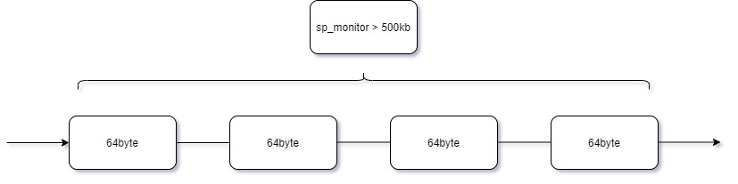
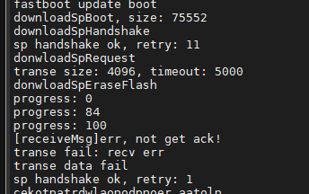
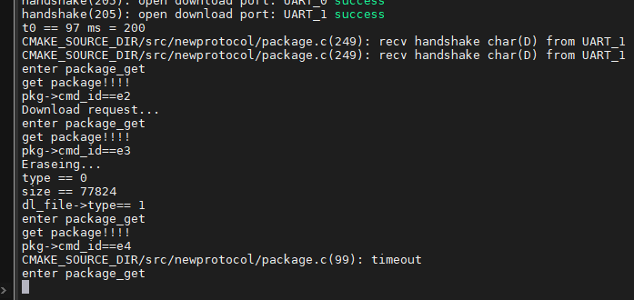

# qcom qcm2290 apsp串口功能调试

记录一下

# APSP串口不通

目前AP端的串口程序都是A665x项目可用的，但是在ABL阶段使用流控功能出现握手失败。

原因是SP端RTS功能未打开，当AP发送时RTS未拉低，SP端发送，AP不接收。

# 串口配置750k波特率并增加宏控

```diff
--- a/UM.9.15/bootable/bootloader/edk2/AndroidBoot.mk
+++ b/UM.9.15/bootable/bootloader/edk2/AndroidBoot.mk
@@ -129,6 +129,12 @@ else
        CLANG35_GCC_TOOLCHAIN := $(ANDROID_TOP)/prebuilts/gcc/linux-x86/aarch64/aarch64-linux-android-$(TARGET_GCC_VERSION)
 endif

+#[feature]-add-begin xielianxiong@xxxxx.com,for M92xx abl
+ifeq ($(M92xx),true)
+       M92xx := M92xx=1
+endif
+#[feature]-add-end xielianxiong@xxxxx.com,for M92xx abl
+

 # ABL ELF output
 TARGET_ABL := $(PRODUCT_OUT)/abl.elf
@@ -167,4 +173,5 @@ $(TARGET_ABL): $(LOCAL_ABL_SRC_FILE) | $(ABL_OUT) $(INSTALLED_KEYSTOREIMAGE_TARG
                CLANG_GCC_TOOLCHAIN=$(CLANG35_GCC_TOOLCHAIN)\
                TARGET_ARCHITECTURE=$(TARGET_ARCHITECTURE) \
                BOARD_BOOTLOADER_PRODUCT_NAME=$(BOARD_BOOTLOADER_PRODUCT_NAME) \
-               USERDATAIMAGE_FILE_SYSTEM_TYPE=$(USERDATAIMAGE_FILE_SYSTEM_TYPE)
+               USERDATAIMAGE_FILE_SYSTEM_TYPE=$(USERDATAIMAGE_FILE_SYSTEM_TYPE) \
+               $(M92xx)
diff --git a/UM.9.15/bootable/bootloader/edk2/MdePkg/Library/UartQupv3Lib/UartXBL.c b/UM.9.15/bootable/bootloader/edk2/MdePkg/Library/UartQupv3Lib/UartXBL.c
index bea319ce553..9cf597fcd2c 100755
--- a/UM.9.15/bootable/bootloader/edk2/MdePkg/Library/UartQupv3Lib/UartXBL.c
+++ b/UM.9.15/bootable/bootloader/edk2/MdePkg/Library/UartQupv3Lib/UartXBL.c
@@ -87,6 +87,7 @@ static const CLOCK_SETTINGS baud_table[] =
 {
    // bit_rate, input_freq, divider
    {     115200,     7372800,      64 },
+   {     750000,     96000000,     128 },
    {     1500000,    96000000,     64 },
    {     3000000,    96000000,     32 },
    {0}
@@ -1010,7 +1011,11 @@ uart5_initialize(void)
 {
    uart_open_config uart5_c;

+#ifdef M92xx
+   uart5_c.baud_rate = 750000;//3000000;
+#else
    uart5_c.baud_rate = 3000000;
+#endif
    uart5_c.parity_mode = UART_NO_PARITY;
    uart5_c.num_stop_bits = UART_1_0_STOP_BITS;
    uart5_c.bits_per_char = UART_8_BITS_PER_CHAR;
--- a/UM.9.15/bootable/bootloader/edk2/QcomModulePkg/QcomModulePkg.dsc
+++ b/UM.9.15/bootable/bootloader/edk2/QcomModulePkg/QcomModulePkg.dsc
@@ -154,6 +154,11 @@
   !if $(USERDATAIMAGE_FILE_SYSTEM_TYPE)
       GCC:*_*_*_CC_FLAGS = -DUSERDATA_FS_TYPE=\"$(USERDATAIMAGE_FILE_SYSTEM_TYPE)\"
   !endif
+#[feature]-add-begin xielianxiong@xxxxx.com,20221202,abl define M92xx
+  !if $(M92xx) == 1
+      GCC:*_*_*_CC_FLAGS = -DM92xx
+  !endif
+#[feature]-add-end xielianxiong@xxxxx.com,20221202,abl define M92xx

 [PcdsFixedAtBuild.common]

diff --git a/UM.9.15/bootable/bootloader/edk2/makefile b/UM.9.15/bootable/bootloader/edk2/makefile
index 580b3cc7b29..fbafb095449 100644
--- a/UM.9.15/bootable/bootloader/edk2/makefile
+++ b/UM.9.15/bootable/bootloader/edk2/makefile
@@ -117,6 +117,12 @@ export LLVM_ENABLE_SAFESTACK := $(LLVM_ENABLE_SAFESTACK)
 export LLVM_SAFESTACK_USE_PTR := $(LLVM_SAFESTACK_USE_PTR)
 export LLVM_SAFESTACK_COLORING := $(LLVM_SAFESTACK_COLORING)

+#[feature]-add-begin xielianxiong@xxxxx.com,20221202,abl define M92xx
+ifeq "$(TARGET_PRODUCT)" "bengal_32go"
+export M92xx := true
+endif
+#[feature]-add-end xielianxiong@xxxxx.com,20221202,abl define M92xx
+
 .PHONY: all cleanall

 all: ABL_FV_ELF
@@ -157,6 +163,7 @@ ABL_FV_IMG: EDK_TOOLS_BIN
        -D ENABLE_SYSTEMD_BOOTSLOT=$(ENABLE_SYSTEMD_BOOTSLOT) \
        -D RW_ROOTFS=$(RW_ROOTFS) \
        -D USERDATAIMAGE_FILE_SYSTEM_TYPE=$(USERDATAIMAGE_FILE_SYSTEM_TYPE) \
+       -D M92xx=$(M92xx) \
        -j build_modulepkg.log $*

        cp $(BUILD_ROOT)/FV/FVMAIN_COMPACT.Fv $(ABL_FV_IMG)
```

# sp下载软件失败(发送失败)

看看sp下载软件逻辑：
* `fastbootcmds.c`:
```c
* CmdFlash
  └── if(is_sp_partition(PartitionName)) //判断下载名称是否为cfg、sp_boot、sp_reboot、sp_monitor、exsn、sp_mac、sp_time、sp_test
      ├── if(StrnCmp(PartitionName, L"exsn", StrLen(L"exsn")) == 0)
      │   └── verify_xxxxx_image(mFlashDataBuffer,mFlashNumDataBytes,0) //校验
      │       ├── memcpy(ucInfo, addr+len-16, 16); if (memcmp(ucInfo, "SIGNED_VER:00001", 16)) //校验最后16字节是不是SIGNED_VER:00001字符
      │       ├── compute_sha(addr,len-284,hash); //计算exsn hash
      │       └── RSARecover(&mf_puk[4], 256, &mf_puk[260], 4, (uchar *)pTEncry_Digest, (uchar *)pTDigset); //RSA加解密运算函数
      ├── if ( (StrnCmp(PartitionName, Lxxx_CFG_PARTITION_NAME, StrLen(Lxxx_CFG_PARTITION_NAME)) == 0) //#define Lxxx_CFG_PARTITION_NAME     L"xxxxx_cfg" #define LCFG_PARTITION_NAME         L"cfg"
      │   ├── verify_xxxxx_image(mFlashDataBuffer,mFlashNumDataBytes,0) 
      │   └── Status = HandleRawImgFlash (Lxxx_CFG_PARTITION_NAME,ARRAY_SIZE (Lxxx_CFG_PARTITION_NAME),mFlashDataBuffer, mFlashNumDataBytes);
      └── if (sp_download_all(PartitionName, mFlashDataBuffer, mFlashNumDataBytes) < 0)
          ├── if(409600 > sz)return -1;//sp monitor almost 500KB
          ├── if(StrnCmp(DownloadName, L"sp_monitor", StrLen(L"sp_monitor")) ==0 )
          │   └── downloadSpMonitor(data, sz);
          │       └── downloadSpFile(download_file, data, sz);
          │           ├── ret = checkSprebootAndHandshake(); //1. shakehand sp 发送X字符
          │           ├── ret = donwloadSpRequest(download_file, sz); // 2. download request
          │           │   ├── uchar cmd = CMD_DOWNLOAD_REQUEST; //E2下载请求指令
          │           │   ├── makePackage(g_tx_buf, cmd, data, sizeof(data)); //发送
          │           │   ├── puts_sp(g_tx_buf, len);
          │           │   └── receivePackage(cmd, g_rx_buf, &g_rx_index, &g_rx_size); //接收
          │           ├── donwloadSpEraseFlash(SP_PARTITION_BACK); // 3. erase back partition  E3擦除指令
          │           ├── for (i = 0; i < cnt; i++) ret = donwloadSpTranseData(pack_index, data+i*block_size, block_size) //4. download transefile
          │           │   ├── uchar cmd = CMD_TRANSE_FILE;
          │           │   ├── makePackage(g_tx_buf, cmd, tmp_buf, size);
          │           │   └── puts_sp(g_tx_buf, len);
          │           │       └── xxxxx_serial_putc(tx_buff, len);
          │           │           ├── for (i = 0; i < count; i++) len = uart5_write((UINT8*)buf+i*TXFIFO_SIZE,TXFIFO_SIZE);  MicroSecondDelay(250);//3M,3000000// #define TXFIFO_SIZE 64  所有数据64个byte为一个包 ，for循环发送
          │           │           ├── len = uart5_write((UINT8*)buf+count*TXFIFO_SIZE,bytes_to_tx % TXFIFO_SIZE); //最后一个64byte包
          │           │           └── MicroSecondDelay(250);//3M,3000000 延迟0.25ms
          │           ├── ret = donwloadSpCheckTranseFinish(); //5. check transe finish  检查是否传输完成
          │           ├── ret = donwloadSpEraseFlash(SP_PARTITION_TARGET);//6. erase target partition 
          │           └── ret = donwloadSpWrite2Flash(); // 7. write to flash(target)
          │               └── uchar cmd = CMD_WRITE_FILE_TO_FLASH; // E4指令， sp将串口接收数据下载到flash
          ├── else if(StrnCmp(DownloadName, L"sp_boot", StrLen(L"sp_boot")) ==0 )
          │   └── downloadSpBoot(data, sz);
          ├── xxxxx_serial_flush(); //缓冲区清空
          │   └── xxxxx_serial_getc(buf, 512);
          │       └── uart5_read((UINT8 *)buf, bytes_to_rx);
          └── xxxxx_sp_reset(); //sp复位
              ├── TLMMProtocol->GpioOut((UINT32)EFI_GPIO_CFG(32, 0, GPIO_OUTPUT, GPIO_NO_PULL, GPIO_8MA), GPIO_HIGH_VALUE);
              └── TLMMProtocol->GpioOut((UINT32)EFI_GPIO_CFG(32, 0, GPIO_OUTPUT, GPIO_NO_PULL, GPIO_8MA), GPIO_LOW_VALUE);
```

* downloadSpMonitor步骤如下：
  * 1. shakehand sp 发送握手X字符
  * 2. download request 发送下载请求包 E2指令
  * 3. erase back partition E3擦除指令
  * 4. download transefile 串口传输到sp
  * 5. check transe finish  检查是否传输完成
  * 6. erase target partition 
  * 7. write to flash(target) E4指令，sp将串口接收数据下载到flash

  我们sp_monitor大小必须大于500kb，将分成数个64byte的数据包依次发送，如下结构：

  

按照之前调试下载功能，发现下载过程会失败，打印如下：

* AP：



* SP：



我们从log上看：
* AP/SP握手成功，且数据都已经发出去，AP发完没有收到SP ACK。
* SP端收到E2/E3/E4命令，接收到传输文件，提示timeout了。
```
CMD_DOWNLOAD_REQUEST = 0xE2,
CMD_ERASE_FLASH = 0xE3,
CMD_TRANSE_FILE = 0xE4,
```

逻辑分析中得知软件发送500字节数据，实际上只发送了200多个字节，也就是说还有200多没法出去，我们猜测串口发送就像装子弹一样，当一发子弹装上，打完了才能装第二发子弹，如果一发装完还没打完就装下一发，这样就造成第一发子弹没打出去，装子弹的过程就像串口FIFO方式发送数据时填充fifo过程，正确做法是等待fifo中数据都传输完成，再进行下一次填充fifo，参考下面文章，一般串口都有判断fifo是否为空和是否传输完成标志：

* [串口丢数据常见的原因](https://blog.csdn.net/weiqifa0/article/details/123606116)
* [STM32串口发送数据和接收数据方式总结](https://blog.csdn.net/best_xiaolong/article/details/111658992)

* TXE：发送数据寄存器为空 (Transmit data register empty)
  * 0：数据未传输到移位寄存器
  * 1：数据传输到移位寄存器

* TC：发送完成 (Transmission complete)
  * 0：传送未完成
  * 1：传送已完成

## UART发送丢失数据(参考)

UART发送丢失数据很多工程师都遇到过，通常情况下是传输未完成的原因。
HAL库已经有几年了，但还是有很多工程师都使用标准外设库，这时如果自己封装接口不当，就会存在发送最后一字节数据丢失的问题。
1.UART传输未完成导致数据丢失

如下代码，只考虑非空，但实际传输并未完成。
```c
void UART_SendByte(uint8_t Data)
{
  while(RESET == USART_GetFlagStatus(USART1, USART_FLAG_TXE));
  USART_SendData(USART1, Data);
}
```

但发送非空不代表发送完成，虽然在某些场合更高效，但某些场合就会导致数据丢失。

比如：使用此函数发送之后进入休眠、关闭接收端设备电源等情况下。

解决办法：
等待发送完成：
```c
void UART_SendByte(uint8_t Data)
{
  while(RESET == USART_GetFlagStatus(USART1, USART_FLAG_TXE));
  USART_SendData(USART1, Data);
  while(RESET == USART_GetFlagStatus(USART1, USART_FLAG_TC));
}
```
如果使用标准外设库，要根据实际情况封装函数，比如发送超时。

或者使用HAL封装的接口，代码包含判断传输完成：
```c
HAL_StatusTypeDef HAL_UART_Transmit(UART_HandleTypeDef *huart, uint8_t *pData, uint16_t Size, uint32_t Timeout)
```

## 解决方案

暂时没有找到qcm2290平台fifo是否为空和是否传输完成标志，只能通过延时的方式。
```c
uint32 xxxxx_serial_putc(void* buf, uint32 bytes_to_tx)
{
//[feature]-add-begin xielianxiong@xxxxx.com,20220910,for txfifo only 64byte
    #define TXFIFO_SIZE 64
    uint32 i;
    uint32 len = 0;
    uint32 totalcount = 0;
    uint32 count = bytes_to_tx / TXFIFO_SIZE;
    //DEBUG((EFI_D_ERROR, "victor, bytes_to_tx = %d,count = %d,\n", bytes_to_tx,count));

    for (i = 0; i < count; i++) {
         len = uart5_write((UINT8*)buf+i*TXFIFO_SIZE,TXFIFO_SIZE);
         totalcount = totalcount + len;
#ifdef M92xx
         MicroSecondDelay(1300);//750000
#else
         MicroSecondDelay(250);//3M,3000000
#endif
    }
    len = uart5_write((UINT8*)buf+count*TXFIFO_SIZE,bytes_to_tx % TXFIFO_SIZE);//size;
    totalcount = totalcount + len;
    //DEBUG((EFI_D_ERROR, "victor, totalcount = %d,len = %d,\n", totalcount,len));
#ifdef M92xx
    MicroSecondDelay(2300);//750000
#else
    MicroSecondDelay(250);//3M,3000000
#endif
    return totalcount;
//[feature]-add-begin xielianxiong@xxxxx.com,20220910,for txfifo only 64byte
}
```
  