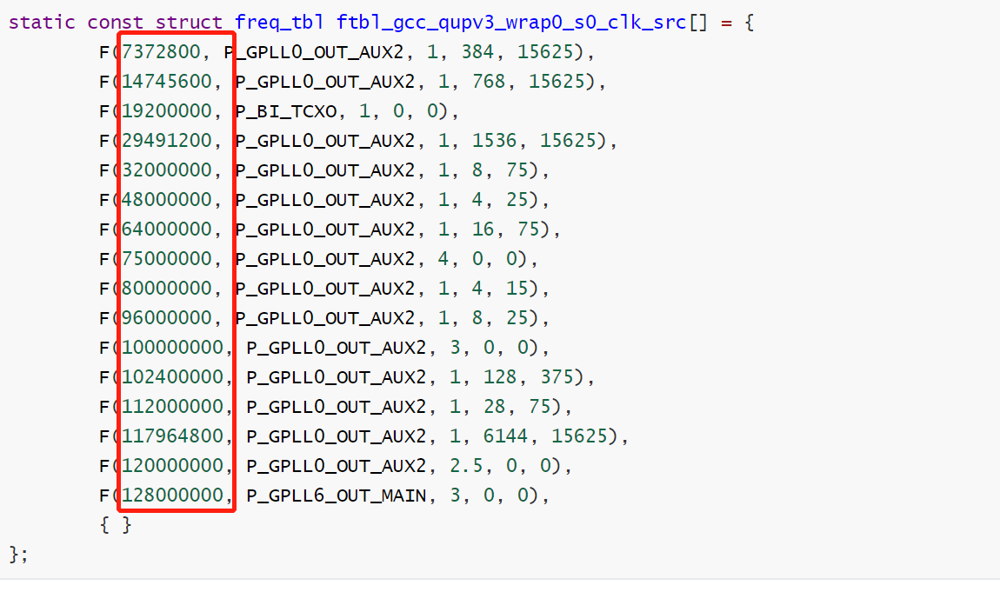

# xbl abl串口初始化流程

分析一下xbl abl阶段串口流程

# 特别说明

UART可用于2线模式（UART）或4线模式（HSUART）：2线UART（低波特率）64B FIFO模式，4线HS UART（高波特率）128B DMA模式，如需支持高波特率一般都是HS_PORT。

# SBL1阶段初始化

SBL1阶段就降串口进行了初始化和寄存器配置，流程可以参考[0010_qcom_qcm2290_SBL1运行流程.md](/0016_qcom_bootloader/docs/0010_qcom_qcm2290_SBL1运行流程.md)，以下是串口初始化流程：

* `QcomPkg/SocPkg/Library/XBLLoaderLib/sbl1_mc.c`:
```C++
* boot_log_init(boot_log_data);
  └── boot_log_init_uart(); //QcomPkg/XBLLoader/boot_logger.c
      └── boot_uart_init(); //QcomPkg/XBLLoader/boot_logger_uart.c
          └── uart_initialize(); //QcomPkg/XBLLoader/boot_uart.c
              ├── uart5_c.enable_flow_ctrl = TRUE; //流控打开
              └── uart_open(&uart5_debug_handle, UART_HS_PORT, &uart5_c);
                  ├── if(UART_SUCCESS != clock_enable(uart_ctxt)) //时钟使能
                  ├── if(UART_SUCCESS != uart_tlmm_open(uart_ctxt)) //gpio 复用配置
                  └── register_init(uart_ctxt); //uart寄存器配置
```

* `QcomPkg/Library/UartQupv3Lib/UartXBL.c`:
```C++
static const CLOCK_SETTINGS baud_table[] =
{
   // bit_rate, input_freq, divider
   {     115200,     7372800,      64 },
   {     1500000,    96000000,     64 },
   {     3000000,    96000000,     32 },
   {0}
};

RETURN_STATUS EFIAPI
uart_initialize(void)
{
   uart_open_config c;

   c.baud_rate = 115200;
   c.parity_mode = UART_NO_PARITY;
   c.num_stop_bits = UART_1_0_STOP_BITS;
   c.bits_per_char = UART_8_BITS_PER_CHAR;
   c.enable_loopback = FALSE;
   c.enable_flow_ctrl = FALSE;
   c.tx_cb_isr = NULL;
   c.rx_cb_isr = NULL;

   uart_open_config uart5_c;

    //配置uart5 波特率，uart5对应SE1
   uart5_c.baud_rate = 1500000/*115200*/;
   uart5_c.parity_mode = UART_NO_PARITY;// 无奇偶校验位
   uart5_c.num_stop_bits = UART_1_0_STOP_BITS;  //1 bit停止位
   uart5_c.bits_per_char = UART_8_BITS_PER_CHAR;// 8 bit数据
   uart5_c.enable_loopback = FALSE;
   uart5_c.enable_flow_ctrl = TRUE; //流控打开
   uart5_c.tx_cb_isr = NULL;
   uart5_c.rx_cb_isr = NULL;

   uart_open(&uart_debug_handle, UART_DEBUG_PORT, &c);
#ifdef HS_PORT_OPEN //高速串口
   uart_open(&uart5_debug_handle, UART_HS_PORT, &uart5_c);
#endif
   return RETURN_SUCCESS;
}

uart_result uart_open(uart_handle* h, uart_port_id id, uart_open_config* config)
{
   if(UART_SUCCESS != uart_get_properties(uart_ctxt))
   {
      UART_LOG_0(ERROR, "uart_get_properties failed.");
      return UART_ERROR;
   }

   if(UART_SUCCESS != clock_enable(uart_ctxt)) //时钟使能
   {
      UART_LOG_0(ERROR, "clock_enable failed.");
      return UART_ERROR;
   }

   // If the secondary engine is active, we are in core and loader has already initialized the core.
   // So we can skip it.
   if(!(REG_IN(uart_ctxt->properties->uart_base + GENI4_CFG, GENI_STATUS) & S_GENI_CMD_ACTIVE))
   {
      if(UART_SUCCESS != uart_fw_load(uart_ctxt))
      {
         UART_LOG_0(ERROR, "clock_enable failed.");
         return UART_ERROR;
      }

      if(UART_SUCCESS != uart_tlmm_open(uart_ctxt)) //gpio 复用配置
      {
         UART_LOG_0(ERROR, "uart_tlmm_open failed.");
         uart_close((uart_handle)uart_ctxt);
         return UART_ERROR;
      }

      if(UART_SUCCESS != uart_interrupt_open(uart_ctxt,(void*)uart_isr)) //没干啥
      {
         UART_LOG_0(ERROR, "uart_interrupt_open failed.");
         uart_close((uart_handle)uart_ctxt);
         return UART_ERROR;
      }

      register_init(uart_ctxt);
   }

}

uart_result uart_tlmm_open(uart_context* h)
{

   Tlmm_ConfigGpioGroup(DAL_TLMM_GPIO_ENABLE,(DALGpioSignalType*)&h->properties->gpio_tx_config, 1);
   Tlmm_ConfigGpioGroup(DAL_TLMM_GPIO_ENABLE,(DALGpioSignalType*)&h->properties->gpio_rx_config, 1);
   Tlmm_ConfigGpioGroup(DAL_TLMM_GPIO_ENABLE,(DALGpioSignalType*)&h->properties->gpio_cts_config, 1);
   Tlmm_ConfigGpioGroup(DAL_TLMM_GPIO_ENABLE,(DALGpioSignalType*)&h->properties->gpio_rfr_config, 1);

   return UART_SUCCESS;
}

void register_init(uart_context* uart_ctxt)
{
   volatile uint32 base = uart_ctxt->properties->uart_base;
   uint32 temp;

   temp = REG_IN(base + QUPV3_SE_DMA, SE_HW_PARAM_0); // to get TXFIFO size

   tx_fifo_size = ((temp & TX_FIFO_DEPTH_MASK) >> TX_FIFO_DEPTH_SHIFT << 2); // It will be in words.
                                                                             // so << 2.

   REG_OUT(base + GENI4_DATA, GENI_TX_WATERMARK_REG, 4);

   temp = REG_IN(base + QUPV3_SE_DMA, SE_HW_PARAM_1);// to get RXFIFO width

   temp = (temp & RX_FIFO_DEPTH_MASK) >> RX_FIFO_DEPTH_SHIFT;

   REG_OUT(base + GENI4_DATA, GENI_RX_WATERMARK_REG, temp - 8);

   REG_OUT(base + GENI4_DATA, GENI_RX_RFR_WATERMARK_REG, temp - 4);

   REG_OUT(base + GENI4_CFG, GENI_SER_M_CLK_CFG, clk_reg_value);

   REG_OUT(base + GENI4_CFG, GENI_SER_S_CLK_CFG, clk_reg_value);

   //REG_OUT(base + GENI4_IMAGE_REGS, UART_LOOPBACK_CFG, 0x3);

   REG_OUT(base + GENI4_IMAGE_REGS, UART_TX_WORD_LEN, 0x8);

   REG_OUT(base + GENI4_IMAGE_REGS, UART_RX_WORD_LEN, 0x8);

   REG_OUT(base + GENI4_IMAGE_REGS, UART_TX_PARITY_CFG, 0x0);
if ((base == 0x04A84000) //流控专门加改了这里
           && (uart_ctxt->properties->gpio_cts_config != 0)
           && (uart_ctxt->properties->gpio_rfr_config != 0)){
   REG_OUT(base + GENI4_IMAGE_REGS, UART_TX_TRANS_CFG, 0x0);
   REG_OUT(base + GENI4_IMAGE_REGS, UART_MANUAL_RFR, 0x0);
}else{
   REG_OUT(base + GENI4_IMAGE_REGS, UART_TX_TRANS_CFG, 0x2);
}

   REG_OUT(base + GENI4_IMAGE_REGS, UART_RX_PARITY_CFG, 0x0);
   REG_OUT(base + GENI4_IMAGE_REGS, UART_RX_TRANS_CFG, 0x0);

   REG_OUT(base + GENI4_IMAGE_REGS, UART_TX_STOP_BIT_LEN, 0x0);

   REG_OUT(base + GENI4_IMAGE_REGS, UART_RX_STALE_CNT, 0x16*10);

   REG_OUT(base + GENI4_IMAGE_REGS, GENI_TX_PACKING_CFG0, 0x4380E);
   REG_OUT(base + GENI4_IMAGE_REGS, GENI_TX_PACKING_CFG1, 0xC3E0E);

   REG_OUT(base + GENI4_IMAGE_REGS, GENI_RX_PACKING_CFG0, 0x4380E);
   REG_OUT(base + GENI4_IMAGE_REGS, GENI_RX_PACKING_CFG1, 0xC3E0E);

   rx_transfer_start(uart_ctxt);

}
```

移远提供支持的频率：



# ABL阶段初始化

基本上和XBL阶段一样的，所以我们在ABL中使用串口，这里相当于重新配置了一遍：
```
* LinuxLoaderEntry //ABL入口
  └── sp_init();
      └── if (is_sp_support()) //如果支持sp则从sp再读一遍
          ├── sp_info_reset();
          └── ret = pax_sp_uart_init();
              └── sp_uart_init();
                  └── uart5_initialize();
```

```C++
RETURN_STATUS EFIAPI
uart5_initialize(void)
{
   uart_open_config uart5_c;

   uart5_c.baud_rate = 1500000;
   uart5_c.parity_mode = UART_NO_PARITY;
   uart5_c.num_stop_bits = UART_1_0_STOP_BITS;
   uart5_c.bits_per_char = UART_8_BITS_PER_CHAR;
   uart5_c.enable_loopback = FALSE;
   uart5_c.enable_flow_ctrl = 1;
   uart5_c.tx_cb_isr = NULL;
   uart5_c.rx_cb_isr = NULL;

   uart_open(&uart5_debug_handle, UART_HS_PORT, &uart5_c);

   return RETURN_SUCCESS;
}
```

看一下写函数ops调用流程：
```C++
uart5_write(IN UINT8 *user_buffer, IN UINTN bytes_to_send)
{
   volatile uint32  base = ((uart_context*)uart5_debug_handle)->properties->uart_base;
   UINT32 bytes_sent = 0;
   uint32 temp;

   if (tx_fifo_size == 0)
   {
      temp = REG_IN(base + QUPV3_SE_DMA, SE_HW_PARAM_0); // to get TXFIFO size

      tx_fifo_size = ((temp & TX_FIFO_DEPTH_MASK) >> TX_FIFO_DEPTH_SHIFT << 2); // It will be in words.
                                                                                // so << 2.
   }
   bytes_to_send = (bytes_to_send > tx_fifo_size) ? tx_fifo_size : bytes_to_send;
   uart_transmit(uart5_debug_handle, (char *)user_buffer, bytes_to_send, &bytes_sent);
   return(bytes_sent);
}

uart_result uart_transmit(uart_handle h, char* buf, uint32 bytes_to_tx, void* cb_data)
{
   uart_context* uart_ctxt;
   volatile uint32 base;

   UART_LOG_0(INFO,"+uart_transmit");

   if (NULL == h)
   {
      UART_LOG_0(ERROR,"Calling uart_transmit with a NULL handle.");
      return 0;
   }

   if (NULL == buf)
   {
      UART_LOG_0(ERROR,"Calling uart_transmit with a NULL buffer.");
      return 0;
   }

   if (0 == bytes_to_tx)            { return UART_SUCCESS; }

   uart_ctxt = (uart_context*)h;
   base = uart_ctxt->properties->uart_base;

   if (FALSE == uart_ctxt->is_port_open)
   {
      UART_LOG_0(ERROR,"Calling uart_transmit on a closed port.");
      return 0;
   }

   if (REG_IN(base + GENI4_CFG, GENI_STATUS) & M_GENI_CMD_ACTIVE)
   {
      if ((uart_ctxt->open_config.tx_cb_isr == NULL) && (cb_data != NULL))
      {
            *(uint32*)cb_data = 0;
           return UART_ERROR;
      }
   }

   uart_ctxt->tx_buf = buf;
   uart_ctxt->bytes_to_tx = bytes_to_tx;
   uart_ctxt->tx_cb_data = cb_data;
   uart_ctxt->bytes_txed = 0;

   // Start the TX state machine
   REG_OUT(base + GENI4_IMAGE_REGS, UART_TX_TRANS_LEN, uart_ctxt->bytes_to_tx);
   REG_OUT(base + GENI4_DATA, GENI_M_CMD0, 0x08000000);

   process_tx_data(uart_ctxt);

   if (cb_data != NULL)
   {
      *(uint32*)cb_data = uart_ctxt->bytes_to_tx;
   }
   UART_LOG_0(INFO,"-uart_transmit");

   return UART_SUCCESS;
}

//MdePkg/Library/UartQupv3Lib/UartXBL.c
static void process_tx_data(uart_context* uart_ctxt)
{
   uint32 num_bytes = uart_ctxt->bytes_to_tx - uart_ctxt->bytes_txed;
   char* buf = (uart_ctxt->tx_buf)+(uart_ctxt->bytes_txed);

   volatile uint32 base = uart_ctxt->properties->uart_base;

   if (num_bytes)
   {
       uart_ctxt->bytes_txed += write_to_fifo(base, buf, num_bytes);
       if (uart_ctxt->bytes_txed == uart_ctxt->bytes_to_tx)
       {
           REG_OUT(base + GENI4_DATA, GENI_M_IRQ_EN_CLEAR, TF_FIFO_WATERMARK_IRQ);
       }
       else
       {
           REG_OUT(base + GENI4_DATA, GENI_M_IRQ_EN_SET, TF_FIFO_WATERMARK_IRQ);
       }
   }
}
```
