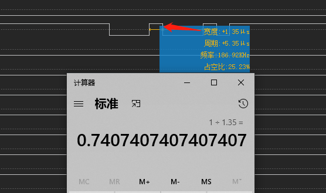

# 串口调试技巧

介绍一下常用的几种调试串口的方法。

# 如何根据逻辑分析仪计算串口波特率

首先了解一下波特率概念，特率就是每秒钟传输的数据位数,波特率的单位是每秒比特数(bps),常用单位还有:每秒千比特数Kbps,每秒兆比特数Mbps。比特率：9600bps就是每秒中传输9600bit，也就是相当于每一秒中划分成了9600等份。如此，那么每1bit的时间就是1/9600秒=104.1666。逻辑分析仪可以查看一个bit的周期，那么就可以计算波特率了：



# stty 命令说明及使用讲解

参考：
* [Linux stty 指令设置串口参数](https://blog.csdn.net/qq_34796705/article/details/116013286)

* 可以在stty命令中使用-a查看当前注册终端的设置情况：
```shell
M92xx:/dev # stty -F /dev/ttyHS1 -a
speed 9600 baud; rows 0; columns 0; line = 0;
intr = ^C; quit = ^\; erase = ^?; kill = ^U; eof = ^D; eol = <undef>; eol2 = <undef>; swtch = <undef>; start = ^Q;
stop = ^S; susp = ^Z; rprnt = ^R; werase = ^W; lnext = ^V; discard = ^O; min = 1; time = 0;
-parenb -parodd -cmspar cs8 hupcl -cstopb cread clocal -crtscts
-ignbrk -brkint -ignpar -parmrk -inpck -istrip -inlcr -igncr icrnl ixon -ixoff -iuclc -ixany -imaxbel -iutf8
opost -olcuc -ocrnl onlcr -onocr -onlret -ofill -ofdel nl0 cr0 tab0 bs0 vt0 ff0
isig icanon iexten echo echoe echok -echonl -noflsh -xcase -tostop -echoprt echoctl echoke -flusho -extproc
```

* 设置串口属性，设置串口ttyS0波特率为115200，8位数据位，1位停止位，无校验位：
```shell
# stty -F /dev/ttyHS1 speed 115200 cs8 -parenb -cstopb
```

* 向串口发送数据
```shell
# echo hello world! > /dev/ttyHS1
```

* 读取串口中的数据
```shell
# cat /dev/ttyHS1
```

* 读取串口数据并保存
```shell
# cat /dev/ttyHS1 > serialdata.txt
```

# linux串口指令microcom使用

## 介绍

microcom是一个串口调试指令，经常用于串口调试，相当于linux自带的串口调试助手

## 指令

microcom [-d DELAY] [-t TIMEOUT] [-s SPEED] [-X] TTY

参数如下：
* -d 表示延时时间，一般我都不设置。
* -t 表示超时时间，超多少时间就自动退出。单位为ms
* -s 表示传输速度，波特率的意思，这个根据自己的情况而定。
* -X 不加
最后指定你的串口设备。如 /dev/ttyO0 , 这是TI的串口设备节点

测试方式如下：

将要测试串口与pc端连接，在pc端开启串口调试工具，波特率设定跟等下microcom设定一样。

使用示例：
```
microcom -s 750000 /dev/ttyHS1
```
