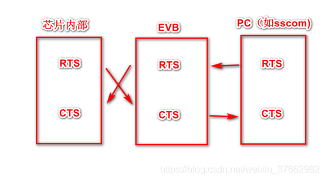
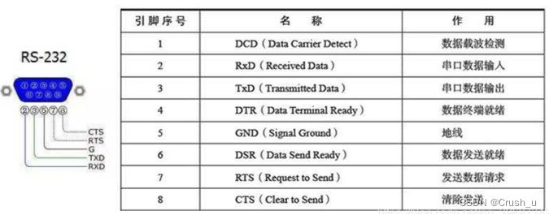

# 串口流控 CTS RTS 介绍

介绍一下串口流控概念。

# 简介

在两个设备正常通信时，由于处理速度不同，就存在这样一个问题，有的快，有的慢，在某些情况下，就可能导致丢失数据的情况。
如台式机与单片机之间的通讯，接收端数据缓冲区已满，则此时继续发送来的数据就会丢失。
流控制能解决这个问题，当接收端数据处理不过来时，就发出“不再接收”的信号，发送端就停止发送，直到收到“可以继续发送”的信号再发送数据。因此流控制可以控制数据传输的进程，实现收发双方的速度匹配，防止数据的丢失。
PC机中常用的两种流控制是硬件流控制（包括RTS/CTS、DTR/CTS等）和软件流控制XON/XOFF（继续/停止）。

* 模块串口RTS与CTS的理解与测试
  * RTS： Request To Send
  * CTS : Clear To Send

* SIMCOM公司解释：
  * RTS是模块的输入端，用于MCU通知模块，MCU是否准备好，模块是否可向MCU发送信息，RTS的有效电平为低。
  * CTS是模块的输出端，用于模块通知MCU，模块是否准备好，MCU是否可向模块发送信息，CTS的有效电平为低

* 硬件接法如下：

 如果串口只接了RX、TX两个信号，那么要流控的话只能使用软流控；如果接了RX，TX，CTS ，RTS四个信号，那么可以使用硬流控或者软件流控。

 

# 硬件流控

硬件流控制常用的有RTS/CTS流控制和DTR/DSR（数据终端就绪/数据设置就绪）流控制。
硬流控的RTS 、CTS ：RTS （Require ToSend，发送请求）为输出信号，用于指示本设备准备好可接收；CTS （Clear ToSend，发送清除）为输入信号，有效时停止发送。假定A、B两设备通信，A设备的RTS 连接B设备的CTS ；A设备的CTS连接B设备的RTS。前一路信号控制B设备的发送，后一路信号控制A设备的发送。对B设备的发送（A设备接收）来说，如果A设备接收缓冲快满的时发出RTS信号（高电平）（意思通知B设备停止发送），B设备通过CTS 检测到该信号，停止发送；一段时间后A设备接收缓冲有了空余，发出RTS信号（低电平），指示B设备开始发送数据。A设备发（B设备接收）类似。

# 软件流控

软件流控和硬件流控都方式一样，只是实现方式不同而已。在通信过程中，软件流控通过在数据流中插入Xoff（特殊字符）和Xon（另一个特殊字符）信号来实现。A设备一旦接收到B设备发送过来的Xoff，立刻停止发送；反之，如接收到B设备发送过来的Xon，则恢复发送数据给B设备。同理，B设备也类似，从而实现收发双方的速度匹配。

# 数据收发

* a. 物理连接（交叉连接）
  * 主机的RTS（输出）信号，连接到从机的CTS（输入）信号。
  * 主机的CTS（输入）信号，连接到从机的RTS（输出）信号。
  * RTS （Require ToSend，发送请求）为输出信号，用于指示本设备准备好可接收数据，低电平有效，低电平说明本设备可以接收数据。
  * CTS （Clear ToSend，发送允许）为输入信号，用于判断是否可以向对方发送数据，低电平有效，低电平说明本设备可以向对方发送数据。
    
* b. 主机发送过程：
  * 主机查询主机的CTS脚信号，此信号连接到从机的RTS信号，受从机控制。
  * 如果主机CTS信号为有效（低），表示从机的接收FIFO未满，从机可以接收，此时主机可以向从机发送数据。
  * 主机在发送过程中要一直查询CTS信号是否为有效状态。一旦无效，则终止发送。

* c. 主机接收过程：
  * 主机如果接收FIFO未满，则使主机RTS信号有效，也即从机的CTS信号有效。此时从机如果要发送，发送前会查询从机的CTS信号，如果为有效，则开始发送。
  * 在发送过程中一直查询从机CTS信号的有效状态，如果无效则中止发送。是否无效由主机的RTS信号决定。
  * 主机如果FIFO满了，则使主机RTS信号无效，也即从机CTS信号无效。主机接收中止。

* d. 那主机的CTS信号什么时候会无效呢？
  * 从机在接收到主机发送的数据时，从机的接收模块的FIFO如果满了，则会使从机RTS无效，也即主机的CTS信号无效。主机则查询到CTS无效时，主机发送中止。
此过程可以由硬流控完成。我们只要设置开启硬流控，设置FIFO大小。RTS信号和CTS信号由控制器代码查询和设置。 

# 实例

以下是SP端正常接收的示波器图，SP RX接收时，红色RTS是为低有效的：

