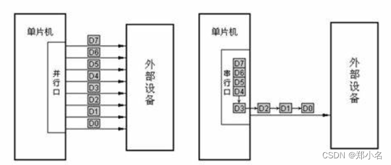
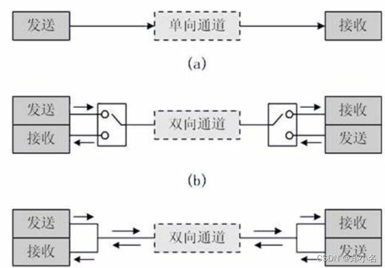
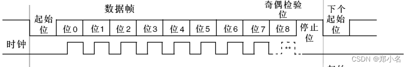

# 串口通信协议及方式

串口基础知识整理。

# 参考

* [串口通信详解](https://blog.csdn.net/m0_51429690/article/details/126867781)

# 通信的分类

按照传输方式的不同通信分为串行通信和并行通信。
* 并行通信：同一时刻，可以传输多个bit位的信号，有多少个信号位就需要多少根信号线。
* 串行通信：同一时刻，只能传输一个bit位的信号，只需要一根信号线。

其中串行通信分为两种方式：异步串行通信、同步串行通信。
* 异步串行通信：是指发送方与接收方，使用各自的时钟控制数据发送和接收过程（为使双方收发协调，要求双方时钟尽可能一致）。
* 同步串行通信：则是发送方时钟直接控制接收方时钟，使双方完全同步（同步方法有“外同步和自同步”两种）。

按照传输方向可以分为单工通信和双工通信。

* 单工数据：传输只支持数据在一个方向上传输。
* 双工通信：可以再分为全双工通信和半双工通信。
* 半双工：数据传输允许数据在两个方向上传输，但是，在某一时刻，只允许数据在一个方向上传输，它实际上是一种切换方向的单工通信;
* 全双工：数据通信允许数据同时在两个方向上传输，因此，全双工通信是两个单工通信方式的结合，它要求发送设备和接收设备都有独立的接收和发送能力。

# 通信帧格式

串口通信通常采用的是异步串行通信总线，该总线有两条数据线，可以实现全双工的发送和接收，在嵌入式系统中常用于主机与辅助设备之间的通信。

* 起始位：起始位为低电平。
  * 通信在空闲状态时保持高电平，因此出现下降沿即可判定为数据传输开始。
  * 虽然数据位也会出现低电平，但是空闲状态是保持高电平，而且起始状态就判断一次，所以不用担心数据位中的低电平误识别成起始位。
* 数据位：数据位 5-8 位，发送先发送低位后发送高位。
* 奇偶校验位：奇偶校验位是可以不设置，大家自行选择。
  * 奇校验：数据位 + 校验位高电平的个数为奇数。
  * 偶校验：数据位 + 校验位高电平的个数为偶数。
* 停止位：一般0.5位到2位，通常设置为1位。
  * 1个停止位：停止位位数的默认值。
  * 2个停止位：可用于常规USART模式、单线模式以及调制解调器模式。
  * 0.5个停止位：在智能卡模式下接收数据时使用。
  * 1.5个停止位：在智能卡模式下发送和接收数据时使用。

# 传输速率

* **串口通讯的速率用波特率表示**，单位是bps(bit per secong)（位/秒） 即每秒钟传送的bit的数量。1byte = 8bit。
* 以9600bps为例，假设一个字符帧共有10位（1起始位、8数据位、1结束位），那么每秒钟能传输的最大字符数为“9600/10 = 960”。
* **串口接收和发送方的波特率应该是一致的**，01 和 0011 产生的波形是一样的，区分方法是掐时间，因为波特率固定，每个位的持续时间时间固定，就可以区连续发送了几个高电平或者低电平。
* **串口发送一串数据不是连续发送**，是一个字节一个字节发送的，其目的防止接收和发送的累计误差（时间误差），因为串口是异步通信，没有时间基准。比如：正常情况发送是一个字节共8个数据位，发送端的波特率为9600，接收端的波特率是9550，接收和发送之间是有时间差的，但是发送数据少，不影响我们区分正常的数据位，如果一次发送个1000字节共8000个数据位，那么就会出现数据出错。（因为不同单片机时钟不一样，两个单片机之间没有时间基准，所以都会出现波特率误差）。
* **波特率误差分析** ：串行通讯误差要求实践表明，当波特率的相对误差小于4.5%时，不会影响数据的正确接收，一般要保证传输的可靠性，要求误差不大于2.5%。

# 串口通信的经典方法

* **查询方式**：可靠性很高，要考虑下个数据包覆盖上一个数据包的问题，小数据量，在10个字节以内，可以这样考虑， 很简单，很方便，很可靠。但是在数据量大的时候，程序阻塞的时间特别长，影响其他比较重要的外设的处理。
* **中断方式**：不占用系统资源，但是如果数据量大，会频繁中断cpu，会其他高优先的数据处理造成影响。但是没有DMA不占用资源的好处， 如果没有串口队列的实现，必须通过标志位判断上一个包数据是否发送完成，在把新的数据覆盖到串口的缓冲区。
* **DMA方式**：不占用系统资源，减少CPU对中断的响应。如何不建立数据包的队列，还是会出现，需要等待阻塞的问题。
* **FIFO方式**：在串口的接收和发送中，串口接收到的数据可以先进入FIFO，不必马上进入中断服务程序接收，这样可节省CPU时间。对于发送数据也一样，可以把要发送的数据一起写入FIFO，串口控制器可按写入顺序依次发送出去。

