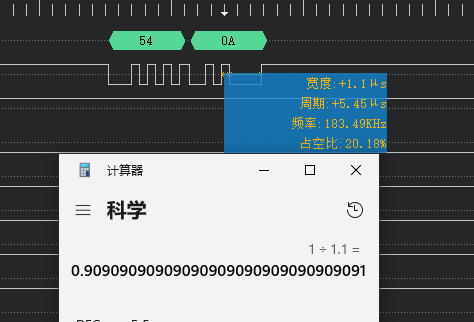
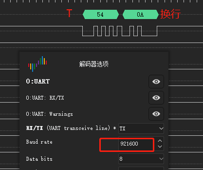
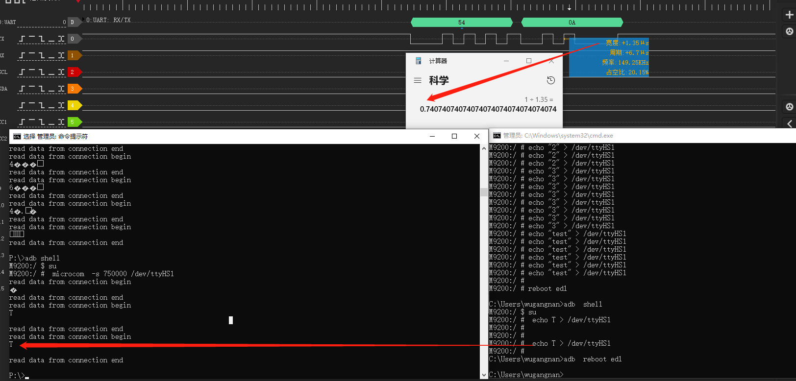

# 概述

kernel阶段串口无法设置750k波特率问题分析。

# 参考

* [Linux C 配置串口](https://www.jianshu.com/p/58b79a01680a)

# 测试方案

由于该项目使用了流控，需要将microcom增加流控属性，修改如下：
```diff
--- a/QSSI.12/external/toybox/lib/tty.c
+++ b/QSSI.12/external/toybox/lib/tty.c
@@ -65,7 +65,7 @@ void xsetspeed(struct termios *tio, int speed)
 {
   int i, speeds[] = {50, 75, 110, 134, 150, 200, 300, 600, 1200, 1800, 2400,
                     4800, 9600, 19200, 38400, 57600, 115200, 230400, 460800,
-                    500000, 576000, 921600, 1000000, 1152000, 1500000, 2000000,
+                    500000, 576000, 750000, 921600, 1000000, 1152000, 1500000, 2000000,
                     2500000, 3000000, 3500000, 4000000};

   // Find speed in table, adjust to constant
@@ -95,6 +95,9 @@ int set_terminal(int fd, int raw, int speed, struct termios *old)

   // Output appends CR to NL, does magic undocumented postprocessing
   termio.c_oflag = ONLCR|OPOST;
+  termio.c_oflag &= ~ IXON;
+  termio.c_oflag &= ~ IXOFF;
+

   // Leave serial port speed alone
   // termio.c_cflag = C_READ|CS8|EXTB;
@@ -104,14 +107,15 @@ int set_terminal(int fd, int raw, int speed, struct termios *old)
   // erase line char at a time
   // "extended" behavior: ctrl-V quotes next char, ctrl-R reprints unread chars,
   // ctrl-W erases word
-  termio.c_lflag = ISIG|ICANON|ECHO|ECHOE|ECHOK|ECHOCTL|ECHOKE|IEXTEN;
+  //termio.c_lflag = ISIG|ICANON|ECHO|ECHOE|ECHOK|ECHOCTL|ECHOKE|IEXTEN;
+  termio.c_lflag =     CRTSCTS;

   if (raw) cfmakeraw(&termio);

   if (speed) {
     int i, speeds[] = {50, 75, 110, 134, 150, 200, 300, 600, 1200, 1800, 2400,
                     4800, 9600, 19200, 38400, 57600, 115200, 230400, 460800,
-                    500000, 576000, 921600, 1000000, 1152000, 1500000, 2000000,
+                    500000, 576000, 750000, 921600, 1000000, 1152000, 1500000, 2000000,
                     2500000, 3000000, 3500000, 4000000};

     // Find speed in table, adjust to constant
diff --git a/QSSI.12/external/toybox/toys/net/microcom.c b/QSSI.12/external/toybox/toys/net/microcom.c
old mode 100644
new mode 100755
--- a/QSSI.12/external/toybox/toys/net/microcom.c
+++ b/QSSI.12/external/toybox/toys/net/microcom.c
@@ -33,6 +33,8 @@ static void restore_states(int i)
   tcsetattr(TT.fd, TCSAFLUSH, &TT.old_fd);
 }

+char tips_begin[] = "read data from connection begin\n";
+char tips_end[] = "\nread data from connection end\n";
 void microcom_main(void)
 {
   struct termios tio;
@@ -62,7 +64,11 @@ void microcom_main(void)

     // Read from connection, write to stdout.
     if (fds[0].revents) {
-      if (0 < (i = read(TT.fd, toybuf, sizeof(toybuf)))) xwrite(0, toybuf, i);
+      if (0 < (i = read(TT.fd, toybuf, sizeof(toybuf)))) {
+                 xwrite(1, tips_begin, sizeof(tips_begin));
+                 xwrite(1, toybuf, i);
+                 xwrite(1, tips_end, sizeof(tips_end));
+         }
       else break;
     }
```

* `microcom  -s 750000 /dev/ttyHS1`设置750k波特率后另外开个串口进行写数据操作:
```
M9200:/ # echo T > /dev/ttyHS1
M9200:/ # echo T > /dev/ttyHS1
M9200:/ # echo T > /dev/ttyHS1
```

收到数据有问题，逻辑分析仪解析出错：


根据单bit周期算出波特率为909K：



将波特率配置为921600后数据正常显示：



# 软件流程

microcom中设置波特率软件流程如下：
* `QSSI.12/external/toybox/toys/net/microcom.c`:
```c
* void microcom_main(void)
  * xsetspeed(&tio, TT.s);
    * speeds[] = {50, 75, 110, 134, 150, 200, 300, 600, 1200, 1800, 2400,
    * cfsetspeed(tio, i+1+4081*(i>15));
```
cfsetspeed() 函数扩展为同时设置输入和输出波特率。

跳过tty operation函数直接看一下驱动中设置波特率的函数：
* ``:
```c
static const struct uart_ops msm_geni_console_pops = {
	.tx_empty = msm_geni_serial_tx_empty,
	.stop_tx = msm_geni_serial_stop_tx,
	.start_tx = msm_geni_serial_start_tx,
	.stop_rx = msm_geni_serial_stop_rx,
	.set_termios = msm_geni_serial_set_termios,
	.startup = msm_geni_serial_startup,
	.config_port = msm_geni_serial_config_port,
	.shutdown = msm_geni_serial_shutdown,
	.type = msm_geni_serial_get_type,
	.set_mctrl = msm_geni_cons_set_mctrl,
	.get_mctrl = msm_geni_cons_get_mctrl,
#ifdef CONFIG_CONSOLE_POLL
	.poll_get_char	= msm_geni_serial_get_char,
	.poll_put_char	= msm_geni_serial_poll_put_char,
#endif
	.pm = msm_geni_serial_cons_pm,
};

static const struct uart_ops msm_geni_serial_pops = {
	.tx_empty = msm_geni_serial_tx_empty,
	.stop_tx = msm_geni_serial_stop_tx,
	.start_tx = msm_geni_serial_start_tx,
	.stop_rx = msm_geni_serial_stop_rx,
	.set_termios = msm_geni_serial_set_termios,
	.startup = msm_geni_serial_startup,
	.config_port = msm_geni_serial_config_port,
	.shutdown = msm_geni_serial_shutdown,
	.type = msm_geni_serial_get_type,
	.set_mctrl = msm_geni_serial_set_mctrl,
	.get_mctrl = msm_geni_serial_get_mctrl,
	.break_ctl = msm_geni_serial_break_ctl,
	.flush_buffer = NULL,
	.ioctl = msm_geni_serial_ioctl,
};
```

其中msm_geni_serial_set_termios就是设置波特率的函数，其中有个比较重要的函数uart_get_baud_rate：
```c
static void msm_geni_serial_set_termios(struct uart_port *uport,
				struct ktermios *termios, struct ktermios *old)
{
	/* baud rate */
	baud = uart_get_baud_rate(uport, termios, old, 300, 4000000);
	port->cur_baud = baud;
}
```

软件流程：
```c
* uart_get_baud_rate(struct uart_port *port, struct ktermios *termios,
  └── baud = tty_termios_baud_rate(termios);
      └── return cbaud >= n_baud_table ? 0 : baud_table[cbaud];
```

其中baud_table为所有波特率支持列表，在这里面添加750000就能够配置了：
```c
static const speed_t baud_table[] = {
	0, 50, 75, 110, 134, 150, 200, 300, 600, 1200, 1800, 2400, 4800,
	9600, 19200, 38400, 57600, 115200, 230400, 460800,
#ifdef __sparc__
	76800, 153600, 307200, 614400, 750000, 921600 //这里添加
#else
	500000, 576000, 750000, 921600, 1000000, 1152000, 1500000, 2000000,
	2500000, 3000000, 3500000, 4000000
#endif
};
```

# 验证结论

可以看到波特率和发送接收的数据已经没问题了。



# 打印机调试

* ftest打开不支持打印机：
```
2022-12-26 22:15:53.025 4122-5107/com.pax.ft E/PrintManager: NO SUPPORT ERROR:0x60000201
2022-12-26 22:15:53.026 4122-5107/com.pax.ft E/DBG: PrnTest-> PrintException:
    com.pax.api.PrintException: Not Support for this device
        at com.pax.api.PrintManager.prnInitEx(PrintManager.java:196)
        at com.pax.api.PrintManager.prnInit(PrintManager.java:209)
        at com.pax.ft.module.PrnTest.test(PrnTest.java:235)
        at com.pax.ft.module.PrnTest.access$000(PrnTest.java:49)
        at com.pax.ft.module.PrnTest$2.dox(PrnTest.java:78)
        at com.pax.ft.tools.BaseTest.lambda$execute$0$BaseTest(BaseTest.java:542)
        at com.pax.ft.tools.-$$Lambda$BaseTest$U9HGJDwDf8wlpZP9XWVZ0ca-85Q.run(Unknown Source:6)
        at java.util.concurrent.ThreadPoolExecutor.runWorker(ThreadPoolExecutor.java:1167)
        at java.util.concurrent.ThreadPoolExecutor$Worker.run(ThreadPoolExecutor.java:641)
        at java.lang.Thread.run(Thread.java:920)
```

继续报错`open sys class error`：
```log
2022-12-27 12:39:30.286 8576-8576/? E/PAXSVR: ++++++  Start  PaxApiService ++++++
2022-12-27 12:39:30.286 8576-8576/? E/PAXSVR: The current series : ATM, The current model : M9200
2022-12-27 12:39:30.286 8576-8576/? E/PAXSVR: initDevConfig
2022-12-27 12:39:30.286 8576-8576/? E/PAXSVR: initDevConfig model = M9200
2022-12-27 12:39:30.286 8576-8576/? E/PAXSVR: ++++++  Create M9200 Config success  ++++++
2022-12-27 12:39:30.298 8576-8576/? W/libc: Unable to set property "ro.auth.baudrate" to "3000000": error code: 0xb
2022-12-27 12:39:30.311 8576-8576/? W/libc: Unable to set property "ro.rpc.baudrate" to "3000000": error code: 0xb
2022-12-27 12:39:30.311 8576-8576/? E/PAXSVR: ++++++  dumpDevConfig start  ++++++
2022-12-27 12:39:30.311 8576-8576/? E/PAXSVR: SPDevConfig : spDevName /dev/paxPortRPC, rate 750000
2022-12-27 12:39:30.311 8576-8576/? E/PAXSVR: MagConfig : magType 1, magReaderCombined 0
2022-12-27 12:39:30.311 8576-8576/? E/PAXSVR: IccConfig : iccType 1
2022-12-27 12:39:30.311 8576-8576/? E/PAXSVR: PiccConfig : piccType 2, isSupportPiccLight 0
2022-12-27 12:39:30.311 8576-8576/? E/PAXSVR: PrnConfig : prnType 1
2022-12-27 12:39:30.311 8576-8576/? E/PAXSVR: PedConfig : pedType 1, isSMSupport 1, isSupportKeyBorad 2, isPCISecSupport 1
2022-12-27 12:39:30.311 8576-8576/? E/PAXSVR: BaseDeviceConfig : baseDeviceType 0
2022-12-27 12:39:30.311 8576-8576/? E/PAXSVR: CashBoxConfig : isCashBoxSupport 0, cashBoxType 0
2022-12-27 12:39:30.311 8576-8576/? E/PAXSVR: ++++++  dumpDevConfig end    ++++++
2022-12-27 12:39:30.311 8576-8576/? E/PAXSVR: ++++++ initDevice  ++++++
2022-12-27 12:39:30.311 8576-8576/? E/ATM: PaxApiServiceATM initGlobalFuncs
2022-12-27 12:39:30.311 8576-8576/? E/ATM: initSpdev
2022-12-27 12:39:30.312 8576-8576/? E/pax-Spdev: [ SpdevPowerSwitch   443] ERROR: open sys class error
2022-12-27 12:39:30.322 8576-8576/? E/pax-Spdev: [ SpdevPowerSwitch   443] ERROR: open sys class error
2022-12-27 12:39:30.323 8576-8576/? A/libc: Fatal signal 11 (SIGSEGV), code 2 (SEGV_ACCERR), fault addr 0xa5df9488 in tid 8576 (paxservice), pid 8576 (paxservice)
2022-12-27 12:39:30.365 8580-8580/? I/crash_dump32: obtaining output fd from tombstoned, type: kDebuggerdTombstoneProto
2022-12-27 12:39:30.367 510-510/? I/tombstoned: received crash request for pid 8576
2022-12-27 12:39:30.368 8580-8580/? I/crash_dump32: performing dump of process 8576 (target tid = 8576)
2022-12-27 12:39:30.373 8580-8580/? E/DEBUG: failed to read /proc/uptime: Permission denied
2022-12-27 12:39:30.710 8580-8580/? A/DEBUG: *** *** *** *** *** *** *** *** *** *** *** *** *** *** *** ***
2022-12-27 12:39:30.710 8580-8580/? A/DEBUG: Build fingerprint: 'PAX/M9200/M9200:12/SKQ1.220119.001/eng.pax.20221226.220310:userdebug/release-keys'
2022-12-27 12:39:30.710 8580-8580/? A/DEBUG: Revision: '0'
2022-12-27 12:39:30.710 8580-8580/? A/DEBUG: ABI: 'arm'
2022-12-27 12:39:30.710 8580-8580/? A/DEBUG: Timestamp: 2022-12-27 12:39:30.372272711+0800
2022-12-27 12:39:30.710 8580-8580/? A/DEBUG: Process uptime: 0s
2022-12-27 12:39:30.710 8580-8580/? A/DEBUG: Cmdline: /system/bin/paxservice
2022-12-27 12:39:30.710 8580-8580/? A/DEBUG: pid: 8576, tid: 8576, name: paxservice  >>> /system/bin/paxservice <<<
2022-12-27 12:39:30.710 8580-8580/? A/DEBUG: uid: 0
2022-12-27 12:39:30.710 8580-8580/? A/DEBUG: signal 11 (SIGSEGV), code 2 (SEGV_ACCERR), fault addr 0xa5df9488
2022-12-27 12:39:30.710 8580-8580/? A/DEBUG:     r0  a5de7e51  r1  00000000  r2  00000000  r3  00000000
2022-12-27 12:39:30.710 8580-8580/? A/DEBUG:     r4  00000003  r5  a5e0334c  r6  a5e03270  r7  00000008
2022-12-27 12:39:30.710 8580-8580/? A/DEBUG:     r8  a55532cc  r9  a5e03024  r10 a5dfcc19  r11 a5e03184
2022-12-27 12:39:30.710 8580-8580/? A/DEBUG:     ip  a5e01de4  sp  beb33170  lr  a5de7d7f  pc  a5df9488
2022-12-27 12:39:30.710 8580-8580/? A/DEBUG: backtrace:
2022-12-27 12:39:30.710 8580-8580/? A/DEBUG:       #00 pc 0002f488  /system/lib/libpaxspdev.so!libpaxspdev.so (__ThumbV7PILongThunk_trans_init+0) (BuildId: f140034a4622694890bac8acf94e5252)
2022-12-27 12:39:30.735 1296-2478/system_process W/NativeCrashListener: Couldn't find ProcessRecord for pid 8576
2022-12-27 12:39:30.736 8580-8580/? E/crash_dump32: AM data write failed: Broken pipe
2022-12-27 12:39:30.737 510-510/? E/tombstoned: Tombstone written to: tombstone_03
2022-12-27 12:39:30.745 1296-1988/system_process I/BootReceiver: Copying /data/tombstones/tombstone_03 to DropBox (SYSTEM_TOMBSTONE)
2022-12-27 12:39:30.745 1296-1988/system_process I/DropBoxManagerService: add tag=SYSTEM_TOMBSTONE isTagEnabled=true flags=0x6
2022-12-27 12:39:30.770 1296-1988/system_process E/NativeTombstoneManager: Tombstone's UID (0) not an app, ignoring
2022-12-27 12:39:30.771 1296-1988/system_process I/DropBoxManagerService: add tag=SYSTEM_TOMBSTONE_PROTO isTagEnabled=true flags=0x4
2022-12-27 12:39:31.350 8344-8396/com.pax.ft E/DBG: Shell-> exec.size:5
2022-12-27 12:39:31.833 8563-8563/? W/ServiceManager: Service PaxApiService didn't start. Returning NULL
2022-12-27 12:39:31.836 8563-8563/? I/ServiceManager: Waiting for service 'PaxApiService' on '/dev/binder'...
2022-12-27 12:39:33.756 8344-8468/com.pax.ft W/ServiceManager: Service PaxApiService didn't start. Returning NULL
2022-12-27 12:39:33.757 8344-8468/com.pax.ft E/RpcClient: open rpc failure:other,-1
2022-12-27 12:39:33.757 8344-8468/com.pax.ft W/System.err: com.pax.api.PosSideException: ERROR_DATA_CONNECT
2022-12-27 12:39:33.757 8344-8468/com.pax.ft W/System.err:     at pax.util.RpcClient.open_rpc(RpcClient.java:64)
2022-12-27 12:39:33.757 8344-8468/com.pax.ft W/System.err:     at pax.util.RpcClient.<init>(RpcClient.java:32)
2022-12-27 12:39:33.757 8344-8468/com.pax.ft W/System.err:     at pax.util.RpcClient.getInstance(RpcClient.java:37)
2022-12-27 12:39:33.757 8344-8468/com.pax.ft W/System.err:     at com.pax.api.BaseSystemManager.<init>(BaseSystemManager.java:38)
2022-12-27 12:39:33.757 8344-8468/com.pax.ft W/System.err:     at com.pax.api.BaseSystemManager.getInstance(BaseSystemManager.java:56)
2022-12-27 12:39:33.758 8344-8468/com.pax.ft W/System.err:     at com.pax.ft.WelcomeActivity.lambda$onCreate$2$WelcomeActivity(WelcomeActivity.java:190)
2022-12-27 12:39:33.758 8344-8468/com.pax.ft W/System.err:     at com.pax.ft.-$$Lambda$WelcomeActivity$eOBZ2GPpXhTUbsVMKm3t7Yw14D4.run(Unknown Source:2)
2022-12-27 12:39:33.758 8344-8468/com.pax.ft W/System.err:     at java.util.concurrent.ThreadPoolExecutor.runWorker(ThreadPoolExecutor.java:1167)
2022-12-27 12:39:33.758 8344-8458/com.pax.ft W/com.pax.ft: Long monitor contention with owner pool-2-thread-3 (8468) at pax.util.RpcClient pax.util.RpcClient.getInstance()(RpcClient.java:39) waiters=2 in pax.util.RpcClient pax.util.RpcClient.getInstance() for 24.170s
2022-12-27 12:39:33.759 8344-8468/com.pax.ft W/System.err:     at java.util.concurrent.ThreadPoolExecutor$Worker.run(ThreadPoolExecutor.java:641)
2022-12-27 12:39:33.759 8344-8468/com.pax.ft W/System.err:     at java.lang.Thread.run(Thread.java:920)
2022-12-27 12:39:33.759 8344-8458/com.pax.ft I/System.out: RpcClient open rpc
2022-12-27 12:39:33.759 8344-8468/com.pax.ft I/DBG: WelcomeActivity-> BaseSystemException = 99
2022-12-27 12:39:33.759 8344-8468/com.pax.ft E/DBG: WelcomeActivity-> Properties(pax.ctrl.spver)=10(R)20221226
2022-12-27 12:39:33.759 8344-8468/com.pax.ft E/DBG: WelcomeActivity-> Properties(pax.sp.MONITOR)=10(R)20221226
2022-12-27 12:39:33.760 8344-8458/com.pax.ft I/ServiceManager: Waiting for service 'PaxApiService' on '/dev/binder'...
2022-12-27 12:39:35.284 8585-8585/? E/linker: "/system/lib/libpaxspdev.so": ignoring DT_PREINIT_ARRAY in shared library!
2022-12-27 12:39:35.286 8585-8585/? E/PAXSVR: getpriority ret 0 pid 8585
2022-12-27 12:39:35.286 8585-8585/? E/PAXSVR: setpriority return 0
2022-12-27 12:39:35.287 8585-8585/? E/PAXSVR: nice return -20
2022-12-27 12:39:35.287 8585-8585/? E/PAXSVR: getpriority2 ret -20 pid 8585
2022-12-27 12:39:35.295 8585-8585/? D/ProcessState: Binder ioctl to enable oneway spam detection failed: Invalid argument
```

解决权限报错后，还是跑不起来：
```log
2022-12-27 22:24:43.608 7140-7140/? E/linker: "/system/lib/libpaxspdev.so": ignoring DT_PREINIT_ARRAY in shared library!
2022-12-27 22:24:43.610 7140-7140/? E/PAXSVR: getpriority ret 0 pid 7140
2022-12-27 22:24:43.610 7140-7140/? E/PAXSVR: setpriority return 0
2022-12-27 22:24:43.610 7140-7140/? E/PAXSVR: nice return -20
2022-12-27 22:24:43.610 7140-7140/? E/PAXSVR: getpriority2 ret -20 pid 7140
2022-12-27 22:24:43.618 7140-7140/? D/ProcessState: Binder ioctl to enable oneway spam detection failed: Invalid argument
2022-12-27 22:24:43.620 7140-7140/? E/PAXSVR: ++++++  Start  PaxApiService ++++++
2022-12-27 22:24:43.620 7140-7140/? E/PAXSVR: The current series : ATM, The current model : M9200
2022-12-27 22:24:43.620 7140-7140/? E/PAXSVR: initDevConfig
2022-12-27 22:24:43.620 7140-7140/? E/PAXSVR: initDevConfig model = M9200
2022-12-27 22:24:43.620 7140-7140/? E/PAXSVR: ++++++  Create M9200 Config success  ++++++
2022-12-27 22:24:43.632 7140-7140/? W/libc: Unable to set property "ro.auth.baudrate" to "750000": error code: 0xb
2022-12-27 22:24:43.644 7140-7140/? W/libc: Unable to set property "ro.rpc.baudrate" to "750000": error code: 0xb
2022-12-27 22:24:43.645 7140-7140/? E/PAXSVR: ++++++  dumpDevConfig start  ++++++
2022-12-27 22:24:43.645 7140-7140/? E/PAXSVR: SPDevConfig : spDevName /dev/paxPortRPC, rate 750000
2022-12-27 22:24:43.645 7140-7140/? E/PAXSVR: MagConfig : magType 1, magReaderCombined 0
2022-12-27 22:24:43.645 7140-7140/? E/PAXSVR: IccConfig : iccType 1
2022-12-27 22:24:43.645 7140-7140/? E/PAXSVR: PiccConfig : piccType 2, isSupportPiccLight 0
2022-12-27 22:24:43.645 7140-7140/? E/PAXSVR: PrnConfig : prnType 1
2022-12-27 22:24:43.645 7140-7140/? E/PAXSVR: PedConfig : pedType 1, isSMSupport 1, isSupportKeyBorad 2, isPCISecSupport 1
2022-12-27 22:24:43.645 7140-7140/? E/PAXSVR: BaseDeviceConfig : baseDeviceType 0
2022-12-27 22:24:43.645 7140-7140/? E/PAXSVR: CashBoxConfig : isCashBoxSupport 0, cashBoxType 0
2022-12-27 22:24:43.645 7140-7140/? E/PAXSVR: ++++++  dumpDevConfig end    ++++++
2022-12-27 22:24:43.645 7140-7140/? E/PAXSVR: ++++++ initDevice  ++++++
2022-12-27 22:24:43.645 7140-7140/? E/ATM: PaxApiServiceATM initGlobalFuncs
2022-12-27 22:24:43.645 7140-7140/? E/ATM: initSpdev
    
    --------- beginning of crash
2022-12-27 22:24:43.645 7140-7140/? A/libc: Fatal signal 11 (SIGSEGV), code 2 (SEGV_ACCERR), fault addr 0xa85b2070 in tid 7140 (paxservice), pid 7140 (paxservice)
2022-12-27 22:24:43.683 7143-7143/? I/crash_dump32: obtaining output fd from tombstoned, type: kDebuggerdTombstoneProto
2022-12-27 22:24:43.684 508-508/? I/tombstoned: received crash request for pid 7140
2022-12-27 22:24:43.685 7143-7143/? I/crash_dump32: performing dump of process 7140 (target tid = 7140)
2022-12-27 22:24:43.690 7143-7143/? E/DEBUG: failed to read /proc/uptime: Permission denied
2022-12-27 22:24:43.799 7143-7143/? A/DEBUG: *** *** *** *** *** *** *** *** *** *** *** *** *** *** *** ***
2022-12-27 22:24:43.799 7143-7143/? A/DEBUG: Build fingerprint: 'PAX/M9200/M9200:12/SKQ1.220119.001/eng.pax.20221227.220344:userdebug/release-keys'
2022-12-27 22:24:43.799 7143-7143/? A/DEBUG: Revision: '0'
2022-12-27 22:24:43.799 7143-7143/? A/DEBUG: ABI: 'arm'
2022-12-27 22:24:43.799 7143-7143/? A/DEBUG: Timestamp: 2022-12-27 22:24:43.689095882+0800
2022-12-27 22:24:43.799 7143-7143/? A/DEBUG: Process uptime: 0s
2022-12-27 22:24:43.799 7143-7143/? A/DEBUG: Cmdline: /system/bin/paxservice
2022-12-27 22:24:43.800 7143-7143/? A/DEBUG: pid: 7140, tid: 7140, name: paxservice  >>> /system/bin/paxservice <<<
2022-12-27 22:24:43.800 7143-7143/? A/DEBUG: uid: 0
2022-12-27 22:24:43.800 7143-7143/? A/DEBUG: signal 11 (SIGSEGV), code 2 (SEGV_ACCERR), fault addr 0xa85b2070
2022-12-27 22:24:43.800 7143-7143/? A/DEBUG:     r0  beb4a0a0  r1  00000100  r2  00000010  r3  0000000f
2022-12-27 22:24:43.800 7143-7143/? A/DEBUG:     r4  00000000  r5  beb4a0a0  r6  a77e32cc  r7  01eeb310
2022-12-27 22:24:43.800 7143-7143/? A/DEBUG:     r8  a77e32cc  r9  01ee0ac0  r10 01ee0a58  r11 00000000
2022-12-27 22:24:43.800 7143-7143/? A/DEBUG:     ip  a85bb710  sp  beb4a098  lr  a8593f5d  pc  a85b2070
2022-12-27 22:24:43.800 7143-7143/? A/DEBUG: backtrace:
2022-12-27 22:24:43.800 7143-7143/? A/DEBUG:       #00 pc 0002f070  /system/lib/libpaxspdev.so!libpaxspdev.so (__aeabi_memclr8+0) (BuildId: 4b747bf781d52bd11e01c2d48efc95b1)
```

* 注释掉`nrf_rpc_os_init`函数后，发现后面的`nrf_rpc_tr_init`函数报错`__ThumbV7PILongThunk_trans_init`:

```log
2023-01-01 02:30:46.412 7918-7918/? E/PAXSVR: ++++++  dumpDevConfig start  ++++++
2023-01-01 02:30:46.412 7918-7918/? E/PAXSVR: SPDevConfig : spDevName /dev/paxPortRPC, rate 750000
2023-01-01 02:30:46.412 7918-7918/? E/PAXSVR: MagConfig : magType 1, magReaderCombined 0
2023-01-01 02:30:46.412 7918-7918/? E/PAXSVR: IccConfig : iccType 1
2023-01-01 02:30:46.412 7918-7918/? E/PAXSVR: PiccConfig : piccType 2, isSupportPiccLight 0
2023-01-01 02:30:46.412 7918-7918/? E/PAXSVR: PrnConfig : prnType 1
2023-01-01 02:30:46.412 7918-7918/? E/PAXSVR: PedConfig : pedType 1, isSMSupport 1, isSupportKeyBorad 2, isPCISecSupport 1
2023-01-01 02:30:46.412 7918-7918/? E/PAXSVR: BaseDeviceConfig : baseDeviceType 0
2023-01-01 02:30:46.412 7918-7918/? E/PAXSVR: CashBoxConfig : isCashBoxSupport 0, cashBoxType 0
2023-01-01 02:30:46.412 7918-7918/? E/PAXSVR: ++++++  dumpDevConfig end    ++++++
2023-01-01 02:30:46.412 7918-7918/? E/PAXSVR: ++++++ initDevice  ++++++
2023-01-01 02:30:46.412 7918-7918/? E/ATM: PaxApiServiceATM initGlobalFuncs
2023-01-01 02:30:46.412 7918-7918/? E/ATM: initSpdev
2023-01-01 02:30:46.412 7918-7918/? E/spc: wugn test step 11
2023-01-01 02:30:46.412 7918-7918/? E/ddd: wugn test start
2023-01-01 02:30:46.412 7918-7918/? E/ddd: wugn test start 222
2023-01-01 02:30:46.412 7918-7918/? E/pax-Spdev: [ SpdevPowerSwitch   464] ERROR: open sys class error
2023-01-01 02:30:46.423 7918-7918/? E/spc: wugn test step 222
2023-01-01 02:30:46.423 7918-7918/? E/ddd: wugn test start
2023-01-01 02:30:46.423 7918-7918/? E/ddd: wugn test start 222
2023-01-01 02:30:46.423 7918-7918/? E/pax-Spdev: [ SpdevPowerSwitch   464] ERROR: open sys class error
2023-01-01 02:30:46.423 7918-7918/? E/spc: wugn test step 22
2023-01-01 02:30:46.423 7918-7918/? E/spc: wugn test step 11111
2023-01-01 02:30:46.423 7918-7918/? E/spc: wugn test step 2222
2023-01-01 02:30:46.423 7918-7918/? E/spc: wugn test step 3333
2023-01-01 02:30:46.423 7918-7918/? E/spc: wugn test step 4444
2023-01-01 02:30:46.423 7918-7918/? E/spc: wugn test step 55555
2023-01-01 02:30:46.423 7918-7918/? E/rpc: wugn test step 1
2023-01-01 02:30:46.423 7918-7918/? E/rpc: wugn test step 2 
2023-01-01 02:30:46.423 7918-7918/? E/rpc: wugn test step 2 
2023-01-01 02:30:46.423 7918-7918/? E/rpc: wugn test step 2 
2023-01-01 02:30:46.423 7918-7918/? E/rpc: wugn test step 3
2023-01-01 02:30:46.423 7918-7918/? E/rpc: wugn test step 44
2023-01-01 02:30:46.423 7918-7918/? E/rpc: wugn test step 5
2023-01-01 02:30:46.423 7918-7918/? E/rpc: wugn test step 6
2023-01-01 02:30:46.423 7918-7918/? E/rpc: wugn test step 7
2023-01-01 02:30:46.423 7918-7918/? A/libc: Fatal signal 11 (SIGSEGV), code 2 (SEGV_ACCERR), fault addr 0xb5134950 in tid 7918 (paxservice), pid 7918 (paxservice)
2023-01-01 02:30:46.466 7921-7921/? I/crash_dump32: obtaining output fd from tombstoned, type: kDebuggerdTombstoneProto
2023-01-01 02:30:46.467 509-509/? I/tombstoned: received crash request for pid 7918
2023-01-01 02:30:46.468 7921-7921/? I/crash_dump32: performing dump of process 7918 (target tid = 7918)
2023-01-01 02:30:46.473 7921-7921/? E/DEBUG: failed to read /proc/uptime: Permission denied
2023-01-01 02:30:46.663 7921-7921/? A/DEBUG: *** *** *** *** *** *** *** *** *** *** *** *** *** *** *** ***
2023-01-01 02:30:46.663 7921-7921/? A/DEBUG: Build fingerprint: 'PAX/M9200/M9200:12/SKQ1.220119.001/eng.pax.20230101.020412:userdebug/release-keys'
2023-01-01 02:30:46.663 7921-7921/? A/DEBUG: Revision: '0'
2023-01-01 02:30:46.663 7921-7921/? A/DEBUG: ABI: 'arm'
2023-01-01 02:30:46.663 7921-7921/? A/DEBUG: Timestamp: 2023-01-01 02:30:46.472517630+0800
2023-01-01 02:30:46.663 7921-7921/? A/DEBUG: Process uptime: 0s
2023-01-01 02:30:46.663 7921-7921/? A/DEBUG: Cmdline: /system/bin/paxservice
2023-01-01 02:30:46.663 7921-7921/? A/DEBUG: pid: 7918, tid: 7918, name: paxservice  >>> /system/bin/paxservice <<<
2023-01-01 02:30:46.663 7921-7921/? A/DEBUG: uid: 0
2023-01-01 02:30:46.663 7921-7921/? A/DEBUG: signal 11 (SIGSEGV), code 2 (SEGV_ACCERR), fault addr 0xb5134950
2023-01-01 02:30:46.663 7921-7921/? A/DEBUG:     r0  b51232ad  r1  ca7ae792  r2  ca7ae792  r3  bec6ac48
2023-01-01 02:30:46.663 7921-7921/? A/DEBUG:     r4  b51382bd  r5  b513f348  r6  b513f270  r7  00000008
2023-01-01 02:30:46.664 7921-7921/? A/DEBUG:     r8  b5138df8  r9  b513f024  r10 b51382c1  r11 b513f184
2023-01-01 02:30:46.664 7921-7921/? A/DEBUG:     ip  b513dde8  sp  bec6b170  lr  b5123197  pc  b5134950
2023-01-01 02:30:46.664 7921-7921/? A/DEBUG: backtrace:
2023-01-01 02:30:46.664 7921-7921/? A/DEBUG:       #00 pc 0002f950  /system/lib/libpaxspdev.so!libpaxspdev.so (__ThumbV7PILongThunk_trans_init+0) (BuildId: 55777879ca294e557c826d30bbd0d23c)
```

* 继续注释掉`nrf_rpc_tr_init`函数后，继续报错`nrf_rpc_tr_send`：
```log
2023-01-01 02:03:29.241 4505-4505/? E/rpc: wugn test step 8
2023-01-01 02:03:29.241 4505-4505/? A/libc: Fatal signal 11 (SIGSEGV), code 2 (SEGV_ACCERR), fault addr 0xac9f646c in tid 4505 (paxservice), pid 4505 (paxservice)
2023-01-01 02:03:29.282 4508-4508/? I/crash_dump32: obtaining output fd from tombstoned, type: kDebuggerdTombstoneProto
2023-01-01 02:03:29.283 505-505/? I/tombstoned: received crash request for pid 4505
2023-01-01 02:03:29.284 4508-4508/? I/crash_dump32: performing dump of process 4505 (target tid = 4505)
2023-01-01 02:03:29.289 4508-4508/? E/DEBUG: failed to read /proc/uptime: Permission denied
2023-01-01 02:03:29.447 4508-4508/? A/DEBUG: *** *** *** *** *** *** *** *** *** *** *** *** *** *** *** ***
2023-01-01 02:03:29.447 4508-4508/? A/DEBUG: Build fingerprint: 'PAX/M9200/M9200:12/SKQ1.220119.001/eng.pax.20230101.020412:userdebug/release-keys'
2023-01-01 02:03:29.447 4508-4508/? A/DEBUG: Revision: '0'
2023-01-01 02:03:29.447 4508-4508/? A/DEBUG: ABI: 'arm'
2023-01-01 02:03:29.447 4508-4508/? A/DEBUG: Timestamp: 2023-01-01 02:03:29.288116380+0800
2023-01-01 02:03:29.447 4508-4508/? A/DEBUG: Process uptime: 0s
2023-01-01 02:03:29.447 4508-4508/? A/DEBUG: Cmdline: /system/bin/paxservice
2023-01-01 02:03:29.447 4508-4508/? A/DEBUG: pid: 4505, tid: 4505, name: paxservice  >>> /system/bin/paxservice <<<
2023-01-01 02:03:29.447 4508-4508/? A/DEBUG: uid: 0
2023-01-01 02:03:29.447 4508-4508/? A/DEBUG: signal 11 (SIGSEGV), code 2 (SEGV_ACCERR), fault addr 0xac9f646c
2023-01-01 02:03:29.447 4508-4508/? A/DEBUG:     r0  becef190  r1  00000008  r2  48c3ca10  r3  beceec48
2023-01-01 02:03:29.447 4508-4508/? A/DEBUG:     r4  ac9f9cca  r5  becef170  r6  aca01270  r7  00000008
2023-01-01 02:03:29.447 4508-4508/? A/DEBUG:     r8  ac9fa7a1  r9  aca01024  r10 ac9f9cce  r11 aca01184
2023-01-01 02:03:29.447 4508-4508/? A/DEBUG:     ip  ac9ffdc0  sp  becef170  lr  ac9e513d  pc  ac9f646c
2023-01-01 02:03:29.447 4508-4508/? A/DEBUG: backtrace:
2023-01-01 02:03:29.448 4508-4508/? A/DEBUG:       #00 pc 0002f46c  /system/lib/libpaxspdev.so!libpaxspdev.so (__ThumbV7PILongThunk_trans_send+0) (BuildId: 1c1916df16514d8f7eb435337635b0c8)
```