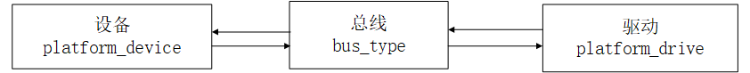

# README

linux platform设备驱动介绍。

# refers

* [linux platform设备驱动](https://blog.csdn.net/WANGYONGZIXUE/article/details/116231342)

# 驱动分离简介

## 一套标准的驱动框架

Linux 中的总线(bus)、驱动(driver)和设备(device)模型，也就是常说的驱动分离。

Linux 内核中大量的驱动程序都采用总线、驱动和设备模式。如 I2C、 SPI、 USB 等总线。但是在 SOC 中有些外设是没有总线这个概念的，但是又要使用总线，为了解决此问题， Linux 提出了 platform 这个虚拟总线，相应的就有 platform_driver 和 platform_device。

驱动设备匹配过程：设备和驱动通过总线双向查找


当我们向系统注册一个驱动的时候，总线就会在右侧的设备中查找，看看有没有与之匹配的设备，如果有的话就将两者联系起来。同样的，当向系统中注册一个设备的时候，总线就会在左侧的驱动中查找看有没有与之匹配的设备，有的话也联系起来。

## 详细匹配框图

分为两种：1、有设备树情况下，使用compatible属性；2、无设备树情况 使用.name属性


# platform驱动

驱动结构体
```C++
struct platform_driver {
	int (*probe)(struct platform_device *);
	int (*remove)(struct platform_device *);
	void (*shutdown)(struct platform_device *);
	int (*suspend)(struct platform_device *, pm_message_t state);
	int (*resume)(struct platform_device *);
	struct device_driver driver;
	const struct platform_device_id *id_table;
	bool prevent_deferred_probe;
 };
```
解析
* 1）包含结构体device_driver，相当于是platform_driver 的基类
* 2）platform_device_id 一种匹配方式
* 3）驱动主要实现probe函数，此函数在匹配后执行，非常重要！！！
```C++
struct device_driver {
	const struct of_device_id *of_match_table;
}
```
```C++
struct of_device_id {
	char name[32];
	 char type[32];
	char compatible[128];
	const void *data;
};
```
```C++
static const struct of_device_id xxx_of_match[] = {
{
	 .compatible = "imx6ul-led" },
	 { /* Sentinel */ }
};

/* platform驱动结构体 */
static struct platform_driver led_driver = {
	.driver		= {
		.name	= "imx6ul-led",			/* 驱动名字，用于和设备匹配 */
		.of_match_table = xxx_of_match,
	},
	.probe		= led_probe,
	.remove		= led_remove,
};
```

# platform设备

```C++
struct platform_device {
	const char *name;
	int id;
	bool id_auto;
	struct device dev;
	u32 num_resources;
	struct resource *resource;
	...
}
```

解析：
* 1）name与驱动的 name 字段相同，才能匹配
* 2）resource 表示资源，也就是设备信息，比如外设寄存器等

```C++
struct resource {
	resource_size_t start;
	resource_size_t end;
	const char *name;
	unsigned long flags;
	struct resource *parent, *sibling, *child;
};
```

说明：start 和 end 分别表示资源的起始和终止信息，对于内存类的资源，就表示内存起始和终止地址， name 表示资源名字， flags 表示资源类型。

## 实例

```C++
#define CCM_CCGR1_BASE				(0X020C406C)	
#define REGISTER_LENGTH				4

static struct resource led_resources[] = {
	[0] = {
		.start 	= CCM_CCGR1_BASE,
		.end 	= (CCM_CCGR1_BASE + REGISTER_LENGTH - 1),
		.flags 	= IORESOURCE_MEM,
	},	
}
```

## platform设备结构体

 ```C++
/*platform设备结构体 */
static struct platform_device leddevice = {
	.name = "imx6ul-led",
	.id = -1,
	.dev = {
		.release = &led_release,
	},
	.num_resources = ARRAY_SIZE(led_resources),
	.resource = led_resources,
};
```

# platform总线

```C++
/*总线结构体*/
struct bus_type platform_bus_type = {
	.name = "platform",
	.dev_groups = platform_dev_groups,
	.match = platform_match,
	.uevent = platform_uevent,
	.pm = &platform_dev_pm_ops,
};
```

* platform_match
```C++
static int platform_match(struct device *dev,struct device_driver *drv)
{
	struct platform_device *pdev = to_platform_device(dev);
	struct platform_driver *pdrv = to_platform_driver(drv);
	
	/*When driver_override is set,only bind to the matching driver*/
	if (pdev->driver_override)
		return !strcmp(pdev->driver_override, drv->name);
	
	 /* 1、设备树采用的匹配方式，device_driver 结构体中有个名为of_match_table的成员变量，此成员变量保存着驱动的compatible匹配表 与 设备树中的每个设备节点的 compatible 属性匹配*/
	if (of_driver_match_device(dev, drv))
		return 1;
	
	 /* 2、ACPI 匹配方式 */
	if (acpi_driver_match_device(dev, drv))
		 return 1;
	 /*3、id_table 匹配 */
	 if (pdrv->id_table)
	 	return platform_match_id(pdrv->id_table, pdev) != NULL;
	
	/* 4、直接匹配驱动和设备的name */
	return (strcmp(pdev->name, drv->name) == 0);
}
```

驱动和设备的匹配有四种方法,已经在程序中注释。

* 加载platform驱动
```C++
int platform_driver_register (struct platform_driver *driver)
```

* 卸载platform驱动
```C++
void platform_driver_unregister(struct platform_driver *drv)
```

# 设备树下的 platform 驱动
platform 驱动框架分为总线、设备和驱动，其中总线不需要我们这些驱动程序员去管理，这个是 Linux 内核提供的，我们在编写驱动的时候只要关注于设备和驱动的具体实现即可。在没有设备树的 Linux 内核下，我们需要分别编写并注册 platform_device 和 platform_driver，分别代表设备和驱动。在使用设备树的时候，设备的描述被放到了设备树中，因此 platform_device 就不需要我们去编写了，我们只需要实现 platform_driver 即可。

## 1、在设备树中创建设备节点
```c
gpioled {
	#address-cells = <1>;
	#size-cells = <1>;
	compatible = "atkalpha-gpioled";
	pinctrl-names = "default";
	pinctrl-0 = <&pinctrl_led>;
	led-gpio = <&gpio1 3 GPIO_ACTIVE_LOW>;
	status = "okay";
};
```
compatible 属性值为“atkalpha-gpioled”

## 2、编写 platform 驱动的时候要注意兼容属性
```C++
static const struct of_device_id leds_of_match[] = {
	{ .compatible = "atkalpha-gpioled" }, /* 兼容属性 */
	{ /* Sentinel */ }
}
MODULE_DEVICE_TABLE(of, leds_of_match);

/* platform驱动结构体 */
static struct platform_driver led_driver = {
	.driver		= {
		.name	= "imx6ul-led",			/* 驱动名字，用于和设备匹配 */
		.of_match_table = leds_of_match,
	},
	.probe		= led_probe,
	.remove		= led_remove,
};
```

.compatible 与设备树中的兼容性一致。

# 驱动程序
```C++
#include <linux/types.h>
#include <linux/kernel.h>
#include <linux/delay.h>
#include <linux/ide.h>
#include <linux/init.h>
#include <linux/module.h>
#include <linux/errno.h>
#include <linux/gpio.h>
#include <linux/cdev.h>
#include <linux/device.h>
#include <linux/of_gpio.h>
#include <linux/semaphore.h>
#include <linux/timer.h>
#include <linux/irq.h>
#include <linux/wait.h>
#include <linux/poll.h>
#include <linux/fs.h>
#include <linux/fcntl.h>
#include <linux/platform_device.h>
#include <asm/mach/map.h>
#include <asm/uaccess.h>
#include <asm/io.h>

#define LEDDEV_CNT		1				/* 设备号长度 	*/
#define LEDDEV_NAME		"dtsplatled"	/* 设备名字 	*/
#define LEDOFF 			0
#define LEDON 			1

/* leddev设备结构体 */
struct leddev_dev{
	dev_t devid;				/* 设备号	*/
	struct cdev cdev;			/* cdev		*/
	struct class *class;		/* 类 		*/
	struct device *device;		/* 设备		*/
	int major;					/* 主设备号	*/	
	struct device_node *node;	/* LED设备节点 */
	int led0;					/* LED灯GPIO标号 */
};

struct leddev_dev leddev; 		/* led设备 */

void led0_switch(u8 sta)
{
	if (sta == LEDON )
		gpio_set_value(leddev.led0, 0);
	else if (sta == LEDOFF)
		gpio_set_value(leddev.led0, 1);	
}


static int led_open(struct inode *inode, struct file *filp)
{
	filp->private_data = &leddev; 
	return 0;
}

static ssize_t led_write(struct file *filp, const char __user *buf, size_t cnt, loff_t *offt)
{
	int retvalue;
	unsigned char databuf[2];
	unsigned char ledstat;

	retvalue = copy_from_user(databuf, buf, cnt);
	if(retvalue < 0) {

		printk("kernel write failed!\r\n");
		return -EFAULT;
	}
	
	ledstat = databuf[0];
	if (ledstat == LEDON) {
		led0_switch(LEDON);
	} else if (ledstat == LEDOFF) {
		led0_switch(LEDOFF);
	}
	return 0;
}

/* 设备操作函数 */
static struct file_operations led_fops = {
	.owner = THIS_MODULE,
	.open = led_open,
	.write = led_write,
};


static int led_probe(struct platform_device *dev)
{	
	printk("led driver and device was matched!\r\n");
	/* 1、设置设备号 */
	if (leddev.major) {
		leddev.devid = MKDEV(leddev.major, 0);
		register_chrdev_region(leddev.devid, LEDDEV_CNT, LEDDEV_NAME);
	} else {
		alloc_chrdev_region(&leddev.devid, 0, LEDDEV_CNT, LEDDEV_NAME);
		leddev.major = MAJOR(leddev.devid);
	}

	/* 2、注册设备      */
	cdev_init(&leddev.cdev, &led_fops);
	cdev_add(&leddev.cdev, leddev.devid, LEDDEV_CNT);

	/* 3、创建类      */
	leddev.class = class_create(THIS_MODULE, LEDDEV_NAME);
	if (IS_ERR(leddev.class)) {
		return PTR_ERR(leddev.class);
	}

	/* 4、创建设备 */
	leddev.device = device_create(leddev.class, NULL, leddev.devid, NULL, LEDDEV_NAME);
	if (IS_ERR(leddev.device)) {
		return PTR_ERR(leddev.device);
	}

	/* 5、初始化IO */	
	leddev.node = of_find_node_by_path("/gpioled");
	if (leddev.node == NULL){
		printk("gpioled node nost find!\r\n");
		return -EINVAL;
	} 
	
	leddev.led0 = of_get_named_gpio(leddev.node, "led-gpio", 0);
	if (leddev.led0 < 0) {
		printk("can't get led-gpio\r\n");
		return -EINVAL;
	}

	gpio_request(leddev.led0, "led0");
	gpio_direction_output(leddev.led0, 1); /* 输出，高电平	*/
	return 0;
}

static int led_remove(struct platform_device *dev)
{
	gpio_set_value(leddev.led0, 1); 	/* 卸载驱动的时候关闭LED */

	cdev_del(&leddev.cdev);	
	unregister_chrdev_region(leddev.devid, LEDDEV_CNT); /* 注销设备号 */
	device_destroy(leddev.class, leddev.devid);
	class_destroy(leddev.class);
	return 0;
}

/* 匹配列表 */
static const struct of_device_id led_of_match[] = {
	{ .compatible = "atkalpha-gpioled" },
	{ /* Sentinel */ }
};

/* platform驱动结构体 */
static struct platform_driver led_driver = {
	.driver		= {
		.name	= "imx6ul-led",			/* 驱动名字，用于和设备匹配 */
		.of_match_table	= led_of_match, /* 设备树匹配表 		 */
	},
	.probe		= led_probe,
	.remove		= led_remove,
};
		
static int __init leddriver_init(void)
{
	return platform_driver_register(&led_driver);
}


static void __exit leddriver_exit(void)
{
	platform_driver_unregister(&led_driver);
}

module_init(leddriver_init);
module_exit(leddriver_exit);
MODULE_LICENSE("GPL");
MODULE_AUTHOR("wyong");
```